<style>
pre code, pre, code {
  white-space: pre !important;
  overflow-x: scroll !important;
  word-break: keep-all !important;
  word-wrap: initial !important;
}
</style>


#### Purpose of this file  

This file has all of the code for the the main analysis to reproduce all figures except Figure S9 in the Schmidt et al. manuscript entitled **"Microhabitats shape diversity-productivity relationships in freshwater bacterial communities"**, published by [FEMS Microbiology Ecology](https://doi.org/10.1093/femsec/fiaa029). To see how to reproduce figure S9 please see the github for this project and go to [analysis/OTU_Removal_Analysis.html](https://deneflab.github.io/Diversity_Productivity/analysis/OTU_Removal_Analysis.html)  on the github page.

##### If you have any questions, please be welcome to email the corresponding author at marschmi@umich.edu or tweet her at [micro_marian](https://twitter.com/micro_marian?lang=en).


# Load Libraries

```r
library(devtools)   # Reproducibility (see end of file)
library(phyloseq)   # Easier data manipulation  
library(picante)    # Phylogenetic Tree Analysis   
library(tidyverse)  # Pretty plotting and data manipulation 
library(forcats)    # Recoding factors
library(cowplot)    # Multiple plotting
library(picante)    # Will also include ape and vegan  
library(car)        # Residual analysis 
library(sandwich)   # vcovHC function in post-hoc test 
library(MASS)       # studres in plot_residuals function    
library(caret)      # Cross validation
library(pander)     # Pretty tables      
library(glmnet)     # Lasso regressions 
library(broom)      # Stats from lm regression 
library(purrr)      # Exporting lm results  
library(DT)         # Fancy HTML table output
library(lme4)       # linear mixed effects model
library(iNEXT)      # Calculate hill diversity with interpolation & extrapolation
library(hillR)      # Calculate phylogenetic hill numbers
library(hilldiv)    # Calculate hill phylogenetic hill numbers (for comparison)
library(phytools)   # for force.ultrametric() 
source("code/Muskegon_functions.R")   # Source custom functions  
source("code/set_colors.R")           # Set Colors for plotting

# Set the ggplot theme 
theme_set(theme_cowplot())
```


# Load data

```r
# Loads a phyloseq object named otu_merged_musk_pruned)
load("data/surface_PAFL_otu_pruned_raw.RData") 
# The name of the phyloseq object is: 
surface_PAFL_otu_pruned_raw 
```

```
## phyloseq-class experiment-level object
## otu_table()   OTU Table:         [ 7806 taxa and 24 samples ]
## sample_data() Sample Data:       [ 24 samples by 44 sample variables ]
## tax_table()   Taxonomy Table:    [ 7806 taxa by 8 taxonomic ranks ]
## phy_tree()    Phylogenetic Tree: [ 7806 tips and 7804 internal nodes ]
```

```r
# Remove doubletons
surface_PAFL_otu_pruned_rm2 <- prune_taxa(taxa_sums(surface_PAFL_otu_pruned_raw) > 2, surface_PAFL_otu_pruned_raw) 
surface_PAFL_otu_pruned_rm2
```

```
## phyloseq-class experiment-level object
## otu_table()   OTU Table:         [ 2979 taxa and 24 samples ]
## sample_data() Sample Data:       [ 24 samples by 44 sample variables ]
## tax_table()   Taxonomy Table:    [ 2979 taxa by 8 taxonomic ranks ]
## phy_tree()    Phylogenetic Tree: [ 2979 tips and 2977 internal nodes ]
```

```r
# How many OTUs left for analysis?
paste("There are", ntaxa(surface_PAFL_otu_pruned_rm2), "OTUs remaining for analysis in the dataset.")
```

```
## [1] "There are 2979 OTUs remaining for analysis in the dataset."
```

```r
# Remove tree for computational efficiency 
surface_PAFL_otu_pruned_notree_rm2 <- phyloseq(tax_table(surface_PAFL_otu_pruned_rm2), otu_table(surface_PAFL_otu_pruned_rm2), sample_data(surface_PAFL_otu_pruned_rm2)) 

# Gather the metadata in a dataframe
metadata <- data.frame(sample_data(surface_PAFL_otu_pruned_notree_rm2)) %>%
      mutate(fraction = factor(fraction, levels = c("WholePart","WholeFree")),
         lakesite = factor(lakesite,  levels = c("MOT", "MDP", "MBR", "MIN")),
         fraction = fct_recode(fraction, Particle = "WholePart", Free = "WholeFree"),
         lakesite = fct_recode(lakesite, Outlet = "MOT", Deep = "MDP", Bear = "MBR", River = "MIN"))
row.names(metadata) <- metadata$norep_filter_name

# Replace the sample data 
sample_data(surface_PAFL_otu_pruned_notree_rm2) <- metadata

# Create a dataframe for environmental data only
environmental_data <- metadata %>%
  dplyr::select(Temp_C:DO_percent, -BGA_cellspermL, -SRP_ugperL, fraction, norep_filter_name, -DO_percent) %>%
  dplyr::filter(fraction == "Free") %>%
  dplyr::select(-fraction) %>%
  tibble::column_to_rownames(var = "norep_filter_name") %>%
  dplyr::rename(Temp = Temp_C, SPC = SpCond_uSpercm,
         TDS = TDS_mgperL, ORP = ORP_mV,
         Chla = Chl_Lab_ugperL, Cl = Cl_mgperL,
         SO4 = SO4_mgperL, NO3 = NO3_mgperL,
         NH3 = NH3_mgperL, TKN = TKN_mgperL,
         TP = TP_ugperL, Alk = Alk_mgperL,
         DO = DO_mgperL) %>%
  as.matrix()
```


```r
#### PCA DATA 
# Scale the data so their variances are the same!
scaled_enviro <- scale(environmental_data)
# Sanity Checks: check that we get mean of 0 and sd of 1
apply(scaled_enviro, 2, mean)
```

```
##          Temp           SPC           TDS            pH           ORP          Chla            Cl           SO4           NO3           NH3           TKN            TP           Alk            DO 
## -3.151262e-16 -1.170392e-15 -8.881784e-16 -2.063155e-15  4.614635e-18  2.081668e-17 -2.937375e-16  3.932311e-16  1.237526e-16 -1.155579e-17  7.400583e-17 -5.090894e-17  1.454855e-15  7.401939e-17
```

```r
apply(scaled_enviro, 2, sd)
```

```
## Temp  SPC  TDS   pH  ORP Chla   Cl  SO4  NO3  NH3  TKN   TP  Alk   DO 
##    1    1    1    1    1    1    1    1    1    1    1    1    1    1
```

```r
# Run a redundnacy analysis (RDA) to extract the variation in the set of response variables 
pca_environ <- rda(scaled_enviro) 
# What is the proportion explained by each of the PCA axes? 
summary(pca_environ)$cont$importance
```

```
## Importance of components:
##                          PC1    PC2    PC3    PC4     PC5     PC6     PC7      PC8     PC9    PC10      PC11
## Eigenvalue            5.4670 4.2310 2.0103 0.9674 0.52881 0.34976 0.24025 0.119868 0.05488 0.02604 0.0047450
## Proportion Explained  0.3905 0.3022 0.1436 0.0691 0.03777 0.02498 0.01716 0.008562 0.00392 0.00186 0.0003389
## Cumulative Proportion 0.3905 0.6927 0.8363 0.9054 0.94317 0.96816 0.98532 0.993881 0.99780 0.99966 1.0000000
```

```r
# Pull out all of the PCA scores into a dataframe
pca_scores_df <- summary(pca_environ)$sites %>%
  as.data.frame() %>%
  tibble::rownames_to_column(var = "norep_filter_name") %>%
  mutate(norep_water_name = paste(substr(norep_filter_name, 1, 4), substr(norep_filter_name, 6, 8), sep = "")) %>%
  dplyr::select(-c(norep_filter_name, PC3, PC4, PC5, PC6))
# Combine the above dataframe with the rest of the metadata
metadata_pca <- metadata %>%
  mutate(norep_water_name = paste(substr(norep_filter_name, 1, 4), substr(norep_filter_name, 6, 8), sep = "")) %>%
  left_join(pca_scores_df, by = "norep_water_name")
```


# Calculate Diversity

## Hill Diversity
**Hill diversity with the iNEXT package**

```r
# Prepare the input data for iNEXT
iNEXT_input_table <- otu_table(surface_PAFL_otu_pruned_rm2) %>%
  t() %>%
  data.frame()
#set.seed(777)
# Run iNEXT on the data - it takes a long time to run! So here we will load in the object that was previously created with the following line of code:
#iNEXT_data <- iNEXT(iNEXT_input_table, q = c(0,1,2), datatype = "abundance")
#save(list="iNEXT_data", file=paste0("data/iNEXT/iNEXT_data_surface_PAFL_otu_pruned_rm2")) 
# Load the data
load("data/iNEXT/iNEXT_data_surface_PAFL_otu_pruned_rm2")
#str(iNEXT_data)
# Pull out into a dataframe
div_iNEXT <- iNEXT_data$AsyEst %>%
  rename(norep_filter_name = Site) 
```


## Phylo Hill Diversity
**Phylogenetic Hill diversity with the hillR package**

```r
# Here I will use hillR to calculate the phylogenetic diversity,
# which uses an extension of the hill numbers 
#otu_mat <- data.frame(otu_table(surface_PAFL_otu_pruned_rm2))
#phy_tree <- phy_tree(surface_PAFL_otu_pruned_rm2)
set.seed(111)
# Calculate the Hill phylogenetic diversity metric from the hillR package
# The output from this command is a named vector with the sample name and the div value.
#hill_phy0_df <- hill_phylo(comm = otu_mat, tree = phy_tree, q = 0)
#hill_phy1_df <- hill_phylo(comm = otu_mat, tree = phy_tree, q = 1)
#hill_phy2_df <- hill_phylo(comm = otu_mat, tree = phy_tree, q = 2)
# Pull out the sample names
#norep_filter_name <- names(hill_phy0_df) 
#stopifnot(names(hill_phy0_df) == names(hill_phy1_df))
#stopifnot(names(hill_phy1_df) == names(hill_phy2_df))
# Pull out the hill phylo div values
#div_sample_names <- rep(norep_filter_name, times = 3)
#phylo_div_vals <- c(unname(hill_phy0_df), unname(hill_phy1_df), unname(hill_phy2_df)) # rich, shannon, simpson
#phylo_div_types <- c(rep("Species richness", times = 24), rep("Shannon diversity", times = 24), rep("Simpson diversity", times = 24))
# Put it all in a dataframe 
#hillR_output <- data.frame(div_sample_names, phylo_div_vals, phylo_div_types) %>%
#  rename(norep_filter_name = div_sample_names, Diversity = phylo_div_types,
#         hillR_phylo = phylo_div_vals) 
# save to file because hillR is computationally intensive 
#write.csv(x = hillR_output, file = "data/iNEXT/hillR_output.csv", row.names = FALSE, quote = FALSE)
# Because hillR takes so much time to calculate - I'll load in a previously computed version (from the code above)
hillR_output <- read.csv("data/iNEXT/hillR_output.csv") %>%
  mutate(Diversity = fct_recode(Diversity, "phylo_richness" = "Species richness", 
                                "phylo_shannon" = "Shannon diversity", 
                                "phylo_simpson" = "Simpson diversity")) %>%
  spread(key = Diversity, value = hillR_phylo)
```

**Put together the diversity dataframes into one**

```r
# COMBINE iNEXT AND hillR DATA - should now be 144 rows
div_df <- 
  div_iNEXT %>%
  dplyr::select(norep_filter_name, Diversity, Observed) %>%
  mutate(Diversity = fct_recode(Diversity, "richness" = "Species richness", 
                                "shannon" = "Shannon diversity", 
                                "simpson" = "Simpson diversity")) %>%
  # For this analysis, we will be using the observed values calculated from iNEXT
  spread(key = Diversity, value = Observed) %>%
  left_join(hillR_output)
```

## Mean Pairwise Distance

```r
# Read in the tree 
#RAREFIED_rm2_fasttree <- read.tree(file = "data/PhyloTree/newick_tree_rm2_rmN.tre")
  
# Load in data that has doubletons removed 
#load("data/PhyloTree/surface_PAFL_otu_pruned_RAREFIED_rm2.RData")
#surface_PAFL_otu_pruned_RAREFIED_rm2
# Create the OTU table for picante 
#surface_PAFL_RAREFIED_rm2_otu <- matrix(otu_table(surface_PAFL_otu_pruned_RAREFIED_rm2), nrow = nrow(otu_table(surface_PAFL_otu_pruned_RAREFIED_rm2)))
#rownames(surface_PAFL_RAREFIED_rm2_otu) <- sample_names(surface_PAFL_otu_pruned_RAREFIED_rm2)
#colnames(surface_PAFL_RAREFIED_rm2_otu) <- taxa_names(surface_PAFL_otu_pruned_RAREFIED_rm2)
    
  ## Calculate input for SES_MPD  
# Convert the abundance data to standardized abundanced vegan function `decostand' , NOTE: method = "total"
#otu_decostand_total <- decostand(surface_PAFL_RAREFIED_rm2_otu, method = "total")
# check total abundance in each sample
#apply(otu_decostand_total, 1, sum)
# check for mismatches/missing species between community data and phylo tree
#RAREFIED_rm2_matches <- match.phylo.comm(RAREFIED_rm2_fasttree, otu_decostand_total)
# the resulting object is a list with $phy and $comm elements.  replace our
# original data with the sorted/matched data
#phy_RAREFIED_rm2 <- RAREFIED_rm2_matches$phy
#comm_RAREFIED_rm2 <- RAREFIED_rm2_matches$comm
# Calculate the phylogenetic distances
#phy_dist_RAREFIED_rm2 <- cophenetic(phy_RAREFIED_rm2)
## Calculate SES_MPD
###################################### INDEPENDENT SWAP ############################################
# calculate standardized effect size mean pairwise distance (ses.mpd)
#unweighted_sesMPD_indepswap_RAREFIED_rm2 <- ses.mpd(comm_RAREFIED_rm2, phy_dist_RAREFIED_rm2, null.model = "independentswap", 
#                                     abundance.weighted = FALSE, runs = 999)
#unweight_sesmpd <- unweighted_sesMPD_indepswap_RAREFIED_rm2 %>% rownames_to_column(var = "norep_filter_name")
#WEIGHTED_sesMPD_indepswap_RAREFIED_rm2 <- ses.mpd(comm_RAREFIED_rm2, phy_dist_RAREFIED_rm2, null.model = "independentswap", 
#                                     abundance.weighted = TRUE, runs = 999)
#weight_sesmpd <- WEIGHTED_sesMPD_indepswap_RAREFIED_rm2 %>% rownames_to_column(var = "norep_filter_name")
# Combine them together into a dataframe
#sesmpd_df <- unweight_sesmpd %>%
#  dplyr::select(norep_filter_name, mpd.obs.z) %>%
#  rename(unweighted_sesmpd = mpd.obs.z) %>%
#  left_join(dplyr::select(weight_sesmpd, norep_filter_name, mpd.obs.z), by = "norep_filter_name") %>%
#  rename(weighted_sesmpd = mpd.obs.z)
# Gather ALL div data!
#div_df <- div_df %>%
#  left_join(sesmpd_df, by = "norep_filter_name")
#write.csv(div_df, file = "data/iNEXT/diversity_measures.csv", quote = FALSE, row.names = FALSE)
```

#### Final dataframe

```r
div_df <- read.csv(file = "data/iNEXT/diversity_measures.csv")

# Create the final dataframe!
comb_div_df <- div_df %>%
  left_join(metadata_pca, by = "norep_filter_name") %>%
  gather(key = "Diversity", value = "Observed", richness:phylo_richness) %>%  
  data.frame()
head(comb_div_df)
```

```
##   norep_filter_name unweighted_sesmpd weighted_sesmpd lakesite limnion fraction year       project season       Date Sample_depth_m Temp_C SpCond_uSpercm TDS_mgperL   pH ORP_mV Chl_Lab_ugperL BGA_cellspermL Cl_mgperL SO4_mgperL NO3_mgperL NH3_mgperL
## 1          MBREJ515       -1.36369616      -0.3509426     Bear     Top Particle 2015 Muskegon_Lake Spring 2015-05-12           0.82  14.77            373        243 8.19    528           1.41           1357        22         15       0.44       0.04
## 2          MBREJ715        0.33840254      -0.4227629     Bear     Top Particle 2015 Muskegon_Lake Summer 2015-07-21           0.88  22.80            369        240 8.44    354           1.63             NA        20         15       0.24       0.08
## 3          MBREJ915       -1.21418544      -0.4110070     Bear     Top Particle 2015 Muskegon_Lake   Fall 2015-09-30           1.91  19.23            397        258 8.43    396           4.41           4581        16         13       0.06       0.05
## 4          MBREK515       -0.09266448      -0.5437908     Bear     Top     Free 2015 Muskegon_Lake Spring 2015-05-12           0.82  14.77            373        243 8.19    528           1.41           1357        22         15       0.44       0.04
## 5          MBREK715        0.37258574      -0.4518195     Bear     Top     Free 2015 Muskegon_Lake Summer 2015-07-21           0.88  22.80            369        240 8.44    354           1.63             NA        20         15       0.24       0.08
## 6          MBREK915        0.73470799      -0.4679077     Bear     Top     Free 2015 Muskegon_Lake   Fall 2015-09-30           1.91  19.23            397        258 8.43    396           4.41           4581        16         13       0.06       0.05
##   TKN_mgperL SRP_ugperL TP_ugperL Alk_mgperL DO_mgperL DO_percent Turb_NTU station total_bac_abund SE_total_bac_abund attached_bac SE_attached_bac perc_attached_abund SE_perc_attached_abund tot_bacprod SD_tot_bacprod frac_bacprod SD_frac_bacprod
## 1       0.48          3      12.5        141      9.42       93.0       NA    Bear        494026.5           25757.69      24766.5        24766.50            3.518519               3.518519        29.3           10.8         17.0             5.5
## 2       0.63          3      18.3        139      7.75       90.1       NA    Bear        890290.5           32334.05      44319.0        13519.94            4.772843               1.468646        11.9            2.1          2.5             1.3
## 3       0.44          5      20.1        150      8.57       92.9     10.7    Bear        419727.0           25226.22      39105.0        13833.79            8.355440               2.822126        22.2            0.8         10.9             0.4
## 4       0.48          3      12.5        141      9.42       93.0       NA    Bear        494026.5           25757.69      24766.5        24766.50            3.518519               3.518519        29.3           10.8         18.5             5.8
## 5       0.63          3      18.3        139      7.75       90.1       NA    Bear        890290.5           32334.05      44319.0        13519.94            4.772843               1.468646        11.9            2.1          9.3             3.4
## 6       0.44          5      20.1        150      8.57       92.9     10.7    Bear        419727.0           25226.22      39105.0        13833.79            8.355440               2.822126        22.2            0.8         11.3             0.5
##   perc_attached_bacprod SD_perc_attached_bacprod dnaconcrep1 fraction_bac_abund fracprod_per_cell fracprod_per_cell_noinf norep_water_name        PC1        PC2 Diversity Observed
## 1              48.48302                7.9234469        0.93            24766.5      6.864111e-07            6.864111e-07          MBRE515  1.1481756 -0.9731604  richness     1150
## 2              23.23855               16.2450873      1.7454            44319.0      5.640922e-08            5.640922e-08          MBRE715  0.5133287  1.7749878  richness      919
## 3              49.04200                0.9284521      5.3705            39105.0      2.787367e-07            2.787367e-07          MBRE915 -0.4411689  0.4090856  richness      637
## 4              48.48302                7.9234469     3.94128           469260.0      3.942377e-08            3.942377e-08          MBRE515  1.1481756 -0.9731604  richness      467
## 5              23.23855               16.2450873      5.4083           845971.5      1.099328e-08            1.099328e-08          MBRE715  0.5133287  1.7749878  richness      396
## 6              49.04200                0.9284521      2.6542           380622.0      2.968825e-08            2.968825e-08          MBRE915 -0.4411689  0.4090856  richness      552
```

```r
dim(comb_div_df)
```

```
## [1] 144  51
```

```r
# #Prepare dataframe for calculations
div_df_frac <- metadata %>%
  dplyr::select(norep_filter_name, fraction, season) %>%
  right_join(div_iNEXT, by = "norep_filter_name")
## The following data will the be primary dataframe used in this analysis

# Wide format dataframe for plotting
wide_div_meta_df <- div_df %>%
  left_join(metadata_pca, by = "norep_filter_name")

### BASIC STATS OF PRODUCTION AND # OF CELL
std <- function(x) sd(x)/sqrt(length(x))

# For the beginning of the results section 
wide_div_meta_df %>%
  group_by(fraction) %>%
  summarize(avg_cells_per_mL = mean(fraction_bac_abund), 
            se_cells_per_mL = std(fraction_bac_abund), 
            avg_community_prod = mean(frac_bacprod),
            se_community_prod = std(frac_bacprod))
```

```
## # A tibble: 2 x 5
##   fraction avg_cells_per_mL se_cells_per_mL avg_community_prod se_community_prod
##   <fct>               <dbl>           <dbl>              <dbl>             <dbl>
## 1 Particle           41169.           7418.               9.96              2.38
## 2 Free              734522.          86601.              24.1               5.06
```

```r
wide_div_meta_df %>%
  dplyr::filter(norep_filter_name != "MOTEJ515") %>%
  group_by(fraction) %>%
  summarize(avg_log10_percap_prod = mean(log10(fracprod_per_cell)),
            se_log10_percap_prod = std(log10(fracprod_per_cell)))
```

```
## # A tibble: 2 x 3
##   fraction avg_log10_percap_prod se_log10_percap_prod
##   <fct>                    <dbl>                <dbl>
## 1 Particle                 -6.73                0.160
## 2 Free                     -7.58                0.114
```


# Main Figures
**Have a legend for all plots**  
Since there's a set parameter in  `set_colors.R` file that was sourced at the beginning, we can use this throughout to can assure that the below legends will represent the legends called afterwards. 

```r
####### Legend for season
legend_plot <- ggplot(metadata, aes(y = frac_bacprod, x = fraction, fill = fraction, shape = season)) + 
  geom_jitter(size = 3, width = 0.2) + 
  scale_fill_manual(values = fraction_colors, guide = guide_legend(override.aes = list(shape = 22, size = 4))) +
  scale_shape_manual(values = season_shapes, guide = guide_legend(override.aes = list(size = 4))) +
  theme(legend.position = "bottom", axis.title.x = element_blank(),
        legend.title = element_blank(), legend.justification="center",
        plot.margin = unit(c(0.2,0.2,1,0.2), "cm")) # top, right, bottom, and left margins
# Extract the legend
season_legend <- cowplot::get_legend(legend_plot + theme(legend.direction = "horizontal",legend.justification="center" ,legend.box.just = "bottom"))


### Make it 2 rows for plots that are skinnier
####### Legend for season 
season_2row_plot <- ggplot(metadata, aes(y = frac_bacprod, x = fraction, fill = fraction, shape = season)) + 
  geom_jitter(size = 3, width = 0.2) + 
  scale_fill_manual(values = fraction_colors, guide = guide_legend(override.aes = list(shape = 22, size = 4))) +
  scale_shape_manual(values = season_shapes, guide = guide_legend(override.aes = list(size = 4))) +
  theme(legend.position = "bottom",  legend.justification="center",
        axis.title.x = element_blank(),
        legend.title = element_blank(), legend.box = "vertical",
        legend.spacing.y = unit(0.1, 'cm'),
        plot.margin = unit(c(0.2,0.2,1,0.2), "cm")) # top, right, bottom, and left margins
# Extract the legend
season_2row_legend <- cowplot::get_legend(season_2row_plot + theme(legend.direction = "horizontal",legend.justification="center" ,legend.box.just = "bottom"))

####### Legend for lakesite
lakesite_legend <- ggplot(metadata, aes(y = frac_bacprod, x = fraction, fill = fraction, shape = lakesite)) + 
  geom_jitter(size = 3, width = 0.2) + 
  scale_fill_manual(values = fraction_colors, guide = guide_legend(override.aes = list(shape = 22, size = 4))) +
  scale_shape_manual(values = lakesite_shapes, guide = guide_legend(override.aes = list(size = 4))) +
  theme(legend.position = "bottom", axis.title.x = element_blank(),
        legend.title = element_blank(), legend.justification="center",
        plot.margin = unit(c(0.2,0.2,1,0.2), "cm")) # top, right, bottom, and left margins
# Extract the legend
lakesite_legend <-  cowplot::get_legend(lakesite_legend + theme(legend.direction = "horizontal",legend.justification="center" ,legend.box.just = "bottom"))
```


## Figure 1

```r
######################################################### Fraction ABUNDANCe 
frac_abund_wilcox <- wilcox.test(log10(as.numeric(fraction_bac_abund)) ~ fraction, data = metadata)
frac_abund_wilcox
```

```
## 
## 	Wilcoxon rank sum test
## 
## data:  log10(as.numeric(fraction_bac_abund)) by fraction
## W = 0, p-value = 1.479e-06
## alternative hypothesis: true location shift is not equal to 0
```

```r
metadata %>%
  group_by(fraction) %>%
  summarize(mean(as.numeric(fraction_bac_abund)))
```

```
## # A tibble: 2 x 2
##   fraction `mean(as.numeric(fraction_bac_abund))`
##   <fct>                                     <dbl>
## 1 Particle                                 41169.
## 2 Free                                    734522.
```

```r
# Make a data frame to draw significance line in boxplot (visually calculated)
dat1 <- data.frame(a = c(1.1,1.1,1.9,1.9), b = c(6.45,6.5,6.5,6.45)) # WholePart vs WholeFree

poster_a <- 
  ggplot(filter(metadata, norep_filter_name != "MOTEJ515"), 
       aes(y = log10(as.numeric(fraction_bac_abund)), x = fraction)) +
  geom_jitter(size = 3, aes(fill = fraction, shape = season), width = 0.2) + 
  geom_boxplot(alpha = 0.5, outlier.shape = NA, aes( fill = fraction)) +
  #ylab("Log10(Bacterial Counts) \n (cells/mL)") +
  ylab(expression(atop(log[10]*"(Bacterial Counts)", "(cells/mL)"))) + 
  scale_fill_manual(values = fraction_colors) +
  scale_shape_manual(values = season_shapes) +
  ##### Particle vs free cell abundances 
  geom_path(data = dat1, aes(x = a, y = b), linetype = 1, color = "gray40") +
  annotate("text", x=1.5, y=6.55, size = 8, color = "gray40", label= paste("***")) +
  annotate("text", x=1.5, y=6.4, size = 3.5, color = "gray40",
           label= paste("p =", round(frac_abund_wilcox$p.value, digits = 6))) +
  theme(legend.position = "bottom",
        legend.title = element_blank(),
        axis.title.x = element_blank())

######################################################### TOTAL PRODUCTION 
totprod_wilcox <- wilcox.test(frac_bacprod ~ fraction, data = metadata)
totprod_wilcox
```

```
## 
## 	Wilcoxon rank sum test
## 
## data:  frac_bacprod by fraction
## W = 33, p-value = 0.02418
## alternative hypothesis: true location shift is not equal to 0
```

```r
metadata %>%
  group_by(fraction) %>%
  summarize(mean(frac_bacprod))
```

```
## # A tibble: 2 x 2
##   fraction `mean(frac_bacprod)`
##   <fct>                   <dbl>
## 1 Particle                 9.96
## 2 Free                    24.1
```

```r
# Make a data frame to draw significance line in boxplot (visually calculated)
dat2 <- data.frame(a = c(1.1,1.1,1.9,1.9), b = c(71,72,72,71)) # WholePart vs WholeFree

poster_b <- ggplot(metadata, aes(y = frac_bacprod, x = fraction)) + 
  geom_jitter(size = 3, aes(fill = fraction, shape = season), width = 0.2) + 
  geom_boxplot(alpha = 0.5, outlier.shape = NA, aes( fill = fraction)) +
  scale_fill_manual(values = fraction_colors, guide = FALSE) +
  scale_shape_manual(values = season_shapes) +
  scale_y_continuous(limits = c(0, 78), expand = c(0,0), breaks = seq(0, 75, by = 15)) +
  #ylab("Community Production \n (μgC/L/day)") +
  ylab(expression(atop("Community Production", "(μgC/L/day)"))) + 
  ##### Particle vs free bulk production  
  geom_path(data = dat2, aes(x = a, y = b), linetype = 1, color = "gray40") +
  annotate("text", x=1.5, y=73, size = 8, color = "gray40", label= paste("*")) +
  annotate("text", x=1.5, y=69, size = 3.5, color = "gray40",
           label= paste("p =", round(totprod_wilcox$p.value, digits = 3))) +
  theme(legend.position = "none",
        axis.title.x = element_blank())

######################################################### TOTAL PRODUCTION 
percellprod_wilcox <- wilcox.test(log10(fracprod_per_cell) ~ fraction, data = filter(metadata, norep_filter_name != "MOTEJ515"))
percellprod_wilcox
```

```
## 
## 	Wilcoxon rank sum test
## 
## data:  log10(fracprod_per_cell) by fraction
## W = 125, p-value = 6.656e-05
## alternative hypothesis: true location shift is not equal to 0
```

```r
filter(metadata, norep_filter_name != "MOTEJ515") %>%
  group_by(fraction) %>%
  summarize(mean(fracprod_per_cell))
```

```
## # A tibble: 2 x 2
##   fraction `mean(fracprod_per_cell)`
##   <fct>                        <dbl>
## 1 Particle              0.000000482 
## 2 Free                  0.0000000387
```

```r
# Make a data frame to draw significance line in boxplot (visually calculated)
dat3 <- data.frame(a = c(1.1,1.1,1.9,1.9), b = c(-5.05,-5,-5,-5.05)) # WholePart vs WholeFree

line_2c <- expression("log" ~~ sqrt(x, y) ~~ "or this" ~~ sum(x[i], i==1, n) ~~ "math expression")


poster_c <- ggplot(filter(metadata, norep_filter_name != "MOTEJ515"), 
       aes(y = log10(fracprod_per_cell), x = fraction)) +
  geom_jitter(size = 3, aes(fill = fraction, shape = season), width = 0.2) + 
  geom_boxplot(alpha = 0.5, outlier.shape = NA, aes( fill = fraction)) +
  scale_fill_manual(values = fraction_colors, guide = FALSE) +
  scale_shape_manual(values = season_shapes) +
  ylim(c(-8.5, -4.9)) + 
  ylab(expression(atop(log[10]*"(Per-Capita Production)", "(μgC/cell/day)"))) + 
  #ylab("Log10(Per-Capita Production) \n(μgC/cell/day)") +
  ##### Particle vs free per-cell production 
  geom_path(data = dat3, aes(x = a, y = b), linetype = 1, color = "gray40") +
  annotate("text", x=1.5, y=-4.95, size = 8, color = "gray40", label= paste("***")) +
  annotate("text", x=1.5, y=-5.15,  size = 3.5, color = "gray40",
           label= paste("p =", round(percellprod_wilcox$p.value, digits = 5))) +
  theme(legend.position = "none",
        axis.title.x = element_blank())

######## FIGURE 1
row1_plots <- plot_grid(poster_a + theme(legend.position = "none"), poster_b, poster_c,
          labels = c("A", "B", "C"),
          ncol = 3, nrow = 1)
fig_1 <- plot_grid(row1_plots, season_legend,
           ncol = 1, nrow = 2, 
           rel_heights = c(1, 0.05)); fig_1
```


```r
# What are the averages? 
metadata %>%
  group_by(fraction) %>%
  dplyr::select(frac_bacprod, fracprod_per_cell_noinf) %>%
  na.omit() %>%
  summarize(avg_comm_prod = mean(frac_bacprod),
            avg_percell_prod = mean(fracprod_per_cell_noinf),
            log10_avg_percell_prod = log10(avg_percell_prod))
```

```
## # A tibble: 2 x 4
##   fraction avg_comm_prod avg_percell_prod log10_avg_percell_prod
##   <fct>            <dbl>            <dbl>                  <dbl>
## 1 Particle          9.83     0.000000482                   -6.32
## 2 Free             24.1      0.0000000387                  -7.41
```

## Figure 2

```r
site_div_order <- c("richness","shannon","simpson","unweighted_sesmpd",
                    "phylo_richness", "phylo_shannon","phylo_simpson", "weighted_sesmpd") 

site_div_labs <- c("{}^0*italic(D)", "{}^1*italic(D)","{}^2*italic(D)", "italic(Unweighted_MPD)",
                   "{}^0*italic(PD)", "{}^1*italic(PD)","{}^2*italic(PD)", "italic(Weighted_MPD)")

long_div_meta_df <- 
  wide_div_meta_df %>%
  dplyr::select(c(norep_filter_name, richness:weighted_sesmpd, fraction, lakesite, season)) %>%
  gather(key = Diversity, value = div_val, richness:weighted_sesmpd) %>%
  mutate(Diversity = fct_relevel(Diversity, levels = site_div_order),
         hill_labels = factor(Diversity, labels = site_div_labs))


wc_pafl_pvals1 <-  c(wilcox.test(richness ~ fraction, data = wide_div_meta_df)$p.value,
                    wilcox.test(shannon ~ fraction, data = wide_div_meta_df)$p.value, 
                    wilcox.test(simpson ~ fraction, data = wide_div_meta_df)$p.value, 
                    wilcox.test(unweighted_sesmpd ~ fraction, data = wide_div_meta_df)$p.value,
                    # Row 2 
                    wilcox.test(phylo_richness ~ fraction, data = wide_div_meta_df)$p.value, 
                    wilcox.test(phylo_shannon ~ fraction, data = wide_div_meta_df)$p.value,
                    wilcox.test(phylo_simpson ~ fraction, data = wide_div_meta_df)$p.value, 
                    wilcox.test(weighted_sesmpd ~ fraction, data = wide_div_meta_df)$p.value)

pafl_pvals_adjusted <- p.adjust(wc_pafl_pvals1, method = "fdr")

wc_pafl_pvals <-  c(paste("p=", round(pafl_pvals_adjusted[1], digits = 3), sep = ""),
                    paste("p=", round(pafl_pvals_adjusted[2], digits = 3), sep = ""),
                    paste("N", "S", sep = ""),
                    paste("p=", round(pafl_pvals_adjusted[4], digits = 2), sep = ""),
                    # Row 2 
                    paste("p=", round(pafl_pvals_adjusted[5], digits = 3),sep = ""),
                    paste("p=", round(pafl_pvals_adjusted[6], digits = 3), sep = ""),
                    paste("p=", round(pafl_pvals_adjusted[7], digits = 3), sep = ""),
                    paste("N", "S", sep = ""))

fraction <- as.character(rep("Free", 8))

# Maximum Diversity Values by Fraction 
wide_div_meta_df %>%
  group_by(fraction) %>%
  summarize(max_rich = max(richness), max_shan = max(shannon), max_simps = max(simpson), max_umpd = max(unweighted_sesmpd), 
            # row 2
            max_phyrich = max(phylo_richness), max_physhan = max(phylo_shannon), max_physimps = max(phylo_simpson), max_wmpd = max(weighted_sesmpd))
```

```
## # A tibble: 2 x 9
##   fraction max_rich max_shan max_simps max_umpd max_phyrich max_physhan max_physimps  max_wmpd
##   <fct>       <int>    <dbl>     <dbl>    <dbl>       <dbl>       <dbl>        <dbl>     <dbl>
## 1 Particle     1394     307.      80.2     1.49        154.       15.8          5.94  0.141   
## 2 Free          767     102.      43.4     1.00        108.        8.44         4.05 -0.000646
```

```r
# Minimum Diversity Values by Fraction 
wide_div_meta_df %>%
  group_by(fraction) %>%
  summarize(min_rich = min(richness), min_shan = min(shannon), min_simps = min(simpson), max_umpd = min(unweighted_sesmpd), 
            # row 2
            max_phyrich = min(phylo_richness), max_physhan = min(phylo_shannon), max_physimps = min(phylo_simpson), max_wmpd = min(weighted_sesmpd))
```

```
## # A tibble: 2 x 9
##   fraction min_rich min_shan min_simps max_umpd max_phyrich max_physhan max_physimps max_wmpd
##   <fct>       <int>    <dbl>     <dbl>    <dbl>       <dbl>       <dbl>        <dbl>    <dbl>
## 1 Particle      468     42.2      12.6  -1.36          69.5        5.32         2.48   -0.749
## 2 Free          326     32.8      12.2  -0.0927        50.3        3.91         1.59   -0.770
```

```r
# Locations of labels 
maxes <- c(1350, 299, 78, 1.35, 150, 15.2, 5.8, 0.1)
df_temp <- data.frame(hill_labels = site_div_labs, wc_pafl_pvals, fraction, maxes) 

fig2 <- long_div_meta_df %>% 
  dplyr::filter(Diversity %in% c("richness", "shannon", "simpson", "unweighted_sesmpd")) %>%
  ggplot(aes(y = div_val, x = fraction, fill = fraction)) +
  ylab("Value") +
  facet_wrap(hill_labels~., scales = "free", labeller = label_parsed, nrow = 2, ncol = 4) + 
  geom_point(size = 3, position = position_jitterdodge(), aes(shape = season)) +
  geom_boxplot(alpha = 0.5, outlier.shape = NA, color = "black") +
  scale_fill_manual(values = fraction_colors) + 
  scale_shape_manual(values = season_shapes) + 
  scale_color_manual(values = fraction_colors) + 
  theme(legend.position = "none", axis.title.x = element_blank()) +
  geom_text(data = dplyr::filter(df_temp, hill_labels %in% c("{}^0*italic(D)", "{}^1*italic(D)","{}^2*italic(D)", "italic(Unweighted_MPD)")), 
            aes(x = fraction, y = maxes, label = wc_pafl_pvals), size = 4.5, hjust = 0.5,color = "grey40") 

plot_grid(fig2, season_legend, nrow =2, ncol =1, rel_heights = c(1, 0.05))
```

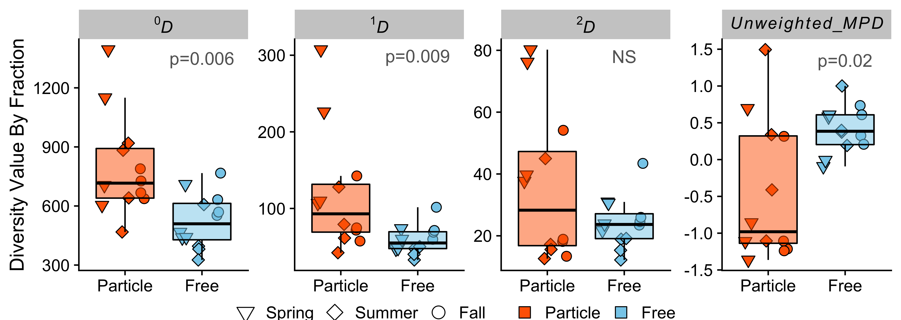

### Linear Models 
**Prepare data frames for table S1 and S2**

```r
## Prepare the dataframes for Free and Particle data
metadata_pca_PD_free <- dplyr::filter(wide_div_meta_df, fraction == "Free")
metadata_pca_PD_part <-  dplyr::filter(wide_div_meta_df, fraction == "Particle")  

# List of environmental variables to run linear models on 
        # BGA_cellspermL and Turb_NTU do not have enough data points for regression
lm_variables <- c("frac_bacprod", "fracprod_per_cell_noinf", "Temp_C", "SpCond_uSpercm", "TDS_mgperL", 
                  "pH", "ORP_mV", "Chl_Lab_ugperL", "Cl_mgperL", "SO4_mgperL", "NO3_mgperL", 
                  "NH3_mgperL", "TKN_mgperL", "SRP_ugperL", "TP_ugperL", "Alk_mgperL", "DO_mgperL", 
                  "total_bac_abund","attached_bac", "dnaconcrep1", 
                  "PC1", "PC2", 
                  "richness", "shannon", "simpson", "phylo_richness", "phylo_shannon", "phylo_simpson",
                  "unweighted_sesmpd", "weighted_sesmpd") 

########################################################
##############  Particle: Community-wide 
lm_summary_particle_comm <- metadata_pca_PD_part %>%
  dplyr::select(one_of(lm_variables), -fracprod_per_cell_noinf) %>%
  gather(key = independent, value = measurement, -frac_bacprod) %>%
  mutate(measurement = as.numeric(measurement)) %>%
  group_by(independent) %>% 
  do(glance(lm(frac_bacprod ~ measurement, data = .))) %>% 
  mutate(fraction = "Particle", dependent = "Community Production") %>%
  dplyr::select(fraction, dependent, independent, logLik, AIC, adj.r.squared, p.value) %>%
  ungroup() %>%
  mutate(FDR.p = p.adjust(p.value, method = "fdr")) 

##############  Particle: Per-capita  
lm_summary_particle_percap <- metadata_pca_PD_part %>%
  dplyr::select(one_of(lm_variables), -frac_bacprod) %>%
  filter(!is.na(fracprod_per_cell_noinf)) %>%   # Remove samples that are not NA
  gather(key = independent, value = measurement, -fracprod_per_cell_noinf) %>%
  mutate(measurement = as.numeric(measurement)) %>%
  group_by(independent) %>% 
  do(glance(lm(log10(fracprod_per_cell_noinf) ~ measurement, data = .))) %>% 
  mutate(fraction = "Particle", dependent = "Per-Capita Production") %>%
  dplyr::select(fraction, dependent, independent, logLik, AIC, adj.r.squared, p.value) %>%
  ungroup() %>%
  mutate(FDR.p = p.adjust(p.value, method = "fdr")) 


########################################################
##############  Free: Community-wide 
lm_summary_free_comm <- metadata_pca_PD_free %>%
  dplyr::select(one_of(lm_variables), -fracprod_per_cell_noinf) %>%
  gather(key = independent, value = measurement, -frac_bacprod) %>%
  mutate(measurement = as.numeric(measurement)) %>%
  group_by(independent) %>% 
  do(glance(lm(frac_bacprod ~ measurement, data = .))) %>% 
  mutate(fraction = "Free", dependent = "Community Production") %>%
  dplyr::select(fraction, dependent, independent, logLik, AIC, adj.r.squared, p.value) %>%
  ungroup() %>%
  mutate(FDR.p = p.adjust(p.value, method = "fdr")) 

##############  Free: Per-capita  
lm_summary_free_percap <- metadata_pca_PD_free %>%
  dplyr::select(one_of(lm_variables), -frac_bacprod) %>%
  filter(!is.na(fracprod_per_cell_noinf)) %>%   # Remove samples that are not NA
  gather(key = independent, value = measurement, -fracprod_per_cell_noinf) %>%
  mutate(measurement = as.numeric(measurement)) %>%
  group_by(independent) %>% 
  do(glance(lm(log10(fracprod_per_cell_noinf) ~ measurement, data = .))) %>% 
  mutate(fraction = "Free", dependent = "Per-Capita Production") %>%
  dplyr::select(fraction, dependent, independent, logLik, AIC, adj.r.squared, p.value) %>%
  ungroup() %>%
  mutate(FDR.p = p.adjust(p.value, method = "fdr")) 


## Filtered PCA Linear Model Results
# Put all of the PCA and environmental  linear model results together into one dataframe 
all_pca_div_environ_lm_results <- 
  bind_rows(lm_summary_particle_comm, lm_summary_particle_percap,
          lm_summary_free_comm, lm_summary_free_percap) %>%
  dplyr::rename(independent_var = independent,
                dependent_var = dependent) 

## Combine the results with the diversity linear models 
individual_lm_results <- all_pca_div_environ_lm_results %>%
  mutate(AIC = round(AIC, digits = 2),  
         adj.r.squared = round(adj.r.squared, digits = 2),
         p.value = round(p.value, digits = 4),
         FDR.p = round(FDR.p, digits = 4)) %>%
  rename(FDR.p.value = FDR.p)
```


```r
# Free-Living samples only 
div_measures_free <- comb_div_df %>%
  dplyr::select(fraction, Observed, Diversity, frac_bacprod, fracprod_per_cell_noinf) %>%
  filter(fraction == "Free") %>%
  dplyr::select(-fraction)
# Particle-associated samples only 
div_measures_part <- comb_div_df %>%
  dplyr::select(fraction, Observed, Diversity, frac_bacprod, fracprod_per_cell_noinf) %>%
  filter(fraction == "Particle") %>%
  dplyr::select(-fraction)

## All of the samples!
div_measures_all <- comb_div_df %>%
  dplyr::select(Observed, Diversity, frac_bacprod, fracprod_per_cell_noinf)

########################################################
##############  Particle: Community-wide 
lm_divs_particle_comm <- div_measures_part %>%
  dplyr::select(-fracprod_per_cell_noinf) %>%
  group_by(Diversity) %>% 
  do(glance(lm(frac_bacprod ~ Observed, data = .))) %>% 
  mutate(fraction = "Particle", dependent = "Community Production") %>%
  dplyr::select(fraction, dependent, Diversity, logLik, AIC, adj.r.squared, p.value) %>%
  ungroup() %>%
  mutate(FDR.p = p.adjust(p.value, method = "fdr")) 


##############  Particle: Community-wide 
lm_divs_particle_percap <- div_measures_part %>%
  dplyr::select(-frac_bacprod) %>%
  group_by(Diversity) %>% 
  do(glance(lm(log10(fracprod_per_cell_noinf) ~ Observed, data = .))) %>% 
  mutate(fraction = "Particle", dependent = "Per-Capita Production") %>%
  dplyr::select(fraction, dependent, Diversity, logLik, AIC, adj.r.squared, p.value) %>%
  ungroup() %>%
  mutate(FDR.p = p.adjust(p.value, method = "fdr")) 

########################################################
##############  Free: Community-wide 
lm_divs_free_comm <- div_measures_free %>%
  dplyr::select(-fracprod_per_cell_noinf) %>%
  group_by(Diversity) %>% 
  do(glance(lm(frac_bacprod ~ Observed, data = .))) %>% 
  mutate(fraction = "Free", dependent = "Community Production") %>%
  dplyr::select(fraction, dependent, Diversity, logLik, AIC, adj.r.squared, p.value) %>%
  ungroup() %>%
  mutate(FDR.p = p.adjust(p.value, method = "fdr")) 

##############  Free: Community-wide 
lm_divs_free_percap <- div_measures_free %>%
  dplyr::select(-frac_bacprod) %>%
  group_by(Diversity) %>% 
  do(glance(lm(log10(fracprod_per_cell_noinf) ~ Observed, data = .))) %>% 
  mutate(fraction = "Free", dependent = "Per-Capita Production") %>%
  dplyr::select(fraction, dependent, Diversity, logLik, AIC, adj.r.squared, p.value) %>%
  ungroup() %>%
  mutate(FDR.p = p.adjust(p.value, method = "fdr")) 

# Community-Wide Production    
table_comm_wide <- bind_rows(lm_divs_particle_comm, lm_divs_free_comm) %>%
  dplyr::select(-dependent) %>%
  mutate(AIC = round(AIC, digits = 1), 
         adj.r.squared = round(adj.r.squared, digits = 3), 
         p.value = round(p.value, digits = 3), 
         FDR.p = round(FDR.p, digits = 3))
datatable(table_comm_wide,
       caption = "Ordinary least squares regression statistics for community-wide heterotrophic production", 
       options = list(pageLength = 12), rownames = FALSE)   
```

<!--html_preserve--><div id="htmlwidget-fc49e36e874d591897fa" style="width:100%;height:auto;" class="datatables html-widget"></div>
<script type="application/json" data-for="htmlwidget-fc49e36e874d591897fa">{"x":{"filter":"none","caption":"<caption>Ordinary least squares regression statistics for community-wide heterotrophic production<\/caption>","data":[["Particle","Particle","Particle","Particle","Particle","Particle","Free","Free","Free","Free","Free","Free"],["phylo_richness","phylo_shannon","phylo_simpson","richness","shannon","simpson","phylo_richness","phylo_shannon","phylo_simpson","richness","shannon","simpson"],[-36.1071633577904,-39.3818583037278,-40.2684971762385,-35.9033558133432,-36.8497817888181,-34.1154321564355,-50.6259336976171,-50.8725304484775,-50.4733713767725,-50.5340634997228,-50.7552901248564,-50.4642558931928],[78.2,84.8,86.5,77.8,79.7,74.2,107.3,107.7,106.9,107.1,107.5,106.9],[0.575,0.267,0.15,0.59,0.519,0.695,-0.056,-0.1,-0.029,-0.04,-0.079,-0.028],[0.003,0.049,0.117,0.002,0.005,0,0.531,0.976,0.426,0.463,0.666,0.421],[0.005,0.059,0.117,0.005,0.007,0.003,0.797,0.976,0.797,0.797,0.799,0.797]],"container":"<table class=\"display\">\n  <thead>\n    <tr>\n      <th>fraction<\/th>\n      <th>Diversity<\/th>\n      <th>logLik<\/th>\n      <th>AIC<\/th>\n      <th>adj.r.squared<\/th>\n      <th>p.value<\/th>\n      <th>FDR.p<\/th>\n    <\/tr>\n  <\/thead>\n<\/table>","options":{"pageLength":12,"columnDefs":[{"className":"dt-right","targets":[2,3,4,5,6]}],"order":[],"autoWidth":false,"orderClasses":false,"lengthMenu":[10,12,25,50,100]}},"evals":[],"jsHooks":[]}</script><!--/html_preserve-->

```r
# Log10 Per-capita Production    
table_percap <- bind_rows(lm_divs_particle_percap, lm_divs_free_percap) %>%
  dplyr::select(-dependent) %>%
  mutate(AIC = round(AIC, digits = 1), 
         adj.r.squared = round(adj.r.squared, digits = 3), 
         p.value = round(p.value, digits = 3), 
         FDR.p = round(FDR.p, digits = 3))
datatable(table_percap,
       caption = "Ordinary least squares regression statistics for log10(per-capita production)", 
       options = list(pageLength = 12), rownames = FALSE)   
```

<!--html_preserve--><div id="htmlwidget-af703a86948e00883e27" style="width:100%;height:auto;" class="datatables html-widget"></div>
<script type="application/json" data-for="htmlwidget-af703a86948e00883e27">{"x":{"filter":"none","caption":"<caption>Ordinary least squares regression statistics for log10(per-capita production)<\/caption>","data":[["Particle","Particle","Particle","Particle","Particle","Particle","Free","Free","Free","Free","Free","Free"],["phylo_richness","phylo_shannon","phylo_simpson","richness","shannon","simpson","phylo_richness","phylo_shannon","phylo_simpson","richness","shannon","simpson"],[-3.15204615642355,-5.27685524144881,-6.06501192949902,-3.03692896305585,-2.99191539172151,-1.11009184106576,-4.4073454363035,-5.33821122541598,-4.71399705152288,-4.41285420417736,-4.99276521177173,-4.29849468544972],[12.3,16.6,18.1,12.1,12,8.2,14.8,16.7,15.4,14.8,16,14.6],[0.552,0.341,0.239,0.561,0.565,0.691,0.059,-0.099,0.01,0.058,-0.037,0.076],[0.005,0.035,0.072,0.005,0.005,0.001,0.223,0.921,0.317,0.224,0.455,0.198],[0.008,0.042,0.072,0.008,0.008,0.006,0.448,0.921,0.476,0.448,0.546,0.448]],"container":"<table class=\"display\">\n  <thead>\n    <tr>\n      <th>fraction<\/th>\n      <th>Diversity<\/th>\n      <th>logLik<\/th>\n      <th>AIC<\/th>\n      <th>adj.r.squared<\/th>\n      <th>p.value<\/th>\n      <th>FDR.p<\/th>\n    <\/tr>\n  <\/thead>\n<\/table>","options":{"pageLength":12,"columnDefs":[{"className":"dt-right","targets":[2,3,4,5,6]}],"order":[],"autoWidth":false,"orderClasses":false,"lengthMenu":[10,12,25,50,100]}},"evals":[],"jsHooks":[]}</script><!--/html_preserve-->

```r
# Here I will calculate the lms so later we can simply use these objects for plotting.

######################################################### COMMUNITY WIDE PRODUCTION VS DIVERSITY 
######################################################### COMMUNITY WIDE PRODUCTION VS DIVERSITY 
# linear model for community production vs species richness
lm_prod_vs_rich_PA <- lm(frac_bacprod ~ richness, data = filter(wide_div_meta_df, fraction == "Particle"))
lm_prod_vs_rich_FL <- lm(frac_bacprod ~ richness, data = filter(wide_div_meta_df, fraction == "Free"))

# linear model for community production vs exp(H') 
lm_prod_vs_shannon_PA <- lm(frac_bacprod ~ shannon, data = filter(wide_div_meta_df, fraction == "Particle"))
lm_prod_vs_shannon_FL <- lm(frac_bacprod ~ shannon, data = filter(wide_div_meta_df, fraction == "Free"))

# linear model for community production vs inverse simpson 
lm_prod_vs_invsimps_PA <- lm(frac_bacprod ~ simpson, data = filter(wide_div_meta_df, fraction == "Particle"))
lm_prod_vs_invsimps_FL <- lm(frac_bacprod ~ simpson, data = filter(wide_div_meta_df, fraction == "Free"))


########################  PHYLOGENETIC HILL DIVERSITY METRICS ################################ 
# 0D: linear model for community production vs phylogenetic  richness
lm_prod_vs_phylorich_PA <- lm(frac_bacprod ~ phylo_richness, data = filter(wide_div_meta_df, fraction == "Particle"))
lm_prod_vs_phylorich_FL <- lm(frac_bacprod ~ phylo_richness, data = filter(wide_div_meta_df, fraction == "Free"))

# 1D: linear model for community production vs phylogenetic exp(H') 
lm_prod_vs_phyloshan_PA <- lm(frac_bacprod ~ phylo_shannon, data = filter(wide_div_meta_df, fraction == "Particle"))
lm_prod_vs_phyloshan_FL <- lm(frac_bacprod ~ phylo_shannon, data = filter(wide_div_meta_df, fraction == "Free"))

# 2D: linear model for community production vs phylogenetic  inverse simpson 
lm_prod_vs_phylosimps_PA <- lm(frac_bacprod ~ phylo_simpson, data = filter(wide_div_meta_df, fraction == "Particle"))
lm_prod_vs_phylosimps_FL <- lm(frac_bacprod ~ phylo_simpson, data = filter(wide_div_meta_df, fraction == "Free"))

######################################################### PER CAPITA PRODUCTION VS DIVERSITY 
######################################################### PER CAPITA PRODUCTION VS DIVERSITY 
################
# linear model for community production vs species richness
lm_percell_prod_vs_rich_PA <- lm(log10(fracprod_per_cell_noinf) ~ richness, 
                                 data = filter(wide_div_meta_df, fraction == "Particle")); 
lm_percell_prod_vs_rich_FL <- lm(log10(fracprod_per_cell_noinf) ~ richness, 
                                 data = filter(wide_div_meta_df, fraction == "Free")); 

# linear model for community production vs exp(H') 
lm_percell_prod_vs_shannon_PA <- lm(log10(fracprod_per_cell_noinf) ~ shannon, 
                                    data = filter(wide_div_meta_df, fraction == "Particle"))
lm_percell_prod_vs_shannon_FL <- lm(log10(fracprod_per_cell_noinf) ~ shannon, 
                                    data = filter(wide_div_meta_df, fraction == "Free"))

# linear model for community production vs inverse simpson 
lm_percell_prod_vs_invsimps_PA <- lm(log10(fracprod_per_cell_noinf) ~ simpson, 
                                     data = filter(wide_div_meta_df, fraction == "Particle"))
lm_percell_prod_vs_invsimps_FL <- lm(log10(fracprod_per_cell_noinf) ~ simpson, 
                                     data = filter(wide_div_meta_df, fraction == "Free"))

########################  PHYLOGENETIC HILL DIVERSITY METRICS ################################ 
# linear model for community production vs phylogenetic richness
lm_percell_prod_vs_phylorich_PA <- lm(log10(fracprod_per_cell_noinf) ~ phylo_richness, 
                                 data = filter(wide_div_meta_df, fraction == "Particle")); 
lm_percell_prod_vs_phylorich_FL <- lm(log10(fracprod_per_cell_noinf) ~ phylo_richness, 
                                 data = filter(wide_div_meta_df, fraction == "Free")); 

# linear model for community production vs phylogenetic exp(H') 
lm_percell_prod_vs_phyloshan_PA <- lm(log10(fracprod_per_cell_noinf) ~ phylo_shannon, 
                                    data = filter(wide_div_meta_df, fraction == "Particle"))
lm_percell_prod_vs_phyloshan_FL <- lm(log10(fracprod_per_cell_noinf) ~ phylo_shannon, 
                                    data = filter(wide_div_meta_df, fraction == "Free"))

# linear model for community production vs inverse simpson 
lm_percell_prod_vs_phylosimps_PA <- lm(log10(fracprod_per_cell_noinf) ~ phylo_simpson, 
                                     data = filter(wide_div_meta_df, fraction == "Particle"))
lm_percell_prod_vs_phylosimps_FL <- lm(log10(fracprod_per_cell_noinf) ~ phylo_simpson, 
                                     data = filter(wide_div_meta_df, fraction == "Free"))
```


## Figure 3
**Prepare Figure 3**

```r
# FDR Correction 
fig3_pvals <- c(summary(lm_prod_vs_rich_PA)$coefficients[,4][2], summary(lm_percell_prod_vs_rich_PA)$coefficients[,4][2],
                summary(lm_prod_vs_invsimps_PA)$coefficients[,4][2],summary(lm_percell_prod_vs_invsimps_PA)$coefficients[,4][2]);
fig3_adjusted_pvals <- p.adjust(fig3_pvals, method = "fdr")

######################################################### OBSERVED RICHNESS ######################################################### 
rich_fraction_wilcox <- wilcox.test(richness ~ fraction, data = wide_div_meta_df)
rich_fraction_wilcox
```

```
## 
## 	Wilcoxon rank sum test
## 
## data:  richness by fraction
## W = 125, p-value = 0.001433
## alternative hypothesis: true location shift is not equal to 0
```

```r
wide_div_meta_df %>%
  group_by(fraction) %>%
  summarize(mean(richness), sd(richness), min(richness), max(richness))
```

```
## # A tibble: 2 x 5
##   fraction `mean(richness)` `sd(richness)` `min(richness)` `max(richness)`
##   <fct>               <dbl>          <dbl>           <int>           <int>
## 1 Particle             799.           257.             468            1394
## 2 Free                 524.           138.             326             767
```

```r
# Make a data frame to draw significance line in boxplot (visually calculated)
rich_nums <- data.frame(a = c(1.15,1.15,1.85,1.85), b = c(1350, 1400, 1400, 1350)) # WholePart vs WholeFree

rich_distribution_plot <- 
  wide_div_meta_df %>%
  ggplot(aes(y = richness, x = fraction)) +
  scale_fill_manual(values = fraction_colors) +
  geom_jitter(size = 3, aes(fill = fraction, shape = season), width = 0.2) + 
  geom_boxplot(alpha = 0.5, outlier.shape = NA, aes(fill = fraction)) +
  scale_y_continuous(limits = c(150,1500), breaks = seq(from = 0, to =1500, by = 300)) + 
  labs(y = expression({}^0*italic(D)),
       x = "Fraction") +
  scale_shape_manual(values = season_shapes) +
  geom_path(data = rich_nums, aes(x = a, y = b), linetype = 1, color = "#424645") +
  annotate("text", x=1.5, y=1500, size = 8, color = "#424645", label= paste("***"), angle = 90) +
  annotate("text", x=1.5, y=1150, size = 4, color = "#424645",
           label= paste("p =", round(rich_fraction_wilcox$p.value, digits = 3))) +
  theme(legend.position = "none",# axis.title.y = element_blank(),
        axis.title.x = element_blank(), axis.text.x = element_blank()) +
  coord_flip()

################ Richness vs Community-wide (Per-Liter) Production 
## 1. Extract the R2 and p-value from the linear model: 
lm_lab_perliter_rich_PA <- paste("atop(R^2 ==", round(summary(lm_prod_vs_rich_PA)$adj.r.squared, digits = 2), ",",
             "p ==", round(unname(fig3_adjusted_pvals[1]), digits = 3), ")")

## 2. Plot Richness vs Community-wide (Per-Liter) Production 
prod_vs_rich_plot <-  
  wide_div_meta_df %>%
  # Fetch the standard error from diversity measure to plot error bars 
  left_join(filter(div_iNEXT, Diversity == "Species richness"), by = "norep_filter_name") %>%
  rename(se_iNEXT ="s.e.") %>%
  ggplot(aes(x=richness, y=frac_bacprod)) + 
  geom_errorbarh(aes(xmin = richness - se_iNEXT, xmax = richness + se_iNEXT, 
                     color = fraction), alpha = 0.7) + # X-axis errorbars
  geom_errorbar(aes(ymin = frac_bacprod - SD_frac_bacprod, ymax = frac_bacprod + SD_frac_bacprod, 
                    color = fraction)) +  # Y-axis errorbars
  geom_point(size = 3.5, color = "black", aes(fill = fraction, shape = season)) +
  scale_color_manual(values = fraction_colors) +
  scale_fill_manual(values = fraction_colors) +
  scale_shape_manual(values = season_shapes) +
  labs(x = expression({}^0*italic(D)),
       y = expression(atop("Community Production", "(μgC/L/day)"))) + 
  geom_smooth(data=filter(wide_div_meta_df, fraction == "Particle"), 
              method='lm', color = "#FF6600", fill = "#FF6600") + 
  scale_x_continuous(limits = c(150,1500), breaks = seq(from = 0, to =1500, by = 300)) + 
  scale_y_continuous(limits = c(-5, 75), breaks = seq(0, 75, by = 15)) +
   # Add the R2 and p-value to the plot 
  annotate("text", x=1200, y=50, label=lm_lab_perliter_rich_PA, parse = TRUE, color = "#FF6600", size = 4) +
  theme(legend.position = "none") # axis.title.x = element_blank(), axis.text.x = element_blank() 

# Summary stats 
summary(lm(frac_bacprod ~ richness, data = filter(wide_div_meta_df, fraction == "Particle")))
```

```
## 
## Call:
## lm(formula = frac_bacprod ~ richness, data = filter(wide_div_meta_df, 
##     fraction == "Particle"))
## 
## Residuals:
##      Min       1Q   Median       3Q      Max 
## -10.5089  -1.9461  -0.8788   4.1222   7.7585 
## 
## Coefficients:
##               Estimate Std. Error t value Pr(>|t|)   
## (Intercept) -10.288864   5.169998  -1.990  0.07461 . 
## richness      0.025351   0.006185   4.099  0.00215 **
## ---
## Signif. codes:  0 '***' 0.001 '**' 0.01 '*' 0.05 '.' 0.1 ' ' 1
## 
## Residual standard error: 5.281 on 10 degrees of freedom
## Multiple R-squared:  0.6268,	Adjusted R-squared:  0.5895 
## F-statistic:  16.8 on 1 and 10 DF,  p-value: 0.00215
```

```r
# WITHOUT THE TWO HIGH POINTS 
summary(lm(frac_bacprod ~ richness, data = filter(wide_div_meta_df, fraction == "Particle" & richness < 1000)))
```

```
## 
## Call:
## lm(formula = frac_bacprod ~ richness, data = filter(wide_div_meta_df, 
##     fraction == "Particle" & richness < 1000))
## 
## Residuals:
##    Min     1Q Median     3Q    Max 
## -6.152 -3.181 -1.600  3.647  8.554 
## 
## Coefficients:
##             Estimate Std. Error t value Pr(>|t|)
## (Intercept) 2.404104   8.621046   0.279    0.787
## richness    0.006798   0.012051   0.564    0.588
## 
## Residual standard error: 4.844 on 8 degrees of freedom
## Multiple R-squared:  0.03826,	Adjusted R-squared:  -0.08196 
## F-statistic: 0.3182 on 1 and 8 DF,  p-value: 0.5881
```

```r
################ Richness vs Per Capita (Per-Cell) Production 
## 1. Extract the R2 and p-value from the linear model: 
lm_lab_percell_rich_PA <- paste("atop(R^2 ==", round(summary(lm_percell_prod_vs_rich_PA)$adj.r.squared, digits = 2), ",",
             "p ==", round(unname(fig3_adjusted_pvals[2]), digits = 3), ")")

## 2. Plot Richness vs Per Capita (Per-Cell) Production 
percell_prod_vs_rich_plot <- 
  wide_div_meta_df %>%
  # Fetch the standard error from diversity measure to plot error bars 
  left_join(filter(div_iNEXT, Diversity == "Species richness"), by = "norep_filter_name") %>%
  rename(se_iNEXT ="s.e.") %>%
  ggplot(aes(x=richness, y=log10(fracprod_per_cell_noinf))) + 
  geom_errorbarh(aes(xmin = richness - se_iNEXT, xmax = richness + se_iNEXT, 
                     color = fraction), alpha = 0.7) + # X-axis errorbars
  geom_point(size = 3.5,  color = "black", aes(fill = fraction, shape = season)) +
  scale_color_manual(values = fraction_colors) +
  scale_fill_manual(values = fraction_colors) +
  scale_shape_manual(values = season_shapes) +
  labs(x = expression({}^0*italic(D)),
       y = expression(atop(log[10]*"(Per-Capita Production)", "(μgC/cell/day)"))) + 
  geom_smooth(data=filter(wide_div_meta_df, fraction == "Particle"), 
              method='lm', color = "#FF6600", fill = "#FF6600") + 
  scale_x_continuous(limits = c(150,1500), breaks = seq(from = 0, to =1500, by = 300)) + 
  scale_y_continuous(limits = c(-8.5,-5), breaks = seq(from = -8, to =-5, by = 1)) + 
  #scale_y_continuous(limits = c(-8e-7,5e-6), breaks = seq(from = 0, to = 6e-7, by = 3e-7)) + 
  # Add the R2 and p-value to the plot 
  annotate("text", x=1200, y=-7.5, label=lm_lab_percell_rich_PA, parse = TRUE, color = "#FF6600", size = 4) +
  theme(legend.title = element_blank(), legend.position ="bottom", 
        legend.text = element_text(size = 14))

# Summary stats 
summary(lm(log10(fracprod_per_cell_noinf) ~ richness, data = filter(wide_div_meta_df, fraction == "Particle")))
```

```
## 
## Call:
## lm(formula = log10(fracprod_per_cell_noinf) ~ richness, data = filter(wide_div_meta_df, 
##     fraction == "Particle"))
## 
## Residuals:
##      Min       1Q   Median       3Q      Max 
## -0.69547 -0.18868  0.00469  0.25891  0.43373 
## 
## Coefficients:
##               Estimate Std. Error t value Pr(>|t|)    
## (Intercept) -7.9719413  0.3519522 -22.651 3.02e-09 ***
## richness     0.0015438  0.0004157   3.714  0.00481 ** 
## ---
## Signif. codes:  0 '***' 0.001 '**' 0.01 '*' 0.05 '.' 0.1 ' ' 1
## 
## Residual standard error: 0.3526 on 9 degrees of freedom
##   (1 observation deleted due to missingness)
## Multiple R-squared:  0.6052,	Adjusted R-squared:  0.5613 
## F-statistic: 13.79 on 1 and 9 DF,  p-value: 0.004814
```

```r
# WITHOUT THE TWO HIGH POINTS 
summary(lm(log10(fracprod_per_cell_noinf) ~ richness, data = filter(wide_div_meta_df, fraction == "Particle" & richness < 1000)))
```

```
## 
## Call:
## lm(formula = log10(fracprod_per_cell_noinf) ~ richness, data = filter(wide_div_meta_df, 
##     fraction == "Particle" & richness < 1000))
## 
## Residuals:
##      Min       1Q   Median       3Q      Max 
## -0.32289 -0.25690 -0.00076  0.25072  0.37097 
## 
## Coefficients:
##               Estimate Std. Error t value Pr(>|t|)    
## (Intercept) -6.911e+00  5.157e-01 -13.401 3.02e-06 ***
## richness    -2.318e-05  7.197e-04  -0.032    0.975    
## ---
## Signif. codes:  0 '***' 0.001 '**' 0.01 '*' 0.05 '.' 0.1 ' ' 1
## 
## Residual standard error: 0.2893 on 7 degrees of freedom
##   (1 observation deleted due to missingness)
## Multiple R-squared:  0.0001482,	Adjusted R-squared:  -0.1427 
## F-statistic: 0.001037 on 1 and 7 DF,  p-value: 0.9752
```

```r
######################################################### 2D = SIMPSON DIVERSITY (INVERSE SIMPSON)
######################################################### 2D = SIMPSON DIVERSITY (INVERSE SIMPSON)
invsimps_fraction_wilcox <- wilcox.test(simpson ~ fraction, data = wide_div_meta_df)
invsimps_fraction_wilcox
```

```
## 
## 	Wilcoxon rank sum test
## 
## data:  simpson by fraction
## W = 80, p-value = 0.6707
## alternative hypothesis: true location shift is not equal to 0
```

```r
wide_div_meta_df %>%
  group_by(fraction) %>%
  summarize(mean(simpson), sd(simpson), min(simpson), max(simpson))
```

```
## # A tibble: 2 x 5
##   fraction `mean(simpson)` `sd(simpson)` `min(simpson)` `max(simpson)`
##   <fct>              <dbl>         <dbl>          <dbl>          <dbl>
## 1 Particle            35.7         24.2            12.6           80.2
## 2 Free                24.2          8.22           12.2           43.4
```

```r
# Make a data frame to draw significance line in boxplot (visually calculated)
invsimps_nums <- data.frame(a = c(1.15,1.15,1.85,1.85), b = c(83,85,85,83)) # WholePart vs WholeFree

invsimps_distribution_plot <- 
  wide_div_meta_df %>%
  ggplot(aes(y = simpson, x = fraction)) +
  scale_fill_manual(values = fraction_colors) +
  scale_shape_manual(values = season_shapes) +
  geom_jitter(size = 3,  aes(fill = fraction, shape = season), width = 0.2) + 
  geom_boxplot(alpha = 0.5, outlier.shape = NA, aes(fill = fraction)) +
  scale_y_continuous(limits = c(0,85), breaks = seq(from = 0, to = 85, by = 20)) + 
  labs(y = expression({}^2*italic(D)),
       x = "Fraction") +
  geom_path(data = invsimps_nums, aes(x = a, y = b), linetype = 1, color = "#424645") +
  annotate("text", x=1.5, y=80, size = 4, color = "#424645", label= "NS") +
  theme(legend.position = "none", #axis.title.y = element_blank(),
        axis.title.x = element_blank(), axis.text.x = element_blank()) +
  coord_flip()


################ Inverse Simpson vs Community-wide (Per-Liter) Production 
## 1. Extract the R2 and p-value from the linear model: 
lm_lab_perliter_invsimps_PA <- paste("atop(R^2 ==", round(summary(lm_prod_vs_invsimps_PA)$adj.r.squared, digits = 2), ",",
             "p ==", round(unname(fig3_adjusted_pvals[3]), digits = 3), ")")

## 2. Plot Inverse Simpson vs Community-wide (Per-Liter) Production 
prod_vs_invsimps_plot <-  
   wide_div_meta_df %>%
  # Fetch the standard error from diversity measure to plot error bars 
  left_join(filter(div_iNEXT, Diversity == "Simpson diversity"), by = "norep_filter_name") %>%
  rename(se_iNEXT ="s.e.") %>%
  ggplot(aes(x=simpson, y=frac_bacprod)) + 
  geom_errorbarh(aes(xmin = simpson - se_iNEXT, xmax = simpson + se_iNEXT, 
                     color = fraction), alpha = 0.7) + # X-axis errorbars
  geom_errorbar(aes(ymin = frac_bacprod - SD_frac_bacprod, ymax = frac_bacprod + SD_frac_bacprod, color = fraction)) +  # Y-axis errorbars
  geom_point(size = 3.5, color = "black", aes(fill = fraction, shape = season)) +
  scale_color_manual(values = fraction_colors) +
  scale_fill_manual(values = fraction_colors) +
  scale_shape_manual(values = season_shapes) +
  labs(x = expression({}^2*italic(D)),
       y = expression(atop("Community Production", "(μgC/L/day)"))) + 
  geom_smooth(data=filter(wide_div_meta_df, fraction == "Particle"), method='lm', color = "#FF6600", fill = "#FF6600") + 
  scale_x_continuous(limits = c(0,85), breaks = seq(from = 0, to = 85, by = 20)) + 
  scale_y_continuous(limits = c(-5, 75), breaks = seq(0, 75, by = 15)) +
  # Add the R2 and p-value to the plot 
  annotate("text", x=70, y=45, label=lm_lab_perliter_invsimps_PA, parse = TRUE, color = "#FF6600", size = 4) +
  theme(legend.position = "none") #axis.title.x = element_blank(), axis.text.x = element_blank() 

# Summary stats 
summary(lm(frac_bacprod ~ simpson, data = filter(wide_div_meta_df, fraction == "Particle")))
```

```
## 
## Call:
## lm(formula = frac_bacprod ~ simpson, data = filter(wide_div_meta_df, 
##     fraction == "Particle"))
## 
## Residuals:
##     Min      1Q  Median      3Q     Max 
## -7.5237 -2.1046 -0.1732  0.8787  7.7518 
## 
## Coefficients:
##             Estimate Std. Error t value Pr(>|t|)    
## (Intercept) -0.39792    2.41547  -0.165 0.872433    
## simpson      0.28978    0.05672   5.109 0.000458 ***
## ---
## Signif. codes:  0 '***' 0.001 '**' 0.01 '*' 0.05 '.' 0.1 ' ' 1
## 
## Residual standard error: 4.55 on 10 degrees of freedom
## Multiple R-squared:  0.723,	Adjusted R-squared:  0.6953 
## F-statistic:  26.1 on 1 and 10 DF,  p-value: 0.000458
```

```r
# WITHOUT THE TWO HIGH POINTS 
summary(lm(frac_bacprod ~ simpson, data = filter(wide_div_meta_df, fraction == "Particle" & simpson < 70)))
```

```
## 
## Call:
## lm(formula = frac_bacprod ~ simpson, data = filter(wide_div_meta_df, 
##     fraction == "Particle" & simpson < 70))
## 
## Residuals:
##     Min      1Q  Median      3Q     Max 
## -6.3147 -1.6362 -0.3721  1.4970  6.5303 
## 
## Coefficients:
##             Estimate Std. Error t value Pr(>|t|)  
## (Intercept)  1.64917    2.47998   0.665   0.5248  
## simpson      0.20339    0.08038   2.530   0.0352 *
## ---
## Signif. codes:  0 '***' 0.001 '**' 0.01 '*' 0.05 '.' 0.1 ' ' 1
## 
## Residual standard error: 3.681 on 8 degrees of freedom
## Multiple R-squared:  0.4445,	Adjusted R-squared:  0.3751 
## F-statistic: 6.402 on 1 and 8 DF,  p-value: 0.03524
```

```r
################ Inverse Simpson vs Per Capitra (Per-Cell) Production 
## 1. Extract the R2 and p-value from the linear model: 
lm_lab_percell_invsimps_PA <- paste("atop(R^2 ==", round(summary(lm_percell_prod_vs_invsimps_PA)$adj.r.squared, digits = 2), ",",
             "p ==", round(unname(fig3_adjusted_pvals[4]), digits = 3), ")")

## 2. Plot Inverse Simpson vs Per Capitra (Per-Cell) Production 
percell_prod_vs_invsimps_plot <- 
  wide_div_meta_df %>%
  # Fetch the standard error from diversity measure to plot error bars 
  left_join(filter(div_iNEXT, Diversity == "Simpson diversity"), by = "norep_filter_name") %>%
  rename(se_iNEXT ="s.e.") %>%
  ggplot(aes(x=simpson, y=log10(fracprod_per_cell_noinf))) + 
  geom_errorbarh(aes(xmin = simpson - se_iNEXT, xmax = simpson + se_iNEXT, 
                     color = fraction), alpha = 0.7) + # X-axis errorbars
  geom_point(size = 3.5, color = "black", aes(shape = season, fill = fraction)) +
  scale_color_manual(values = fraction_colors, guide = TRUE) +
  scale_fill_manual(values = fraction_colors, guide = FALSE) +
  scale_shape_manual(values = season_shapes) +
  labs(x = expression({}^2*italic(D)),
       y = expression(atop(log[10]*"(Per-Capita Production)", "(μgC/cell/day)"))) + 
  geom_smooth(data=filter(wide_div_meta_df, fraction == "Particle"), method='lm', color = "#FF6600", fill = "#FF6600") + 
  scale_x_continuous(limits = c(0,85), breaks = seq(from = 0, to = 85, by = 20)) + 
  scale_y_continuous(limits = c(-8.5,-5), breaks = seq(from = -8, to =-5, by = 1)) + 
  # Add the R2 and p-value to the plot 
  annotate("text", x=70, y=-7.5, label=lm_lab_percell_invsimps_PA, parse = TRUE, color = "#FF6600", size = 4) +
  guides(color = guide_legend(override.aes = list(shape = 15))) +
  theme(legend.title = element_blank(), legend.position ="bottom", 
        legend.text = element_text(size = 14))

# Summary stats 
summary(lm(log10(fracprod_per_cell_noinf) ~ simpson, data = filter(wide_div_meta_df, fraction == "Particle")))
```

```
## 
## Call:
## lm(formula = log10(fracprod_per_cell_noinf) ~ simpson, data = filter(wide_div_meta_df, 
##     fraction == "Particle"))
## 
## Residuals:
##      Min       1Q   Median       3Q      Max 
## -0.28621 -0.18272 -0.11287  0.07464  0.56371 
## 
## Coefficients:
##              Estimate Std. Error t value Pr(>|t|)    
## (Intercept) -7.357307   0.158221 -46.500 4.92e-12 ***
## simpson      0.017852   0.003694   4.833  0.00093 ***
## ---
## Signif. codes:  0 '***' 0.001 '**' 0.01 '*' 0.05 '.' 0.1 ' ' 1
## 
## Residual standard error: 0.2959 on 9 degrees of freedom
##   (1 observation deleted due to missingness)
## Multiple R-squared:  0.7219,	Adjusted R-squared:  0.691 
## F-statistic: 23.36 on 1 and 9 DF,  p-value: 0.00093
```

```r
# WITHOUT THE TWO HIGH POINTS 
summary(lm(log10(fracprod_per_cell_noinf) ~ simpson, data = filter(wide_div_meta_df, fraction == "Particle" & simpson < 70)))
```

```
## 
## Call:
## lm(formula = log10(fracprod_per_cell_noinf) ~ simpson, data = filter(wide_div_meta_df, 
##     fraction == "Particle" & simpson < 70))
## 
## Residuals:
##      Min       1Q   Median       3Q      Max 
## -0.23956 -0.19011 -0.03463  0.07002  0.49075 
## 
## Coefficients:
##              Estimate Std. Error t value Pr(>|t|)    
## (Intercept) -7.172281   0.164525  -43.59 8.73e-10 ***
## simpson      0.009474   0.005539    1.71    0.131    
## ---
## Signif. codes:  0 '***' 0.001 '**' 0.01 '*' 0.05 '.' 0.1 ' ' 1
## 
## Residual standard error: 0.2429 on 7 degrees of freedom
##   (1 observation deleted due to missingness)
## Multiple R-squared:  0.2947,	Adjusted R-squared:  0.194 
## F-statistic: 2.925 on 1 and 7 DF,  p-value: 0.1309
```

**Plot figure 3**

```r
# All plots together 
fig3_top <- plot_grid(prod_vs_rich_plot + theme(plot.margin = unit(c(0.2,0.2,0.2,0.8), "cm")), # t, r, b, l
           prod_vs_invsimps_plot, 
           percell_prod_vs_rich_plot + theme(legend.position = "none"),
           percell_prod_vs_invsimps_plot + theme(legend.position = "none"), 
           labels = c("A", "B", "C", "D"), ncol = 2, nrow = 2,
           rel_heights = c(1, 1), rel_widths = c(1,1),
           align = "hv")

# add legend 
plot_grid(fig3_top, season_legend,
                   ncol = 1, nrow = 2, 
                   rel_heights = c(1, 0.05))
```

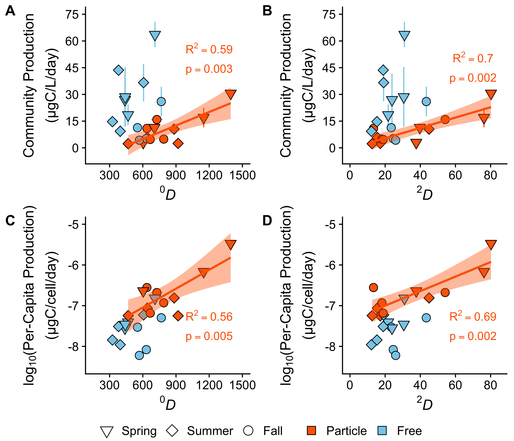

**Graphical Abstract**

```r
wide_div_meta_df %>%
  # Fetch the standard error from diversity measure to plot error bars 
  left_join(filter(div_iNEXT, Diversity == "Simpson diversity"), by = "norep_filter_name") %>%
  rename(se_iNEXT ="s.e.") %>%
  ggplot(aes(x=simpson, y=frac_bacprod)) + 
  geom_errorbarh(aes(xmin = simpson - se_iNEXT, xmax = simpson + se_iNEXT, 
                     color = fraction), alpha = 0.7) + # X-axis errorbars
  geom_errorbar(aes(ymin = frac_bacprod - SD_frac_bacprod, ymax = frac_bacprod + SD_frac_bacprod, color = fraction)) +  # Y-axis errorbars
  geom_point(size = 3.5, shape = 22, color = "black", aes(fill = fraction, shape = season)) +
  scale_color_manual(values = fraction_colors) +
  scale_fill_manual(values = fraction_colors) +
  labs(x = expression(textstyle("Inverse Simpson or")~{}^2*italic(D)),
       y = "Community Production \n (μgC/L/day)") + 
  geom_smooth(data=filter(wide_div_meta_df, fraction == "Particle"), method='lm', color = "#FF6600", fill = "#FF6600") + 
  scale_x_continuous(limits = c(0,85), breaks = seq(from = 0, to = 85, by = 20)) + 
  scale_y_continuous(limits = c(-5, 75), breaks = seq(0, 75, by = 15)) +
  # Add the R2 and p-value to the plot 
  annotate("text", x=70, y=45, label=lm_lab_perliter_invsimps_PA, parse = TRUE, color = "#FF6600", size = 4) +
  theme(legend.position = c(0.68, 0.90), legend.title = element_blank()) #axis.title.x = element_blank(), axis.text.x = element_blank() 
```

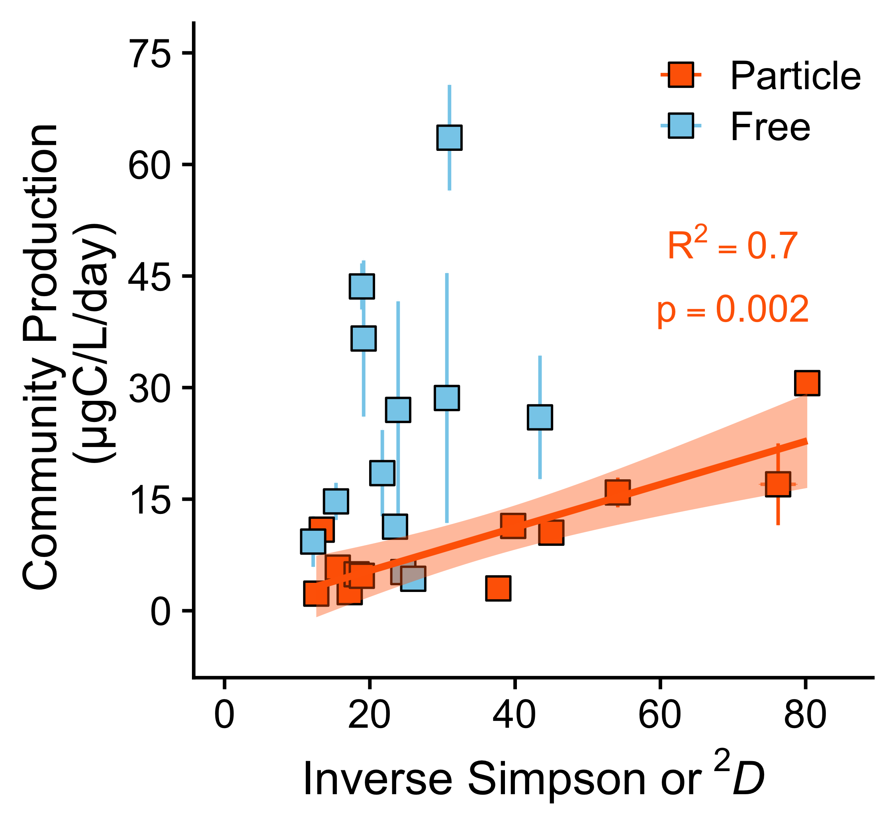


## Figure 4
**Phylodiv vs ses.MPD**

```r
# Is there a relationship between phylogenetic richness (0D) and the unweighted mean pairwise distance?
# 1. Since it's a general correlation - the linear model will be for 
lm_unweightMPD_phylorich <- lm(unweighted_sesmpd ~ phylo_richness, data = wide_div_meta_df)
## 2. Extract the R2 and p-value from the linear model: 
lm_lab_unweightMPD_phylorich <- paste("atop(R^2 ==", round(summary(lm_unweightMPD_phylorich)$adj.r.squared, digits = 2), ",",
             "p ==", round(unname(summary(lm_unweightMPD_phylorich)$coefficients[,4][2]), digits = 3), ")")
## 3. Plot 
phy_MPD_p0 <- wide_div_meta_df %>%
  ggplot(aes(x = phylo_richness, y = unweighted_sesmpd, fill = fraction)) +
  geom_point(aes(shape = season), size = 3) + 
  scale_fill_manual(values = fraction_colors) + 
  scale_shape_manual(values = season_shapes) +
  labs(x = expression({}^0*italic(PD)),
       y = "Unweighted MPD") +
  geom_smooth(method='lm', color = "black", fill = "grey") +   
  # Add the R2 and p-value to the plot 
  annotate("text", x=140, y=1, label=lm_lab_unweightMPD_phylorich, parse = TRUE, color = "black", size = 4) + 
  theme(legend.position = "none")

plot_grid(phy_MPD_p0, season_2row_legend, rel_heights = c(1, 0.1),
          nrow = 2, ncol = 1)
```

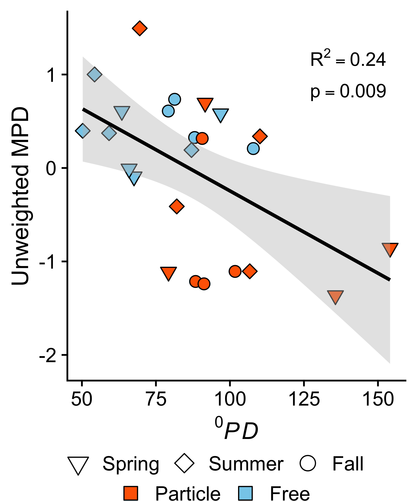

## Lasso Regressions
**Prepare data for lasso**

```r
# The lasso regression needs datasets that are wide formatted
lasso_cols_remove <- c("project", "year", "Date", "limnion", "dnaconcrep1", "perc_attached_bacprod",
                       "SD_perc_attached_bacprod", "SE_total_bac_abund", "SE_perc_attached_abund", "SE_attached_bac",
                       "tot_bacprod", "SD_tot_bacprod","SD_frac_bacprod", "BGA_cellspermL", "Turb_NTU", 
                       "lakesite", "season", "station")

### PARTICLE DATA = 12 samples 
# Note: Even though in the inclusion of MOTEJ515 doesn't have the bacterial counts, 
# the results from this lasso regression does not change. 
lasso_data_df_particle <- wide_div_meta_df %>%
  filter(fraction == "Particle" ) %>%
  dplyr::select(-c(fraction, lasso_cols_remove)) 

lasso_data_df_particle_noprod <- lasso_data_df_particle %>%
  dplyr::select(-c(fracprod_per_cell, fracprod_per_cell_noinf, norep_filter_name, norep_water_name)) 
  
percell_lasso_data_df_particle_noprod <- lasso_data_df_particle %>%
  dplyr::select(-c(fracprod_per_cell, frac_bacprod)) %>%
  dplyr::filter(norep_filter_name != "MOTEJ515") %>% # Remove the missing row of data :( )
  dplyr::select(-c(norep_filter_name, norep_water_name))

### FREE DATA 
# Note: Even though in the inclusion of MOTEJ515 doesn't have the bacterial counts, 
# the results from this lasso regression does not change. 
lasso_data_df_free <- wide_div_meta_df %>%
  filter(fraction == "Free" ) %>%
  dplyr::select(-c(fraction, lasso_cols_remove)) 

lasso_data_df_free_noprod <- lasso_data_df_free %>%
  dplyr::select(-c(fracprod_per_cell, fracprod_per_cell_noinf, norep_filter_name, norep_water_name)) 

percell_lasso_data_df_free_noprod <- lasso_data_df_free %>%
  dplyr::select(-c(fracprod_per_cell, frac_bacprod)) %>%
  dplyr::filter(norep_filter_name != "MOTEJ515") %>% # Remove the missing row of data :( )
  dplyr::select(-c(norep_filter_name, norep_water_name))
```

####Run lasso regression  
**Lasso - Community Production: Particle**

```r
# Set the seed for reproducibility of the grid values 
set.seed(777) 

################ PREPARE DATA ################ 
# Subset data needed and scale all o
scaled_comm_data <- 
  lasso_data_df_particle_noprod %>%    # Use data only for the particle samples  
  scale() %>%                          # Scale all of the variables to have mean =0 and sd = 1
  as.data.frame()                      # Make it a dataframe so that model.matrix function works (does not take a matrix)

# Set model parameters for community level data
## NOTE: there cannot be any data with NA
x = model.matrix(frac_bacprod ~ ., scaled_comm_data)[,-1]
y = scaled_comm_data$frac_bacprod
grid = 10^seq(10,-2,length = 100)

################ PREPARE TRAINING & TESTING DATA FOR CROSS VALIDATION ################ 
# Pull out test and training sets for cross validation
# We will use half the set to train the model and the 2nd half of the dataset to test the model 
train <- sample(1:nrow(x), nrow(x)/2)
test <- -train
y_test <- y[test]

################ LASSO ################ 
# Run lasso regression with alpha = 1
lasso_divs_train <- glmnet(x[train,], y[train], alpha = 1, lambda = grid, standardize = FALSE)
par(mfrow = c(1,2))
plot(lasso_divs_train)

# Cross validation
cv_lasso_divs <- cv.glmnet(x[train,], y[train], alpha = 1)
plot(cv_lasso_divs)
```


```r
best_lasso_lambda <- cv_lasso_divs$lambda.min # Minimum lambda
# https://stats.stackexchange.com/questions/138569/why-is-lambda-plus-1-standard-error-a-recommended-value-for-lambda-in-an-elastic
lasso_lambda_1se <- cv_lasso_divs$lambda.1se # simplest model whose accuracy is comparable with the best model
best_lasso_lambda == lasso_lambda_1se
```

```
## [1] TRUE
```

```r
lasso_divs_pred <- predict(lasso_divs_train, s = best_lasso_lambda, newx = x[test,])
mean((lasso_divs_pred - y_test)^2) # Test
```

```
## [1] 1.459684
```

```r
## Run lasso on the entire dataset with the best lambda value 
lasso_divs <- glmnet(x, y, alpha = 1, lambda = best_lasso_lambda, standardize = FALSE)
# What are the lasso coefficients? (Anything with a . is not selected by the model)
predict(lasso_divs, type = "coefficients", s = best_lasso_lambda)
```

```
## 32 x 1 sparse Matrix of class "dgCMatrix"
##                                 1
## (Intercept)         -5.001679e-17
## richness             2.878328e-02
## shannon              .           
## simpson              3.049965e-01
## phylo_shannon        .           
## phylo_simpson        .           
## phylo_richness       .           
## unweighted_sesmpd    .           
## weighted_sesmpd      .           
## Sample_depth_m       .           
## Temp_C               .           
## SpCond_uSpercm       .           
## TDS_mgperL           .           
## pH                   .           
## ORP_mV               .           
## Chl_Lab_ugperL       .           
## Cl_mgperL            .           
## SO4_mgperL           .           
## NO3_mgperL           .           
## NH3_mgperL           .           
## TKN_mgperL           .           
## SRP_ugperL           .           
## TP_ugperL            .           
## Alk_mgperL           .           
## DO_mgperL            .           
## DO_percent           .           
## total_bac_abund      .           
## attached_bac         .           
## perc_attached_abund  .           
## fraction_bac_abund   .           
## PC1                  .           
## PC2                  .
```

```r
## Now, run the most simple, parsimonious lasso model within 1 standard error  
## IMPORTANT NOTE: This is the lasso reported within the manuscript
lasso_divs_1se <- glmnet(x, y, alpha = 1, lambda = lasso_lambda_1se, standardize = FALSE)
# What are the lasso coefficients? (Anything with a . is not selected by the model)
predict(lasso_divs_1se, type = "coefficients", s = lasso_lambda_1se)
```

```
## 32 x 1 sparse Matrix of class "dgCMatrix"
##                                 1
## (Intercept)         -5.001679e-17
## richness             2.878328e-02
## shannon              .           
## simpson              3.049965e-01
## phylo_shannon        .           
## phylo_simpson        .           
## phylo_richness       .           
## unweighted_sesmpd    .           
## weighted_sesmpd      .           
## Sample_depth_m       .           
## Temp_C               .           
## SpCond_uSpercm       .           
## TDS_mgperL           .           
## pH                   .           
## ORP_mV               .           
## Chl_Lab_ugperL       .           
## Cl_mgperL            .           
## SO4_mgperL           .           
## NO3_mgperL           .           
## NH3_mgperL           .           
## TKN_mgperL           .           
## SRP_ugperL           .           
## TP_ugperL            .           
## Alk_mgperL           .           
## DO_mgperL            .           
## DO_percent           .           
## total_bac_abund      .           
## attached_bac         .           
## perc_attached_abund  .           
## fraction_bac_abund   .           
## PC1                  .           
## PC2                  .
```

**Lasso - Community Production: Free**

```r
# Set the seed for reproducibility of the grid values 
set.seed(777) 
     
################ PREPARE DATA ################ 
# Subset data needed and scale all o
scaled_comm_data_free <- 
  lasso_data_df_free_noprod %>%        # Use data only for the free-living samples  
  scale() %>%                          # Scale all of the variables to have mean = 0 and sd = 1
  as.data.frame()                      # Make it a dataframe so that model.matrix function works (does not take a matrix)

# Set model parameters for community level data
## NOTE: there cannot be any data with NA
free_x <- model.matrix(frac_bacprod ~ ., scaled_comm_data_free)[,-1]
free_y <- scaled_comm_data_free$frac_bacprod
free_grid <- 10^seq(10,-2,length = 100)

################ PREPARE TRAINING & TESTING DATA FOR CROSS VALIDATION ################ 
# Pull out test and training sets for cross validation
# We will use half the set to train the model and the 2nd half of the dataset to test the model 
free_train <- sample(1:nrow(free_x), nrow(free_x)/2)
free_test <- -free_train
free_y_test <- free_y[free_test]

################ LASSO ################ 
# Run lasso regression with alpha = 1
lasso_divs_train_free_comm <- glmnet(free_x[free_train,], free_y[free_train], alpha = 1, lambda = free_grid, standardize = FALSE)
par(mfrow = c(1,2))
plot(lasso_divs_train_free_comm)

# Cross validation
free_cv_lasso_divs <- cv.glmnet(free_x[free_train,], free_y[free_train], alpha = 1)
plot(free_cv_lasso_divs)
```

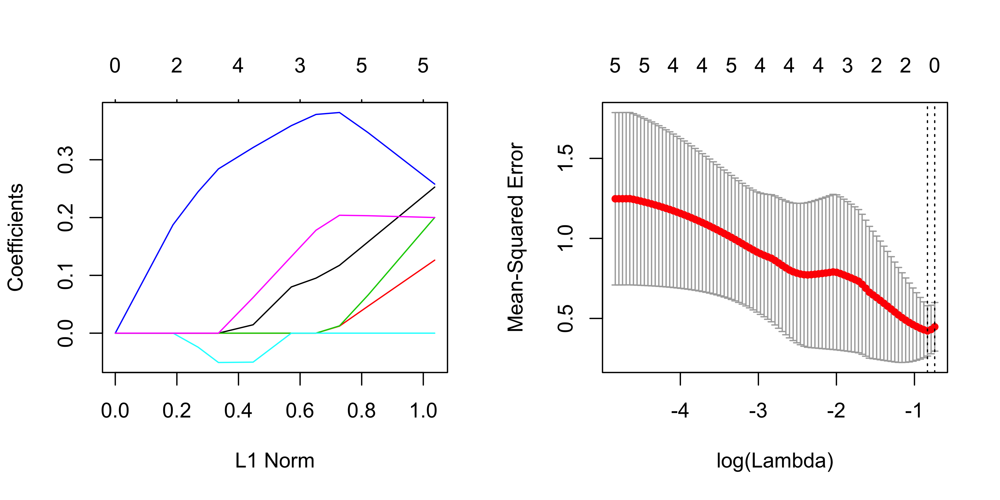

```r
free_best_lasso_lambda <- free_cv_lasso_divs$lambda.min
# https://stats.stackexchange.com/questions/138569/why-is-lambda-plus-1-standard-error-a-recommended-value-for-lambda-in-an-elastic
free_lasso_lambda_1se <- free_cv_lasso_divs$lambda.1se # simplest model whose accuracy is comparable with the best model
free_best_lasso_lambda == free_lasso_lambda_1se
```

```
## [1] FALSE
```

```r
free_lasso_divs_pred <- predict(lasso_divs_train_free_comm, s = free_best_lasso_lambda, newx = free_x[free_test,])
mean((free_lasso_divs_pred - y_test)^2) # Test
```

```
## [1] 1.425752
```

```r
## Run lasso on the entire dataset with the best lambda value 
free_lasso_divs <- glmnet(free_x, free_y, alpha = 1, lambda = free_best_lasso_lambda, standardize = FALSE)
# What are the lasso coefficients? (Anything with a . is not selected by the model)
predict(free_lasso_divs, type = "coefficients", s = free_best_lasso_lambda)
```

```
## 32 x 1 sparse Matrix of class "dgCMatrix"
##                                 1
## (Intercept)         -5.076392e-16
## richness             .           
## shannon              .           
## simpson              .           
## phylo_shannon        .           
## phylo_simpson        .           
## phylo_richness       .           
## unweighted_sesmpd    .           
## weighted_sesmpd      .           
## Sample_depth_m       .           
## Temp_C               .           
## SpCond_uSpercm       .           
## TDS_mgperL           .           
## pH                  -2.606707e-01
## ORP_mV               .           
## Chl_Lab_ugperL       .           
## Cl_mgperL            .           
## SO4_mgperL           .           
## NO3_mgperL           .           
## NH3_mgperL           .           
## TKN_mgperL           .           
## SRP_ugperL           .           
## TP_ugperL            .           
## Alk_mgperL           .           
## DO_mgperL            .           
## DO_percent           .           
## total_bac_abund      .           
## attached_bac         .           
## perc_attached_abund  .           
## fraction_bac_abund   .           
## PC1                  .           
## PC2                  .
```

```r
## Now, run the most simple, parsimonious lasso model within 1 standard error  
## IMPORTANT NOTE: This is the lasso reported within the manuscript
free_lasso_divs_1se <- glmnet(free_x, free_y, alpha = 1, lambda = free_lasso_lambda_1se, standardize = FALSE)
# What are the lasso coefficients? (Anything with a . is not selected by the model)
predict(free_lasso_divs_1se, type = "coefficients", s = free_lasso_lambda_1se)
```

```
## 32 x 1 sparse Matrix of class "dgCMatrix"
##                                 1
## (Intercept)         -4.127014e-16
## richness             .           
## shannon              .           
## simpson              .           
## phylo_shannon        .           
## phylo_simpson        .           
## phylo_richness       .           
## unweighted_sesmpd    .           
## weighted_sesmpd      .           
## Sample_depth_m       .           
## Temp_C               .           
## SpCond_uSpercm       .           
## TDS_mgperL           .           
## pH                  -2.144478e-01
## ORP_mV               .           
## Chl_Lab_ugperL       .           
## Cl_mgperL            .           
## SO4_mgperL           .           
## NO3_mgperL           .           
## NH3_mgperL           .           
## TKN_mgperL           .           
## SRP_ugperL           .           
## TP_ugperL            .           
## Alk_mgperL           .           
## DO_mgperL            .           
## DO_percent           .           
## total_bac_abund      .           
## attached_bac         .           
## perc_attached_abund  .           
## fraction_bac_abund   .           
## PC1                  .           
## PC2                  .
```

**Lasso - Per Capita Production: Particle**

```r
# Set the seed for reproducibility of the grid values 
set.seed(777) 

################ PREPARE DATA ################ 
# Subset data needed and scale all o
scaled_percapita_pa_data <- 
  percell_lasso_data_df_particle_noprod %>%   
  dplyr::filter(!is.na(fracprod_per_cell_noinf)) %>%
  mutate(log10_percell = log10(fracprod_per_cell_noinf)) %>%
  dplyr::select(-c(fracprod_per_cell_noinf)) %>%
  scale() %>%
  as.data.frame()                         # Make it a dataframe so that model.matrix function works (does not take a matrix)

# Set model parameters for community level data
## NOTE: there cannot be any data with NA
percap_pa_x = model.matrix(log10_percell ~ ., scaled_percapita_pa_data)[,-1]
percap_pa_y = scaled_percapita_pa_data$log10_percell
percap_pa_grid = 10^seq(10,-2,length = 100)

################ PREPARE TRAINING & TESTING DATA FOR CROSS VALIDATION ################ 
# Pull out test and training sets for cross validation
# We will use half the set to train the model and the 2nd half of the dataset to test the model 
percap_pa_train <- sample(1:nrow(percap_pa_x), nrow(percap_pa_x)/2)
percap_pa_test <- -percap_pa_train
percap_pa_y_test <- percap_pa_y[percap_pa_test]

################ LASSO ################ 
# Run lasso regression with alpha = 1
percap_pa_lasso_divs_train <- glmnet(percap_pa_x[percap_pa_train,], percap_pa_y[percap_pa_train], alpha = 1, lambda = percap_pa_grid, standardize = FALSE)
par(mfrow = c(1,2))
plot(percap_pa_lasso_divs_train)

# Cross validation
percap_pa_cv_lasso_divs <- cv.glmnet(percap_pa_x[percap_pa_train,], percap_pa_y[percap_pa_train], alpha = 1)
plot(percap_pa_cv_lasso_divs)
```

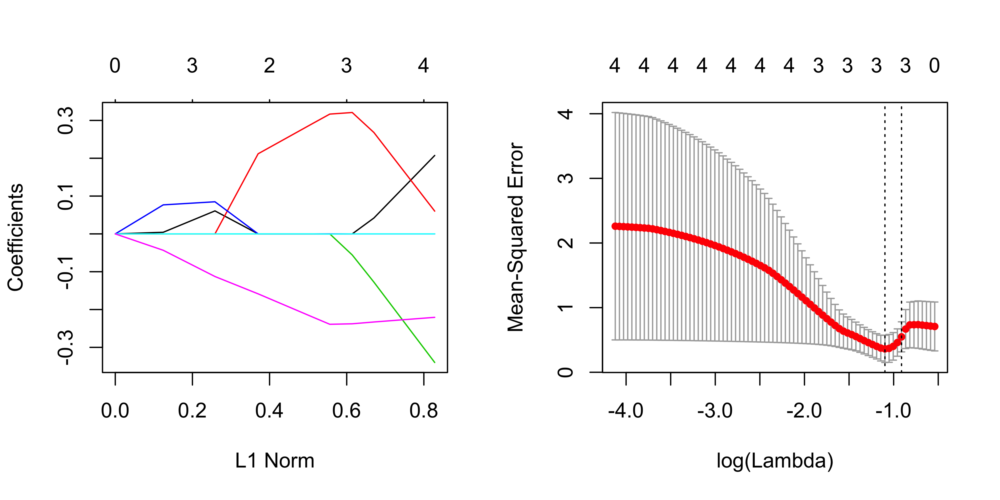

```r
percap_pa_best_lasso_lambda <- percap_pa_cv_lasso_divs$lambda.min # Minimum lambda
# https://stats.stackexchange.com/questions/138569/why-is-lambda-plus-1-standard-error-a-recommended-value-for-lambda-in-an-elastic
percap_pa_lasso_lambda_1se <- percap_pa_cv_lasso_divs$lambda.1se # simplest model whose accuracy is comparable with the best model
percap_pa_best_lasso_lambda == percap_pa_lasso_lambda_1se
```

```
## [1] FALSE
```

```r
percap_pa_lasso_divs_pred <- predict(percap_pa_lasso_divs_train, s = percap_pa_best_lasso_lambda, newx = percap_pa_x[percap_pa_test,])
mean((percap_pa_lasso_divs_pred - percap_pa_y_test)^2) # Test
```

```
## [1] 1.115762
```

```r
## Run lasso on the entire dataset with the best lambda value 
percap_pa_lasso_divs <- glmnet(percap_pa_x, percap_pa_y, alpha = 1, lambda = percap_pa_best_lasso_lambda, standardize = FALSE)
# What are the lasso coefficients? (Anything with a . is not selected by the model)
predict(percap_pa_lasso_divs, type = "coefficients", s = percap_pa_best_lasso_lambda)
```

```
## 32 x 1 sparse Matrix of class "dgCMatrix"
##                                 1
## (Intercept)         -6.639099e-16
## richness             8.155323e-02
## shannon              .           
## simpson              3.318283e-01
## phylo_shannon        .           
## phylo_simpson        .           
## phylo_richness       .           
## unweighted_sesmpd    .           
## weighted_sesmpd      .           
## Sample_depth_m       .           
## Temp_C              -1.365431e-01
## SpCond_uSpercm       .           
## TDS_mgperL           .           
## pH                   .           
## ORP_mV               .           
## Chl_Lab_ugperL       .           
## Cl_mgperL            .           
## SO4_mgperL           .           
## NO3_mgperL           .           
## NH3_mgperL           .           
## TKN_mgperL           .           
## SRP_ugperL           .           
## TP_ugperL            .           
## Alk_mgperL           .           
## DO_mgperL            .           
## DO_percent           .           
## total_bac_abund      .           
## attached_bac         .           
## perc_attached_abund  .           
## fraction_bac_abund   .           
## PC1                  .           
## PC2                  .
```

```r
## Now, run the most simple, parsimonious lasso model within 1 standard error  
## IMPORTANT NOTE: This is the lasso reported within the manuscript
percap_pa_lasso_divs_1se <- glmnet(percap_pa_x, percap_pa_y, alpha = 1, lambda = percap_pa_lasso_lambda_1se, standardize = FALSE)
# What are the lasso coefficients? (Anything with a . is not selected by the model)
predict(percap_pa_lasso_divs_1se, type = "coefficients", s = percap_pa_lasso_lambda_1se)
```

```
## 32 x 1 sparse Matrix of class "dgCMatrix"
##                                 1
## (Intercept)         -6.490174e-16
## richness             3.518435e-02
## shannon              .           
## simpson              3.244235e-01
## phylo_shannon        .           
## phylo_simpson        .           
## phylo_richness       .           
## unweighted_sesmpd    .           
## weighted_sesmpd      .           
## Sample_depth_m       .           
## Temp_C              -8.776686e-02
## SpCond_uSpercm       .           
## TDS_mgperL           .           
## pH                   .           
## ORP_mV               .           
## Chl_Lab_ugperL       .           
## Cl_mgperL            .           
## SO4_mgperL           .           
## NO3_mgperL           .           
## NH3_mgperL           .           
## TKN_mgperL           .           
## SRP_ugperL           .           
## TP_ugperL            .           
## Alk_mgperL           .           
## DO_mgperL            .           
## DO_percent           .           
## total_bac_abund      .           
## attached_bac         .           
## perc_attached_abund  .           
## fraction_bac_abund   .           
## PC1                  .           
## PC2                  .
```

**Lasso - Per Capita Production: Free**

```r
# Set the seed for reproducibility of the grid values 
set.seed(777) 

################ PREPARE DATA ################ 
# Subset data needed and scale all o
scaled_percapita_fl_data <- 
  percell_lasso_data_df_free_noprod %>%   
  dplyr::filter(!is.na(fracprod_per_cell_noinf)) %>%
  mutate(log10_percell = log10(fracprod_per_cell_noinf)) %>%
  dplyr::select(-c(fracprod_per_cell_noinf)) %>%
  scale() %>%
  as.data.frame()                         # Make it a dataframe so that model.matrix function works (does not take a matrix)

# Set model parameters for community level data
## NOTE: there cannot be any data with NA
percap_fl_x = model.matrix(log10_percell ~ ., scaled_percapita_fl_data)[,-1]
percap_fl_y = scaled_percapita_fl_data$log10_percell
percap_fl_grid = 10^seq(10,-2,length = 100)

################ PREPARE TRAINING & TESTING DATA FOR CROSS VALIDATION ################ 
# Pull out test and training sets for cross validation
# We will use half the set to train the model and the 2nd half of the dataset to test the model 
percap_fl_train <- sample(1:nrow(percap_fl_x), nrow(percap_fl_x)/2)
percap_fl_test <- -percap_fl_train
percap_fl_y_test <- percap_fl_y[percap_fl_test]

################ LASSO ################ 
# Run lasso regression with alpha = 1
percap_fl_lasso_divs_train <- glmnet(percap_fl_x[percap_fl_train,], percap_fl_y[percap_fl_train], alpha = 1, lambda = percap_fl_grid, standardize = FALSE)
par(mfrow = c(1,2))
plot(percap_fl_lasso_divs_train)

# Cross validation
percap_fl_cv_lasso_divs <- cv.glmnet(percap_fl_x[percap_fl_train,], percap_fl_y[percap_fl_train], alpha = 1)
plot(percap_fl_cv_lasso_divs)
```

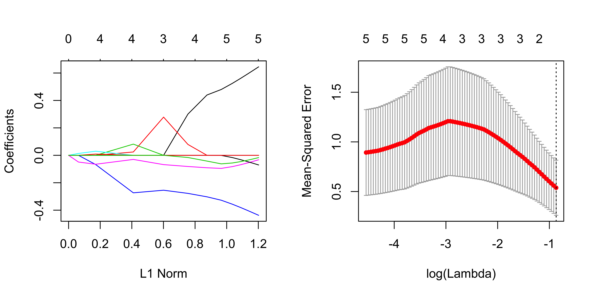

```r
percap_fl_best_lasso_lambda <- percap_fl_cv_lasso_divs$lambda.min # Minimum lambda
# https://stats.stackexchange.com/questions/138569/why-is-lambda-plus-1-standard-error-a-recommended-value-for-lambda-in-an-elastic
percap_fl_lasso_lambda_1se <- percap_fl_cv_lasso_divs$lambda.1se # simplest model whose accuracy is comparable with the best model
percap_fl_best_lasso_lambda == percap_fl_lasso_lambda_1se
```

```
## [1] TRUE
```

```r
percap_fl_lasso_divs_pred <- predict(percap_fl_lasso_divs_train, s = percap_fl_best_lasso_lambda, newx = percap_fl_x[percap_fl_test,])
mean((percap_fl_lasso_divs_pred - percap_fl_y_test)^2) # Test
```

```
## [1] 1.553166
```

```r
## Run lasso on the entire dataset with the best lambda value 
percap_fl_lasso_divs <- glmnet(percap_fl_x, percap_fl_y, alpha = 1, lambda = percap_fl_best_lasso_lambda, standardize = FALSE)
# What are the lasso coefficients? (Anything with a . is not selected by the model)
predict(percap_fl_lasso_divs, type = "coefficients", s = percap_fl_best_lasso_lambda)
```

```
## 32 x 1 sparse Matrix of class "dgCMatrix"
##                                 1
## (Intercept)         -1.642101e-15
## richness             .           
## shannon              .           
## simpson              .           
## phylo_shannon        .           
## phylo_simpson        .           
## phylo_richness       .           
## unweighted_sesmpd    .           
## weighted_sesmpd      .           
## Sample_depth_m       .           
## Temp_C               .           
## SpCond_uSpercm       .           
## TDS_mgperL           .           
## pH                  -4.346341e-01
## ORP_mV               .           
## Chl_Lab_ugperL       .           
## Cl_mgperL            .           
## SO4_mgperL           .           
## NO3_mgperL           .           
## NH3_mgperL           .           
## TKN_mgperL           .           
## SRP_ugperL           .           
## TP_ugperL            .           
## Alk_mgperL           .           
## DO_mgperL            .           
## DO_percent           .           
## total_bac_abund      .           
## attached_bac         .           
## perc_attached_abund  .           
## fraction_bac_abund   .           
## PC1                  .           
## PC2                  .
```

```r
## Now, run the most simple, parsimonious lasso model within 1 standard error  
## IMPORTANT NOTE: This is the lasso reported within the manuscript
percap_fl_lasso_divs_1se <- glmnet(percap_fl_x, percap_fl_y, alpha = 1, lambda = percap_fl_lasso_lambda_1se, standardize = FALSE)
# What are the lasso coefficients? (Anything with a . is not selected by the model)
predict(percap_fl_lasso_divs_1se, type = "coefficients", s = percap_fl_lasso_lambda_1se)
```

```
## 32 x 1 sparse Matrix of class "dgCMatrix"
##                                 1
## (Intercept)         -1.642101e-15
## richness             .           
## shannon              .           
## simpson              .           
## phylo_shannon        .           
## phylo_simpson        .           
## phylo_richness       .           
## unweighted_sesmpd    .           
## weighted_sesmpd      .           
## Sample_depth_m       .           
## Temp_C               .           
## SpCond_uSpercm       .           
## TDS_mgperL           .           
## pH                  -4.346341e-01
## ORP_mV               .           
## Chl_Lab_ugperL       .           
## Cl_mgperL            .           
## SO4_mgperL           .           
## NO3_mgperL           .           
## NH3_mgperL           .           
## TKN_mgperL           .           
## SRP_ugperL           .           
## TP_ugperL            .           
## Alk_mgperL           .           
## DO_mgperL            .           
## DO_percent           .           
## total_bac_abund      .           
## attached_bac         .           
## perc_attached_abund  .           
## fraction_bac_abund   .           
## PC1                  .           
## PC2                  .
```


# Supplemental

## Figure S1
**Map of Muskegon Lake**

```r
# Load the ggmap package for plotting of Muskegon Lake
library(ggmap)

# Extract the coordinates for Muskegon Lake 
lakesite_coordinates <- read.csv("data/metadata/ML_GPS_Coordinates.csv") %>%
  dplyr::select(lakesite, Latitude, Longitude) %>%
  dplyr::rename(Lat = Latitude, Long = Longitude)

# Set the boundaries for the map 
map <- get_map(c(-86.35, 43.21, -86.235, 43.265),  #left/bottom/right/top
                 zoom = 13, maptype = "toner-background")

# Plot the Muskegon Lake Map 
ggmap(map) + xlab("Longitude") + ylab("Latitude") +
  theme(axis.text = element_text(size = 10, color = "black"),
        axis.title = element_text(size = 12, color = "black", face = "bold")) +
    geom_point(data = lakesite_coordinates, 
               aes(x=Long, y=Lat), color="black", fill = "yellow", size=4, shape = 21) +
    geom_text(data = lakesite_coordinates,
              aes(x=Long, y=Lat, label=lakesite), col="black", cex=4, vjust = 0.5,hjust = -0.25) 
```

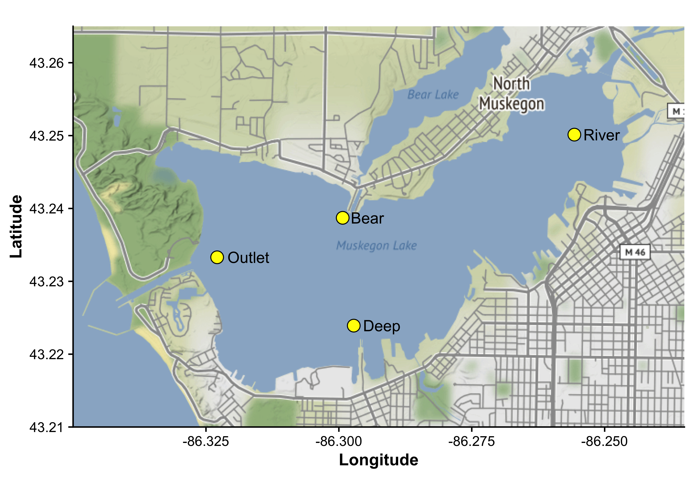


## Figure S2

```r
# h = 0 = richness
# h = 1 = exp(Shannon)
# h = 2 = Inverse Simpsons

# Prepare data to color the figure for iNEXT
dat <- colnames(iNEXT_input_table) %>%  
  data.frame()  
colnames(dat)[1] <- "norep_filter_name"     
sub_metadata <- metadata[,1:6] %>%  
  tibble::rownames_to_column(var = "norep_filter_name")

# Combine for plotting below
dat_iNEXT <- dat %>%    
  left_join(sub_metadata, by = "norep_filter_name") %>%  
  mutate(fraction_color = ifelse(fraction == "Particle", "#FF6600", "skyblue"),       
         shape = ifelse(season == "Spring", 25,             
                        ifelse(season == "Summer", 23,                         
                               21)),                                  
         station_color = ifelse(lakesite == "Bear", "black",             
                                ifelse(lakesite == "Deep", "blue",                                 
                                       ifelse(lakesite == "Outlet", "skyblue",                                         
                                              "forestgreen"))),                                              
         season_color = ifelse(season == "Spring", "skyblue",          
                               ifelse(season == "Summer", "forestgreen",                                   
                                      "orange")))

# Sample‐size‐based R/E curves, separating by "site""
p_iNEXT <- ggiNEXT(iNEXT_data, type=1, facet.var="order") + facet_wrap(~order, scales="free") +
  scale_shape_manual(values = dat_iNEXT$shape, guide = FALSE) +
  scale_color_manual(values = dat_iNEXT$fraction_color,  guide = FALSE) +
  scale_fill_manual(values = dat_iNEXT$fraction_color, guide = FALSE) +
  theme(legend.position = "none") + theme(plot.title = element_text()); 

p_iNEXT_legend <- ggiNEXT(iNEXT_data, type=1, facet.var="order", grey = "true") + 
  facet_wrap(~order, scales="free") +
  guides(color = "none", shape = "none", fill = "none") + 
  theme(legend.text = element_text(size = 13))

# Extract the legend
iNEXT_legend <- cowplot::get_legend(p_iNEXT_legend)

# plot them together for top panel of figure 2
figS2_a <- plot_grid(p_iNEXT, iNEXT_legend, season_legend,
           ncol = 1, nrow = 3, labels = c("A", "", ""),
           rel_heights = c(1, 0.05, 0.05)); 


######################################
#### Correlations between phylogenetic & non-phylo Hill numbers
# Calculate R2 and pval for  it
lm_phylo_rich <- summary(lm(phylo_richness ~ richness, data =div_df))
lm_phylo_shan <- summary(lm(phylo_shannon ~ shannon, data = div_df))
lm_phylo_simps <- summary(lm(phylo_simpson ~ simpson, data = div_df))

# Make the 3 individual plots and then plot together
# 1. RICHNESS PLOT 
# Extract linear model output 
lab_lm_phylo_rich <- paste("atop(R^2 ==", round(lm_phylo_rich$adj.r.squared, digits = 2), ",",
             "p ==", round(unname(lm_phylo_rich$coefficients[,4][2]), digits = 19), ")")
p1_phylo_rich <- 
  div_df %>%
  ggplot(aes(x = richness, y = phylo_richness)) + 
  geom_point() + geom_smooth(method = "lm") +
  labs(x = expression({}^0*italic(D)), 
       y = expression(~{}^0*italic(PD))) +
  annotate("text", x=600, y=150, label=lab_lm_phylo_rich, parse = TRUE, color = "blue", size = 4) 

# 2. SHANNON PLOT 
# Extract linear model output 
lab_lm_phylo_shan <- paste("atop(R^2 ==", round(lm_phylo_shan$adj.r.squared, digits = 2), ",",
             "p ==", round(unname(lm_phylo_shan$coefficients[,4][2]), digits = 10), ")")
p2_phylo_shan <- 
  div_df %>%
  ggplot(aes(x = shannon, y = phylo_shannon)) + 
  geom_point() + geom_smooth(method = "lm") +
  labs(x = expression(~{}^1*italic(D)), 
       y = expression(~{}^1*italic(PD))) +
  annotate("text", x=100, y=15, label=lab_lm_phylo_shan, parse = TRUE, color = "blue", size = 4) 

# 3. SIMPSON PLOT 
# Extract linear model output 
lab_lm_phylo_simps <- paste("atop(R^2 ==", round(lm_phylo_simps$adj.r.squared, digits = 2), ",",
             "p ==", round(unname(lm_phylo_simps$coefficients[,4][2]), digits = 5), ")")
p3_phylo_simps <- 
  div_df %>%
  ggplot(aes(x = simpson, y = phylo_simpson)) + 
  geom_point() + geom_smooth(method = "lm") +
  labs(x = expression(~{}^2*italic(D)), 
       y = expression(~{}^2*italic(PD))) +
  annotate("text", x=30, y=6, label=lab_lm_phylo_simps, parse = TRUE, color = "blue", size = 4) 

# Put the plots together
figS2_b <- coors_doubleton <- plot_grid(p1_phylo_rich, p2_phylo_shan, p3_phylo_simps,
          labels = c("B", "C", "D"),
          nrow = 1, ncol = 3); 


###### FIGURE S2
plot_grid(figS2_a, figS2_b, ncol = 1, nrow = 2, rel_heights = c(1, 0.8))
```

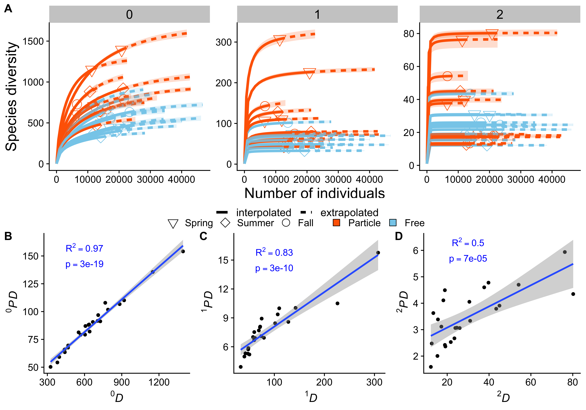


```r
wilcox_rich_obs <- wilcox.test(Observed ~ fraction, data =dplyr::filter(div_df_frac,Diversity == "Species richness"))
wilcox_rich_est <- wilcox.test(Estimator ~ fraction, data = dplyr::filter(div_df_frac,Diversity == "Species richness"))

rich_p1 <- div_df_frac %>%
  dplyr::filter(Diversity == "Species richness") %>%
  ggplot(aes(x = fraction, y = Observed)) + 
  geom_jitter(size = 3, aes(fill = fraction, shape = season), width = 0.2) + 
  geom_boxplot(alpha = 0.5, outlier.shape = NA, aes( fill = fraction)) +
  scale_fill_manual(values = fraction_colors) +
  scale_shape_manual(values = season_shapes) + 
  scale_y_continuous(limits = c(0, 1800), breaks = seq(0, 1800, by = 300),
                     expand = c(0, 0)) +
  labs(y = "Observed Richness") +
  theme(axis.title.x = element_blank(), legend.position = "none") + 
  annotate("text", x=1.5, y=1500, size = 4, color = "gray40",
         label= paste("Wilcoxon, p =", round(wilcox_rich_obs$p.value, digits = 3))) 

rich_p2 <- div_df_frac %>%
  dplyr::filter(Diversity == "Species richness") %>%
  ggplot(aes(x = fraction, y = Estimator)) + 
  geom_jitter(size = 3, aes(fill = fraction, shape = season), width = 0.2) + 
  geom_boxplot(alpha = 0.5, outlier.shape = NA, aes( fill = fraction)) +
  scale_fill_manual(values = fraction_colors) +
  scale_shape_manual(values = season_shapes) + 
  scale_y_continuous(limits = c(0, 1800), breaks = seq(0, 1800, by = 300),
                     expand = c(0, 0))+
  labs(y = "Richness Estimator") +
  theme(axis.title.x = element_blank(), legend.position = "none") + 
  annotate("text", x=1.5, y=1500, size = 4, color = "gray40",
      label= paste("Wilcoxon, p =", round(wilcox_rich_est$p.value, digits = 3)))

# Put the plots together 
rich_title <- ggdraw() + 
  draw_label("iNEXT richness estimates", fontface = 'bold', x = 0, hjust = 0) + 
   theme(plot.margin = margin(0, 0, 0, 125))

rich_plotz <- plot_grid(rich_p1, rich_p2, 
          labels = c("A", "B"))

plot_grid(rich_title, rich_plotz, 
          ncol = 1, nrow = 2, rel_heights = c(0.1, 1))
```

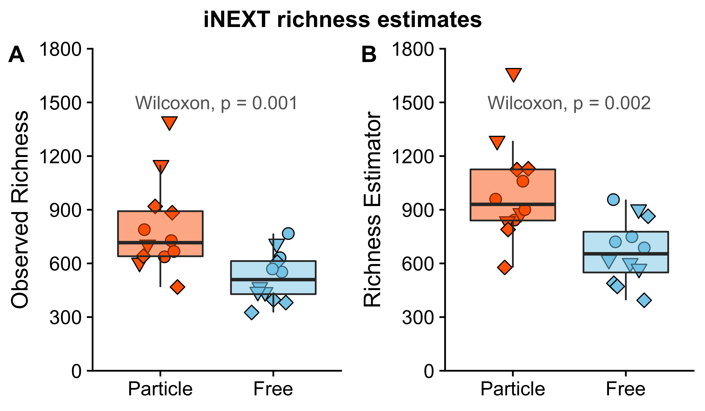

## Figure S3
**Correlations between Particle and Free of values in Figure 1**

```r
work_df <- metadata %>%
  dplyr::select(norep_filter_name, fraction, fraction_bac_abund, frac_bacprod, fracprod_per_cell_noinf) %>%
  mutate(norep_water_name = paste(substr(norep_filter_name, 1,4), substr(norep_filter_name, 6,9), sep = "")) %>%
  dplyr::select(-norep_filter_name)

part_work_df <- work_df %>%
  filter(fraction == "Particle") %>%
  rename(part_bacabund = fraction_bac_abund,
         part_prod = frac_bacprod, 
         part_percell_prod = fracprod_per_cell_noinf) %>%
  dplyr::select(-fraction)

free_work_df <- work_df %>%
  filter(fraction == "Free") %>%
  rename(free_bacabund = fraction_bac_abund,
         free_prod = frac_bacprod, 
         free_percell_prod = fracprod_per_cell_noinf) %>%
  dplyr::select(-fraction)

byfrac_df <- part_work_df %>%
  left_join(free_work_df, by = "norep_water_name")

byfrac_df$season <- substr(byfrac_df$norep_water_name, 5,5) # 7th letter = month sampled
byfrac_df$season <- as.character(byfrac_df$season)
byfrac_df$season <- ifelse(byfrac_df$season == "5", "Spring", 
                             ifelse(byfrac_df$season == "7", "Summer", 
                                    ifelse(byfrac_df$season == "9", "Fall",
                                           "NA")))
byfrac_df$season <- factor(byfrac_df$season, levels = c("Spring", "Summer", "Fall"))

summary(lm(log10(part_bacabund) ~ log10(free_bacabund), data = filter(byfrac_df, norep_water_name != "MOTE515")))
```

```
## 
## Call:
## lm(formula = log10(part_bacabund) ~ log10(free_bacabund), data = filter(byfrac_df, 
##     norep_water_name != "MOTE515"))
## 
## Residuals:
##      Min       1Q   Median       3Q      Max 
## -0.52690 -0.08048  0.05903  0.19565  0.35255 
## 
## Coefficients:
##                      Estimate Std. Error t value Pr(>|t|)
## (Intercept)            2.0900     3.2247   0.648    0.533
## log10(free_bacabund)   0.4264     0.5532   0.771    0.461
## 
## Residual standard error: 0.3111 on 9 degrees of freedom
## Multiple R-squared:  0.06194,	Adjusted R-squared:  -0.04229 
## F-statistic: 0.5943 on 1 and 9 DF,  p-value: 0.4605
```

```r
plot1 <- ggplot(filter(byfrac_df, norep_water_name != "MOTE515"), 
       aes(x = log10(free_bacabund), y = log10(part_bacabund))) +
  xlab("Free") +  ylab("Particle") + 
  ggtitle(expression(atop(log[10]*"(Bacterial Counts)", "(cells/mL)"))) + 
  #ggtitle("Log10(Bacterial Counts) \n (cells/mL)") +
  geom_point(size = 3, fill = "grey", aes(shape = season), width = 0.2) + 
  scale_shape_manual(values = season_shapes) +
  theme(legend.position = "bottom",
        legend.title = element_blank())


################ Community-Wide production correlation between particle and free
## 1. Run the linear regression 
lm_prod_corr <- lm(part_prod ~ free_prod, data = byfrac_df)

# 2. Extract the R2 and p-value from the linear model: 
lm_lab_perliter_PAvsFL <- paste("atop(R^2 ==", round(summary(lm_prod_corr)$adj.r.squared, digits = 2), ",",
            "p ==", round(unname(summary(lm_prod_corr)$coefficients[,4][2]), digits = 3), ")")

## 3. Plot Community production correlation between particle and free
plot2 <- ggplot(byfrac_df, aes(x = free_prod, y = part_prod)) +
  xlab("Free") +  ylab("Particle") + 
  ggtitle(expression(atop("Community Production", "(μgC/L/day)"))) +
  #ggtitle("Community Production \n(μgC/L/day)") +
  geom_point(size = 3, fill = "grey", aes(shape = season), width = 0.2) + 
  scale_shape_manual(values = season_shapes) +
  geom_smooth(method = "lm", color = "black")  + 
  # Add the R2 and p-value to the plot 
  annotate("text", x=20, y=30, label=lm_lab_perliter_PAvsFL, parse = TRUE, color = "black", size = 4) +
  theme(legend.position = "none")


################ Per-Capita production correlation between particle and free
## 1. Run the linear regression 
lm_percell_corr <- lm(log10(part_percell_prod) ~ log10(free_percell_prod), data = byfrac_df)

# 2. Extract the R2 and p-value from the linear model: 
lm_lab_percell_PAvsFL <- paste("atop(R^2 ==", round(summary(lm_percell_corr)$adj.r.squared, digits = 2), ",",
            "p ==", round(unname(summary(lm_percell_corr)$coefficients[,4][2]), digits = 3), ")")

## 3. Plot Per-Capita production correlation between particle and free
plot3 <- ggplot(byfrac_df,
       aes(x = log10(free_percell_prod), y = log10(part_percell_prod))) +  
  xlab("Free") +  ylab("Particle") + 
  ggtitle(expression(atop(log[10]*"(Per-Capita Production)", "(μgC/cell/day)"))) + 
  #ggtitle("log10(Per-Capita Production)\n (μgC/cell/day)") +
  geom_point(size = 3, fill = "grey", aes(shape = season), width = 0.2) + 
  scale_shape_manual(values = season_shapes) +
  geom_smooth(method = "lm", color = "black") + 
  # Add the R2 and p-value to the plot 
  annotate("text", y = -5.8, x=-7.9, label=lm_lab_percell_PAvsFL, parse = TRUE, color = "black", size = 4) +
  theme(legend.position = "none")


# Make the final multi-paneled Plot
# Extract the legend
legend_s1 <- get_legend(plot1 + theme(legend.direction = "horizontal",legend.justification="center" ,legend.box.just = "bottom"))

# Make the 3 plots
top_row_S1 <- plot_grid(plot1 +theme(legend.position = "none"), plot2, plot3, 
          nrow = 1, ncol = 3, 
          labels = c("A", "B", "C"), 
          align = "h")

# Put the legend and 3 plots together
plot_grid(top_row_S1, legend_s1,
          rel_heights = c(1, 0.05),
          nrow = 2, ncol = 1)
```

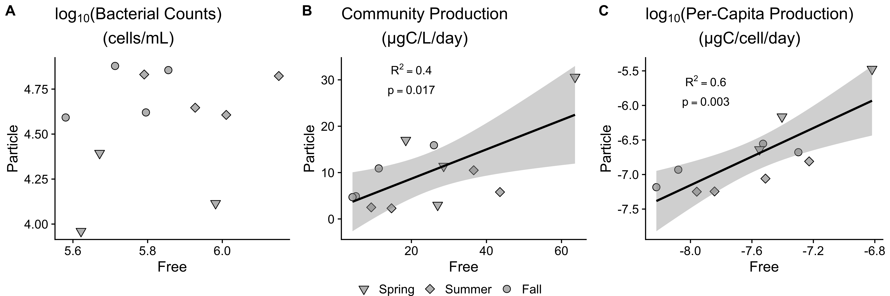


## Figure S4

```r
# Locations of labels 
maxes <- c(1350, 299, 78, 1.35, 150, 15.2, 5.8, 0.1)
df_temp <- data.frame(hill_labels = site_div_labs, wc_pafl_pvals, fraction, maxes) 

figS4 <- long_div_meta_df %>% 
  dplyr::filter(Diversity %in% c("phylo_richness", "phylo_shannon", "phylo_simpson", "weighted_sesmpd")) %>%
  ggplot(aes(y = div_val, x = fraction, fill = fraction)) +
  ylab("Diversity Value By Fraction") +
  facet_wrap(hill_labels~., scales = "free", labeller = label_parsed, nrow = 2, ncol = 4) + 
  geom_point(size = 3, position = position_jitterdodge(), aes(shape = season)) +
  geom_boxplot(alpha = 0.5, outlier.shape = NA, color = "black") +
  scale_fill_manual(values = fraction_colors) + 
  scale_shape_manual(values = season_shapes) + 
  scale_color_manual(values = fraction_colors) + 
  theme(legend.position = "none", axis.title.x = element_blank()) +
  geom_text(data = dplyr::filter(df_temp, hill_labels %in% c("{}^0*italic(PD)", "{}^1*italic(PD)","{}^2*italic(PD)", "italic(Weighted_MPD)")), 
            aes(x = fraction, y = maxes, label = wc_pafl_pvals), size = 4.5, hjust = 0.5,color = "grey40") 

plot_grid(figS4, season_legend, nrow =2, ncol =1, rel_heights = c(1, 0.05))
```

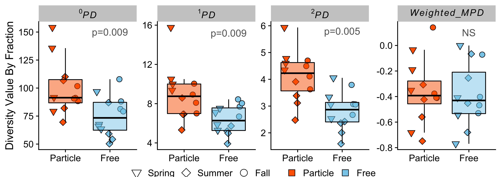


## Figure S5

```r
#### Time series of PA vs FL diversity 

# Question: Is there a temporal effect on diversity differences between particle and Free?
# Calculate the means for plotting
italics_labeller <- c("{}^0*italic(D)", "{}^0*italic(PD)",
                      "{}^1*italic(D)", "{}^1*italic(PD)",
                      "{}^2*italic(D)","{}^2*italic(PD)")
div_order <- c("richness", "phylo_richness",
               "shannon", "phylo_shannon",
               "simpson", "phylo_simpson")

mean_div_df <- wide_div_meta_df %>%
  dplyr::select(c(norep_filter_name:phylo_richness, lakesite, fraction, season)) %>%
  gather(key = "Diversity", value = div_val, richness:phylo_richness) %>%
  mutate(norep_name = paste(substr(norep_filter_name, 1, 4), substr(norep_filter_name, 6, 8), sep = "")) %>%
  dplyr::select(-norep_filter_name)  %>%
  tidyr::spread(key = fraction, value = div_val) %>%
  mutate(frac_difference = Particle-Free,
         Diversity = fct_relevel(Diversity, levels = div_order),
         hill_labels = factor(Diversity, labels = italics_labeller)) %>%
  group_by(Diversity, hill_labels, season) %>%
  summarize(mean_diff = mean(frac_difference), sd_diff = sd(frac_difference)) 

timeseries_df <- wide_div_meta_df %>%
  dplyr::select(c(norep_filter_name:phylo_richness, lakesite, fraction, season)) %>%
  gather(key = "Diversity", value = div_val, richness:phylo_richness) %>%
  mutate(norep_name = paste(substr(norep_filter_name, 1, 4), substr(norep_filter_name, 6, 8), sep = "")) %>%
  dplyr::select(-norep_filter_name)  %>%
  tidyr::spread(key = fraction, value = div_val) %>%
  mutate(frac_difference = Particle-Free,
          Diversity = fct_relevel(Diversity, levels = div_order),
         hill_labels = factor(Diversity, labels = italics_labeller))

##### Prepare stats
# Reorder the data frame for calculating the stats 
wc_div_df <- wide_div_meta_df %>%
  dplyr::select(c(norep_filter_name:phylo_richness, lakesite, fraction, season)) %>%
  gather(key = "Diversity", value = div_val, richness:phylo_richness) %>%
  mutate(norep_name = paste(substr(norep_filter_name, 1, 4), substr(norep_filter_name, 6, 8), sep = "")) %>%
  dplyr::select(-norep_filter_name)  %>%
  tidyr::spread(key = fraction, value = div_val) %>%
  mutate(frac_difference = Particle-Free) 

#  Plot all of the metrics together 
ggplot(timeseries_df, aes(x = season, y = frac_difference)) + 
  annotate("rect", xmin=-Inf, xmax=Inf, ymin=0, ymax=Inf,alpha=0.2,fill="#FF6600")+
  annotate("rect", xmin=-Inf, xmax=Inf, ymin=-Inf, ymax=0,alpha=0.2,fill="skyblue")+
  facet_wrap(hill_labels~., scales = "free", labeller = label_parsed, nrow = 3, ncol = 2) + 
  geom_hline(yintercept = 0, color = "grey") + 
  geom_jitter(aes(shape = lakesite), fill = "grey", size = 3, width = 0.1) + 
  geom_point(data = mean_div_df, aes(x = season, y = mean_diff), shape = 95, size = 20) +
  geom_line(data = mean_div_df, aes(x = season, y = mean_diff, group = Diversity), size = 1.5, color = "black", alpha = 0.5) + 
  scale_shape_manual(values = lakesite_shapes) +
  theme(axis.title = element_blank(), #legend.title = element_blank(), 
        legend.position = "bottom", 
        strip.background = element_rect(colour = "grey", fill = "white"),
        strip.text = element_text(face = "bold"))  
```

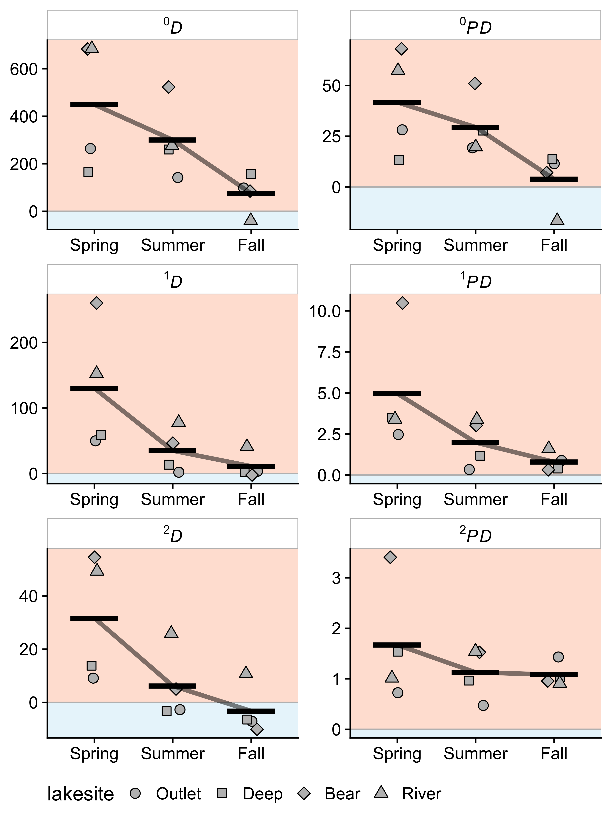


```r
# Subset dataframes for mean plotting
mean_div_df_rich <- dplyr::filter(mean_div_df, Diversity == "richness")
mean_div_df_shan <- dplyr::filter(mean_div_df, Diversity == "shannon")
mean_div_df_simps <- dplyr::filter(mean_div_df, Diversity == "simpson")

# To calculate the significance between seasons - I'll use a pairwise wilcoxon test below 
# Are there significant differences in the fraction diversity over the three seasons? 
# Richness 
wilcox.test(frac_difference ~ season, 
            data = dplyr::filter(wc_div_df, Diversity == "richness" &
                                  season %in% c("Spring", "Summer")))  # NS 
```

```
## 
## 	Wilcoxon rank sum test
## 
## data:  frac_difference by season
## W = 11, p-value = 0.4857
## alternative hypothesis: true location shift is not equal to 0
```

```r
wilcox.test(frac_difference ~ season, 
            data = dplyr::filter(wc_div_df, Diversity == "richness" &  
                                  season %in% c("Summer", "Fall"))) # Marginal, p = 0.06 
```

```
## 
## 	Wilcoxon rank sum test
## 
## data:  frac_difference by season
## W = 15, p-value = 0.05714
## alternative hypothesis: true location shift is not equal to 0
```

```r
wx_0D_SpFa <- wilcox.test(frac_difference ~ season, 
            data = dplyr::filter(wc_div_df, Diversity == "richness" & 
                                  season %in% c("Spring", "Fall"))) # Significant!

dat_0D_SpFa <- data.frame(a = c(1.15,1.15,2.85,2.85), b = c(730, 750, 750, 730)) # WholePart vs WholeFree

timeseries_0D <-  
  timeseries_df %>%
  dplyr::filter(Diversity == "richness") %>%
  ggplot(aes(x = season, y = frac_difference)) + 
  annotate("rect", xmin=-Inf, xmax=Inf, ymin=0, ymax=Inf,alpha=0.3,fill="#FF6600") +
  annotate("rect", xmin=-Inf, xmax=Inf, ymin=-Inf, ymax=0,alpha=0.3,fill="skyblue") +
  geom_hline(yintercept = 0, color = "grey") + 
  geom_jitter(aes(shape = lakesite), fill = "grey", size = 3, width = 0.1) + 
  geom_point(data = mean_div_df_rich, aes(x = season, y = mean_diff), shape = 95, size = 20) +
  geom_line(data = mean_div_df_rich, aes(x = season, y = mean_diff, group = Diversity), size = 1.5, color = "black", alpha = 0.5) + 
  labs(y = expression("Particle"~{}^0*italic(D)~"– Free"~{}^0*italic(D))) +
  scale_shape_manual(values = lakesite_shapes) +
  geom_path(data = dat_0D_SpFa, aes(x = a, y = b), linetype = 1, color = "#424645") +
  annotate("text", x=2, y=790, size = 8, color = "#424645", label= paste("*"), angle = 90) +
  annotate("text", x=2, y=700, size = 4, color = "#424645",
           label= paste("p =", round(wx_0D_SpFa$p.value, digits = 2))) +
  theme(legend.position = "none", 
        axis.title.x = element_blank(), axis.text.x = element_blank(),
        #  specify top, right, bottom, and left margins
        plot.margin = margin(0, 0, 0, 0.6, "cm"))

# Shannon 
wilcox.test(frac_difference ~ season, 
            data =dplyr::filter(wc_div_df, Diversity == "shannon" &
                                  season %in% c("Spring", "Summer")))  # NS 
```

```
## 
## 	Wilcoxon rank sum test
## 
## data:  frac_difference by season
## W = 14, p-value = 0.1143
## alternative hypothesis: true location shift is not equal to 0
```

```r
wilcox.test(frac_difference ~ season, 
            data =dplyr::filter(wc_div_df, Diversity == "shannon" & 
                                  season %in% c("Summer", "Fall")))  # NS 
```

```
## 
## 	Wilcoxon rank sum test
## 
## data:  frac_difference by season
## W = 12, p-value = 0.3429
## alternative hypothesis: true location shift is not equal to 0
```

```r
wx_1D_SpFa <- wilcox.test(frac_difference ~ season, 
            data =dplyr::filter(wc_div_df, Diversity == "shannon" & 
                                  season %in% c("Spring", "Fall"))) # Significant!
dat_1D_SpFa <- data.frame(a = c(1.15,1.15,2.85,2.85), b = c(280, 290, 290, 280)) # WholePart vs WholeFree

timeseries_1D <-  timeseries_df %>%
  dplyr::filter(Diversity == "shannon") %>%
  ggplot(aes(x = season, y = frac_difference)) + 
  annotate("rect", xmin=-Inf, xmax=Inf, ymin=0, ymax=Inf,alpha=0.3,fill="#FF6600") +
  annotate("rect", xmin=-Inf, xmax=Inf, ymin=-Inf, ymax=0,alpha=0.3,fill="skyblue") +
  geom_hline(yintercept = 0, color = "grey") + 
  geom_jitter(aes(shape = lakesite), fill = "grey", size = 3, width = 0.1) + 
  geom_point(data = mean_div_df_shan, aes(x = season, y = mean_diff), shape = 95, size = 20) +
  geom_line(data = mean_div_df_shan, aes(x = season, y = mean_diff, group = Diversity), size = 1.5, color = "black", alpha = 0.5) + 
  labs(y = expression("Particle"~{}^1*italic(D)~"– Free"~{}^1*italic(D))) +
  scale_shape_manual(values = lakesite_shapes) +
  geom_path(data = dat_1D_SpFa, aes(x = a, y = b), linetype = 1, color = "#424645") +
  annotate("text", x=2, y=310, size = 8, color = "#424645", label= paste("*"), angle = 90) +
  annotate("text", x=2, y=270, size = 4, color = "#424645",
           label= paste("p =", round(wx_1D_SpFa$p.value, digits = 2))) +
  theme(legend.position = "none", 
        axis.title.x = element_blank(), axis.text.x = element_blank(),
        #  specify top, right, bottom, and left margins
        plot.margin = margin(0, 0, 0, 0.6, "cm"))

# Simpson 
wilcox.test(frac_difference ~ season, 
            data =dplyr::filter(wc_div_df, Diversity == "simpson" & 
                                  season %in% c("Spring", "Summer"))) # NS 
```

```
## 
## 	Wilcoxon rank sum test
## 
## data:  frac_difference by season
## W = 14, p-value = 0.1143
## alternative hypothesis: true location shift is not equal to 0
```

```r
wilcox.test(frac_difference ~ season, 
            data =dplyr::filter(wc_div_df, Diversity == "simpson" & 
                                  season %in% c("Summer", "Fall")))  # NS 
```

```
## 
## 	Wilcoxon rank sum test
## 
## data:  frac_difference by season
## W = 13, p-value = 0.2
## alternative hypothesis: true location shift is not equal to 0
```

```r
wilcox.test(frac_difference ~ season, 
            data =dplyr::filter(wc_div_df, Diversity == "simpson" & 
                                  season %in% c("Spring", "Fall"))) # Marginal significance = 0.06
```

```
## 
## 	Wilcoxon rank sum test
## 
## data:  frac_difference by season
## W = 15, p-value = 0.05714
## alternative hypothesis: true location shift is not equal to 0
```

```r
timeseries_2D <-  timeseries_df %>%
  dplyr::filter(Diversity == "simpson") %>%
  ggplot(aes(x = season, y = frac_difference)) + 
  annotate("rect", xmin=-Inf, xmax=Inf, ymin=0, ymax=Inf,alpha=0.3,fill="#FF6600") +
  annotate("rect", xmin=-Inf, xmax=Inf, ymin=-Inf, ymax=0,alpha=0.3,fill="skyblue") +
  geom_hline(yintercept = 0, color = "grey") + 
  geom_jitter(aes(shape = lakesite), fill = "grey", size = 3, width = 0.1) + 
  geom_point(data = mean_div_df_simps, aes(x = season, y = mean_diff), shape = 95, size = 20) +
  geom_line(data = mean_div_df_simps, aes(x = season, y = mean_diff, group = Diversity), size = 1.5, color = "black", alpha = 0.5) + 
  labs(y = expression("Particle"~{}^2*italic(D)~"– Free"~{}^2*italic(D))) +
  scale_shape_manual(values = lakesite_shapes) +
  theme(legend.position = "bottom", legend.title = element_blank(), 
        axis.title.x = element_blank(),
        #  specify top, right, bottom, and left margins
        plot.margin = margin(0, 0, 0, 0.6, "cm"))  

# PUT THEM TOGETHER 
ts_legend <- get_legend(timeseries_2D + theme(legend.direction = "horizontal",legend.justification="center" ,legend.box.just = "bottom"))

ts_p1 <- plot_grid(timeseries_0D, timeseries_1D, 
          timeseries_2D + theme(legend.position = "none"),
          nrow = 3, ncol = 1, labels = c("A","B", "C"),
          align = "hv")

ts_pp <- plot_grid(ts_p1, ts_legend, ncol = 1, nrow= 2,
          rel_heights = c(1, 0.05)); ts_pp
```

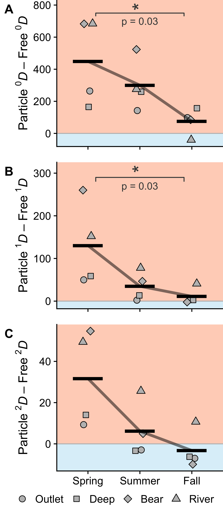

```r
# Are there significant differences in the fraction diversity over the three seasons? 
# Phylogenetic Richness 
wilcox.test(frac_difference ~ season, 
            data = dplyr::filter(wc_div_df, Diversity == "phylo_richness" & 
                                  season %in% c("Spring", "Summer"))) # NS  
```

```
## 
## 	Wilcoxon rank sum test
## 
## data:  frac_difference by season
## W = 11, p-value = 0.4857
## alternative hypothesis: true location shift is not equal to 0
```

```r
wilcox.test(frac_difference ~ season, 
            data = dplyr::filter(wc_div_df, Diversity == "phylo_richness" & 
                                  season %in% c("Summer", "Fall"))) # Significant!
```

```
## 
## 	Wilcoxon rank sum test
## 
## data:  frac_difference by season
## W = 16, p-value = 0.02857
## alternative hypothesis: true location shift is not equal to 0
```

```r
wilcox.test(frac_difference ~ season, 
            data = dplyr::filter(wc_div_df, Diversity == "phylo_richness" & 
                                  season %in% c("Spring", "Fall"))) # Marginal significance = 0.06
```

```
## 
## 	Wilcoxon rank sum test
## 
## data:  frac_difference by season
## W = 15, p-value = 0.05714
## alternative hypothesis: true location shift is not equal to 0
```

```r
# Phylogenetic Shannon 
wilcox.test(frac_difference ~ season, 
            data =dplyr::filter(wc_div_df, Diversity == "phylo_shannon" &
                                  season %in% c("Spring", "Summer"))) # NS
```

```
## 
## 	Wilcoxon rank sum test
## 
## data:  frac_difference by season
## W = 14, p-value = 0.1143
## alternative hypothesis: true location shift is not equal to 0
```

```r
wilcox.test(frac_difference ~ season, 
            data =dplyr::filter(wc_div_df, Diversity == "phylo_shannon" & 
                                  season %in% c("Summer", "Fall"))) # NS
```

```
## 
## 	Wilcoxon rank sum test
## 
## data:  frac_difference by season
## W = 12, p-value = 0.3429
## alternative hypothesis: true location shift is not equal to 0
```

```r
wilcox.test(frac_difference ~ season, 
            data =dplyr::filter(wc_div_df, Diversity == "phylo_shannon" & 
                                  season %in% c("Spring", "Fall"))) # Significant!
```

```
## 
## 	Wilcoxon rank sum test
## 
## data:  frac_difference by season
## W = 16, p-value = 0.02857
## alternative hypothesis: true location shift is not equal to 0
```

```r
# Phylogenetic Simpson 
wilcox.test(frac_difference ~ season, 
            data =dplyr::filter(wc_div_df, Diversity == "phylo_simpson" & 
                                  season %in% c("Spring", "Summer"))) # NS
```

```
## 
## 	Wilcoxon rank sum test
## 
## data:  frac_difference by season
## W = 10, p-value = 0.6857
## alternative hypothesis: true location shift is not equal to 0
```

```r
wilcox.test(frac_difference ~ season, 
            data =dplyr::filter(wc_div_df, Diversity == "phylo_simpson" & 
                                  season %in% c("Summer", "Fall"))) # NS
```

```
## 
## 	Wilcoxon rank sum test
## 
## data:  frac_difference by season
## W = 10, p-value = 0.6857
## alternative hypothesis: true location shift is not equal to 0
```

```r
wilcox.test(frac_difference ~ season, 
            data =dplyr::filter(wc_div_df, Diversity == "phylo_simpson" & 
                                  season %in% c("Spring", "Fall"))) # NS
```

```
## 
## 	Wilcoxon rank sum test
## 
## data:  frac_difference by season
## W = 10, p-value = 0.6857
## alternative hypothesis: true location shift is not equal to 0
```


```r
#################################################
######### PLOT THE HILL NUMBERS BY Q ############
#################################################
hill_nums <-  c(0,0,1,1,2,2)
div_orderr <- c("richness", "phylo_richness",
                "shannon", "phylo_shannon",
                "simpson", "phylo_simpson")

hill_nums_p <- wide_div_meta_df %>%
  dplyr::select(c(norep_filter_name:phylo_richness, lakesite, fraction, season)) %>%
  gather(key = Diversity, value = div_val, richness:phylo_richness) %>%
  mutate(Diversity = fct_relevel(Diversity, levels = div_orderr),
         hill_nums = factor(Diversity, labels = hill_nums),
         norep_water_name = paste(substr(norep_filter_name, 1,3), substr(norep_filter_name, 6,8), sep = "")) %>% 
  dplyr::filter(Diversity %in% c("richness", "shannon", "simpson")) %>%
  ggplot(aes(x = hill_nums, y = div_val, fill = fraction, shape = season, group = norep_filter_name)) +
  geom_point(size = 3, alpha = 0.8) +  
  labs(x = "q", y = "Hill Number") + 
  #facet_grid(.~fraction)+
  geom_line(size = 1.5, aes(color = fraction), alpha = 0.5) +
  scale_y_continuous(limits = c(0, 1500), breaks = seq(0, 1500, by = 250), expand = c(0,0)) +
  scale_fill_manual(values = fraction_colors) + 
  scale_shape_manual(values = season_shapes) +
  scale_color_manual(values = fraction_colors) +
  theme(legend.position = "none")


## 
hill_nums_p2 <- plot_grid(hill_nums_p, season_2row_legend, nrow = 2, ncol = 1, rel_heights = c(1, 0.1)); hill_nums_p2
```

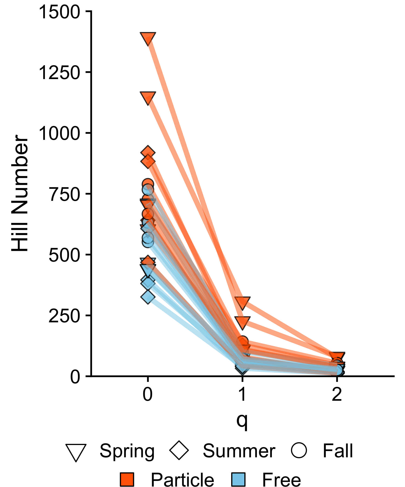


```r
# 2nd panel for Figure S4
tessst <- plot_grid(NULL, hill_nums_p2, NULL, ncol = 1, nrow = 3, rel_heights = c(0.74, 1, 0.6),labels = c("", "D", ""))

# Put first and second columns together! 
# Figure S4
plot_grid(ts_pp, tessst, ncol = 2)
```

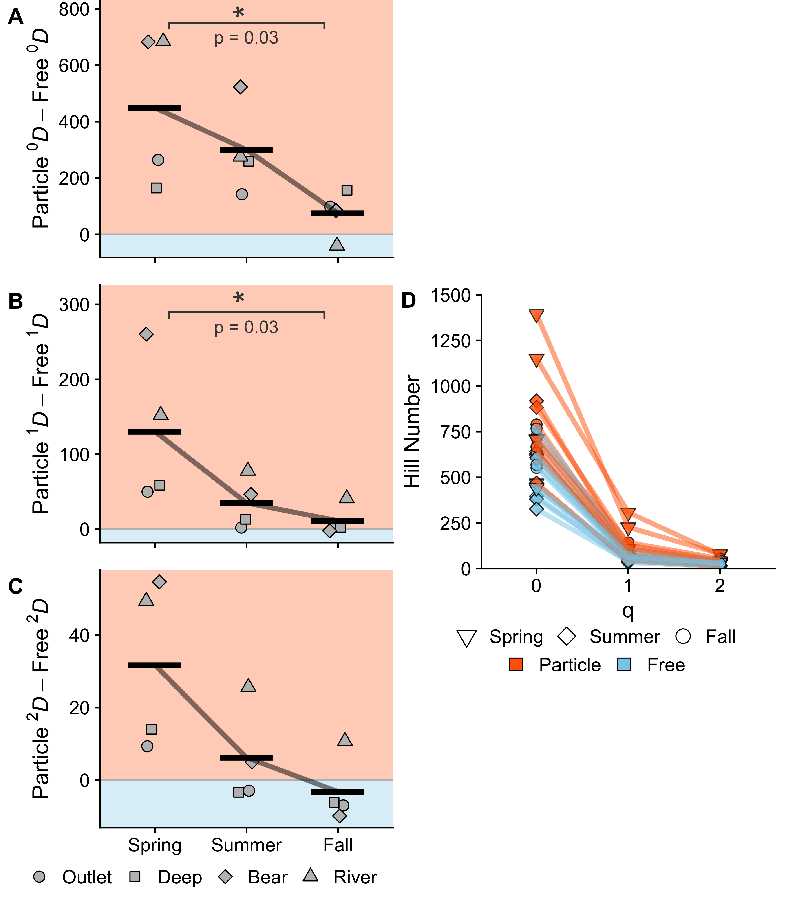

## Figure S6
**Compare Diversity Estimates across Station and Season**

```r
########## PLOT 
divs_PAFLA_plot_lakesite <- 
  long_div_meta_df %>%
  ggplot(aes(y = div_val, x = lakesite, shape = lakesite)) +
  ylab("Mean Diversity Value\n By Lake Station") +
  facet_wrap(hill_labels~., scales = "free", labeller = label_parsed, nrow = 2, ncol = 4) + 
    geom_point(size = 3, aes(fill = fraction), color = "black", position = position_jitterdodge()) +
  geom_boxplot(alpha = 0.5, outlier.shape = NA, color = "black", aes(fill = fraction)) +
  scale_fill_manual(values = fraction_colors) + 
  scale_shape_manual(values = lakesite_shapes) + 
  scale_color_manual(values = fraction_colors) + 
  theme(legend.position = "none", axis.title.x = element_blank(), 
        axis.text.x = element_text(angle = 30, vjust = 1, hjust = 1)) 

plot_A <- plot_grid(divs_PAFLA_plot_lakesite, lakesite_legend,
          nrow = 2, ncol = 1,  labels = c("A",""),
          rel_heights = c(1, 0.05))


divs_PAFLA_plot_season <- 
  long_div_meta_df %>%
  ggplot(aes(y = div_val, x = season, shape = season)) +
  ylab("Mean Diversity Value \n By Season") +
  facet_wrap(hill_labels~., scales = "free", labeller = label_parsed, nrow = 2, ncol = 4) + 
  geom_point(size = 3, aes(fill = fraction), color = "black", position = position_jitterdodge()) +
  geom_boxplot(alpha = 0.5, outlier.shape = NA, color = "black", aes(fill = fraction)) +
  scale_fill_manual(values = fraction_colors) + 
  scale_shape_manual(values = season_shapes) + 
  scale_color_manual(values = fraction_colors) + 
  theme(legend.position = "none", axis.title.x = element_blank(), 
        axis.text.x = element_text(angle = 30, vjust = 1, hjust = 1)) 

plot_B <- plot_grid(divs_PAFLA_plot_season, season_legend,
          nrow = 2, ncol = 1, labels = c("B",""),
          rel_heights = c(1, 0.05))

###### PLOT FIGURE S6
plot_grid(plot_A, plot_B,
          nrow = 2, ncol = 1)
```

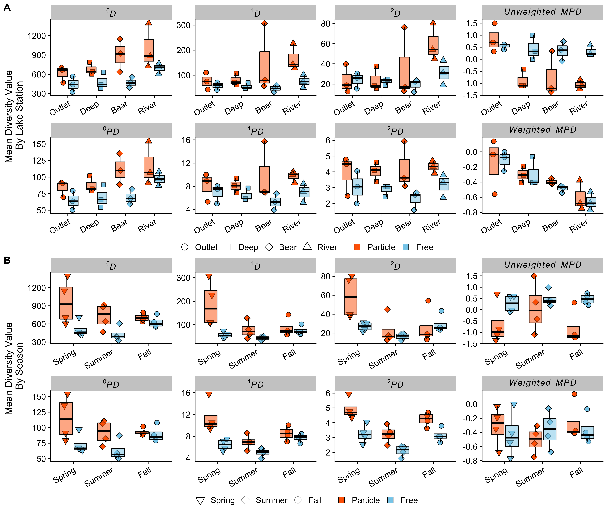

## Figure S7

```r
figS7_pvals <- c(summary(lm_prod_vs_shannon_PA)$coefficients[,4][2], summary(lm_percell_prod_vs_shannon_PA)$coefficients[,4][2])
figS7_adjusted_pvals <- p.adjust(figS7_pvals, method = "fdr")

######################################################### 1D = SHANNON DIVERSITY (EXP(SHANNON ENTROPY))
######################################################### 1D = SHANNON DIVERSITY (EXP(SHANNON ENTROPY))
shannon_fraction_wilcox <- wilcox.test(shannon ~ fraction, data = wide_div_meta_df)
shannon_fraction_wilcox   
```

```
## 
## 	Wilcoxon rank sum test
## 
## data:  shannon by fraction
## W = 120, p-value = 0.004513
## alternative hypothesis: true location shift is not equal to 0
```

```r
wide_div_meta_df%>%
  group_by(fraction) %>%
  summarize(mean(shannon), sd(shannon), min(shannon), max(shannon))
```

```
## # A tibble: 2 x 5
##   fraction `mean(shannon)` `sd(shannon)` `min(shannon)` `max(shannon)`
##   <fct>              <dbl>         <dbl>          <dbl>          <dbl>
## 1 Particle           117.           77.8           42.2           307.
## 2 Free                58.5          18.5           32.8           102.
```

```r
# Make a data frame to draw significance line in boxplot (visually calculated)
shannon_nums <- data.frame(a = c(1.15,1.15,1.85,1.85), b = c(300, 305, 305, 300)) # WholePart vs WholeFree

shannon_distribution_plot <- 
  wide_div_meta_df %>%
  ggplot(aes(y = shannon, x = fraction)) +
  scale_fill_manual(values = fraction_colors) +
  geom_jitter(size = 3, aes(shape = season, fill = fraction), width = 0.2) + 
  geom_boxplot(alpha = 0.5, outlier.shape = NA, aes(fill = fraction)) +
  scale_y_continuous(limits = c(0,325), breaks = seq(from = 0, to = 300, by = 50)) + 
  labs(y = expression({}^1*italic(D)),
       x = "Fraction") +
  scale_shape_manual(values = season_shapes) +
    # Add line and pval
  geom_path(data = shannon_nums, aes(x = a, y = b), linetype = 1, color = "#424645") +
  annotate("text", x=1.5, y=325, size = 8, color = "#424645", label= paste("**"), angle = 90) +
  annotate("text", x=1.5, y=250, size = 4, color = "#424645",
           label= paste("p =", round(shannon_fraction_wilcox$p.value, digits = 3))) +
  theme(legend.position = "none",# axis.title.y = element_blank(),
        axis.title.x = element_blank(), axis.text.x = element_blank()) +
  coord_flip()

################ Shannon vs Community-wide (Per-Liter) Production 
## 1. Extract the R2 and p-value from the linear model: 
lm_lab_perliter_shannon_PA <- paste("atop(R^2 ==", round(summary(lm_prod_vs_shannon_PA)$adj.r.squared, digits = 2), ",",
             "p ==", round(unname(figS7_adjusted_pvals[1]), digits = 3), ")")

## 2. Plot Shannon vs Community-wide (Per-Liter) Production 
prod_vs_shannon_plot <-  
  wide_div_meta_df %>%
  # Fetch the standard error from diversity measure to plot error bars 
  left_join(filter(div_iNEXT, Diversity == "Shannon diversity"), by = "norep_filter_name") %>%
  rename(se_iNEXT ="s.e.") %>%
  ggplot(aes(x=shannon, y=frac_bacprod)) + 
  geom_errorbarh(aes(xmin = shannon - se_iNEXT, xmax = shannon + se_iNEXT, 
                     color = fraction), alpha = 0.7) + # X-axis errorbars
  geom_errorbar(aes(ymin = frac_bacprod - SD_frac_bacprod, ymax = frac_bacprod + SD_frac_bacprod, color = fraction)) +  # Y-axis errorbars
  geom_point(size = 3.5, color = "black", aes(fill = fraction, shape = season)) +
  scale_color_manual(values = fraction_colors) +
  scale_shape_manual(values = season_shapes) +
  scale_fill_manual(values = fraction_colors) +
  labs(x = expression({}^1*italic(D)),
       y = expression(atop("Community Production", "(μgC/L/day)"))) +
  scale_x_continuous(limits = c(0,325), breaks = seq(from = 0, to = 300, by = 50)) + 
  scale_y_continuous(limits = c(-5, 75), breaks = seq(0, 75, by = 15)) +
  geom_smooth(data=filter(wide_div_meta_df, fraction == "Particle"), method='lm', color = "#FF6600", fill = "#FF6600") + 
  # Add the R2 and p-value to the plot 
  annotate("text", x=250, y=45, label=lm_lab_perliter_shannon_PA, parse = TRUE, color = "#FF6600", size = 4) +
  theme(legend.position = "none") 


################ Shannon vs Per Capitra (Per-Cell) Production 
## 1. Extract the R2 and p-value from the linear model: 
lm_lab_percell_shannon_PA <- paste("atop(R^2 ==", round(summary(lm_percell_prod_vs_shannon_PA)$adj.r.squared, digits = 2), ",",
             "p ==", round(unname(figS7_adjusted_pvals[2]), digits = 3), ")")

## 2. Plot Shannon vs Per Capitra (Per-Cell) Production 
percell_prod_vs_shannon_plot <-   
  wide_div_meta_df %>%
  # Fetch the standard error from diversity measure to plot error bars 
  left_join(filter(div_iNEXT, Diversity == "Shannon diversity"), by = "norep_filter_name") %>%
  rename(se_iNEXT ="s.e.") %>%
  ggplot(aes(x=shannon, y=log10(fracprod_per_cell_noinf))) + 
  geom_errorbarh(aes(xmin = shannon - se_iNEXT, xmax = shannon + se_iNEXT, 
                     color = fraction), alpha = 0.7) +
  geom_point(size = 3.5, color = "black", aes(fill = fraction, shape = season)) +
  scale_color_manual(values = fraction_colors) +
  scale_fill_manual(values = fraction_colors) +
  scale_shape_manual(values = season_shapes) +
  labs(x = expression({}^1*italic(D)),
       y = expression(atop(log[10]*"(Per-Capita Production)", "(μgC/cell/day)"))) +
  geom_smooth(data=filter(wide_div_meta_df, fraction == "Particle"), method='lm', color = "#FF6600", fill = "#FF6600") + 
  scale_x_continuous(limits = c(0,325), breaks = seq(from = 0, to = 300, by = 50)) + 
  scale_y_continuous(limits = c(-8.5,-5), breaks = seq(from = -8, to =-5, by = 1)) + 
  # Add the R2 and p-value to the plot 
  annotate("text", x=250, y=-7.5, label=lm_lab_percell_shannon_PA, parse = TRUE, color = "#FF6600", size = 4) +
  theme(legend.title = element_blank(), legend.position = "none")


shannon_plots <- plot_grid(prod_vs_shannon_plot + theme(plot.margin = unit(c(0.2,0.2,0.2,0.8), "cm")), 
                           percell_prod_vs_shannon_plot + theme(legend.position = "none"),
                                   labels = c("A", "B"), ncol = 1, nrow = 2,
                                   rel_heights = c(1,1), align = "v")

######## PLOT FIGURE S6
plot_grid(shannon_plots, season_2row_legend,
                   ncol = 1, nrow = 2, 
                   rel_heights = c(1, 0.08))
```

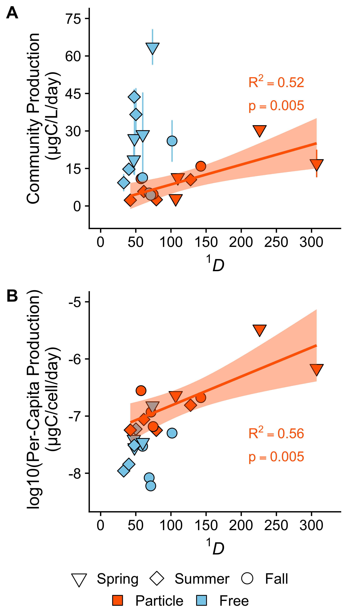

## Figure S8
**PD and Productivity**

```r
# FDR Correction 
figS8_pvals <- c(summary(lm_prod_vs_phylorich_PA)$coefficients[,4][2], summary(lm_percell_prod_vs_phylorich_PA)$coefficients[,4][2],
                 summary(lm_prod_vs_phyloshan_PA)$coefficients[,4][2], summary(lm_percell_prod_vs_phyloshan_PA)$coefficients[,4][2],
                summary(lm_prod_vs_phylosimps_PA)$coefficients[,4][2],summary(lm_percell_prod_vs_phylosimps_PA)$coefficients[,4][2]);
figS8_adjusted_pvals <- p.adjust(figS8_pvals, method = "fdr")

######################################################### PHYLOGENETIC RICHNESS ######################################################### 
# Set axis scales for phylo_richness
phylorich_limits <- c(25, 175)
phylorich_breaks <- seq(from = 25, to =175, by = 50)

#### Are particles more phylogenetically rich compared to free-living?
phylorich_fraction_wilcox <- wilcox.test(phylo_richness ~ fraction, data = wide_div_meta_df)
phylorich_fraction_wilcox
```

```
## 
## 	Wilcoxon rank sum test
## 
## data:  phylo_richness by fraction
## W = 119, p-value = 0.00556
## alternative hypothesis: true location shift is not equal to 0
```

```r
wide_div_meta_df %>%
  group_by(fraction) %>%
  summarize(mean(phylo_richness), sd(phylo_richness), min(phylo_richness), max(phylo_richness))
```

```
## # A tibble: 2 x 5
##   fraction `mean(phylo_richness)` `sd(phylo_richness)` `min(phylo_richness)` `max(phylo_richness)`
##   <fct>                     <dbl>                <dbl>                 <dbl>                 <dbl>
## 1 Particle                  100.                  24.1                  69.5                  154.
## 2 Free                       75.1                 17.8                  50.3                  108.
```

```r
# Make a data frame to draw significance line in boxplot (visually calculated)
phylorich_nums <- data.frame(a = c(1.15,1.15,1.85,1.85), b = c(155, 160, 160, 155)) # WholePart vs WholeFree

phylorich_distribution_plot <- 
  wide_div_meta_df %>%
  ggplot(aes(y = phylo_richness, x = fraction)) +
  scale_fill_manual(values = fraction_colors) +
  geom_jitter(size = 3, aes(fill = fraction, shape = season), width = 0.2) + 
  geom_boxplot(alpha = 0.5, outlier.shape = NA, aes(fill = fraction)) +
  scale_y_continuous(limits = phylorich_limits, breaks = phylorich_breaks, expand = c(0, 0)) + 
  labs(y = expression({}^0*italic(PD)),
       x = "Fraction") +
  scale_shape_manual(values = season_shapes) +
  geom_path(data = phylorich_nums, aes(x = a, y = b), linetype = 1, color = "#424645") +
  annotate("text", x=1.5, y=170, size = 8, color = "#424645", label= paste("**"), angle = 90) +
  annotate("text", x=1.5, y=135, size = 4, color = "#424645",
           label= paste("p =", round(phylorich_fraction_wilcox$p.value, digits = 3))) +
  theme(legend.position = "none",# axis.title.y = element_blank(),
        axis.title.x = element_blank(), axis.text.x = element_blank()) +
  coord_flip()

################ Richness vs Community-wide (Per-Liter) Production 
## 1. Extract the R2 and p-value from the linear model: 
lm_lab_perliter_phylorich_PA <- paste("atop(R^2 ==", round(summary(lm_prod_vs_phylorich_PA)$adj.r.squared, digits = 2), ",",
             "p ==", round(unname(figS8_adjusted_pvals[1]), digits = 2), ")")

## 2. Plot Richness vs Community-wide (Per-Liter) Production 
prod_vs_phylorich_plot <-  
  wide_div_meta_df %>%
  ggplot(aes(x=phylo_richness, y=frac_bacprod)) + 
  geom_errorbar(aes(ymin = frac_bacprod - SD_frac_bacprod, ymax = frac_bacprod + SD_frac_bacprod, 
                    color = fraction)) +  # Y-axis errorbars
  geom_point(size = 3.5, color = "black", aes(fill = fraction, shape = season)) +
  scale_color_manual(values = fraction_colors) +
  scale_fill_manual(values = fraction_colors) +
  scale_shape_manual(values = season_shapes) +
  labs(x = expression({}^0*italic(PD)),
       y = expression(atop("Community Production", "(μgC/L/day)"))) +
  geom_smooth(data=filter(wide_div_meta_df, fraction == "Particle"), 
              method='lm', color = "#FF6600", fill = "#FF6600") + 
  scale_x_continuous(limits = phylorich_limits, breaks = phylorich_breaks, expand = c(0, 0)) + 
  scale_y_continuous(limits = c(-5, 75), breaks = seq(0, 75, by = 15)) +
   # Add the R2 and p-value to the plot 
  annotate("text", x=130, y=50, label=lm_lab_perliter_phylorich_PA, parse = TRUE, color = "#FF6600", size = 4) +
  theme(legend.position = "none") 

# Summary stats 
summary(lm(frac_bacprod ~ phylo_richness, data = filter(wide_div_meta_df, fraction == "Particle")))
```

```
## 
## Call:
## lm(formula = frac_bacprod ~ phylo_richness, data = filter(wide_div_meta_df, 
##     fraction == "Particle"))
## 
## Residuals:
##     Min      1Q  Median      3Q     Max 
## -10.149  -2.542  -0.352   3.800   8.312 
## 
## Coefficients:
##                 Estimate Std. Error t value Pr(>|t|)   
## (Intercept)    -16.84405    6.89756  -2.442  0.03473 * 
## phylo_richness   0.26781    0.06716   3.988  0.00257 **
## ---
## Signif. codes:  0 '***' 0.001 '**' 0.01 '*' 0.05 '.' 0.1 ' ' 1
## 
## Residual standard error: 5.372 on 10 degrees of freedom
## Multiple R-squared:  0.6139,	Adjusted R-squared:  0.5753 
## F-statistic:  15.9 on 1 and 10 DF,  p-value: 0.002568
```

```r
# WITHOUT THE TWO HIGH POINTS 
summary(lm(frac_bacprod ~ phylo_richness, data = filter(wide_div_meta_df, fraction == "Particle" & richness < 1000)))
```

```
## 
## Call:
## lm(formula = frac_bacprod ~ phylo_richness, data = filter(wide_div_meta_df, 
##     fraction == "Particle" & richness < 1000))
## 
## Residuals:
##    Min     1Q Median     3Q    Max 
## -6.037 -3.272 -1.601  3.479  8.703 
## 
## Coefficients:
##                Estimate Std. Error t value Pr(>|t|)
## (Intercept)     0.73301   11.84812   0.062    0.952
## phylo_richness  0.07086    0.12893   0.550    0.598
## 
## Residual standard error: 4.848 on 8 degrees of freedom
## Multiple R-squared:  0.03638,	Adjusted R-squared:  -0.08407 
## F-statistic: 0.3021 on 1 and 8 DF,  p-value: 0.5976
```

```r
################ Richness vs Per Capita (Per-Cell) Production 
## 1. Extract the R2 and p-value from the linear model: 
lm_lab_percell_phylorich_PA <- paste("atop(R^2 ==", round(summary(lm_percell_prod_vs_phylorich_PA)$adj.r.squared, digits = 2), ",",
             "p ==", round(unname(figS8_adjusted_pvals[2]), digits = 2), ")")

## 2. Plot Richness vs Per Capita (Per-Cell) Production 
percell_prod_vs_phylorich_plot <- 
  wide_div_meta_df %>%
  ggplot(aes(x=phylo_richness, y=log10(fracprod_per_cell_noinf))) + 
  geom_point(size = 3.5,  color = "black", aes(fill = fraction, shape = season)) +
  scale_color_manual(values = fraction_colors) +
  scale_fill_manual(values = fraction_colors) +
  scale_shape_manual(values = season_shapes) +
  labs(x = expression({}^0*italic(PD)),
       y = expression(atop(log[10]*"(Per-Capita Production)", "(μgC/cell/day)"))) +
  geom_smooth(data=filter(wide_div_meta_df, fraction == "Particle"), 
              method='lm', color = "#FF6600", fill = "#FF6600") + 
  scale_x_continuous(limits = phylorich_limits, breaks = phylorich_breaks, expand = c(0, 0)) +   
  scale_y_continuous(limits = c(-8.5,-5), breaks = seq(from = -8, to =-5, by = 1)) + 
  # Add the R2 and p-value to the plot 
  annotate("text", x=150, y=-7.5, label=lm_lab_percell_phylorich_PA, parse = TRUE, color = "#FF6600", size = 4) +
  theme(legend.title = element_blank(), legend.position ="bottom", 
        legend.text = element_text(size = 14))

# Summary stats 
summary(lm(log10(fracprod_per_cell_noinf) ~ phylo_richness, data = filter(wide_div_meta_df, fraction == "Particle")))
```

```
## 
## Call:
## lm(formula = log10(fracprod_per_cell_noinf) ~ phylo_richness, 
##     data = filter(wide_div_meta_df, fraction == "Particle"))
## 
## Residuals:
##      Min       1Q   Median       3Q      Max 
## -0.67460 -0.19919 -0.00661  0.29035  0.44116 
## 
## Coefficients:
##                 Estimate Std. Error t value Pr(>|t|)    
## (Intercept)    -8.375458   0.464552  -18.03 2.26e-08 ***
## phylo_richness  0.016357   0.004482    3.65  0.00532 ** 
## ---
## Signif. codes:  0 '***' 0.001 '**' 0.01 '*' 0.05 '.' 0.1 ' ' 1
## 
## Residual standard error: 0.3563 on 9 degrees of freedom
##   (1 observation deleted due to missingness)
## Multiple R-squared:  0.5968,	Adjusted R-squared:  0.552 
## F-statistic: 13.32 on 1 and 9 DF,  p-value: 0.005318
```

```r
# WITHOUT THE TWO HIGH POINTS 
summary(lm(log10(fracprod_per_cell_noinf) ~ phylo_richness, data = filter(wide_div_meta_df, fraction == "Particle" & phylo_richness < 130)))
```

```
## 
## Call:
## lm(formula = log10(fracprod_per_cell_noinf) ~ phylo_richness, 
##     data = filter(wide_div_meta_df, fraction == "Particle" & 
##         phylo_richness < 130))
## 
## Residuals:
##      Min       1Q   Median       3Q      Max 
## -0.32581 -0.25622  0.00142  0.25025  0.37148 
## 
## Coefficients:
##                  Estimate Std. Error t value Pr(>|t|)    
## (Intercept)    -6.8918283  0.7071461  -9.746 2.53e-05 ***
## phylo_richness -0.0003898  0.0076924  -0.051    0.961    
## ---
## Signif. codes:  0 '***' 0.001 '**' 0.01 '*' 0.05 '.' 0.1 ' ' 1
## 
## Residual standard error: 0.2892 on 7 degrees of freedom
##   (1 observation deleted due to missingness)
## Multiple R-squared:  0.0003667,	Adjusted R-squared:  -0.1424 
## F-statistic: 0.002568 on 1 and 7 DF,  p-value: 0.961
```

```r
######################################################### 1D = PHYLOGENETIC SHANNON DIVERSITY (EXP(SHANNON ENTROPY))
######################################################### 1D = PHYLOGENETIC SHANNON DIVERSITY (EXP(SHANNON ENTROPY))
# Set axis scales for phylo_richness
phyloshan_limits <- c(0, 20)
phyloshan_breaks <- seq(from = 0, to =20, by = 5)

phyloshannon_fraction_wilcox <- wilcox.test(phylo_shannon ~ fraction, data = wide_div_meta_df)
phyloshannon_fraction_wilcox   
```

```
## 
## 	Wilcoxon rank sum test
## 
## data:  phylo_shannon by fraction
## W = 120, p-value = 0.004513
## alternative hypothesis: true location shift is not equal to 0
```

```r
wide_div_meta_df%>%
  group_by(fraction) %>%
  summarize(mean(phylo_shannon), sd(phylo_shannon), min(phylo_shannon), max(phylo_shannon))
```

```
## # A tibble: 2 x 5
##   fraction `mean(phylo_shannon)` `sd(phylo_shannon)` `min(phylo_shannon)` `max(phylo_shannon)`
##   <fct>                    <dbl>               <dbl>                <dbl>                <dbl>
## 1 Particle                  8.95                2.65                 5.32                15.8 
## 2 Free                      6.37                1.41                 3.91                 8.44
```

```r
# Make a data frame to draw significance line in boxplot (visually calculated)
phyloshannon_nums <- data.frame(a = c(1.15,1.15,1.85,1.85), b = c(18.25, 18.5, 18.5, 18.25)) # WholePart vs WholeFree

phyloshan_distribution_plot <- 
  wide_div_meta_df %>%
  ggplot(aes(y = phylo_shannon, x = fraction)) +
  scale_fill_manual(values = fraction_colors) +
  geom_jitter(size = 3, aes(shape = season, fill = fraction), width = 0.2) + 
  geom_boxplot(alpha = 0.5, outlier.shape = NA, aes(fill = fraction)) +
  scale_y_continuous(limits = phyloshan_limits, breaks = phyloshan_breaks, expand = c(0,0)) + 
   labs(y = expression({}^1*italic(PD)),
       x = "Fraction") +
  scale_shape_manual(values = season_shapes) +
    # Add line and pval
  geom_path(data = phyloshannon_nums, aes(x = a, y = b), linetype = 1, color = "#424645") +
  annotate("text", x=1.5, y=20, size = 8, color = "#424645", label= paste("**"), angle = 90) +
  annotate("text", x=1.5, y=15.5, size = 4, color = "#424645",
           label= paste("p =", round(phyloshannon_fraction_wilcox$p.value, digits = 3))) +
  theme(legend.position = "none",# axis.title.y = element_blank(),
        axis.title.x = element_blank(), axis.text.x = element_blank()) +
  coord_flip()

################ Shannon vs Community-wide (Per-Liter) Production 
## 1. Extract the R2 and p-value from the linear model: 
lm_lab_perliter_phyloshan_PA <- paste("atop(R^2 ==", round(summary(lm_prod_vs_phyloshan_PA)$adj.r.squared, digits = 2), ",",
             "p ==", round(unname(figS8_adjusted_pvals[3]), digits = 2), ")")

## 2. Plot Shannon vs Community-wide (Per-Liter) Production 
prod_vs_phyloshan_plot <-  
  wide_div_meta_df %>%
  ggplot(aes(x=phylo_shannon, y=frac_bacprod)) + 
  geom_errorbar(aes(ymin = frac_bacprod - SD_frac_bacprod, ymax = frac_bacprod + SD_frac_bacprod, color = fraction)) +  # Y-axis errorbars
  geom_point(size = 3.5, color = "black", aes(fill = fraction, shape = season)) +
  scale_color_manual(values = fraction_colors) +
  scale_shape_manual(values = season_shapes) +
  scale_fill_manual(values = fraction_colors) +
  labs(x = expression({}^1*italic(PD)),
       y = expression(atop("Community Production", "(μgC/L/day)"))) +
  scale_x_continuous(limits = phyloshan_limits, breaks = phyloshan_breaks, expand = c(0,0)) + 
  scale_y_continuous(limits = c(-5, 75), breaks = seq(0, 75, by = 15)) +
  geom_smooth(data=filter(wide_div_meta_df, fraction == "Particle"), method='lm', color = "#FF6600", fill = NA, linetype = "dotted") + 
  # Add the R2 and p-value to the plot 
  annotate("text", x=15, y=50, label=lm_lab_perliter_phyloshan_PA, parse = TRUE, color = "#FF6600", size = 4) +
  theme(legend.position = "none") 


################ Shannon vs Per Capitra (Per-Cell) Production 
## 1. Extract the R2 and p-value from the linear model: 
lm_lab_percell_phyloshan_PA <- paste("atop(R^2 ==", round(summary(lm_percell_prod_vs_phyloshan_PA)$adj.r.squared, digits = 2), ",",
             "p ==", round(unname(figS8_adjusted_pvals[4]), digits = 2), ")")

## 2. Plot Shannon vs Per Capitra (Per-Cell) Production 
percell_prod_vs_phyloshan_plot <-   
  wide_div_meta_df %>%
  ggplot(aes(x=phylo_shannon, y=log10(fracprod_per_cell_noinf))) + 
  geom_point(size = 3.5, color = "black", aes(fill = fraction, shape = season)) +
  scale_color_manual(values = fraction_colors) +
  scale_fill_manual(values = fraction_colors) +
  scale_shape_manual(values = season_shapes) +
  labs(x = expression({}^1*italic(PD)),
       y = expression(atop(log[10]*"(Per-Capita Production)", "(μgC/cell/day)"))) +
  geom_smooth(data=filter(wide_div_meta_df, fraction == "Particle"), method='lm', color = "#FF6600", fill = NA, linetype = "dotted") + 
  scale_x_continuous(limits = phyloshan_limits, breaks = phyloshan_breaks, expand = c(0,0)) + 
  scale_y_continuous(limits = c(-8.5,-5), breaks = seq(from = -8, to =-5, by = 1)) + 
  # Add the R2 and p-value to the plot 
  annotate("text", x=15, y=-7.5, label=lm_lab_percell_phyloshan_PA, parse = TRUE, color = "#FF6600", size = 4) +
  theme(legend.title = element_blank(), legend.position = "none")


phyloshan_plots <- plot_grid(phyloshan_distribution_plot, prod_vs_phyloshan_plot, percell_prod_vs_phyloshan_plot,
          #labels = c("B", "D", "F"), 
          ncol = 1, nrow = 3,
          rel_heights = c(0.5, 0.8, 1.1),
          align = "v")


######################################################### 2D = SIMPSON DIVERSITY (INVERSE SIMPSON)
######################################################### 2D = SIMPSON DIVERSITY (INVERSE SIMPSON)
# Set axis scales for phylo_richness
phylosimps_limits <- c(1, 7)
phylosimps_breaks <- seq(from = 1, to = 7, by = 1)

phylosimps_fraction_wilcox <- wilcox.test(phylo_simpson ~ fraction, data = wide_div_meta_df)
phylosimps_fraction_wilcox
```

```
## 
## 	Wilcoxon rank sum test
## 
## data:  phylo_simpson by fraction
## W = 128, p-value = 0.000656
## alternative hypothesis: true location shift is not equal to 0
```

```r
wide_div_meta_df %>%
  group_by(fraction) %>%
  summarize(mean(phylo_simpson), sd(phylo_simpson), min(phylo_simpson), max(phylo_simpson))
```

```
## # A tibble: 2 x 5
##   fraction `mean(phylo_simpson)` `sd(phylo_simpson)` `min(phylo_simpson)` `max(phylo_simpson)`
##   <fct>                    <dbl>               <dbl>                <dbl>                <dbl>
## 1 Particle                  4.12               0.906                 2.48                 5.94
## 2 Free                      2.83               0.711                 1.59                 4.05
```

```r
# Make a data frame to draw significance line in boxplot (visually calculated)
phylosimps_nums <- data.frame(a = c(1.15,1.15,1.85,1.85), b = c(6.1,6.2,6.2,6.1)) # WholePart vs WholeFree

phylosimps_distribution_plot <- 
  wide_div_meta_df %>%
  ggplot(aes(y = phylo_simpson, x = fraction)) +
  scale_fill_manual(values = fraction_colors) +
  scale_shape_manual(values = season_shapes) +
  geom_jitter(size = 3,  aes(fill = fraction, shape = season), width = 0.2) + 
  geom_boxplot(alpha = 0.5, outlier.shape = NA, aes(fill = fraction)) +
  scale_y_continuous(limits = phylosimps_limits, breaks = phylosimps_breaks, expand = c(0,0)) + 
  labs(y = expression({}^2*italic(PD)),
       x = "Fraction") +
  geom_path(data = phylosimps_nums, aes(x = a, y = b), linetype = 1, color = "#424645") +
  annotate("text", x=1.5, y=6.5, size = 4, color = "#424645", label= "NS") +
  theme(legend.position = "none", #axis.title.y = element_blank(),
        axis.title.x = element_blank(), axis.text.x = element_blank()) +
  coord_flip()


################ Inverse Simpson vs Community-wide (Per-Liter) Production 
## 1. Extract the R2 and p-value from the linear model: 
lm_lab_perliter_phylosimps_PA <- paste("atop(R^2 ==", round(summary(lm_prod_vs_phylosimps_PA)$adj.r.squared, digits = 2), ",",
             "p ==", round(unname(figS8_adjusted_pvals[5]), digits = 2), ")")

## 2. Plot Inverse Simpson vs Community-wide (Per-Liter) Production 
prod_vs_phylosimps_plot <-  
  wide_div_meta_df %>%
  ggplot(aes(x=phylo_simpson, y=frac_bacprod)) + 
  geom_errorbar(aes(ymin = frac_bacprod - SD_frac_bacprod, ymax = frac_bacprod + SD_frac_bacprod, color = fraction)) +  # Y-axis errorbars
  geom_point(size = 3.5, color = "black", aes(fill = fraction, shape = season)) +
  scale_color_manual(values = fraction_colors) +
  scale_fill_manual(values = fraction_colors) +
  scale_shape_manual(values = season_shapes) +
  labs(x = expression({}^2*italic(PD)),
       y = expression(atop("Community Production", "(μgC/L/day)"))) +
  scale_x_continuous(limits = phylosimps_limits, breaks = phylosimps_breaks, expand = c(0,0)) + 
  scale_y_continuous(limits = c(-5, 75), breaks = seq(0, 75, by = 15)) +
  theme(legend.position = "none") 

# Summary stats 
summary(lm(frac_bacprod ~ phylo_simpson, data = filter(wide_div_meta_df, fraction == "Particle")))
```

```
## 
## Call:
## lm(formula = frac_bacprod ~ phylo_simpson, data = filter(wide_div_meta_df, 
##     fraction == "Particle"))
## 
## Residuals:
##     Min      1Q  Median      3Q     Max 
## -9.0325 -3.5603 -0.8954  1.8803 19.6664 
## 
## Coefficients:
##               Estimate Std. Error t value Pr(>|t|)
## (Intercept)     -7.938     10.655  -0.745    0.473
## phylo_simpson    4.340      2.529   1.716    0.117
## 
## Residual standard error: 7.598 on 10 degrees of freedom
## Multiple R-squared:  0.2276,	Adjusted R-squared:  0.1503 
## F-statistic: 2.946 on 1 and 10 DF,  p-value: 0.1168
```

```r
# WITHOUT THE TWO HIGH POINTS 
summary(lm(frac_bacprod ~ phylo_simpson, data = filter(wide_div_meta_df, fraction == "Particle" & simpson < 70)))
```

```
## 
## Call:
## lm(formula = frac_bacprod ~ phylo_simpson, data = filter(wide_div_meta_df, 
##     fraction == "Particle" & simpson < 70))
## 
## Residuals:
##     Min      1Q  Median      3Q     Max 
## -6.2761 -2.7097 -0.1173  2.9041  6.3229 
## 
## Coefficients:
##               Estimate Std. Error t value Pr(>|t|)
## (Intercept)     -4.804      7.409  -0.648    0.535
## phylo_simpson    3.060      1.859   1.646    0.138
## 
## Residual standard error: 4.269 on 8 degrees of freedom
## Multiple R-squared:  0.253,	Adjusted R-squared:  0.1597 
## F-statistic:  2.71 on 1 and 8 DF,  p-value: 0.1383
```

```r
################ Inverse Simpson vs Per Capitra (Per-Cell) Production 
## 1. Extract the R2 and p-value from the linear model: 
lm_lab_percell_phylosimps_PA <- paste("atop(R^2 ==", round(summary(lm_percell_prod_vs_phylosimps_PA)$adj.r.squared, digits = 2), ",",
             "p ==", round(unname(figS8_adjusted_pvals[6]), digits = 2), ")")

## 2. Plot Inverse Simpson vs Per Capitra (Per-Cell) Production 
percell_prod_vs_phylosimps_plot <- 
  wide_div_meta_df %>%
  ggplot(aes(x=phylo_simpson, y=log10(fracprod_per_cell_noinf))) + 
  geom_point(size = 3.5, color = "black", aes(shape = season, fill = fraction)) +
  scale_color_manual(values = fraction_colors, guide = TRUE) +
  scale_fill_manual(values = fraction_colors, guide = FALSE) +
  scale_shape_manual(values = season_shapes) +
  labs(x = expression({}^2*italic(PD)),
       y = expression(atop(log[10]*"(Per-Capita Production)", "(μgC/cell/day)"))) +
  scale_x_continuous(limits = phylosimps_limits, breaks = phylosimps_breaks, expand = c(0,0)) + 
  scale_y_continuous(limits = c(-8.5,-5), breaks = seq(from = -8, to =-5, by = 1)) + 
  #geom_smooth(data=filter(wide_div_meta_df, fraction == "Particle"), method='lm', color = "#FF6600", fill = NA, linetype = "dotted") + 
  # Add the R2 and p-value to the plot 
  #annotate("text", x=6, y=-7.5, label=lm_lab_percell_phylosimps_PA, parse = TRUE, color = "#FF6600", size = 4) +
  guides(color = guide_legend(override.aes = list(shape = 15))) +
  theme(legend.title = element_blank(), legend.position ="bottom", 
        legend.text = element_text(size = 14))

# Summary stats 
summary(lm(log10(fracprod_per_cell_noinf) ~ phylo_simpson, data = filter(wide_div_meta_df, fraction == "Particle")))
```

```
## 
## Call:
## lm(formula = log10(fracprod_per_cell_noinf) ~ phylo_simpson, 
##     data = filter(wide_div_meta_df, fraction == "Particle"))
## 
## Residuals:
##      Min       1Q   Median       3Q      Max 
## -0.59626 -0.18652 -0.08578 -0.02009  1.15951 
## 
## Coefficients:
##               Estimate Std. Error t value Pr(>|t|)    
## (Intercept)    -8.0385     0.6598 -12.182 6.77e-07 ***
## phylo_simpson   0.3230     0.1587   2.036   0.0723 .  
## ---
## Signif. codes:  0 '***' 0.001 '**' 0.01 '*' 0.05 '.' 0.1 ' ' 1
## 
## Residual standard error: 0.4643 on 9 degrees of freedom
##   (1 observation deleted due to missingness)
## Multiple R-squared:  0.3153,	Adjusted R-squared:  0.2392 
## F-statistic: 4.144 on 1 and 9 DF,  p-value: 0.07227
```

```r
# WITHOUT THE TWO HIGH POINTS 
summary(lm(log10(fracprod_per_cell_noinf) ~ phylo_simpson, data = filter(wide_div_meta_df, fraction == "Particle" & simpson < 70)))
```

```
## 
## Call:
## lm(formula = log10(fracprod_per_cell_noinf) ~ phylo_simpson, 
##     data = filter(wide_div_meta_df, fraction == "Particle" & 
##         simpson < 70))
## 
## Residuals:
##     Min      1Q  Median      3Q     Max 
## -0.3945 -0.0617 -0.0387  0.1000  0.4132 
## 
## Coefficients:
##               Estimate Std. Error t value Pr(>|t|)    
## (Intercept)    -7.7185     0.4377 -17.633 4.65e-07 ***
## phylo_simpson   0.2069     0.1126   1.838    0.109    
## ---
## Signif. codes:  0 '***' 0.001 '**' 0.01 '*' 0.05 '.' 0.1 ' ' 1
## 
## Residual standard error: 0.2376 on 7 degrees of freedom
##   (1 observation deleted due to missingness)
## Multiple R-squared:  0.3255,	Adjusted R-squared:  0.2291 
## F-statistic: 3.377 on 1 and 7 DF,  p-value: 0.1087
```


```r
# All plots together 
phydiv_BEF <- plot_grid(prod_vs_phylorich_plot + theme(plot.margin = unit(c(0.2,0.2,0.2,0.8), "cm")), 
                        prod_vs_phyloshan_plot, prod_vs_phylosimps_plot,
          percell_prod_vs_phylorich_plot + theme(legend.position = "none"),
          percell_prod_vs_phyloshan_plot + theme(legend.position = "none"),
          percell_prod_vs_phylosimps_plot + theme(legend.position = "none"),
          labels = c("A", "B", "C", "D", "E", "F"), ncol = 3, nrow = 2, 
          align = "hv")

plot_grid(phydiv_BEF, season_legend, rel_heights = c(1, 0.05), nrow = 2, ncol = 1)
```

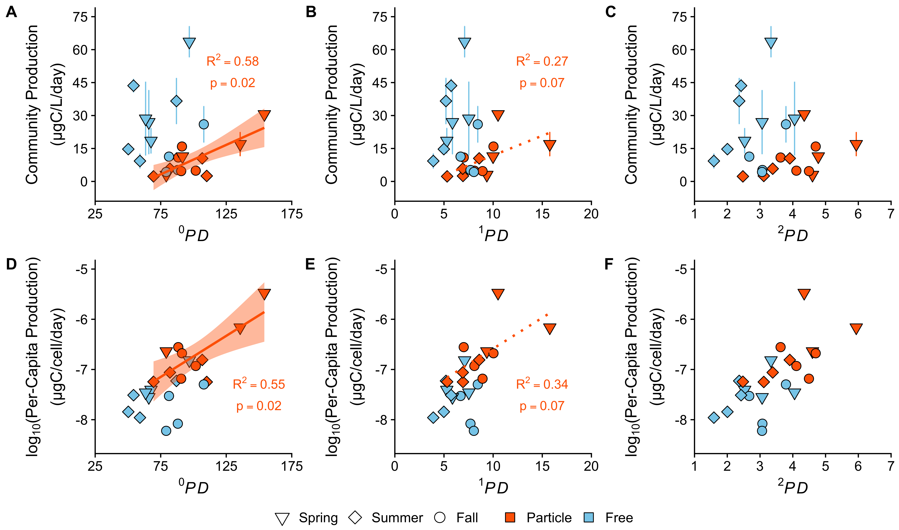


## Figure S10

```r
# What about weighted MPD and phylogenetic shannon?
summary(lm(weighted_sesmpd ~ phylo_shannon, data = wide_div_meta_df))
```

```
## 
## Call:
## lm(formula = weighted_sesmpd ~ phylo_shannon, data = wide_div_meta_df)
## 
## Residuals:
##      Min       1Q   Median       3Q      Max 
## -0.38693 -0.13882 -0.03193  0.15911  0.49786 
## 
## Coefficients:
##               Estimate Std. Error t value Pr(>|t|)   
## (Intercept)   -0.48503    0.16709  -2.903  0.00825 **
## phylo_shannon  0.01436    0.02081   0.690  0.49731   
## ---
## Signif. codes:  0 '***' 0.001 '**' 0.01 '*' 0.05 '.' 0.1 ' ' 1
## 
## Residual standard error: 0.2455 on 22 degrees of freedom
## Multiple R-squared:  0.02119,	Adjusted R-squared:  -0.0233 
## F-statistic: 0.4763 on 1 and 22 DF,  p-value: 0.4973
```

```r
phy_MPD_p1 <- wide_div_meta_df %>%
  ggplot(aes(x = phylo_shannon, y = weighted_sesmpd, fill = fraction)) +
  geom_point(aes(shape = season), size = 3) + 
  scale_fill_manual(values = fraction_colors) + 
  scale_shape_manual(values = season_shapes) + 
  labs(x = expression({}^1*italic(PD)),
     y = "Weighted MPD") +
  theme(legend.position = "none")

# What about weighted MPD and phylogenetic shannon?
summary(lm(weighted_sesmpd ~ phylo_simpson, data = wide_div_meta_df))
```

```
## 
## Call:
## lm(formula = weighted_sesmpd ~ phylo_simpson, data = wide_div_meta_df)
## 
## Residuals:
##      Min       1Q   Median       3Q      Max 
## -0.39673 -0.12160 -0.03623  0.14354  0.46174 
## 
## Coefficients:
##               Estimate Std. Error t value Pr(>|t|)   
## (Intercept)   -0.56054    0.17636  -3.178  0.00435 **
## phylo_simpson  0.05336    0.04870   1.096  0.28508   
## ---
## Signif. codes:  0 '***' 0.001 '**' 0.01 '*' 0.05 '.' 0.1 ' ' 1
## 
## Residual standard error: 0.2417 on 22 degrees of freedom
## Multiple R-squared:  0.05174,	Adjusted R-squared:  0.008641 
## F-statistic:   1.2 on 1 and 22 DF,  p-value: 0.2851
```

```r
phy_MPD_p2 <- wide_div_meta_df %>%
  ggplot(aes(x = phylo_simpson, y = weighted_sesmpd, fill = fraction)) +
  geom_point(aes(shape = season), size = 3) + 
  scale_fill_manual(values = fraction_colors) + 
  scale_shape_manual(values = season_shapes) +
  labs(x = expression({}^2*italic(PD)),
       y = "Weighted MPD") +
  theme(legend.position = "none")

# Figure S9
plot_grid(phy_MPD_p1, phy_MPD_p2, nrow = 1, ncol = 2, labels = c("A", "B"))
```

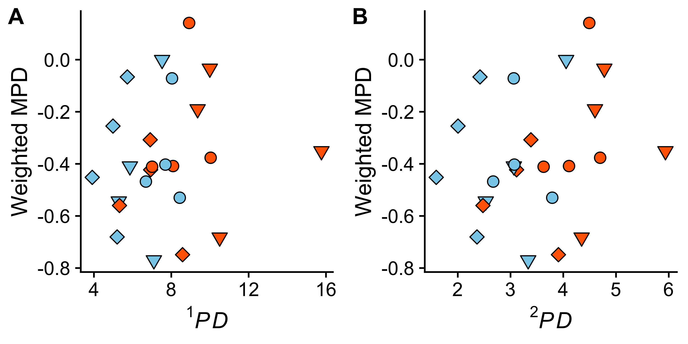

## Figure S11
**RDA with Euclidian Distances**

```r
# Make the Supplemental Figure
par(mar = c(4.5, 4.5, 1, 1), mfrow = c(1,1))
biplot(pca_environ,
     xlab = paste("PC1", paste(round(summary(pca_environ)$cont$importance[2,1]*100, digits = 2), "%", sep = ""), sep = ": "),
     ylab = paste("PC2", paste(round(summary(pca_environ)$cont$importance[2,2]*100, digits = 2), "%", sep = ""), sep = ": "))
```


```r
# Plot the amount of variation explained by each of the axes.
par(mar = c(5,5,2,5))
plot(summary(pca_environ)$cont$importance[2,]*100, 
     xlab = "PCA Axis", 
     ylab = "Variation Explained Per Axis",
     ylim = c(0, 105),
     col = "cornflowerblue",
     cex =2,
     pch = 16)
par(new = T)
plot(summary(pca_environ)$cont$importance[3,]*100,
       cex = 2,
       pch = 17,
       ylim = c(0, 105),
       col = "firebrick3",
       axes=F, 
       xlab=NA, 
       ylab=NA)
axis(side = 4)
mtext(side = 4, line = 3, "Total Accumulated Variation")
legend("right",
       legend=c("Per Axis", "Total"),
       pch=c(16, 17), col=c("cornflowerblue", "firebrick3"))
```

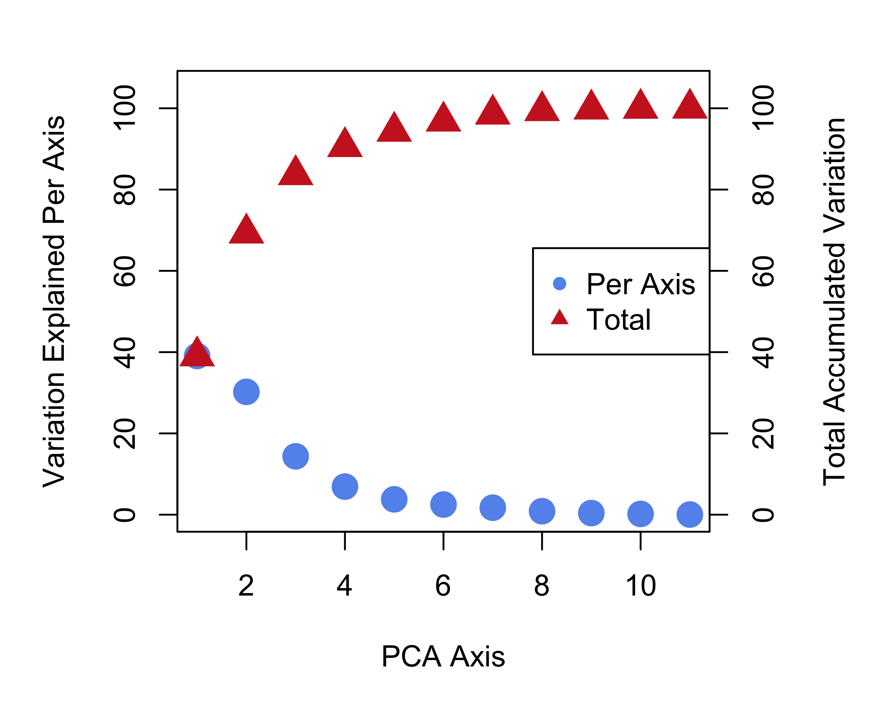

```r
# Amount of variation explained by the first two axes
summary(pca_environ)$cont$importance[3, 2]*100
```

```
## [1] 69.27135
```

The first two axes of the PCA explain ~70% of the variation in the environmental data!

## Table S1

```r
tableS1 <- individual_lm_results %>%
  dplyr::filter(dependent_var == "Community Production" & FDR.p.value < 0.05) %>%  
  dplyr::select(-c(dependent_var, p.value)) %>%
  arrange(-logLik)
#write.csv(tableS1, file = "tables/Table-S1.csv", quote = FALSE, row.names = FALSE) 

#### Community-Wide Production    
datatable(tableS1,
       caption = "Table S1: Ordinary least squares regression statistics for community-wide heterotrophic production with a FDR-corrected p-value of less than 0.05.", 
       options = list(pageLength = 50), rownames = FALSE)   
```

<!--html_preserve--><div id="htmlwidget-18a2c6b3631b2518bcb3" style="width:100%;height:auto;" class="datatables html-widget"></div>
<script type="application/json" data-for="htmlwidget-18a2c6b3631b2518bcb3">{"x":{"filter":"none","caption":"<caption>Table S1: Ordinary least squares regression statistics for community-wide heterotrophic production with a FDR-corrected p-value of less than 0.05.<\/caption>","data":[["Particle","Particle","Particle","Particle","Particle"],["simpson","richness","phylo_richness","pH","shannon"],[-34.1154321564355,-35.9033558133432,-36.1071633577904,-36.3715598819421,-36.8497817888181],[74.23,77.81,78.21,78.74,79.7],[0.7,0.59,0.58,0.56,0.52],[0.0128,0.0227,0.0227,0.0227,0.0276]],"container":"<table class=\"display\">\n  <thead>\n    <tr>\n      <th>fraction<\/th>\n      <th>independent_var<\/th>\n      <th>logLik<\/th>\n      <th>AIC<\/th>\n      <th>adj.r.squared<\/th>\n      <th>FDR.p.value<\/th>\n    <\/tr>\n  <\/thead>\n<\/table>","options":{"pageLength":50,"columnDefs":[{"className":"dt-right","targets":[2,3,4,5]}],"order":[],"autoWidth":false,"orderClasses":false}},"evals":[],"jsHooks":[]}</script><!--/html_preserve-->

## Table S2

```r
tableS2 <- individual_lm_results %>%  
  dplyr::filter(dependent_var == "Per-Capita Production" & FDR.p.value < 0.05) %>%
  dplyr::select(-c(dependent_var, p.value))  %>%
  arrange(-logLik)
#write.csv(tableS2, file = "tables/Table-S2.csv", quote = FALSE, row.names = FALSE) 
 
### Per-Capita Production   
datatable(tableS2,
       caption = "Table S2: Ordinary least squares regression statistics for per-capita heterotrophic production with a FDR-corrected p-value of less than 0.05.", 
       options = list(pageLength = 50), rownames = FALSE)    
```

<!--html_preserve--><div id="htmlwidget-43dec51dc434a4c5633f" style="width:100%;height:auto;" class="datatables html-widget"></div>
<script type="application/json" data-for="htmlwidget-43dec51dc434a4c5633f">{"x":{"filter":"none","caption":"<caption>Table S2: Ordinary least squares regression statistics for per-capita heterotrophic production with a FDR-corrected p-value of less than 0.05.<\/caption>","data":[["Free","Particle","Particle","Particle","Particle","Particle","Particle","Particle"],["pH","simpson","pH","shannon","richness","phylo_richness","Temp_C","ORP_mV"],[4.19640014727205,-1.11009184106576,-2.85231757099258,-2.99191539172151,-3.03692896305585,-3.15204615642355,-3.61416742816697,-4.0079669762864],[-2.39,8.22,11.7,11.98,12.07,12.3,13.23,14.02],[0.78,0.69,0.58,0.56,0.56,0.55,0.51,0.48],[0.0027,0.026,0.0298,0.0298,0.0298,0.0298,0.0371,0.0448]],"container":"<table class=\"display\">\n  <thead>\n    <tr>\n      <th>fraction<\/th>\n      <th>independent_var<\/th>\n      <th>logLik<\/th>\n      <th>AIC<\/th>\n      <th>adj.r.squared<\/th>\n      <th>FDR.p.value<\/th>\n    <\/tr>\n  <\/thead>\n<\/table>","options":{"pageLength":50,"columnDefs":[{"className":"dt-right","targets":[2,3,4,5]}],"order":[],"autoWidth":false,"orderClasses":false}},"evals":[],"jsHooks":[]}</script><!--/html_preserve-->

## All Regression Results


```r
### Per-Capita Production     
datatable(individual_lm_results, 
       options = list(pageLength = 20), rownames = FALSE)    
```

<!--html_preserve--><div id="htmlwidget-285b69d1b9373c7c5a5c" style="width:100%;height:auto;" class="datatables html-widget"></div>
<script type="application/json" data-for="htmlwidget-285b69d1b9373c7c5a5c">{"x":{"filter":"none","data":[["Particle","Particle","Particle","Particle","Particle","Particle","Particle","Particle","Particle","Particle","Particle","Particle","Particle","Particle","Particle","Particle","Particle","Particle","Particle","Particle","Particle","Particle","Particle","Particle","Particle","Particle","Particle","Particle","Particle","Particle","Particle","Particle","Particle","Particle","Particle","Particle","Particle","Particle","Particle","Particle","Particle","Particle","Particle","Particle","Particle","Particle","Particle","Particle","Particle","Particle","Particle","Particle","Particle","Particle","Particle","Particle","Free","Free","Free","Free","Free","Free","Free","Free","Free","Free","Free","Free","Free","Free","Free","Free","Free","Free","Free","Free","Free","Free","Free","Free","Free","Free","Free","Free","Free","Free","Free","Free","Free","Free","Free","Free","Free","Free","Free","Free","Free","Free","Free","Free","Free","Free","Free","Free","Free","Free","Free","Free","Free","Free","Free","Free"],["Community Production","Community Production","Community Production","Community Production","Community Production","Community Production","Community Production","Community Production","Community Production","Community Production","Community Production","Community Production","Community Production","Community Production","Community Production","Community Production","Community Production","Community Production","Community Production","Community Production","Community Production","Community Production","Community Production","Community Production","Community Production","Community Production","Community Production","Community Production","Per-Capita Production","Per-Capita Production","Per-Capita Production","Per-Capita Production","Per-Capita Production","Per-Capita Production","Per-Capita Production","Per-Capita Production","Per-Capita Production","Per-Capita Production","Per-Capita Production","Per-Capita Production","Per-Capita Production","Per-Capita Production","Per-Capita Production","Per-Capita Production","Per-Capita Production","Per-Capita Production","Per-Capita Production","Per-Capita Production","Per-Capita Production","Per-Capita Production","Per-Capita Production","Per-Capita Production","Per-Capita Production","Per-Capita Production","Per-Capita Production","Per-Capita Production","Community Production","Community Production","Community Production","Community Production","Community Production","Community Production","Community Production","Community Production","Community Production","Community Production","Community Production","Community Production","Community Production","Community Production","Community Production","Community Production","Community Production","Community Production","Community Production","Community Production","Community Production","Community Production","Community Production","Community Production","Community Production","Community Production","Community Production","Community Production","Per-Capita Production","Per-Capita Production","Per-Capita Production","Per-Capita Production","Per-Capita Production","Per-Capita Production","Per-Capita Production","Per-Capita Production","Per-Capita Production","Per-Capita Production","Per-Capita Production","Per-Capita Production","Per-Capita Production","Per-Capita Production","Per-Capita Production","Per-Capita Production","Per-Capita Production","Per-Capita Production","Per-Capita Production","Per-Capita Production","Per-Capita Production","Per-Capita Production","Per-Capita Production","Per-Capita Production","Per-Capita Production","Per-Capita Production","Per-Capita Production","Per-Capita Production"],["Alk_mgperL","attached_bac","Chl_Lab_ugperL","Cl_mgperL","dnaconcrep1","DO_mgperL","NH3_mgperL","NO3_mgperL","ORP_mV","PC1","PC2","pH","phylo_richness","phylo_shannon","phylo_simpson","richness","shannon","simpson","SO4_mgperL","SpCond_uSpercm","SRP_ugperL","TDS_mgperL","Temp_C","TKN_mgperL","total_bac_abund","TP_ugperL","unweighted_sesmpd","weighted_sesmpd","Alk_mgperL","attached_bac","Chl_Lab_ugperL","Cl_mgperL","dnaconcrep1","DO_mgperL","NH3_mgperL","NO3_mgperL","ORP_mV","PC1","PC2","pH","phylo_richness","phylo_shannon","phylo_simpson","richness","shannon","simpson","SO4_mgperL","SpCond_uSpercm","SRP_ugperL","TDS_mgperL","Temp_C","TKN_mgperL","total_bac_abund","TP_ugperL","unweighted_sesmpd","weighted_sesmpd","Alk_mgperL","attached_bac","Chl_Lab_ugperL","Cl_mgperL","dnaconcrep1","DO_mgperL","NH3_mgperL","NO3_mgperL","ORP_mV","PC1","PC2","pH","phylo_richness","phylo_shannon","phylo_simpson","richness","shannon","simpson","SO4_mgperL","SpCond_uSpercm","SRP_ugperL","TDS_mgperL","Temp_C","TKN_mgperL","total_bac_abund","TP_ugperL","unweighted_sesmpd","weighted_sesmpd","Alk_mgperL","attached_bac","Chl_Lab_ugperL","Cl_mgperL","dnaconcrep1","DO_mgperL","NH3_mgperL","NO3_mgperL","ORP_mV","PC1","PC2","pH","phylo_richness","phylo_shannon","phylo_simpson","richness","shannon","simpson","SO4_mgperL","SpCond_uSpercm","SRP_ugperL","TDS_mgperL","Temp_C","TKN_mgperL","total_bac_abund","TP_ugperL","unweighted_sesmpd","weighted_sesmpd"],[-41.6830823375764,-41.2337597530229,-41.4782905720585,-41.8165461164204,-40.6217473513849,-40.7242787713041,-41.557172179046,-40.4046245829282,-39.7024222529278,-41.6943863403275,-39.4596060982821,-36.3715598819421,-36.1071633577904,-39.3818583037278,-40.2684971762385,-35.9033558133432,-36.8497817888181,-34.1154321564355,-41.811422833643,-41.8031437491107,-41.5533586641088,-41.7899543353276,-40.0221853900961,-41.0615521482027,-38.7487281266182,-41.7302646995574,-40.6534812122355,-40.9685089668929,-8.12387571324986,-5.50785676994097,-7.64240585443743,-8.13553954877861,-6.82308624527665,-5.31871211780943,-7.36028734318377,-6.52437924816345,-4.0079669762864,-7.58572133868744,-4.44630890000233,-2.85231757099258,-3.15204615642355,-5.27685524144881,-6.06501192949902,-3.03692896305585,-2.99191539172151,-1.11009184106576,-8.05558099943504,-8.07105233473565,-7.61423623756045,-8.08912072746462,-3.61416742816697,-7.16716795561062,-5.3746130544329,-8.14204315002021,-5.84315674323727,-7.38183249630384,-50.8647897865966,-50.5248322625295,-48.9152016725384,-50.7586592372953,-50.6540085873926,-50.7468629202166,-50.7780941360583,-47.3340415102957,-50.0972373901403,-49.9298610184152,-50.4338795606406,-46.2156497614738,-50.6259336976171,-50.8725304484775,-50.4733713767725,-50.5340634997228,-50.7552901248564,-50.4642558931928,-50.3046817646386,-50.503819025186,-50.2460500563436,-50.5323706404827,-50.6306507167504,-50.7762174416605,-50.8585224489312,-50.8681254995149,-50.639643931614,-50.1929300339903,-5.27822629824838,-4.78656124491307,-2.39958624541031,-5.33404215095731,-5.23995401501316,-5.226423306544,-5.24613080814044,-1.22386172490998,-3.20417055841492,-4.6836989712286,-3.97242700341474,4.19640014727205,-4.4073454363035,-5.33821122541598,-4.71399705152288,-4.41285420417736,-4.99276521177173,-4.29849468544972,-4.97381702611276,-5.30839018404679,-3.8316345522286,-5.31735857592382,-4.68076737950975,-5.11825309140362,-4.67164106082217,-5.34331486249319,-5.31768924920988,-2.99598562020147],[89.37,88.47,88.96,89.63,87.24,87.45,89.11,86.81,85.4,89.39,84.92,78.74,78.21,84.76,86.54,77.81,79.7,74.23,89.62,89.61,89.11,89.58,86.04,88.12,83.5,89.46,87.31,87.94,22.25,17.02,21.28,22.27,19.65,16.64,20.72,19.05,14.02,21.17,14.89,11.7,12.3,16.55,18.13,12.07,11.98,8.22,22.11,22.14,21.23,22.18,13.23,20.33,16.75,22.28,17.69,20.76,107.73,107.05,103.83,107.52,107.31,107.49,107.56,100.67,106.19,105.86,106.87,98.43,107.25,107.75,106.95,107.07,107.51,106.93,106.61,107.01,106.49,107.06,107.26,107.55,107.72,107.74,107.28,106.39,16.56,15.57,10.8,16.67,16.48,16.45,16.49,8.45,12.41,15.37,13.94,-2.39,14.81,16.68,15.43,14.83,15.99,14.6,15.95,16.62,13.66,16.63,15.36,16.24,15.34,16.69,16.64,11.99],[-0.08,0,-0.04,-0.1,0.1,0.08,-0.05,0.13,0.23,-0.08,0.26,0.56,0.58,0.27,0.15,0.59,0.52,0.7,-0.1,-0.1,-0.05,-0.09,0.18,0.03,0.34,-0.08,0.09,0.05,-0.11,0.31,-0.01,-0.11,0.13,0.34,0.04,0.17,0.48,-0,0.43,0.58,0.55,0.34,0.24,0.56,0.56,0.69,-0.09,-0.1,-0.01,-0.1,0.51,0.07,0.33,-0.11,0.27,0.03,-0.1,-0.04,0.21,-0.08,-0.06,-0.08,-0.08,0.39,0.03,0.06,-0.02,0.49,-0.06,-0.1,-0.03,-0.04,-0.08,-0.03,-0,-0.03,0.01,-0.04,-0.06,-0.08,-0.1,-0.1,-0.06,0.02,-0.09,-0,0.33,-0.1,-0.08,-0.08,-0.08,0.45,0.23,0.01,0.12,0.78,0.06,-0.1,0.01,0.06,-0.04,0.08,-0.03,-0.09,0.15,-0.1,0.02,-0.06,0.02,-0.1,-0.1,0.26],[0.6439,0.3358,0.4631,0.9641,0.1683,0.1877,0.5203,0.1342,0.0668,0.6582,0.053,0.0032,0.0026,0.0492,0.1168,0.0021,0.0049,0.0005,0.9198,0.8788,0.5172,0.8335,0.0913,0.2734,0.0272,0.7094,0.1741,0.2457,0.8466,0.043,0.3762,0.8893,0.1518,0.0361,0.2693,0.1126,0.0112,0.3507,0.0165,0.0041,0.0053,0.0348,0.0723,0.0048,0.0046,0.0009,0.7051,0.7299,0.3632,0.7626,0.0079,0.2176,0.038,0.9231,0.0586,0.2759,0.9085,0.4574,0.0779,0.6701,0.5556,0.6546,0.6979,0.0177,0.2672,0.2212,0.4039,0.0065,0.5313,0.9757,0.4259,0.4634,0.6656,0.4207,0.3423,0.4441,0.3186,0.4623,0.5352,0.6951,0.8791,0.9291,0.5429,0.2989,0.7459,0.3469,0.0305,0.8979,0.684,0.6653,0.693,0.0105,0.0652,0.3059,0.14,0.0001,0.2227,0.9209,0.3173,0.2241,0.4552,0.1977,0.4433,0.8111,0.1212,0.8359,0.3049,0.5493,0.3016,0.9665,0.8369,0.0534],[0.8013,0.5223,0.6824,0.9641,0.3481,0.3505,0.6937,0.3132,0.2079,0.8013,0.1853,0.0227,0.0227,0.1853,0.2974,0.0227,0.0276,0.0128,0.9538,0.9464,0.6937,0.9335,0.2557,0.4503,0.127,0.8277,0.3481,0.43,0.9117,0.1002,0.4788,0.9222,0.2657,0.0968,0.4066,0.2102,0.0448,0.4788,0.0577,0.0298,0.0298,0.0968,0.1445,0.0298,0.0298,0.026,0.8515,0.8515,0.4788,0.8541,0.0371,0.3585,0.0968,0.9231,0.1263,0.4066,0.9635,0.8142,0.7268,0.8142,0.8142,0.8142,0.8142,0.2478,0.8142,0.8142,0.8142,0.1817,0.8142,0.9757,0.8142,0.8142,0.8142,0.8142,0.8142,0.8142,0.8142,0.8142,0.8142,0.8142,0.9635,0.9635,0.8142,0.8142,0.9373,0.6475,0.285,0.955,0.924,0.924,0.924,0.1466,0.3654,0.6346,0.5602,0.0027,0.6274,0.955,0.6346,0.6274,0.7497,0.6274,0.7497,0.9373,0.5602,0.9373,0.6346,0.8544,0.6346,0.9665,0.9373,0.3654]],"container":"<table class=\"display\">\n  <thead>\n    <tr>\n      <th>fraction<\/th>\n      <th>dependent_var<\/th>\n      <th>independent_var<\/th>\n      <th>logLik<\/th>\n      <th>AIC<\/th>\n      <th>adj.r.squared<\/th>\n      <th>p.value<\/th>\n      <th>FDR.p.value<\/th>\n    <\/tr>\n  <\/thead>\n<\/table>","options":{"pageLength":20,"columnDefs":[{"className":"dt-right","targets":[3,4,5,6,7]}],"order":[],"autoWidth":false,"orderClasses":false,"lengthMenu":[10,20,25,50,100]}},"evals":[],"jsHooks":[]}</script><!--/html_preserve-->


# Bonus Plots 


```r
## PLOT THE MEANS
wide_div_meta_df %>%
  dplyr::select(c(norep_filter_name:simpson, lakesite, fraction, season)) %>%
  gather(key = "Diversity", value = div_val, richness:simpson) %>%
  mutate(norep_name = paste(substr(norep_filter_name, 1, 4), substr(norep_filter_name, 6, 8), sep = "")) %>%
  dplyr::group_by(fraction, Diversity, season) %>%
  summarize(mean_div = mean(div_val)) %>%
  mutate(connector = paste(Diversity, season, sep = "")) %>%
  ggplot(aes(x = fraction, y = mean_div)) + 
  # connect paired PA and FL points 
  geom_line(aes(group = connector), size = 1.5, alpha = 0.8) +
  geom_point(fill = "grey", size = 3) + 
  #geom_boxplot(alpha = 0.5, outlier.shape = NA) + 
  facet_grid(Diversity~season, scales = "free") + 
  labs(y = "Mean Hill Diversity Metric") +
 # scale_fill_manual(values = fraction_colors) + 
  scale_color_manual(values = c("#5B1A18",  "#FD6467", "#F1BB7B")) + #"#D67236",
  theme(axis.title.x = element_blank())
```

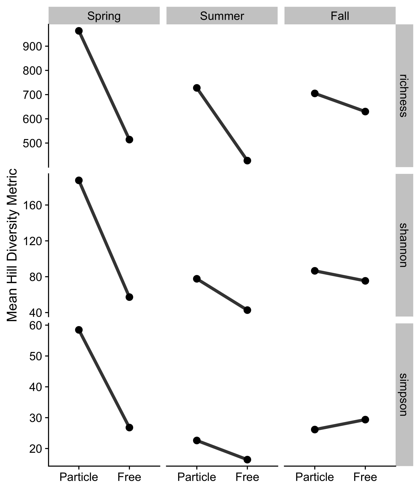

```r
lines_frac_p <- wide_div_meta_df %>%
  dplyr::select(c(norep_filter_name:simpson, lakesite, fraction, season)) %>%
  gather(key = "Diversity", value = div_val, richness:simpson) %>%
  mutate(norep_name = paste(substr(norep_filter_name, 1, 4), substr(norep_filter_name, 6, 8), sep = "")) %>%
  ggplot(aes(x = fraction, y = div_val)) + 
  # connect paired PA and FL points 
  geom_line(aes(group =  norep_name, color = season), size = 1.5, alpha = 0.8) +
  geom_point(aes(shape = lakesite), fill = "grey", size = 3) + 
  #geom_boxplot(alpha = 0.5, outlier.shape = NA) + 
  facet_grid(Diversity~season, scales = "free") + 
  labs(y = "Hill Diversity Metric") +
 # scale_fill_manual(values = fraction_colors) + 
  scale_color_manual(values = c("#5B1A18",  "#FD6467", "#F1BB7B")) + #"#D67236",
  scale_shape_manual(values = lakesite_shapes) +
  theme(axis.title.x = element_blank(), legend.position = "bottom",
        legend.title = element_blank(), legend.box = "vertical",
        legend.spacing.y = unit(0.1, 'cm'))

# center the legend over the plot 
lines_frac_legend <- get_legend(lines_frac_p + theme(legend.direction = "horizontal",legend.justification="center" ,legend.box.just = "bottom"))
plot_grid(lines_frac_p + theme(legend.position = "none"),
          lines_frac_legend, ncol = 1, nrow = 2, 
          rel_heights = c(1, 0.08))
```

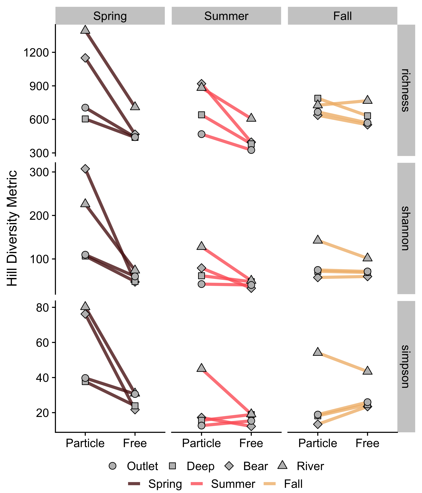

```r
# by season 
wide_div_meta_df %>%
  dplyr::select(c(norep_filter_name:simpson, lakesite, fraction, season)) %>%
  gather(key = "Diversity", value = div_val, richness:simpson) %>%
  mutate(norep_noseason_name = substr(norep_filter_name, 1, 5)) %>%
  ggplot(aes(x = season, y = div_val)) + 
  # connect paired PA and FL points 
  geom_line(aes(group =  norep_noseason_name, color = fraction), size = 1.5, alpha = 0.8) +
  geom_point(aes(shape = lakesite, fill = fraction), size = 3) + 
  #geom_boxplot(alpha = 0.5, outlier.shape = NA) + 
  facet_grid(Diversity~fraction, scales = "free") + 
  labs(y = "Hill Diversity Metric") +
  scale_fill_manual(values = fraction_colors) + 
  scale_color_manual(values = fraction_colors) + #"#D67236",
  scale_shape_manual(values = lakesite_shapes) +
  theme(axis.title.x = element_blank(), legend.position = "none")
```

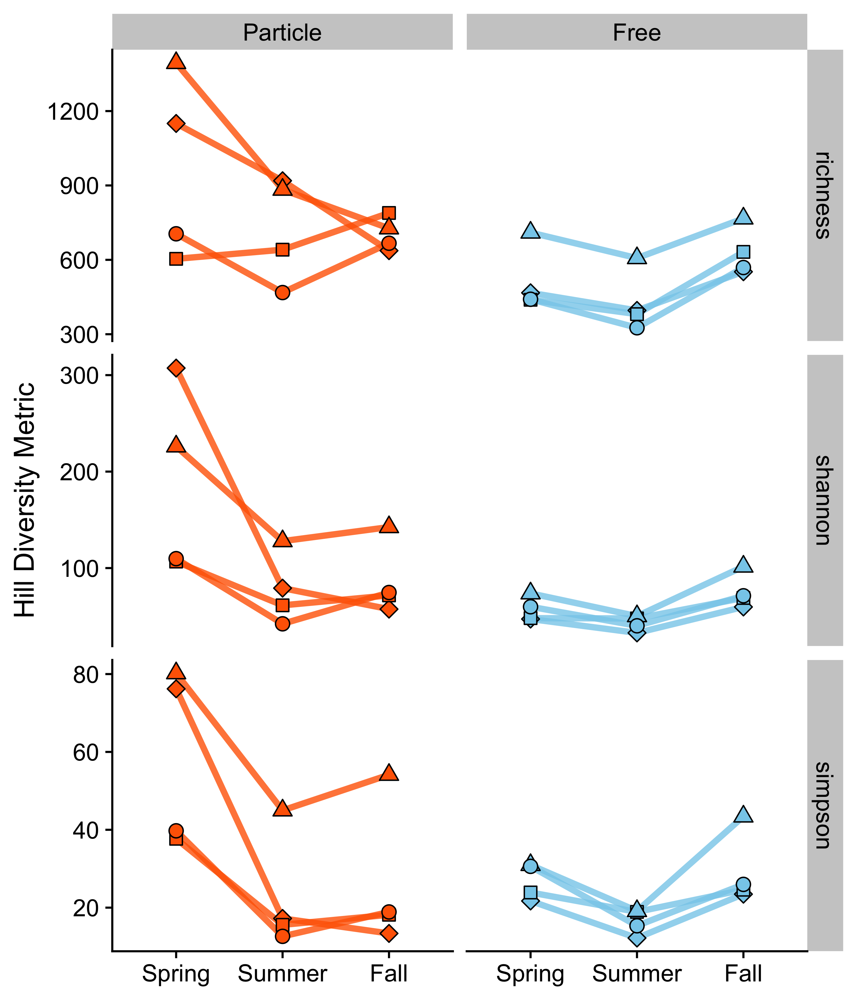

# Session Information

```r
devtools::session_info() # This will include session info with all R package version information
```

```
## ─ Session info ─────────────────────────────────────────────────────────────────────────────────────────────────────────────────────────────────────────────────────────────────────────────────────────────────────────────────────────────────────────
##  setting  value                       
##  version  R version 3.6.2 (2019-12-12)
##  os       macOS Mojave 10.14.6        
##  system   x86_64, darwin15.6.0        
##  ui       X11                         
##  language (EN)                        
##  collate  en_US.UTF-8                 
##  ctype    en_US.UTF-8                 
##  tz       America/Chicago             
##  date     2020-03-11                  
## 
## ─ Packages ─────────────────────────────────────────────────────────────────────────────────────────────────────────────────────────────────────────────────────────────────────────────────────────────────────────────────────────────────────────────
##  package           * version    date       lib source                                
##  abind               1.4-5      2016-07-21 [1] CRAN (R 3.6.0)                        
##  acepack             1.4.1      2016-10-29 [1] CRAN (R 3.6.0)                        
##  ade4                1.7-13     2018-08-31 [1] CRAN (R 3.6.0)                        
##  animation           2.6        2018-12-11 [1] CRAN (R 3.6.0)                        
##  ape               * 5.3        2019-03-17 [1] CRAN (R 3.6.0)                        
##  assertthat          0.2.1      2019-03-21 [1] CRAN (R 3.6.0)                        
##  backports           1.1.5      2019-10-02 [1] CRAN (R 3.6.0)                        
##  base64enc           0.1-3      2015-07-28 [1] CRAN (R 3.6.0)                        
##  BDgraph             2.62       2019-12-05 [1] CRAN (R 3.6.0)                        
##  Biobase             2.44.0     2019-05-02 [1] Bioconductor                          
##  BiocGenerics        0.30.0     2019-05-02 [1] Bioconductor                          
##  biomformat          1.12.0     2019-05-02 [1] Bioconductor                          
##  Biostrings          2.52.0     2019-05-02 [1] Bioconductor                          
##  bitops              1.0-6      2013-08-17 [1] CRAN (R 3.6.0)                        
##  boot                1.3-23     2019-07-05 [1] CRAN (R 3.6.2)                        
##  broom             * 0.5.2      2019-04-07 [1] CRAN (R 3.6.0)                        
##  callr               3.3.0      2019-07-04 [1] CRAN (R 3.6.0)                        
##  car               * 3.0-6      2019-12-23 [1] CRAN (R 3.6.0)                        
##  carData           * 3.0-3      2019-11-16 [1] CRAN (R 3.6.0)                        
##  caret             * 6.0-84     2019-04-27 [1] CRAN (R 3.6.0)                        
##  cellranger          1.1.0      2016-07-27 [1] CRAN (R 3.6.0)                        
##  checkmate           1.9.4      2019-07-04 [1] CRAN (R 3.6.0)                        
##  class               7.3-15     2019-01-01 [1] CRAN (R 3.6.2)                        
##  cli                 2.0.1      2020-01-08 [1] CRAN (R 3.6.0)                        
##  cluster             2.1.0      2019-06-19 [1] CRAN (R 3.6.2)                        
##  clusterGeneration   1.3.4      2015-02-18 [1] CRAN (R 3.6.0)                        
##  coda                0.19-3     2019-07-05 [1] CRAN (R 3.6.0)                        
##  codetools           0.2-16     2018-12-24 [1] CRAN (R 3.6.2)                        
##  colorspace          1.4-1      2019-03-18 [1] CRAN (R 3.6.0)                        
##  combinat            0.0-8      2012-10-29 [1] CRAN (R 3.6.0)                        
##  corpcor             1.6.9      2017-04-01 [1] CRAN (R 3.6.0)                        
##  cowplot           * 1.0.0      2019-07-11 [1] CRAN (R 3.6.0)                        
##  crayon              1.3.4      2017-09-16 [1] CRAN (R 3.6.0)                        
##  crosstalk           1.0.0      2016-12-21 [1] CRAN (R 3.6.0)                        
##  curl                4.3        2019-12-02 [1] CRAN (R 3.6.0)                        
##  d3Network           0.5.2.1    2015-01-31 [1] CRAN (R 3.6.0)                        
##  data.table          1.12.8     2019-12-09 [1] CRAN (R 3.6.0)                        
##  DBI                 1.0.0      2018-05-02 [1] CRAN (R 3.6.0)                        
##  dbplyr              1.4.2      2019-06-17 [1] CRAN (R 3.6.0)                        
##  desc                1.2.0      2018-05-01 [1] CRAN (R 3.6.0)                        
##  deSolve             1.27.1     2020-01-02 [1] CRAN (R 3.6.0)                        
##  devtools          * 2.2.1      2019-09-24 [1] CRAN (R 3.6.0)                        
##  digest              0.6.23     2019-11-23 [1] CRAN (R 3.6.0)                        
##  dplyr             * 0.8.3      2019-07-04 [1] CRAN (R 3.6.0)                        
##  DT                * 0.7        2019-06-11 [1] CRAN (R 3.6.0)                        
##  ellipsis            0.3.0      2019-09-20 [1] CRAN (R 3.6.0)                        
##  evaluate            0.14       2019-05-28 [1] CRAN (R 3.6.0)                        
##  expm                0.999-4    2019-03-21 [1] CRAN (R 3.6.0)                        
##  fansi               0.4.1      2020-01-08 [1] CRAN (R 3.6.0)                        
##  farver              2.0.3      2020-01-16 [1] CRAN (R 3.6.0)                        
##  fastmatch           1.1-0      2017-01-28 [1] CRAN (R 3.6.0)                        
##  fdrtool             1.2.15     2015-07-08 [1] CRAN (R 3.6.0)                        
##  forcats           * 0.4.0      2019-02-17 [1] CRAN (R 3.6.0)                        
##  foreach           * 1.4.4      2017-12-12 [1] CRAN (R 3.6.0)                        
##  foreign             0.8-72     2019-08-02 [1] CRAN (R 3.6.2)                        
##  Formula             1.2-3      2018-05-03 [1] CRAN (R 3.6.0)                        
##  fs                  1.3.1      2019-05-06 [1] CRAN (R 3.6.0)                        
##  FSA                 0.8.26     2019-11-22 [1] CRAN (R 3.6.0)                        
##  geiger              2.0.6.4    2020-01-25 [1] CRAN (R 3.6.0)                        
##  generics            0.0.2      2018-11-29 [1] CRAN (R 3.6.0)                        
##  ggm                 2.3        2015-01-21 [1] CRAN (R 3.6.0)                        
##  ggmap             * 3.0.0      2019-02-05 [1] CRAN (R 3.6.0)                        
##  ggplot2           * 3.2.1      2019-08-10 [1] CRAN (R 3.6.0)                        
##  ggpubr              0.2.4      2019-11-14 [1] CRAN (R 3.6.0)                        
##  ggsignif            0.6.0      2019-08-08 [1] CRAN (R 3.6.0)                        
##  glasso              1.11       2019-10-01 [1] CRAN (R 3.6.0)                        
##  glmnet            * 2.0-18     2019-05-20 [1] CRAN (R 3.6.0)                        
##  glue                1.3.1      2019-03-12 [1] CRAN (R 3.6.0)                        
##  gower               0.2.1      2019-05-14 [1] CRAN (R 3.6.0)                        
##  gridExtra           2.3        2017-09-09 [1] CRAN (R 3.6.0)                        
##  gtable              0.3.0      2019-03-25 [1] CRAN (R 3.6.0)                        
##  gtools              3.8.1      2018-06-26 [1] CRAN (R 3.6.0)                        
##  haven               2.2.0      2019-11-08 [1] CRAN (R 3.6.0)                        
##  hilldiv           * 1.5.2      2020-01-30 [1] Github (anttonalberdi/hilldiv@ac68a2f)
##  hillR             * 0.4.0      2020-01-24 [1] Github (daijiang/hillR@5349800)       
##  Hmisc               4.3-0      2019-11-07 [1] CRAN (R 3.6.0)                        
##  hms                 0.5.3      2020-01-08 [1] CRAN (R 3.6.0)                        
##  htmlTable           1.13.3     2019-12-04 [1] CRAN (R 3.6.0)                        
##  htmltools           0.4.0      2019-10-04 [1] CRAN (R 3.6.0)                        
##  htmlwidgets         1.5.1      2019-10-08 [1] CRAN (R 3.6.0)                        
##  httpuv              1.5.1      2019-04-05 [1] CRAN (R 3.6.0)                        
##  httr                1.4.0      2018-12-11 [1] CRAN (R 3.6.0)                        
##  huge                1.3.4      2019-10-28 [1] CRAN (R 3.6.0)                        
##  igraph              1.2.4.2    2019-11-27 [1] CRAN (R 3.6.0)                        
##  iNEXT             * 2.0.19     2019-01-24 [1] CRAN (R 3.6.0)                        
##  ipred               0.9-9      2019-04-28 [1] CRAN (R 3.6.0)                        
##  IRanges             2.18.1     2019-05-31 [1] Bioconductor                          
##  iterators           1.0.10     2018-07-13 [1] CRAN (R 3.6.0)                        
##  jpeg                0.1-8.1    2019-10-24 [1] CRAN (R 3.6.0)                        
##  jsonlite            1.6        2018-12-07 [1] CRAN (R 3.6.0)                        
##  knitr               1.27       2020-01-16 [1] CRAN (R 3.6.0)                        
##  labeling            0.3        2014-08-23 [1] CRAN (R 3.6.0)                        
##  later               0.8.0      2019-02-11 [1] CRAN (R 3.6.0)                        
##  lattice           * 0.20-38    2018-11-04 [1] CRAN (R 3.6.2)                        
##  latticeExtra        0.6-29     2019-12-19 [1] CRAN (R 3.6.0)                        
##  lava                1.6.5      2019-02-12 [1] CRAN (R 3.6.0)                        
##  lavaan              0.6-5      2019-08-28 [1] CRAN (R 3.6.0)                        
##  lazyeval            0.2.2      2019-03-15 [1] CRAN (R 3.6.0)                        
##  lifecycle           0.1.0      2019-08-01 [1] CRAN (R 3.6.0)                        
##  lme4              * 1.1-21     2019-03-05 [1] CRAN (R 3.6.0)                        
##  lubridate           1.7.4      2018-04-11 [1] CRAN (R 3.6.0)                        
##  magrittr            1.5        2014-11-22 [1] CRAN (R 3.6.0)                        
##  maps              * 3.3.0      2018-04-03 [1] CRAN (R 3.6.0)                        
##  MASS              * 7.3-51.4   2019-03-31 [1] CRAN (R 3.6.2)                        
##  Matrix            * 1.2-18     2019-11-27 [1] CRAN (R 3.6.2)                        
##  memoise             1.1.0      2017-04-21 [1] CRAN (R 3.6.0)                        
##  mgcv                1.8-31     2019-11-09 [1] CRAN (R 3.6.2)                        
##  mime                0.8        2019-12-19 [1] CRAN (R 3.6.0)                        
##  minqa               1.2.4      2014-10-09 [1] CRAN (R 3.6.0)                        
##  mnormt              1.5-5      2016-10-15 [1] CRAN (R 3.6.0)                        
##  ModelMetrics        1.2.2      2018-11-03 [1] CRAN (R 3.6.0)                        
##  modelr              0.1.4      2019-02-18 [1] CRAN (R 3.6.0)                        
##  multtest            2.40.0     2019-05-02 [1] Bioconductor                          
##  munsell             0.5.0      2018-06-12 [1] CRAN (R 3.6.0)                        
##  mvtnorm             1.0-12     2020-01-09 [1] CRAN (R 3.6.0)                        
##  nlme              * 3.1-142    2019-11-07 [1] CRAN (R 3.6.2)                        
##  nloptr              1.2.1      2018-10-03 [1] CRAN (R 3.6.0)                        
##  nnet                7.3-12     2016-02-02 [1] CRAN (R 3.6.2)                        
##  numDeriv            2016.8-1.1 2019-06-06 [1] CRAN (R 3.6.0)                        
##  openxlsx            4.1.4      2019-12-06 [1] CRAN (R 3.6.0)                        
##  pander            * 0.6.3      2018-11-06 [1] CRAN (R 3.6.0)                        
##  pbapply             1.4-2      2019-08-31 [1] CRAN (R 3.6.0)                        
##  pbivnorm            0.6.0      2015-01-23 [1] CRAN (R 3.6.0)                        
##  permute           * 0.9-5      2019-03-12 [1] CRAN (R 3.6.0)                        
##  phangorn            2.5.5      2019-06-19 [1] CRAN (R 3.6.0)                        
##  phyloseq          * 1.28.0     2019-05-02 [1] Bioconductor                          
##  phytools          * 0.6-99     2019-06-18 [1] CRAN (R 3.6.0)                        
##  picante           * 1.8        2019-03-21 [1] CRAN (R 3.6.0)                        
##  pillar              1.4.3      2019-12-20 [1] CRAN (R 3.6.0)                        
##  pkgbuild            1.0.3      2019-03-20 [1] CRAN (R 3.6.0)                        
##  pkgconfig           2.0.3      2019-09-22 [1] CRAN (R 3.6.0)                        
##  pkgload             1.0.2      2018-10-29 [1] CRAN (R 3.6.0)                        
##  plotrix             3.7-7      2019-12-05 [1] CRAN (R 3.6.0)                        
##  plyr                1.8.5      2019-12-10 [1] CRAN (R 3.6.0)                        
##  png                 0.1-7      2013-12-03 [1] CRAN (R 3.6.0)                        
##  prettyunits         1.1.1      2020-01-24 [1] CRAN (R 3.6.0)                        
##  processx            3.4.0      2019-07-03 [1] CRAN (R 3.6.0)                        
##  prodlim             2018.04.18 2018-04-18 [1] CRAN (R 3.6.0)                        
##  promises            1.0.1      2018-04-13 [1] CRAN (R 3.6.0)                        
##  ps                  1.3.0      2018-12-21 [1] CRAN (R 3.6.0)                        
##  psych               1.9.12.31  2020-01-08 [1] CRAN (R 3.6.0)                        
##  purrr             * 0.3.3      2019-10-18 [1] CRAN (R 3.6.0)                        
##  qgraph              1.6.4      2019-11-15 [1] CRAN (R 3.6.0)                        
##  quadprog            1.5-7      2019-05-06 [1] CRAN (R 3.6.0)                        
##  R6                  2.4.1      2019-11-12 [1] CRAN (R 3.6.0)                        
##  RColorBrewer        1.1-2      2014-12-07 [1] CRAN (R 3.6.0)                        
##  Rcpp                1.0.3      2019-11-08 [1] CRAN (R 3.6.0)                        
##  readr             * 1.3.1      2018-12-21 [1] CRAN (R 3.6.0)                        
##  readxl              1.3.1      2019-03-13 [1] CRAN (R 3.6.0)                        
##  recipes             0.1.6      2019-07-02 [1] CRAN (R 3.6.0)                        
##  remotes             2.1.0      2019-06-24 [1] CRAN (R 3.6.0)                        
##  reprex              0.3.0      2019-05-16 [1] CRAN (R 3.6.0)                        
##  reshape2            1.4.3      2017-12-11 [1] CRAN (R 3.6.0)                        
##  RgoogleMaps         1.4.4      2019-08-20 [1] CRAN (R 3.6.0)                        
##  rhdf5               2.28.0     2019-05-02 [1] Bioconductor                          
##  Rhdf5lib            1.6.0      2019-05-02 [1] Bioconductor                          
##  rio                 0.5.16     2018-11-26 [1] CRAN (R 3.6.0)                        
##  rjson               0.2.20     2018-06-08 [1] CRAN (R 3.6.0)                        
##  rlang               0.4.2      2019-11-23 [1] CRAN (R 3.6.0)                        
##  rmarkdown           1.13       2019-05-22 [1] CRAN (R 3.6.0)                        
##  rpart               4.1-15     2019-04-12 [1] CRAN (R 3.6.2)                        
##  rprojroot           1.3-2      2018-01-03 [1] CRAN (R 3.6.0)                        
##  rstudioapi          0.10       2019-03-19 [1] CRAN (R 3.6.0)                        
##  rvest               0.3.4      2019-05-15 [1] CRAN (R 3.6.0)                        
##  S4Vectors           0.22.0     2019-05-02 [1] Bioconductor                          
##  sandwich          * 2.5-1      2019-04-06 [1] CRAN (R 3.6.0)                        
##  scales              1.1.0      2019-11-18 [1] CRAN (R 3.6.0)                        
##  scatterplot3d       0.3-41     2018-03-14 [1] CRAN (R 3.6.0)                        
##  sessioninfo         1.1.1      2018-11-05 [1] CRAN (R 3.6.0)                        
##  shiny               1.3.2      2019-04-22 [1] CRAN (R 3.6.0)                        
##  stringi             1.4.5      2020-01-11 [1] CRAN (R 3.6.0)                        
##  stringr           * 1.4.0      2019-02-10 [1] CRAN (R 3.6.0)                        
##  subplex             1.5-4      2018-04-05 [1] CRAN (R 3.6.0)                        
##  survival            3.1-8      2019-12-03 [1] CRAN (R 3.6.2)                        
##  testthat            2.1.1      2019-04-23 [1] CRAN (R 3.6.0)                        
##  tibble            * 2.1.3      2019-06-06 [1] CRAN (R 3.6.0)                        
##  tidyr             * 1.0.2      2020-01-24 [1] CRAN (R 3.6.0)                        
##  tidyselect          0.2.5      2018-10-11 [1] CRAN (R 3.6.0)                        
##  tidyverse         * 1.2.1.9000 2019-07-03 [1] Github (hadley/tidyverse@53a3146)     
##  timeDate            3043.102   2018-02-21 [1] CRAN (R 3.6.0)                        
##  usethis           * 1.5.1      2019-07-04 [1] CRAN (R 3.6.0)                        
##  utf8                1.1.4      2018-05-24 [1] CRAN (R 3.6.0)                        
##  vctrs               0.2.1      2019-12-17 [1] CRAN (R 3.6.0)                        
##  vegan             * 2.5-6      2019-09-01 [1] CRAN (R 3.6.0)                        
##  whisker             0.4        2019-08-28 [1] CRAN (R 3.6.0)                        
##  withr               2.1.2      2018-03-15 [1] CRAN (R 3.6.0)                        
##  xfun                0.12       2020-01-13 [1] CRAN (R 3.6.0)                        
##  xml2                1.2.0      2018-01-24 [1] CRAN (R 3.6.0)                        
##  xtable              1.8-4      2019-04-21 [1] CRAN (R 3.6.0)                        
##  XVector             0.24.0     2019-05-02 [1] Bioconductor                          
##  yaml                2.2.0      2018-07-25 [1] CRAN (R 3.6.0)                        
##  zeallot             0.1.0      2018-01-28 [1] CRAN (R 3.6.0)                        
##  zip                 2.0.4      2019-09-01 [1] CRAN (R 3.6.0)                        
##  zlibbioc            1.30.0     2019-05-02 [1] Bioconductor                          
##  zoo                 1.8-7      2020-01-10 [1] CRAN (R 3.6.0)                        
## 
## [1] /Library/Frameworks/R.framework/Versions/3.6/Resources/library
```
