<style>
pre code, pre, code {
  white-space: pre !important;
  overflow-x: scroll !important;
  word-break: keep-all !important;
  word-wrap: initial !important;
}
</style>

#### Purpose of this analysis  
The goal of this analysis is to check the sensitivity of the biodiversity-ecosystem function relationships to rare OTUs.  

#### More specifically:
We remove OTUs that have X number of sequences throughout the entire dataset and then check the relationship with diversity versus community-wide and per-capita heterotrophic production. This we call "singletons", "doubletons", "5-tons", "10-tons", etc all the way up to "300-tons". For context, removing 10-tons will be removing any OTUs that have a count of less than 10 throughout the entire dataset. 


# Load Libraries 

```r
library(ggplot2)
library(devtools)
library(phyloseq)
library(kableExtra)
library(tidyr)
library(dplyr)
library(cowplot)
library(forcats)
library(picante)    # Will also include ape and vegan 
library(car)        # For residual analysis
library(sandwich)   # for vcovHC function in post-hoc test
library(MASS)       # For studres in plot_residuals function
library(boot)       # For cross validation
library(DT)         # Pretty HTML Table Output
source("../code/Muskegon_functions.R")
source("../code/set_colors.R")
```

# Prepare the data 

## Load Data

```r
# Loads a phyloseq object named otu_merged_musk_pruned)
load("../data/otu_merged_musk_pruned.RData")
# The name of the phyloseq object is: otu_merged_musk_pruned 

# Productivity measurements are reliable only up to 1 decimal
df1 <- sample_data(otu_merged_musk_pruned) %>% 
  dplyr::mutate(tot_bacprod = round(tot_bacprod, digits = 1),
                SD_tot_bacprod = round(SD_tot_bacprod, digits = 1),
                frac_bacprod = round(frac_bacprod, digits = 1),
                SD_frac_bacprod = round(SD_frac_bacprod, digits = 1),
                fraction_bac_abund = as.numeric(fraction_bac_abund),
                fracprod_per_cell = frac_bacprod/(1000*fraction_bac_abund),
                fracprod_per_cell_noinf = ifelse(fracprod_per_cell == Inf, NA, fracprod_per_cell)) %>%
  dplyr::select(norep_filter_name, lakesite, limnion, fraction, year, season, tot_bacprod, SD_tot_bacprod, frac_bacprod, SD_frac_bacprod, fraction_bac_abund, fracprod_per_cell, fracprod_per_cell_noinf)
row.names(df1) = df1$norep_filter_name
# Add new sample data back into phyloseq object 
sample_data(otu_merged_musk_pruned) <- df1

# Remove MOTHJ715 and MBRHP715 because of low sequencing depth 
otu_merged_musk_pruned_noMOTHJ715_MBRHP715 <- subset_samples(otu_merged_musk_pruned, norep_filter_name != "MOTHJ715" & norep_filter_name != "MBRHP715")

# Subset only the surface samples for the current study!!  
musk_surface <- subset_samples(otu_merged_musk_pruned_noMOTHJ715_MBRHP715, 
                               limnion == "Top" & year == "2015" & 
                                 fraction %in% c("WholePart","WholeFree")) # Surface samples, 2015, and WholePart/WholeFree samples only!
musk_surface_pruned <- prune_taxa(taxa_sums(musk_surface) > 0, musk_surface) 

# Remove tree
notree_musk_surface_pruned <- phyloseq(tax_table(musk_surface_pruned), otu_table(musk_surface_pruned), sample_data(musk_surface_pruned))

# Remove singletons!
musk_surface_pruned_rm1 <- prune_taxa(taxa_sums(notree_musk_surface_pruned) > 1, notree_musk_surface_pruned) 

# Remove the tree for less computationally intensive steps
notree_musk_surface_pruned_rm1 <- phyloseq(tax_table(musk_surface_pruned_rm1), otu_table(musk_surface_pruned_rm1), sample_data(musk_surface_pruned_rm1))

# If taxa with 2 counts are removed 
prune_taxa(taxa_sums(notree_musk_surface_pruned_rm1) > 2, notree_musk_surface_pruned_rm1) 
```

```
## phyloseq-class experiment-level object
## otu_table()   OTU Table:         [ 2979 taxa and 24 samples ]
## sample_data() Sample Data:       [ 24 samples by 13 sample variables ]
## tax_table()   Taxonomy Table:    [ 2979 taxa by 8 taxonomic ranks ]
```

```r
# If taxa with 5 counts are removed 
notree_musk_surface_pruned_rm5 <- prune_taxa(taxa_sums(notree_musk_surface_pruned) > 5, notree_musk_surface_pruned) 

# If taxa with 10 counts are removed 
notree_musk_surface_pruned_rm10 <- prune_taxa(taxa_sums(notree_musk_surface_pruned) > 10, notree_musk_surface_pruned) 

# If taxa with 20 counts are removed 
notree_musk_surface_pruned_rm20 <- prune_taxa(taxa_sums(notree_musk_surface_pruned) > 20, notree_musk_surface_pruned) 

# If taxa with 30 counts are removed 
notree_musk_surface_pruned_rm30 <- prune_taxa(taxa_sums(notree_musk_surface_pruned) > 30, notree_musk_surface_pruned) 

# If taxa with 60 counts are removed 
notree_musk_surface_pruned_rm60 <- prune_taxa(taxa_sums(notree_musk_surface_pruned) > 60, notree_musk_surface_pruned) 

# If taxa with 90 counts are removed 
notree_musk_surface_pruned_rm90 <- prune_taxa(taxa_sums(notree_musk_surface_pruned) > 90, notree_musk_surface_pruned) 

# If taxa with 150 counts are removed 
notree_musk_surface_pruned_rm150 <- prune_taxa(taxa_sums(notree_musk_surface_pruned) > 150, notree_musk_surface_pruned) 

# If taxa with 300 counts are removed 
notree_musk_surface_pruned_rm225 <- prune_taxa(taxa_sums(notree_musk_surface_pruned) > 225, notree_musk_surface_pruned) 

# If taxa with 300 counts are removed 
notree_musk_surface_pruned_rm300 <- prune_taxa(taxa_sums(notree_musk_surface_pruned) > 300, notree_musk_surface_pruned) 
```


## Calculate Diversity 


```r
set.seed(777)

################## Remove singltons 
alpha_rm1 <- calc_alpha_diversity(physeq = notree_musk_surface_pruned_rm1)

otu_alphadiv_rm1 <- calc_mean_alphadiv(physeq = notree_musk_surface_pruned_rm1,
                           richness_df = alpha_rm1$Richness, 
                           evenness_df = alpha_rm1$Inverse_Simpson, 
                           shannon_df = alpha_rm1$Shannon) %>%
    mutate(fraction = factor(fraction, levels = c("WholePart", "Particle", "WholeFree", "Free")),
         lakesite = factor(lakesite,  levels = c("MOT", "MDP", "MBR", "MIN")),
         measure = factor(measure, levels = c("Richness", "Simpsons_Evenness", "Shannon_Entropy", "Inverse_Simpson")),
         Removed = "1-tons")  

################## Remove 5-tons 
alpha_rm5 <- calc_alpha_diversity(physeq = notree_musk_surface_pruned_rm5)

otu_alphadiv_rm5 <- calc_mean_alphadiv(physeq = notree_musk_surface_pruned_rm5,
                           richness_df = alpha_rm5$Richness, 
                           evenness_df = alpha_rm5$Inverse_Simpson, 
                           shannon_df = alpha_rm5$Shannon) %>%
    mutate(fraction = factor(fraction, levels = c("WholePart", "Particle", "WholeFree", "Free")),
         lakesite = factor(lakesite,  levels = c("MOT", "MDP", "MBR", "MIN")),
         measure = factor(measure, levels = c("Richness", "Simpsons_Evenness", "Shannon_Entropy", "Inverse_Simpson")),
         Removed = "5-tons")  


################## Remove 10-tons 
alpha_rm10 <- calc_alpha_diversity(physeq = notree_musk_surface_pruned_rm10)

otu_alphadiv_rm10 <- calc_mean_alphadiv(physeq = notree_musk_surface_pruned_rm10,
                           richness_df = alpha_rm10$Richness, 
                           evenness_df = alpha_rm10$Inverse_Simpson, 
                           shannon_df = alpha_rm10$Shannon) %>%
    mutate(fraction = factor(fraction, levels = c("WholePart", "Particle", "WholeFree", "Free")),
         lakesite = factor(lakesite,  levels = c("MOT", "MDP", "MBR", "MIN")),
         measure = factor(measure, levels = c("Richness", "Simpsons_Evenness", "Shannon_Entropy", "Inverse_Simpson")),
         Removed = "10-tons") 


################## Remove 20-tons 
alpha_rm20 <- calc_alpha_diversity(physeq = notree_musk_surface_pruned_rm20)

otu_alphadiv_rm20 <- calc_mean_alphadiv(physeq = notree_musk_surface_pruned_rm20,
                           richness_df = alpha_rm20$Richness, 
                           evenness_df = alpha_rm20$Inverse_Simpson, 
                           shannon_df = alpha_rm20$Shannon) %>%
    mutate(fraction = factor(fraction, levels = c("WholePart", "Particle", "WholeFree", "Free")),
         lakesite = factor(lakesite,  levels = c("MOT", "MDP", "MBR", "MIN")),
         measure = factor(measure, levels = c("Richness", "Simpsons_Evenness", "Shannon_Entropy", "Inverse_Simpson")),
         Removed = "20-tons")  


################## Remove 30-tons 
alpha_rm30 <- calc_alpha_diversity(physeq = notree_musk_surface_pruned_rm30)

otu_alphadiv_rm30 <- calc_mean_alphadiv(physeq = notree_musk_surface_pruned_rm30,
                           richness_df = alpha_rm30$Richness, 
                           evenness_df = alpha_rm30$Inverse_Simpson, 
                           shannon_df = alpha_rm30$Shannon) %>%
    mutate(fraction = factor(fraction, levels = c("WholePart", "Particle", "WholeFree", "Free")),
         lakesite = factor(lakesite,  levels = c("MOT", "MDP", "MBR", "MIN")),
         measure = factor(measure, levels = c("Richness", "Simpsons_Evenness", "Shannon_Entropy", "Inverse_Simpson")),
         Removed = "30-tons")  


################## Remove 60-tons 
alpha_rm60 <- calc_alpha_diversity(physeq = notree_musk_surface_pruned_rm60)

otu_alphadiv_rm60 <- calc_mean_alphadiv(physeq = notree_musk_surface_pruned_rm60,
                           richness_df = alpha_rm60$Richness, 
                           evenness_df = alpha_rm60$Inverse_Simpson, 
                           shannon_df = alpha_rm60$Shannon) %>%
    mutate(fraction = factor(fraction, levels = c("WholePart", "Particle", "WholeFree", "Free")),
         lakesite = factor(lakesite,  levels = c("MOT", "MDP", "MBR", "MIN")),
         measure = factor(measure, levels = c("Richness", "Simpsons_Evenness", "Shannon_Entropy", "Inverse_Simpson")),
         Removed = "60-tons")  


################## Remove 90-tons 
alpha_rm90 <- calc_alpha_diversity(physeq = notree_musk_surface_pruned_rm90)

otu_alphadiv_rm90 <- calc_mean_alphadiv(physeq = notree_musk_surface_pruned_rm90,
                           richness_df = alpha_rm90$Richness, 
                           evenness_df = alpha_rm90$Inverse_Simpson, 
                           shannon_df = alpha_rm90$Shannon) %>%
    mutate(fraction = factor(fraction, levels = c("WholePart", "Particle", "WholeFree", "Free")),
         lakesite = factor(lakesite,  levels = c("MOT", "MDP", "MBR", "MIN")),
         measure = factor(measure, levels = c("Richness", "Simpsons_Evenness", "Shannon_Entropy", "Inverse_Simpson")),
         Removed = "90-tons")  


################## Remove 90-tons 
alpha_rm150 <- calc_alpha_diversity(physeq = notree_musk_surface_pruned_rm150)

otu_alphadiv_rm150 <- calc_mean_alphadiv(physeq = notree_musk_surface_pruned_rm150,
                           richness_df = alpha_rm150$Richness, 
                           evenness_df = alpha_rm150$Inverse_Simpson, 
                           shannon_df = alpha_rm150$Shannon) %>%
    mutate(fraction = factor(fraction, levels = c("WholePart", "Particle", "WholeFree", "Free")),
         lakesite = factor(lakesite,  levels = c("MOT", "MDP", "MBR", "MIN")),
         measure = factor(measure, levels = c("Richness", "Simpsons_Evenness", "Shannon_Entropy", "Inverse_Simpson")),
         Removed = "150-tons")  

################## Remove 300-tons 
alpha_rm225 <- calc_alpha_diversity(physeq = notree_musk_surface_pruned_rm225)

otu_alphadiv_rm225 <- calc_mean_alphadiv(physeq = notree_musk_surface_pruned_rm225,
                           richness_df = alpha_rm225$Richness, 
                           evenness_df = alpha_rm225$Inverse_Simpson, 
                           shannon_df = alpha_rm225$Shannon) %>%
    mutate(fraction = factor(fraction, levels = c("WholePart", "Particle", "WholeFree", "Free")),
         lakesite = factor(lakesite,  levels = c("MOT", "MDP", "MBR", "MIN")),
         measure = factor(measure, levels = c("Richness", "Simpsons_Evenness", "Shannon_Entropy", "Inverse_Simpson")),
         Removed = "225-tons")  


################## Remove 300-tons 
alpha_rm300 <- calc_alpha_diversity(physeq = notree_musk_surface_pruned_rm300)

otu_alphadiv_rm300 <- calc_mean_alphadiv(physeq = notree_musk_surface_pruned_rm300,
                           richness_df = alpha_rm300$Richness, 
                           evenness_df = alpha_rm300$Inverse_Simpson, 
                           shannon_df = alpha_rm300$Shannon) %>%
    mutate(fraction = factor(fraction, levels = c("WholePart", "Particle", "WholeFree", "Free")),
         lakesite = factor(lakesite,  levels = c("MOT", "MDP", "MBR", "MIN")),
         measure = factor(measure, levels = c("Richness", "Simpsons_Evenness", "Shannon_Entropy", "Inverse_Simpson")),
         Removed = "300-tons")  
```


## Minimum Sequences Plot

```r
min_seqs <- c(min(sample_sums(notree_musk_surface_pruned_rm1)) - 1, min(sample_sums(notree_musk_surface_pruned_rm5)) - 1, 
  min(sample_sums(notree_musk_surface_pruned_rm10)) - 1, min(sample_sums(notree_musk_surface_pruned_rm20)) - 1,
  min(sample_sums(notree_musk_surface_pruned_rm30)) - 1,
  min(sample_sums(notree_musk_surface_pruned_rm60)) - 1, min(sample_sums(notree_musk_surface_pruned_rm90)) - 1,
  min(sample_sums(notree_musk_surface_pruned_rm150)) - 1, min(sample_sums(notree_musk_surface_pruned_rm225)) - 1,
  min(sample_sums(notree_musk_surface_pruned_rm300)) - 1)


num_otus <- c(ncol(otu_table(notree_musk_surface_pruned_rm1)), ncol(otu_table(notree_musk_surface_pruned_rm5)), ncol(otu_table(notree_musk_surface_pruned_rm10)), 
              ncol(otu_table(notree_musk_surface_pruned_rm20)),
              ncol(otu_table(notree_musk_surface_pruned_rm30)), ncol(otu_table(notree_musk_surface_pruned_rm60)), ncol(otu_table(notree_musk_surface_pruned_rm90)),
              ncol(otu_table(notree_musk_surface_pruned_rm150)), ncol(otu_table(notree_musk_surface_pruned_rm225)), ncol(otu_table(notree_musk_surface_pruned_rm300)))

Removed <- c("1-tons","5-tons", "10-tons", "20-tons", "30-tons", "60-tons", "90-tons", "150-tons", "225-tons","300-tons")


statz <- data.frame(cbind(as.numeric(min_seqs), as.numeric(num_otus), Removed)) %>%
         mutate(Removed = factor(Removed, levels = c("1-tons","5-tons", "10-tons", "20-tons", "30-tons", "60-tons", 
                                              "90-tons", "150-tons", "225-tons","300-tons"))) %>%
  mutate(num_otus = as.numeric(num_otus))

p1 <- ggplot(statz, aes(x = Removed, y = min_seqs, fill = Removed)) +
  geom_bar(stat = "identity") + ylab("Minimum # of Sequences") +
  scale_y_continuous(expand = c(0,0), limits = c(0, 8000)) +
  scale_color_manual(values = tons_colors) +
  scale_fill_manual(values = tons_colors) +
    theme(axis.text.x = element_text(angle = 30, hjust = 1, vjust = 1),
        legend.position = "none")
  
p2 <-ggplot(statz, aes(x = Removed, y = num_otus, fill = Removed)) +
  geom_bar(stat = "identity") + ylab("Richness") +
  scale_y_continuous(expand = c(0,0)) +
  scale_color_manual(values = tons_colors) +
  scale_fill_manual(values = tons_colors) +
  theme(axis.text.x = element_text(angle = 30, hjust = 1, vjust = 1),
        legend.position = c(0.8, 0.65), legend.title = element_blank())

plot_grid(p1, p2, align = "v", labels = c("A", "B"), nrow = 2, ncol =1)
```

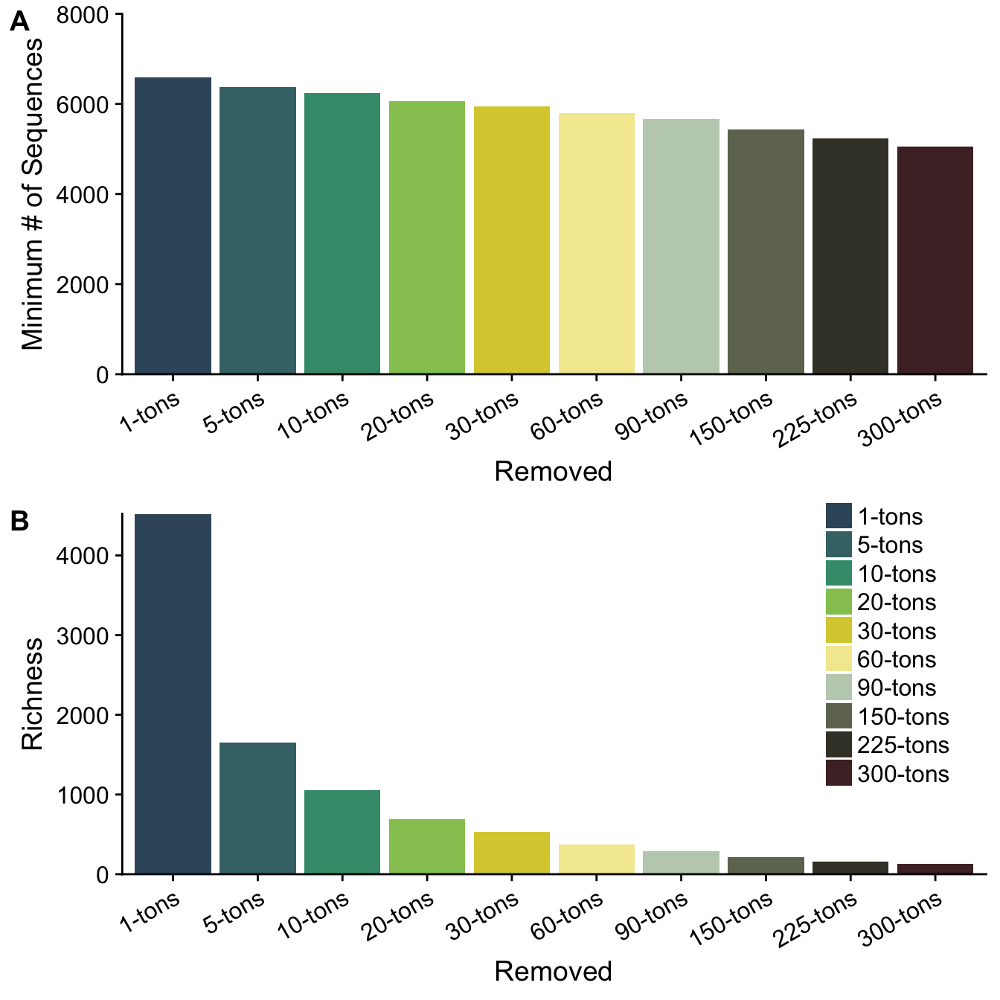


## 15 and 25-tons analysis

```r
### 15-tons analysis
notree_musk_surface_pruned_rm15 <- prune_taxa(taxa_sums(notree_musk_surface_pruned) > 15, notree_musk_surface_pruned)

alpha_rm15 <- calc_alpha_diversity(physeq = notree_musk_surface_pruned_rm15)

otu_alphadiv_rm15 <- calc_mean_alphadiv(physeq = notree_musk_surface_pruned_rm15,
                            richness_df = alpha_rm15$Richness, 
                            evenness_df = alpha_rm15$Inverse_Simpson, 
                            shannon_df = alpha_rm15$Shannon) %>%
     mutate(fraction = factor(fraction, levels = c("WholePart", "Particle", "WholeFree", "Free")),
          lakesite = factor(lakesite,  levels = c("MOT", "MDP", "MBR", "MIN")),
          measure = factor(measure, levels = c("Richness", "Simpsons_Evenness", "Shannon_Entropy", "Inverse_Simpson")),
          Removed = "15-tons")  

### To test for per-capita production
summary(lm(log10(fracprod_per_cell_noinf) ~ mean, data = filter(otu_alphadiv_rm15, measure == "Richness" & fraction == "WholePart")))
```

```
## 
## Call:
## lm(formula = log10(fracprod_per_cell_noinf) ~ mean, data = filter(otu_alphadiv_rm15, 
##     measure == "Richness" & fraction == "WholePart"))
## 
## Residuals:
##      Min       1Q   Median       3Q      Max 
## -0.77786 -0.22168 -0.06477  0.19144  0.71107 
## 
## Coefficients:
##              Estimate Std. Error t value Pr(>|t|)    
## (Intercept) -9.333765   1.022764  -9.126 7.62e-06 ***
## mean         0.007090   0.002758   2.570   0.0302 *  
## ---
## Signif. codes:  0 '***' 0.001 '**' 0.01 '*' 0.05 '.' 0.1 ' ' 1
## 
## Residual standard error: 0.4261 on 9 degrees of freedom
##   (1 observation deleted due to missingness)
## Multiple R-squared:  0.4233,	Adjusted R-squared:  0.3592 
## F-statistic: 6.606 on 1 and 9 DF,  p-value: 0.03017
```

```r
summary(lm(log10(fracprod_per_cell_noinf) ~ mean, data = filter(otu_alphadiv_rm15, measure == "Inverse_Simpson" & fraction == "WholePart")))
```

```
## 
## Call:
## lm(formula = log10(fracprod_per_cell_noinf) ~ mean, data = filter(otu_alphadiv_rm15, 
##     measure == "Inverse_Simpson" & fraction == "WholePart"))
## 
## Residuals:
##      Min       1Q   Median       3Q      Max 
## -0.37461 -0.18103 -0.00939  0.06518  0.58276 
## 
## Coefficients:
##              Estimate Std. Error t value Pr(>|t|)    
## (Intercept) -7.443951   0.178675 -41.662 1.32e-11 ***
## mean         0.024073   0.005147   4.677  0.00116 ** 
## ---
## Signif. codes:  0 '***' 0.001 '**' 0.01 '*' 0.05 '.' 0.1 ' ' 1
## 
## Residual standard error: 0.303 on 9 degrees of freedom
##   (1 observation deleted due to missingness)
## Multiple R-squared:  0.7085,	Adjusted R-squared:  0.6761 
## F-statistic: 21.87 on 1 and 9 DF,  p-value: 0.001158
```

```r
### 25-tons analysis
notree_musk_surface_pruned_rm25 <- prune_taxa(taxa_sums(notree_musk_surface_pruned) > 25, notree_musk_surface_pruned)

alpha_rm25 <- calc_alpha_diversity(physeq = notree_musk_surface_pruned_rm25)

otu_alphadiv_rm25 <- calc_mean_alphadiv(physeq = notree_musk_surface_pruned_rm25,
                            richness_df = alpha_rm25$Richness, 
                            evenness_df = alpha_rm25$Inverse_Simpson, 
                            shannon_df = alpha_rm25$Shannon) %>%
     mutate(fraction = factor(fraction, levels = c("WholePart", "Particle", "WholeFree", "Free")),
          lakesite = factor(lakesite,  levels = c("MOT", "MDP", "MBR", "MIN")),
          measure = factor(measure, levels = c("Richness", "Simpsons_Evenness", "Shannon_Entropy", "Inverse_Simpson")),
          Removed = "25-tons")  

summary(lm(frac_bacprod ~ mean, data = filter(otu_alphadiv_rm25, measure == "Richness" & fraction == "WholePart")))
```

```
## 
## Call:
## lm(formula = frac_bacprod ~ mean, data = filter(otu_alphadiv_rm25, 
##     measure == "Richness" & fraction == "WholePart"))
## 
## Residuals:
##      Min       1Q   Median       3Q      Max 
## -13.1749  -3.5245  -0.3198   3.6579  13.7021 
## 
## Coefficients:
##              Estimate Std. Error t value Pr(>|t|)  
## (Intercept) -41.75450   22.50434  -1.855   0.0932 .
## mean          0.16550    0.07173   2.307   0.0437 *
## ---
## Signif. codes:  0 '***' 0.001 '**' 0.01 '*' 0.05 '.' 0.1 ' ' 1
## 
## Residual standard error: 6.984 on 10 degrees of freedom
## Multiple R-squared:  0.3474,	Adjusted R-squared:  0.2821 
## F-statistic: 5.323 on 1 and 10 DF,  p-value: 0.04372
```

```r
summary(lm(frac_bacprod ~ mean, data = filter(otu_alphadiv_rm25, measure == "Inverse_Simpson" & fraction == "WholePart")))
```

```
## 
## Call:
## lm(formula = frac_bacprod ~ mean, data = filter(otu_alphadiv_rm25, 
##     measure == "Inverse_Simpson" & fraction == "WholePart"))
## 
## Residuals:
##     Min      1Q  Median      3Q     Max 
## -8.6484 -1.3827 -0.4148  0.6290  7.9756 
## 
## Coefficients:
##             Estimate Std. Error t value Pr(>|t|)    
## (Intercept) -2.45809    2.75764  -0.891 0.393670    
## mean         0.43182    0.08436   5.119 0.000452 ***
## ---
## Signif. codes:  0 '***' 0.001 '**' 0.01 '*' 0.05 '.' 0.1 ' ' 1
## 
## Residual standard error: 4.544 on 10 degrees of freedom
## Multiple R-squared:  0.7238,	Adjusted R-squared:  0.6961 
## F-statistic:  26.2 on 1 and 10 DF,  p-value: 0.0004515
```


## Combine all data 

```r
# Combine all div metrics 
all_divs <- bind_rows(otu_alphadiv_rm1, otu_alphadiv_rm5, otu_alphadiv_rm10, otu_alphadiv_rm20, otu_alphadiv_rm30, 
                      otu_alphadiv_rm60, otu_alphadiv_rm90, otu_alphadiv_rm150, 
                      otu_alphadiv_rm225, otu_alphadiv_rm300) %>%
  dplyr::filter(fraction %in% c("WholePart", "WholeFree") & year == "2015") %>% 
  mutate(fraction = fct_recode(fraction, "Particle" = "WholePart", "Free" = "WholeFree")) %>%
  mutate(Removed = factor(Removed, levels = c("1-tons","5-tons", "10-tons", "20-tons", "30-tons", "60-tons", 
                                              "90-tons", "150-tons", "225-tons","300-tons")))
```


# Richness 

```r
### PLOT
ggplot(dplyr::filter(all_divs, measure == "Richness"), 
       aes(y = mean, x = Removed, color = Removed, fill = Removed)) +
  geom_boxplot(alpha = 0.3, outlier.shape = NA) + geom_point(size = 3, position = position_jitter(w = 0.1)) + 
  scale_color_manual(values = tons_colors) +
  scale_fill_manual(values = tons_colors) +  
  facet_grid(.~fraction) +
  ylab("Mean Richness") +
  theme(legend.position = "bottom", legend.title = element_blank(),
        axis.text.x = element_text(angle = 30, hjust = 1, vjust = 1),
        axis.title.x = element_blank())
```

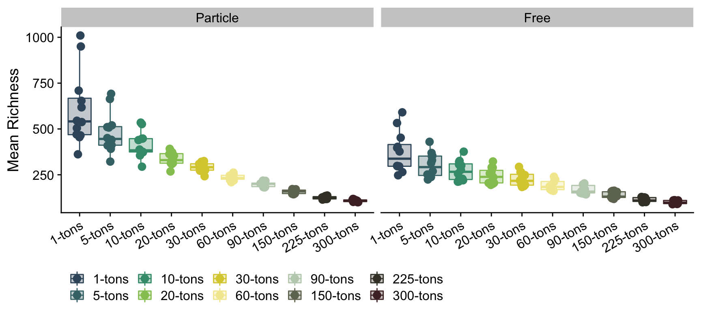

```r
ggplot(dplyr::filter(all_divs, measure == "Richness"), 
       aes(y = mean, x = fraction, color = Removed, fill = Removed)) +
  geom_boxplot(alpha = 0.3, outlier.shape = NA) + geom_point(size = 3, position = position_jitter(w = 0.1)) + 
  scale_color_manual(values = tons_colors) +
  scale_fill_manual(values = tons_colors) +  
  facet_grid(.~Removed) +
  ylab("Mean Richness") +
  theme(legend.position = "bottom", legend.title = element_blank(),
        axis.text.x = element_text(angle = 30, hjust = 1, vjust = 1),
        axis.title.x = element_blank())
```

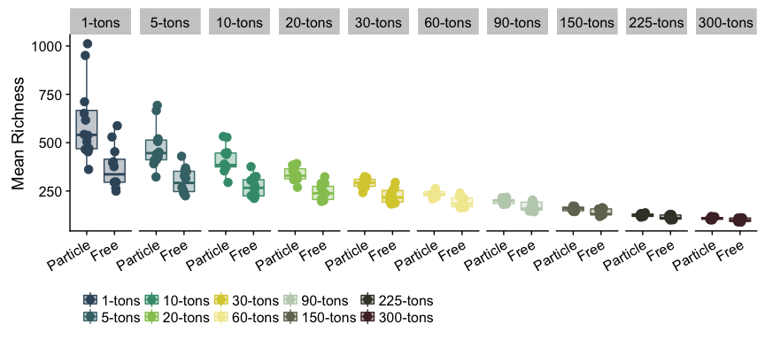


```r
# Linear Model output
richness_lm_results <- lm_fraction_output(dataframe = dplyr::filter(all_divs,  measure == "Richness"))

sig_rich_lms_df <- richness_lm_results %>%
  bind_rows() %>%
  mutate(diversity_metric = "Richness") %>%
  filter(pval < 0.05)

# Display significant models in a dataframe
datatable(sig_rich_lms_df, options = list(pageLength = 40))
```

<!--html_preserve--><div id="htmlwidget-7c2be68d9115df618b5b" style="width:100%;height:auto;" class="datatables html-widget"></div>
<script type="application/json" data-for="htmlwidget-7c2be68d9115df618b5b">{"x":{"filter":"none","data":[["1","2","3","4","5","6","7","8","9"],["1-tons","5-tons","10-tons","20-tons","1-tons","5-tons","10-tons","150-tons","300-tons"],[0.57,0.55,0.5,0.35,0.58,0.54,0.45,0.35,0.42],[0.0027,0.0033,0.0058,0.0252,0.0039,0.0058,0.0139,0.0324,0.0189],["Particle","Particle","Particle","Particle","Particle","Particle","Particle","Particle","Particle"],["Community-Wide Production","Community-Wide Production","Community-Wide Production","Community-Wide Production","Per-Capita Production","Per-Capita Production","Per-Capita Production","Per-Capita Production","Per-Capita Production"],["Richness","Richness","Richness","Richness","Richness","Richness","Richness","Richness","Richness"]],"container":"<table class=\"display\">\n  <thead>\n    <tr>\n      <th> <\/th>\n      <th>Removed<\/th>\n      <th>Adj_R2<\/th>\n      <th>pval<\/th>\n      <th>fraction<\/th>\n      <th>test<\/th>\n      <th>diversity_metric<\/th>\n    <\/tr>\n  <\/thead>\n<\/table>","options":{"pageLength":40,"columnDefs":[{"className":"dt-right","targets":[2,3]},{"orderable":false,"targets":0}],"order":[],"autoWidth":false,"orderClasses":false,"lengthMenu":[10,25,40,50,100]}},"evals":[],"jsHooks":[]}</script><!--/html_preserve-->

```r
### Community-Wide Production vs Richness
sig_rich_lms_comm <- sig_rich_lms_df %>%
  filter(test == "Community-Wide Production" & fraction == "Particle") %>%
  dplyr::select(Removed) %>%
  .$Removed

ggplot(dplyr::filter(all_divs, measure == "Richness"), 
       aes(y = frac_bacprod, x = mean, color = Removed, fill = Removed)) +
  geom_point(size = 3) + xlab("Richness") +
  ylab("Community-Wide Production") +
  geom_smooth(method = "lm", data = filter(all_divs, 
                                           measure == "Richness" & fraction == "Particle" & Removed %in% sig_rich_lms_comm)) + 
  scale_color_manual(values = tons_colors) +scale_fill_manual(values = tons_colors) +  
  facet_grid(fraction~Removed, scales = "free") +
  theme(legend.position = "bottom", legend.title = element_blank(),
        axis.text.x = element_text(angle = 30, hjust = 1, vjust = 1))
```

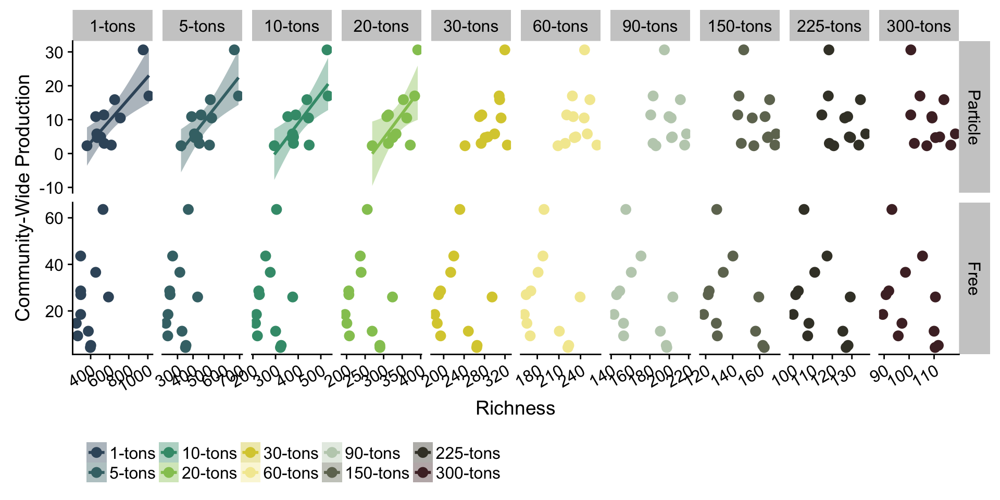

```r
### Per-capita production vs Richness
sig_rich_lms_percap <- sig_rich_lms_df %>%
  filter(test == "Per-Capita Production") %>%
  dplyr::select(Removed) %>%
  .$Removed

ggplot(dplyr::filter(all_divs, measure == "Richness"), 
       aes(y = log10(fracprod_per_cell_noinf), x = mean, color = Removed, fill = Removed)) +
  geom_point(size = 3) + xlab("Richness") +
  ylab("log10(Per-Capita Production)") +
  geom_smooth(method = "lm", data = filter(all_divs, 
                                           measure == "Richness" & fraction == "Particle" & Removed %in% sig_rich_lms_percap)) + 
  scale_color_manual(values = tons_colors) + scale_fill_manual(values = tons_colors) +  
  facet_grid(fraction~Removed, scales = "free") +
  theme(legend.position = "bottom", legend.title = element_blank(),
        axis.text.x = element_text(angle = 30, hjust = 1, vjust = 1))
```


# Shannon Entropy

```r
### PLOT
ggplot(dplyr::filter(all_divs, measure == "Shannon_Entropy"), 
       aes(y = mean, x = Removed, color = Removed, fill = Removed)) +
  geom_boxplot(alpha = 0.3, outlier.shape = NA) + geom_point(size = 3, position = position_jitter(w = 0.1)) + 
  scale_color_manual(values = tons_colors) +
  scale_fill_manual(values = tons_colors) +  
  facet_grid(.~fraction) +
  ylab("Mean Shannon_Entropy") +
  theme(legend.position = "bottom", legend.title = element_blank(),
        axis.text.x = element_text(angle = 30, hjust = 1, vjust = 1),
        axis.title.x = element_blank())
```

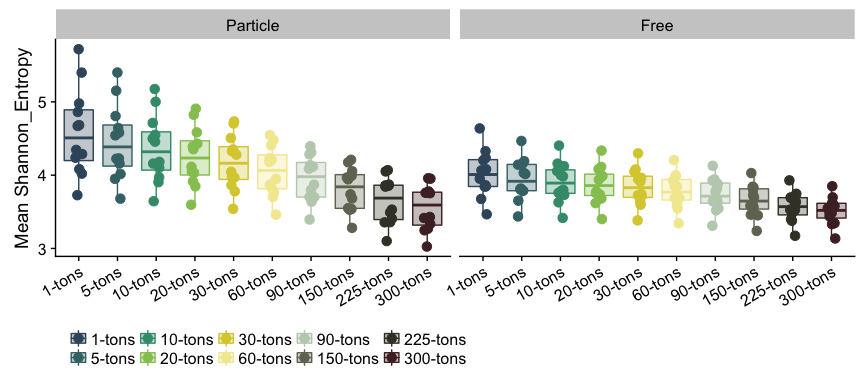

```r
ggplot(dplyr::filter(all_divs, measure == "Shannon_Entropy"), 
       aes(y = mean, x = fraction, color = Removed, fill = Removed)) +
  geom_boxplot(alpha = 0.3, outlier.shape = NA) + geom_point(size = 3, position = position_jitter(w = 0.1)) + 
  scale_color_manual(values = tons_colors) +
  scale_fill_manual(values = tons_colors) +  
  facet_grid(.~Removed) +
  ylab("Mean Shannon_Entropy") +
  theme(legend.position = "bottom", legend.title = element_blank(),
        axis.text.x = element_text(angle = 30, hjust = 1, vjust = 1),
        axis.title.x = element_blank())
```

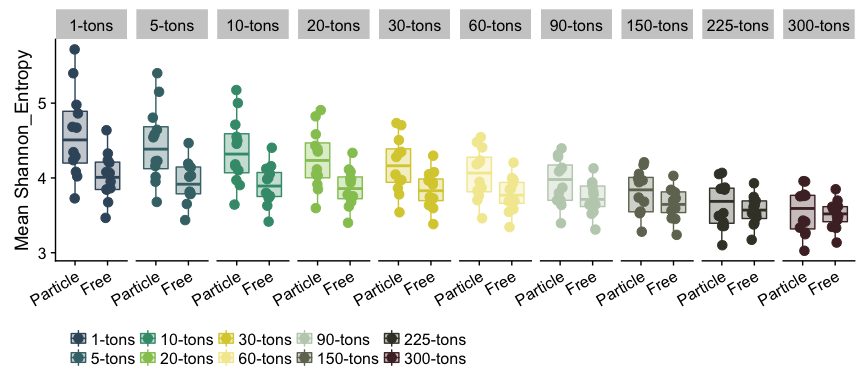


```r
# Linear Model output
shannon_lm_results <- lm_fraction_output(dataframe = dplyr::filter(all_divs,  measure == "Shannon_Entropy"))

sig_shannon_lms_df <- shannon_lm_results %>%
  bind_rows() %>%
  mutate(diversity_metric = "Shannon_Entropy") %>%
  filter(pval < 0.05)

# Display significant models in a table
datatable(sig_shannon_lms_df, options = list(pageLength = 40))
```

<!--html_preserve--><div id="htmlwidget-51ee7eaf2f3be5c35597" style="width:100%;height:auto;" class="datatables html-widget"></div>
<script type="application/json" data-for="htmlwidget-51ee7eaf2f3be5c35597">{"x":{"filter":"none","data":[["1","2","3","4","5","6","7","8","9","10","11","12","13","14","15","16","17","18","19","20"],["1-tons","5-tons","10-tons","20-tons","30-tons","60-tons","90-tons","150-tons","225-tons","300-tons","1-tons","5-tons","10-tons","20-tons","30-tons","60-tons","90-tons","150-tons","225-tons","300-tons"],[0.52,0.52,0.53,0.53,0.53,0.53,0.51,0.47,0.45,0.42,0.55,0.55,0.54,0.54,0.53,0.52,0.5,0.48,0.46,0.43],[0.0047,0.0046,0.0046,0.0042,0.0046,0.0046,0.0056,0.0079,0.0102,0.0131,0.0057,0.0057,0.0061,0.006,0.0068,0.0071,0.0088,0.0111,0.0131,0.0162],["Particle","Particle","Particle","Particle","Particle","Particle","Particle","Particle","Particle","Particle","Particle","Particle","Particle","Particle","Particle","Particle","Particle","Particle","Particle","Particle"],["Community-Wide Production","Community-Wide Production","Community-Wide Production","Community-Wide Production","Community-Wide Production","Community-Wide Production","Community-Wide Production","Community-Wide Production","Community-Wide Production","Community-Wide Production","Per-Capita Production","Per-Capita Production","Per-Capita Production","Per-Capita Production","Per-Capita Production","Per-Capita Production","Per-Capita Production","Per-Capita Production","Per-Capita Production","Per-Capita Production"],["Shannon_Entropy","Shannon_Entropy","Shannon_Entropy","Shannon_Entropy","Shannon_Entropy","Shannon_Entropy","Shannon_Entropy","Shannon_Entropy","Shannon_Entropy","Shannon_Entropy","Shannon_Entropy","Shannon_Entropy","Shannon_Entropy","Shannon_Entropy","Shannon_Entropy","Shannon_Entropy","Shannon_Entropy","Shannon_Entropy","Shannon_Entropy","Shannon_Entropy"]],"container":"<table class=\"display\">\n  <thead>\n    <tr>\n      <th> <\/th>\n      <th>Removed<\/th>\n      <th>Adj_R2<\/th>\n      <th>pval<\/th>\n      <th>fraction<\/th>\n      <th>test<\/th>\n      <th>diversity_metric<\/th>\n    <\/tr>\n  <\/thead>\n<\/table>","options":{"pageLength":40,"columnDefs":[{"className":"dt-right","targets":[2,3]},{"orderable":false,"targets":0}],"order":[],"autoWidth":false,"orderClasses":false,"lengthMenu":[10,25,40,50,100]}},"evals":[],"jsHooks":[]}</script><!--/html_preserve-->

```r
### Community-Wide Production vs Shannon Entropy
sig_shannon_lms_comm <- sig_shannon_lms_df %>%
  filter(test == "Community-Wide Production" & fraction == "Particle") %>%
  dplyr::select(Removed) %>%
  .$Removed

### Community-Wide production vs Shannon Entropy
ggplot(dplyr::filter(all_divs, measure == "Shannon_Entropy"), 
       aes(y = frac_bacprod, x = mean, color = Removed, fill = Removed)) +
  geom_point(size = 3) + 
  xlab("Shannon Entropy") +
  ylab("Bacterial Production by Fraction") +
  geom_smooth(method = "lm", 
              data = filter(all_divs, measure == "Shannon_Entropy" & fraction == "Particle" & Removed %in% sig_shannon_lms_comm)) + 
  scale_color_manual(values = tons_colors) +
  scale_fill_manual(values = tons_colors) +  
  facet_grid(fraction~Removed, scales = "free") +
  theme(legend.position = "bottom", legend.title = element_blank(),
        axis.text.x = element_text(angle = 30, hjust = 1, vjust = 1))
```

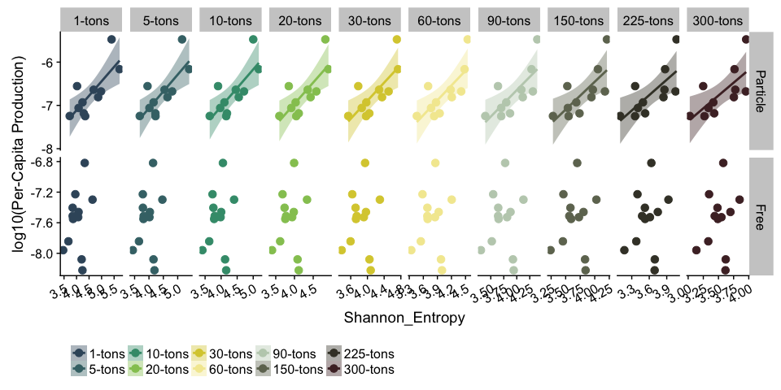

```r
### Per-Capita Production vs Shannon Entropy
sig_shannon_lms_percap <- sig_shannon_lms_df %>%
  filter(test == "Per-Capita Production" & fraction == "Particle") %>%
  dplyr::select(Removed) %>%
  .$Removed

### Per-capita production vs Shannon Entropy
ggplot(dplyr::filter(all_divs, measure == "Shannon_Entropy"), 
       aes(y = log10(fracprod_per_cell_noinf), x = mean, color = Removed, fill = Removed)) +
  geom_point(size = 3) + xlab("Shannon Entropy") +
  ylab("log10(Per-Capita Production)") +
  geom_smooth(method = "lm", 
              data = filter(all_divs, measure == "Shannon_Entropy" & fraction == "Particle" & Removed %in% sig_shannon_lms_percap)) + 
  scale_color_manual(values = tons_colors) + scale_fill_manual(values = tons_colors) +  
  facet_grid(fraction~Removed, scales = "free") +
  theme(legend.position = "bottom", legend.title = element_blank(),
        axis.text.x = element_text(angle = 30, hjust = 1, vjust = 1))
```

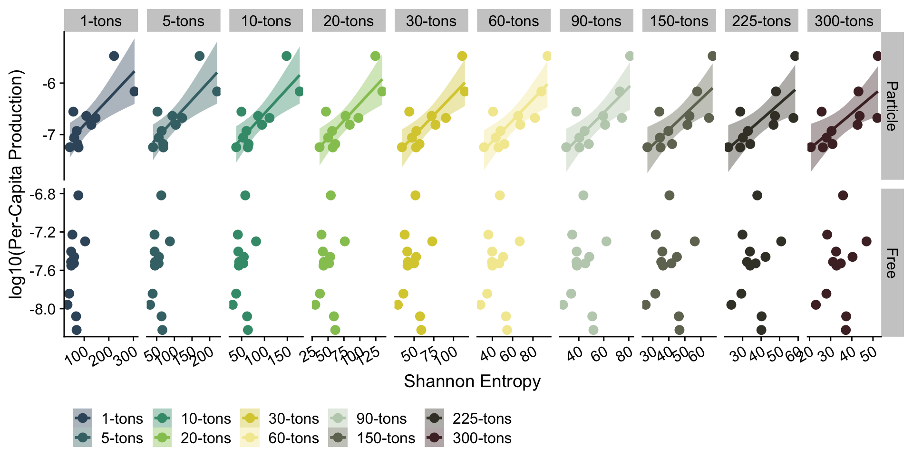


# Inverse Simpson

```r
### PLOT
ggplot(dplyr::filter(all_divs, measure == "Inverse_Simpson"), 
       aes(y = mean, x = Removed, color = Removed, fill = Removed)) +
  geom_boxplot(alpha = 0.3, outlier.shape = NA) + geom_point(size = 3, position = position_jitter(w = 0.1)) + 
  scale_color_manual(values = tons_colors) +
  scale_fill_manual(values = tons_colors) +  
  facet_grid(.~fraction) +
  ylab("Mean Inverse_Simpson") +
  theme(legend.position = "bottom", legend.title = element_blank(),
        axis.text.x = element_text(angle = 30, hjust = 1, vjust = 1),
        axis.title.x = element_blank())
```

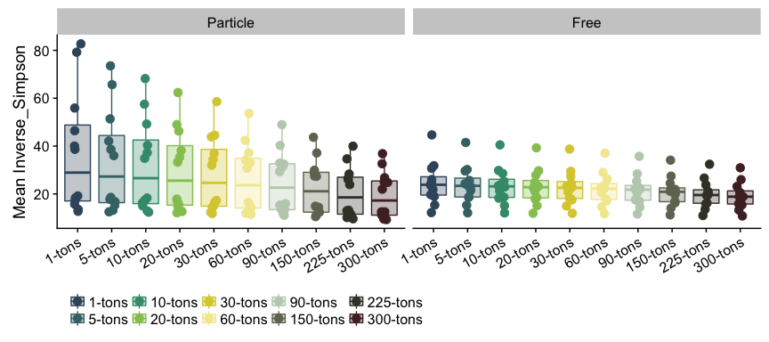

```r
ggplot(dplyr::filter(all_divs, measure == "Inverse_Simpson"), 
       aes(y = mean, x = fraction, color = Removed, fill = Removed)) +
  geom_boxplot(alpha = 0.3, outlier.shape = NA) + geom_point(size = 3, position = position_jitter(w = 0.1)) + 
  scale_color_manual(values = tons_colors) +
  scale_fill_manual(values = tons_colors) +  
  facet_grid(.~Removed) +
  ylab("Mean Inverse_Simpson") +
  theme(legend.position = "bottom", legend.title = element_blank(),
        axis.text.x = element_text(angle = 30, hjust = 1, vjust = 1),
        axis.title.x = element_blank())
```

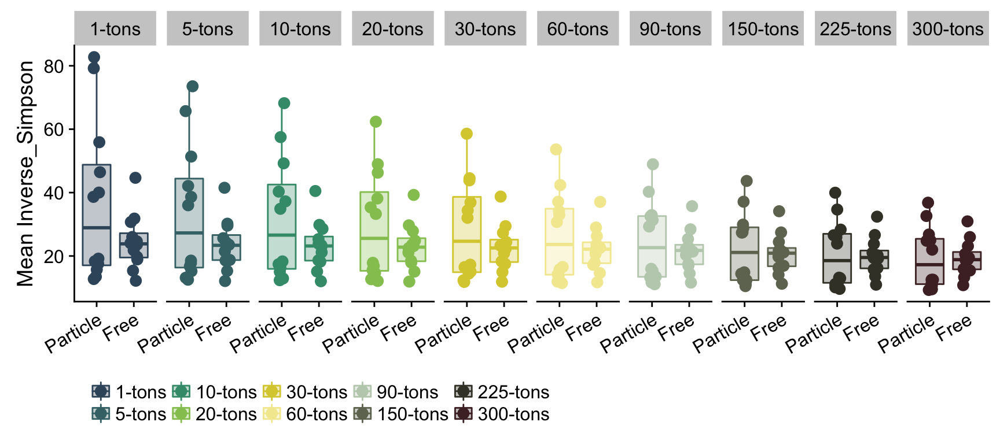


```r
# Linear Model output
invsimps_lm_results <- lm_fraction_output(dataframe = dplyr::filter(all_divs,  measure == "Inverse_Simpson"))

sig_invsimps_lms_df <- invsimps_lm_results %>%
  bind_rows() %>%
  mutate(diversity_metric = "Inverse_Simpson") %>%
  filter(pval < 0.05)

# Display significant models in a dataframe
datatable(sig_invsimps_lms_df, options = list(pageLength = 40))
```

<!--html_preserve--><div id="htmlwidget-267ef725fa9caf256836" style="width:100%;height:auto;" class="datatables html-widget"></div>
<script type="application/json" data-for="htmlwidget-267ef725fa9caf256836">{"x":{"filter":"none","data":[["1","2","3","4","5","6","7","8","9","10","11","12","13","14","15","16","17","18","19","20"],["1-tons","5-tons","10-tons","20-tons","30-tons","60-tons","90-tons","150-tons","225-tons","300-tons","1-tons","5-tons","10-tons","20-tons","30-tons","60-tons","90-tons","150-tons","225-tons","300-tons"],[0.69,0.7,0.7,0.7,0.69,0.67,0.63,0.6,0.56,0.54,0.69,0.69,0.68,0.67,0.65,0.62,0.58,0.55,0.51,0.49],[0.0005,0.0004,0.0004,0.0004,0.0005,0.0007,0.0012,0.002,0.003,0.0041,0.001,0.0009,0.0011,0.0013,0.0017,0.0024,0.0038,0.0057,0.0079,0.0101],["Particle","Particle","Particle","Particle","Particle","Particle","Particle","Particle","Particle","Particle","Particle","Particle","Particle","Particle","Particle","Particle","Particle","Particle","Particle","Particle"],["Community-Wide Production","Community-Wide Production","Community-Wide Production","Community-Wide Production","Community-Wide Production","Community-Wide Production","Community-Wide Production","Community-Wide Production","Community-Wide Production","Community-Wide Production","Per-Capita Production","Per-Capita Production","Per-Capita Production","Per-Capita Production","Per-Capita Production","Per-Capita Production","Per-Capita Production","Per-Capita Production","Per-Capita Production","Per-Capita Production"],["Inverse_Simpson","Inverse_Simpson","Inverse_Simpson","Inverse_Simpson","Inverse_Simpson","Inverse_Simpson","Inverse_Simpson","Inverse_Simpson","Inverse_Simpson","Inverse_Simpson","Inverse_Simpson","Inverse_Simpson","Inverse_Simpson","Inverse_Simpson","Inverse_Simpson","Inverse_Simpson","Inverse_Simpson","Inverse_Simpson","Inverse_Simpson","Inverse_Simpson"]],"container":"<table class=\"display\">\n  <thead>\n    <tr>\n      <th> <\/th>\n      <th>Removed<\/th>\n      <th>Adj_R2<\/th>\n      <th>pval<\/th>\n      <th>fraction<\/th>\n      <th>test<\/th>\n      <th>diversity_metric<\/th>\n    <\/tr>\n  <\/thead>\n<\/table>","options":{"pageLength":40,"columnDefs":[{"className":"dt-right","targets":[2,3]},{"orderable":false,"targets":0}],"order":[],"autoWidth":false,"orderClasses":false,"lengthMenu":[10,25,40,50,100]}},"evals":[],"jsHooks":[]}</script><!--/html_preserve-->

```r
### Community-Wide Production vs Inverse Simpson
sig_invsimps_lms_comm <- sig_invsimps_lms_df %>%
  filter(test == "Community-Wide Production" & fraction == "Particle") %>%
  dplyr::select(Removed) %>%
  .$Removed

### Community Wide production vs Inverse Simpson
ggplot(dplyr::filter(all_divs, measure == "Inverse_Simpson"), 
       aes(y = frac_bacprod, x = mean, color = Removed, fill = Removed)) +
  geom_point(size = 3) +  xlab("Inverse Simpson") +
  ylab("Community-Wide Production") +
  geom_smooth(method = "lm", 
              data = filter(all_divs, measure == "Inverse_Simpson" & fraction == "Particle" & Removed %in% sig_invsimps_lms_comm)) + 
  scale_color_manual(values = tons_colors) +
  scale_fill_manual(values = tons_colors) +  
  facet_grid(fraction~Removed, scales = "free") +
  theme(legend.position = "bottom", legend.title = element_blank(),
        axis.text.x = element_text(angle = 30, hjust = 1, vjust = 1))
```


```r
### Per-Capita Production vs Inverse Simpson
sig_invsimps_lms_percap <- sig_invsimps_lms_df %>%
  filter(test == "Per-Capita Production" & fraction == "Particle") %>%
  dplyr::select(Removed) %>%
  .$Removed

### Per-capita production vs Inverse Simpson
ggplot(dplyr::filter(all_divs, measure == "Inverse_Simpson"), 
       aes(y = log10(fracprod_per_cell_noinf), x = mean, color = Removed, fill = Removed)) +
  geom_point(size = 3) + xlab("Inverse Simpson") +
  ylab("log10(Per-Capita Production)") +
  geom_smooth(method = "lm", 
              data = filter(all_divs, measure == "Inverse_Simpson" & fraction == "Particle" & Removed %in% sig_invsimps_lms_percap)) + 
  scale_color_manual(values = tons_colors) + scale_fill_manual(values = tons_colors) +  
  facet_grid(fraction~Removed, scales = "free") +
  theme(legend.position = "bottom", legend.title = element_blank(),
        axis.text.x = element_text(angle = 30, hjust = 1, vjust = 1))
```

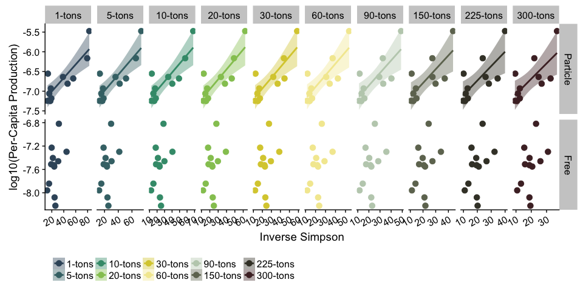


# Simpson's Evenness

```r
### PLOT
ggplot(dplyr::filter(all_divs, measure == "Simpsons_Evenness"), 
       aes(y = mean, x = Removed, color = Removed, fill = Removed)) +
  geom_boxplot(alpha = 0.3, outlier.shape = NA) + geom_point(size = 3, position = position_jitter(w = 0.1)) + 
  scale_color_manual(values = tons_colors) +
  scale_fill_manual(values = tons_colors) +  
  facet_grid(.~fraction) +
  ylab("Mean Simpsons_Evenness") +
  theme(legend.position = "bottom", legend.title = element_blank(),
        axis.text.x = element_text(angle = 30, hjust = 1, vjust = 1),
        axis.title.x = element_blank())
```


```r
ggplot(dplyr::filter(all_divs, measure == "Simpsons_Evenness"), 
       aes(y = mean, x = fraction, color = Removed, fill = Removed)) +
  geom_boxplot(alpha = 0.3, outlier.shape = NA) + geom_point(size = 3, position = position_jitter(w = 0.1)) + 
  scale_color_manual(values = tons_colors) +
  scale_fill_manual(values = tons_colors) +  
  facet_grid(.~Removed) +
  ylab("Mean Simpsons_Evenness") +
  theme(legend.position = "bottom", legend.title = element_blank(),
        axis.text.x = element_text(angle = 30, hjust = 1, vjust = 1),
        axis.title.x = element_blank())
```

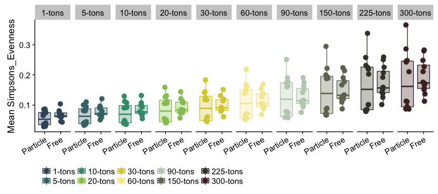


```r
# Linear Model output
sig_simpseven_lms_df <- lm_fraction_output(dataframe = dplyr::filter(all_divs,  measure == "Simpsons_Evenness")) %>%
  bind_rows() %>%
  mutate(diversity_metric = "Simpsons_Evenness") %>%
  filter(pval < 0.05)

# Display significant models in a dataframe
datatable(sig_simpseven_lms_df, options = list(pageLength = 40))
```

<!--html_preserve--><div id="htmlwidget-6c5f0d0c2ce99d1d8e4d" style="width:100%;height:auto;" class="datatables html-widget"></div>
<script type="application/json" data-for="htmlwidget-6c5f0d0c2ce99d1d8e4d">{"x":{"filter":"none","data":[["1","2","3","4","5","6","7","8","9","10","11","12","13","14","15","16","17","18","19","20"],["1-tons","5-tons","10-tons","20-tons","30-tons","60-tons","90-tons","150-tons","225-tons","300-tons","1-tons","5-tons","10-tons","20-tons","30-tons","60-tons","90-tons","150-tons","225-tons","300-tons"],[0.46,0.53,0.56,0.6,0.62,0.62,0.61,0.6,0.58,0.56,0.49,0.54,0.58,0.62,0.64,0.64,0.63,0.61,0.59,0.56],[0.0091,0.0043,0.0031,0.002,0.0014,0.0015,0.0016,0.0019,0.0025,0.0032,0.0102,0.0057,0.004,0.0026,0.0019,0.0018,0.002,0.0027,0.0035,0.0048],["Particle","Particle","Particle","Particle","Particle","Particle","Particle","Particle","Particle","Particle","Particle","Particle","Particle","Particle","Particle","Particle","Particle","Particle","Particle","Particle"],["Community-Wide Production","Community-Wide Production","Community-Wide Production","Community-Wide Production","Community-Wide Production","Community-Wide Production","Community-Wide Production","Community-Wide Production","Community-Wide Production","Community-Wide Production","Per-Capita Production","Per-Capita Production","Per-Capita Production","Per-Capita Production","Per-Capita Production","Per-Capita Production","Per-Capita Production","Per-Capita Production","Per-Capita Production","Per-Capita Production"],["Simpsons_Evenness","Simpsons_Evenness","Simpsons_Evenness","Simpsons_Evenness","Simpsons_Evenness","Simpsons_Evenness","Simpsons_Evenness","Simpsons_Evenness","Simpsons_Evenness","Simpsons_Evenness","Simpsons_Evenness","Simpsons_Evenness","Simpsons_Evenness","Simpsons_Evenness","Simpsons_Evenness","Simpsons_Evenness","Simpsons_Evenness","Simpsons_Evenness","Simpsons_Evenness","Simpsons_Evenness"]],"container":"<table class=\"display\">\n  <thead>\n    <tr>\n      <th> <\/th>\n      <th>Removed<\/th>\n      <th>Adj_R2<\/th>\n      <th>pval<\/th>\n      <th>fraction<\/th>\n      <th>test<\/th>\n      <th>diversity_metric<\/th>\n    <\/tr>\n  <\/thead>\n<\/table>","options":{"pageLength":40,"columnDefs":[{"className":"dt-right","targets":[2,3]},{"orderable":false,"targets":0}],"order":[],"autoWidth":false,"orderClasses":false,"lengthMenu":[10,25,40,50,100]}},"evals":[],"jsHooks":[]}</script><!--/html_preserve-->

```r
### Community-Wide Production vs Simpson's Evenness
sig_simpseven_lms_comm <- sig_simpseven_lms_df %>%
  filter(test == "Community-Wide Production" & fraction == "Particle") %>%
  dplyr::select(Removed) %>%
  .$Removed

### Community Wide Prodcution vs Simpson's Evenness
ggplot(dplyr::filter(all_divs, measure == "Simpsons_Evenness"), 
       aes(y = frac_bacprod, x = mean, color = Removed, fill = Removed)) +
  geom_point(size = 3) + xlab("Simpsons Evenness") + ylab("Bacterial Production by Fraction") +
  geom_smooth(method = "lm", 
              data = filter(all_divs, measure == "Simpsons_Evenness" & fraction == "Particle" & Removed %in% sig_invsimps_lms_comm)) + 
  scale_color_manual(values = tons_colors) +
  scale_fill_manual(values = tons_colors) +  
  facet_grid(fraction~Removed, scales = "free") +
  theme(legend.position = "bottom", legend.title = element_blank(),
        axis.text.x = element_text(angle = 30, hjust = 1, vjust = 1))
```


```r
### Per-Capita Production vs Simpson's Evenness
sig_simpseven_lms_percap <- sig_simpseven_lms_df %>%
  filter(test == "Per-Capita Production" & fraction == "Particle") %>%
  dplyr::select(Removed) %>%
  .$Removed

### Per-capita production vs Simpson's Evenness
ggplot(dplyr::filter(all_divs, measure == "Simpsons_Evenness"), 
       aes(y = log10(fracprod_per_cell_noinf), x = mean, color = Removed, fill = Removed)) +
  geom_point(size = 3) + xlab("Simpsons Evenness") +
  ylab("log10(Per-Capita Production)") +
  geom_smooth(method = "lm", 
              data = filter(all_divs, measure == "Simpsons_Evenness" & fraction == "Particle" & Removed %in% sig_simpseven_lms_percap)) + 
  scale_color_manual(values = tons_colors) + scale_fill_manual(values = tons_colors) +  
  facet_grid(fraction~Removed, scales = "free") +
  theme(legend.position = "bottom", legend.title = element_blank(),
        axis.text.x = element_text(angle = 30, hjust = 1, vjust = 1))
```

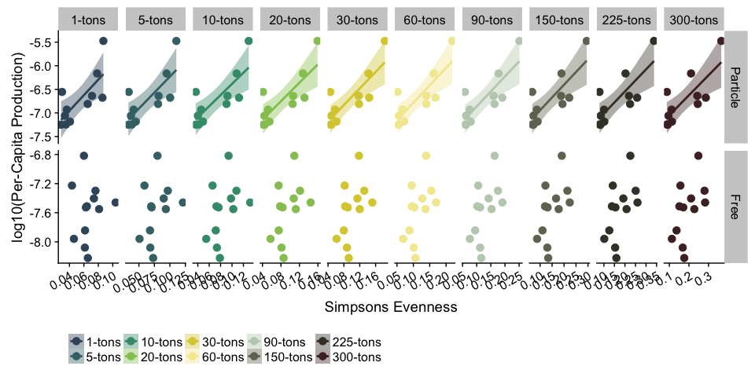


# Figure S6

```r
p1 <- ggplot(dplyr::filter(all_divs, measure == "Richness"  & fraction == "Particle"), 
       aes(y = frac_bacprod, x = mean, color = Removed, fill = Removed)) +
  geom_point(size = 3) + xlab("Richness") +
  ylab("Community-Wide \nProduction") +
  geom_smooth(method = "lm", data = filter(all_divs, 
                                           measure == "Richness" & fraction == "Particle" & Removed %in% sig_rich_lms_comm)) + 
  scale_color_manual(values = tons_colors) +scale_fill_manual(values = tons_colors) +  
  facet_grid(~Removed, scales = "free") +
  theme(legend.position = "none", legend.title = element_blank(),
        axis.text.x = element_text(angle = 60, hjust = 1, vjust = 1, size = 10),
        axis.title.x = element_blank())

p2 <- ggplot(dplyr::filter(all_divs, measure == "Richness" & fraction == "Particle"), 
       aes(y = log10(fracprod_per_cell_noinf), x = mean, color = Removed, fill = Removed)) +
  geom_point(size = 3) + xlab("Richness") +
  ylab("log10(Per-Capita \nProduction)") +
  geom_smooth(method = "lm", data = filter(all_divs, 
                                           measure == "Richness" & fraction == "Particle" & Removed %in% sig_rich_lms_percap)) + 
  scale_color_manual(values = tons_colors) + scale_fill_manual(values = tons_colors) +  
  facet_grid(~Removed, scales = "free") +
  theme(legend.position = "none", legend.title = element_blank(),
        axis.text.x = element_text(angle = 60, hjust = 1, vjust = 1, size = 10))

p3 <- ggplot(dplyr::filter(all_divs, measure == "Inverse_Simpson" & fraction == "Particle"), 
       aes(y = frac_bacprod, x = mean, color = Removed, fill = Removed)) +
  geom_point(size = 3) +  xlab("Inverse Simpson") +
  ylab("Community-Wide \nProduction") +
  geom_smooth(method = "lm", 
              data = filter(all_divs, measure == "Inverse_Simpson" & fraction == "Particle" & Removed %in% sig_invsimps_lms_comm)) + 
  scale_color_manual(values = tons_colors) +
  scale_fill_manual(values = tons_colors) +  
  facet_grid(~Removed, scales = "free") +
  theme(legend.position = "none", legend.title = element_blank(),
        axis.text.x = element_text(angle = 60, hjust = 1, vjust = 1, size = 10),
        axis.title.x = element_blank())

p4 <- ggplot(dplyr::filter(all_divs, measure == "Inverse_Simpson"  & fraction == "Particle"), 
       aes(y = log10(fracprod_per_cell_noinf), x = mean, color = Removed, fill = Removed)) +
  geom_point(size = 3) + xlab("Inverse Simpson") +
  ylab("log10(Per-Capita \nProduction)") +
  geom_smooth(method = "lm", 
              data = filter(all_divs, measure == "Inverse_Simpson" & fraction == "Particle" & Removed %in% sig_invsimps_lms_percap)) + 
  scale_color_manual(values = tons_colors) + scale_fill_manual(values = tons_colors) +  
  facet_grid(~Removed, scales = "free") +
  theme(legend.position = "bottom", legend.title = element_blank(),
        axis.text.x = element_text(angle = 60, hjust = 1, vjust = 1, size = 10))

plot_grid(p1, p2, p3, p4, 
          nrow = 4, ncol = 1,
          rel_heights = c(0.9, 1, 0.9, 1.2),
          labels = c("A", "B", "C", "D"),
          align = "v")
```

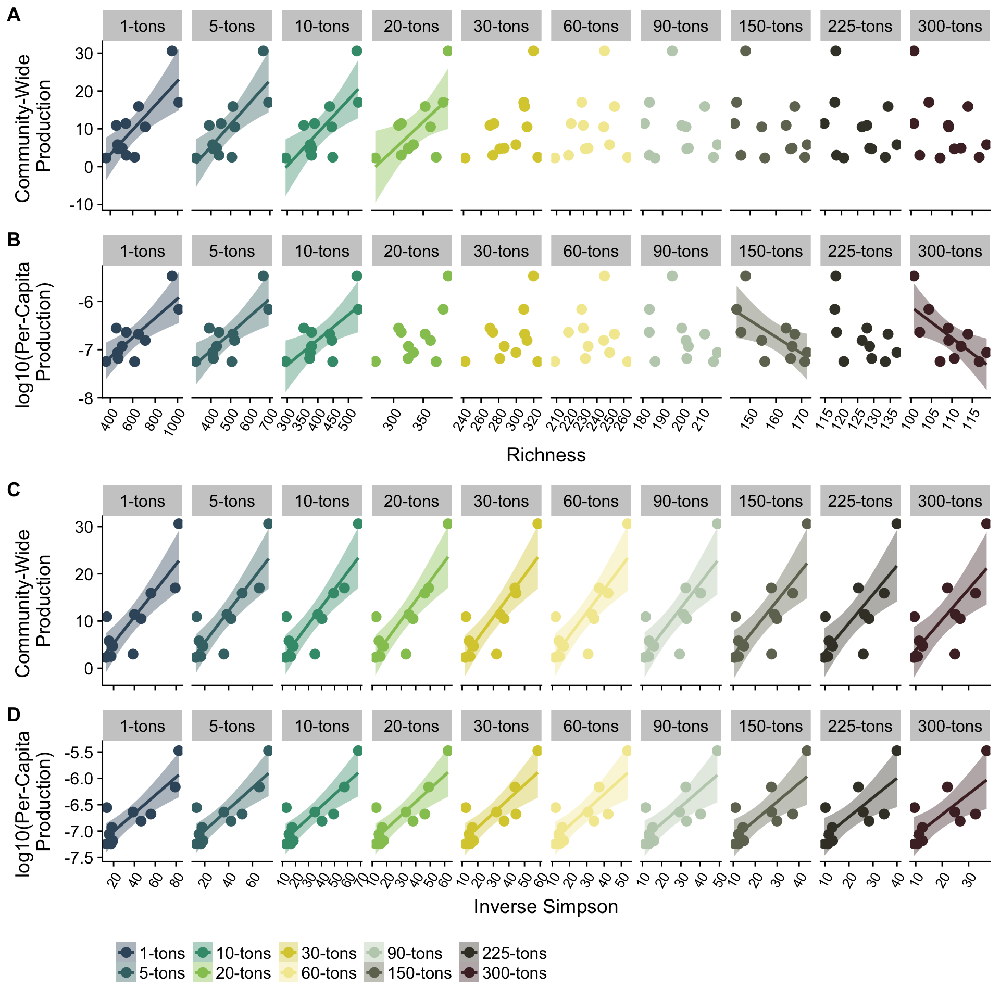

