# OTU Removal Analysis
Marian L. Schmidt  
May 1st, 2017  
<style>
pre code, pre, code {
  white-space: pre !important;
  overflow-x: scroll !important;
  word-break: keep-all !important;
  word-wrap: initial !important;
}
</style>


# Load Libraries 

```r
library(ggplot2)
library(devtools)
library(phyloseq)
library(kableExtra)
library(tidyr)
library(dplyr)
library(cowplot)
library(forcats)
library(picante) # Will also include ape and vegan 
library(car) # For residual analysis
library(sandwich) # for vcovHC function in post-hoc test
library(MASS) # For studres in plot_residuals function
library(boot) # For cross validation
source("Muskegon_functions.R")
source("set_colors.R")
```

# Prepare the data 

## Load Data

```r
# Loads a phyloseq object named otu_merged_musk_pruned)
load("../data/otu_merged_musk_pruned.RData")
# The name of the phyloseq object is: otu_merged_musk_pruned 

# Productivity measurements are reliable only up to 1 decimal
df1 <- sample_data(otu_merged_musk_pruned) %>% 
  dplyr::mutate(tot_bacprod = round(tot_bacprod, digits = 1),
                SD_tot_bacprod = round(SD_tot_bacprod, digits = 1),
                frac_bacprod = round(frac_bacprod, digits = 1),
                SD_frac_bacprod = round(SD_frac_bacprod, digits = 1),
                fraction_bac_abund = as.numeric(fraction_bac_abund),
                fracprod_per_cell = frac_bacprod/(1000*fraction_bac_abund),
                fracprod_per_cell_noinf = ifelse(fracprod_per_cell == Inf, NA, fracprod_per_cell)) %>%
  dplyr::select(norep_filter_name, lakesite, limnion, fraction, year, season, tot_bacprod, SD_tot_bacprod, frac_bacprod, SD_frac_bacprod, fraction_bac_abund, fracprod_per_cell, fracprod_per_cell_noinf)
row.names(df1) = df1$norep_filter_name
# Add new sample data back into phyloseq object 
sample_data(otu_merged_musk_pruned) <- df1

# Remove MOTHJ715 and MBRHP715 because of low sequencing depth 
otu_merged_musk_pruned_noMOTHJ715_MBRHP715 <- subset_samples(otu_merged_musk_pruned, norep_filter_name != "MOTHJ715" & norep_filter_name != "MBRHP715")

# Subset only the surface samples for the current study!!  
musk_surface <- subset_samples(otu_merged_musk_pruned_noMOTHJ715_MBRHP715, 
                               limnion == "Top" & year == "2015" & 
                                 fraction %in% c("WholePart","WholeFree")) # Surface samples, 2015, and WholePart/WholeFree samples only!
musk_surface_pruned <- prune_taxa(taxa_sums(musk_surface) > 0, musk_surface) 

# Remove tree
notree_musk_surface_pruned <- phyloseq(tax_table(musk_surface_pruned), otu_table(musk_surface_pruned), sample_data(musk_surface_pruned))

# Remove singletons!
musk_surface_pruned_rm1 <- prune_taxa(taxa_sums(notree_musk_surface_pruned) > 1, notree_musk_surface_pruned) 

# Remove the tree for less computationally intensive steps
notree_musk_surface_pruned_rm1 <- phyloseq(tax_table(musk_surface_pruned_rm1), otu_table(musk_surface_pruned_rm1), sample_data(musk_surface_pruned_rm1))

# If taxa with 2 counts are removed 
prune_taxa(taxa_sums(notree_musk_surface_pruned_rm1) > 2, notree_musk_surface_pruned_rm1) 
```

```
## phyloseq-class experiment-level object
## otu_table()   OTU Table:         [ 2979 taxa and 24 samples ]
## sample_data() Sample Data:       [ 24 samples by 13 sample variables ]
## tax_table()   Taxonomy Table:    [ 2979 taxa by 8 taxonomic ranks ]
```

```r
# If taxa with 5 counts are removed 
notree_musk_surface_pruned_rm5 <- prune_taxa(taxa_sums(notree_musk_surface_pruned) > 5, notree_musk_surface_pruned) 

# If taxa with 10 counts are removed 
notree_musk_surface_pruned_rm10 <- prune_taxa(taxa_sums(notree_musk_surface_pruned) > 10, notree_musk_surface_pruned) 

# If taxa with 20 counts are removed 
notree_musk_surface_pruned_rm20 <- prune_taxa(taxa_sums(notree_musk_surface_pruned) > 20, notree_musk_surface_pruned) 

# If taxa with 30 counts are removed 
notree_musk_surface_pruned_rm30 <- prune_taxa(taxa_sums(notree_musk_surface_pruned) > 30, notree_musk_surface_pruned) 

# If taxa with 60 counts are removed 
notree_musk_surface_pruned_rm60 <- prune_taxa(taxa_sums(notree_musk_surface_pruned) > 60, notree_musk_surface_pruned) 

# If taxa with 90 counts are removed 
notree_musk_surface_pruned_rm90 <- prune_taxa(taxa_sums(notree_musk_surface_pruned) > 90, notree_musk_surface_pruned) 

# If taxa with 150 counts are removed 
notree_musk_surface_pruned_rm150 <- prune_taxa(taxa_sums(notree_musk_surface_pruned) > 150, notree_musk_surface_pruned) 

# If taxa with 300 counts are removed 
notree_musk_surface_pruned_rm225 <- prune_taxa(taxa_sums(notree_musk_surface_pruned) > 225, notree_musk_surface_pruned) 

# If taxa with 300 counts are removed 
notree_musk_surface_pruned_rm300 <- prune_taxa(taxa_sums(notree_musk_surface_pruned) > 300, notree_musk_surface_pruned) 
```


## Calculate Diversity 


```r
set.seed(777)

################## Remove singltons 
alpha_rm1 <- calc_alpha_diversity(physeq = notree_musk_surface_pruned_rm1)

otu_alphadiv_rm1 <- calc_mean_alphadiv(physeq = notree_musk_surface_pruned_rm1,
                           richness_df = alpha_rm1$Richness, 
                           evenness_df = alpha_rm1$Inverse_Simpson, 
                           shannon_df = alpha_rm1$Shannon) %>%
    mutate(fraction = factor(fraction, levels = c("WholePart", "Particle", "WholeFree", "Free")),
         lakesite = factor(lakesite,  levels = c("MOT", "MDP", "MBR", "MIN")),
         measure = factor(measure, levels = c("Richness", "Simpsons_Evenness", "Shannon_Entropy", "Inverse_Simpson")),
         Removed = "1-tons")  

################## Remove 5-tons 
alpha_rm5 <- calc_alpha_diversity(physeq = notree_musk_surface_pruned_rm5)

otu_alphadiv_rm5 <- calc_mean_alphadiv(physeq = notree_musk_surface_pruned_rm5,
                           richness_df = alpha_rm5$Richness, 
                           evenness_df = alpha_rm5$Inverse_Simpson, 
                           shannon_df = alpha_rm5$Shannon) %>%
    mutate(fraction = factor(fraction, levels = c("WholePart", "Particle", "WholeFree", "Free")),
         lakesite = factor(lakesite,  levels = c("MOT", "MDP", "MBR", "MIN")),
         measure = factor(measure, levels = c("Richness", "Simpsons_Evenness", "Shannon_Entropy", "Inverse_Simpson")),
         Removed = "5-tons")  


################## Remove 10-tons 
alpha_rm10 <- calc_alpha_diversity(physeq = notree_musk_surface_pruned_rm10)

otu_alphadiv_rm10 <- calc_mean_alphadiv(physeq = notree_musk_surface_pruned_rm10,
                           richness_df = alpha_rm10$Richness, 
                           evenness_df = alpha_rm10$Inverse_Simpson, 
                           shannon_df = alpha_rm10$Shannon) %>%
    mutate(fraction = factor(fraction, levels = c("WholePart", "Particle", "WholeFree", "Free")),
         lakesite = factor(lakesite,  levels = c("MOT", "MDP", "MBR", "MIN")),
         measure = factor(measure, levels = c("Richness", "Simpsons_Evenness", "Shannon_Entropy", "Inverse_Simpson")),
         Removed = "10-tons") 


################## Remove 20-tons 
alpha_rm20 <- calc_alpha_diversity(physeq = notree_musk_surface_pruned_rm20)

otu_alphadiv_rm20 <- calc_mean_alphadiv(physeq = notree_musk_surface_pruned_rm20,
                           richness_df = alpha_rm20$Richness, 
                           evenness_df = alpha_rm20$Inverse_Simpson, 
                           shannon_df = alpha_rm20$Shannon) %>%
    mutate(fraction = factor(fraction, levels = c("WholePart", "Particle", "WholeFree", "Free")),
         lakesite = factor(lakesite,  levels = c("MOT", "MDP", "MBR", "MIN")),
         measure = factor(measure, levels = c("Richness", "Simpsons_Evenness", "Shannon_Entropy", "Inverse_Simpson")),
         Removed = "20-tons")  


################## Remove 30-tons 
alpha_rm30 <- calc_alpha_diversity(physeq = notree_musk_surface_pruned_rm30)

otu_alphadiv_rm30 <- calc_mean_alphadiv(physeq = notree_musk_surface_pruned_rm30,
                           richness_df = alpha_rm30$Richness, 
                           evenness_df = alpha_rm30$Inverse_Simpson, 
                           shannon_df = alpha_rm30$Shannon) %>%
    mutate(fraction = factor(fraction, levels = c("WholePart", "Particle", "WholeFree", "Free")),
         lakesite = factor(lakesite,  levels = c("MOT", "MDP", "MBR", "MIN")),
         measure = factor(measure, levels = c("Richness", "Simpsons_Evenness", "Shannon_Entropy", "Inverse_Simpson")),
         Removed = "30-tons")  


################## Remove 60-tons 
alpha_rm60 <- calc_alpha_diversity(physeq = notree_musk_surface_pruned_rm60)

otu_alphadiv_rm60 <- calc_mean_alphadiv(physeq = notree_musk_surface_pruned_rm60,
                           richness_df = alpha_rm60$Richness, 
                           evenness_df = alpha_rm60$Inverse_Simpson, 
                           shannon_df = alpha_rm60$Shannon) %>%
    mutate(fraction = factor(fraction, levels = c("WholePart", "Particle", "WholeFree", "Free")),
         lakesite = factor(lakesite,  levels = c("MOT", "MDP", "MBR", "MIN")),
         measure = factor(measure, levels = c("Richness", "Simpsons_Evenness", "Shannon_Entropy", "Inverse_Simpson")),
         Removed = "60-tons")  


################## Remove 90-tons 
alpha_rm90 <- calc_alpha_diversity(physeq = notree_musk_surface_pruned_rm90)

otu_alphadiv_rm90 <- calc_mean_alphadiv(physeq = notree_musk_surface_pruned_rm90,
                           richness_df = alpha_rm90$Richness, 
                           evenness_df = alpha_rm90$Inverse_Simpson, 
                           shannon_df = alpha_rm90$Shannon) %>%
    mutate(fraction = factor(fraction, levels = c("WholePart", "Particle", "WholeFree", "Free")),
         lakesite = factor(lakesite,  levels = c("MOT", "MDP", "MBR", "MIN")),
         measure = factor(measure, levels = c("Richness", "Simpsons_Evenness", "Shannon_Entropy", "Inverse_Simpson")),
         Removed = "90-tons")  


################## Remove 90-tons 
alpha_rm150 <- calc_alpha_diversity(physeq = notree_musk_surface_pruned_rm150)

otu_alphadiv_rm150 <- calc_mean_alphadiv(physeq = notree_musk_surface_pruned_rm150,
                           richness_df = alpha_rm150$Richness, 
                           evenness_df = alpha_rm150$Inverse_Simpson, 
                           shannon_df = alpha_rm150$Shannon) %>%
    mutate(fraction = factor(fraction, levels = c("WholePart", "Particle", "WholeFree", "Free")),
         lakesite = factor(lakesite,  levels = c("MOT", "MDP", "MBR", "MIN")),
         measure = factor(measure, levels = c("Richness", "Simpsons_Evenness", "Shannon_Entropy", "Inverse_Simpson")),
         Removed = "150-tons")  

################## Remove 300-tons 
alpha_rm225 <- calc_alpha_diversity(physeq = notree_musk_surface_pruned_rm225)

otu_alphadiv_rm225 <- calc_mean_alphadiv(physeq = notree_musk_surface_pruned_rm225,
                           richness_df = alpha_rm225$Richness, 
                           evenness_df = alpha_rm225$Inverse_Simpson, 
                           shannon_df = alpha_rm225$Shannon) %>%
    mutate(fraction = factor(fraction, levels = c("WholePart", "Particle", "WholeFree", "Free")),
         lakesite = factor(lakesite,  levels = c("MOT", "MDP", "MBR", "MIN")),
         measure = factor(measure, levels = c("Richness", "Simpsons_Evenness", "Shannon_Entropy", "Inverse_Simpson")),
         Removed = "225-tons")  


################## Remove 300-tons 
alpha_rm300 <- calc_alpha_diversity(physeq = notree_musk_surface_pruned_rm300)

otu_alphadiv_rm300 <- calc_mean_alphadiv(physeq = notree_musk_surface_pruned_rm300,
                           richness_df = alpha_rm300$Richness, 
                           evenness_df = alpha_rm300$Inverse_Simpson, 
                           shannon_df = alpha_rm300$Shannon) %>%
    mutate(fraction = factor(fraction, levels = c("WholePart", "Particle", "WholeFree", "Free")),
         lakesite = factor(lakesite,  levels = c("MOT", "MDP", "MBR", "MIN")),
         measure = factor(measure, levels = c("Richness", "Simpsons_Evenness", "Shannon_Entropy", "Inverse_Simpson")),
         Removed = "300-tons")  
```


## Minimum Sequences Plot

```r
min_seqs <- c(min(sample_sums(notree_musk_surface_pruned_rm1)) - 1, min(sample_sums(notree_musk_surface_pruned_rm5)) - 1, 
  min(sample_sums(notree_musk_surface_pruned_rm10)) - 1, min(sample_sums(notree_musk_surface_pruned_rm20)) - 1,
  min(sample_sums(notree_musk_surface_pruned_rm30)) - 1,
  min(sample_sums(notree_musk_surface_pruned_rm60)) - 1, min(sample_sums(notree_musk_surface_pruned_rm90)) - 1,
  min(sample_sums(notree_musk_surface_pruned_rm150)) - 1, min(sample_sums(notree_musk_surface_pruned_rm225)) - 1,
  min(sample_sums(notree_musk_surface_pruned_rm300)) - 1)


num_otus <- c(ncol(otu_table(notree_musk_surface_pruned_rm1)), ncol(otu_table(notree_musk_surface_pruned_rm5)), ncol(otu_table(notree_musk_surface_pruned_rm10)), 
              ncol(otu_table(notree_musk_surface_pruned_rm20)),
              ncol(otu_table(notree_musk_surface_pruned_rm30)), ncol(otu_table(notree_musk_surface_pruned_rm60)), ncol(otu_table(notree_musk_surface_pruned_rm90)),
              ncol(otu_table(notree_musk_surface_pruned_rm150)), ncol(otu_table(notree_musk_surface_pruned_rm225)), ncol(otu_table(notree_musk_surface_pruned_rm300)))

Removed <- c("1-tons","5-tons", "10-tons", "20-tons", "30-tons", "60-tons", "90-tons", "150-tons", "225-tons","300-tons")


statz <- data.frame(cbind(as.numeric(min_seqs), as.numeric(num_otus), Removed)) %>%
         mutate(Removed = factor(Removed, levels = c("1-tons","5-tons", "10-tons", "20-tons", "30-tons", "60-tons", 
                                              "90-tons", "150-tons", "225-tons","300-tons"))) %>%
  mutate(num_otus = as.numeric(num_otus))

p1 <- ggplot(statz, aes(x = Removed, y = min_seqs, fill = Removed)) +
  geom_bar(stat = "identity") + ylab("Minimum # of Sequences") +
  scale_y_continuous(expand = c(0,0), limits = c(0, 8000)) +
  scale_color_manual(values = tons_colors) +
  scale_fill_manual(values = tons_colors) +
    theme(axis.text.x = element_text(angle = 30, hjust = 1, vjust = 1),
        legend.position = "none")
  
p2 <-ggplot(statz, aes(x = Removed, y = num_otus, fill = Removed)) +
  geom_bar(stat = "identity") + ylab("Richness") +
  scale_y_continuous(expand = c(0,0)) +
  scale_color_manual(values = tons_colors) +
  scale_fill_manual(values = tons_colors) +
  theme(axis.text.x = element_text(angle = 30, hjust = 1, vjust = 1),
        legend.position = c(0.8, 0.65), legend.title = element_blank())

plot_grid(p1, p2, align = "v", labels = c("A", "B"), nrow = 2, ncol =1)
```

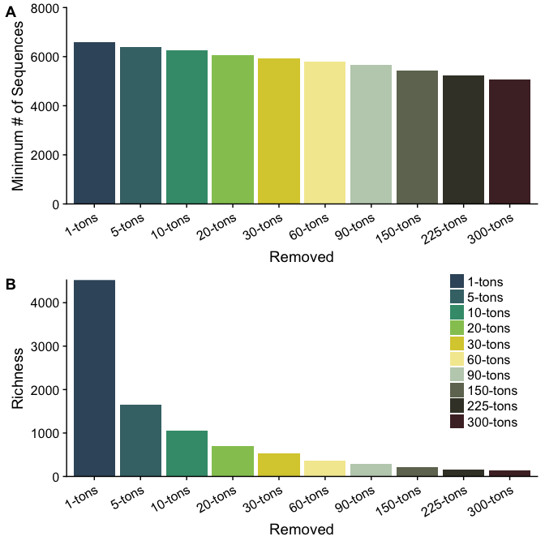


## Combine all data 

```r
# Combine all div metrics 
all_divs <- bind_rows(otu_alphadiv_rm1, otu_alphadiv_rm5, otu_alphadiv_rm10, otu_alphadiv_rm20, otu_alphadiv_rm30, 
                      otu_alphadiv_rm60, otu_alphadiv_rm90, otu_alphadiv_rm150, 
                      otu_alphadiv_rm225, otu_alphadiv_rm300) %>%
  dplyr::filter(fraction %in% c("WholePart", "WholeFree") & year == "2015") %>% 
  mutate(fraction = fct_recode(fraction, "Particle" = "WholePart", "Free" = "WholeFree")) %>%
  mutate(Removed = factor(Removed, levels = c("1-tons","5-tons", "10-tons", "20-tons", "30-tons", "60-tons", 
                                              "90-tons", "150-tons", "225-tons","300-tons")))
```


# Richness 

```r
### PLOT
ggplot(dplyr::filter(all_divs, measure == "Richness"), 
       aes(y = mean, x = Removed, color = Removed, fill = Removed)) +
  geom_boxplot(alpha = 0.3, outlier.shape = NA) + geom_point(size = 3, position = position_jitter(w = 0.1)) + 
  scale_color_manual(values = tons_colors) +
  scale_fill_manual(values = tons_colors) +  
  facet_grid(.~fraction) +
  ylab("Mean Richness") +
  theme(legend.position = "bottom", legend.title = element_blank(),
        axis.text.x = element_text(angle = 30, hjust = 1, vjust = 1),
        axis.title.x = element_blank())
```

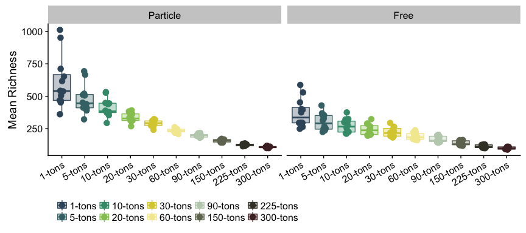

```r
ggplot(dplyr::filter(all_divs, measure == "Richness"), 
       aes(y = mean, x = fraction, color = Removed, fill = Removed)) +
  geom_boxplot(alpha = 0.3, outlier.shape = NA) + geom_point(size = 3, position = position_jitter(w = 0.1)) + 
  scale_color_manual(values = tons_colors) +
  scale_fill_manual(values = tons_colors) +  
  facet_grid(.~Removed) +
  ylab("Mean Richness") +
  theme(legend.position = "bottom", legend.title = element_blank(),
        axis.text.x = element_text(angle = 30, hjust = 1, vjust = 1),
        axis.title.x = element_blank())
```

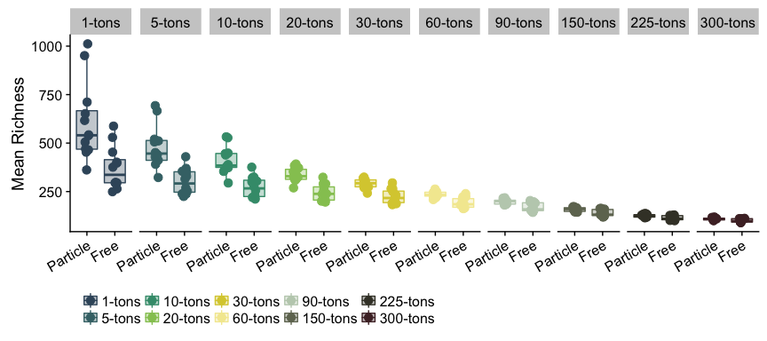


```r
# Linear Model output
richness_lm_results <- lm_fraction_output(dataframe = dplyr::filter(all_divs,  measure == "Richness"))

richness_lm_results %>%
  bind_rows() %>%
  mutate(diversity_metric = "Richness") %>%
  knitr::kable()
```


Removed     Adj_R2     pval  fraction   diversity_metric 
---------  -------  -------  ---------  -----------------
1-tons        0.05   0.2412  Free       Richness         
5-tons       -0.08   0.6664  Free       Richness         
10-tons      -0.10   0.9519  Free       Richness         
20-tons      -0.09   0.7787  Free       Richness         
30-tons      -0.08   0.7017  Free       Richness         
60-tons      -0.05   0.5037  Free       Richness         
90-tons       0.04   0.2630  Free       Richness         
150-tons      0.08   0.1905  Free       Richness         
225-tons      0.05   0.2342  Free       Richness         
300-tons      0.06   0.2232  Free       Richness         
1-tons        0.57   0.0027  Particle   Richness         
5-tons        0.55   0.0033  Particle   Richness         
10-tons       0.50   0.0058  Particle   Richness         
20-tons       0.35   0.0252  Particle   Richness         
30-tons       0.16   0.1108  Particle   Richness         
60-tons      -0.04   0.4655  Particle   Richness         
90-tons      -0.07   0.6348  Particle   Richness         
150-tons      0.09   0.1825  Particle   Richness         
225-tons      0.02   0.2958  Particle   Richness         
300-tons      0.12   0.1414  Particle   Richness         

```r
sig_rich_lms <- c("1-tons", "5-tons", "10-tons", "20-tons")

ggplot(dplyr::filter(all_divs, measure == "Richness"), 
       aes(y = frac_bacprod, x = mean, color = Removed, fill = Removed)) +
  geom_point(size = 3) + 
  xlab("Richness") +
  ylab("Bacterial Production by Fraction") +
  geom_smooth(method = "lm", data = filter(all_divs, 
                                           measure == "Richness" & fraction == "Particle" & Removed %in% sig_rich_lms)) + 
  scale_color_manual(values = tons_colors) +
  scale_fill_manual(values = tons_colors) +  
  facet_grid(fraction~Removed, scales = "free") +
  theme(legend.position = "bottom", legend.title = element_blank(),
        axis.text.x = element_text(angle = 30, hjust = 1, vjust = 1))
```

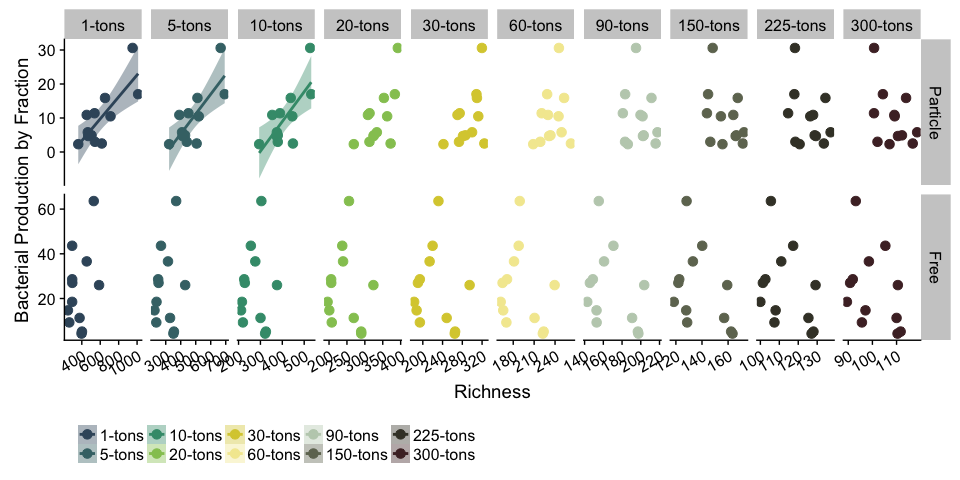


# Shannon Entropy

```r
### PLOT
ggplot(dplyr::filter(all_divs, measure == "Shannon_Entropy"), 
       aes(y = mean, x = Removed, color = Removed, fill = Removed)) +
  geom_boxplot(alpha = 0.3, outlier.shape = NA) + geom_point(size = 3, position = position_jitter(w = 0.1)) + 
  scale_color_manual(values = tons_colors) +
  scale_fill_manual(values = tons_colors) +  
  facet_grid(.~fraction) +
  ylab("Mean Shannon_Entropy") +
  theme(legend.position = "bottom", legend.title = element_blank(),
        axis.text.x = element_text(angle = 30, hjust = 1, vjust = 1),
        axis.title.x = element_blank())
```

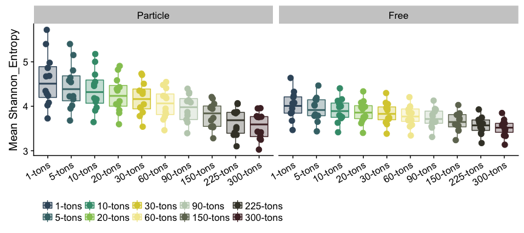

```r
ggplot(dplyr::filter(all_divs, measure == "Shannon_Entropy"), 
       aes(y = mean, x = fraction, color = Removed, fill = Removed)) +
  geom_boxplot(alpha = 0.3, outlier.shape = NA) + geom_point(size = 3, position = position_jitter(w = 0.1)) + 
  scale_color_manual(values = tons_colors) +
  scale_fill_manual(values = tons_colors) +  
  facet_grid(.~Removed) +
  ylab("Mean Shannon_Entropy") +
  theme(legend.position = "bottom", legend.title = element_blank(),
        axis.text.x = element_text(angle = 30, hjust = 1, vjust = 1),
        axis.title.x = element_blank())
```

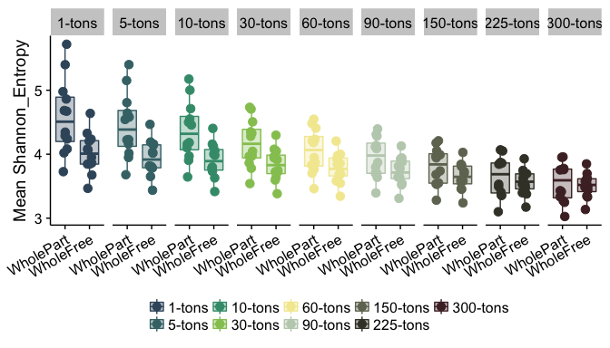


```r
# Linear Model output
shannon_lm_results <- lm_fraction_output(dataframe = dplyr::filter(all_divs,  measure == "Shannon_Entropy"))

shannon_lm_results %>%
  bind_rows() %>%
  mutate(diversity_metric = "Shannon_Entropy") %>%
  knitr::kable()
```


Removed     Adj_R2     pval  fraction   diversity_metric 
---------  -------  -------  ---------  -----------------
1-tons       -0.05   0.5035  Free       Shannon_Entropy  
5-tons       -0.09   0.7450  Free       Shannon_Entropy  
10-tons      -0.10   0.8437  Free       Shannon_Entropy  
20-tons      -0.10   0.9004  Free       Shannon_Entropy  
30-tons      -0.10   0.9528  Free       Shannon_Entropy  
60-tons      -0.10   0.9873  Free       Shannon_Entropy  
90-tons      -0.10   0.9272  Free       Shannon_Entropy  
150-tons     -0.10   0.9498  Free       Shannon_Entropy  
225-tons     -0.09   0.8321  Free       Shannon_Entropy  
300-tons     -0.09   0.7705  Free       Shannon_Entropy  
1-tons        0.52   0.0047  Particle   Shannon_Entropy  
5-tons        0.52   0.0046  Particle   Shannon_Entropy  
10-tons       0.53   0.0046  Particle   Shannon_Entropy  
20-tons       0.53   0.0042  Particle   Shannon_Entropy  
30-tons       0.53   0.0046  Particle   Shannon_Entropy  
60-tons       0.53   0.0046  Particle   Shannon_Entropy  
90-tons       0.51   0.0056  Particle   Shannon_Entropy  
150-tons      0.47   0.0079  Particle   Shannon_Entropy  
225-tons      0.45   0.0102  Particle   Shannon_Entropy  
300-tons      0.42   0.0131  Particle   Shannon_Entropy  

```r
ggplot(dplyr::filter(all_divs, measure == "Shannon_Entropy"), 
       aes(y = frac_bacprod, x = mean, color = Removed, fill = Removed)) +
  geom_point(size = 3) + 
  xlab("Shannon_Entropy") +
  ylab("Bacterial Production by Fraction") +
  geom_smooth(method = "lm", data = filter(all_divs, measure == "Shannon_Entropy" & fraction == "Particle" )) + 
  scale_color_manual(values = tons_colors) +
  scale_fill_manual(values = tons_colors) +  
  facet_grid(fraction~Removed, scales = "free") +
  theme(legend.position = "bottom", legend.title = element_blank(),
        axis.text.x = element_text(angle = 30, hjust = 1, vjust = 1))
```

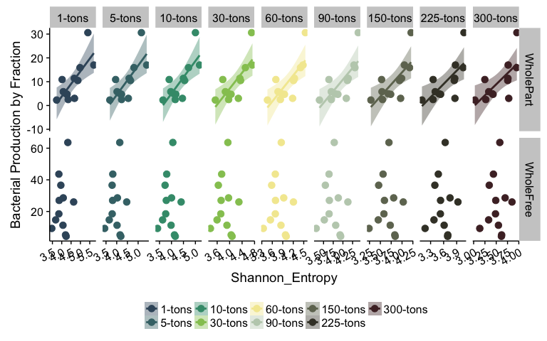


# Inverse Simpson

```r
### PLOT
ggplot(dplyr::filter(all_divs, measure == "Inverse_Simpson"), 
       aes(y = mean, x = Removed, color = Removed, fill = Removed)) +
  geom_boxplot(alpha = 0.3, outlier.shape = NA) + geom_point(size = 3, position = position_jitter(w = 0.1)) + 
  scale_color_manual(values = tons_colors) +
  scale_fill_manual(values = tons_colors) +  
  facet_grid(.~fraction) +
  ylab("Mean Inverse_Simpson") +
  theme(legend.position = "bottom", legend.title = element_blank(),
        axis.text.x = element_text(angle = 30, hjust = 1, vjust = 1),
        axis.title.x = element_blank())
```

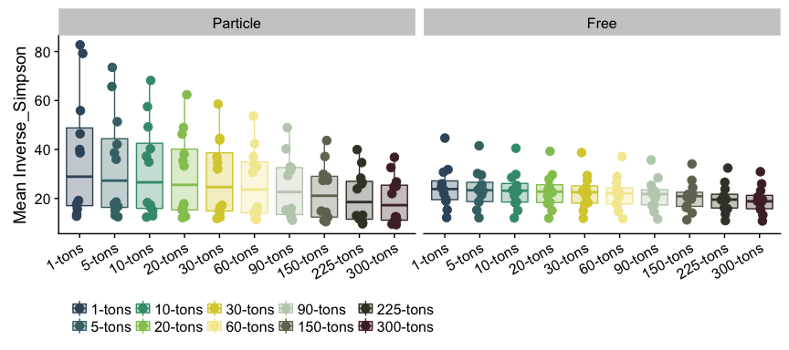

```r
ggplot(dplyr::filter(all_divs, measure == "Inverse_Simpson"), 
       aes(y = mean, x = fraction, color = Removed, fill = Removed)) +
  geom_boxplot(alpha = 0.3, outlier.shape = NA) + geom_point(size = 3, position = position_jitter(w = 0.1)) + 
  scale_color_manual(values = tons_colors) +
  scale_fill_manual(values = tons_colors) +  
  facet_grid(.~Removed) +
  ylab("Mean Inverse_Simpson") +
  theme(legend.position = "bottom", legend.title = element_blank(),
        axis.text.x = element_text(angle = 30, hjust = 1, vjust = 1),
        axis.title.x = element_blank())
```

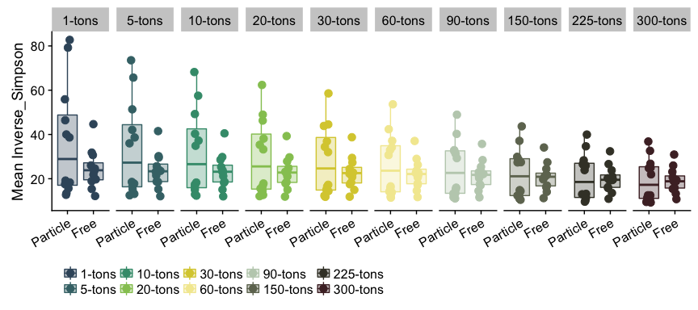


```r
# Linear Model output
invsimps_lm_results <- lm_fraction_output(dataframe = dplyr::filter(all_divs,  measure == "Inverse_Simpson"))

invsimps_lm_results %>%
  bind_rows() %>%
  mutate(diversity_metric = "Inverse_Simpson") %>%
  knitr::kable()
```


Removed     Adj_R2     pval  fraction   diversity_metric 
---------  -------  -------  ---------  -----------------
1-tons       -0.02   0.3919  Free       Inverse_Simpson  
5-tons       -0.04   0.4569  Free       Inverse_Simpson  
10-tons      -0.04   0.4806  Free       Inverse_Simpson  
20-tons      -0.04   0.4842  Free       Inverse_Simpson  
30-tons      -0.05   0.4990  Free       Inverse_Simpson  
60-tons      -0.05   0.5014  Free       Inverse_Simpson  
90-tons      -0.05   0.5144  Free       Inverse_Simpson  
150-tons     -0.05   0.5007  Free       Inverse_Simpson  
225-tons     -0.03   0.4177  Free       Inverse_Simpson  
300-tons     -0.02   0.3883  Free       Inverse_Simpson  
1-tons        0.69   0.0005  Particle   Inverse_Simpson  
5-tons        0.70   0.0004  Particle   Inverse_Simpson  
10-tons       0.70   0.0004  Particle   Inverse_Simpson  
20-tons       0.70   0.0004  Particle   Inverse_Simpson  
30-tons       0.69   0.0005  Particle   Inverse_Simpson  
60-tons       0.67   0.0007  Particle   Inverse_Simpson  
90-tons       0.63   0.0012  Particle   Inverse_Simpson  
150-tons      0.60   0.0020  Particle   Inverse_Simpson  
225-tons      0.56   0.0030  Particle   Inverse_Simpson  
300-tons      0.54   0.0041  Particle   Inverse_Simpson  

```r
ggplot(dplyr::filter(all_divs, measure == "Inverse_Simpson"), 
       aes(y = frac_bacprod, x = mean, color = Removed, fill = Removed)) +
  geom_point(size = 3) + 
  xlab("Inverse_Simpson") +
  ylab("Bacterial Production by Fraction") +
  geom_smooth(method = "lm", data = filter(all_divs, measure == "Inverse_Simpson" & fraction == "Particle" )) + 
  scale_color_manual(values = tons_colors) +
  scale_fill_manual(values = tons_colors) +  
  facet_grid(fraction~Removed, scales = "free") +
  theme(legend.position = "bottom", legend.title = element_blank(),
        axis.text.x = element_text(angle = 30, hjust = 1, vjust = 1))
```

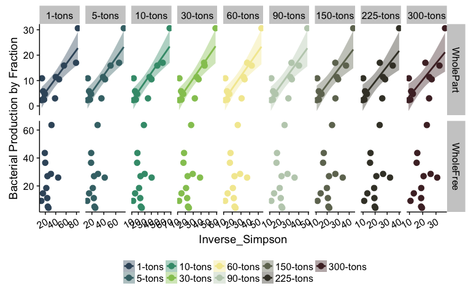


# Simpson's Evenness

```r
### PLOT
ggplot(dplyr::filter(all_divs, measure == "Simpsons_Evenness"), 
       aes(y = mean, x = Removed, color = Removed, fill = Removed)) +
  geom_boxplot(alpha = 0.3, outlier.shape = NA) + geom_point(size = 3, position = position_jitter(w = 0.1)) + 
  scale_color_manual(values = tons_colors) +
  scale_fill_manual(values = tons_colors) +  
  facet_grid(.~fraction) +
  ylab("Mean Simpsons_Evenness") +
  theme(legend.position = "bottom", legend.title = element_blank(),
        axis.text.x = element_text(angle = 30, hjust = 1, vjust = 1),
        axis.title.x = element_blank())
```

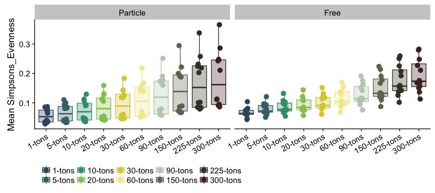

```r
ggplot(dplyr::filter(all_divs, measure == "Simpsons_Evenness"), 
       aes(y = mean, x = fraction, color = Removed, fill = Removed)) +
  geom_boxplot(alpha = 0.3, outlier.shape = NA) + geom_point(size = 3, position = position_jitter(w = 0.1)) + 
  scale_color_manual(values = tons_colors) +
  scale_fill_manual(values = tons_colors) +  
  facet_grid(.~Removed) +
  ylab("Mean Simpsons_Evenness") +
  theme(legend.position = "bottom", legend.title = element_blank(),
        axis.text.x = element_text(angle = 30, hjust = 1, vjust = 1),
        axis.title.x = element_blank())
```

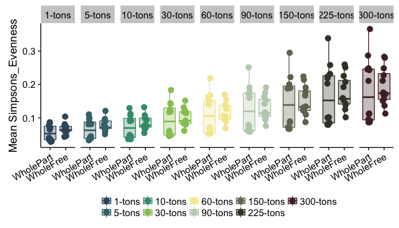


```r
# Linear Model output
simpseven_lm_results <- lm_fraction_output(dataframe = dplyr::filter(all_divs,  measure == "Simpsons_Evenness")) %>%
  bind_rows() %>%
  mutate(diversity_metric = "Simpsons_Evenness")

# Which rows have pvalues less than 0.05?
low_pvals_simseven <- simpseven_lm_results$pval < 0.05

simpseven_lm_results %>%
  knitr::kable() %>%
  row_spec(which(low_pvals_simseven), bold = T, color = "white", background = "#D7261E")
```


Removed     Adj_R2     pval  fraction   diversity_metric  
---------  -------  -------  ---------  ------------------
1-tons       -0.10   0.9123  Free       Simpsons_Evenness 
5-tons       -0.05   0.5197  Free       Simpsons_Evenness 
10-tons      -0.02   0.3927  Free       Simpsons_Evenness 
20-tons       0.02   0.2984  Free       Simpsons_Evenness 
30-tons       0.03   0.2779  Free       Simpsons_Evenness 
60-tons       0.05   0.2331  Free       Simpsons_Evenness 
90-tons       0.08   0.1861  Free       Simpsons_Evenness 
150-tons      0.08   0.1918  Free       Simpsons_Evenness 
225-tons      0.08   0.1959  Free       Simpsons_Evenness 
300-tons      0.07   0.2004  Free       Simpsons_Evenness 
1-tons        0.46   0.0091  Particle   Simpsons_Evenness 
5-tons        0.53   0.0043  Particle   Simpsons_Evenness 
10-tons       0.56   0.0031  Particle   Simpsons_Evenness 
20-tons       0.60   0.0020  Particle   Simpsons_Evenness 
30-tons       0.62   0.0014  Particle   Simpsons_Evenness 
60-tons       0.62   0.0015  Particle   Simpsons_Evenness 
90-tons       0.61   0.0016  Particle   Simpsons_Evenness 
150-tons      0.60   0.0019  Particle   Simpsons_Evenness 
225-tons      0.58   0.0025  Particle   Simpsons_Evenness 
300-tons      0.56   0.0032  Particle   Simpsons_Evenness 

```r
ggplot(dplyr::filter(all_divs, measure == "Simpsons_Evenness"), 
       aes(y = frac_bacprod, x = mean, color = Removed, fill = Removed)) +
  geom_point(size = 3) + 
  xlab("Simpsons_Evenness") +
  ylab("Bacterial Production by Fraction") +
  geom_smooth(method = "lm", data = filter(all_divs, measure == "Simpsons_Evenness" & fraction == "Particle" )) + 
  scale_color_manual(values = tons_colors) +
  scale_fill_manual(values = tons_colors) +  
  facet_grid(fraction~Removed, scales = "free") +
  theme(legend.position = "bottom", legend.title = element_blank(),
        axis.text.x = element_text(angle = 30, hjust = 1, vjust = 1))
```

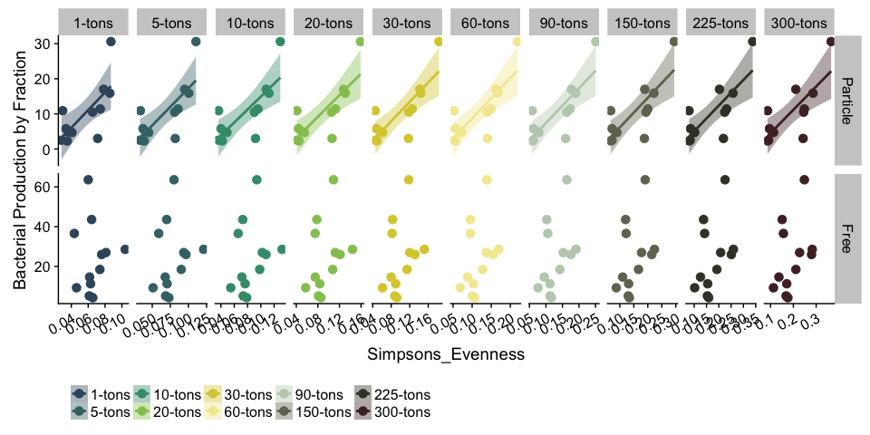
