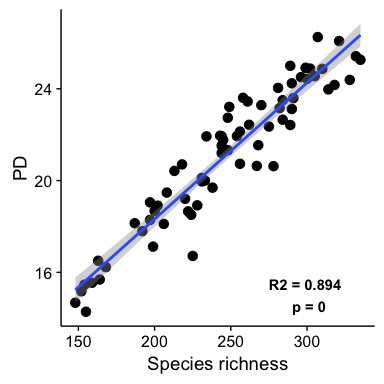
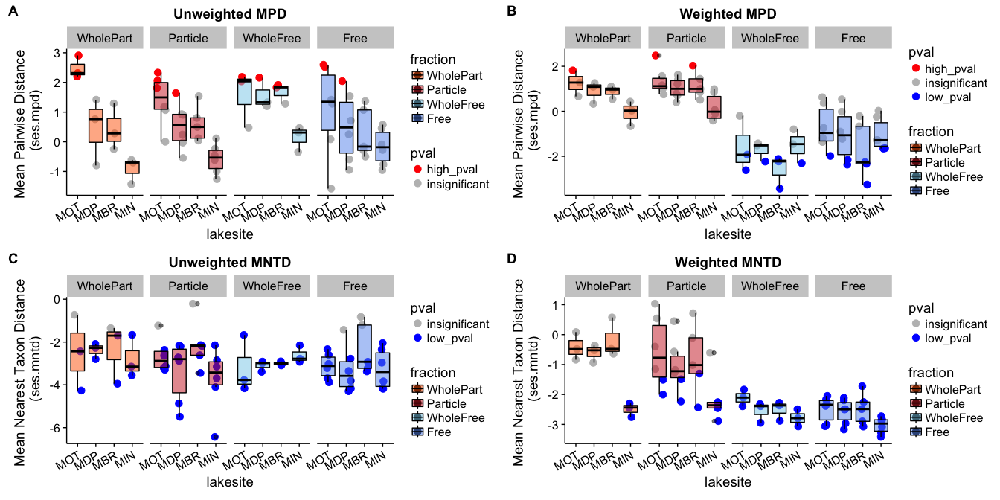
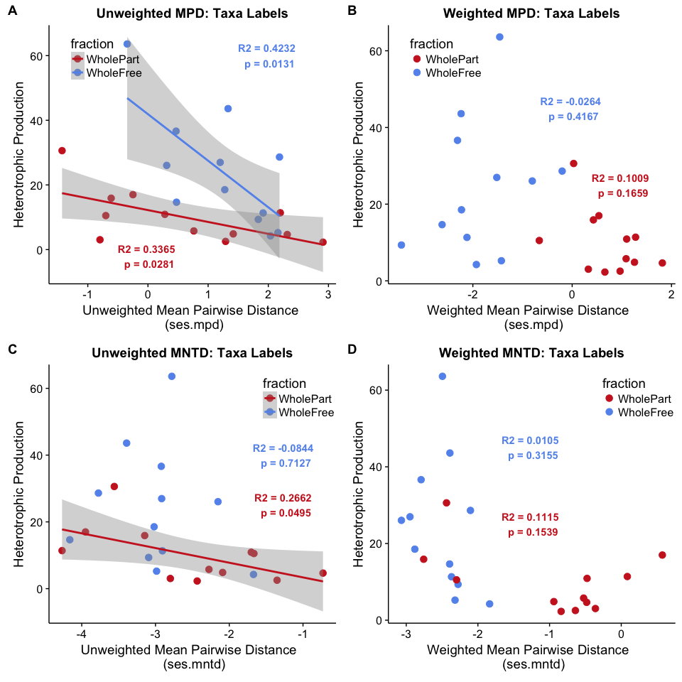
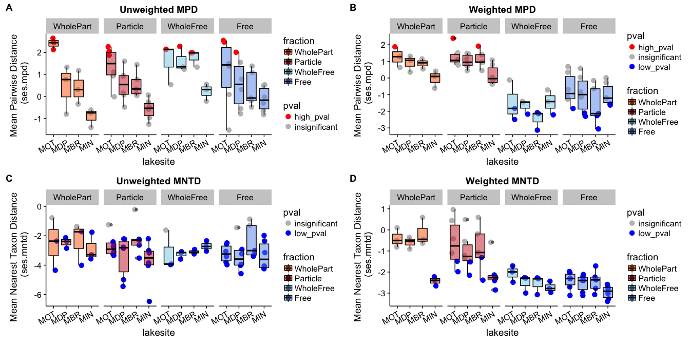
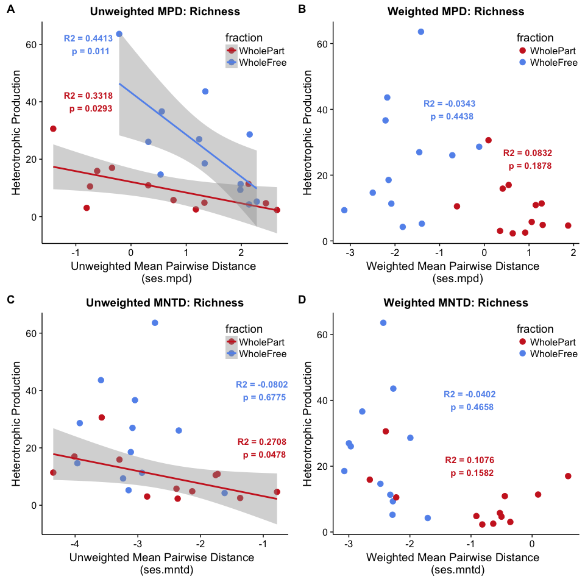
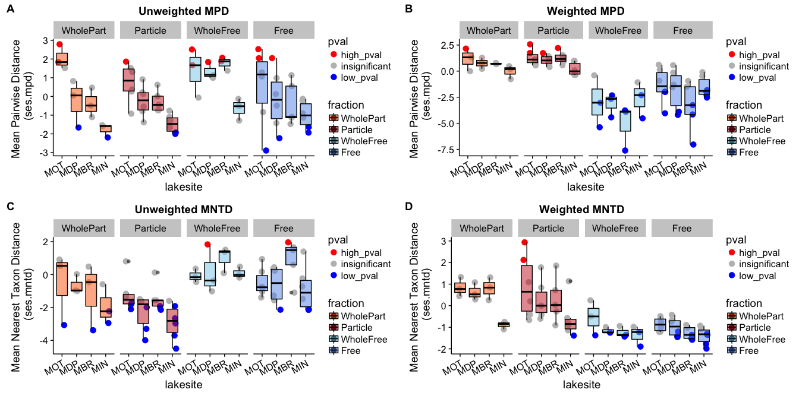
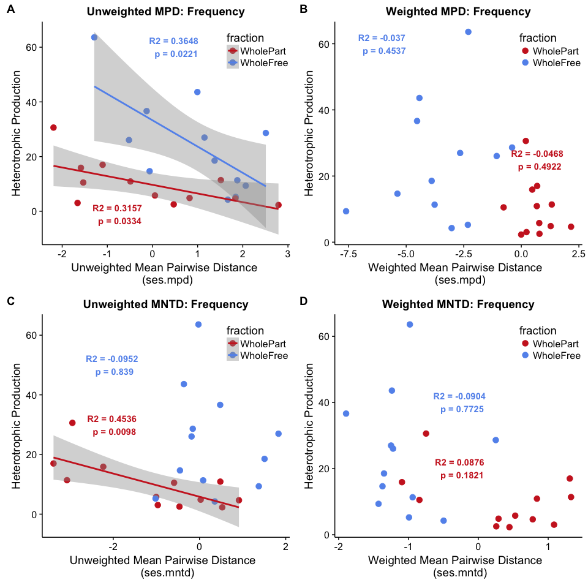
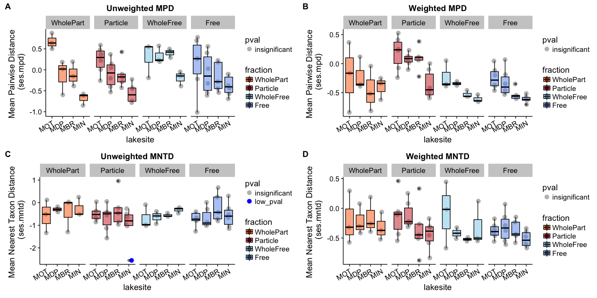
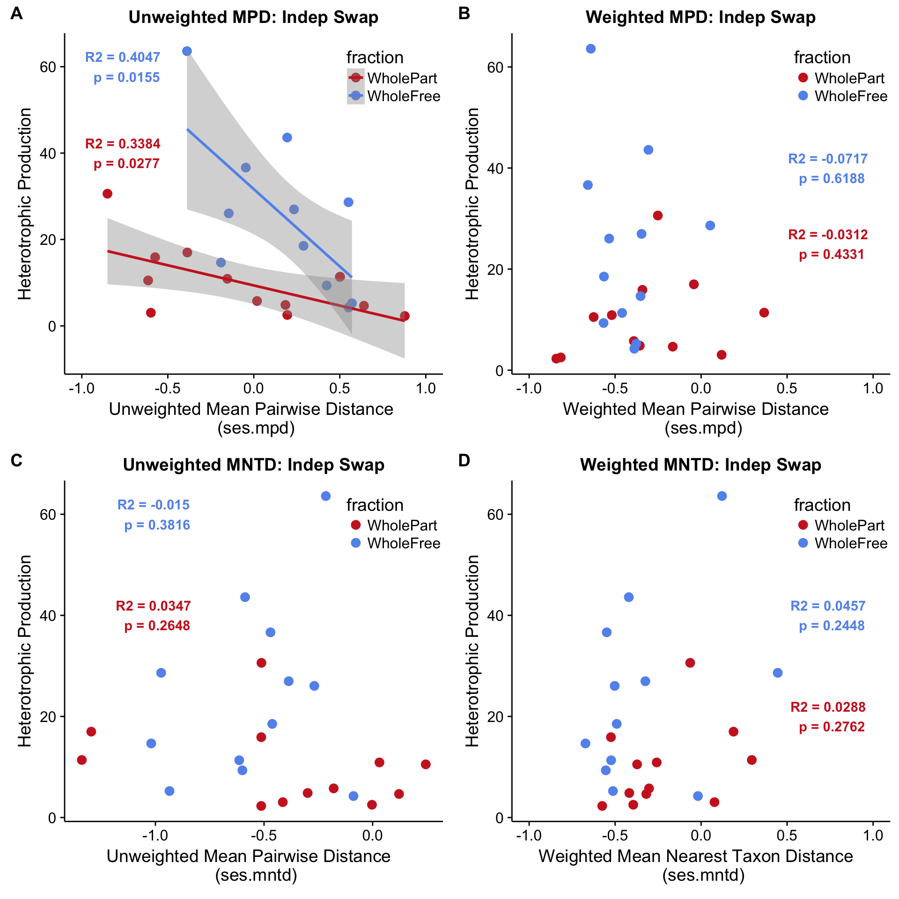

# Pruned Tree Analysis
Marian L. Schmidt  
February 16, 2017  


```
## phyloseq-class experiment-level object
## otu_table()   OTU Table:         [ 754 taxa and 70 samples ]
## sample_data() Sample Data:       [ 70 samples by 69 sample variables ]
## tax_table()   Taxonomy Table:    [ 754 taxa by 8 taxonomic ranks ]
```

```
## phyloseq-class experiment-level object
## otu_table()   OTU Table:         [ 754 taxa and 70 samples ]
## sample_data() Sample Data:       [ 70 samples by 69 sample variables ]
## tax_table()   Taxonomy Table:    [ 754 taxa by 8 taxonomic ranks ]
## phy_tree()    Phylogenetic Tree: [ 754 tips and 752 internal nodes ]
```

It's time to make a tree.  Check out a helpful stack exchange page:
[http://unix.stackexchange.com/questions/253499/extracting-subset-from-fasta-file](http://unix.stackexchange.com/questions/253499/extracting-subset-from-fasta-file)


# Faiths PD



# Taxa.Labels






# Richness




# Frequency





# Independent Swap





