# Diversity-Productivity Relationships in Muskegon Lake
Marian L. Schmidt  
January 2017  


## Load Mothur OTU Data 

```r
# Loads a phyloseq object named otu_merged_musk_pruned)
load("../data/otu_merged_musk_pruned.RData")
# The name of the phyloseq object is: 
otu_merged_musk_pruned 
```

```
## phyloseq-class experiment-level object
## otu_table()   OTU Table:         [ 52980 taxa and 163 samples ]
## sample_data() Sample Data:       [ 163 samples by 69 sample variables ]
## tax_table()   Taxonomy Table:    [ 52980 taxa by 8 taxonomic ranks ]
```


# How do the *summed* sample sequencing read counts vary before modification?

```r
# Check the sequencing depth of each sample 
sums_otu <- data.frame(rowSums(otu_table(otu_merged_musk_pruned)))
colnames(sums_otu) <- "Sample_TotalSeqs"
sums_otu$names <- row.names(sums_otu)
sums_otu <- arrange(sums_otu, Sample_TotalSeqs) 
sums_otu <- make_metadata_norep(sums_otu)

##  PLOT BASED ON 
plot_sample_sums(dataframe = sums_otu, x_total_seqs = "Sample_TotalSeqs", fill_variable = "project")
```


```r
## YEAR
plot_sample_sums(dataframe = sums_otu, x_total_seqs = "Sample_TotalSeqs", fill_variable = "year")
```


```r
## FRACTION
plot_sample_sums(dataframe = sums_otu, x_total_seqs = "Sample_TotalSeqs", fill_variable = "fraction")
```


```r
####  Create a plot of the number of sequences per sample
total_sums <- ggplot(sums_otu, aes(x=reorder(names, Sample_TotalSeqs), y = Sample_TotalSeqs)) + 
  ylab("# of Seqs per Sample") +
  geom_bar(stat = "identity", colour="black",fill="cornflowerblue")  + xlab("Sample Name") + 
  ggtitle("All Samples: Sequencing Depth") + 
  theme(axis.text.x = element_blank())  

sums_lessthan10000 <- ggplot(filter(sums_otu, Sample_TotalSeqs < 10000),
                                    aes(x=reorder(names, Sample_TotalSeqs), y = Sample_TotalSeqs)) + 
  ylab("# of Seqs per Sample") +
  geom_bar(stat = "identity", colour="black",fill="cornflowerblue")  + xlab("Sample Name") + 
  ggtitle("Samples with less \n than 10,000 reads") + 
  theme(axis.text.x = element_blank())  

# DRAW THE TWO PLOTS 
ggdraw() +
  draw_plot(total_sums, 0, 0, 0.7, 1) +
  draw_plot(sums_lessthan10000, 0.7, 0, 0.3, 1) + # 1st = where to start drawing, 3rd = width, 4th = height
  draw_plot_label(c("A", "B"), 
                  c(0, 0.7), # Where along the x-axis would you like the labels?
                  c(1, 1),  # Put the label at the top of the plotting space (y-axis)
                  size = 15) # Size of label
```


```r
## Add total sequences to metadata frame 
metdf <- sample_data(otu_merged_musk_pruned)
sums_otu$norep_filter_name <- sums_otu$names
sums_otu2 <- select(sums_otu, norep_filter_name, Sample_TotalSeqs)
metdf_num2 <- left_join(metdf, sums_otu2, by = "norep_filter_name")
row.names(metdf_num2) <- metdf_num2$norep_filter_name
# Rename the sample data 
sample_data(otu_merged_musk_pruned) <- metdf_num2
```


# How do the *scaled* (for beta diversity) sample sequencing read counts vary?

```r
## ALL SAMPLES 
otu_merged_musk_pruned_noMOTHJ715 <- subset_samples(otu_merged_musk_pruned, norep_filter_name !="MOTHJ715")
min(sample_sums(otu_merged_musk_pruned_noMOTHJ715)) # Scaling value 
```

```
## [1] 1562
```

```r
scale_otu_merged_musk_pruned <- scale_reads(otu_merged_musk_pruned_noMOTHJ715, round = "matround")
scale_otu_merged_musk_pruned # ALL Samples phyloseq object
```

```
## phyloseq-class experiment-level object
## otu_table()   OTU Table:         [ 4664 taxa and 162 samples ]
## sample_data() Sample Data:       [ 162 samples by 70 sample variables ]
## tax_table()   Taxonomy Table:    [ 4664 taxa by 8 taxonomic ranks ]
```

```r
### Water Samples 
otu_merged_musk_pruned_nosed <- subset_samples(otu_merged_musk_pruned, 
                                               norep_filter_name !="MOTHJ715" & fraction != "Sediment")
min(sample_sums(otu_merged_musk_pruned_nosed)) # Scaling value 
```

```
## [1] 1562
```

```r
scale_otu_merged_musk_nosed <- scale_reads(otu_merged_musk_pruned_nosed, round = "matround")
scale_otu_merged_musk_nosed # Water samples only
```

```
## phyloseq-class experiment-level object
## otu_table()   OTU Table:         [ 2914 taxa and 139 samples ]
## sample_data() Sample Data:       [ 139 samples by 70 sample variables ]
## tax_table()   Taxonomy Table:    [ 2914 taxa by 8 taxonomic ranks ]
```

```r
### Particle Samples 
otu_merged_musk_pruned_particle <- subset_samples(otu_merged_musk_pruned, 
                                               norep_filter_name !="MOTHJ715" & 
                                                 fraction %in% c("WholePart", "Particle"))
min(sample_sums(otu_merged_musk_pruned_particle)) # Scaling value 
```

```
## [1] 1562
```

```r
scale_otu_merged_musk_particle <- scale_reads(otu_merged_musk_pruned_particle, round = "matround")
scale_otu_merged_musk_particle # Particle and Whole particle samples only (both surface and bottom) 
```

```
## phyloseq-class experiment-level object
## otu_table()   OTU Table:         [ 2716 taxa and 69 samples ]
## sample_data() Sample Data:       [ 69 samples by 70 sample variables ]
## tax_table()   Taxonomy Table:    [ 2716 taxa by 8 taxonomic ranks ]
```

```r
# To only do analysis on wholeparticle samples 
otu_merged_musk_pruned_wholepart_top <- subset_samples(otu_merged_musk_pruned, 
                                               norep_filter_name !="MOTHJ715" & 
                                                 fraction == "WholePart" &
                                                 limnion == "Top")
min(sample_sums(otu_merged_musk_pruned_wholepart_top)) # Scaling value 
```

```
## [1] 6665
```

```r
scale_otu_merged_musk_wholepart_top <- scale_reads(otu_merged_musk_pruned_wholepart_top, round = "matround")
scale_otu_merged_musk_wholepart_top # Wholeparticle samples only (no prefilter; from the surface only)
```

```
## phyloseq-class experiment-level object
## otu_table()   OTU Table:         [ 4265 taxa and 12 samples ]
## sample_data() Sample Data:       [ 12 samples by 70 sample variables ]
## tax_table()   Taxonomy Table:    [ 4265 taxa by 8 taxonomic ranks ]
```

```r
### Free-Living Samples 
otu_merged_musk_pruned_free <- subset_samples(otu_merged_musk_pruned, 
                                               norep_filter_name !="MOTHJ715" & 
                                                fraction %in% c("WholeFree", "Free"))
min(sample_sums(otu_merged_musk_pruned_free)) # Scaling value 
```

```
## [1] 7887
```

```r
scale_otu_merged_musk_free <- scale_reads(otu_merged_musk_pruned_free, round = "matround")
scale_otu_merged_musk_free # All Free living samples (Free and wholeFree; both surface and bottom)
```

```
## phyloseq-class experiment-level object
## otu_table()   OTU Table:         [ 7020 taxa and 70 samples ]
## sample_data() Sample Data:       [ 70 samples by 70 sample variables ]
## tax_table()   Taxonomy Table:    [ 7020 taxa by 8 taxonomic ranks ]
```

```r
# To only do analysis on WholeFree samples 
otu_merged_musk_pruned_wholefree_top <- subset_samples(otu_merged_musk_pruned, 
                                               norep_filter_name !="MOTHJ715" & 
                                                 fraction == "WholeFree" &
                                                 limnion == "Top")
min(sample_sums(otu_merged_musk_pruned_wholefree_top)) # Scaling value 
```

```
## [1] 12162
```

```r
scale_otu_merged_musk_wholefree_top <- scale_reads(otu_merged_musk_pruned_wholefree_top, round = "matround")
scale_otu_merged_musk_wholefree_top # Only WholeFree samples (from the surface)
```

```
## phyloseq-class experiment-level object
## otu_table()   OTU Table:         [ 4167 taxa and 12 samples ]
## sample_data() Sample Data:       [ 12 samples by 70 sample variables ]
## tax_table()   Taxonomy Table:    [ 4167 taxa by 8 taxonomic ranks ]
```

```r
# Check the sequencing depth of each sample 
scaled_sums_otu <- data.frame(rowSums(otu_table(scale_otu_merged_musk_pruned)))
colnames(scaled_sums_otu) <- "Sample_TotalSeqs"
scaled_sums_otu$names <- row.names(scaled_sums_otu)
scaled_sums_otu <- arrange(scaled_sums_otu, Sample_TotalSeqs) %>%
  make_metadata_norep()

##  Plot based on all samples 
plot_sample_sums(dataframe = scaled_sums_otu, x_total_seqs = "Sample_TotalSeqs", fill_variable = "project")
```


```r
##  Plot based on depth of samples 
plot_sample_sums(dataframe = scaled_sums_otu, x_total_seqs = "Sample_TotalSeqs", fill_variable = "limnion")
```


  


#  How linked are the diversities of the fractions?
## Free Living Sample Diversity Comparison  

```r
# Plot diversity based only on fraction 
ggplot(filter(fraction_divs, fraction %in% c("Free","WholeFree")),
       aes(x = fraction, y = div_value)) + 
  geom_jitter(aes(color = fraction), size = 3, width = 0.2) + 
  geom_boxplot(aes(fill = fraction), alpha =0.5) +
  scale_color_manual(values = fraction_colors) + 
  scale_fill_manual(values = fraction_colors) + 
  facet_wrap(~div_metric, scales = "free_y") +
  theme(axis.text.x = element_text(angle = 30, hjust = 1, vjust = 1),
        legend.position = c(0.07, 0.93), 
        strip.background = element_rect(fill = NA), 
        strip.text.x = element_text(face = "bold"))
```


```r
# Plot diversity based on lakesite lumped together
ggplot(filter(fraction_divs, fraction %in% c("Free","WholeFree")),
       aes(x = lakesite, y = div_value)) + 
  geom_jitter(aes(color = lakesite), size = 3, width = 0.2) + 
  geom_boxplot(aes(fill = lakesite), alpha =0.5) +
  scale_color_manual(values = lakesite_colors) + 
  scale_fill_manual(values = lakesite_colors) + 
  facet_wrap(~div_metric, scales = "free_y") +
  theme(axis.text.x = element_text(angle = 30, hjust = 1, vjust = 1),
        legend.position = c(0.07, 0.93), 
        strip.background = element_rect(fill = NA), 
        strip.text.x = element_text(face = "bold"))
```


```r
# Value of Diversity estimate on y-axis and site vs fraction on x-axis
ggplot(filter(fraction_divs, fraction %in% c("Free","WholeFree")),
       aes(x = lakesite, y = div_value)) + 
  geom_jitter(aes(color = fraction), size = 3, position = position_dodge(width = 0.8)) + 
  geom_boxplot(aes(fill = fraction), alpha =0.5) +
  scale_color_manual(values = fraction_colors) + 
  scale_fill_manual(values = fraction_colors) + 
  facet_wrap(~div_metric, scales = "free_y") +
  theme(axis.text.x = element_text(angle = 30, hjust = 1, vjust = 1),
        legend.position = c(0.07, 0.93), 
        strip.background = element_rect(fill = NA), 
        strip.text.x = element_text(face = "bold"))
```


```r
###  ARE THERE DIFFERENCES BETWEEN FRACTION AND LAKESITE WITHIN THE FREE LIVING?
free_fraction_divs <- filter(fraction_divs, fraction %in% c("Free","WholeFree"))
#### Significant difference between D0 lakesite and fraction?
summary(aov(div_value ~ fraction*lakesite,  
            data = filter(free_fraction_divs, div_metric == "D0")))
```

```
##                   Df  Sum Sq Mean Sq F value Pr(>F)  
## fraction           1 1885943 1885943   6.589 0.0161 *
## lakesite           3 3750693 1250231   4.368 0.0124 *
## fraction:lakesite  3  457013  152338   0.532 0.6640  
## Residuals         27 7727555  286206                 
## ---
## Signif. codes:  0 '***' 0.001 '**' 0.01 '*' 0.05 '.' 0.1 ' ' 1
```

```r
#### Significant difference between D0_chao lakesite and fraction?
summary(aov(div_value ~ fraction*lakesite,  
            data = filter(free_fraction_divs, div_metric == "D0_chao")))
```

```
##                   Df   Sum Sq Mean Sq F value  Pr(>F)   
## fraction           1  4269492 4269492   5.539 0.02614 * 
## lakesite           3 15509357 5169786   6.706 0.00158 **
## fraction:lakesite  3   988254  329418   0.427 0.73502   
## Residuals         27 20813320  770864                   
## ---
## Signif. codes:  0 '***' 0.001 '**' 0.01 '*' 0.05 '.' 0.1 ' ' 1
```

```r
#### Significant difference between D1 lakesite and fraction?
summary(aov(div_value ~ fraction*lakesite,  
            data = filter(free_fraction_divs, div_metric == "D1")))
```

```
##                   Df Sum Sq Mean Sq F value   Pr(>F)    
## fraction           1   1509  1509.3   3.788 0.062109 .  
## lakesite           3   8839  2946.2   7.394 0.000908 ***
## fraction:lakesite  3     46    15.4   0.039 0.989607    
## Residuals         27  10759   398.5                     
## ---
## Signif. codes:  0 '***' 0.001 '**' 0.01 '*' 0.05 '.' 0.1 ' ' 1
```

```r
#### Significant difference between D2 lakesite and fraction?
summary(aov(div_value ~ fraction*lakesite,  
            data = filter(free_fraction_divs, div_metric == "D2")))
```

```
##                   Df Sum Sq Mean Sq F value  Pr(>F)   
## fraction           1  149.1  149.14   2.873 0.10161   
## lakesite           3  732.1  244.04   4.700 0.00912 **
## fraction:lakesite  3   31.1   10.36   0.199 0.89584   
## Residuals         27 1401.9   51.92                   
## ---
## Signif. codes:  0 '***' 0.001 '**' 0.01 '*' 0.05 '.' 0.1 ' ' 1
```

```r
# Prepare data frames for plotting diversity of wholefree vs free 
free_samps_alpha <- filter(free_meta_data, fraction == "Free" & year == "2015") %>% 
  dplyr::select(norep_filter_name, fraction, D0, D0_chao, D1, D2, simps_even) %>%
  # Make a new column called "div_metric" that includes the hill diversity metric
  gather("div_metric", "value", D0, D0_chao, D1, D2, simps_even) %>%
  # Combine the diversity metric and fraction into one column called frac_div_metric
  unite("frac_div_metric", fraction, div_metric, sep = "_") %>%
  # Spread frac_div_metric into 4 columns for each hill div metric
  spread(frac_div_metric, value) %>%
  mutate(norep_water_name = paste(substr(norep_filter_name,1,4), substr(norep_filter_name, 6, 8), sep = "")) %>%
  dplyr::select(-norep_filter_name)

# Prepare data frames for plotting diversity of wholefree vs free 
wholefree_samps_alpha <- filter(free_meta_data, fraction == "WholeFree" & year == "2015") %>% 
  dplyr::select(norep_filter_name, fraction, D0, D0_chao, D1, D2, simps_even) %>%
  # Make a new column called "div_metric" that includes the hill diversity metric
  gather(div_metric, value, D0, D1, D2, D0_chao, simps_even) %>%
  # Combine the diversity metric and fraction into one column called frac_div_metric
  unite(frac_div_metric, fraction, div_metric, sep = "_") %>%
  # Spread frac_div_metric into 4 columns for each hill div metric
  spread(frac_div_metric, value) %>%
  mutate(norep_water_name = paste(substr(norep_filter_name,1,4), substr(norep_filter_name, 6, 8), sep = "")) %>%
  dplyr::select(-norep_filter_name)

# join the data frames together 
FL_alpha <- left_join(free_samps_alpha, wholefree_samps_alpha, by = "norep_water_name")


# Is there a linear relationship between free and whole free D0 diversity?
lm_FL_D0 <- lm(Free_D0 ~ WholeFree_D0, data = FL_alpha)
# Plot linear relationship between free and whole free D0 diversity
free_fraction_D0 <- ggplot(FL_alpha, aes(x = WholeFree_D0, y = Free_D0)) + 
  geom_point(size = 3) + geom_smooth(method = "lm") +
  xlim(300, 2000) + ylim(300, 2000) + 
  geom_abline(slope = 1, intercept = 0) +
  annotate("text", x = 1000, y=500, color = "black", fontface = "bold",
           label = paste("R2 =", round(summary(lm_FL_D0)$adj.r.squared, digits = 4), "\n", 
                         "p =", round(unname(summary(lm_FL_D0)$coefficients[,4][2]), digits = 8)))


# Is there a linear relationship between free and whole free D0_chao diversity?
lm_FL_simps_D0_chao <- lm(Free_D0_chao ~ WholeFree_D0_chao, data = FL_alpha)
# Plot linear relationship between free and whole free D0 diversity
free_fraction_D0_chao <- ggplot(FL_alpha, aes(x = WholeFree_D0_chao, y = Free_D0_chao)) + 
  geom_point(size = 3) + geom_smooth(method = "lm") +
  xlim(300, 3600) + ylim(300, 3600) +
  geom_abline(slope = 1, intercept = 0) +
  annotate("text", x = 3000, y=500, color = "black", fontface = "bold",
           label = paste("R2 =", round(summary(lm_FL_simps_D0_chao)$adj.r.squared, digits = 4), "\n", 
                         "p =", round(unname(summary(lm_FL_simps_D0_chao)$coefficients[,4][2]), digits = 5)))


# Is there a linear relationship between free and whole free D1 diversity?
lm_FL_D1 <- lm(Free_D1 ~ WholeFree_D1, data = FL_alpha)
# Plot linear relationship between free and whole free D1 diversity
free_fraction_D1 <- ggplot(FL_alpha, aes(x = WholeFree_D1, y = Free_D1)) + 
  geom_point(size = 3) + geom_smooth(method = "lm") +
  xlim(0, 175) + ylim(0,175) + 
  geom_abline(slope = 1, intercept = 0) +
  annotate("text", x = 100, y=25, color = "black", fontface = "bold",
           label = paste("R2 =", round(summary(lm_FL_D1)$adj.r.squared, digits = 4), "\n", 
                         "p =", round(unname(summary(lm_FL_D1)$coefficients[,4][2]), digits = 12)))

# Is there a linear relationship between free and whole free D2 diversity?
lm_FL_D2 <- lm(Free_D2 ~ WholeFree_D2, data = FL_alpha)
# Plot linear relationship between free and whole free D2 diversity
free_fraction_D2 <- ggplot(FL_alpha, aes(x = WholeFree_D2, y = Free_D2)) + 
  geom_point(size = 3) + geom_smooth(method = "lm") +
  xlim(10, 55) + ylim(10, 55) +
  geom_abline(slope = 1, intercept = 0) +
  annotate("text", x = 35, y=17, color = "black", fontface = "bold",
           label = paste("R2 =", round(summary(lm_FL_D2)$adj.r.squared, digits = 4), "\n", 
                         "p =", round(unname(summary(lm_FL_D2)$coefficients[,4][2]), digits = 8)))
  
free_vs_freepart_div_plots <- plot_grid(free_fraction_D0, free_fraction_D0_chao, free_fraction_D1, free_fraction_D2, 
          labels = c("A", "B", "C", "D"), ncol = 2, nrow = 2)

free_vs_freepart_div_plots
```


```r
#ggsave("../Figures/free_vs_wholefree_div_plots.png", plot = free_vs_freepart_div_plots, dpi = 600, width = 10, height = 8)
```

##  Particle-Associated Diversity Comparison 

```r
# Plot diversity based only on fraction 
ggplot(filter(fraction_divs, fraction %in% c("Particle","WholePart")),
       aes(x = fraction, y = div_value)) + 
  geom_jitter(aes(color = fraction), size = 3, width = 0.2) + 
  geom_boxplot(aes(fill = fraction), alpha =0.5) +
  scale_color_manual(values = fraction_colors) + 
  scale_fill_manual(values = fraction_colors) + 
  facet_wrap(~div_metric, scales = "free_y") +
  theme(axis.text.x = element_text(angle = 30, hjust = 1, vjust = 1),
        legend.position = c(0.07, 0.93), 
        strip.background = element_rect(fill = NA), 
        strip.text.x = element_text(face = "bold"))
```


```r
# Plot based on lakesite lumped together
ggplot(filter(fraction_divs, fraction %in% c("Particle","WholePart")),
       aes(x = lakesite, y = div_value)) + 
  geom_jitter(aes(color = lakesite), size = 3, width = 0.2) + 
  geom_boxplot(aes(fill = lakesite), alpha =0.5) +
  scale_color_manual(values = lakesite_colors) + 
  scale_fill_manual(values = lakesite_colors) + 
  facet_wrap(~div_metric, scales = "free_y") +
  theme(axis.text.x = element_text(angle = 30, hjust = 1, vjust = 1),
        legend.position = c(0.07, 0.93), 
        strip.background = element_rect(fill = NA), 
        strip.text.x = element_text(face = "bold"))
```


```r
# Value of Diversity estimate on y-axis and site vs fraction on x-axis
ggplot(filter(fraction_divs, fraction %in% c("Particle","WholePart")),
       aes(x = lakesite, y = div_value)) + 
  geom_jitter(aes(color = fraction), size = 3, position = position_dodge(width = 0.8)) + 
  geom_boxplot(aes(fill = fraction), alpha =0.5) +
  scale_color_manual(values = fraction_colors) + 
  scale_fill_manual(values = fraction_colors) + 
  facet_wrap(~div_metric, scales = "free_y") +
  theme(axis.text.x = element_text(angle = 30, hjust = 1, vjust = 1),
        legend.position = c(0.07, 0.93), 
        strip.background = element_rect(fill = NA), 
        strip.text.x = element_text(face = "bold"))
```


```r
###  ARE THERE DIFFERENCES BETWEEN FRACTION AND LAKESITE WITHIN PARTICLE ASSOCIATION?
part_fraction_divs <- filter(fraction_divs, fraction %in% c("Particle","WholePart"))

#### Significant difference between D0 lakesite and fraction?
summary(aov(div_value ~ fraction*lakesite,  
            data = filter(part_fraction_divs, div_metric == "D0")))
```

```
##                   Df  Sum Sq Mean Sq F value Pr(>F)  
## fraction           1  685338  685338   4.503 0.0432 *
## lakesite           3  822904  274301   1.802 0.1705  
## fraction:lakesite  3  162963   54321   0.357 0.7845  
## Residuals         27 4109019  152186                 
## ---
## Signif. codes:  0 '***' 0.001 '**' 0.01 '*' 0.05 '.' 0.1 ' ' 1
```

```r
#### Significant difference between D0_chao lakesite and fraction?
summary(aov(div_value ~ fraction*lakesite,  
            data = filter(part_fraction_divs, div_metric == "D0_chao")))
```

```
##                   Df   Sum Sq Mean Sq F value Pr(>F)  
## fraction           1   902548  902548   1.998 0.1690  
## lakesite           3  4767452 1589151   3.517 0.0284 *
## fraction:lakesite  3   544907  181636   0.402 0.7527  
## Residuals         27 12199221  451823                 
## ---
## Signif. codes:  0 '***' 0.001 '**' 0.01 '*' 0.05 '.' 0.1 ' ' 1
```

```r
#### Significant difference between D1 lakesite and fraction?
summary(aov(div_value ~ fraction*lakesite,  
            data = filter(part_fraction_divs, div_metric == "D1")))
```

```
##                   Df Sum Sq Mean Sq F value Pr(>F)  
## fraction           1    526     526   0.203 0.6560  
## lakesite           3  35396   11799   4.553 0.0105 *
## fraction:lakesite  3   6886    2295   0.886 0.4609  
## Residuals         27  69966    2591                 
## ---
## Signif. codes:  0 '***' 0.001 '**' 0.01 '*' 0.05 '.' 0.1 ' ' 1
```

```r
#### Significant difference between D2 lakesite and fraction?
summary(aov(div_value ~ fraction*lakesite,  
            data = filter(part_fraction_divs, div_metric == "D2")))
```

```
##                   Df Sum Sq Mean Sq F value  Pr(>F)   
## fraction           1    138   138.2   0.627 0.43536   
## lakesite           3   4498  1499.3   6.802 0.00146 **
## fraction:lakesite  3    572   190.7   0.865 0.47111   
## Residuals         27   5951   220.4                   
## ---
## Signif. codes:  0 '***' 0.001 '**' 0.01 '*' 0.05 '.' 0.1 ' ' 1
```

```r
# Prepare data frames for plotting diversity of wholepart vs particle 
part_samps_alpha <- filter(part_meta_data, fraction == "Particle" & year == "2015") %>% # & norep_filter_name != "MBRHJ515"
  select(norep_filter_name, fraction, D0, D0_chao, D1, D2, simps_even) %>%
  gather("div_metric", "value", D0, D0_chao, D1, D2, simps_even) %>%
  unite("frac_div_metric", fraction, div_metric, sep = "_") %>%
  spread(frac_div_metric, value) %>%
  mutate(norep_water_name = paste(substr(norep_filter_name,1,4), substr(norep_filter_name, 6, 8), sep = "")) %>%
  select(-norep_filter_name)

# Prepare data frames for plotting diversity of wholepart vs particle 
wholepart_samps_alpha <- filter(part_meta_data, fraction == "WholePart" & year == "2015") %>% # & norep_filter_name != "MBRHJ515"
  select(norep_filter_name, fraction, D0, D0_chao, D1, D2, simps_even) %>%
  gather(div_metric, value, D0, D0_chao, D1, D2, simps_even) %>%
  unite(frac_div_metric, fraction, div_metric, sep = "_") %>%
  spread(frac_div_metric, value) %>%
  mutate(norep_water_name = paste(substr(norep_filter_name,1,4), substr(norep_filter_name, 6, 8), sep = "")) %>%
  select(-norep_filter_name)

# Combine the data frames into one
PA_alpha <- left_join(part_samps_alpha, wholepart_samps_alpha, by = "norep_water_name")

# Is there a linear relationship between particle and WholePart D0 diversity?
lm_PA_D0 <- lm(Particle_D0 ~ WholePart_D0, data = PA_alpha)
# Plot the linear relationship between particle and WholePart D0 diversity
PA_fraction_D0 <- ggplot(PA_alpha, aes(x = WholePart_D0, y = Particle_D0)) + 
  geom_point(size = 3) + geom_smooth(method = "lm", se = FALSE) +
  xlim(0, 2200) + ylim(0, 2200) + 
  geom_abline(slope = 1, intercept = 0) +
  annotate("text", x = 1500, y=300, color = "black", fontface = "bold",
           label = paste("R2 =", round(summary(lm_PA_D0)$adj.r.squared, digits = 4), "\n", 
                         "p =", round(unname(summary(lm_PA_D0)$coefficients[,4][2]), digits = 4)))


# Is there a linear relationship between particle and WholePart D0_chao diversity?
lm_PA_D0_chao <- lm(Particle_D0_chao ~ WholePart_D0_chao, data = PA_alpha)
# Plot the linear relationship between particle and WholePart D0_chao diversity
PA_fraction_D0_chao <- ggplot(PA_alpha, aes(x = WholePart_D0_chao, y = Particle_D0_chao)) + 
  geom_point(size = 3) + geom_smooth(method = "lm", se = FALSE) +
  xlim(0, 2200) + ylim(0, 2200) + 
  geom_abline(slope = 1, intercept = 0) +
  annotate("text", x = 1500, y=300, color = "black", fontface = "bold",
           label = paste("R2 =", round(summary(lm_PA_D0_chao)$adj.r.squared, digits = 4), "\n", 
                         "p =", round(unname(summary(lm_PA_D0_chao)$coefficients[,4][2]), digits = 4)))


# Is there a linear relationship between particle and WholePart D1 diversity?
lm_PA_D1 <- lm(Particle_D1 ~ WholePart_D1, data = PA_alpha)
# Plot the linear relationship between particle and WholePart D1 diversity
PA_fraction_D1 <- ggplot(PA_alpha, aes(x = WholePart_D1, y = Particle_D1)) + 
  geom_point(size = 3) + geom_smooth(method = "lm") + 
  xlim(0, 620) + ylim(0,620) + 
  geom_abline(slope = 1, intercept = 0) +
  annotate("text", x = 150, y=500, color = "black", fontface = "bold",
           label = paste("R2 =", round(summary(lm_PA_D1)$adj.r.squared, digits = 4), "\n", 
                         "p =", round(unname(summary(lm_PA_D1)$coefficients[,4][2]), digits = 5)))

# Is there a linear relationship between particle and WholePart D2 diversity?
lm_PA_D2 <- lm(Particle_D2 ~ WholePart_D2, data = PA_alpha)
# Plot the linear relationship between particle and WholePart D2 diversity
PA_fraction_D2 <- ggplot(PA_alpha, aes(x = WholePart_D2, y = Particle_D2)) + 
  geom_point(size = 3) + geom_smooth(method = "lm") +
  xlim(10, 250) + ylim(10, 250) +
  geom_abline(slope = 1, intercept = 0) +
  annotate("text", x = 50, y=175, color = "black", fontface = "bold",
           label = paste("R2 =", round(summary(lm_PA_D2)$adj.r.squared, digits = 4), "\n", 
                         "p =", round(unname(summary(lm_PA_D2)$coefficients[,4][2]), digits = 5)))

lm_PA_simps_even <- lm(Particle_simps_even ~ WholePart_simps_even, data = PA_alpha)

PA_fraction_simps_even <- ggplot(PA_alpha, aes(x = WholePart_simps_even, y = Particle_simps_even)) + 
  geom_point(size = 3) + geom_smooth(method = "lm", se = FALSE) +
  xlim(0.01, 0.2) + ylim(0.01, 0.2) +
  geom_abline(slope = 1, intercept = 0) +
  annotate("text", x = 0.06, y=0.12, color = "black", fontface = "bold",
           label = paste("R2 =", round(summary(lm_PA_simps_even)$adj.r.squared, digits = 4), "\n", 
                         "p =", round(unname(summary(lm_PA_simps_even)$coefficients[,4][2]), digits = 5)))
  
part_vs_wholepart_div_plots <- plot_grid(PA_fraction_D0, PA_fraction_D0_chao, PA_fraction_D1, PA_fraction_D2, 
          labels = c("A", "B", "C", "D"), ncol = 2, nrow = 2)

part_vs_wholepart_div_plots
```


```r
#ggsave("../Figures/part_vs_wholepart_div_plots.png", plot = part_vs_wholepart_div_plots, dpi = 600, width = 10, height = 8)
```


# Is there a significant relationship between sequencing depth and diversity?

```r
## Is there a significant relationship between sequencing depth and D0?
summary(lm(D0 ~ Sample_TotalSeqs,data = filter(nosed_meta_data, fraction == "Free"))) # p = 0.002 but R2 = -0.09 
```

```
## 
## Call:
## lm(formula = D0 ~ Sample_TotalSeqs, data = filter(nosed_meta_data, 
##     fraction == "Free"))
## 
## Residuals:
##     Min      1Q  Median      3Q     Max 
## -754.32 -317.87 -152.03   22.01 1951.09 
## 
## Coefficients:
##                   Estimate Std. Error t value Pr(>|t|)   
## (Intercept)      1.343e+02  2.769e+02   0.485  0.63269   
## Sample_TotalSeqs 2.000e-02  5.366e-03   3.727  0.00125 **
## ---
## Signif. codes:  0 '***' 0.001 '**' 0.01 '*' 0.05 '.' 0.1 ' ' 1
## 
## Residual standard error: 573 on 21 degrees of freedom
## Multiple R-squared:  0.3981,	Adjusted R-squared:  0.3694 
## F-statistic: 13.89 on 1 and 21 DF,  p-value: 0.001246
```

```r
#summary(lm(D0 ~ Sample_TotalSeqs,data = filter(nosed_meta_data, fraction == "WholeFree"))) # NS
summary(lm(D0 ~ Sample_TotalSeqs,data = filter(nosed_meta_data, fraction == "Particle"))) # Significant!
```

```
## 
## Call:
## lm(formula = D0 ~ Sample_TotalSeqs, data = filter(nosed_meta_data, 
##     fraction == "Particle"))
## 
## Residuals:
##     Min      1Q  Median      3Q     Max 
## -565.72 -223.42  -70.56  130.77  751.08 
## 
## Coefficients:
##                   Estimate Std. Error t value Pr(>|t|)   
## (Intercept)      7.047e+02  1.864e+02    3.78   0.0011 **
## Sample_TotalSeqs 1.444e-02  5.577e-03    2.59   0.0171 * 
## ---
## Signif. codes:  0 '***' 0.001 '**' 0.01 '*' 0.05 '.' 0.1 ' ' 1
## 
## Residual standard error: 362.4 on 21 degrees of freedom
## Multiple R-squared:  0.2421,	Adjusted R-squared:  0.206 
## F-statistic: 6.708 on 1 and 21 DF,  p-value: 0.01708
```

```r
#summary(lm(D0 ~ Sample_TotalSeqs,data = filter(nosed_meta_data, fraction == "WholePart"))) # NS

# Plot Sequencing depth vs D0
ggplot(nosed_meta_data, aes(x = Sample_TotalSeqs, y = D0)) + 
  geom_point(size = 3) + 
  facet_grid(.~fraction, scale = "free_x") + 
  geom_smooth(method = "lm", data = filter(nosed_meta_data, fraction %in% c("Free", "Particle"))) + 
  ggtitle("D0: Species Richness") + 
  theme(axis.text.x = element_text(angle = 30, hjust = 1, vjust = 1),
        legend.position = c(0.1, 0.9), 
        strip.background = element_rect(fill = NA), 
        strip.text.x = element_text(face = "bold"))
```


```r
## Is there a significant relationship between sequencing depth and D0_chao?
summary(lm(D0_chao ~ Sample_TotalSeqs,data = filter(nosed_meta_data, fraction == "Free"))) # pval = 0.006, R2 = 0.27  
```

```
## 
## Call:
## lm(formula = D0_chao ~ Sample_TotalSeqs, data = filter(nosed_meta_data, 
##     fraction == "Free"))
## 
## Residuals:
##      Min       1Q   Median       3Q      Max 
## -1404.38  -648.51  -180.91     8.99  3137.59 
## 
## Coefficients:
##                   Estimate Std. Error t value Pr(>|t|)   
## (Intercept)      423.90917  516.43541   0.821  0.42096   
## Sample_TotalSeqs   0.03035    0.01001   3.033  0.00633 **
## ---
## Signif. codes:  0 '***' 0.001 '**' 0.01 '*' 0.05 '.' 0.1 ' ' 1
## 
## Residual standard error: 1069 on 21 degrees of freedom
## Multiple R-squared:  0.3046,	Adjusted R-squared:  0.2715 
## F-statistic: 9.198 on 1 and 21 DF,  p-value: 0.006329
```

```r
#summary(lm(D0_chao ~ Sample_TotalSeqs,data = filter(nosed_meta_data, fraction == "WholeFree"))) # NS
#summary(lm(D0_chao ~ Sample_TotalSeqs,data = filter(nosed_meta_data, fraction == "Particle"))) # NS
#summary(lm(D0_chao ~ Sample_TotalSeqs,data = filter(nosed_meta_data, fraction == "WholePart"))) #  NS

# Plot the relationship between D0_chao and sequencing depth 
ggplot(nosed_meta_data, aes(x = Sample_TotalSeqs, y = D0_chao)) + 
  geom_point(size = 3) + 
  facet_grid(.~fraction, scale = "free_x") + 
  geom_smooth(method = "lm", data = filter(nosed_meta_data, fraction == "Free")) + 
  ggtitle("D0: Chao 1") + 
  theme(axis.text.x = element_text(angle = 30, hjust = 1, vjust = 1),
        legend.position = c(0.1, 0.9), 
        strip.background = element_rect(fill = NA), 
        strip.text.x = element_text(face = "bold"))
```


```r
## Is there a significant relationship between sequencing depth and D1?
#summary(lm(D1 ~ Sample_TotalSeqs,data = filter(nosed_meta_data, fraction == "Free"))) # NS
#summary(lm(D1 ~ Sample_TotalSeqs,data = filter(nosed_meta_data, fraction == "WholeFree"))) # NS 
#summary(lm(D1 ~ Sample_TotalSeqs,data = filter(nosed_meta_data, fraction == "Particle"))) # NS
#summary(lm(D1 ~ Sample_TotalSeqs,data = filter(nosed_meta_data, fraction == "WholePart"))) # NS

# Plot the relationship between D1 and sequencing depth 
ggplot(nosed_meta_data, aes(x = Sample_TotalSeqs, y = D1)) + 
  geom_point(size = 3) + 
  facet_grid(.~fraction, scale = "free_x") + 
  ggtitle("D1: Exponential of Shannon Entropy") + 
  theme(axis.text.x = element_text(angle = 30, hjust = 1, vjust = 1),
        legend.position = c(0.1, 0.9), 
        strip.background = element_rect(fill = NA), 
        strip.text.x = element_text(face = "bold"))
```


```r
## Is there a significant relationship between sequencing depth and D2?
#summary(lm(D2 ~ Sample_TotalSeqs,data = filter(nosed_meta_data, fraction == "Free"))) # NS
#summary(lm(D2 ~ Sample_TotalSeqs,data = filter(nosed_meta_data, fraction == "WholeFree"))) # NS 
#summary(lm(D2 ~ Sample_TotalSeqs,data = filter(nosed_meta_data, fraction == "Particle"))) # NS
#summary(lm(D2 ~ Sample_TotalSeqs,data = filter(nosed_meta_data, fraction == "WholePart"))) # NS

# Plot the relationship between D2 and sequencing depth 
ggplot(nosed_meta_data, aes(x = Sample_TotalSeqs, y = D2)) + 
  geom_point(size = 3) + 
  facet_grid(.~fraction, scale = "free_x") + 
  ggtitle("D2: Inverse Simpson") + 
  theme(axis.text.x = element_text(angle = 30, hjust = 1, vjust = 1),
        legend.position = c(0.1, 0.9), 
        strip.background = element_rect(fill = NA), 
        strip.text.x = element_text(face = "bold"))
```


# Does DNA extraction concentration influcence diversity?

```r
### Prepare the data frame 
DNA_comparison <- nosed_meta_data %>%
  dplyr::select(norep_filter_name, dnaconcrep1, dnaconcrep2, cells_per_uL, lakesite) %>%
  mutate(dnaconcrep1 = as.numeric(dnaconcrep1),
         dnaconcrep2 = as.numeric(dnaconcrep2),
         mean_dna = (dnaconcrep1+dnaconcrep2)/2)

# Calculate the linear models 
lm_dna_conc <- lm(dnaconcrep1 ~ dnaconcrep2,  data = DNA_comparison)
lm_cells_vs_meanDNA <- lm(mean_dna ~ cells_per_uL,  data = DNA_comparison)

# Plot the trends 
plot_grid(ggplot(DNA_comparison, aes(x = dnaconcrep1, y = dnaconcrep2)) + # First plot 
            geom_point(size = 3) + geom_smooth(method = "lm") +
            annotate("text",  x = 17, y = 3,
              color = "black", fontface = "bold",
               label = paste("R2 =", round(summary(lm_dna_conc)$adj.r.squared, digits = 4), "\n", 
                             "p =", round(unname(summary(lm_dna_conc)$coefficients[,4][2]), digits = 8)))+
            ggtitle("DNA Concentration Between Replicates"), 
          ggplot(DNA_comparison, aes(x = mean_dna, y = cells_per_uL)) + # Second plot 
            geom_point(size = 3) + geom_smooth(method = "lm") +
            annotate("text",  x = 12, y = 4800,
              color = "black", fontface = "bold",
               label = paste("R2 =", round(summary(lm_cells_vs_meanDNA)$adj.r.squared, digits = 4), "\n", 
                             "p =", round(unname(summary(lm_cells_vs_meanDNA)$coefficients[,4][2]), digits = 4)))+
            ggtitle("Mean DNA Concentration vs Cell Numbers"),
          labels = c("A", "B"), ncol = 2)
```

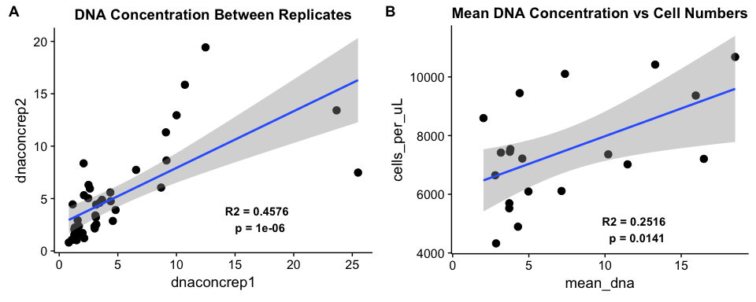


# Is there a relationship between diversity and productivity?

**Note:** The total production data is only for the surface during 2014 and 2015!

## D0 vs Total Production

```r
#### FREE LIVING SAMPLES VS TOTAL BACTERIAL PRODUCTION 
# Is there a significant relationship between FL D0 and total production?
lm_freeonly_totprod_D0 <- lm(tot_bacprod ~ D0, data = free_only)
# Plot the relationship 
plot_totprod_free_D0 <-  ggplot(free_only, aes(y = tot_bacprod, x = D0)) +
  geom_point(aes(color = lakesite), size = 3) +
  scale_color_manual(values = lakesite_colors) +
  geom_smooth(method = "lm", color = "black") + 
  ggtitle("20 um Prefiltered Free-Living Only") + 
  annotate("text",  x = 2250, y = 15, # For D2:  x = 40, y=5, 
           color = "black", fontface = "bold",
           label = paste("R2 =", round(summary(lm_freeonly_totprod_D0)$adj.r.squared, digits = 4), "\n", 
                         "p =", round(unname(summary(lm_freeonly_totprod_D0)$coefficients[,4][2]), digits = 4)))+
  theme(legend.position = c(0.8, 0.2), 
        legend.text = element_text(size = 10))


# Individually for 2014 and 2015, the trend is NS 
# summary(lm(tot_bacprod ~ D0, data = filter(free_only, year == "2014"))) # NS
# summary(lm(tot_bacprod ~ D0, data = filter(free_only, year == "2015"))) # NS

# The trend is close to signifincant!
lm_wholefreeonly_totprod_D0 <- lm(tot_bacprod ~ D0, data = wholefree_only)
# Plot the relationship between wholefree and total production 
plot_totprod_wholefree_D0 <- ggplot(wholefree_only, aes(y = tot_bacprod, x = D0)) +
  geom_point(aes(color = lakesite), size = 3) +
  scale_color_manual(values = lakesite_colors) +
  geom_smooth(method = "lm", color = "black") + 
  ggtitle("WholeFree Only") + 
  annotate("text",  x = 800, y = 2, # For D2:  x = 40, y=5, 
           color = "black", fontface = "bold",
           label = paste("R2 =", round(summary(lm_wholefreeonly_totprod_D0)$adj.r.squared, digits = 4), "\n", 
                         "p =", round(unname(summary(lm_wholefreeonly_totprod_D0)$coefficients[,4][2]), digits = 4)))+
  theme(legend.position = c(0.12, 0.8), 
        legend.text = element_text(size = 10))


## Prefiltered 2015 free only 
free_only_2015_D0 <- filter(free_only, year == "2015")
lm_free2015_only_totprod_D0 <- lm(tot_bacprod ~ D0, data = free_only_2015_D0) 
plot_totprod_freeonly_2015_D0 <- ggplot(free_only_2015_D0, aes(y = tot_bacprod, x = D0)) +
  geom_point(aes(color = lakesite), size = 3) +
  scale_color_manual(values = lakesite_colors) +
  #geom_smooth(method = "lm", color = "black") + 
  ggtitle("2015 Prefiltered Free-Living") + 
  annotate("text", x = 1250, y=20, 
           color = "black", fontface = "bold",
           label = paste("R2 =", round(summary(lm_free2015_only_totprod_D0)$adj.r.squared, digits = 4), "\n", 
                         "p =", round(unname(summary(lm_free2015_only_totprod_D0)$coefficients[,4][2]), digits = 4))) +
  theme(legend.position = c(0.12, 0.8), 
        legend.text = element_text(size = 10))


#### PARTICLE ASSOCIATED SAMPLES VS TOTAL BACTERIAL PRODUCTION 
# Is there a significant relationship?
lm_partonly_totprod_D0 <- lm(tot_bacprod ~ D0, data = part_only)
# Plot the relationship 
plot_totprod_part_D0 <- ggplot(part_only, aes(y = tot_bacprod, x = D0)) +
  geom_point(aes(color = lakesite), size = 3) +
  scale_color_manual(values = lakesite_colors) +
  ggtitle("2014 & 2015 Prefiltered Particle") + 
  annotate("text", x = 1700, y = 75, # For D2:  x = 40, y=5, 
           color = "black", fontface = "bold",
           label = paste("R2 =", round(summary(lm_partonly_totprod_D0)$adj.r.squared, digits = 4), "\n", 
                         "p =", round(unname(summary(lm_partonly_totprod_D0)$coefficients[,4][2]), digits = 4))) +
  theme(legend.position = c(0.8, 0.2), 
        legend.text = element_text(size = 10))

# Trend is NS in 2014 & 2015
#summary(lm(tot_bacprod ~ D0, data = filter(part_only, year == "2014"))) # NS
#summary(lm(tot_bacprod ~ D0, data = filter(part_only, year == "2015"))) # NS

### Different particulate fractions 
## Particle (20-3um) fraction only 
part_only_2015_D0 <- filter(part_only, year == "2015")
lm_part2015_only_totprod_D0 <- lm(tot_bacprod ~ D0, data = part_only_2015_D0) 
plot_totprod_partonly_2015_D0 <- ggplot(part_only_2015_D0, aes(y = tot_bacprod, x = D0)) +
  geom_point(aes(color = lakesite), size = 3) +
  scale_color_manual(values = lakesite_colors) +
  #geom_smooth(method = "lm", color = "black") + 
  ggtitle("2015 Prefiltered Particle") + 
  annotate("text", x = 1800, y=15, 
           color = "black", fontface = "bold",
           label = paste("R2 =", round(summary(lm_part2015_only_totprod_D0)$adj.r.squared, digits = 4), "\n", 
                         "p =", round(unname(summary(lm_part2015_only_totprod_D0)$coefficients[,4][2]), digits = 4))) +
  theme(legend.position = c(0.12, 0.7), 
        legend.text = element_text(size = 10))


# The trend is signifincant!
lm_wholepartonly_totprod_D0 <- lm(tot_bacprod ~ D0, data = wholepart_only)
# Plot the relationship between wholepart and total production 
plot_totprod_wholepart_D0 <- ggplot(wholepart_only, aes(y = tot_bacprod, x = D0)) +
  geom_point(aes(color = lakesite), size = 3) +
  scale_color_manual(values = lakesite_colors) +
  geom_smooth(method = "lm", color = "black") + 
  ggtitle("WholePart Only") + 
  annotate("text",  x = 1400, y = 5, # For D2:  x = 40, y=5, 
           color = "black", fontface = "bold",
           label = paste("R2 =", round(summary(lm_wholepartonly_totprod_D0)$adj.r.squared, digits = 4), "\n", 
                         "p =", round(unname(summary(lm_wholepartonly_totprod_D0)$coefficients[,4][2]), digits = 4)))+
  theme(legend.position = c(0.12, 0.7), 
        legend.text = element_text(size = 10))

### Plot it all together for the pre-filtered fractions 
plot_D0_totprod_prefilt <- plot_grid(plot_totprod_free_D0, plot_totprod_part_D0,
          labels = c("A", "B"), ncol = 2)
plot_D0_totprod_prefilt
```


```r
### Plot it all together for both of the free living fractions fractions 
plot_D0_totprod_FL_comparison <- plot_grid(plot_totprod_freeonly_2015_D0, plot_totprod_wholefree_D0,
          labels = c("A", "B"), ncol = 2)
plot_D0_totprod_FL_comparison
```


```r
### Plot it all together for both of the particle associated fractions fractions 
plot_D0_totprod_PA_comparison <- plot_grid(plot_totprod_partonly_2015_D0, plot_totprod_wholepart_D0,
          labels = c("A", "B"), ncol = 2)
plot_D0_totprod_PA_comparison
```


## D1 vs Total Production

```r
#### FREE LIVING SAMPLES VS TOTAL BACTERIAL PRODUCTION 
# Is there a significant relationship?
lm_freeonly_totprod_D1 <- lm(tot_bacprod ~ D1, data = free_only)
summary(lm_freeonly_totprod_D1)
```

```
## 
## Call:
## lm(formula = tot_bacprod ~ D1, data = free_only)
## 
## Residuals:
##     Min      1Q  Median      3Q     Max 
## -35.708 -13.933  -5.967  11.833  50.741 
## 
## Coefficients:
##             Estimate Std. Error t value Pr(>|t|)   
## (Intercept)  -2.2905    15.8055  -0.145  0.88616   
## D1            0.5613     0.1957   2.868  0.00921 **
## ---
## Signif. codes:  0 '***' 0.001 '**' 0.01 '*' 0.05 '.' 0.1 ' ' 1
## 
## Residual standard error: 22.75 on 21 degrees of freedom
## Multiple R-squared:  0.2814,	Adjusted R-squared:  0.2472 
## F-statistic: 8.225 on 1 and 21 DF,  p-value: 0.009208
```

```r
lm_freeonly_totprod_D1_MINE1F514 <- lm(tot_bacprod ~ D1, data = filter(free_only, Sample_16S != "MINE1F514"))

# Plot the relationship 
plot_totprod_free_D1 <-  ggplot(free_only, aes(y = tot_bacprod, x = D1)) +
  geom_point(aes(color = lakesite), size = 3) +
  scale_color_manual(values = lakesite_colors) +
  geom_smooth(method = "lm", color = "black") + 
  ggtitle("20 um Prefiltered Free-Living Only") + 
  annotate("text",  x = 120, y = 10, # For D2:  x = 40, y=5, 
           color = "black", fontface = "bold",
           label = paste("R2 =", round(summary(lm_freeonly_totprod_D1)$adj.r.squared, digits = 4), "\n", 
                         "p =", round(unname(summary(lm_freeonly_totprod_D1)$coefficients[,4][2]), digits = 4)))+
  theme(legend.position = c(0.12, 0.7), 
        legend.text = element_text(size = 10))
  
## Prefiltered 2015 free only 
free_only_2015_D1 <- filter(free_only, year == "2015")
lm_free2015_only_totprod_D1 <- lm(tot_bacprod ~ D1, data = free_only_2015_D1) 
plot_totprod_freeonly_2015_D1 <- ggplot(free_only_2015_D1, aes(y = tot_bacprod, x = D1)) +
  geom_point(aes(color = lakesite), size = 3) +
  scale_color_manual(values = lakesite_colors) +
  #geom_smooth(method = "lm", color = "black") + 
  ggtitle("2015 Prefiltered Free-Living") + 
  annotate("text", x = 90, y=20, 
           color = "black", fontface = "bold",
           label = paste("R2 =", round(summary(lm_free2015_only_totprod_D1)$adj.r.squared, digits = 4), "\n", 
                         "p =", round(unname(summary(lm_free2015_only_totprod_D1)$coefficients[,4][2]), digits = 4))) +
  theme(legend.position = c(0.12, 0.8), 
        legend.text = element_text(size = 10))


# Trend is only marginally significant (p = 0.08) in 2014 and NS in 2015
summary(lm(tot_bacprod ~ D1, data = filter(free_only, year == "2014")))
```

```
## 
## Call:
## lm(formula = tot_bacprod ~ D1, data = filter(free_only, year == 
##     "2014"))
## 
## Residuals:
##     Min      1Q  Median      3Q     Max 
## -27.316 -17.080  -8.436  11.435  48.405 
## 
## Coefficients:
##             Estimate Std. Error t value Pr(>|t|)  
## (Intercept)  -2.0794    26.9704  -0.077   0.9402  
## D1            0.5859     0.2974   1.970   0.0803 .
## ---
## Signif. codes:  0 '***' 0.001 '**' 0.01 '*' 0.05 '.' 0.1 ' ' 1
## 
## Residual standard error: 24.04 on 9 degrees of freedom
## Multiple R-squared:  0.3013,	Adjusted R-squared:  0.2237 
## F-statistic: 3.881 on 1 and 9 DF,  p-value: 0.08033
```

```r
#summary(lm(tot_bacprod ~ D1, data = filter(free_only, year == "2015"))) # NS

# The trend is also insignificant for the whole free fraction 
lm_wholefreeonly_totprod_D1 <- lm(tot_bacprod ~ D1, data = wholefree_only)
# Plot the relationship between wholefree and total production 
plot_totprod_wholefree_D1 <- ggplot(wholefree_only, aes(y = tot_bacprod, x = D1)) +
  geom_point(aes(color = lakesite), size = 3) +
  scale_color_manual(values = lakesite_colors) +
  ggtitle("WholeFree Only") + 
  annotate("text",  x = 100, y = 5, # For D2:  x = 40, y=5, 
           color = "black", fontface = "bold",
           label = paste("R2 =", round(summary(lm_wholefreeonly_totprod_D1)$adj.r.squared, digits = 4), "\n", 
                         "p =", round(unname(summary(lm_wholefreeonly_totprod_D1)$coefficients[,4][2]), digits = 4)))+
  theme(legend.position = c(0.12, 0.8), 
        legend.text = element_text(size = 10))


#### PARTICLE ASSOCIATED SAMPLES VS TOTAL BACTERIAL PRODUCTION 
# Is there a significant relationship?
lm_partonly_totprod_D1 <- lm(tot_bacprod ~ D1, data = part_only)
#summary(lm_partonly_totprod_D1)
# Plot the relationship 
plot_totprod_part_D1 <- ggplot(part_only, aes(y = tot_bacprod, x = D1)) +
  geom_point(aes(color = lakesite), size = 3) +
  scale_color_manual(values = lakesite_colors) +
  ggtitle("Particle (3-20 um) Samples Only") + 
  annotate("text", x = 175, y = 15, # For D2:  x = 40, y=5, 
           color = "black", fontface = "bold",
           label = paste("R2 =", round(summary(lm_partonly_totprod_D1)$adj.r.squared, digits = 4), "\n", 
                         "p =", round(unname(summary(lm_partonly_totprod_D1)$coefficients[,4][2]), digits = 4))) +
  theme(legend.position = c(0.12, 0.7), 
        legend.text = element_text(size = 10))

# Trend is NS in 2014 & 2015
# summary(lm(tot_bacprod ~ D1, data = filter(part_only, year == "2014"))) # NS
# summary(lm(tot_bacprod ~ D1, data = filter(part_only, year == "2015")))  # NS


### Different particulate fractions 
## Particle (20-3um) fraction only 
part_only_2015_D1 <- filter(part_only, year == "2015")
lm_part2015_only_totprod_D1 <- lm(tot_bacprod ~ D1, data = part_only_2015_D1) 
plot_totprod_partonly_2015_D1 <- ggplot(part_only_2015_D1, aes(y = tot_bacprod, x = D1)) +
  geom_point(aes(color = lakesite), size = 3) +
  scale_color_manual(values = lakesite_colors) +
  #geom_smooth(method = "lm", color = "black") + 
  ggtitle("2015 20um Prefiltered Particle") + 
  annotate("text", x = 175, y=15, 
           color = "black", fontface = "bold",
           label = paste("R2 =", round(summary(lm_part2015_only_totprod_D1)$adj.r.squared, digits = 4), "\n", 
                         "p =", round(unname(summary(lm_part2015_only_totprod_D1)$coefficients[,4][2]), digits = 4))) +
  theme(legend.position = c(0.12, 0.7), 
        legend.text = element_text(size = 10))

# The trend is close to significant for whole particle fraction 
lm_wholepartonly_totprod_D1 <- lm(tot_bacprod ~ D1, data = wholepart_only)
# Plot the relationship between wholefree and total production 
plot_totprod_wholepart_D1 <- ggplot(wholepart_only, aes(y = tot_bacprod, x = D1)) +
  geom_point(aes(color = lakesite), size = 3) +
  scale_color_manual(values = lakesite_colors) +
  geom_smooth(method = "lm", color = "black") + 
  ggtitle("WholePart Only") + 
  annotate("text",  x = 275, y = 10, # For D2:  x = 40, y=5, 
           color = "black", fontface = "bold",
           label = paste("R2 =", round(summary(lm_wholepartonly_totprod_D1)$adj.r.squared, digits = 4), "\n", 
                         "p =", round(unname(summary(lm_wholepartonly_totprod_D1)$coefficients[,4][2]), digits = 4)))+
  theme(legend.position = c(0.12, 0.7), 
        legend.text = element_text(size = 10))


### Plot it all together for the pre-filtered fractions 
plot_D1_totprod_prefilt <- plot_grid(plot_totprod_free_D1, plot_totprod_part_D1,
          labels = c("A", "B"), ncol = 2)
plot_D1_totprod_prefilt
```


```r
### Plot it all together for both of the free living fractions fractions 
plot_D1_totprod_FL_comparison <- plot_grid(plot_totprod_freeonly_2015_D1, plot_totprod_wholefree_D1,
          labels = c("A", "B"), ncol = 2)
plot_D1_totprod_FL_comparison
```


```r
### Plot it all together for both of the particle associated fractions fractions 
plot_D1_totprod_PA_comparison <- plot_grid(plot_totprod_partonly_2015_D1, plot_totprod_wholepart_D1,
          labels = c("A", "B"), ncol = 2)
plot_D1_totprod_PA_comparison
```


### An important note:
For D1 free living fraction (plot entitled "20 um Prefiltered Free-Living Only") there seems to be an outlier along both axes.  The regression without this point results in an **R2 of 0.0706, a pvalue of 0.1229**.


## D2 vs Total Production

```r
#### FREE LIVING SAMPLES VS TOTAL BACTERIAL PRODUCTION 
# Is there a significant relationship?
lm_freeonly_totprod_D2 <- lm(tot_bacprod ~ D2, data = free_only)
#summary(lm_freeonly_totprod_D2)
# Plot the relationship
plot_totprod_free_D2 <- ggplot(free_only, aes(y = tot_bacprod, x = D2)) +
  geom_point(aes(color = lakesite), size = 3) +
  scale_color_manual(values = lakesite_colors) +
  xlim(0, 60) + # FOR D2
  ggtitle("20 um Prefiltered Free-Living Only") + 
  annotate("text", x = 48, y=15, 
           color = "black", fontface = "bold",
           label = paste("R2 =", round(summary(lm_freeonly_totprod_D2)$adj.r.squared, digits = 4), "\n", 
                         "p =", round(unname(summary(lm_freeonly_totprod_D2)$coefficients[,4][2]), digits = 4)))+
  theme(legend.position = c(0.12, 0.8), 
        legend.text = element_text(size = 10))


## Prefiltered 2015 free only 
free_only_2015_D2 <- filter(free_only, year == "2015")
lm_free2015_only_totprod_D2 <- lm(tot_bacprod ~ D2, data = free_only_2015_D2) 
plot_totprod_freeonly_2015_D2 <- ggplot(free_only_2015_D2, aes(y = tot_bacprod, x = D2)) +
  geom_point(aes(color = lakesite), size = 3) +
  scale_color_manual(values = lakesite_colors) +
  ggtitle("2015 Prefiltered Free-Living") + 
  annotate("text", x = 30, y=70, 
           color = "black", fontface = "bold",
           label = paste("R2 =", round(summary(lm_free2015_only_totprod_D2)$adj.r.squared, digits = 4), "\n", 
                         "p =", round(unname(summary(lm_free2015_only_totprod_D2)$coefficients[,4][2]), digits = 4))) +
  theme(legend.position = c(0.12, 0.8), 
        legend.text = element_text(size = 10))


# Insignificant trend for the wholefree fraction only 
lm_wholefreeonly_totprod_D2 <- lm(tot_bacprod ~ D2, data = wholefree_only)
# Plot the relationship between wholefree and total production 
plot_totprod_wholefree_D2 <- ggplot(wholefree_only, aes(y = tot_bacprod, x = D2)) +
  geom_point(aes(color = lakesite), size = 3) +
  scale_color_manual(values = lakesite_colors) +
  ggtitle("WholeFree Only") + 
  annotate("text",  x = 40, y = 70, # For D2:  x = 40, y=5, 
           color = "black", fontface = "bold",
           label = paste("R2 =", round(summary(lm_wholefreeonly_totprod_D2)$adj.r.squared, digits = 4), "\n", 
                         "p =", round(unname(summary(lm_wholefreeonly_totprod_D2)$coefficients[,4][2]), digits = 4)))+
  theme(legend.position = c(0.12, 0.8), 
        legend.text = element_text(size = 10))


#### PARTICLE ASSOCIATED SAMPLES VS TOTAL BACTERIAL PRODUCTION 
# Is there a significant relationship?
lm_partonly_totprod_D2 <- lm(tot_bacprod ~ D2, data = part_only) 
# Plot the relationship
plot_totprod_part_D2 <- ggplot(part_only, aes(y = tot_bacprod, x = D2)) +
  geom_point(aes(color = lakesite), size = 3) +
  scale_color_manual(values = lakesite_colors) +
  geom_smooth(method = "lm", color = "black") + 
  ggtitle("2014 +2015 Prefiltered Particle Only") + 
  annotate("text", x = 55, y=5, 
           color = "black", fontface = "bold",
           label = paste("R2 =", round(summary(lm_partonly_totprod_D2)$adj.r.squared, digits = 4), "\n", 
                         "p =", round(unname(summary(lm_partonly_totprod_D2)$coefficients[,4][2]), digits = 4))) +
  theme(legend.position = c(0.12, 0.8), 
        legend.text = element_text(size = 10))


### Different particulate fractions 
## Particle (20-3um) fraction only 
part_only_2015 <- filter(part_only, year == "2015")
lm_part2015_only_totprod_D2 <- lm(tot_bacprod ~ D2, data = part_only_2015) 
plot_totprod_partonly_2015_D2 <- ggplot(part_only_2015, aes(y = tot_bacprod, x = D2)) +
  geom_point(aes(color = lakesite), size = 3) +
  scale_color_manual(values = lakesite_colors) +
  geom_smooth(method = "lm", color = "black") + 
  ggtitle("2015 20um Prefiltered Particle") + 
  annotate("text", x = 55, y=5, 
           color = "black", fontface = "bold",
           label = paste("R2 =", round(summary(lm_part2015_only_totprod_D2)$adj.r.squared, digits = 4), "\n", 
                         "p =", round(unname(summary(lm_part2015_only_totprod_D2)$coefficients[,4][2]), digits = 4))) +
  theme(legend.position = c(0.12, 0.8), 
        legend.text = element_text(size = 10))

### Whole Particle (3+ um) fraction only 
wholepart_only_2015 <- filter(wholepart_only, year == "2015")
lm_wholepart2015_only_totprod_D2 <- lm(tot_bacprod ~ D2, data = wholepart_only_2015) 
summary(lm_wholepart2015_only_totprod_D2)
```

```
## 
## Call:
## lm(formula = tot_bacprod ~ D2, data = wholepart_only_2015)
## 
## Residuals:
##     Min      1Q  Median      3Q     Max 
## -31.871  -9.731  -2.652   5.350  30.410 
## 
## Coefficients:
##             Estimate Std. Error t value Pr(>|t|)  
## (Intercept)  10.1587     9.3716   1.084   0.3038  
## D2            0.6139     0.2045   3.003   0.0133 *
## ---
## Signif. codes:  0 '***' 0.001 '**' 0.01 '*' 0.05 '.' 0.1 ' ' 1
## 
## Residual standard error: 18.17 on 10 degrees of freedom
## Multiple R-squared:  0.4741,	Adjusted R-squared:  0.4215 
## F-statistic: 9.016 on 1 and 10 DF,  p-value: 0.01328
```

```r
# So this data has 2 outliers and robust regression is necessary 
#library(MASS)
# To put less weight in the outliers -> run robust regression
#rlm_wholepart2015_only_totprod_D2 <- rlm(tot_bacprod ~ D2, data = wholepart_only_2015) # To perform robust regression 
#summary(rlm_wholepart2015_only_totprod_D2)
#car::Anova(rlm_wholepart2015_only_totprod_D2)
#detach("package:MASS", unload=TRUE)
# TO calculate bootstrapped confiendence intervals on qq plot
#car::qqPlot(rlm_part_totprod_D2)
# To plot robust regression in ggplot do geom_smooth(method = "rlm")
#robust_wholepart2015_only_totprod_D2 <- lmRob(tot_bacprod ~ D2, data = wholepart_only_2015)
#summary(robust_wholepart2015_only_totprod_D2)

#### Dear marian, check out this website:  https://www.rdocumentation.org/packages/wle/versions/0.9-91/topics/wle.lm

plot_totprod_wholepartonly_D2 <- ggplot(wholepart_only_2015, aes(y = tot_bacprod, x = D2)) +
  geom_point(aes(color = lakesite), size = 3) +
  scale_color_manual(values = lakesite_colors) +
  xlim(0, 100) +
  geom_smooth(method = "lm", color = "black") + 
  ggtitle("WholePart Only") + 
  annotate("text", x = 75, y=10, 
           color = "black", fontface = "bold",
           label = paste("R2 =", round(summary(lm_wholepart2015_only_totprod_D2)$adj.r.squared, digits = 4), "\n", 
                         "p =", round(unname(summary(lm_wholepart2015_only_totprod_D2)$coefficients[,4][2]), digits = 4))) +
  theme(legend.position = c(0.12, 0.8), 
        legend.text = element_text(size = 10))


## Put all the plots together
plot_D2_totprod <- plot_grid(plot_totprod_free_D2, plot_totprod_part_D2,
          labels = c("A", "B"), ncol = 2)
plot_D2_totprod
```


```r
### Plot it all together for both of the free living fractions fractions 
plot_D2_totprod_FL_comparison <- plot_grid(plot_totprod_freeonly_2015_D2, plot_totprod_wholefree_D2,
          labels = c("A", "B"), ncol = 2)
plot_D2_totprod_FL_comparison
```


```r
### Plot it all together for both of the particle associated fractions fractions 
plot_D2_totprod_PA_comparison <- plot_grid(plot_totprod_partonly_2015_D2, plot_totprod_wholepartonly_D2,
          labels = c("A", "B"), ncol = 2)
plot_D2_totprod_PA_comparison
```


# Is there a relationship between HNA cells per uL and Total Production?


```r
# Is there a relationship between HNA_percent and D2?
lm_free_D0_vs_HNApercent <- lm(D0 ~ HNA_percent, data = free_meta_data)
lm_free_D0chao_vs_HNApercent <- lm(D0_chao ~ HNA_percent, data = free_meta_data)
lm_free_D1_vs_HNApercent <- lm(D1 ~ HNA_percent, data = free_meta_data)
lm_free_D2_vs_HNApercent <- lm(D2 ~ HNA_percent, data = free_meta_data)


 HNA_vs_D0 <- ggplot(free_meta_data, aes(x = D0, y = HNA_percent)) +
  geom_point(aes(color = lakesite), size = 3) +
  scale_color_manual(values = lakesite_colors) + 
  geom_smooth(method = "lm", color = "black") + 
  annotate("text", x = 2500, y=22, 
           color = "black", fontface = "bold",
           label = paste("R2 =", round(summary(lm_free_D0_vs_HNApercent)$adj.r.squared, digits = 4), "\n", 
                         "p =", round(unname(summary(lm_free_D0_vs_HNApercent)$coefficients[,4][2]), digits = 8))) +
  theme(legend.position = c(0.12, 0.8), legend.text = element_text(size = 10))


HNA_vs_chao <- ggplot(free_meta_data, aes(x = D0_chao, y = HNA_percent)) +
  geom_point(aes(color = lakesite), size = 3) +
  scale_color_manual(values = lakesite_colors) + 
  geom_smooth(method = "lm", color = "black") + 
  annotate("text", x = 4000, y=20, 
           color = "black", fontface = "bold",
           label = paste("R2 =", round(summary(lm_free_D0chao_vs_HNApercent)$adj.r.squared, digits = 4), "\n", 
                         "p =", round(unname(summary(lm_free_D0chao_vs_HNApercent)$coefficients[,4][2]), digits = 8))) +
  theme(legend.position = c(0.12, 0.8), legend.text = element_text(size = 10))

HNA_vs_D1 <- ggplot(free_meta_data, aes(x = D1, y = HNA_percent)) +
  geom_point(aes(color = lakesite), size = 3) +
  scale_color_manual(values = lakesite_colors) + 
  geom_smooth(method = "lm", color = "black") + 
  annotate("text", x = 120, y=22, 
           color = "black", fontface = "bold",
           label = paste("R2 =", round(summary(lm_free_D1_vs_HNApercent)$adj.r.squared, digits = 4), "\n", 
                         "p =", round(unname(summary(lm_free_D1_vs_HNApercent)$coefficients[,4][2]), digits = 8))) +
  theme(legend.position = c(0.12, 0.8), legend.text = element_text(size = 10))


HNA_vs_D2 <- ggplot(free_meta_data, aes(x = D2, y = HNA_percent)) +
  geom_point(aes(color = lakesite), size = 3) +
  scale_color_manual(values = lakesite_colors) + 
  geom_smooth(method = "lm", color = "black") + 
  annotate("text", x = 40, y=20, 
           color = "black", fontface = "bold",
           label = paste("R2 =", round(summary(lm_free_D2_vs_HNApercent)$adj.r.squared, digits = 4), "\n", 
                         "p =", round(unname(summary(lm_free_D2_vs_HNApercent)$coefficients[,4][2]), digits = 8))) +
  theme(legend.position = c(0.12, 0.8), legend.text = element_text(size = 10))


plot_grid(HNA_vs_D0, HNA_vs_chao, HNA_vs_D1, HNA_vs_D2,
          labels = c("A", "B", "C", "D"),
          ncol = 2, nrow = 2)
```

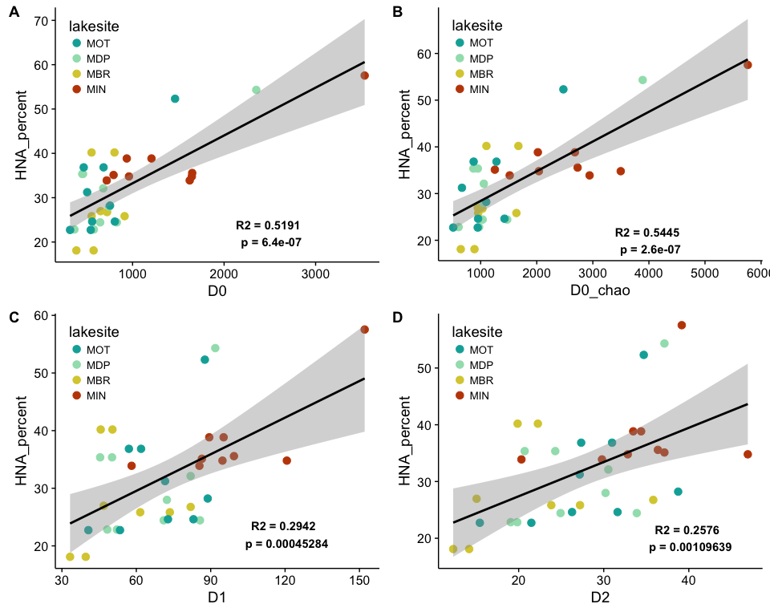

```r
# Is there a relationship between LNA_percent and D2?
lm_free_D2_vs_LNApercent <- lm(D2 ~ LNA_percent, data = free_meta_data)

LNA_vs_D2 <- ggplot(free_meta_data, aes(x = D2, y = LNA_percent*100)) +
  geom_point(aes(color = lakesite, shape = season), size = 3) +
  scale_color_manual(values = lakesite_colors) + 
  ggtitle("LNA cells per uL") + 
  geom_smooth(method = "lm", color = "black") + 
  annotate("text", x = 48, y=80, 
           color = "black", fontface = "bold",
           label = paste("R2 =", round(summary(lm_free_D2_vs_LNApercent)$adj.r.squared, digits = 4), "\n", 
                         "p =", round(unname(summary(lm_free_D2_vs_LNApercent)$coefficients[,4][2]), digits = 8))) +
  theme(legend.position = c(0.15, 0.27), legend.text = element_text(size = 10))
         
HLNA_vs_D2 <- plot_grid(HNA_vs_D2, LNA_vs_D2, 
     labels = c("A", "B"), 
     ncol = 2)

# There is apparently a correlation between HNA_Percent and diversity of free living bacteria 
cor(free_meta_data$D2, free_meta_data$HNA_percent)
```

```
## [1] 0.5286299
```

```r
cor.test(free_meta_data$D2, free_meta_data$HNA_percent)
```

```
## 
## 	Pearson's product-moment correlation
## 
## data:  free_meta_data$D2 and free_meta_data$HNA_percent
## t = 3.5775, df = 33, p-value = 0.001096
## alternative hypothesis: true correlation is not equal to 0
## 95 percent confidence interval:
##  0.2371629 0.7327859
## sample estimates:
##       cor 
## 0.5286299
```

```r
cor(free_meta_data$D1, free_meta_data$HNA_percent)
```

```
## [1] 0.5611953
```

```r
cor.test(free_meta_data$D1, free_meta_data$HNA_percent)
```

```
## 
## 	Pearson's product-moment correlation
## 
## data:  free_meta_data$D1 and free_meta_data$HNA_percent
## t = 3.895, df = 33, p-value = 0.0004528
## alternative hypothesis: true correlation is not equal to 0
## 95 percent confidence interval:
##  0.2803854 0.7535211
## sample estimates:
##       cor 
## 0.5611953
```

```r
cor(free_meta_data$D0, free_meta_data$HNA_percent)
```

```
## [1] 0.7302206
```

```r
cor.test(free_meta_data$D0, free_meta_data$HNA_percent)
```

```
## 
## 	Pearson's product-moment correlation
## 
## data:  free_meta_data$D0 and free_meta_data$HNA_percent
## t = 6.1398, df = 33, p-value = 6.397e-07
## alternative hypothesis: true correlation is not equal to 0
## 95 percent confidence interval:
##  0.5246423 0.8553285
## sample estimates:
##       cor 
## 0.7302206
```

```r
cor(free_meta_data$D0_chao, free_meta_data$HNA_percent)
```

```
## [1] 0.7469442
```

```r
cor.test(free_meta_data$D0_chao, free_meta_data$HNA_percent)
```

```
## 
## 	Pearson's product-moment correlation
## 
## data:  free_meta_data$D0_chao and free_meta_data$HNA_percent
## t = 6.4535, df = 33, p-value = 2.555e-07
## alternative hypothesis: true correlation is not equal to 0
## 95 percent confidence interval:
##  0.5508012 0.8649022
## sample estimates:
##       cor 
## 0.7469442
```


# Relationship between Chla and Total Production?

```r
# Is there a relationship between CHLOROPHYLL A and Total Production?
lm_all_totprod_chla <- lm(tot_bacprod ~ Chl_Lab_ugperL, data = nosed_meta_data)
# Plot the relationship
ggplot(nosed_meta_data, aes(x = Chl_Lab_ugperL, y = tot_bacprod)) + 
  geom_point(size = 3) +
  geom_smooth(method = "lm") + 
  annotate("text", x = 6, y=75, 
           color = "black", fontface = "bold",
           label = paste("R2 =", round(summary(lm_all_totprod_chla)$adj.r.squared, digits = 4), "\n", 
                         "p =", round(unname(summary(lm_all_totprod_chla)$coefficients[,4][2]), digits = 4)))+
  theme(legend.position = c(0.12, 0.8), 
        legend.text = element_text(size = 10))
```

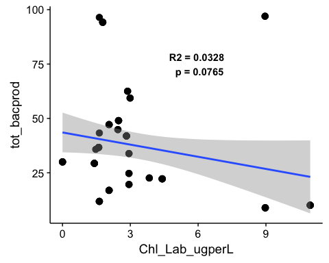

There appears to be *no relationship* between **chlorophyll a and total production**.


# Is there a relationship between diversity and *fractionated* bacterial production?

```r
# For 2015 data only 
meta_data <- data.frame(sample_data(otu_merged_musk_pruned)) 

all_top_2015_df <- dplyr::filter(meta_data, limnion == "Top" & 
                              norep_filter_name != "MOTHJ715" & 
                              year == "2015")

wholefree_2015_df <- dplyr::filter(meta_data, fraction == "WholeFree" & 
                              limnion == "Top" & 
                              norep_filter_name != "MOTHJ715" & 
                              year == "2015")

wholeparticle_2015_df <- dplyr::filter(meta_data, fraction == "WholePart" & 
                                  limnion == "Top" &
                                  norep_filter_name != "MOTHJ715" & 
                                  year == "2015")
```


```r
# Can fractional production be predicted by phenoflow D2 INVERSE SIMPSON? 
# FREE LIVING
free_otu_simps_even_stats <- lm(frac_bacprod ~ D2/D0, data = wholefree_2015_df)
# PARTICLE
part_otu_simps_even_stats <- lm(frac_bacprod ~ D2/D0, data = wholeparticle_2015_df)

# Plot D2 INVERSE SIMPSON
ggplot(all_top_2015_df, aes(x=D2/D0, y=frac_bacprod, color = fraction)) + 
  geom_point(size = 3.5) + 
  geom_errorbar(aes(ymin = frac_bacprod - SD_frac_bacprod, ymax = frac_bacprod + SD_frac_bacprod)) + 
  scale_color_manual(values = c("firebrick3","cornflowerblue"), limits = c("WholePart", "Free")) +
  ylab("Production (μgC/L/hr)") + xlab("Simpson's Evenness (D2/D0)") +
  theme(legend.position=c(0.85,0.9), legend.title=element_blank()) +
  annotate("text", x = 0.04, y=60, color = "cornflowerblue", fontface = "bold",
           label = paste("R2 =", round(summary(free_otu_simps_even_stats)$adj.r.squared, digits = 4), "\n", 
                         "p =", round(unname(summary(free_otu_simps_even_stats)$coefficients[,4][2]), digits = 4))) + 
  annotate("text", x = 0.06, y=35, color = "firebrick3", fontface = "bold",
           label = paste("R2 =", round(summary(part_otu_simps_even_stats)$adj.r.squared, digits = 4), "\n", 
                         "p =", round(unname(summary(part_otu_simps_even_stats)$coefficients[,4][2]), digits = 4)))
```

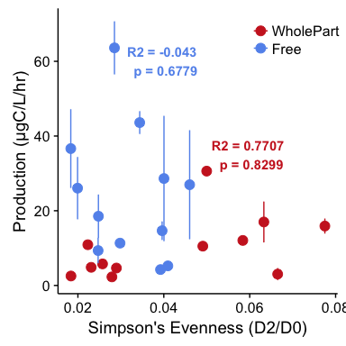


```r
# Can fractional production be predicted by phenoflow D0 observed richness? 
# FREE LIVING
free_otu_D0_stats <- lm(frac_bacprod ~ D0, data = wholefree_2015_df)
#summary(free_otu_D0_stats)

# PARTICLE
part_otu_D0_stats <- lm(frac_bacprod ~ D0, data = wholeparticle_2015_df)
#summary(part_otu_D0_stats)

# Plot D0 Observed Richness
otu_pheno_D0 <- ggplot(all_top_2015_df, aes(x=D0, y=frac_bacprod, color = fraction)) + 
  geom_point(size = 3.5) + 
  geom_errorbarh(aes(xmin = D0 - D0_SD, xmax = D0 + D0_SD)) + 
  geom_errorbar(aes(ymin = frac_bacprod - SD_frac_bacprod, ymax = frac_bacprod + SD_frac_bacprod)) + 
  scale_color_manual(values = c("firebrick3","cornflowerblue"), limits = c("WholePart", "Free")) +
  ylab("Production (μgC/L/hr)") + xlab("Observed Richness (D0)") +
  geom_smooth(data=subset(all_top_2015_df, fraction == "WholePart"), method='lm') + 
  theme(legend.position=c(0.15,0.9), legend.title=element_blank()) +
  annotate("text", x = 1000, y=35, color = "cornflowerblue", fontface = "bold",
           label = paste("R2 =", round(summary(free_otu_D0_stats)$adj.r.squared, digits = 4), "\n", 
                         "p =", round(unname(summary(free_otu_D0_stats)$coefficients[,4][2]), digits = 4))) + 
  annotate("text", x = 1600, y=8, color = "firebrick3", fontface = "bold",
           label = paste("R2 =", round(summary(part_otu_D0_stats)$adj.r.squared, digits = 4), "\n", 
                         "p =", round(unname(summary(part_otu_D0_stats)$coefficients[,4][2]), digits = 4)))


# Can fractional production be predicted by phenoflow chao1? 
# FREE LIVING
free_otu_D0chao_stats <- lm(frac_bacprod ~ D0_chao, data = wholefree_2015_df)
#summary(free_otu_D0chao_stats)

# PARTICLE
part_otu_D0chao_stats <- lm(frac_bacprod ~ D0_chao, data = wholeparticle_2015_df)
#summary(part_otu_D0chao_stats)
 
# Plot  chao1
otu_pheno_D0chao <- ggplot(all_top_2015_df, aes(x=D0_chao, y=frac_bacprod, color = fraction)) + 
  geom_point(size = 3.5) + 
  geom_errorbarh(aes(xmin = D0_chao - D0_chao_sd, xmax = D0_chao + D0_chao_sd)) + 
  geom_errorbar(aes(ymin = frac_bacprod - SD_frac_bacprod, ymax = frac_bacprod + SD_frac_bacprod)) + 
  scale_color_manual(values = c("firebrick3","cornflowerblue"), limits = c("WholePart", "Free")) +
  ylab("Production (μgC/L/hr)") + xlab("Chao1 (D0)") +
  geom_smooth(data=subset(all_top_2015_df, fraction == "WholePart"), method='lm') + 
  theme(legend.position=c(0.15,0.9), legend.title=element_blank()) +
  annotate("text", x = 2000, y=35, color = "cornflowerblue", fontface = "bold",
           label = paste("R2 =", round(summary(free_otu_D0chao_stats)$adj.r.squared, digits = 4), "\n", 
                         "p =", round(unname(summary(free_otu_D0chao_stats)$coefficients[,4][2]), digits = 4))) + 
  annotate("text", x = 2700, y=8, color = "firebrick3", fontface = "bold",
           label = paste("R2 =", round(summary(part_otu_D0chao_stats)$adj.r.squared, digits = 4), "\n", 
                         "p =", round(unname(summary(part_otu_D0chao_stats)$coefficients[,4][2]), digits = 4)))


# Can fractional production be predicted by phenoflow D1 SHANNON ENTROPY? 
# FREE LIVING
free_otu_D1_stats <- lm(frac_bacprod ~ D1, data = wholefree_2015_df)
#summary(free_otu_D1_stats)

# PARTICLE
part_otu_D1_stats <- lm(frac_bacprod ~ D1, data = wholeparticle_2015_df)
#summary(part_otu_D1_stats)

# Plot D1 SHANNON ENTROPY
otu_pheno_D1 <- ggplot(all_top_2015_df, aes(x=D1, y=frac_bacprod, color = fraction)) + 
  geom_point(size = 3.5) + 
  geom_errorbarh(aes(xmin = D1 - D1_sd, xmax = D1 + D1_sd)) + 
  geom_errorbar(aes(ymin = frac_bacprod - SD_frac_bacprod, ymax = frac_bacprod + SD_frac_bacprod)) + 
  scale_color_manual(values = c("firebrick3","cornflowerblue"), limits = c("WholePart", "Free")) +
  ylab("Production (μgC/L/hr)") + xlab("Shannon Entropy (D1)") +
  geom_smooth(data=subset(all_top_2015_df, fraction == "WholePart"), method='lm') + 
  theme(legend.position=c(0.85,0.9), legend.title=element_blank()) +
  annotate("text", x = 175, y=35, color = "cornflowerblue", fontface = "bold",
           label = paste("R2 =", round(summary(free_otu_D1_stats)$adj.r.squared, digits = 4), "\n", 
                         "p =", round(unname(summary(free_otu_D1_stats)$coefficients[,4][2]), digits = 4))) + 
  annotate("text", x = 275, y=7, color = "firebrick3", fontface = "bold",
           label = paste("R2 =", round(summary(part_otu_D1_stats)$adj.r.squared, digits = 4), "\n", 
                         "p =", round(unname(summary(part_otu_D1_stats)$coefficients[,4][2]), digits = 4)))


# Can fractional production be predicted by phenoflow D2 INVERSE SIMPSON? 
# FREE LIVING
lm_free_otu_D2_stats <- lm(frac_bacprod ~ D2, data = wholefree_2015_df)
#summary(free_otu_D2_stats)

# PARTICLE
lm_part_otu_D2_stats <- lm(frac_bacprod ~ D2, data = wholeparticle_2015_df)
#summary(part_otu_D2_stats)

# To put less weight in the outliers -> run robust regression
#rlm_part_otu_D2_stats <- rlm(frac_bacprod ~ D2, data = wholeparticle_2015_df) # To perform robust regression 
#summary(rlm_part_otu_D2_stats)
#car::Anova(rlm_part_otu_D2_stats)
# To plot robust regression in ggplot do geom_smooth(method = "rlm")


# Plot D2 INVERSE SIMPSON
otu_pheno_D2 <- ggplot(all_top_2015_df, aes(x=D2, y=frac_bacprod, color = fraction)) + 
  geom_point(size = 3.5) + 
  geom_errorbarh(aes(xmin = D2 - D2_sd, xmax = D2 + D2_sd)) +
  geom_errorbar(aes(ymin = frac_bacprod - SD_frac_bacprod, ymax = frac_bacprod + SD_frac_bacprod)) + 
  scale_color_manual(values = c("firebrick3","cornflowerblue"), limits = c("WholePart", "Free")) +
  ylab("Production (μgC/L/hr)") + xlab("Inverse Simpson (D2)") +
  geom_smooth(data=subset(all_top_2015_df, fraction == "WholePart"), method='lm') + 
  theme(legend.position=c(0.85,0.9), legend.title=element_blank()) +
  annotate("text", x = 40, y=45, color = "cornflowerblue", fontface = "bold",
           label = paste("R2 =", round(summary(lm_free_otu_D2_stats)$adj.r.squared, digits = 4), "\n", 
                         "p =", round(unname(summary(lm_free_otu_D2_stats)$coefficients[,4][2]), digits = 4))) + 
  annotate("text", x = 50, y=25, color = "firebrick3", fontface = "bold",
           label = paste("R2 =", round(summary(lm_part_otu_D2_stats)$adj.r.squared, digits = 4), "\n", 
                         "p =", round(unname(summary(lm_part_otu_D2_stats)$coefficients[,4][2]), digits = 4)))

otu_phenoflow <- plot_grid(otu_pheno_D0, otu_pheno_D0chao, otu_pheno_D1, otu_pheno_D2, 
          labels = c("A", "B", "C", "D"), 
          align = "h", nrow = 2, ncol = 2)
otu_phenoflow
```


```r
#ggsave("../Figures/fracprod_vs_diversity.png", otu_phenoflow, dpi = 600, units = "in", width = 10, height = 8)
```


# Phylum production analysis

```r
# Michelle Berry's subsetting function, similar to phyloseq::subset_taxa, except taxa can 
# be passed as arguments within functions without weird environment errors
#
# Args:
#   physeq: a phyloseq object
#   taxrank: taxonomic rank to filter on
#   taxa: a vector of taxa groups to filter on
#
# Returns: 
#   a phyloseq object subsetted to the x taxa in taxrank
my_subset_taxa <- function(physeq, taxrank, taxa) {
  physeq_tax_sub <- tax_table(physeq)[tax_table(physeq)[ , taxrank] %in% taxa, ]
  tax_table(physeq) <- physeq_tax_sub
  return(physeq)
}

## Scale phyloseq objects of whole free and whole particle:
# scale_otu_merged_musk_wholefree_top
# scale_otu_merged_musk_wholepart_top


# Initialize parameters
trials <- 100
min_lib <- min(sample_sums(scale_otu_merged_musk_wholepart_top)) # Depth we are rarefying to

# Groups to estimate alpha diversity for 
mytaxa <- c("Acidobacteria", "Actinobacteria", "Alphaproteobacteria", "Armatimonadetes",
            "Bacteroidetes", "Betaproteobacteria", "Chlorobi", "Chloroflexi",
            "Cyanobacteria","Deltaproteobacteria", "Gammaproteobacteria", 
            "Planctomycetes","Verrucomicrobia")
names(mytaxa) <- mytaxa

# Taxonomic ranks of mytaxa
mytaxa_taxrank <- c("Phylum", "Phylum", "Phylum", "Phylum", "Phylum", "Phylum", 
                      "Phylum", "Phylum", "Phylum", "Phylum", "Phylum", "Phylum", "Phylum")
names(mytaxa_taxrank) <- mytaxa

# Data frame to hold alpha diversity estimates over trials
alphadiv_df <- data.frame(matrix(nrow = nsamples(scale_otu_merged_musk_wholepart_top), ncol = trials))

# Initialize empty df's for richness and evenness of all taxa in mytaxa
richness <- lapply(mytaxa, function(x) {return(alphadiv_df)} )
invsimps <- lapply(mytaxa, function(x) {return(alphadiv_df)} )

alphadiv_list <- list(richness = richness, invsimps = invsimps)


# Set the seed for reproducibility
set.seed(777)

# Run trials to subsample and estimate diversity
for (i in 1:100) {
  
  # Subsample
  rarefied_physeq <- rarefy_even_depth(scale_otu_merged_musk_wholepart_top, sample.size = min_lib, verbose = FALSE, replace = TRUE)
  
  # Generate alpha-diversity estimates for each taxonomic group
  for (t in mytaxa) {

    # Subset the taxa
    physeq_sub <- my_subset_taxa(physeq = rarefied_physeq, 
                                 taxrank = mytaxa_taxrank[t], 
                                 taxa = t)
    
    # Calculate observed richness for that group and store value in a df column
    richness <- estimate_richness(physeq_sub, measures = "Observed")[ ,1]
    alphadiv_list$richness[[t]][ ,i] <- richness
    
    # Calculate observed invsimps for that group and store value in a df column
    invsimps <- estimate_richness(physeq_sub, measures = "InvSimpson")[ ,1]
    alphadiv_list$invsimps[[t]][ ,i] <- invsimps

  }
}

# Calculate the means of richness and inverse simpson from the 100 trials
alphadiv_est <- lapply(alphadiv_list, function(div_measure) {
    lapply(div_measure, function(taxa_group) {
        alpha_mean <- rowMeans(taxa_group)
        return(alpha_mean)
    })  
})

# Convert alphadiv_est richness and simpson's E lists into wide data frames
l <- lapply(alphadiv_est, function(x) {
  # convert from list to data.frame
  est_df <- plyr::ldply(.data = x, .fun = data.frame)
  names(est_df) <- c("Taxa", "Diversity")
  
  # Add in SampleID column and spread to wide format
  r <- est_df %>%
    mutate(norep_filter_name = rep(sample_names(scale_otu_merged_musk_wholepart_top), length(mytaxa)))
  return(r)
})

# Merge sample metadata with these estimates
merge_dat <- data.frame(sample_data(scale_otu_merged_musk_wholepart_top)) %>%
  dplyr::select(norep_filter_name, Chl_Lab_ugperL, TP_ugperL, pH, frac_bacprod, NH3_mgperL, NO3_mgperL,
         lakesite, fraction, season) 

# Create a df with a "Diversity" column that includes richness and inv. simpson,
# and log-chl a values from erie sample_data
alpha_comb1 <- l$richness %>% 
  left_join(y = l$invsimps, by = c("Taxa", "norep_filter_name")) %>%   # Join the richness and inv_simp df's
  rename(Richness = Diversity.x, Inverse_Simpson = Diversity.y) 

alpha_comb_final <- alpha_comb1 %>%
  left_join(merge_dat, by = "norep_filter_name") %>%                  # Join with merged nutrient data
  gather(key = "Alphadiv", value = "Estimate", Richness, Inverse_Simpson) 
```


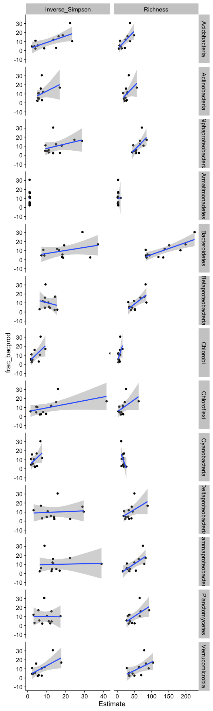


```r
# CYANOS 
cyanos <- filter(alpha_comb_final, Taxa == "Cyanobacteria")
summary(lm(frac_bacprod ~ Estimate, data = filter(cyanos, Alphadiv == "Richness")))
```

```
## 
## Call:
## lm(formula = frac_bacprod ~ Estimate, data = filter(cyanos, Alphadiv == 
##     "Richness"))
## 
## Residuals:
##      Min       1Q   Median       3Q      Max 
## -11.9501  -4.0363  -0.7879   2.2606  14.7699 
## 
## Coefficients:
##             Estimate Std. Error t value Pr(>|t|)  
## (Intercept)  27.3825     9.7451   2.810   0.0185 *
## Estimate     -1.0138     0.5528  -1.834   0.0965 .
## ---
## Signif. codes:  0 '***' 0.001 '**' 0.01 '*' 0.05 '.' 0.1 ' ' 1
## 
## Residual standard error: 7.48 on 10 degrees of freedom
## Multiple R-squared:  0.2517,	Adjusted R-squared:  0.1769 
## F-statistic: 3.363 on 1 and 10 DF,  p-value: 0.09655
```

```r
summary(lm(frac_bacprod ~ Estimate, data = filter(cyanos, Alphadiv == "Inverse_Simpson")))
```

```
## 
## Call:
## lm(formula = frac_bacprod ~ Estimate, data = filter(cyanos, Alphadiv == 
##     "Inverse_Simpson"))
## 
## Residuals:
##    Min     1Q Median     3Q    Max 
## -9.133 -6.143 -1.603  4.896 15.047 
## 
## Coefficients:
##             Estimate Std. Error t value Pr(>|t|)
## (Intercept)    2.635      5.193   0.507    0.623
## Estimate       1.923      1.231   1.562    0.149
## 
## Residual standard error: 7.753 on 10 degrees of freedom
## Multiple R-squared:  0.1961,	Adjusted R-squared:  0.1157 
## F-statistic:  2.44 on 1 and 10 DF,  p-value: 0.1494
```

```r
# Plot it 
ggplot(cyanos, aes(x = Estimate, y =frac_bacprod)) + 
  geom_point(size = 3) +
  #geom_smooth(method = "lm") + 
  facet_grid(Taxa~Alphadiv, scales = "free_x")
```

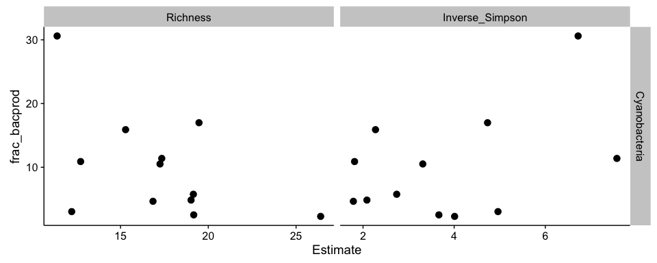

```r
# ACTINOBACTERIA
actinos <- filter(alpha_comb_final, Taxa == "Actinobacteria")
summary(lm(frac_bacprod ~ Estimate, data = filter(actinos, Alphadiv == "Richness")))
```

```
## 
## Call:
## lm(formula = frac_bacprod ~ Estimate, data = filter(actinos, 
##     Alphadiv == "Richness"))
## 
## Residuals:
##    Min     1Q Median     3Q    Max 
## -6.993 -4.725 -2.026  1.550 18.204 
## 
## Coefficients:
##             Estimate Std. Error t value Pr(>|t|)  
## (Intercept)  -0.8996     6.3342  -0.142   0.8899  
## Estimate      0.3954     0.2169   1.823   0.0983 .
## ---
## Signif. codes:  0 '***' 0.001 '**' 0.01 '*' 0.05 '.' 0.1 ' ' 1
## 
## Residual standard error: 7.492 on 10 degrees of freedom
## Multiple R-squared:  0.2495,	Adjusted R-squared:  0.1744 
## F-statistic: 3.324 on 1 and 10 DF,  p-value: 0.09827
```

```r
summary(lm(frac_bacprod ~ Estimate, data = filter(actinos, Alphadiv == "Inverse_Simpson")))
```

```
## 
## Call:
## lm(formula = frac_bacprod ~ Estimate, data = filter(actinos, 
##     Alphadiv == "Inverse_Simpson"))
## 
## Residuals:
##    Min     1Q Median     3Q    Max 
## -7.298 -4.291 -2.771  2.293 20.345 
## 
## Coefficients:
##             Estimate Std. Error t value Pr(>|t|)
## (Intercept)   2.5086     5.6970   0.440    0.669
## Estimate      1.0443     0.7325   1.426    0.184
## 
## Residual standard error: 7.883 on 10 degrees of freedom
## Multiple R-squared:  0.1689,	Adjusted R-squared:  0.08581 
## F-statistic: 2.033 on 1 and 10 DF,  p-value: 0.1844
```

```r
# Plot it 
ggplot(actinos, aes(x = Estimate, y =frac_bacprod)) + 
  geom_point(size = 3) +
  #geom_smooth(method = "lm") + 
  facet_grid(Taxa~Alphadiv, scales = "free_x")
```

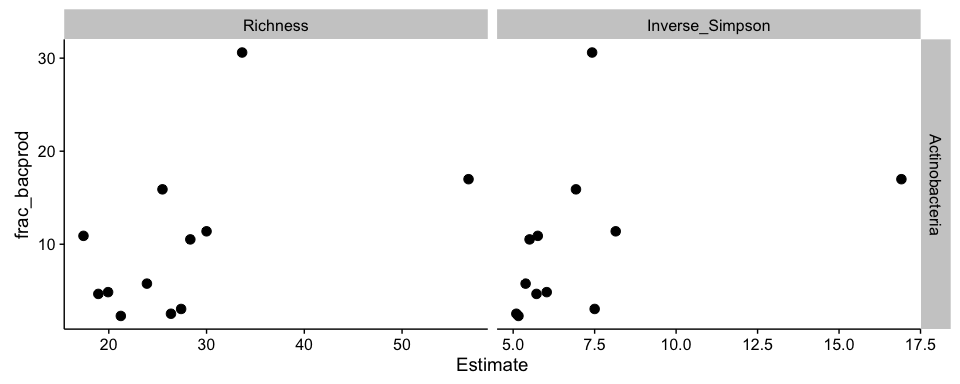

```r
# BACTEROIDETES
bacteroidetes <- filter(alpha_comb_final, Taxa == "Bacteroidetes")
summary(lm(frac_bacprod ~ Estimate, data = filter(bacteroidetes, Alphadiv == "Richness")))
```

```
## 
## Call:
## lm(formula = frac_bacprod ~ Estimate, data = filter(bacteroidetes, 
##     Alphadiv == "Richness"))
## 
## Residuals:
##     Min      1Q  Median      3Q     Max 
## -7.6629 -2.7171  0.2994  2.1157  8.2393 
## 
## Coefficients:
##             Estimate Std. Error t value Pr(>|t|)   
## (Intercept) -7.61876    4.47790  -1.701  0.11970   
## Estimate     0.13301    0.03191   4.168  0.00192 **
## ---
## Signif. codes:  0 '***' 0.001 '**' 0.01 '*' 0.05 '.' 0.1 ' ' 1
## 
## Residual standard error: 5.227 on 10 degrees of freedom
## Multiple R-squared:  0.6347,	Adjusted R-squared:  0.5982 
## F-statistic: 17.37 on 1 and 10 DF,  p-value: 0.001924
```

```r
summary(lm(frac_bacprod ~ Estimate, data = filter(bacteroidetes, Alphadiv == "Inverse_Simpson")))
```

```
## 
## Call:
## lm(formula = frac_bacprod ~ Estimate, data = filter(bacteroidetes, 
##     Alphadiv == "Inverse_Simpson"))
## 
## Residuals:
##      Min       1Q   Median       3Q      Max 
## -12.1185  -4.5698  -0.0459   3.1462  17.3474 
## 
## Coefficients:
##             Estimate Std. Error t value Pr(>|t|)
## (Intercept)   3.4586     5.3526   0.646    0.533
## Estimate      0.3395     0.2526   1.344    0.209
## 
## Residual standard error: 7.959 on 10 degrees of freedom
## Multiple R-squared:  0.1529,	Adjusted R-squared:  0.06823 
## F-statistic: 1.805 on 1 and 10 DF,  p-value: 0.2087
```

```r
# Plot it 
ggplot(bacteroidetes, aes(x = Estimate, y =frac_bacprod)) + 
  geom_point(size = 3) +
  geom_smooth(method = "lm", data = filter(bacteroidetes, Alphadiv == "Richness")) + 
  facet_grid(Taxa~Alphadiv, scales = "free_x")
```

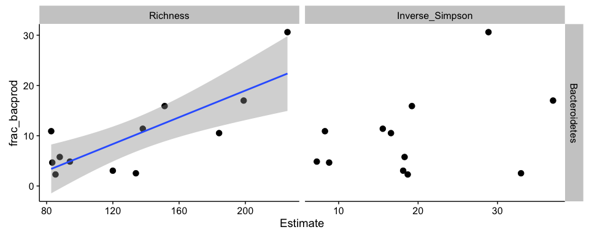

```r
# VERRUCOMICROBIA
verruco <- filter(alpha_comb_final, Taxa == "Verrucomicrobia")
summary(lm(frac_bacprod ~ Estimate, data = filter(verruco, Alphadiv == "Richness")))
```

```
## 
## Call:
## lm(formula = frac_bacprod ~ Estimate, data = filter(verruco, 
##     Alphadiv == "Richness"))
## 
## Residuals:
##     Min      1Q  Median      3Q     Max 
## -8.7749 -3.6735 -0.8133  0.9688 17.1741 
## 
## Coefficients:
##             Estimate Std. Error t value Pr(>|t|)  
## (Intercept) -1.08011    5.34381  -0.202   0.8439  
## Estimate     0.18490    0.08277   2.234   0.0495 *
## ---
## Signif. codes:  0 '***' 0.001 '**' 0.01 '*' 0.05 '.' 0.1 ' ' 1
## 
## Residual standard error: 7.063 on 10 degrees of freedom
## Multiple R-squared:  0.3329,	Adjusted R-squared:  0.2662 
## F-statistic:  4.99 on 1 and 10 DF,  p-value: 0.04951
```

```r
summary(lm(frac_bacprod ~ Estimate, data = filter(verruco, Alphadiv == "Inverse_Simpson")))
```

```
## 
## Call:
## lm(formula = frac_bacprod ~ Estimate, data = filter(verruco, 
##     Alphadiv == "Inverse_Simpson"))
## 
## Residuals:
##    Min     1Q Median     3Q    Max 
## -8.105 -5.266 -0.816  1.435 13.436 
## 
## Coefficients:
##             Estimate Std. Error t value Pr(>|t|)  
## (Intercept)   2.3166     3.5659   0.650   0.5306  
## Estimate      1.1193     0.4383   2.554   0.0287 *
## ---
## Signif. codes:  0 '***' 0.001 '**' 0.01 '*' 0.05 '.' 0.1 ' ' 1
## 
## Residual standard error: 6.727 on 10 degrees of freedom
## Multiple R-squared:  0.3948,	Adjusted R-squared:  0.3342 
## F-statistic: 6.522 on 1 and 10 DF,  p-value: 0.02867
```

```r
# Plot it 
ggplot(verruco, aes(x = Estimate, y =frac_bacprod)) + 
  geom_point(size = 3) +
  geom_smooth(method = "lm") + 
  facet_grid(Taxa~Alphadiv, scales = "free_x")
```

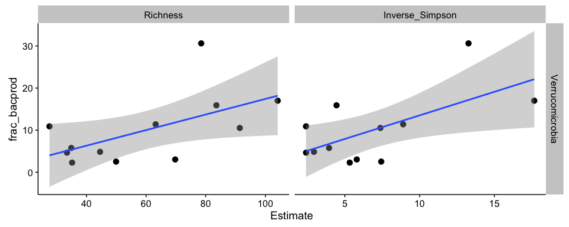

```r
# PLANCTOMYCETES
planctos <- filter(alpha_comb_final, Taxa == "Planctomycetes")
summary(lm(frac_bacprod ~ Estimate, data = filter(planctos, Alphadiv == "Richness")))
```

```
## 
## Call:
## lm(formula = frac_bacprod ~ Estimate, data = filter(planctos, 
##     Alphadiv == "Richness"))
## 
## Residuals:
##    Min     1Q Median     3Q    Max 
## -7.854 -3.809 -2.180  2.100 16.492 
## 
## Coefficients:
##             Estimate Std. Error t value Pr(>|t|)  
## (Intercept)  -2.2675     5.4025  -0.420   0.6836  
## Estimate      0.2515     0.1034   2.431   0.0354 *
## ---
## Signif. codes:  0 '***' 0.001 '**' 0.01 '*' 0.05 '.' 0.1 ' ' 1
## 
## Residual standard error: 6.855 on 10 degrees of freedom
## Multiple R-squared:  0.3715,	Adjusted R-squared:  0.3087 
## F-statistic: 5.911 on 1 and 10 DF,  p-value: 0.03537
```

```r
summary(lm(frac_bacprod ~ Estimate, data = filter(planctos, Alphadiv == "Inverse_Simpson")))
```

```
## 
## Call:
## lm(formula = frac_bacprod ~ Estimate, data = filter(planctos, 
##     Alphadiv == "Inverse_Simpson"))
## 
## Residuals:
##    Min     1Q Median     3Q    Max 
## -7.679 -5.685 -1.782  2.519 20.645 
## 
## Coefficients:
##             Estimate Std. Error t value Pr(>|t|)
## (Intercept) 10.06117    6.25469   1.609    0.139
## Estimate    -0.01158    0.62269  -0.019    0.986
## 
## Residual standard error: 8.647 on 10 degrees of freedom
## Multiple R-squared:  3.46e-05,	Adjusted R-squared:  -0.09996 
## F-statistic: 0.000346 on 1 and 10 DF,  p-value: 0.9855
```

```r
# Plot it 
ggplot(planctos, aes(x = Estimate, y =frac_bacprod)) + 
  geom_point(size = 3) +
  geom_smooth(method = "lm", data = filter(planctos, Alphadiv == "Richness")) + 
  facet_grid(Taxa~Alphadiv, scales = "free_x")
```


```r
# BETAPROTEOS
betaprots <- filter(alpha_comb_final, Taxa == "Betaproteobacteria")
summary(lm(frac_bacprod ~ Estimate, data = filter(betaprots, Alphadiv == "Richness")))
```

```
## 
## Call:
## lm(formula = frac_bacprod ~ Estimate, data = filter(betaprots, 
##     Alphadiv == "Richness"))
## 
## Residuals:
##     Min      1Q  Median      3Q     Max 
## -8.4535 -4.0698  0.0419  2.2796 12.3534 
## 
## Coefficients:
##             Estimate Std. Error t value Pr(>|t|)  
## (Intercept) -6.02109    5.56245  -1.082   0.3045  
## Estimate     0.29447    0.09701   3.036   0.0126 *
## ---
## Signif. codes:  0 '***' 0.001 '**' 0.01 '*' 0.05 '.' 0.1 ' ' 1
## 
## Residual standard error: 6.238 on 10 degrees of freedom
## Multiple R-squared:  0.4796,	Adjusted R-squared:  0.4275 
## F-statistic: 9.214 on 1 and 10 DF,  p-value: 0.01256
```

```r
summary(lm(frac_bacprod ~ Estimate, data = filter(betaprots, Alphadiv == "Inverse_Simpson")))
```

```
## 
## Call:
## lm(formula = frac_bacprod ~ Estimate, data = filter(betaprots, 
##     Alphadiv == "Inverse_Simpson"))
## 
## Residuals:
##    Min     1Q Median     3Q    Max 
## -9.289 -5.062 -2.022  1.729 19.944 
## 
## Coefficients:
##             Estimate Std. Error t value Pr(>|t|)
## (Intercept)  15.7027     9.9802   1.573    0.147
## Estimate     -0.5350     0.9004  -0.594    0.566
## 
## Residual standard error: 8.499 on 10 degrees of freedom
## Multiple R-squared:  0.0341,	Adjusted R-squared:  -0.06249 
## F-statistic: 0.3531 on 1 and 10 DF,  p-value: 0.5656
```

```r
# Plot it 
ggplot(betaprots, aes(x = Estimate, y =frac_bacprod)) + 
  geom_point(size = 3) +
  geom_smooth(method = "lm", data = filter(betaprots, Alphadiv == "Richness")) + 
  facet_grid(Taxa~Alphadiv, scales = "free_x")
```

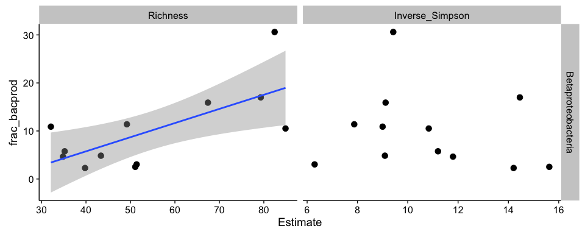

```r
# ALPHAPROTS
alphaprots <- filter(alpha_comb_final, Taxa == "Alphaproteobacteria")
summary(lm(frac_bacprod ~ Estimate, data = filter(alphaprots, Alphadiv == "Richness")))
```

```
## 
## Call:
## lm(formula = frac_bacprod ~ Estimate, data = filter(alphaprots, 
##     Alphadiv == "Richness"))
## 
## Residuals:
##     Min      1Q  Median      3Q     Max 
## -8.2159 -3.2062 -1.2829  0.9179 16.3440 
## 
## Coefficients:
##             Estimate Std. Error t value Pr(>|t|)  
## (Intercept) -13.8984     9.9487  -1.397   0.1926  
## Estimate      0.3924     0.1604   2.446   0.0345 *
## ---
## Signif. codes:  0 '***' 0.001 '**' 0.01 '*' 0.05 '.' 0.1 ' ' 1
## 
## Residual standard error: 6.84 on 10 degrees of freedom
## Multiple R-squared:  0.3744,	Adjusted R-squared:  0.3118 
## F-statistic: 5.984 on 1 and 10 DF,  p-value: 0.03448
```

```r
summary(lm(frac_bacprod ~ Estimate, data = filter(alphaprots, Alphadiv == "Inverse_Simpson")))
```

```
## 
## Call:
## lm(formula = frac_bacprod ~ Estimate, data = filter(alphaprots, 
##     Alphadiv == "Inverse_Simpson"))
## 
## Residuals:
##    Min     1Q Median     3Q    Max 
## -8.377 -3.362 -1.517  1.694 21.487 
## 
## Coefficients:
##             Estimate Std. Error t value Pr(>|t|)
## (Intercept)   2.3699     6.3966   0.370    0.719
## Estimate      0.5029     0.3954   1.272    0.232
## 
## Residual standard error: 8.023 on 10 degrees of freedom
## Multiple R-squared:  0.1393,	Adjusted R-squared:  0.0532 
## F-statistic: 1.618 on 1 and 10 DF,  p-value: 0.2321
```

```r
# Plot it 
ggplot(alphaprots, aes(x = Estimate, y =frac_bacprod)) + 
  geom_point(size = 3) +
  geom_smooth(method = "lm", data = filter(alphaprots, Alphadiv == "Richness")) + 
  facet_grid(Taxa~Alphadiv, scales = "free_x")
```

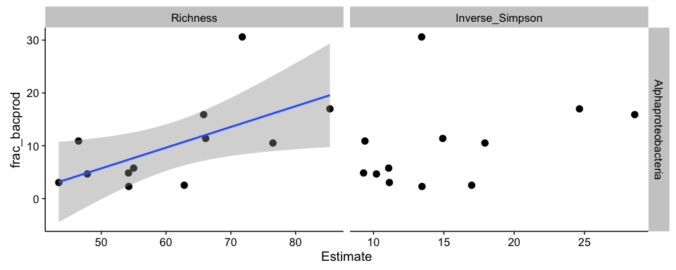


# How do the samples relate to each other? 
## PCOA


#  Stacked Bar plots for taxonomic structure
## OTU  Phylum Stacked Bar 


# Environmental Conditions 


# Calculate the Absolute abundances!


### HNA VS LNA 


