# Diversity-Productivity Relationships in Muskegon Lake
Marian L. Schmidt  
January 2017  


## Load Mothur OTU Data 

```r
# Loads a phyloseq object named otu_merged_musk_pruned)
load("../data/otu_merged_musk_pruned.RData")
# The name of the phyloseq object is: 
otu_merged_musk_pruned 
```

```
## phyloseq-class experiment-level object
## otu_table()   OTU Table:         [ 52980 taxa and 163 samples ]
## sample_data() Sample Data:       [ 163 samples by 67 sample variables ]
## tax_table()   Taxonomy Table:    [ 52980 taxa by 8 taxonomic ranks ]
```


# How do the *summed* sample sequencing read counts vary before modification?

```r
# Check the sequencing depth of each sample 
sums_otu <- data.frame(rowSums(otu_table(otu_merged_musk_pruned)))
colnames(sums_otu) <- "Sample_TotalSeqs"
sums_otu$names <- row.names(sums_otu)
sums_otu <- arrange(sums_otu, Sample_TotalSeqs) 
sums_otu <- make_metadata_norep(sums_otu)

##  PLOT BASED ON 
plot_sample_sums(dataframe = sums_otu, x_total_seqs = "Sample_TotalSeqs", fill_variable = "project")
```

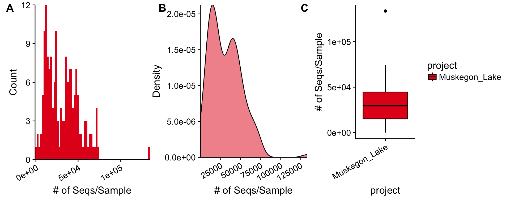

```r
## YEAR
plot_sample_sums(dataframe = sums_otu, x_total_seqs = "Sample_TotalSeqs", fill_variable = "year")
```

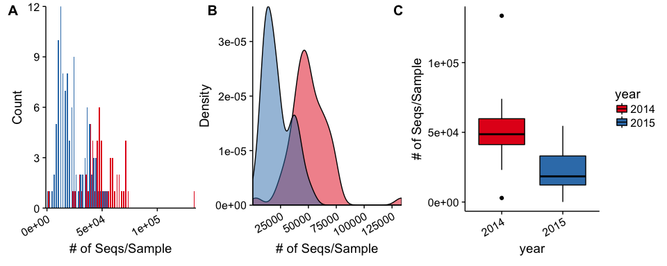

```r
## FRACTION
plot_sample_sums(dataframe = sums_otu, x_total_seqs = "Sample_TotalSeqs", fill_variable = "fraction")
```

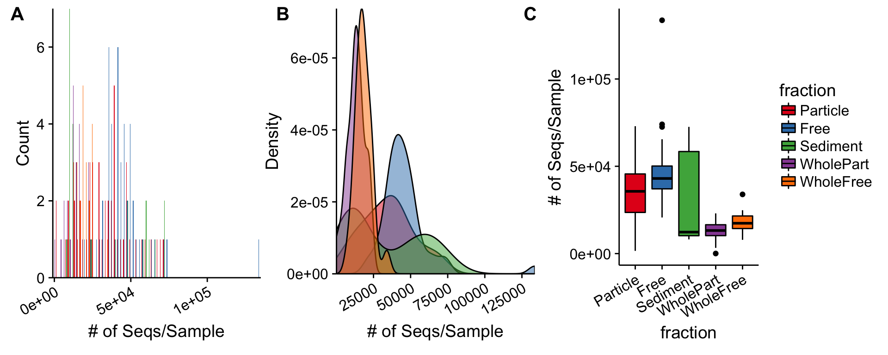

```r
####  Create a plot of the number of sequences per sample
total_sums <- ggplot(sums_otu, aes(x=reorder(names, Sample_TotalSeqs), y = Sample_TotalSeqs)) + 
  ylab("# of Seqs per Sample") +
  geom_bar(stat = "identity", colour="black",fill="cornflowerblue")  + xlab("Sample Name") + 
  ggtitle("All Samples: Sequencing Depth") + 
  theme(axis.text.x = element_blank())  

sums_lessthan10000 <- ggplot(filter(sums_otu, Sample_TotalSeqs < 10000),
                                    aes(x=reorder(names, Sample_TotalSeqs), y = Sample_TotalSeqs)) + 
  ylab("# of Seqs per Sample") +
  geom_bar(stat = "identity", colour="black",fill="cornflowerblue")  + xlab("Sample Name") + 
  ggtitle("Samples with less \n than 10,000 reads") + 
  theme(axis.text.x = element_blank())  

# DRAW THE TWO PLOTS 
ggdraw() +
  draw_plot(total_sums, 0, 0, 0.7, 1) +
  draw_plot(sums_lessthan10000, 0.7, 0, 0.3, 1) + # 1st = where to start drawing, 3rd = width, 4th = height
  draw_plot_label(c("A", "B"), 
                  c(0, 0.7), # Where along the x-axis would you like the labels?
                  c(1, 1),  # Put the label at the top of the plotting space (y-axis)
                  size = 15) # Size of label
```

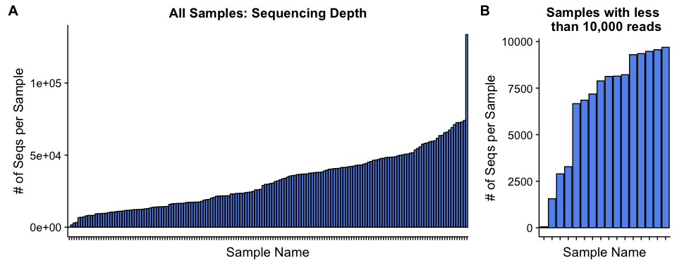

```r
## Add total sequences to metadata frame 
metdf <- sample_data(otu_merged_musk_pruned)
sums_otu$norep_filter_name <- sums_otu$names
sums_otu2 <- select(sums_otu, norep_filter_name, Sample_TotalSeqs)
metdf_num2 <- left_join(metdf, sums_otu2, by = "norep_filter_name")
row.names(metdf_num2) <- metdf_num2$norep_filter_name
# Rename the sample data 
sample_data(otu_merged_musk_pruned) <- metdf_num2
```


# How do the *scaled* (for beta diversity) sample sequencing read counts vary?

```r
## ALL SAMPLES 
otu_merged_musk_pruned_noMOTHJ715 <- subset_samples(otu_merged_musk_pruned, norep_filter_name !="MOTHJ715")
min(sample_sums(otu_merged_musk_pruned_noMOTHJ715)) # Scaling value 
```

```
## [1] 1562
```

```r
scale_otu_merged_musk_pruned <- scale_reads(otu_merged_musk_pruned_noMOTHJ715, round = "matround")
scale_otu_merged_musk_pruned # ALL Samples phyloseq object
```

```
## phyloseq-class experiment-level object
## otu_table()   OTU Table:         [ 4664 taxa and 162 samples ]
## sample_data() Sample Data:       [ 162 samples by 68 sample variables ]
## tax_table()   Taxonomy Table:    [ 4664 taxa by 8 taxonomic ranks ]
```

```r
### Water Samples 
otu_merged_musk_pruned_nosed <- subset_samples(otu_merged_musk_pruned, 
                                               norep_filter_name !="MOTHJ715" & fraction != "Sediment")
min(sample_sums(otu_merged_musk_pruned_nosed)) # Scaling value 
```

```
## [1] 1562
```

```r
scale_otu_merged_musk_nosed <- scale_reads(otu_merged_musk_pruned_nosed, round = "matround")
scale_otu_merged_musk_nosed # Water samples only
```

```
## phyloseq-class experiment-level object
## otu_table()   OTU Table:         [ 2914 taxa and 139 samples ]
## sample_data() Sample Data:       [ 139 samples by 68 sample variables ]
## tax_table()   Taxonomy Table:    [ 2914 taxa by 8 taxonomic ranks ]
```

```r
### Particle Samples 
otu_merged_musk_pruned_particle <- subset_samples(otu_merged_musk_pruned, 
                                               norep_filter_name !="MOTHJ715" & 
                                                 fraction %in% c("WholePart", "Particle"))
min(sample_sums(otu_merged_musk_pruned_particle)) # Scaling value 
```

```
## [1] 1562
```

```r
scale_otu_merged_musk_particle <- scale_reads(otu_merged_musk_pruned_particle, round = "matround")
scale_otu_merged_musk_particle # Particle and Whole particle samples only (both surface and bottom) 
```

```
## phyloseq-class experiment-level object
## otu_table()   OTU Table:         [ 2716 taxa and 69 samples ]
## sample_data() Sample Data:       [ 69 samples by 68 sample variables ]
## tax_table()   Taxonomy Table:    [ 2716 taxa by 8 taxonomic ranks ]
```

```r
# To only do analysis on wholeparticle samples 
otu_merged_musk_pruned_wholepart_top <- subset_samples(otu_merged_musk_pruned, 
                                               norep_filter_name !="MOTHJ715" & 
                                                 fraction == "WholePart" &
                                                 limnion == "Top")
min(sample_sums(otu_merged_musk_pruned_wholepart_top)) # Scaling value 
```

```
## [1] 6665
```

```r
scale_otu_merged_musk_wholepart_top <- scale_reads(otu_merged_musk_pruned_wholepart_top, round = "matround")
scale_otu_merged_musk_wholepart_top # Wholeparticle samples only (no prefilter; from the surface only)
```

```
## phyloseq-class experiment-level object
## otu_table()   OTU Table:         [ 4265 taxa and 12 samples ]
## sample_data() Sample Data:       [ 12 samples by 68 sample variables ]
## tax_table()   Taxonomy Table:    [ 4265 taxa by 8 taxonomic ranks ]
```

```r
### Free-Living Samples 
otu_merged_musk_pruned_free <- subset_samples(otu_merged_musk_pruned, 
                                               norep_filter_name !="MOTHJ715" & 
                                                fraction %in% c("WholeFree", "Free"))
min(sample_sums(otu_merged_musk_pruned_free)) # Scaling value 
```

```
## [1] 7887
```

```r
scale_otu_merged_musk_free <- scale_reads(otu_merged_musk_pruned_free, round = "matround")
scale_otu_merged_musk_free # All Free living samples (Free and wholeFree; both surface and bottom)
```

```
## phyloseq-class experiment-level object
## otu_table()   OTU Table:         [ 7020 taxa and 70 samples ]
## sample_data() Sample Data:       [ 70 samples by 68 sample variables ]
## tax_table()   Taxonomy Table:    [ 7020 taxa by 8 taxonomic ranks ]
```

```r
# To only do analysis on WholeFree samples 
otu_merged_musk_pruned_wholefree_top <- subset_samples(otu_merged_musk_pruned, 
                                               norep_filter_name !="MOTHJ715" & 
                                                 fraction == "WholeFree" &
                                                 limnion == "Top")
min(sample_sums(otu_merged_musk_pruned_wholefree_top)) # Scaling value 
```

```
## [1] 12162
```

```r
scale_otu_merged_musk_wholefree_top <- scale_reads(otu_merged_musk_pruned_wholefree_top, round = "matround")
scale_otu_merged_musk_wholefree_top # Only WholeFree samples (from the surface)
```

```
## phyloseq-class experiment-level object
## otu_table()   OTU Table:         [ 4167 taxa and 12 samples ]
## sample_data() Sample Data:       [ 12 samples by 68 sample variables ]
## tax_table()   Taxonomy Table:    [ 4167 taxa by 8 taxonomic ranks ]
```

```r
# Check the sequencing depth of each sample 
scaled_sums_otu <- data.frame(rowSums(otu_table(scale_otu_merged_musk_pruned)))
colnames(scaled_sums_otu) <- "Sample_TotalSeqs"
scaled_sums_otu$names <- row.names(scaled_sums_otu)
scaled_sums_otu <- arrange(scaled_sums_otu, Sample_TotalSeqs) %>%
  make_metadata_norep()

##  Plot based on all samples 
plot_sample_sums(dataframe = scaled_sums_otu, x_total_seqs = "Sample_TotalSeqs", fill_variable = "project")
```

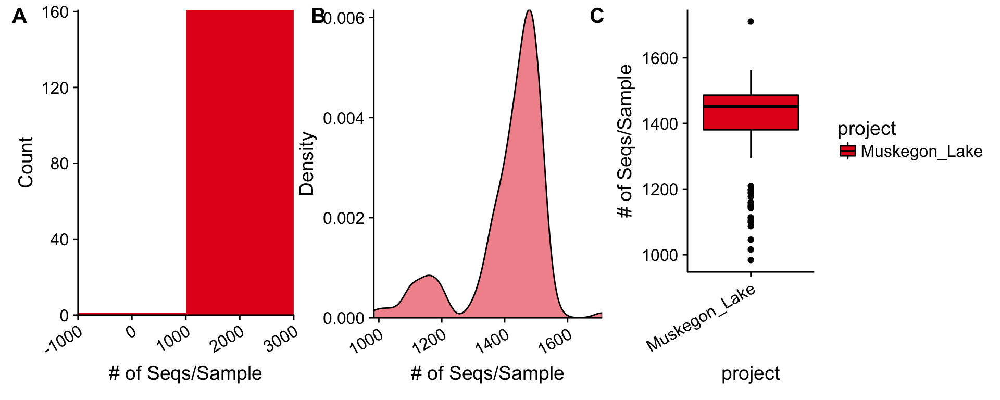

```r
##  Plot based on depth of samples 
plot_sample_sums(dataframe = scaled_sums_otu, x_total_seqs = "Sample_TotalSeqs", fill_variable = "limnion")
```

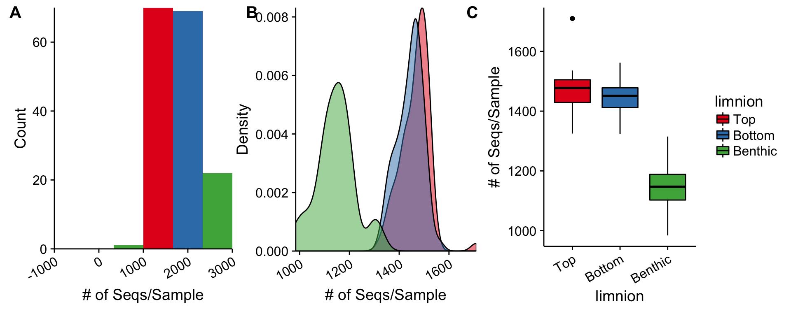

  


#  How linked are the diversities of the fractions?
## Free Living Sample Diversity Comparison  

```r
# Plot diversity based only on fraction 
ggplot(filter(fraction_divs, fraction %in% c("Free","WholeFree")),
       aes(x = fraction, y = div_value)) + 
  geom_jitter(aes(color = fraction), size = 3, width = 0.2) + 
  geom_boxplot(aes(fill = fraction), alpha =0.5) +
  scale_color_manual(values = fraction_colors) + 
  scale_fill_manual(values = fraction_colors) + 
  facet_wrap(~div_metric, scales = "free_y") +
  theme(axis.text.x = element_text(angle = 30, hjust = 1, vjust = 1),
        legend.position = c(0.07, 0.93), 
        strip.background = element_rect(fill = NA), 
        strip.text.x = element_text(face = "bold"))
```

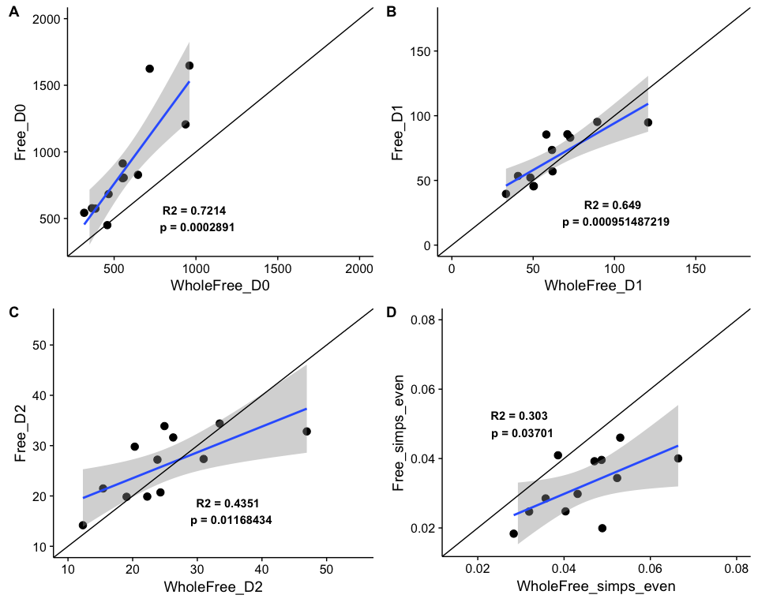

```r
# Plot diversity based on lakesite lumped together
ggplot(filter(fraction_divs, fraction %in% c("Free","WholeFree")),
       aes(x = lakesite, y = div_value)) + 
  geom_jitter(aes(color = lakesite), size = 3, width = 0.2) + 
  geom_boxplot(aes(fill = lakesite), alpha =0.5) +
  scale_color_manual(values = lakesite_colors) + 
  scale_fill_manual(values = lakesite_colors) + 
  facet_wrap(~div_metric, scales = "free_y") +
  theme(axis.text.x = element_text(angle = 30, hjust = 1, vjust = 1),
        legend.position = c(0.07, 0.93), 
        strip.background = element_rect(fill = NA), 
        strip.text.x = element_text(face = "bold"))
```

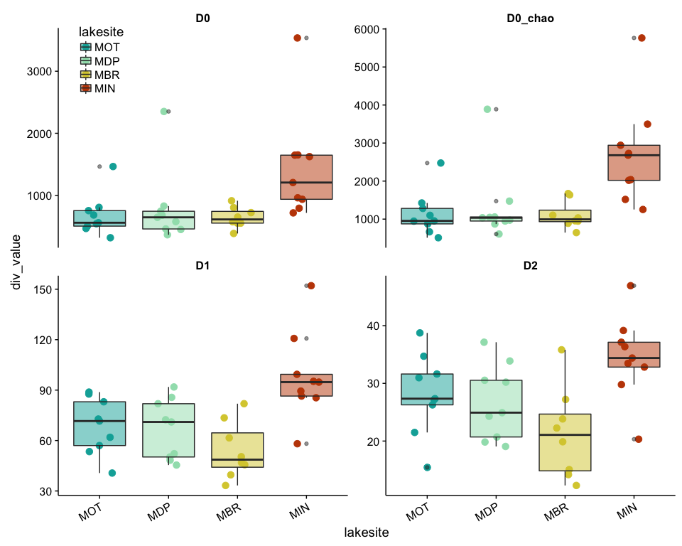

```r
# Value of Diversity estimate on y-axis and site vs fraction on x-axis
ggplot(filter(fraction_divs, fraction %in% c("Free","WholeFree")),
       aes(x = lakesite, y = div_value)) + 
  geom_jitter(aes(color = fraction), size = 3, position = position_dodge(width = 0.8)) + 
  geom_boxplot(aes(fill = fraction), alpha =0.5) +
  scale_color_manual(values = fraction_colors) + 
  scale_fill_manual(values = fraction_colors) + 
  facet_wrap(~div_metric, scales = "free_y") +
  theme(axis.text.x = element_text(angle = 30, hjust = 1, vjust = 1),
        legend.position = c(0.07, 0.93), 
        strip.background = element_rect(fill = NA), 
        strip.text.x = element_text(face = "bold"))
```


```r
###  ARE THERE DIFFERENCES BETWEEN FRACTION AND LAKESITE WITHIN THE FREE LIVING?
free_fraction_divs <- filter(fraction_divs, fraction %in% c("Free","WholeFree"))
#### Significant difference between D0 lakesite and fraction?
summary(aov(div_value ~ fraction*lakesite,  
            data = filter(free_fraction_divs, div_metric == "D0")))
```

```
##                   Df  Sum Sq Mean Sq F value Pr(>F)  
## fraction           1 1885943 1885943   6.589 0.0161 *
## lakesite           3 3750693 1250231   4.368 0.0124 *
## fraction:lakesite  3  457013  152338   0.532 0.6640  
## Residuals         27 7727555  286206                 
## ---
## Signif. codes:  0 '***' 0.001 '**' 0.01 '*' 0.05 '.' 0.1 ' ' 1
```

```r
#### Significant difference between D0_chao lakesite and fraction?
summary(aov(div_value ~ fraction*lakesite,  
            data = filter(free_fraction_divs, div_metric == "D0_chao")))
```

```
##                   Df   Sum Sq Mean Sq F value  Pr(>F)   
## fraction           1  4269492 4269492   5.539 0.02614 * 
## lakesite           3 15509357 5169786   6.706 0.00158 **
## fraction:lakesite  3   988254  329418   0.427 0.73502   
## Residuals         27 20813320  770864                   
## ---
## Signif. codes:  0 '***' 0.001 '**' 0.01 '*' 0.05 '.' 0.1 ' ' 1
```

```r
#### Significant difference between D1 lakesite and fraction?
summary(aov(div_value ~ fraction*lakesite,  
            data = filter(free_fraction_divs, div_metric == "D1")))
```

```
##                   Df Sum Sq Mean Sq F value   Pr(>F)    
## fraction           1   1509  1509.3   3.788 0.062109 .  
## lakesite           3   8839  2946.2   7.394 0.000908 ***
## fraction:lakesite  3     46    15.4   0.039 0.989607    
## Residuals         27  10759   398.5                     
## ---
## Signif. codes:  0 '***' 0.001 '**' 0.01 '*' 0.05 '.' 0.1 ' ' 1
```

```r
#### Significant difference between D2 lakesite and fraction?
summary(aov(div_value ~ fraction*lakesite,  
            data = filter(free_fraction_divs, div_metric == "D2")))
```

```
##                   Df Sum Sq Mean Sq F value  Pr(>F)   
## fraction           1  149.1  149.14   2.873 0.10161   
## lakesite           3  732.1  244.04   4.700 0.00912 **
## fraction:lakesite  3   31.1   10.36   0.199 0.89584   
## Residuals         27 1401.9   51.92                   
## ---
## Signif. codes:  0 '***' 0.001 '**' 0.01 '*' 0.05 '.' 0.1 ' ' 1
```

```r
# Prepare data frames for plotting diversity of wholefree vs free 
free_samps_alpha <- filter(free_meta_data, fraction == "Free" & year == "2015") %>% 
  dplyr::select(norep_filter_name, fraction, D0, D0_chao, D1, D2, simps_even) %>%
  # Make a new column called "div_metric" that includes the hill diversity metric
  gather("div_metric", "value", D0, D0_chao, D1, D2, simps_even) %>%
  # Combine the diversity metric and fraction into one column called frac_div_metric
  unite("frac_div_metric", fraction, div_metric, sep = "_") %>%
  # Spread frac_div_metric into 4 columns for each hill div metric
  spread(frac_div_metric, value) %>%
  mutate(norep_water_name = paste(substr(norep_filter_name,1,4), substr(norep_filter_name, 6, 8), sep = "")) %>%
  dplyr::select(-norep_filter_name)

# Prepare data frames for plotting diversity of wholefree vs free 
wholefree_samps_alpha <- filter(free_meta_data, fraction == "WholeFree" & year == "2015") %>% 
  dplyr::select(norep_filter_name, fraction, D0, D0_chao, D1, D2, simps_even) %>%
  # Make a new column called "div_metric" that includes the hill diversity metric
  gather(div_metric, value, D0, D1, D2, D0_chao, simps_even) %>%
  # Combine the diversity metric and fraction into one column called frac_div_metric
  unite(frac_div_metric, fraction, div_metric, sep = "_") %>%
  # Spread frac_div_metric into 4 columns for each hill div metric
  spread(frac_div_metric, value) %>%
  mutate(norep_water_name = paste(substr(norep_filter_name,1,4), substr(norep_filter_name, 6, 8), sep = "")) %>%
  dplyr::select(-norep_filter_name)

# join the data frames together 
FL_alpha <- left_join(free_samps_alpha, wholefree_samps_alpha, by = "norep_water_name")


# Is there a linear relationship between free and whole free D0 diversity?
lm_FL_D0 <- lm(Free_D0 ~ WholeFree_D0, data = FL_alpha)
# Plot linear relationship between free and whole free D0 diversity
free_fraction_D0 <- ggplot(FL_alpha, aes(x = WholeFree_D0, y = Free_D0)) + 
  geom_point(size = 3) + geom_smooth(method = "lm") +
  xlim(300, 2000) + ylim(300, 2000) + 
  geom_abline(slope = 1, intercept = 0) +
  annotate("text", x = 1000, y=500, color = "black", fontface = "bold",
           label = paste("R2 =", round(summary(lm_FL_D0)$adj.r.squared, digits = 4), "\n", 
                         "p =", round(unname(summary(lm_FL_D0)$coefficients[,4][2]), digits = 8)))


# Is there a linear relationship between free and whole free D0_chao diversity?
lm_FL_simps_D0_chao <- lm(Free_D0_chao ~ WholeFree_D0_chao, data = FL_alpha)
# Plot linear relationship between free and whole free D0 diversity
free_fraction_D0_chao <- ggplot(FL_alpha, aes(x = WholeFree_D0_chao, y = Free_D0_chao)) + 
  geom_point(size = 3) + geom_smooth(method = "lm") +
  xlim(300, 3600) + ylim(300, 3600) +
  geom_abline(slope = 1, intercept = 0) +
  annotate("text", x = 3000, y=500, color = "black", fontface = "bold",
           label = paste("R2 =", round(summary(lm_FL_simps_D0_chao)$adj.r.squared, digits = 4), "\n", 
                         "p =", round(unname(summary(lm_FL_simps_D0_chao)$coefficients[,4][2]), digits = 5)))


# Is there a linear relationship between free and whole free D1 diversity?
lm_FL_D1 <- lm(Free_D1 ~ WholeFree_D1, data = FL_alpha)
# Plot linear relationship between free and whole free D1 diversity
free_fraction_D1 <- ggplot(FL_alpha, aes(x = WholeFree_D1, y = Free_D1)) + 
  geom_point(size = 3) + geom_smooth(method = "lm") +
  xlim(0, 175) + ylim(0,175) + 
  geom_abline(slope = 1, intercept = 0) +
  annotate("text", x = 100, y=25, color = "black", fontface = "bold",
           label = paste("R2 =", round(summary(lm_FL_D1)$adj.r.squared, digits = 4), "\n", 
                         "p =", round(unname(summary(lm_FL_D1)$coefficients[,4][2]), digits = 12)))

# Is there a linear relationship between free and whole free D2 diversity?
lm_FL_D2 <- lm(Free_D2 ~ WholeFree_D2, data = FL_alpha)
# Plot linear relationship between free and whole free D2 diversity
free_fraction_D2 <- ggplot(FL_alpha, aes(x = WholeFree_D2, y = Free_D2)) + 
  geom_point(size = 3) + geom_smooth(method = "lm") +
  xlim(10, 55) + ylim(10, 55) +
  geom_abline(slope = 1, intercept = 0) +
  annotate("text", x = 35, y=17, color = "black", fontface = "bold",
           label = paste("R2 =", round(summary(lm_FL_D2)$adj.r.squared, digits = 4), "\n", 
                         "p =", round(unname(summary(lm_FL_D2)$coefficients[,4][2]), digits = 8)))
  
free_vs_freepart_div_plots <- plot_grid(free_fraction_D0, free_fraction_D0_chao, free_fraction_D1, free_fraction_D2, 
          labels = c("A", "B", "C", "D"), ncol = 2, nrow = 2)

free_vs_freepart_div_plots
```

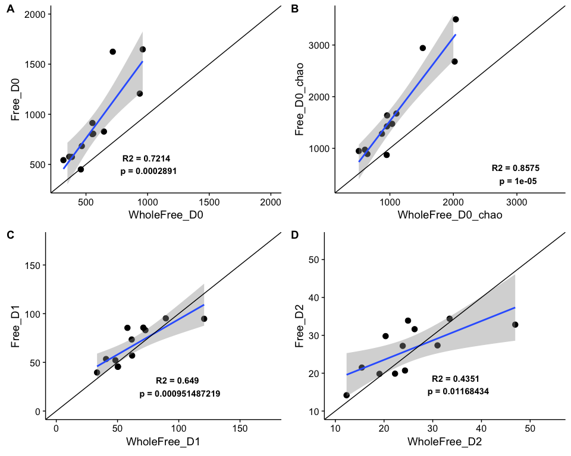

```r
#ggsave("../Figures/free_vs_wholefree_div_plots.png", plot = free_vs_freepart_div_plots, dpi = 600, width = 10, height = 8)
```

##  Particle-Associated Diversity Comparison 

```r
# Plot diversity based only on fraction 
ggplot(filter(fraction_divs, fraction %in% c("Particle","WholePart")),
       aes(x = fraction, y = div_value)) + 
  geom_jitter(aes(color = fraction), size = 3, width = 0.2) + 
  geom_boxplot(aes(fill = fraction), alpha =0.5) +
  scale_color_manual(values = fraction_colors) + 
  scale_fill_manual(values = fraction_colors) + 
  facet_wrap(~div_metric, scales = "free_y") +
  theme(axis.text.x = element_text(angle = 30, hjust = 1, vjust = 1),
        legend.position = c(0.07, 0.93), 
        strip.background = element_rect(fill = NA), 
        strip.text.x = element_text(face = "bold"))
```

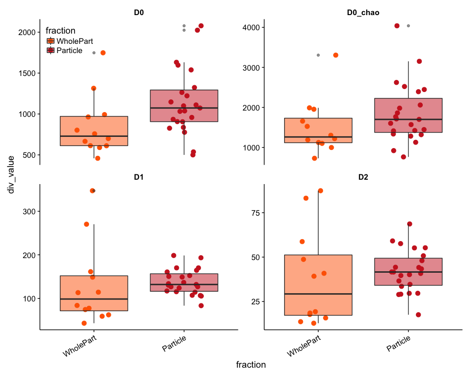

```r
# Plot based on lakesite lumped together
ggplot(filter(fraction_divs, fraction %in% c("Particle","WholePart")),
       aes(x = lakesite, y = div_value)) + 
  geom_jitter(aes(color = lakesite), size = 3, width = 0.2) + 
  geom_boxplot(aes(fill = lakesite), alpha =0.5) +
  scale_color_manual(values = lakesite_colors) + 
  scale_fill_manual(values = lakesite_colors) + 
  facet_wrap(~div_metric, scales = "free_y") +
  theme(axis.text.x = element_text(angle = 30, hjust = 1, vjust = 1),
        legend.position = c(0.07, 0.93), 
        strip.background = element_rect(fill = NA), 
        strip.text.x = element_text(face = "bold"))
```

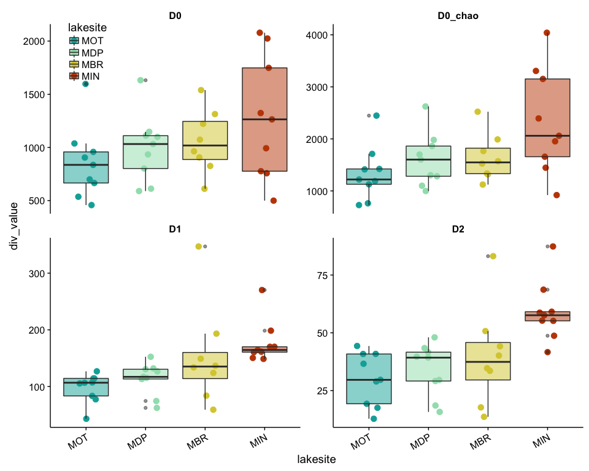

```r
# Value of Diversity estimate on y-axis and site vs fraction on x-axis
ggplot(filter(fraction_divs, fraction %in% c("Particle","WholePart")),
       aes(x = lakesite, y = div_value)) + 
  geom_jitter(aes(color = fraction), size = 3, position = position_dodge(width = 0.8)) + 
  geom_boxplot(aes(fill = fraction), alpha =0.5) +
  scale_color_manual(values = fraction_colors) + 
  scale_fill_manual(values = fraction_colors) + 
  facet_wrap(~div_metric, scales = "free_y") +
  theme(axis.text.x = element_text(angle = 30, hjust = 1, vjust = 1),
        legend.position = c(0.07, 0.93), 
        strip.background = element_rect(fill = NA), 
        strip.text.x = element_text(face = "bold"))
```

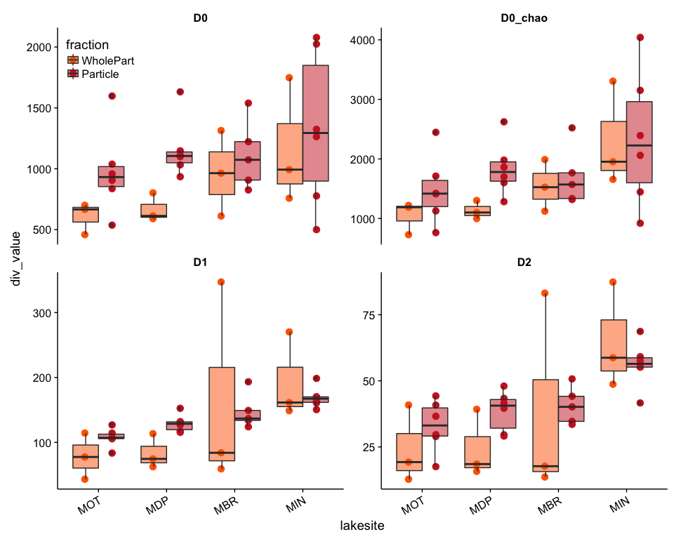

```r
###  ARE THERE DIFFERENCES BETWEEN FRACTION AND LAKESITE WITHIN PARTICLE ASSOCIATION?
part_fraction_divs <- filter(fraction_divs, fraction %in% c("Particle","WholePart"))

#### Significant difference between D0 lakesite and fraction?
summary(aov(div_value ~ fraction*lakesite,  
            data = filter(part_fraction_divs, div_metric == "D0")))
```

```
##                   Df  Sum Sq Mean Sq F value Pr(>F)  
## fraction           1  685338  685338   4.503 0.0432 *
## lakesite           3  822904  274301   1.802 0.1705  
## fraction:lakesite  3  162963   54321   0.357 0.7845  
## Residuals         27 4109019  152186                 
## ---
## Signif. codes:  0 '***' 0.001 '**' 0.01 '*' 0.05 '.' 0.1 ' ' 1
```

```r
#### Significant difference between D0_chao lakesite and fraction?
summary(aov(div_value ~ fraction*lakesite,  
            data = filter(part_fraction_divs, div_metric == "D0_chao")))
```

```
##                   Df   Sum Sq Mean Sq F value Pr(>F)  
## fraction           1   902548  902548   1.998 0.1690  
## lakesite           3  4767452 1589151   3.517 0.0284 *
## fraction:lakesite  3   544907  181636   0.402 0.7527  
## Residuals         27 12199221  451823                 
## ---
## Signif. codes:  0 '***' 0.001 '**' 0.01 '*' 0.05 '.' 0.1 ' ' 1
```

```r
#### Significant difference between D1 lakesite and fraction?
summary(aov(div_value ~ fraction*lakesite,  
            data = filter(part_fraction_divs, div_metric == "D1")))
```

```
##                   Df Sum Sq Mean Sq F value Pr(>F)  
## fraction           1    526     526   0.203 0.6560  
## lakesite           3  35396   11799   4.553 0.0105 *
## fraction:lakesite  3   6886    2295   0.886 0.4609  
## Residuals         27  69966    2591                 
## ---
## Signif. codes:  0 '***' 0.001 '**' 0.01 '*' 0.05 '.' 0.1 ' ' 1
```

```r
#### Significant difference between D2 lakesite and fraction?
summary(aov(div_value ~ fraction*lakesite,  
            data = filter(part_fraction_divs, div_metric == "D2")))
```

```
##                   Df Sum Sq Mean Sq F value  Pr(>F)   
## fraction           1    138   138.2   0.627 0.43536   
## lakesite           3   4498  1499.3   6.802 0.00146 **
## fraction:lakesite  3    572   190.7   0.865 0.47111   
## Residuals         27   5951   220.4                   
## ---
## Signif. codes:  0 '***' 0.001 '**' 0.01 '*' 0.05 '.' 0.1 ' ' 1
```

```r
# Prepare data frames for plotting diversity of wholepart vs particle 
part_samps_alpha <- filter(part_meta_data, fraction == "Particle" & year == "2015") %>% # & norep_filter_name != "MBRHJ515"
  select(norep_filter_name, fraction, D0, D0_chao, D1, D2, simps_even) %>%
  gather("div_metric", "value", D0, D0_chao, D1, D2, simps_even) %>%
  unite("frac_div_metric", fraction, div_metric, sep = "_") %>%
  spread(frac_div_metric, value) %>%
  mutate(norep_water_name = paste(substr(norep_filter_name,1,4), substr(norep_filter_name, 6, 8), sep = "")) %>%
  select(-norep_filter_name)

# Prepare data frames for plotting diversity of wholepart vs particle 
wholepart_samps_alpha <- filter(part_meta_data, fraction == "WholePart" & year == "2015") %>% # & norep_filter_name != "MBRHJ515"
  select(norep_filter_name, fraction, D0, D0_chao, D1, D2, simps_even) %>%
  gather(div_metric, value, D0, D0_chao, D1, D2, simps_even) %>%
  unite(frac_div_metric, fraction, div_metric, sep = "_") %>%
  spread(frac_div_metric, value) %>%
  mutate(norep_water_name = paste(substr(norep_filter_name,1,4), substr(norep_filter_name, 6, 8), sep = "")) %>%
  select(-norep_filter_name)

# Combine the data frames into one
PA_alpha <- left_join(part_samps_alpha, wholepart_samps_alpha, by = "norep_water_name")

# Is there a linear relationship between particle and WholePart D0 diversity?
lm_PA_D0 <- lm(Particle_D0 ~ WholePart_D0, data = PA_alpha)
# Plot the linear relationship between particle and WholePart D0 diversity
PA_fraction_D0 <- ggplot(PA_alpha, aes(x = WholePart_D0, y = Particle_D0)) + 
  geom_point(size = 3) + geom_smooth(method = "lm", se = FALSE) +
  xlim(0, 2200) + ylim(0, 2200) + 
  geom_abline(slope = 1, intercept = 0) +
  annotate("text", x = 1500, y=300, color = "black", fontface = "bold",
           label = paste("R2 =", round(summary(lm_PA_D0)$adj.r.squared, digits = 4), "\n", 
                         "p =", round(unname(summary(lm_PA_D0)$coefficients[,4][2]), digits = 4)))


# Is there a linear relationship between particle and WholePart D0_chao diversity?
lm_PA_D0_chao <- lm(Particle_D0_chao ~ WholePart_D0_chao, data = PA_alpha)
# Plot the linear relationship between particle and WholePart D0_chao diversity
PA_fraction_D0_chao <- ggplot(PA_alpha, aes(x = WholePart_D0_chao, y = Particle_D0_chao)) + 
  geom_point(size = 3) + geom_smooth(method = "lm", se = FALSE) +
  xlim(0, 2200) + ylim(0, 2200) + 
  geom_abline(slope = 1, intercept = 0) +
  annotate("text", x = 1500, y=300, color = "black", fontface = "bold",
           label = paste("R2 =", round(summary(lm_PA_D0_chao)$adj.r.squared, digits = 4), "\n", 
                         "p =", round(unname(summary(lm_PA_D0_chao)$coefficients[,4][2]), digits = 4)))


# Is there a linear relationship between particle and WholePart D1 diversity?
lm_PA_D1 <- lm(Particle_D1 ~ WholePart_D1, data = PA_alpha)
# Plot the linear relationship between particle and WholePart D1 diversity
PA_fraction_D1 <- ggplot(PA_alpha, aes(x = WholePart_D1, y = Particle_D1)) + 
  geom_point(size = 3) + geom_smooth(method = "lm") + 
  xlim(0, 620) + ylim(0,620) + 
  geom_abline(slope = 1, intercept = 0) +
  annotate("text", x = 150, y=500, color = "black", fontface = "bold",
           label = paste("R2 =", round(summary(lm_PA_D1)$adj.r.squared, digits = 4), "\n", 
                         "p =", round(unname(summary(lm_PA_D1)$coefficients[,4][2]), digits = 5)))

# Is there a linear relationship between particle and WholePart D2 diversity?
lm_PA_D2 <- lm(Particle_D2 ~ WholePart_D2, data = PA_alpha)
# Plot the linear relationship between particle and WholePart D2 diversity
PA_fraction_D2 <- ggplot(PA_alpha, aes(x = WholePart_D2, y = Particle_D2)) + 
  geom_point(size = 3) + geom_smooth(method = "lm") +
  xlim(10, 250) + ylim(10, 250) +
  geom_abline(slope = 1, intercept = 0) +
  annotate("text", x = 50, y=175, color = "black", fontface = "bold",
           label = paste("R2 =", round(summary(lm_PA_D2)$adj.r.squared, digits = 4), "\n", 
                         "p =", round(unname(summary(lm_PA_D2)$coefficients[,4][2]), digits = 5)))

lm_PA_simps_even <- lm(Particle_simps_even ~ WholePart_simps_even, data = PA_alpha)

PA_fraction_simps_even <- ggplot(PA_alpha, aes(x = WholePart_simps_even, y = Particle_simps_even)) + 
  geom_point(size = 3) + geom_smooth(method = "lm", se = FALSE) +
  xlim(0.01, 0.2) + ylim(0.01, 0.2) +
  geom_abline(slope = 1, intercept = 0) +
  annotate("text", x = 0.06, y=0.12, color = "black", fontface = "bold",
           label = paste("R2 =", round(summary(lm_PA_simps_even)$adj.r.squared, digits = 4), "\n", 
                         "p =", round(unname(summary(lm_PA_simps_even)$coefficients[,4][2]), digits = 5)))
  
part_vs_wholepart_div_plots <- plot_grid(PA_fraction_D0, PA_fraction_D0_chao, PA_fraction_D1, PA_fraction_D2, 
          labels = c("A", "B", "C", "D"), ncol = 2, nrow = 2)

part_vs_wholepart_div_plots
```

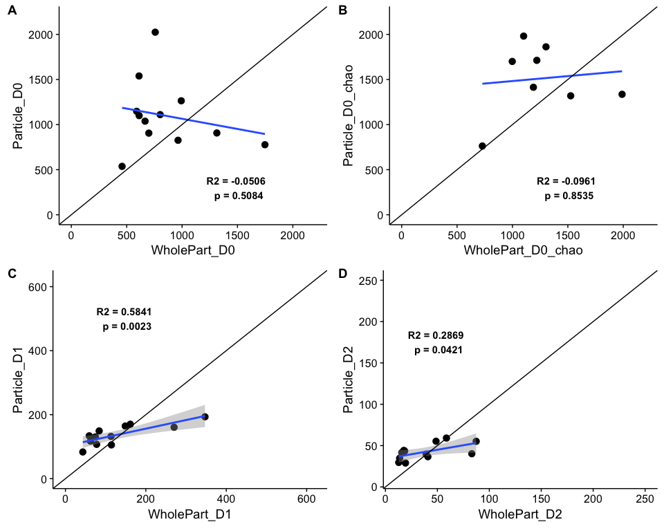

```r
#ggsave("../Figures/part_vs_wholepart_div_plots.png", plot = part_vs_wholepart_div_plots, dpi = 600, width = 10, height = 8)
```


# Is there a significant relationship between sequencing depth and diversity?

```r
## Is there a significant relationship between sequencing depth and D0?
summary(lm(D0 ~ Sample_TotalSeqs,data = filter(nosed_meta_data, fraction == "Free"))) # p = 0.002 but R2 = -0.09 
```

```
## 
## Call:
## lm(formula = D0 ~ Sample_TotalSeqs, data = filter(nosed_meta_data, 
##     fraction == "Free"))
## 
## Residuals:
##     Min      1Q  Median      3Q     Max 
## -754.32 -317.87 -152.03   22.01 1951.09 
## 
## Coefficients:
##                   Estimate Std. Error t value Pr(>|t|)   
## (Intercept)      1.343e+02  2.769e+02   0.485  0.63269   
## Sample_TotalSeqs 2.000e-02  5.366e-03   3.727  0.00125 **
## ---
## Signif. codes:  0 '***' 0.001 '**' 0.01 '*' 0.05 '.' 0.1 ' ' 1
## 
## Residual standard error: 573 on 21 degrees of freedom
## Multiple R-squared:  0.3981,	Adjusted R-squared:  0.3694 
## F-statistic: 13.89 on 1 and 21 DF,  p-value: 0.001246
```

```r
#summary(lm(D0 ~ Sample_TotalSeqs,data = filter(nosed_meta_data, fraction == "WholeFree"))) # NS
summary(lm(D0 ~ Sample_TotalSeqs,data = filter(nosed_meta_data, fraction == "Particle"))) # Significant!
```

```
## 
## Call:
## lm(formula = D0 ~ Sample_TotalSeqs, data = filter(nosed_meta_data, 
##     fraction == "Particle"))
## 
## Residuals:
##     Min      1Q  Median      3Q     Max 
## -565.72 -223.42  -70.56  130.77  751.08 
## 
## Coefficients:
##                   Estimate Std. Error t value Pr(>|t|)   
## (Intercept)      7.047e+02  1.864e+02    3.78   0.0011 **
## Sample_TotalSeqs 1.444e-02  5.577e-03    2.59   0.0171 * 
## ---
## Signif. codes:  0 '***' 0.001 '**' 0.01 '*' 0.05 '.' 0.1 ' ' 1
## 
## Residual standard error: 362.4 on 21 degrees of freedom
## Multiple R-squared:  0.2421,	Adjusted R-squared:  0.206 
## F-statistic: 6.708 on 1 and 21 DF,  p-value: 0.01708
```

```r
#summary(lm(D0 ~ Sample_TotalSeqs,data = filter(nosed_meta_data, fraction == "WholePart"))) # NS

# Plot Sequencing depth vs D0
ggplot(nosed_meta_data, aes(x = Sample_TotalSeqs, y = D0)) + 
  geom_point(size = 3) + 
  facet_grid(.~fraction, scale = "free_x") + 
  geom_smooth(method = "lm", data = filter(nosed_meta_data, fraction %in% c("Free", "Particle"))) + 
  ggtitle("D0: Species Richness") + 
  theme(axis.text.x = element_text(angle = 30, hjust = 1, vjust = 1),
        legend.position = c(0.1, 0.9), 
        strip.background = element_rect(fill = NA), 
        strip.text.x = element_text(face = "bold"))
```

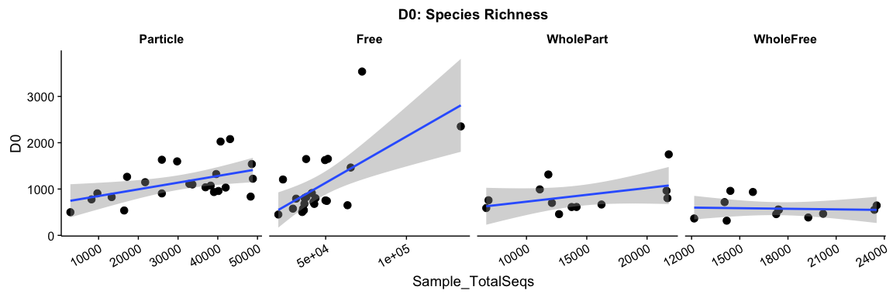

```r
## Is there a significant relationship between sequencing depth and D0_chao?
summary(lm(D0_chao ~ Sample_TotalSeqs,data = filter(nosed_meta_data, fraction == "Free"))) # pval = 0.006, R2 = 0.27  
```

```
## 
## Call:
## lm(formula = D0_chao ~ Sample_TotalSeqs, data = filter(nosed_meta_data, 
##     fraction == "Free"))
## 
## Residuals:
##      Min       1Q   Median       3Q      Max 
## -1404.38  -648.51  -180.91     8.99  3137.59 
## 
## Coefficients:
##                   Estimate Std. Error t value Pr(>|t|)   
## (Intercept)      423.90917  516.43541   0.821  0.42096   
## Sample_TotalSeqs   0.03035    0.01001   3.033  0.00633 **
## ---
## Signif. codes:  0 '***' 0.001 '**' 0.01 '*' 0.05 '.' 0.1 ' ' 1
## 
## Residual standard error: 1069 on 21 degrees of freedom
## Multiple R-squared:  0.3046,	Adjusted R-squared:  0.2715 
## F-statistic: 9.198 on 1 and 21 DF,  p-value: 0.006329
```

```r
#summary(lm(D0_chao ~ Sample_TotalSeqs,data = filter(nosed_meta_data, fraction == "WholeFree"))) # NS
#summary(lm(D0_chao ~ Sample_TotalSeqs,data = filter(nosed_meta_data, fraction == "Particle"))) # NS
#summary(lm(D0_chao ~ Sample_TotalSeqs,data = filter(nosed_meta_data, fraction == "WholePart"))) #  NS

# Plot the relationship between D0_chao and sequencing depth 
ggplot(nosed_meta_data, aes(x = Sample_TotalSeqs, y = D0_chao)) + 
  geom_point(size = 3) + 
  facet_grid(.~fraction, scale = "free_x") + 
  geom_smooth(method = "lm", data = filter(nosed_meta_data, fraction == "Free")) + 
  ggtitle("D0: Chao 1") + 
  theme(axis.text.x = element_text(angle = 30, hjust = 1, vjust = 1),
        legend.position = c(0.1, 0.9), 
        strip.background = element_rect(fill = NA), 
        strip.text.x = element_text(face = "bold"))
```

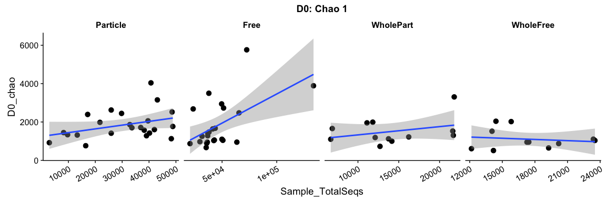

```r
## Is there a significant relationship between sequencing depth and D1?
#summary(lm(D1 ~ Sample_TotalSeqs,data = filter(nosed_meta_data, fraction == "Free"))) # NS
#summary(lm(D1 ~ Sample_TotalSeqs,data = filter(nosed_meta_data, fraction == "WholeFree"))) # NS 
#summary(lm(D1 ~ Sample_TotalSeqs,data = filter(nosed_meta_data, fraction == "Particle"))) # NS
#summary(lm(D1 ~ Sample_TotalSeqs,data = filter(nosed_meta_data, fraction == "WholePart"))) # NS

# Plot the relationship between D1 and sequencing depth 
ggplot(nosed_meta_data, aes(x = Sample_TotalSeqs, y = D1)) + 
  geom_point(size = 3) + 
  facet_grid(.~fraction, scale = "free_x") + 
  ggtitle("D1: Exponential of Shannon Entropy") + 
  theme(axis.text.x = element_text(angle = 30, hjust = 1, vjust = 1),
        legend.position = c(0.1, 0.9), 
        strip.background = element_rect(fill = NA), 
        strip.text.x = element_text(face = "bold"))
```


```r
## Is there a significant relationship between sequencing depth and D2?
#summary(lm(D2 ~ Sample_TotalSeqs,data = filter(nosed_meta_data, fraction == "Free"))) # NS
#summary(lm(D2 ~ Sample_TotalSeqs,data = filter(nosed_meta_data, fraction == "WholeFree"))) # NS 
#summary(lm(D2 ~ Sample_TotalSeqs,data = filter(nosed_meta_data, fraction == "Particle"))) # NS
#summary(lm(D2 ~ Sample_TotalSeqs,data = filter(nosed_meta_data, fraction == "WholePart"))) # NS

# Plot the relationship between D2 and sequencing depth 
ggplot(nosed_meta_data, aes(x = Sample_TotalSeqs, y = D2)) + 
  geom_point(size = 3) + 
  facet_grid(.~fraction, scale = "free_x") + 
  ggtitle("D2: Inverse Simpson") + 
  theme(axis.text.x = element_text(angle = 30, hjust = 1, vjust = 1),
        legend.position = c(0.1, 0.9), 
        strip.background = element_rect(fill = NA), 
        strip.text.x = element_text(face = "bold"))
```

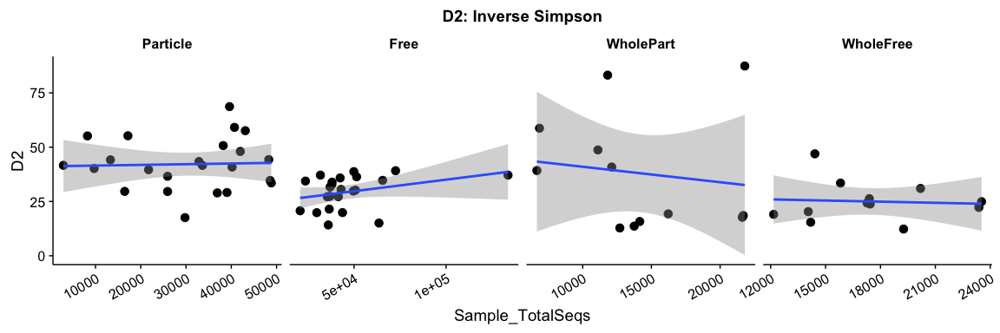


# Is there a relationship between diversity and productivity?

**Note:** The total production data is only for the surface during 2014 and 2015!

## D0 vs Total Production

```r
#### FREE LIVING SAMPLES VS TOTAL BACTERIAL PRODUCTION 
# Is there a significant relationship between FL D0 and total production?
lm_freeonly_totprod_D0 <- lm(tot_bacprod ~ D0, data = free_only)
# Plot the relationship 
plot_totprod_free_D0 <-  ggplot(free_only, aes(y = tot_bacprod, x = D0)) +
  geom_point(aes(color = lakesite), size = 3) +
  scale_color_manual(values = lakesite_colors) +
  geom_smooth(method = "lm", color = "black") + 
  ggtitle("20 um Prefiltered Free-Living Only") + 
  annotate("text",  x = 2250, y = 5, # For D2:  x = 40, y=5, 
           color = "black", fontface = "bold",
           label = paste("R2 =", round(summary(lm_freeonly_totprod_D0)$adj.r.squared, digits = 4), "\n", 
                         "p =", round(unname(summary(lm_freeonly_totprod_D0)$coefficients[,4][2]), digits = 4)))+
  theme(legend.position = c(0.8, 0.1), 
        legend.text = element_text(size = 10))


# Individually for 2014 and 2015, the trend is NS 
# summary(lm(tot_bacprod ~ D0, data = filter(free_only, year == "2014"))) # NS
# summary(lm(tot_bacprod ~ D0, data = filter(free_only, year == "2015"))) # NS

# The trend is close to signifincant!
lm_wholefreeonly_totprod_D0 <- lm(tot_bacprod ~ D0, data = wholefree_only)
# Plot the relationship between wholefree and total production 
plot_totprod_wholefree_D0 <- ggplot(wholefree_only, aes(y = tot_bacprod, x = D0)) +
  geom_point(aes(color = lakesite), size = 3) +
  scale_color_manual(values = lakesite_colors) +
  geom_smooth(method = "lm", color = "black") + 
  ggtitle("WholeFree Only") + 
  annotate("text",  x = 800, y = 2, # For D2:  x = 40, y=5, 
           color = "black", fontface = "bold",
           label = paste("R2 =", round(summary(lm_wholefreeonly_totprod_D0)$adj.r.squared, digits = 4), "\n", 
                         "p =", round(unname(summary(lm_wholefreeonly_totprod_D0)$coefficients[,4][2]), digits = 4)))+
  theme(legend.position = c(0.12, 0.8), 
        legend.text = element_text(size = 10))


## Prefiltered 2015 free only 
free_only_2015_D0 <- filter(free_only, year == "2015")
lm_free2015_only_totprod_D0 <- lm(tot_bacprod ~ D0, data = free_only_2015_D0) 
plot_totprod_freeonly_2015_D0 <- ggplot(free_only_2015_D0, aes(y = tot_bacprod, x = D0)) +
  geom_point(aes(color = lakesite), size = 3) +
  scale_color_manual(values = lakesite_colors) +
  #geom_smooth(method = "lm", color = "black") + 
  ggtitle("2015 Prefiltered Free-Living") + 
  annotate("text", x = 1250, y=20, 
           color = "black", fontface = "bold",
           label = paste("R2 =", round(summary(lm_free2015_only_totprod_D0)$adj.r.squared, digits = 4), "\n", 
                         "p =", round(unname(summary(lm_free2015_only_totprod_D0)$coefficients[,4][2]), digits = 4))) +
  theme(legend.position = c(0.12, 0.8), 
        legend.text = element_text(size = 10))


#### PARTICLE ASSOCIATED SAMPLES VS TOTAL BACTERIAL PRODUCTION 
# Is there a significant relationship?
lm_partonly_totprod_D0 <- lm(tot_bacprod ~ D0, data = part_only)
# Plot the relationship 
plot_totprod_part_D0 <- ggplot(part_only, aes(y = tot_bacprod, x = D0)) +
  geom_point(aes(color = lakesite), size = 3) +
  scale_color_manual(values = lakesite_colors) +
  ggtitle("2014 & 2015 Prefiltered Particle") + 
  annotate("text", x = 1700, y = 75, # For D2:  x = 40, y=5, 
           color = "black", fontface = "bold",
           label = paste("R2 =", round(summary(lm_partonly_totprod_D0)$adj.r.squared, digits = 4), "\n", 
                         "p =", round(unname(summary(lm_partonly_totprod_D0)$coefficients[,4][2]), digits = 4))) +
  theme(legend.position = c(0.8, 0.1), 
        legend.text = element_text(size = 10))

# Trend is NS in 2014 & 2015
#summary(lm(tot_bacprod ~ D0, data = filter(part_only, year == "2014"))) # NS
#summary(lm(tot_bacprod ~ D0, data = filter(part_only, year == "2015"))) # NS

### Different particulate fractions 
## Particle (20-3um) fraction only 
part_only_2015_D0 <- filter(part_only, year == "2015")
lm_part2015_only_totprod_D0 <- lm(tot_bacprod ~ D0, data = part_only_2015_D0) 
plot_totprod_partonly_2015_D0 <- ggplot(part_only_2015_D0, aes(y = tot_bacprod, x = D0)) +
  geom_point(aes(color = lakesite), size = 3) +
  scale_color_manual(values = lakesite_colors) +
  #geom_smooth(method = "lm", color = "black") + 
  ggtitle("2015 Prefiltered Particle") + 
  annotate("text", x = 1800, y=15, 
           color = "black", fontface = "bold",
           label = paste("R2 =", round(summary(lm_part2015_only_totprod_D0)$adj.r.squared, digits = 4), "\n", 
                         "p =", round(unname(summary(lm_part2015_only_totprod_D0)$coefficients[,4][2]), digits = 4))) +
  theme(legend.position = c(0.12, 0.7), 
        legend.text = element_text(size = 10))


# The trend is signifincant!
lm_wholepartonly_totprod_D0 <- lm(tot_bacprod ~ D0, data = wholepart_only)
# Plot the relationship between wholepart and total production 
plot_totprod_wholepart_D0 <- ggplot(wholepart_only, aes(y = tot_bacprod, x = D0)) +
  geom_point(aes(color = lakesite), size = 3) +
  scale_color_manual(values = lakesite_colors) +
  geom_smooth(method = "lm", color = "black") + 
  ggtitle("WholePart Only") + 
  annotate("text",  x = 1400, y = 5, # For D2:  x = 40, y=5, 
           color = "black", fontface = "bold",
           label = paste("R2 =", round(summary(lm_wholepartonly_totprod_D0)$adj.r.squared, digits = 4), "\n", 
                         "p =", round(unname(summary(lm_wholepartonly_totprod_D0)$coefficients[,4][2]), digits = 4)))+
  theme(legend.position = c(0.12, 0.7), 
        legend.text = element_text(size = 10))

### Plot it all together for the pre-filtered fractions 
plot_D0_totprod_prefilt <- plot_grid(plot_totprod_free_D0, plot_totprod_part_D0,
          labels = c("A", "B"), ncol = 2)
plot_D0_totprod_prefilt
```

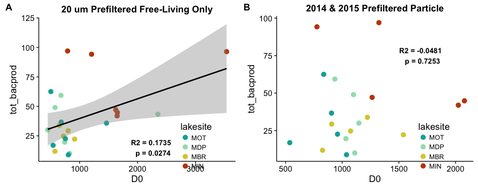

```r
### Plot it all together for both of the free living fractions fractions 
plot_D0_totprod_FL_comparison <- plot_grid(plot_totprod_freeonly_2015_D0, plot_totprod_wholefree_D0,
          labels = c("A", "B"), ncol = 2)
plot_D0_totprod_FL_comparison
```

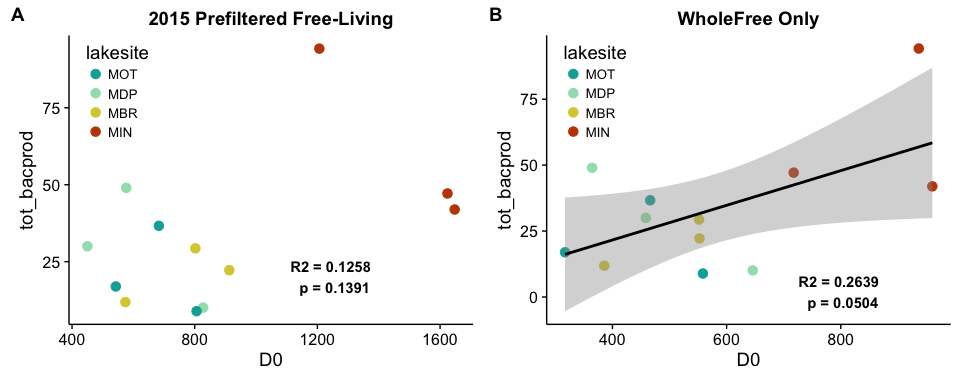

```r
### Plot it all together for both of the particle associated fractions fractions 
plot_D0_totprod_PA_comparison <- plot_grid(plot_totprod_partonly_2015_D0, plot_totprod_wholepart_D0,
          labels = c("A", "B"), ncol = 2)
plot_D0_totprod_PA_comparison
```

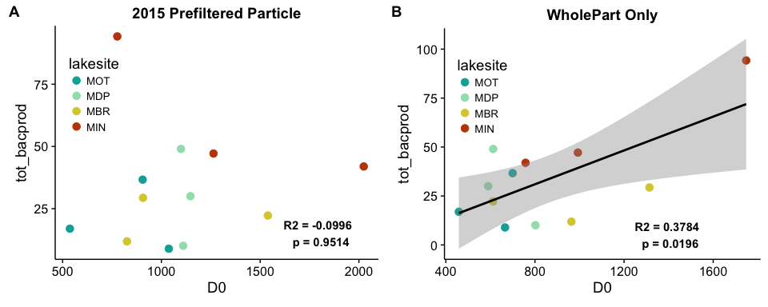


## D1 vs Total Production

```
## 
## Call:
## lm(formula = tot_bacprod ~ D1, data = free_only)
## 
## Residuals:
##     Min      1Q  Median      3Q     Max 
## -35.605 -13.805  -5.895  11.639  50.840 
## 
## Coefficients:
##             Estimate Std. Error t value Pr(>|t|)   
## (Intercept)  -2.8194    15.7627  -0.179  0.85976   
## D1            0.5663     0.1952   2.901  0.00854 **
## ---
## Signif. codes:  0 '***' 0.001 '**' 0.01 '*' 0.05 '.' 0.1 ' ' 1
## 
## Residual standard error: 22.68 on 21 degrees of freedom
## Multiple R-squared:  0.2861,	Adjusted R-squared:  0.2521 
## F-statistic: 8.417 on 1 and 21 DF,  p-value: 0.008541
```

```
## 
## Call:
## lm(formula = tot_bacprod ~ D1, data = filter(free_only, year == 
##     "2014"))
## 
## Residuals:
##     Min      1Q  Median      3Q     Max 
## -27.316 -17.080  -8.436  11.435  48.405 
## 
## Coefficients:
##             Estimate Std. Error t value Pr(>|t|)  
## (Intercept)  -2.0794    26.9704  -0.077   0.9402  
## D1            0.5859     0.2974   1.970   0.0803 .
## ---
## Signif. codes:  0 '***' 0.001 '**' 0.01 '*' 0.05 '.' 0.1 ' ' 1
## 
## Residual standard error: 24.04 on 9 degrees of freedom
## Multiple R-squared:  0.3013,	Adjusted R-squared:  0.2237 
## F-statistic: 3.881 on 1 and 9 DF,  p-value: 0.08033
```

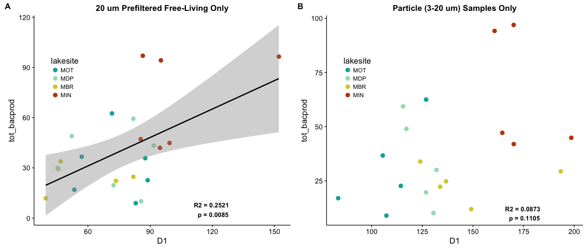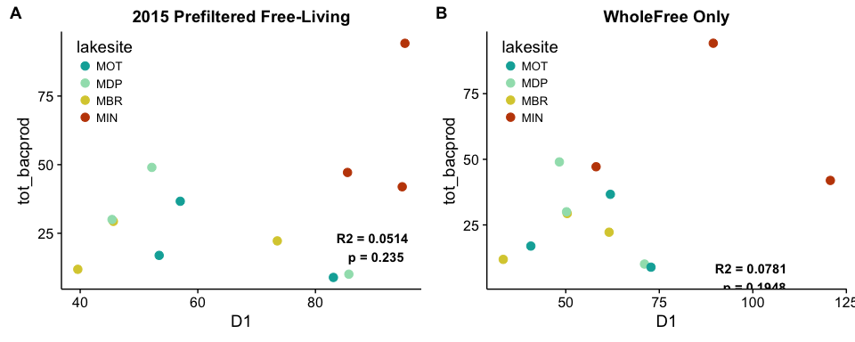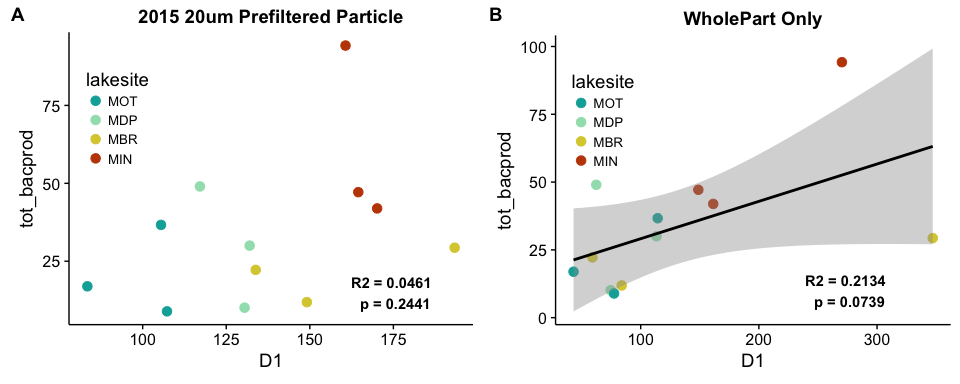

## D2 vs Total Production

```
## 
## Call:
## lm(formula = tot_bacprod ~ D2, data = wholepart_only_2015)
## 
## Residuals:
##     Min      1Q  Median      3Q     Max 
## -31.536  -9.476  -2.387   4.804  30.750 
## 
## Coefficients:
##             Estimate Std. Error t value Pr(>|t|)  
## (Intercept)   9.9256     9.3408   1.063   0.3129  
## D2            0.6127     0.2038   3.007   0.0132 *
## ---
## Signif. codes:  0 '***' 0.001 '**' 0.01 '*' 0.05 '.' 0.1 ' ' 1
## 
## Residual standard error: 18.11 on 10 degrees of freedom
## Multiple R-squared:  0.4748,	Adjusted R-squared:  0.4222 
## F-statistic: 9.039 on 1 and 10 DF,  p-value: 0.0132
```

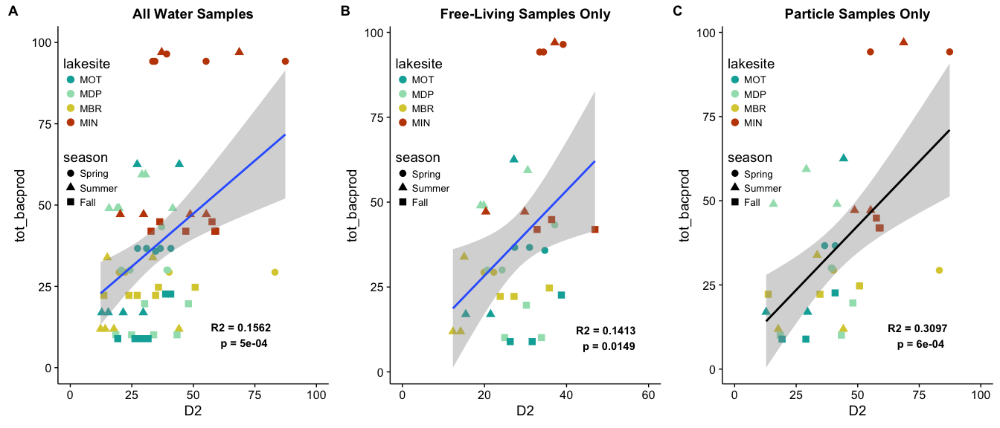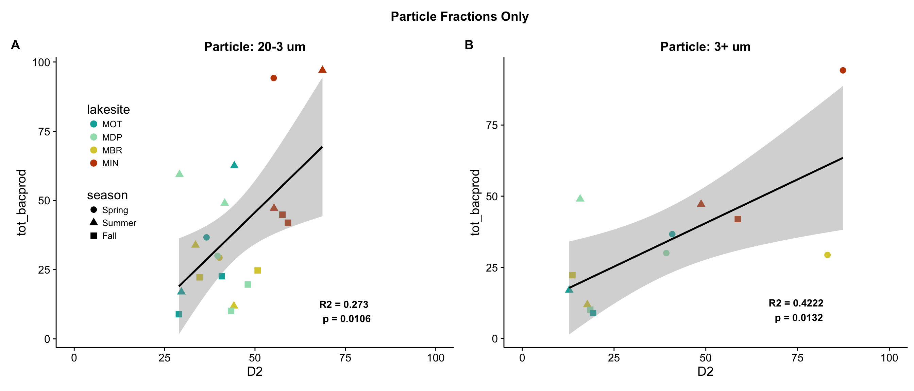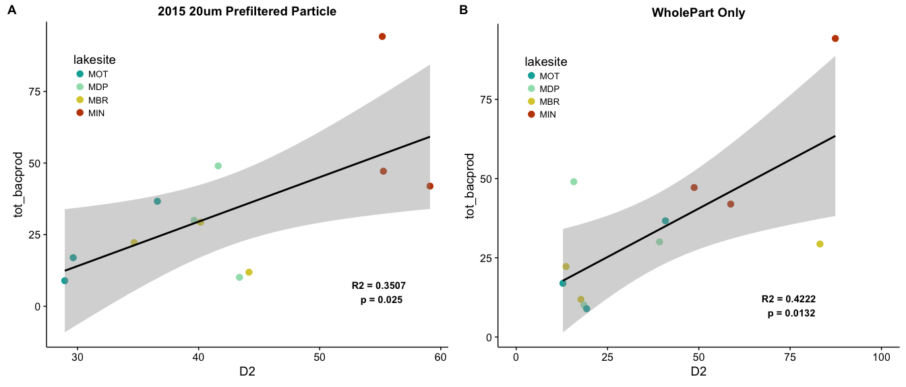


# Is there a relationship between HNA cells per uL and Total Production?
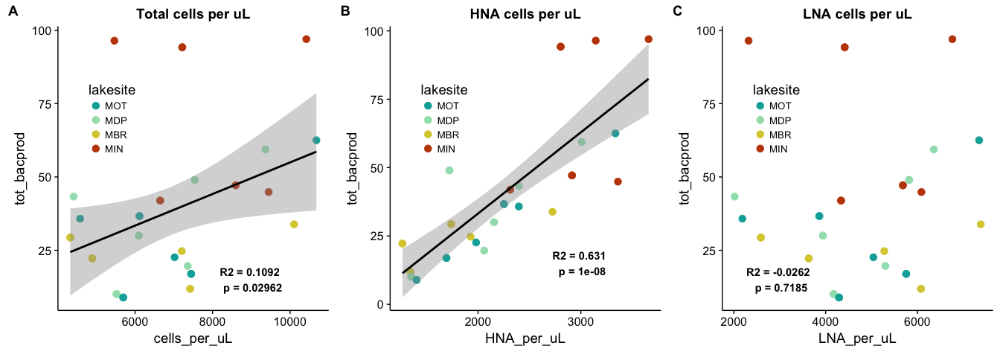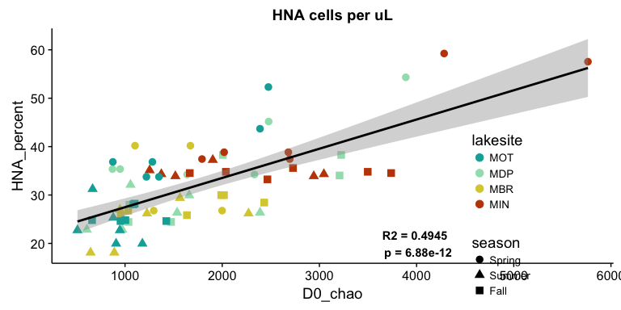

```
## [1] 0.4911129
```

```
## 
## 	Pearson's product-moment correlation
## 
## data:  free_meta_data$D2 and free_meta_data$HNA_percent
## t = 4.6491, df = 68, p-value = 1.584e-05
## alternative hypothesis: true correlation is not equal to 0
## 95 percent confidence interval:
##  0.2895530 0.6509662
## sample estimates:
##       cor 
## 0.4911129
```

```
## [1] 0.4780852
```

```
## 
## 	Pearson's product-moment correlation
## 
## data:  free_meta_data$D1 and free_meta_data$HNA_percent
## t = 4.4886, df = 68, p-value = 2.843e-05
## alternative hypothesis: true correlation is not equal to 0
## 95 percent confidence interval:
##  0.2738779 0.6410457
## sample estimates:
##       cor 
## 0.4780852
```

```
## [1] 0.7018938
```

```
## 
## 	Pearson's product-moment correlation
## 
## data:  free_meta_data$D0 and free_meta_data$HNA_percent
## t = 8.126, df = 68, p-value = 1.294e-11
## alternative hypothesis: true correlation is not equal to 0
## 95 percent confidence interval:
##  0.5591364 0.8042289
## sample estimates:
##       cor 
## 0.7018938
```

```
## [1] 0.7084204
```

```
## 
## 	Pearson's product-moment correlation
## 
## data:  free_meta_data$D0_chao and free_meta_data$HNA_percent
## t = 8.2769, df = 68, p-value = 6.883e-12
## alternative hypothesis: true correlation is not equal to 0
## 95 percent confidence interval:
##  0.5679950 0.8087668
## sample estimates:
##       cor 
## 0.7084204
```


# Is there a relationship between diversity and *fractionated* bacterial production?

```
## 
## Call:
## lm(formula = frac_bacprod ~ D2, data = wholeparticle_2015_df)
## 
## Residuals:
##     Min      1Q  Median      3Q     Max 
## -7.2971 -2.1906 -0.2354  1.3639  7.6078 
## 
## Coefficients:
##             Estimate Std. Error t value Pr(>|t|)    
## (Intercept)  0.02044    2.33018   0.009 0.993173    
## D2           0.26298    0.05084   5.173 0.000417 ***
## ---
## Signif. codes:  0 '***' 0.001 '**' 0.01 '*' 0.05 '.' 0.1 ' ' 1
## 
## Residual standard error: 4.517 on 10 degrees of freedom
## Multiple R-squared:  0.7279,	Adjusted R-squared:  0.7007 
## F-statistic: 26.76 on 1 and 10 DF,  p-value: 0.0004174
```

```
## Error in eval(expr, envir, enclos): could not find function "rlm"
```

```
## Error in summary(rlm_part_otu_D2_stats): object 'rlm_part_otu_D2_stats' not found
```

```
## Error in car::Anova(rlm_part_otu_D2_stats): object 'rlm_part_otu_D2_stats' not found
```

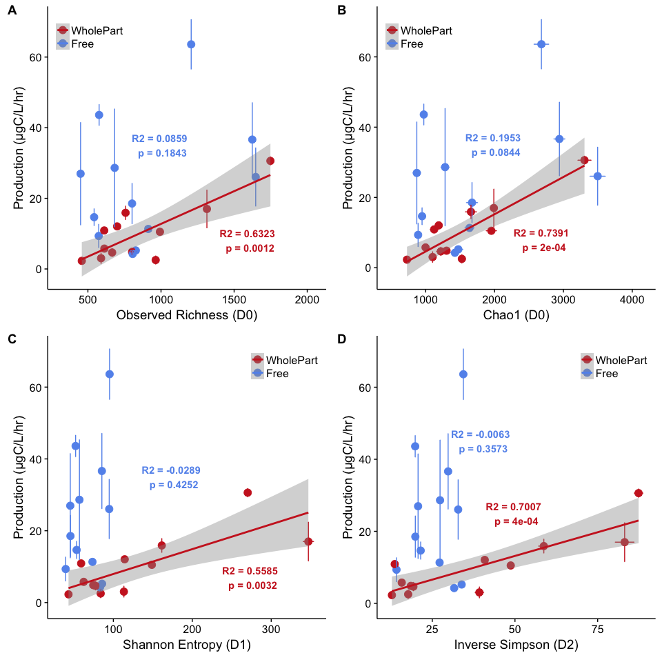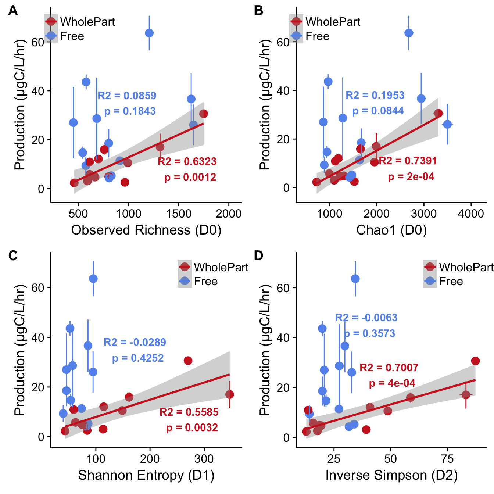


# Phylum production analysis


```
## Error in ggplot(alpha_comb_final, aes(x = Estimate, y = frac_bacprod)): object 'alpha_comb_final' not found
```


```
## Error in filter_(.data, .dots = lazyeval::lazy_dots(...)): object 'alpha_comb_final' not found
```

```
## Error in filter_(.data, .dots = lazyeval::lazy_dots(...)): object 'actinos' not found
```

```
## Error in filter_(.data, .dots = lazyeval::lazy_dots(...)): object 'actinos' not found
```

```
## Error in ggplot(actinos, aes(x = Estimate, y = frac_bacprod)): object 'actinos' not found
```

```
## Error in filter_(.data, .dots = lazyeval::lazy_dots(...)): object 'alpha_comb_final' not found
```

```
## Error in filter_(.data, .dots = lazyeval::lazy_dots(...)): object 'bacteroidetes' not found
```

```
## Error in filter_(.data, .dots = lazyeval::lazy_dots(...)): object 'bacteroidetes' not found
```

```
## Error in ggplot(bacteroidetes, aes(x = Estimate, y = frac_bacprod)): object 'bacteroidetes' not found
```


# How do the samples relate to each other? 
## PCOA


#  Stacked Bar plots for taxonomic structure
## OTU  Phylum Stacked Bar 


# Environmental Conditions 


# Calculate the Absolute abundances!


### HNA VS LNA 


