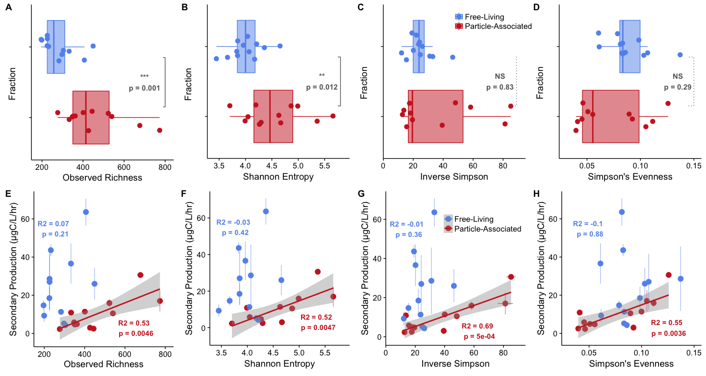
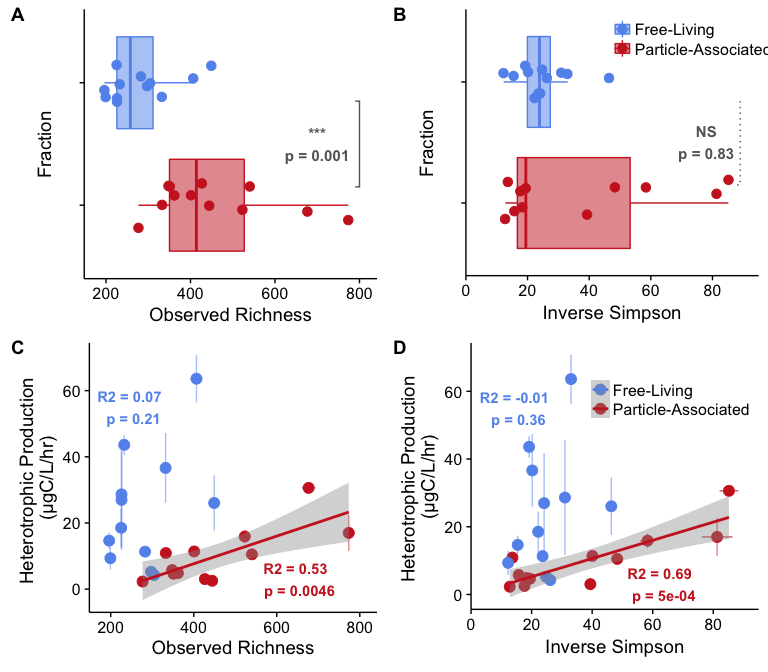
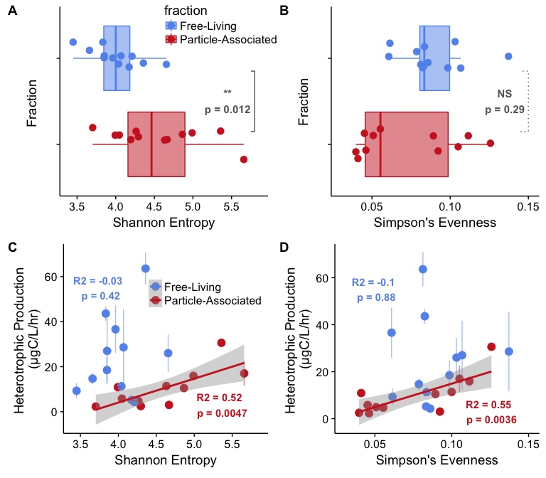
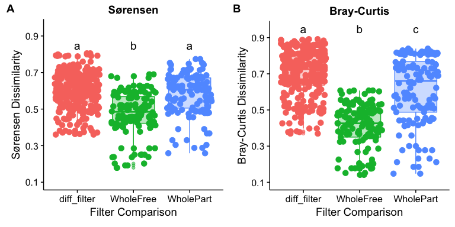

# Rarefied Diversity Analysis
Marian L. Schmidt  
February 14, 2017  
<style>
pre code, pre, code {
  white-space: pre !important;
  overflow-x: scroll !important;
  word-break: keep-all !important;
  word-wrap: initial !important;
}
</style>


```r
library(ggplot2)
library(devtools)
library(phyloseq)
library(tidyr)
library(dplyr)
library(cowplot)
library(picante) # Will also include ape and vegan 
library(car) # For residual analysis
library(sandwich) # for vcovHC function in post-hoc test
source("Muskegon_functions.R")
source("set_colors.R")
```


# Rarefied Alpha Diversity Analysis
## Remove samples with too few reads

```r
# Loads a phyloseq object named otu_merged_musk_pruned)
load("../data/otu_merged_musk_pruned.RData")
# The name of the phyloseq object is: 
otu_merged_musk_pruned 
```

```
## phyloseq-class experiment-level object
## otu_table()   OTU Table:         [ 52980 taxa and 163 samples ]
## sample_data() Sample Data:       [ 163 samples by 70 sample variables ]
## tax_table()   Taxonomy Table:    [ 52980 taxa by 8 taxonomic ranks ]
## phy_tree()    Phylogenetic Tree: [ 52980 tips and 52978 internal nodes ]
```

```r
# Productivity measurements are reliable only up to 1 decimal
df1 <- sample_data(otu_merged_musk_pruned) %>% 
  dplyr::mutate(tot_bacprod = round(tot_bacprod, digits = 1),
                SD_tot_bacprod = round(SD_tot_bacprod, digits = 1),
                frac_bacprod = round(frac_bacprod, digits = 1),
                SD_frac_bacprod = round(SD_frac_bacprod, digits = 1))
```

```
## Warning in class(x) <- c("tbl_df", "tbl", "data.frame"): Setting class(x) to multiple strings ("tbl_df", "tbl", ...); result will no longer be an S4 object
```

```r
row.names(df1) = df1$norep_filter_name


# Remove tree because it's too computationally intensive
otu_merged_musk_pruned <- merge_phyloseq(tax_table(otu_merged_musk_pruned), 
                                         sample_data(df1), 
                                         otu_table(otu_merged_musk_pruned))
otu_merged_musk_pruned
```

```
## phyloseq-class experiment-level object
## otu_table()   OTU Table:         [ 52980 taxa and 163 samples ]
## sample_data() Sample Data:       [ 163 samples by 70 sample variables ]
## tax_table()   Taxonomy Table:    [ 52980 taxa by 8 taxonomic ranks ]
```

```r
# Remove MOTHJ715 and MBRHP715
otu_merged_musk_pruned_noMOTHJ715_MBRHP715 <- subset_samples(otu_merged_musk_pruned, 
                                                             norep_filter_name != "MOTHJ715" & 
                                                               norep_filter_name != "MBRHP715")
otu_merged_musk_pruned_noMOTHJ715_MBRHP715
```

```
## phyloseq-class experiment-level object
## otu_table()   OTU Table:         [ 52980 taxa and 161 samples ]
## sample_data() Sample Data:       [ 161 samples by 70 sample variables ]
## tax_table()   Taxonomy Table:    [ 52980 taxa by 8 taxonomic ranks ]
```


```r
# Check the sequencing depth of each sample by 
sums_otu <- data.frame(rowSums(otu_table(otu_merged_musk_pruned_noMOTHJ715_MBRHP715))) 
colnames(sums_otu) <- "Sample_TotalSeqs"
sums_otu$names <- row.names(sums_otu)
sums_otu <- arrange(sums_otu, Sample_TotalSeqs) 
sums_otu <- make_metadata_norep(sums_otu)

## Add total sequences to metadata frame 
metdf <- sample_data(otu_merged_musk_pruned_noMOTHJ715_MBRHP715)
sums_otu$norep_filter_name <- sums_otu$names
sums_otu2 <- dplyr::select(sums_otu, norep_filter_name, Sample_TotalSeqs)
metdf_num2 <- left_join(metdf, sums_otu2, by = "norep_filter_name") %>%
  dplyr::select(-one_of("D0", "D0_chao", "D1", "D2", "D0_SD", "D1_sd", "D0_chao_sd"))
```

```
## Warning in class(x) <- c("tbl_df", "tbl", "data.frame"): Setting class(x) to multiple strings ("tbl_df", "tbl", ...); result will no longer be an S4 object
```

```r
row.names(metdf_num2) <- metdf_num2$norep_filter_name
# Rename the sample data 
sample_data(otu_merged_musk_pruned_noMOTHJ715_MBRHP715) <- metdf_num2
```

## Metadata Frames for Subsets

```r
### PREPARE DATA FRAMES FOR PHENOFLOW ALPHA DIVERSITY ANALYSIS
free_meta_data <- filter(metdf_num2, fraction %in% c("Free", "WholeFree") & norep_filter_name != "MOTHJ715" & limnion == "Top")
part_meta_data <- filter(metdf_num2, fraction %in% c("Particle", "WholePart") & norep_filter_name != "MOTHJ715" & limnion == "Top")
nosed_meta_data <- filter(metdf_num2, fraction != "Sediment" & limnion == "Top")

# Only "True Free Living and Particle" From 20um prefiltered samples 
free_only <- filter(free_meta_data, fraction == "Free")
part_only <- filter(part_meta_data, fraction == "Particle")

## 2015 specific samples that have NOT been prefiltered (whole water)
wholefree_only <- filter(free_meta_data, fraction == "WholeFree")
wholepart_only <- filter(part_meta_data, fraction == "WholePart")
```


#### Rarefy Read Depth Analysis ran on February 14th, 2016


# Fraction Diversity-Production Analysis 

```r
# Load values
nsamp <- nsamples(otu_merged_musk_pruned_noMOTHJ715_MBRHP715)
min_lib <- min(sample_sums(otu_merged_musk_pruned_noMOTHJ715_MBRHP715)) - 1
min_lib
```

```
## [1] 2895
```

```r
# Read in the files 
otu_richness <- read.table("../data/metadata/otu_richness100_rarefy2895",  header = TRUE)
otu_evenness <- read.table("../data/metadata/otu_evenness100_rarefy2895", header = TRUE)
otu_shannon <- read.table("../data/metadata/otu_shannon100_rarefy2895", header = TRUE)

# Create a new dataframe to hold the means and standard deviations of richness estimates
norep_filter_name <- row.names(otu_richness)
mean <- apply(otu_richness, 1, mean)
sd <- apply(otu_richness, 1, sd)
measure <- rep("Richness", nsamp)
otu_rich_stats <- data.frame(norep_filter_name, mean, sd, measure)

# Create a new dataframe to hold the means and standard deviations of evenness estimates
norep_filter_name <- row.names(otu_evenness)
mean <- apply(otu_evenness, 1, mean)
sd <- apply(otu_evenness, 1, sd)
measure <- rep("Inverse_Simpson", nsamp)
otu_even_stats <- data.frame(norep_filter_name, mean, sd, measure)

# Create a new dataframe to hold the means and standard deviations of shannon entropy estimates
norep_filter_name <- row.names(otu_shannon)
mean <- apply(otu_shannon, 1, mean)
sd <- apply(otu_shannon, 1, sd)
measure <- rep("Shannon_Entropy", nsamp)
otu_shan_stats <- data.frame(norep_filter_name, mean, sd, measure)

# Create a new dataframe to hold the means and standard deviations of simpsons evenness estimates
norep_filter_name <- row.names(otu_evenness)
mean <- apply(otu_evenness, 1, mean)
sd <- apply(otu_evenness, 1, sd)
measure <- rep("Inverse_Simpson", nsamp)
otu_simpseven_stats <- data.frame(norep_filter_name, mean, sd, measure)

# Calculate Simpson's Evenness into new df called "simps_evenness"
otu_simps_evenness <- inner_join(otu_rich_stats, otu_even_stats, by = "norep_filter_name") %>%
  mutate(mean = mean.y/mean.x,
         sd = sd(mean),
         measure = "Simpsons_Evenness") %>%
  dplyr::select(norep_filter_name, mean, sd, measure)

# Combine alpha diversity into one dataframe 
otu_alpha <- rbind(otu_rich_stats, otu_even_stats, otu_simps_evenness, otu_shan_stats)
s <- data.frame(sample_data(otu_merged_musk_pruned_noMOTHJ715_MBRHP715))
otu_alphadiv <- merge(otu_alpha, s, by = "norep_filter_name") %>%
  filter(project == "Muskegon_Lake" & limnion == "Top" & fraction != "Sediment") %>%
  mutate(fraction = factor(fraction, levels = c("WholePart", "Particle", "WholeFree", "Free")),
         lakesite = factor(lakesite,  levels = c("MOT", "MDP", "MBR", "MIN")),
         measure = factor(measure, levels = c("Richness", "Simpsons_Evenness", "Shannon_Entropy", "Inverse_Simpson"))) %>%
  # Calculate the per cell production rates 
  mutate(fraction_bac_abund = as.numeric(fraction_bac_abund),
         fracprod_per_cell = frac_bacprod/(1000*fraction_bac_abund),
         fracprod_per_cell_noinf = ifelse(fracprod_per_cell == Inf, NA, fracprod_per_cell))
```


## Subset Diversity Data 

```r
######################################################### RICHNESS
# Subset only richness data 
ML_otu_rich_stats <- filter(otu_alphadiv, measure == "Richness" & 
                              project == "Muskegon_Lake" & 
                              fraction %in% c("WholePart", "WholeFree") & year == "2015")

######################################################### SHANNON ENTROPY
# Subset only Shannon_Entropy data 
ML_otu_shannon_stats <- filter(otu_alphadiv, 
                               measure == "Shannon_Entropy" & 
                                 project == "Muskegon_Lake" & 
                                 fraction %in% c("WholePart", "WholeFree") & 
                                 year == "2015")

######################################################### INVERSE SIMPSON
# Subset only Inverse_Simpson data 
ML_otu_invsimps_stats <- filter(otu_alphadiv, 
                                measure == "Inverse_Simpson" & 
                                  project == "Muskegon_Lake" & 
                                  fraction %in% c("WholePart", "WholeFree") & 
                                  year == "2015")

######################################################### SIMPSON'S EVENNESS
# Subset only Simpsons_Evenness data 
ML_otu_simpseven_stats <- filter(otu_alphadiv, 
                                 measure == "Simpsons_Evenness" & 
                                   project == "Muskegon_Lake" & 
                                   fraction %in% c("WholePart", "WholeFree") & 
                                   year == "2015")
```


# Cell Count and Production Rates 

```r
######################################################### Fraction ABUNDANCe 
frac_abund_wilcox <- wilcox.test(log10(as.numeric(fraction_bac_abund)) ~ fraction, 
             data = filter(otu_alphadiv, fraction %in% c("WholePart", "WholeFree") & measure == "Richness"))
frac_abund_wilcox
```

```
## 
## 	Wilcoxon rank sum test
## 
## data:  log10(as.numeric(fraction_bac_abund)) by fraction
## W = 0, p-value = 1.479e-06
## alternative hypothesis: true location shift is not equal to 0
```

```r
filter(otu_alphadiv, fraction %in% c("WholePart", "WholeFree") & measure == "Richness") %>%
  group_by(fraction) %>%
  summarize(mean(as.numeric(fraction_bac_abund)))
```

```
## # A tibble: 2 × 2
##    fraction `mean(as.numeric(fraction_bac_abund))`
##      <fctr>                                  <dbl>
## 1 WholePart                               41168.88
## 2 WholeFree                              734522.25
```

```r
# Make a data frame to draw significance line in boxplot (visually calculated)
dat1 <- data.frame(a = c(1.15,1.15,1.85,1.85), b = c(6.45,6.5,6.5,6.45)) # WholePart vs WholeFree

poster_a <- ggplot(filter(otu_alphadiv, fraction %in% c("WholePart", "WholeFree") & 
                            measure == "Richness" & norep_filter_name != "MOTEJ515"), 
       aes(y = log10(as.numeric(fraction_bac_abund)), x = fraction)) +
  scale_color_manual(values = fraction_colors) + 
  scale_fill_manual(values = fraction_colors) +
  geom_jitter(size = 3, aes(color = fraction, fill = fraction), width = 0.2) + 
  geom_boxplot(alpha = 0.5, outlier.shape = NA, aes(color = fraction, fill = fraction)) +
  ylab("Log10(Bacterial Cells/mL)") +
  scale_x_discrete(breaks=c("WholePart", "WholeFree"),
                      labels=c("Particle-\nAssociated", "Free-\nLiving")) + 
  #####  WHOLE PARTICLE VS WHOLE FREE CELL ABUNDANCES
  geom_path(data = dat1, aes(x = a, y = b), linetype = 1, color = "gray40") +
  annotate("text", x=1.5, y=6.5, fontface = "bold",  size = 3.5, color = "gray40",
           label= paste("***\np =", round(frac_abund_wilcox$p.value, digits = 6))) +
  theme(legend.position = "none",
        axis.title.x = element_blank())


######################################################### TOTAL PRODUCTION 
totprod_wilcox <- wilcox.test(frac_bacprod ~ fraction, 
             data = filter(otu_alphadiv, fraction %in% c("WholePart", "WholeFree") & measure == "Richness"))
totprod_wilcox
```

```
## 
## 	Wilcoxon rank sum test
## 
## data:  frac_bacprod by fraction
## W = 33, p-value = 0.02418
## alternative hypothesis: true location shift is not equal to 0
```

```r
filter(otu_alphadiv, fraction %in% c("WholePart", "WholeFree") & measure == "Richness") %>%
  group_by(fraction) %>%
  summarize(mean(frac_bacprod))
```

```
## # A tibble: 2 × 2
##    fraction `mean(frac_bacprod)`
##      <fctr>                <dbl>
## 1 WholePart             9.958333
## 2 WholeFree            24.058333
```

```r
# Make a data frame to draw significance line in boxplot (visually calculated)
dat2 <- data.frame(a = c(1.15,1.15,1.85,1.85), b = c(67,68,68,67)) # WholePart vs WholeFree


poster_b <- ggplot(filter(otu_alphadiv, 
                          fraction %in% c("WholePart", "WholeFree") & measure == "Richness"), 
       aes(y = frac_bacprod, x = fraction)) + 
  scale_color_manual(values = fraction_colors) + 
  scale_fill_manual(values = fraction_colors) +
  geom_jitter(size = 3, aes(color = fraction, fill = fraction), width = 0.2) + 
  geom_boxplot(alpha = 0.5, outlier.shape = NA, aes(color = fraction, fill = fraction)) +
  ylab("Secondary Production (μgC/L/hr)") +
  scale_x_discrete(breaks=c("WholePart", "WholeFree"),
                    labels=c("Particle-\nAssociated", "Free-\nLiving")) + 
  #####  WHOLE PARTICLE VS WHOLE FREE TOTAL PRODUCTION 
  geom_path(data = dat2, aes(x = a, y = b), linetype = 1, color = "gray40") +
  annotate("text", x=1.5, y=68, fontface = "bold",  size = 3.5, color = "gray40",
           label= paste("***\np =", round(totprod_wilcox$p.value, digits = 3))) +
  theme(legend.position = "none",
        axis.title.x = element_blank())


######################################################### TOTAL PRODUCTION 
percellprod_wilcox <- wilcox.test(log10(fracprod_per_cell) ~ fraction, 
             data = filter(otu_alphadiv, 
                          fraction %in% c("WholePart", "WholeFree") & 
                            measure == "Richness" &
                            norep_filter_name != "MOTEJ515"))
percellprod_wilcox
```

```
## 
## 	Wilcoxon rank sum test
## 
## data:  log10(fracprod_per_cell) by fraction
## W = 125, p-value = 6.656e-05
## alternative hypothesis: true location shift is not equal to 0
```

```r
filter(otu_alphadiv, fraction %in% c("WholePart", "WholeFree") & measure == "Richness" &
       norep_filter_name != "MOTEJ515" & norep_filter_name != "MOTEP515") %>%
  group_by(fraction) %>%
  summarize(mean(fracprod_per_cell))
```

```
## # A tibble: 2 × 2
##    fraction `mean(fracprod_per_cell)`
##      <fctr>                     <dbl>
## 1 WholePart              4.816116e-07
## 2 WholeFree              3.866798e-08
```

```r
# Make a data frame to draw significance line in boxplot (visually calculated)
dat3 <- data.frame(a = c(1.15,1.15,1.85,1.85), b = c(-5.05,-5,-5,-5.05)) # WholePart vs WholeFree


poster_c <- ggplot(filter(otu_alphadiv, 
                          fraction %in% c("WholePart", "WholeFree") & 
                            measure == "Richness" &
                            norep_filter_name != "MOTEJ515" & norep_filter_name != "MOTEP515"), 
       aes(y = log10(fracprod_per_cell), x = fraction)) +
  scale_color_manual(values = fraction_colors) + 
  scale_fill_manual(values = fraction_colors) +
  geom_jitter(size = 3, aes(color = fraction, fill = fraction), width = 0.2) + 
  geom_boxplot(alpha = 0.5, outlier.shape = NA, aes(color = fraction, fill = fraction)) +
  ylim(c(-8.5, -5)) + 
  ylab("log10(Production/cell) (μgC/cell/hr)") +
  scale_x_discrete(breaks=c("WholePart", "WholeFree"),
                    labels=c("Particle-\nAssociated", "Free-\nLiving")) + 
  #####  WHOLE PARTICLE VS WHOLE FREE PER CELL PRODUCTION 
  geom_path(data = dat3, aes(x = a, y = b), linetype = 1, color = "gray40") +
  annotate("text", x=1.5, y=-5, fontface = "bold",  size = 3.5, color = "gray40",
           label= paste("***\np =", round(percellprod_wilcox$p.value, digits = 5))) +
  theme(legend.position = "none",
        axis.title.x = element_blank())

plot_grid(poster_a, poster_b, poster_c,
          labels = c("A", "B", "C"),
          ncol = 3)
```


# Diversity Comparison

```r
######################################################### RICHNESS 
rich_wilcox <- wilcox.test(mean ~ fraction, 
             data = filter(otu_alphadiv, fraction %in% c("WholePart", "WholeFree") & measure == "Richness"))

filter(otu_alphadiv, fraction %in% c("WholePart", "WholeFree") & measure == "Richness") %>%
  group_by(fraction) %>%
  summarize(mean(mean),  median(mean))
```

```
## # A tibble: 2 × 3
##    fraction `mean(mean)` `median(mean)`
##      <fctr>        <dbl>          <dbl>
## 1 WholePart     454.6417        413.935
## 2 WholeFree     281.4133        257.595
```

```r
# Make a data frame to draw significance line in boxplot (visually calculated)
nums1 <- data.frame(a = c(1.15,1.15,1.85,1.85), b = c(790,800,800,790)) # WholePart vs WholeFree

poster_rich1 <-  ggplot(filter(otu_alphadiv, 
                          fraction %in% c("WholePart", "WholeFree") & measure == "Richness"), 
       aes(y = mean, x = fraction)) +
  ylab("Observed Richness") + 
  #geom_errorbar(aes(ymin = mean - sd, ymax = mean + sd, color = fraction), alpha = 0.7) + # X-axis errorbars
  geom_jitter(size = 3, aes(color = fraction, fill = fraction), width = 0.2) + 
  geom_boxplot(alpha = 0.5, outlier.shape = NA, aes(color = fraction, fill = fraction)) +
  scale_fill_manual(values = fraction_colors, 
                    breaks=c("WholeFree", "WholePart"), 
                    labels=c("Free-Living", "Particle-Associated")) +
  scale_color_manual(values = fraction_colors,
                 breaks=c("WholeFree", "WholePart"), 
                 labels=c("Free-Living", "Particle-Associated")) + 
  geom_path(data = nums1, aes(x = a, y = b), linetype = 1, color = "gray40") +
  theme(legend.position = "none") +
  scale_y_continuous(limits = c(180, 810), breaks = c(200, 400, 600, 800)) 
     
     
poster_rich <- poster_rich1 + 
  annotate("text", x=1.5, y=800, fontface = "bold",  size = 3.5, color = "gray40",
           label= paste("***\np =", round(rich_wilcox$p.value, digits = 3))) +
  theme(legend.position = c(0.7, 0.75), 
        axis.title.x = element_blank(),
        legend.title = element_blank(),
        legend.spacing.y = unit(-0.5, "cm"),
        legend.spacing.x = unit(-0.3, "cm"),
        legend.box = "horizontal") +
  scale_fill_manual(values = fraction_colors, 
                    breaks=c("WholeFree", "WholePart"), 
                    labels=c("Free", "Particle")) +
  scale_color_manual(values = fraction_colors,
                 breaks=c("WholeFree", "WholePart"), 
                 labels=c("Free", "Particle")) +
  geom_jitter(size = 3, aes(color = fraction, fill = fraction, shape = lakesite), width = 0.2) + 
  scale_shape_discrete(guide = guide_legend(reverse=TRUE))


######################################################### SHANNON ENTROPY  
shannon_wilcox <- wilcox.test(mean ~ fraction, 
             data = filter(otu_alphadiv, fraction %in% c("WholePart", "WholeFree") & measure == "Shannon_Entropy"))

filter(otu_alphadiv, fraction %in% c("WholePart", "WholeFree") & measure == "Shannon_Entropy") %>%
  group_by(fraction) %>%
  summarize(mean(mean),  median(mean))
```

```
## # A tibble: 2 × 3
##    fraction `mean(mean)` `median(mean)`
##      <fctr>        <dbl>          <dbl>
## 1 WholePart     4.555905       4.464302
## 2 WholeFree     4.009610       4.001229
```

```r
# Make a data frame to draw significance line in boxplot (visually calculated)
nums2 <- data.frame(a = c(1.15,1.15,1.85,1.85), b = c(5.75,5.8,5.8,5.75)) # WholePart vs WholeFree

poster_shannon1 <- ggplot(filter(otu_alphadiv, 
                          fraction %in% c("WholePart", "WholeFree") & measure == "Shannon_Entropy"), 
       aes(y = mean, x = fraction)) +  
  ylab("Shannon Entropy") +   
  #geom_errorbar(aes(ymin = mean - sd, ymax = mean + sd), alpha = 0.7) + # X-axis errorbars
  geom_jitter(size = 3, aes(color = fraction, fill = fraction), width = 0.2) + 
  geom_boxplot(alpha = 0.5, outlier.shape = NA, aes(color = fraction, fill = fraction)) +
  scale_fill_manual(values = fraction_colors, 
                    breaks=c("WholeFree", "WholePart"), 
                    labels=c("Free-Living", "Particle-Associated")) +
  scale_color_manual(values = fraction_colors,
                 breaks=c("WholeFree", "WholePart"), 
                 labels=c("Free-Living", "Particle-Associated")) + 
  geom_path(data = nums2, aes(x = a, y = b), linetype = 1, color = "gray40") +
  theme(legend.position = "none") +
  scale_y_continuous(limits = c(3.4, 5.85), breaks = c(3.5, 4, 4.5, 5, 5.5))  

  
  
poster_shannon <- poster_shannon1 + 
  annotate("text", x=1.5, y=5.8, fontface = "bold",  size = 3.5, color = "gray40",
           label= paste("***\np =", round(shannon_wilcox$p.value, digits = 3))) +
  theme(legend.position = "none", axis.title.x = element_blank())


#########################################################  INVERSE SIMPSON 
simpson_wilcox <- wilcox.test(mean ~ fraction, 
             data = filter(otu_alphadiv, 
                          fraction %in% c("WholePart", "WholeFree") & 
                            measure == "Inverse_Simpson" &
                            norep_filter_name != "MOTEJ515" & norep_filter_name != "MOTEP515"))
simpson_wilcox
```

```
## 
## 	Wilcoxon rank sum test
## 
## data:  mean by fraction
## W = 70, p-value = 0.8328
## alternative hypothesis: true location shift is not equal to 0
```

```r
filter(otu_alphadiv, fraction %in% c("WholePart", "WholeFree") & measure == "Inverse_Simpson" &
       norep_filter_name != "MOTEJ515" & norep_filter_name != "MOTEP515") %>%
  group_by(fraction) %>%
  summarize(mean(mean), median(mean))
```

```
## # A tibble: 2 × 3
##    fraction `mean(mean)` `median(mean)`
##      <fctr>        <dbl>          <dbl>
## 1 WholePart     37.27907       19.45268
## 2 WholeFree     24.85521       23.88347
```

```r
nums3 <- data.frame(a = c(1.15,1.15,1.85,1.85), b = c(88,89, 89, 88)) # WholePart vs WholeFree


poster_invsimps1 <-   ggplot(filter(otu_alphadiv, 
                          fraction %in% c("WholePart", "WholeFree") & 
                            measure == "Inverse_Simpson" &
                            norep_filter_name != "MOTEJ515" & norep_filter_name != "MOTEP515"), 
       aes(y = mean, x = fraction)) +
  ylab("Inverse Simpson") +   
  #geom_errorbar(aes(ymin = mean - sd, ymax = mean + sd), alpha = 0.7) + # X-axis errorbars
  geom_jitter(size = 3, aes(color = fraction, fill = fraction), width = 0.2) + 
  geom_boxplot(alpha = 0.5, outlier.shape = NA, aes(color = fraction, fill = fraction)) +
  scale_fill_manual(values = fraction_colors, 
                    breaks=c("WholeFree", "WholePart"), 
                    labels=c("Free-Living", "Particle-Associated")) +
  scale_color_manual(values = fraction_colors,
                 breaks=c("WholeFree", "WholePart"), 
                 labels=c("Free-Living", "Particle-Associated")) + 
  geom_path(data = nums3, aes(x = a, y = b), linetype = "dotted", color = "gray40") +
  theme(legend.position = "none") +
  scale_y_continuous(limits = c(0,95), breaks = c(0, 20, 40, 60, 80), expand = c(0,0))  


poster_invsimps <- poster_invsimps1 +
  annotate("text", x=1.5, y=89, fontface = "bold",  size = 3.5, color = "gray40",
           label= paste("NS\np =", round(simpson_wilcox$p.value, digits = 2))) +
  theme(legend.position = "none", axis.title.x = element_blank())

#########################################################  SIMPSON'S EVENNESS
simpseven_wilcox <- wilcox.test(mean ~ fraction, 
             data = filter(otu_alphadiv, 
                          fraction %in% c("WholePart", "WholeFree") & 
                            measure == "Simpsons_Evenness" &
                            norep_filter_name != "MOTEJ515" & norep_filter_name != "MOTEP515"))
simpseven_wilcox
```

```
## 
## 	Wilcoxon rank sum test
## 
## data:  mean by fraction
## W = 48, p-value = 0.2875
## alternative hypothesis: true location shift is not equal to 0
```

```r
filter(otu_alphadiv, fraction %in% c("WholePart", "WholeFree") & measure == "Simpsons_Evenness" &
       norep_filter_name != "MOTEJ515" & norep_filter_name != "MOTEP515") %>%
  group_by(fraction) %>%
  summarize(mean(mean), median(mean))
```

```
## # A tibble: 2 × 3
##    fraction `mean(mean)` `median(mean)`
##      <fctr>        <dbl>          <dbl>
## 1 WholePart   0.07295660     0.05540021
## 2 WholeFree   0.08859526     0.08346213
```

```r
nums3 <- data.frame(a = c(1.15,1.15,1.85,1.85), b = c(0.145, 0.15, 0.15, 0.145)) # WholePart vs WholeFree


poster_simpseven1 <-   ggplot(filter(otu_alphadiv, 
                          fraction %in% c("WholePart", "WholeFree") & 
                            measure == "Simpsons_Evenness" &
                            norep_filter_name != "MOTEJ515" & norep_filter_name != "MOTEP515"), 
       aes(y = mean, x = fraction)) +
  ylab("Simpson's Evenness") +   
  #geom_errorbar(aes(ymin = mean - sd, ymax = mean + sd), alpha = 0.7) + # X-axis errorbars
  geom_jitter(size = 3, aes(color = fraction, fill = fraction), width = 0.2) + 
  geom_boxplot(alpha = 0.5, outlier.shape = NA, aes(color = fraction, fill = fraction)) +
  scale_fill_manual(values = fraction_colors, 
                    breaks=c("WholeFree", "WholePart"), 
                    labels=c("Free-Living", "Particle-Associated")) +
  scale_color_manual(values = fraction_colors,
                 breaks=c("WholeFree", "WholePart"), 
                 labels=c("Free-Living", "Particle-Associated")) + 
  geom_path(data = nums3, aes(x = a, y = b), linetype = "dotted", color = "gray40") +
  theme(legend.position = "none") +
  scale_y_continuous(limits = c(0.03,0.151), breaks = c(0.05, 0.1, 0.15))  

  
poster_simpseven <- poster_simpseven1 +
  annotate("text", x=1.5, y=0.15, fontface = "bold",  size = 3.5, color = "gray40",
           label= paste("NS\np =", round(simpseven_wilcox$p.value, digits = 2))) +
  theme(legend.position = "none", axis.title.x = element_blank())

plot_grid(poster_rich, poster_shannon, poster_invsimps, poster_simpseven,
          labels = c("A", "B", "C", "D"),
          ncol = 4)
```


# Diversity vs Fraction Production 

```r
######################################################### RICHNESS
# Free-Living Richness vs fractional production 
freeprod_ML_otu_rich <- lm(frac_bacprod ~ mean, data = filter(ML_otu_rich_stats, fraction == "WholeFree"))
summary(freeprod_ML_otu_rich) 
```

```
## 
## Call:
## lm(formula = frac_bacprod ~ mean, data = filter(ML_otu_rich_stats, 
##     fraction == "WholeFree"))
## 
## Residuals:
##     Min      1Q  Median      3Q     Max 
## -21.680 -12.277  -1.541   8.520  29.088 
## 
## Coefficients:
##             Estimate Std. Error t value Pr(>|t|)
## (Intercept)  0.53767   18.32782   0.029    0.977
## mean         0.08358    0.06277   1.332    0.213
## 
## Residual standard error: 16.95 on 10 degrees of freedom
## Multiple R-squared:  0.1506,	Adjusted R-squared:  0.06568 
## F-statistic: 1.773 on 1 and 10 DF,  p-value: 0.2125
```

```r
# Particle-Associated Richness vs fractional production 
partprod_MLotu_rich <- lm(frac_bacprod ~ mean, data = filter(ML_otu_rich_stats, fraction == "WholePart"))
summary(partprod_MLotu_rich) 
```

```
## 
## Call:
## lm(formula = frac_bacprod ~ mean, data = filter(ML_otu_rich_stats, 
##     fraction == "WholePart"))
## 
## Residuals:
##     Min      1Q  Median      3Q     Max 
## -7.0263 -3.7207 -0.5858  3.2397 11.3728 
## 
## Coefficients:
##             Estimate Std. Error t value Pr(>|t|)   
## (Intercept) -9.01778    5.47953  -1.646  0.13084   
## mean         0.04174    0.01150   3.629  0.00462 **
## ---
## Signif. codes:  0 '***' 0.001 '**' 0.01 '*' 0.05 '.' 0.1 ' ' 1
## 
## Residual standard error: 5.679 on 10 degrees of freedom
## Multiple R-squared:  0.5684,	Adjusted R-squared:  0.5253 
## F-statistic: 13.17 on 1 and 10 DF,  p-value: 0.004617
```

```r
# Plot 
otu_rich_vegan <-  ggplot(ML_otu_rich_stats, aes(x=mean, y=frac_bacprod, color = fraction)) + 
  geom_point(size = 3.5) + 
  geom_errorbarh(aes(xmin = mean - sd, xmax = mean + sd), alpha = 0.7) + # X-axis errorbars
  # Y-axis errorbars
  geom_errorbar(aes(ymin = frac_bacprod - SD_frac_bacprod, ymax = frac_bacprod + SD_frac_bacprod),  alpha = 0.5) + 
  scale_color_manual(values = c("firebrick3","cornflowerblue"), 
                     limits = c("WholePart", "WholeFree"),
                     breaks=c("WholePart", "WholeFree"),
                     labels=c("Particle", "Free")) + 
  ylab("Secondary Production (μgC/L/hr)") + xlab("Observed Richness") +
  geom_smooth(data=subset(ML_otu_rich_stats, fraction == "WholePart"), method='lm') + 
  scale_x_continuous(limits = c(180, 810), breaks = c(200, 400, 600, 800)) + 
  theme(legend.position=c(0.15,0.9),        
        legend.title=element_blank()) +
  annotate("text", x = 250, y=55, color = "cornflowerblue", fontface = "bold",
           label = paste("R2 =", round(summary(freeprod_ML_otu_rich)$adj.r.squared, digits = 2), "\n", 
                         "p =", round(unname(summary(freeprod_ML_otu_rich)$coefficients[,4][2]), digits = 2))) + 
  annotate("text", x = 650, y=3, color = "firebrick3", fontface = "bold",
           label = paste("R2 =", round(summary(partprod_MLotu_rich)$adj.r.squared, digits = 2), "\n", 
                         "p =", round(unname(summary(partprod_MLotu_rich)$coefficients[,4][2]), digits = 4)));


######################################################### SHANNON ENTROPY
# Free-Living Shannon vs fractional production 
freeprod_ML_otu_shannon <- lm(frac_bacprod ~ mean, data = filter(ML_otu_shannon_stats, fraction == "WholeFree"))
summary(freeprod_ML_otu_shannon)
```

```
## 
## Call:
## lm(formula = frac_bacprod ~ mean, data = filter(ML_otu_shannon_stats, 
##     fraction == "WholeFree"))
## 
## Residuals:
##     Min      1Q  Median      3Q     Max 
## -22.579  -8.609  -3.901   7.158  34.673 
## 
## Coefficients:
##             Estimate Std. Error t value Pr(>|t|)
## (Intercept)   -31.90      67.19  -0.475    0.645
## mean           13.95      16.71   0.835    0.423
## 
## Residual standard error: 17.78 on 10 degrees of freedom
## Multiple R-squared:  0.06522,	Adjusted R-squared:  -0.02826 
## F-statistic: 0.6977 on 1 and 10 DF,  p-value: 0.4231
```

```r
# Particle-Associated Shannon vs fractional production 
partprod_MLotu_shannon <- lm(frac_bacprod ~ mean, data = filter(ML_otu_shannon_stats, fraction == "WholePart"))
summary(partprod_MLotu_shannon)
```

```
## 
## Call:
## lm(formula = frac_bacprod ~ mean, data = filter(ML_otu_shannon_stats, 
##     fraction == "WholePart"))
## 
## Residuals:
##     Min      1Q  Median      3Q     Max 
## -8.1443 -3.2240 -0.3064  1.3478 12.1092 
## 
## Coefficients:
##             Estimate Std. Error t value Pr(>|t|)   
## (Intercept)  -38.477     13.500  -2.850  0.01725 * 
## mean          10.631      2.941   3.615  0.00473 **
## ---
## Signif. codes:  0 '***' 0.001 '**' 0.01 '*' 0.05 '.' 0.1 ' ' 1
## 
## Residual standard error: 5.693 on 10 degrees of freedom
## Multiple R-squared:  0.5664,	Adjusted R-squared:  0.5231 
## F-statistic: 13.07 on 1 and 10 DF,  p-value: 0.004732
```

```r
# Plot 
otu_shannon_vegan <- ggplot(ML_otu_shannon_stats, aes(x=mean, y=frac_bacprod, color = fraction)) + 
  geom_point(size = 3.5) + 
  geom_errorbarh(aes(xmin = mean - sd, xmax = mean + sd), alpha = 0.7) + # X-axis errorbars
  # Y-axis errorbars
  geom_errorbar(aes(ymin = frac_bacprod - SD_frac_bacprod, ymax = frac_bacprod + SD_frac_bacprod),  alpha = 0.5) + 
  scale_color_manual(values = c("firebrick3","cornflowerblue"), 
                     limits = c("WholePart", "WholeFree"),
                     breaks=c("WholeFree", "WholePart"),
                     labels=c("Free-Living", "Particle-Associated")) + 
  ylab("Secondary Production (μgC/L/hr)") + xlab("Shannon Entropy") +
  scale_x_continuous(limits = c(3.4, 5.85), breaks = c(3.5, 4, 4.5, 5, 5.5)) + 
  geom_smooth(data=subset(ML_otu_shannon_stats, fraction == "WholePart"), method='lm') + 
  theme(legend.position=c(0.15,0.9),        
        legend.title=element_blank()) +
  annotate("text", x = 3.75, y=55, color = "cornflowerblue", fontface = "bold",
           label = paste("R2 =", round(summary(freeprod_ML_otu_shannon)$adj.r.squared, digits = 2), "\n", 
                         "p =", round(unname(summary(freeprod_ML_otu_shannon)$coefficients[,4][2]), digits = 2))) + 
  annotate("text", x = 5.35, y=3, color = "firebrick3", fontface = "bold",
           label = paste("R2 =", round(summary(partprod_MLotu_shannon)$adj.r.squared, digits = 2), "\n", 
                         "p =", round(unname(summary(partprod_MLotu_shannon)$coefficients[,4][2]), digits = 4))); 


######################################################### INVERSE SIMPSON
# Free-Living Inverse Simpson vs fractional production 
freeprod_ML_otu_invsimps <- lm(frac_bacprod ~ mean, data = filter(ML_otu_invsimps_stats, fraction == "WholeFree"))
summary(freeprod_ML_otu_invsimps)
```

```
## 
## Call:
## lm(formula = frac_bacprod ~ mean, data = filter(ML_otu_invsimps_stats, 
##     fraction == "WholeFree"))
## 
## Residuals:
##     Min      1Q  Median      3Q     Max 
## -20.509 -10.752  -3.999   6.315  34.879 
## 
## Coefficients:
##             Estimate Std. Error t value Pr(>|t|)
## (Intercept)   9.8660    15.6021   0.632    0.541
## mean          0.5710     0.5935   0.962    0.359
## 
## Residual standard error: 17.59 on 10 degrees of freedom
## Multiple R-squared:  0.08471,	Adjusted R-squared:  -0.006819 
## F-statistic: 0.9255 on 1 and 10 DF,  p-value: 0.3587
```

```r
# Particle-Associated Inverse Simpson vs fractional production 
partprod_MLotu_invsimps <- lm(frac_bacprod ~ mean, data = filter(ML_otu_invsimps_stats, fraction == "WholePart"))
summary(partprod_MLotu_invsimps)
```

```
## 
## Call:
## lm(formula = frac_bacprod ~ mean, data = filter(ML_otu_invsimps_stats, 
##     fraction == "WholePart"))
## 
## Residuals:
##     Min      1Q  Median      3Q     Max 
## -7.4641 -2.1798 -0.1669  0.9857  7.8508 
## 
## Coefficients:
##             Estimate Std. Error t value Pr(>|t|)    
## (Intercept) -0.11137    2.37660  -0.047 0.963548    
## mean         0.26844    0.05274   5.090 0.000471 ***
## ---
## Signif. codes:  0 '***' 0.001 '**' 0.01 '*' 0.05 '.' 0.1 ' ' 1
## 
## Residual standard error: 4.562 on 10 degrees of freedom
## Multiple R-squared:  0.7215,	Adjusted R-squared:  0.6937 
## F-statistic: 25.91 on 1 and 10 DF,  p-value: 0.0004708
```

```r
# Plot Simpson's Evenness
otu_invsimps_vegan <- ggplot(ML_otu_invsimps_stats, aes(x=mean, y=frac_bacprod, color = fraction)) + 
  geom_point(size = 3.5) +  
  geom_errorbarh(aes(xmin = mean - sd, xmax = mean + sd), alpha = 0.7) + # X-axis errorbars
  # Y-axis errorbars
  geom_errorbar(aes(ymin = frac_bacprod - SD_frac_bacprod, ymax = frac_bacprod + SD_frac_bacprod),  alpha = 0.5) + 
  scale_color_manual(values = c("firebrick3","cornflowerblue"), 
                     limits = c("WholePart", "WholeFree"),
                     breaks=c("WholeFree", "WholePart"),
                     labels=c("Free-Living", "Particle-Associated")) + 
  scale_x_continuous(limits = c(0,95), breaks = c(0, 20, 40, 60, 80), expand = c(0,0)) + 
  ylab("Secondary Production (μgC/L/hr)") + xlab("Inverse Simpson") +
  geom_smooth(data=subset(ML_otu_invsimps_stats, fraction == "WholePart"), method='lm') + 
  theme(legend.position=c(0.85,0.9),        
        legend.title=element_blank()) +
  annotate("text", x = 15, y=55, color = "cornflowerblue", fontface = "bold",
           label = paste("R2 =", round(summary(freeprod_ML_otu_invsimps)$adj.r.squared, digits = 2), "\n", 
                         "p =", round(unname(summary(freeprod_ML_otu_invsimps)$coefficients[,4][2]), digits = 2))) + 
  annotate("text", x = 63, y=3, color = "firebrick3", fontface = "bold",
           label = paste("R2 =", round(summary(partprod_MLotu_invsimps)$adj.r.squared, digits = 2), "\n", 
                         "p =", round(unname(summary(partprod_MLotu_invsimps)$coefficients[,4][2]), digits = 4))); 


######################################################### SIMPSON'S EVENNESS
# Free-Living Simpson's Evenness vs fractional production 
freeprod_ML_otu_simpseven <- lm(frac_bacprod ~ mean, data = filter(ML_otu_simpseven_stats, fraction == "WholeFree"))
summary(freeprod_ML_otu_simpseven)
```

```
## 
## Call:
## lm(formula = frac_bacprod ~ mean, data = filter(ML_otu_simpseven_stats, 
##     fraction == "WholeFree"))
## 
## Residuals:
##     Min      1Q  Median      3Q     Max 
## -19.650 -12.823  -2.314   5.320  39.846 
## 
## Coefficients:
##             Estimate Std. Error t value Pr(>|t|)
## (Intercept)    20.39      24.17   0.844    0.418
## mean           41.35     266.13   0.155    0.880
## 
## Residual standard error: 18.36 on 10 degrees of freedom
## Multiple R-squared:  0.002409,	Adjusted R-squared:  -0.09735 
## F-statistic: 0.02414 on 1 and 10 DF,  p-value: 0.8796
```

```r
# Particle-Associated Simpson's Evenness vs fractional production 
partprod_MLotu_simpseven <- lm(frac_bacprod ~ mean, data = filter(ML_otu_simpseven_stats, fraction == "WholePart"))
summary(partprod_MLotu_simpseven)
```

```
## 
## Call:
## lm(formula = frac_bacprod ~ mean, data = filter(ML_otu_simpseven_stats, 
##     fraction == "WholePart"))
## 
## Residuals:
##      Min       1Q   Median       3Q      Max 
## -10.3734  -1.9697  -0.8378   1.2650  10.5305 
## 
## Coefficients:
##             Estimate Std. Error t value Pr(>|t|)   
## (Intercept)   -5.057      4.282  -1.181   0.2650   
## mean         199.656     52.810   3.781   0.0036 **
## ---
## Signif. codes:  0 '***' 0.001 '**' 0.01 '*' 0.05 '.' 0.1 ' ' 1
## 
## Residual standard error: 5.547 on 10 degrees of freedom
## Multiple R-squared:  0.5884,	Adjusted R-squared:  0.5472 
## F-statistic: 14.29 on 1 and 10 DF,  p-value: 0.003598
```

```r
# Plot 
otu_simpseven_vegan <- ggplot(ML_otu_simpseven_stats, aes(x=mean, y=frac_bacprod, color = fraction)) + 
  geom_point(size = 3.5) +  
  geom_errorbarh(aes(xmin = mean - sd, xmax = mean + sd), alpha = 0.7) + # X-axis errorbars
  # Y-axis errorbars
  geom_errorbar(aes(ymin = frac_bacprod - SD_frac_bacprod, ymax = frac_bacprod + SD_frac_bacprod),  alpha = 0.5) + 
  scale_color_manual(values = c("firebrick3","cornflowerblue"), 
                     limits = c("WholePart", "WholeFree"),
                     breaks=c("WholeFree", "WholePart"),
                     labels=c("Free-Living", "Particle-Associated")) + 
  scale_x_continuous(limits = c(0.03,0.151), breaks = c(0.05, 0.1, 0.15))  +
  ylab("Secondary Production (μgC/L/hr)") + xlab("Simpson's Evenness") +
  geom_smooth(data=subset(ML_otu_simpseven_stats, fraction == "WholePart"), method='lm') + 
  theme(legend.position=c(0.15,0.9),        
        legend.title=element_blank()) +
  annotate("text", x = 0.05, y=55, color = "cornflowerblue", fontface = "bold",
           label = paste("R2 =", round(summary(freeprod_ML_otu_simpseven)$adj.r.squared, digits = 2), "\n", 
                         "p =", round(unname(summary(freeprod_ML_otu_simpseven)$coefficients[,4][2]), digits = 2))) + 
  annotate("text", x = 0.125, y=3, color = "firebrick3", fontface = "bold",
           label = paste("R2 =", round(summary(partprod_MLotu_simpseven)$adj.r.squared, digits = 2), "\n", 
                         "p =", round(unname(summary(partprod_MLotu_simpseven)$coefficients[,4][2]), digits = 4))); 

#otu_vegan <- plot_grid(otu_rich_vegan, otu_simpseven_vegan, otu_shannon_vegan, otu_invsimps_vegan,
#                       labels = c("A", "B", "C", "D"), 
#                       align = "h", nrow = 2, ncol = 2)
#otu_vegan
```


## Residual Analysis 

```r
##########################################################################
#############################   RESIDUALS   ##############################
##########################################################################

######################################################### RICHNESS
# Residual analysis of the RICHNESS Models
plot_residuals(lm_model = partprod_MLotu_rich, 
               lm_observed_y = filter(ML_otu_rich_stats, fraction == "WholePart")$frac_bacprod)
```


```r
######################################################### SHANNON ENTROPY
# Residual analysis of the SHANNON ENTROPY Models
plot_residuals(lm_model = partprod_MLotu_shannon, 
               lm_observed_y = filter(ML_otu_shannon_stats, fraction == "WholePart")$frac_bacprod)
```


```r
######################################################### INVERSE SIMPSON
# Residual analysis of the INVERSE SIMPSON Models
plot_residuals(lm_model = partprod_MLotu_invsimps, 
               lm_observed_y = filter(ML_otu_invsimps_stats, fraction == "WholePart")$frac_bacprod)
```


```r
######################################################### SIMPSONS EVENNESS
# Residual analysis of the INVERSE SIMPSON Models
plot_residuals(lm_model = partprod_MLotu_simpseven, 
               lm_observed_y = filter(ML_otu_simpseven_stats, fraction == "WholePart")$frac_bacprod)
```


## Correlations 


```r
##########################################################################
###########################   CORRELATIONS   #############################
##########################################################################
# RICHNESS vs SHANNON
cor(filter(ML_otu_rich_stats, fraction == "WholePart")$mean,
    filter(ML_otu_shannon_stats, fraction == "WholePart")$mean) # YES
```

```
## [1] 0.961703
```

```r
# SHANNON VS INVERSE SIMPSON
cor(filter(ML_otu_shannon_stats, fraction == "WholePart")$mean,
    filter(ML_otu_invsimps_stats, fraction == "WholePart")$mean) # YES
```

```
## [1] 0.9682435
```

```r
# INVERSE SIMPSON VS SIMPSONS EVENNESS
cor(filter(ML_otu_invsimps_stats, fraction == "WholePart")$mean,
    filter(ML_otu_simpseven_stats, fraction == "WholePart")$mean) # YES
```

```
## [1] 0.9284642
```

```r
# SIMPSONS EVENNESS VS RICHNESS
cor(filter(ML_otu_simpseven_stats, fraction == "WholePart")$mean,
    filter(ML_otu_rich_stats, fraction == "WholePart")$mean) # YES
```

```
## [1] 0.7683792
```


## Post-hoc analysis 

```r
# Are the fractions different from each other in predicting fraction production?
prod_fracprod_values <- subset(otu_alphadiv, limnion == "Top" & year == "2015" & 
                          fraction == "WholePart" &
                          measure == "Richness") %>%
  dplyr::select(norep_filter_name, frac_bacprod) 

# Create a matrix with the 4 different diversity values 
prod_alpha <- subset(otu_alphadiv, limnion == "Top" & year == "2015" & 
                          fraction %in% c("WholePart", "WholeFree")) %>%
  dplyr::select(norep_filter_name, measure, mean) %>%
  spread(measure, mean)
row.names(prod_alpha) <- prod_alpha$norep_filter_name
prod_alpha$norep_filter_name = NULL
prod_alpha <- as.matrix(prod_alpha)

# Scale to a mean = 0 and  SD = 1
scale_prod_alphadiv <- scale(prod_alpha)

# Sanity Check
colMeans(scale_prod_alphadiv)  # faster version of apply(scaled.dat, 2, mean)
```

```
##          Richness Simpsons_Evenness   Shannon_Entropy   Inverse_Simpson 
##     -1.827242e-16      1.590163e-16     -3.921921e-16      4.365721e-17
```

```r
apply(scale_prod_alphadiv, 2, sd)
```

```
##          Richness Simpsons_Evenness   Shannon_Entropy   Inverse_Simpson 
##                 1                 1                 1                 1
```

```r
# Melt the data frame to be in long format
gather_prod_alpha <- as.data.frame(scale_prod_alphadiv) %>%   # Make scaled values a dataframe
  tibble::rownames_to_column(var = "norep_filter_name") %>%   # Add the rownames to keep samplenames
  gather(measure, mean, 2:5)                                  # Gather 4 columns and put values into 2
  
# Put it all together into one dataframe with 4 columns: sample_name, measure, mean, frac_bacprod 
prod_alpha_fracprod <- inner_join(gather_prod_alpha, prod_fracprod_values, by = "norep_filter_name") 
```

```
## Warning in inner_join_impl(x, y, by$x, by$y, suffix$x, suffix$y): joining character vector and factor, coercing into character vector
```

```r
# Double check values from above models
lm_by_divmeasure <- lm(frac_bacprod ~ mean/measure, data = prod_alpha_fracprod)
summary(lm_by_divmeasure)
```

```
## 
## Call:
## lm(formula = frac_bacprod ~ mean/measure, data = prod_alpha_fracprod)
## 
## Residuals:
##     Min      1Q  Median      3Q     Max 
## -9.1328 -3.3521 -0.2908  2.0351 14.2938 
## 
## Coefficients:
##                               Estimate Std. Error t value Pr(>|t|)    
## (Intercept)                     8.4117     0.8613   9.766 1.76e-12 ***
## mean                            5.3755     1.2577   4.274 0.000104 ***
## mean:measureRichness           -0.1873     1.8927  -0.099 0.921621    
## mean:measureShannon_Entropy    -0.1670     1.8678  -0.089 0.929160    
## mean:measureSimpsons_Evenness  -0.5105     1.8967  -0.269 0.789095    
## ---
## Signif. codes:  0 '***' 0.001 '**' 0.01 '*' 0.05 '.' 0.1 ' ' 1
## 
## Residual standard error: 5.526 on 43 degrees of freedom
## Multiple R-squared:  0.5608,	Adjusted R-squared:  0.5199 
## F-statistic: 13.73 on 4 and 43 DF,  p-value: 2.714e-07
```

```r
# Run a post-hoc test
library(multcomp)
post_hoc_measure <- glht(lm_by_divmeasure, linfct = mcp(measure = "Tukey", interaction_average=TRUE),
                vcov=vcovHC(lm_by_divmeasure, type = "HC0"))
```

```
## Error in mcp2matrix2(model, linfct = linfct, interaction_average = ia, : Variable(s) 'measure' of class 'character' is/are not contained as a factor in 'model'.
```

```r
summary(post_hoc_measure)
```

```
## Error in summary(post_hoc_measure): object 'post_hoc_measure' not found
```

```r
detach("package:multcomp", unload=TRUE) # This package masks the dplyr select function = :(
```


```r
plot_grid(poster_rich1 + xlab("Fraction \n") + ylab("Observed Richness") + 
                theme(legend.position = "none", axis.text.y = element_blank()) +coord_flip() +
                annotate("text", x=1.5, y=700, fontface = "bold",  size = 4, color = "gray40",
                          label= paste("***\np =", round(rich_wilcox$p.value, digits = 3))), 
          poster_shannon1 + xlab("Fraction  \n") + ylab("Shannon Entropy") + 
                theme(legend.position = "none", axis.text.y = element_blank()) +
                coord_flip() +
                annotate("text", x=1.5, y=5.45, fontface = "bold",  size = 4, color = "gray40",
                          label= paste("**\np =", round(shannon_wilcox$p.value, digits = 3))),  
          poster_invsimps1 + xlab("Fraction \n") + ylab("Inverse Simpson") + 
                theme(legend.position = c(0.78, 0.90), axis.text.y = element_blank(), legend.title = element_blank()) +
                coord_flip() +
                annotate("text", x=1.5, y=78, fontface = "bold",  size = 4, color = "gray40",
                          label= paste("NS\np =", round(simpson_wilcox$p.value, digits = 2))), 
          poster_simpseven1 + xlab("Fraction \n") + ylab("Simpson's Evenness") + 
                theme(legend.position = "none", axis.text.y = element_blank()) +
                coord_flip() +
                annotate("text", x=1.5, y=0.135, fontface = "bold",  size = 4, color = "gray40",
                          label= paste("NS\np =", round(simpseven_wilcox$p.value, digits = 2))), 
          otu_rich_vegan + theme(legend.position = "none"), 
          otu_shannon_vegan + theme(legend.position = "none"), 
          otu_invsimps_vegan + theme(legend.position = c(0.7, 0.80)), 
          otu_simpseven_vegan + theme(legend.position = "none"), 
          labels = c("A", "B", "C", "D", "E", "F", "G", "H"),
          ncol = 4, nrow = 2)
```




```r
plot_grid(poster_rich1 + xlab("\n Fraction \n") + ylab("Observed Richness") + 
                theme(legend.position = "none", axis.text.y = element_blank()) +coord_flip() +
                annotate("text", x=1.5, y=700, fontface = "bold",  size = 4, color = "gray40",
                          label= paste("***\np =", round(rich_wilcox$p.value, digits = 3))), 
          poster_invsimps1 + xlab("\n Fraction \n") + ylab("Inverse Simpson") + 
                theme(legend.position = c(0.78, 0.90), 
                      axis.text.y = element_blank(), 
                      legend.title = element_blank()) +
                coord_flip() +
                annotate("text", x=1.5, y=78, fontface = "bold",  size = 4, color = "gray40",
                          label= paste("NS\np =", round(simpson_wilcox$p.value, digits = 2))), 
          otu_rich_vegan +  ylab("Heterotrophic Production \n(μgC/L/hr)") + 
                theme(legend.position = "none"), 
          otu_invsimps_vegan + ylab("Heterotrophic Production \n(μgC/L/hr)") +
                theme(legend.position = c(0.7, 0.80)), 
          labels = c("A", "B", "C", "D"),
          ncol = 2, nrow = 2)
```




```r
plot_grid(poster_shannon1 + xlab("\n Fraction  \n") + ylab("Shannon Entropy") + 
                theme(legend.position = c(0.78, 0.90), axis.text.y = element_blank()) +
                coord_flip() +
                annotate("text", x=1.5, y=5.45, fontface = "bold",  size = 4, color = "gray40",
                          label= paste("**\np =", round(shannon_wilcox$p.value, digits = 3))),  
          poster_simpseven1 + xlab("\n Fraction \n") + ylab("Simpson's Evenness") + 
                theme(legend.position = "none", axis.text.y = element_blank()) +
                coord_flip() +
                annotate("text", x=1.5, y=0.135, fontface = "bold",  size = 4, color = "gray40",
                          label= paste("NS\np =", round(simpseven_wilcox$p.value, digits = 2))), 
          otu_shannon_vegan + ylab("Heterotrophic Production \n(μgC/L/hr)") + 
                theme(legend.position = c(0.7, 0.75)), 
          otu_simpseven_vegan + ylab("Heterotrophic Production \n(μgC/L/hr)") + 
                theme(legend.position = "none"), 
          labels = c("A", "B", "C", "D"),
          ncol = 2, nrow = 2)
```




# Per cell Fraction Production vs Diversity

```r
#########################################################  RICHNESS 
# Free-Living Richness vs fractional production per cell 
freeprod_percell_ML_otu_rich <- lm(log10(fracprod_per_cell) ~ mean, data = filter(ML_otu_rich_stats, fraction == "WholeFree"))
summary(freeprod_percell_ML_otu_rich)
```

```
## 
## Call:
## lm(formula = log10(fracprod_per_cell) ~ mean, data = filter(ML_otu_rich_stats, 
##     fraction == "WholeFree"))
## 
## Residuals:
##      Min       1Q   Median       3Q      Max 
## -0.70057 -0.13347  0.09905  0.23320  0.46523 
## 
## Coefficients:
##              Estimate Std. Error t value Pr(>|t|)    
## (Intercept) -8.231303   0.392315 -20.981 1.34e-09 ***
## mean         0.002332   0.001344   1.736    0.113    
## ---
## Signif. codes:  0 '***' 0.001 '**' 0.01 '*' 0.05 '.' 0.1 ' ' 1
## 
## Residual standard error: 0.3627 on 10 degrees of freedom
## Multiple R-squared:  0.2315,	Adjusted R-squared:  0.1547 
## F-statistic: 3.013 on 1 and 10 DF,  p-value: 0.1133
```

```r
# Particle-Associated Richness vs fractional production per cell 
partprod_percell_MLotu_rich <- lm(log10(fracprod_per_cell) ~ mean, data = filter(filter(ML_otu_rich_stats, fraction == "WholePart" & fracprod_per_cell != Inf)))
summary(partprod_percell_MLotu_rich)
```

```
## 
## Call:
## lm(formula = log10(fracprod_per_cell) ~ mean, data = filter(filter(ML_otu_rich_stats, 
##     fraction == "WholePart" & fracprod_per_cell != Inf)))
## 
## Residuals:
##     Min      1Q  Median      3Q     Max 
## -0.4830 -0.2164 -0.0414  0.1123  0.6833 
## 
## Coefficients:
##              Estimate Std. Error t value Pr(>|t|)    
## (Intercept) -7.927563   0.357240 -22.191 3.62e-09 ***
## mean         0.002615   0.000740   3.534  0.00637 ** 
## ---
## Signif. codes:  0 '***' 0.001 '**' 0.01 '*' 0.05 '.' 0.1 ' ' 1
## 
## Residual standard error: 0.3631 on 9 degrees of freedom
## Multiple R-squared:  0.5812,	Adjusted R-squared:  0.5347 
## F-statistic: 12.49 on 1 and 9 DF,  p-value: 0.006373
```

```r
# Plot 
rich_vs_fracprod_percell <- ggplot(filter(ML_otu_rich_stats, fracprod_per_cell != Inf),
       aes(x=mean, y=log10(fracprod_per_cell), color = fraction)) + 
  geom_point(size = 3.5) + geom_errorbarh(aes(xmin = mean - sd, xmax = mean + sd)) + 
  scale_x_continuous(limits = c(180, 810), breaks = c(200, 400, 600, 800)) + 
  scale_color_manual(values = c("firebrick3","cornflowerblue"), limits = c("WholePart", "WholeFree")) +
  ylab("log10(Fraction Production/Cell)\n (μgC/cell/hr)") + 
  xlab("Observed Richness") +
  geom_smooth(data=subset(ML_otu_rich_stats, fraction == "WholePart"), method='lm') + 
  theme(legend.position=c(0.2,0.9),        
        legend.title=element_blank()) +
  annotate("text", x = 500, y=-8, color = "cornflowerblue", fontface = "bold",
           label = paste("R2 =", round(summary(freeprod_percell_ML_otu_rich)$adj.r.squared, digits = 2), "\n", 
                         "p =", round(unname(summary(freeprod_percell_ML_otu_rich)$coefficients[,4][2]), digits = 2))) + 
  annotate("text", x = 650, y=-7, color = "firebrick3", fontface = "bold",
           label = paste("R2 =", round(summary(partprod_percell_MLotu_rich)$adj.r.squared, digits = 2), "\n", 
                         "p =", round(unname(summary(partprod_percell_MLotu_rich)$coefficients[,4][2]), digits = 3)));


#########################################################  SHANNON
# Free-Living Shannon vs fractional production per cell 
freeprod_percell_ML_otu_shannon <- lm(log10(fracprod_per_cell) ~ mean, data = filter(ML_otu_shannon_stats, fraction == "WholeFree"))
summary(freeprod_percell_ML_otu_shannon)
```

```
## 
## Call:
## lm(formula = log10(fracprod_per_cell) ~ mean, data = filter(ML_otu_shannon_stats, 
##     fraction == "WholeFree"))
## 
## Residuals:
##      Min       1Q   Median       3Q      Max 
## -0.73416 -0.12345  0.06239  0.16406  0.60638 
## 
## Coefficients:
##             Estimate Std. Error t value Pr(>|t|)    
## (Intercept)  -9.3048     1.4644  -6.354 8.31e-05 ***
## mean          0.4314     0.3642   1.185    0.264    
## ---
## Signif. codes:  0 '***' 0.001 '**' 0.01 '*' 0.05 '.' 0.1 ' ' 1
## 
## Residual standard error: 0.3875 on 10 degrees of freedom
## Multiple R-squared:  0.1231,	Adjusted R-squared:  0.03537 
## F-statistic: 1.403 on 1 and 10 DF,  p-value: 0.2635
```

```r
# Particle-Associated Shannon vs fractional production per cell 
partprod_percell_MLotu_shannon <- lm(log10(fracprod_per_cell) ~ mean, 
                                     data = filter(filter(ML_otu_shannon_stats, fraction == "WholePart" & fracprod_per_cell != Inf)))
summary(partprod_percell_MLotu_shannon)
```

```
## 
## Call:
## lm(formula = log10(fracprod_per_cell) ~ mean, data = filter(filter(ML_otu_shannon_stats, 
##     fraction == "WholePart" & fracprod_per_cell != Inf)))
## 
## Residuals:
##      Min       1Q   Median       3Q      Max 
## -0.35429 -0.25650  0.00058  0.03731  0.71258 
## 
## Coefficients:
##             Estimate Std. Error t value Pr(>|t|)    
## (Intercept)  -9.7528     0.8578 -11.369 1.22e-06 ***
## mean          0.6654     0.1871   3.558  0.00614 ** 
## ---
## Signif. codes:  0 '***' 0.001 '**' 0.01 '*' 0.05 '.' 0.1 ' ' 1
## 
## Residual standard error: 0.3617 on 9 degrees of freedom
## Multiple R-squared:  0.5844,	Adjusted R-squared:  0.5382 
## F-statistic: 12.66 on 1 and 9 DF,  p-value: 0.006143
```

```r
# Plot 
shannon_vs_fracprod_percell <- ggplot(filter(ML_otu_shannon_stats, fracprod_per_cell != Inf),
       aes(x=mean, y=log10(fracprod_per_cell), color = fraction)) + 
  geom_point(size = 3.5) + geom_errorbarh(aes(xmin = mean - sd, xmax = mean + sd)) + 
  scale_color_manual(values = c("firebrick3","cornflowerblue"), limits = c("WholePart", "WholeFree")) +
  ylab("log10(Fraction Production/Cell)\n (μgC/cell/hr)") + 
  xlab("Shannon Entropy") +
  scale_x_continuous(limits = c(3.4, 5.85), breaks = c(3.5, 4, 4.5, 5, 5.5)) + 
  geom_smooth(data=subset(ML_otu_shannon_stats, fraction == "WholePart"), method='lm') + 
  theme(legend.position=c(0.2,0.9),        
        legend.title=element_blank()) +
  annotate("text", x = 4.75, y=-8, color = "cornflowerblue", fontface = "bold",
           label = paste("R2 =", round(summary(freeprod_percell_ML_otu_shannon)$adj.r.squared, digits = 2), "\n", 
                         "p =", round(unname(summary(freeprod_percell_ML_otu_shannon)$coefficients[,4][2]), digits = 2))) + 
  annotate("text", x = 5.5, y=-7, color = "firebrick3", fontface = "bold",
           label = paste("R2 =", round(summary(partprod_percell_MLotu_shannon)$adj.r.squared, digits = 2), "\n", 
                         "p =", round(unname(summary(partprod_percell_MLotu_shannon)$coefficients[,4][2]), digits = 3)));


#########################################################  INVERSE SIMPSON 
# Free-Living Inverse Simpson vs fractional production per cell 
freeprod_percell_ML_otu_invsimps <- lm(log10(fracprod_per_cell) ~ mean, 
                                       data = filter(ML_otu_invsimps_stats, fraction == "WholeFree"))
summary(freeprod_percell_ML_otu_invsimps)
```

```
## 
## Call:
## lm(formula = log10(fracprod_per_cell) ~ mean, data = filter(ML_otu_invsimps_stats, 
##     fraction == "WholeFree"))
## 
## Residuals:
##      Min       1Q   Median       3Q      Max 
## -0.67225 -0.13709  0.01778  0.18505  0.59981 
## 
## Coefficients:
##             Estimate Std. Error t value Pr(>|t|)    
## (Intercept) -8.05317    0.33033 -24.379 3.07e-10 ***
## mean         0.01924    0.01257   1.531    0.157    
## ---
## Signif. codes:  0 '***' 0.001 '**' 0.01 '*' 0.05 '.' 0.1 ' ' 1
## 
## Residual standard error: 0.3724 on 10 degrees of freedom
## Multiple R-squared:  0.1898,	Adjusted R-squared:  0.1088 
## F-statistic: 2.343 on 1 and 10 DF,  p-value: 0.1568
```

```r
# Particle-Associated Inverse Simpson vs fractional production per cell 
partprod_percell_MLotu_invsimps <- lm(log10(fracprod_per_cell)  ~ mean, 
                              data = filter(ML_otu_invsimps_stats, fraction == "WholePart" & fracprod_per_cell != Inf))
summary(partprod_percell_MLotu_invsimps)
```

```
## 
## Call:
## lm(formula = log10(fracprod_per_cell) ~ mean, data = filter(ML_otu_invsimps_stats, 
##     fraction == "WholePart" & fracprod_per_cell != Inf))
## 
## Residuals:
##      Min       1Q   Median       3Q      Max 
## -0.29755 -0.18187 -0.11572  0.07987  0.55970 
## 
## Coefficients:
##              Estimate Std. Error t value Pr(>|t|)    
## (Intercept) -7.339445   0.157582 -46.576 4.85e-12 ***
## mean         0.016461   0.003464   4.752  0.00104 ** 
## ---
## Signif. codes:  0 '***' 0.001 '**' 0.01 '*' 0.05 '.' 0.1 ' ' 1
## 
## Residual standard error: 0.2995 on 9 degrees of freedom
## Multiple R-squared:  0.715,	Adjusted R-squared:  0.6834 
## F-statistic: 22.58 on 1 and 9 DF,  p-value: 0.001041
```

```r
# Plot Simpson's Evenness
invsimps_vs_fracprod_percell <- ggplot(filter(ML_otu_invsimps_stats, fracprod_per_cell != Inf),
       aes(x=mean, y=log10(fracprod_per_cell) , color = fraction)) + 
  geom_point(size = 3.5) + geom_errorbarh(aes(xmin = mean - sd, xmax = mean + sd)) + 
  scale_color_manual(values = c("firebrick3","cornflowerblue"), limits = c("WholePart", "WholeFree")) +
  scale_x_continuous(limits = c(0,95), breaks = c(0, 20, 40, 60, 80), expand = c(0,0)) + 
  ylab("log10(Fraction Production/Cell)\n (μgC/cell/hr)") + 
  xlab("Inverse Simpson") +
  geom_smooth(data=subset(ML_otu_invsimps_stats, fraction == "WholePart"), method='lm') + 
  theme(legend.position=c(0.2,0.9),        
        legend.title=element_blank()) +
  annotate("text", x = 50, y=-8, color = "cornflowerblue", fontface = "bold",
           label = paste("R2 =", round(summary(freeprod_percell_ML_otu_invsimps)$adj.r.squared, digits = 2), "\n", 
                         "p =", round(unname(summary(freeprod_percell_ML_otu_invsimps)$coefficients[,4][2]), digits = 2))) + 
  annotate("text", x = 75, y=-7, color = "firebrick3", fontface = "bold",
           label = paste("R2 =", round(summary(partprod_percell_MLotu_invsimps)$adj.r.squared, digits = 2), "\n", 
                         "p =", round(unname(summary(partprod_percell_MLotu_invsimps)$coefficients[,4][2]), digits = 3))); 


#########################################################  SIMPSON'S EVENNESS
# Free-Living Inverse Simpson vs fractional production per cell 
freeprod_percell_ML_otu_simpseven <- lm(log10(fracprod_per_cell) ~ mean, 
                                       data = filter(ML_otu_simpseven_stats, fraction == "WholeFree"))
summary(freeprod_percell_ML_otu_simpseven)
```

```
## 
## Call:
## lm(formula = log10(fracprod_per_cell) ~ mean, data = filter(ML_otu_simpseven_stats, 
##     fraction == "WholeFree"))
## 
## Residuals:
##      Min       1Q   Median       3Q      Max 
## -0.63959 -0.25702  0.02033  0.16632  0.77756 
## 
## Coefficients:
##             Estimate Std. Error t value Pr(>|t|)    
## (Intercept)  -7.8239     0.5385 -14.529 4.75e-08 ***
## mean          2.8088     5.9300   0.474    0.646    
## ---
## Signif. codes:  0 '***' 0.001 '**' 0.01 '*' 0.05 '.' 0.1 ' ' 1
## 
## Residual standard error: 0.4092 on 10 degrees of freedom
## Multiple R-squared:  0.02194,	Adjusted R-squared:  -0.07586 
## F-statistic: 0.2244 on 1 and 10 DF,  p-value: 0.6459
```

```r
# Particle-Associated Inverse Simpson vs fractional production per cell 
partprod_percell_MLotu_simpseven <- lm(log10(fracprod_per_cell)  ~ mean, 
                              data = filter(ML_otu_simpseven_stats, fraction == "WholePart" & fracprod_per_cell != Inf))
summary(partprod_percell_MLotu_simpseven)
```

```
## 
## Call:
## lm(formula = log10(fracprod_per_cell) ~ mean, data = filter(ML_otu_simpseven_stats, 
##     fraction == "WholePart" & fracprod_per_cell != Inf))
## 
## Residuals:
##      Min       1Q   Median       3Q      Max 
## -0.45012 -0.20162 -0.09284  0.11463  0.58351 
## 
## Coefficients:
##             Estimate Std. Error t value Pr(>|t|)    
## (Intercept)  -7.6694     0.2718 -28.222 4.28e-10 ***
## mean         12.9334     3.4333   3.767  0.00444 ** 
## ---
## Signif. codes:  0 '***' 0.001 '**' 0.01 '*' 0.05 '.' 0.1 ' ' 1
## 
## Residual standard error: 0.3495 on 9 degrees of freedom
## Multiple R-squared:  0.6119,	Adjusted R-squared:  0.5688 
## F-statistic: 14.19 on 1 and 9 DF,  p-value: 0.004437
```

```r
# Plot Simpson's Evenness
simpseven_vs_fracprod_percell <- ggplot(filter(ML_otu_simpseven_stats, fracprod_per_cell != Inf),
       aes(x=mean, y=log10(fracprod_per_cell) , color = fraction)) + 
  geom_point(size = 3.5) + geom_errorbarh(aes(xmin = mean - sd, xmax = mean + sd)) + 
  scale_color_manual(values = c("firebrick3","cornflowerblue"), 
                     limits = c("WholePart", "WholeFree"),
                     breaks=c("WholePart", "WholeFree"),
                     labels=c("Particle-Associated", "Free-Living")) + 
  scale_x_continuous(limits = c(0.03,0.151), breaks = c(0.05, 0.1, 0.15))  +
  ylab("log10(Fraction Production/Cell)\n (μgC/cell/hr)") + 
  xlab("Simpson's Evenness") +
  geom_smooth(data=subset(ML_otu_simpseven_stats, fraction == "WholePart"), method='lm') + 
  theme(legend.position=c(0.2,0.9),        
        legend.title=element_blank()) +
  annotate("text", x = 0.11, y=-8, color = "cornflowerblue", fontface = "bold",
           label = paste("R2 =", round(summary(freeprod_percell_ML_otu_simpseven)$adj.r.squared, digits = 2), "\n", 
                         "p =", round(unname(summary(freeprod_percell_ML_otu_simpseven)$coefficients[,4][2]), digits = 2))) + 
  annotate("text", x =0.13, y=-7, color = "firebrick3", fontface = "bold",
           label = paste("R2 =", round(summary(partprod_percell_MLotu_simpseven)$adj.r.squared, digits = 2), "\n", 
                         "p =", round(unname(summary(partprod_percell_MLotu_simpseven)$coefficients[,4][2]), digits = 3))); 


plot_grid(rich_vs_fracprod_percell + theme(legend.position= "none"), 
          shannon_vs_fracprod_percell + theme(legend.position= "none"),  
          invsimps_vs_fracprod_percell + theme(legend.position= "none"),
          simpseven_vs_fracprod_percell + theme(legend.position= c(0.35,0.9)),
          labels = c("A", "B", "C", "D"), 
          ncol = 4)
```


# Fraction Production Altogether

```r
#########################################################  RICHNESS 
# Free-Living Richness vs fractional production per cell 
total_prodpercell_rich <- lm(log10(fracprod_per_cell) ~ mean, data = filter(filter(ML_otu_rich_stats, fracprod_per_cell != Inf)))
summary(total_prodpercell_rich)
```

```
## 
## Call:
## lm(formula = log10(fracprod_per_cell) ~ mean, data = filter(filter(ML_otu_rich_stats, 
##     fracprod_per_cell != Inf)))
## 
## Residuals:
##      Min       1Q   Median       3Q      Max 
## -0.84389 -0.22579  0.05731  0.22144  0.72776 
## 
## Coefficients:
##               Estimate Std. Error t value Pr(>|t|)    
## (Intercept) -8.4022210  0.2145944 -39.154  < 2e-16 ***
## mean         0.0033643  0.0005434   6.191 3.84e-06 ***
## ---
## Signif. codes:  0 '***' 0.001 '**' 0.01 '*' 0.05 '.' 0.1 ' ' 1
## 
## Residual standard error: 0.3826 on 21 degrees of freedom
## Multiple R-squared:  0.646,	Adjusted R-squared:  0.6292 
## F-statistic: 38.33 on 1 and 21 DF,  p-value: 3.844e-06
```

```r
# Plot 
combined_richness <- ggplot(filter(ML_otu_rich_stats, fracprod_per_cell != Inf), aes(x=mean, y=log10(fracprod_per_cell))) + 
  geom_point(size = 3.5) + geom_errorbarh(aes(xmin = mean - sd, xmax = mean + sd)) + 
  ylab("log10(Fraction Production/Cell)\n (μgC/cell/hr)") + 
  xlab("Observed Richness") +
  geom_smooth(data= ML_otu_rich_stats, method='lm', color = "black") + 
  theme(legend.position=c(0.2,0.9),        
        legend.title=element_blank()) +
  annotate("text", x = 500, y=-8, color = "black", fontface = "bold",
           label = paste("R2 =", round(summary(total_prodpercell_rich)$adj.r.squared, digits = 2), "\n", 
                         "p =", round(unname(summary(total_prodpercell_rich)$coefficients[,4][2]), digits = 6)))


#########################################################  SHANNON
total_prodpercell_shannon <- lm(log10(fracprod_per_cell) ~ mean, data = filter(filter(ML_otu_shannon_stats,fracprod_per_cell != Inf)))
summary(total_prodpercell_shannon)
```

```
## 
## Call:
## lm(formula = log10(fracprod_per_cell) ~ mean, data = filter(filter(ML_otu_shannon_stats, 
##     fracprod_per_cell != Inf)))
## 
## Residuals:
##      Min       1Q   Median       3Q      Max 
## -1.00531 -0.15315 -0.02546  0.23787  0.84866 
## 
## Coefficients:
##             Estimate Std. Error t value Pr(>|t|)    
## (Intercept) -10.8260     0.7229 -14.975 1.11e-12 ***
## mean          0.8570     0.1681   5.098 4.76e-05 ***
## ---
## Signif. codes:  0 '***' 0.001 '**' 0.01 '*' 0.05 '.' 0.1 ' ' 1
## 
## Residual standard error: 0.4299 on 21 degrees of freedom
## Multiple R-squared:  0.5531,	Adjusted R-squared:  0.5318 
## F-statistic: 25.99 on 1 and 21 DF,  p-value: 4.756e-05
```

```r
# Plot 
combined_shannon <- ggplot(filter(ML_otu_shannon_stats, fracprod_per_cell != Inf),
       aes(x=mean, y=log10(fracprod_per_cell))) + 
  geom_point(size = 3.5) + geom_errorbarh(aes(xmin = mean - sd, xmax = mean + sd)) + 
  ylab("log10(Fraction Production/Cell)\n (μgC/cell/hr)") + 
  xlab("Shannon Entropy") +
  geom_smooth(data= ML_otu_shannon_stats, method='lm', color = "black") + 
  theme(legend.position=c(0.2,0.9),        
        legend.title=element_blank()) +
  annotate("text", x = 4.75, y=-8, color = "black", fontface = "bold",
           label = paste("R2 =", round(summary(total_prodpercell_shannon)$adj.r.squared, digits = 2), "\n", 
                         "p =", round(unname(summary(total_prodpercell_shannon)$coefficients[,4][2]), digits = 6)));


#########################################################  INVERSE SIMPSON 
total_prodpercell_simpson <- lm(log10(fracprod_per_cell)  ~ mean, data = filter(ML_otu_invsimps_stats, fracprod_per_cell != Inf))
summary(total_prodpercell_simpson)
```

```
## 
## Call:
## lm(formula = log10(fracprod_per_cell) ~ mean, data = filter(ML_otu_invsimps_stats, 
##     fracprod_per_cell != Inf))
## 
## Residuals:
##      Min       1Q   Median       3Q      Max 
## -0.95272 -0.26613 -0.04815  0.30875  0.98582 
## 
## Coefficients:
##              Estimate Std. Error t value Pr(>|t|)    
## (Intercept) -7.837153   0.173640 -45.135  < 2e-16 ***
## mean         0.021699   0.004725   4.592 0.000158 ***
## ---
## Signif. codes:  0 '***' 0.001 '**' 0.01 '*' 0.05 '.' 0.1 ' ' 1
## 
## Residual standard error: 0.4543 on 21 degrees of freedom
## Multiple R-squared:  0.501,	Adjusted R-squared:  0.4773 
## F-statistic: 21.09 on 1 and 21 DF,  p-value: 0.0001579
```

```r
# Plot Simpson's Evenness
combined_invsimps <- ggplot(filter(ML_otu_invsimps_stats, fracprod_per_cell != Inf),
       aes(x=mean, y=log10(fracprod_per_cell))) + 
  geom_point(size = 3.5) + geom_errorbarh(aes(xmin = mean - sd, xmax = mean + sd)) + 
  scale_color_manual(values = c("firebrick3","cornflowerblue"), limits = c("WholePart", "WholeFree")) +
  scale_x_continuous(limits = c(0,100), expand = c(0,0)) + 
  ylab("log10(Fraction Production/Cell)\n (μgC/cell/hr)") + 
  xlab("Inverse Simpson") +
  geom_smooth(data = ML_otu_invsimps_stats, method='lm', color = "black") + 
  theme(legend.position=c(0.2,0.9),        
        legend.title=element_blank()) +
  annotate("text", x = 50, y=-8, color = "black", fontface = "bold",
           label = paste("R2 =", round(summary(total_prodpercell_simpson)$adj.r.squared, digits = 2), "\n", 
                         "p =", round(unname(summary(total_prodpercell_simpson)$coefficients[,4][2]), digits = 5))) 


#########################################################  SIMPSON'S EVENNESS
total_prodpercell_simpseven <- lm(log10(fracprod_per_cell) ~ mean, 
                                       data = filter(ML_otu_simpseven_stats, fracprod_per_cell != Inf))
summary(total_prodpercell_simpseven)
```

```
## 
## Call:
## lm(formula = log10(fracprod_per_cell) ~ mean, data = filter(ML_otu_simpseven_stats, 
##     fracprod_per_cell != Inf))
## 
## Residuals:
##     Min      1Q  Median      3Q     Max 
## -1.0740 -0.4307  0.0746  0.3555  1.5017 
## 
## Coefficients:
##             Estimate Std. Error t value Pr(>|t|)    
## (Intercept)  -7.5183     0.4197 -17.914 3.35e-14 ***
## mean          4.3077     4.9126   0.877     0.39    
## ---
## Signif. codes:  0 '***' 0.001 '**' 0.01 '*' 0.05 '.' 0.1 ' ' 1
## 
## Residual standard error: 0.6316 on 21 degrees of freedom
## Multiple R-squared:  0.03532,	Adjusted R-squared:  -0.01062 
## F-statistic: 0.7689 on 1 and 21 DF,  p-value: 0.3905
```

```r
# Plot Simpson's Evenness
combined_simpseven <- ggplot(filter(ML_otu_simpseven_stats, fracprod_per_cell != Inf),
       aes(x=mean, y=log10(fracprod_per_cell))) + 
  geom_point(size = 3.5) + geom_errorbarh(aes(xmin = mean - sd, xmax = mean + sd)) + 
  scale_x_continuous(limits = c(0.03,0.151), breaks = c(0.05, 0.1, 0.15))  +
  ylab("log10(Fraction Production/Cell)\n (μgC/cell/hr)") + 
  xlab("Simpson's Evenness") +
  geom_smooth(data = ML_otu_simpseven_stats, method='lm', color = "black") + 
  theme(legend.position=c(0.2,0.9),        
        legend.title=element_blank()) +
  annotate("text", x = 0.11, y=-8, color = "black", fontface = "bold",
           label = paste("R2 =", round(summary(total_prodpercell_simpseven)$adj.r.squared, digits = 2), "\n", 
                         "p =", round(unname(summary(total_prodpercell_simpseven)$coefficients[,4][2]), digits = 2)))


plot_grid(rich_vs_fracprod_percell + ylab("log10(Fraction Production/Cell)\n (μgC/cell/hr)") + theme(legend.position = "none"), 
          shannon_vs_fracprod_percell + ylab("log10(Fraction Production/Cell)\n (μgC/cell/hr)")+ theme(legend.position = "none"), 
          invsimps_vs_fracprod_percell + ylab("log10(Fraction Production/Cell)\n (μgC/cell/hr)")+ theme(legend.position = "none"), 
          simpseven_vs_fracprod_percell + ylab("log10(Fraction Production/Cell)\n (μgC/cell/hr)") +
                    theme(legend.position = c(0.35,0.9)), 
          combined_richness, combined_shannon, combined_invsimps,combined_simpseven, 
          labels = c("A", "B", "C", "D","E", "F", "G", "H"), 
          ncol = 4, nrow = 2)
```


# Exponential Shannon

```r
#########################################################  EXPONENTIALSHANNON
# Free-Living EXPONENTIAL Shannon vs fractional production per cell 
freeprod_expshannon <- lm(frac_bacprod ~ exp(mean), data = filter(ML_otu_shannon_stats, fraction == "WholeFree"))
summary(freeprod_expshannon)
```

```
## 
## Call:
## lm(formula = frac_bacprod ~ exp(mean), data = filter(ML_otu_shannon_stats, 
##     fraction == "WholeFree"))
## 
## Residuals:
##     Min      1Q  Median      3Q     Max 
## -21.768 -10.068  -4.334   7.307  35.303 
## 
## Coefficients:
##             Estimate Std. Error t value Pr(>|t|)
## (Intercept)   11.966     16.671   0.718    0.489
## exp(mean)      0.209      0.274   0.763    0.463
## 
## Residual standard error: 17.87 on 10 degrees of freedom
## Multiple R-squared:  0.05499,	Adjusted R-squared:  -0.03951 
## F-statistic: 0.5819 on 1 and 10 DF,  p-value: 0.4632
```

```r
# Particle-Associated EXPONENTIAL Shannon vs fractional production per cell 
partprod_expshannon <- lm(frac_bacprod ~ exp(mean),
                                        data = filter(filter(ML_otu_shannon_stats, fraction == "WholePart" & fracprod_per_cell != Inf)))
summary(partprod_expshannon)
```

```
## 
## Call:
## lm(formula = frac_bacprod ~ exp(mean), data = filter(filter(ML_otu_shannon_stats, 
##     fraction == "WholePart" & fracprod_per_cell != Inf)))
## 
## Residuals:
##     Min      1Q  Median      3Q     Max 
## -7.6157 -2.7356 -0.9406  1.9685 12.3078 
## 
## Coefficients:
##             Estimate Std. Error t value Pr(>|t|)   
## (Intercept)  0.17313    3.30093   0.052  0.95932   
## exp(mean)    0.08531    0.02450   3.482  0.00692 **
## ---
## Signif. codes:  0 '***' 0.001 '**' 0.01 '*' 0.05 '.' 0.1 ' ' 1
## 
## Residual standard error: 5.94 on 9 degrees of freedom
## Multiple R-squared:  0.5739,	Adjusted R-squared:  0.5266 
## F-statistic: 12.12 on 1 and 9 DF,  p-value: 0.006921
```

```r
# Plot 
expshannon_fracprod <- ggplot(filter(ML_otu_shannon_stats, fracprod_per_cell != Inf),
       aes(x= exp(mean), y=frac_bacprod, color = fraction)) + 
  geom_point(size = 3.5) + #geom_errorbarh(aes(xmin = mean - sd, xmax = mean + sd)) + 
  scale_color_manual(values = c("firebrick3","cornflowerblue"), limits = c("WholePart", "WholeFree")) +
  ylab("Fraction Production (μgC/L/hr)") + 
  xlab("Exponential Shannon") +
  #scale_x_continuous(limits = c(3.4, 5.85), breaks = c(3.5, 4, 4.5, 5, 5.5)) + 
  geom_smooth(data=subset(ML_otu_shannon_stats, fraction == "WholePart"), method='lm') + 
  theme(legend.position=c(0.2,0.9),        
        legend.title=element_blank()) +
  annotate("text", x = 150, y=35, color = "cornflowerblue", fontface = "bold",
           label = paste("R2 =", round(summary(freeprod_expshannon)$adj.r.squared, digits = 2), "\n", 
                         "p =", round(unname(summary(freeprod_expshannon)$coefficients[,4][2]), digits = 2))) + 
  annotate("text", x = 200, y=7, color = "firebrick3", fontface = "bold",
           label = paste("R2 =", round(summary(partprod_expshannon)$adj.r.squared, digits = 2), "\n", 
                         "p =", round(unname(summary(partprod_expshannon)$coefficients[,4][2]), digits = 3)));


#########################################################  EXPONENTIALSHANNON
# Free-Living EXPONENTIAL Shannon vs fractional production per cell 
freeprod_percell_ML_otu_expshannon <- lm(log10(fracprod_per_cell) ~ exp(mean), data = filter(ML_otu_shannon_stats, fraction == "WholeFree"))
summary(freeprod_percell_ML_otu_expshannon)
```

```
## 
## Call:
## lm(formula = log10(fracprod_per_cell) ~ exp(mean), data = filter(ML_otu_shannon_stats, 
##     fraction == "WholeFree"))
## 
## Residuals:
##      Min       1Q   Median       3Q      Max 
## -0.71303 -0.15379  0.07661  0.16857  0.61752 
## 
## Coefficients:
##              Estimate Std. Error t value Pr(>|t|)    
## (Intercept) -7.972668   0.362560 -21.990 8.47e-10 ***
## exp(mean)    0.006872   0.005959   1.153    0.276    
## ---
## Signif. codes:  0 '***' 0.001 '**' 0.01 '*' 0.05 '.' 0.1 ' ' 1
## 
## Residual standard error: 0.3887 on 10 degrees of freedom
## Multiple R-squared:  0.1174,	Adjusted R-squared:  0.02914 
## F-statistic:  1.33 on 1 and 10 DF,  p-value: 0.2756
```

```r
# Particle-Associated EXPONENTIAL Shannon vs fractional production per cell 
partprod_percell_MLotu_expshannon <- lm(log10(fracprod_per_cell) ~ exp(mean), 
                                     data = filter(filter(ML_otu_shannon_stats, fraction == "WholePart" & fracprod_per_cell != Inf)))
summary(partprod_percell_MLotu_expshannon)
```

```
## 
## Call:
## lm(formula = log10(fracprod_per_cell) ~ exp(mean), data = filter(filter(ML_otu_shannon_stats, 
##     fraction == "WholePart" & fracprod_per_cell != Inf)))
## 
## Residuals:
##     Min      1Q  Median      3Q     Max 
## -0.3733 -0.2017 -0.1270  0.0861  0.7157 
## 
## Coefficients:
##              Estimate Std. Error t value Pr(>|t|)    
## (Intercept) -7.336642   0.196165 -37.400 3.46e-11 ***
## exp(mean)    0.005397   0.001456   3.707  0.00487 ** 
## ---
## Signif. codes:  0 '***' 0.001 '**' 0.01 '*' 0.05 '.' 0.1 ' ' 1
## 
## Residual standard error: 0.353 on 9 degrees of freedom
## Multiple R-squared:  0.6042,	Adjusted R-squared:  0.5603 
## F-statistic: 13.74 on 1 and 9 DF,  p-value: 0.004868
```

```r
# Plot 
expshannon_fracprod_percell <- ggplot(filter(ML_otu_shannon_stats, fracprod_per_cell != Inf),
       aes(x= exp(mean), y=log10(fracprod_per_cell), color = fraction)) + 
  geom_point(size = 3.5) + #geom_errorbarh(aes(xmin = mean - sd, xmax = mean + sd)) + 
  scale_color_manual(values = c("firebrick3","cornflowerblue"), limits = c("WholePart", "WholeFree")) +
  ylab("log10(Fraction Production/Cell)\n (μgC/cell/hr)") + 
  xlab("Exponential Shannon") +
  #scale_x_continuous(limits = c(3.4, 5.85), breaks = c(3.5, 4, 4.5, 5, 5.5)) + 
  geom_smooth(data=subset(ML_otu_shannon_stats, fraction == "WholePart"), method='lm') + 
  theme(legend.position=c(0.2,0.9),        
        legend.title=element_blank()) +
  annotate("text", x = 150, y=-8, color = "cornflowerblue", fontface = "bold",
           label = paste("R2 =", round(summary(freeprod_percell_ML_otu_expshannon)$adj.r.squared, digits = 2), "\n", 
                         "p =", round(unname(summary(freeprod_percell_ML_otu_expshannon)$coefficients[,4][2]), digits = 2))) + 
  annotate("text", x = 200, y=-7, color = "firebrick3", fontface = "bold",
           label = paste("R2 =", round(summary(partprod_percell_MLotu_expshannon)$adj.r.squared, digits = 2), "\n", 
                         "p =", round(unname(summary(partprod_percell_MLotu_expshannon)$coefficients[,4][2]), digits = 3)));


#########################################################  EXPONENTIALSHANNON
combined_expshannon_percell <- lm(log10(fracprod_per_cell) ~ exp(mean), data = filter(filter(ML_otu_shannon_stats, fracprod_per_cell != Inf)))
summary(combined_expshannon_percell)
```

```
## 
## Call:
## lm(formula = log10(fracprod_per_cell) ~ exp(mean), data = filter(filter(ML_otu_shannon_stats, 
##     fracprod_per_cell != Inf)))
## 
## Residuals:
##      Min       1Q   Median       3Q      Max 
## -0.92439 -0.21873  0.01255  0.28770  0.84382 
## 
## Coefficients:
##              Estimate Std. Error t value Pr(>|t|)    
## (Intercept) -7.813435   0.157891 -49.486  < 2e-16 ***
## exp(mean)    0.007645   0.001533   4.988 6.17e-05 ***
## ---
## Signif. codes:  0 '***' 0.001 '**' 0.01 '*' 0.05 '.' 0.1 ' ' 1
## 
## Residual standard error: 0.4351 on 21 degrees of freedom
## Multiple R-squared:  0.5423,	Adjusted R-squared:  0.5205 
## F-statistic: 24.88 on 1 and 21 DF,  p-value: 6.169e-05
```

```r
# Plot 
expshannon_combined <- ggplot(filter(ML_otu_shannon_stats, fracprod_per_cell != Inf),
       aes(x= exp(mean), y=log10(fracprod_per_cell))) + 
  geom_point(size = 3.5) + 
  ylab("log10(Fraction Production/Cell)\n (μgC/cell/hr)") + 
  xlab("Exponential Shannon") +
  #scale_x_continuous(limits = c(3.4, 5.85), breaks = c(3.5, 4, 4.5, 5, 5.5)) + 
  geom_smooth(data= ML_otu_shannon_stats, method='lm', color = "black") + 
  theme(legend.position=c(0.2,0.9),        
        legend.title=element_blank()) +
  annotate("text", x = 150, y=-8, color = "black", fontface = "bold",
           label = paste("R2 =", round(summary(combined_expshannon_percell)$adj.r.squared, digits = 2), "\n", 
                         "p =", round(unname(summary(combined_expshannon_percell)$coefficients[,4][2]), digits = 5))) 

plot_grid(expshannon_fracprod, expshannon_fracprod_percell, expshannon_combined,
          labels = c("A", "B", "C"), ncol = 3)
```


## Congruency between fractions 

```r
rich_df <- ML_otu_rich_stats %>%
  dplyr::select(norep_filter_name, mean, sd, measure, fraction) %>%
  mutate(norep_water_name = paste(substr(norep_filter_name, 1,4), substr(norep_filter_name, 6,9), sep = "")) %>%
  spread(fraction, mean) 

rich_part_df <- dplyr::select(rich_df, norep_water_name, WholePart) %>%
  distinct() %>%  filter(!is.na(WholePart))

rich_free_df <- dplyr::select(rich_df, norep_water_name, WholeFree) %>%
  distinct() %>%  filter(!is.na(WholeFree))

combined_rich_df <- left_join(rich_free_df, rich_part_df, by = "norep_water_name") %>%
  rename(names = norep_water_name) %>%
  make_metadata_norep() %>%
  dplyr::select(-c(year, fraction, month, season, nuc_acid_type, project))


summary(lm(WholePart ~ WholeFree, data = combined_rich_df))
```

```
## 
## Call:
## lm(formula = WholePart ~ WholeFree, data = combined_rich_df)
## 
## Residuals:
##     Min      1Q  Median      3Q     Max 
## -122.70 -106.94  -29.13   45.48  355.39 
## 
## Coefficients:
##             Estimate Std. Error t value Pr(>|t|)
## (Intercept) 271.8734   157.9006   1.722    0.116
## WholeFree     0.6495     0.5407   1.201    0.257
## 
## Residual standard error: 146 on 10 degrees of freedom
## Multiple R-squared:  0.1261,	Adjusted R-squared:  0.03868 
## F-statistic: 1.443 on 1 and 10 DF,  p-value: 0.2574
```

```r
ggplot(combined_rich_df, aes(x=WholePart, y=WholeFree)) + 
  geom_point(size = 3.5) +
  geom_abline(intercept = 0, slope = 1)
```


<!-- # Total Production  --> 


# Beta Diversity Analysis


```r
scale_otu_merged_musk_pruned <- scale_reads(otu_merged_musk_pruned_noMOTHJ715_MBRHP715, round = "matround")
scale_otu_merged_musk_pruned # ALL Samples phyloseq object
```

```
## phyloseq-class experiment-level object
## otu_table()   OTU Table:         [ 8814 taxa and 161 samples ]
## sample_data() Sample Data:       [ 161 samples by 64 sample variables ]
## tax_table()   Taxonomy Table:    [ 8814 taxa by 8 taxonomic ranks ]
```

```r
# Check the sequencing depth of each sample 
scaled_sums_otu <- data.frame(rowSums(otu_table(scale_otu_merged_musk_pruned)))
colnames(scaled_sums_otu) <- "Sample_TotalSeqs"
scaled_sums_otu$names <- row.names(scaled_sums_otu)
scaled_sums_otu <- arrange(scaled_sums_otu, Sample_TotalSeqs) %>%
  make_metadata_norep()

##  Plot based on all samples 
plot_sample_sums(dataframe = scaled_sums_otu, x_total_seqs = "Sample_TotalSeqs", fill_variable = "project")
```


```r
##  Plot based on depth of samples 
plot_sample_sums(dataframe = scaled_sums_otu, x_total_seqs = "Sample_TotalSeqs", fill_variable = "limnion")
```


```r
##  Plot based on depth of samples WITHOUT SEDIMENT!
plot_sample_sums(dataframe = filter(scaled_sums_otu, limnion != "Benthic"), 
                 x_total_seqs = "Sample_TotalSeqs", fill_variable = "limnion")
```


```r
### Subset out samples that we only have productivity data for
productivity_scale_int <- subset_samples(scale_otu_merged_musk_pruned, limnion == "Top" & year == "2015" & 
                                           fraction %in% c("WholePart", "WholeFree"))

productivity_scale <- prune_taxa(taxa_sums(productivity_scale_int) > 0, productivity_scale_int) 
```


```r
productivity_bray <- phyloseq::distance(productivity_scale, method = "bray")

# make a data frame from the sample_data
sampledf <- data.frame(sample_data(productivity_scale))

# Adonis test
adonis(productivity_bray ~ frac_bacprod, data = sampledf)
```

```
## 
## Call:
## adonis(formula = productivity_bray ~ frac_bacprod, data = sampledf) 
## 
## Permutation: free
## Number of permutations: 999
## 
## Terms added sequentially (first to last)
## 
##              Df SumsOfSqs MeanSqs F.Model      R2 Pr(>F)   
## frac_bacprod  1    0.7430 0.74295  4.1869 0.15988  0.004 **
## Residuals    22    3.9039 0.17745         0.84012          
## Total        23    4.6468                 1.00000          
## ---
## Signif. codes:  0 '***' 0.001 '**' 0.01 '*' 0.05 '.' 0.1 ' ' 1
```


```r
scaled_productivity_otu_df <- as.matrix(otu_table(productivity_scale))

bray_productivity_otu <- vegdist(scaled_productivity_otu_df, method = "bray", binary = FALSE, upper = TRUE)

# Melt the bray curtis distance to a dataframe
bray <- reshape2::melt(as.matrix(bray_productivity_otu), varnames = c("samp1", "samp2"))
bray <- subset(bray, value > 0) # Remove the samples compared to themselves


bray$lakesite1 <- substr(bray$samp1,2,3) # Create a new column called lakenames1 with first 3 letters of string
bray$lakesite2 <- substr(bray$samp2,2,3) # Create a new column called lakenames2 with first 3 letters of string
bray$limnion1 <- substr(bray$samp1, 4, 4) # Create a column called limnon1 with hypo or epi
bray$limnion2 <- substr(bray$samp2, 4, 4) # Create a column called limnon2 with hypo or epi
bray$filter1 <- substr(bray$samp1, 5, 5)  # Create a column called filter1 with PA or FL
bray$filter2 <- substr(bray$samp2, 5, 5) # Create a column called filter2 with PA or FL
bray$month1 <- substr(bray$samp1, 6, 6)  # Create a column called month1 with may, july, or september
bray$month2 <- substr(bray$samp2, 6, 6) # Create a column called month2 with may, july, or september
bray$year1 <- substr(bray$samp1, 7, 9) # Create a column called year1 with 2014 or 2015
bray$year2 <- substr(bray$samp2, 7, 9) # Create a column called year2 with 2014 or 2015


  # Depth in water column
bray$limnion1 <- ifelse(bray$limnion1 == "E", "Top", NA)
bray$limnion2 <- ifelse(bray$limnion2 == "E", "Top", NA)
  
# fraction Fraction
bray$filter1 <- ifelse(bray$filter1 == "F", "Free", 
                             ifelse(bray$filter1 == "P", "Particle",
                                    ifelse(bray$filter1 == "J","WholePart",
                                           ifelse(bray$filter1 == "K","WholeFree", NA))))
bray$filter2 <- ifelse(bray$filter2 == "F", "Free", 
                             ifelse(bray$filter2 == "P", "Particle",
                                    ifelse(bray$filter2 == "J","WholePart",
                                           ifelse(bray$filter2 == "K","WholeFree", NA))))


# Stop calculations if sample1 is equal to sample2
stopifnot(nrow(dplyr::filter(bray, samp1 == samp2)) == 0)


##  Add productivity data to bray dataframe
prod_data <- sample_data(productivity_scale) %>%
  dplyr::select(norep_filter_name, frac_bacprod) %>%
  mutate(frac_bacprod = round(frac_bacprod, digits = 1),
         samp1 = norep_filter_name) %>%
  dplyr::select(-norep_filter_name)
```

```
## Warning in class(x) <- c("tbl_df", "tbl", "data.frame"): Setting class(x) to multiple strings ("tbl_df", "tbl", ...); result will no longer be an S4 object
```

```r
# Add fraction production for sample1
bray_frac1 <- right_join(bray, prod_data, by = "samp1") %>%
  rename(frac_prod1 = frac_bacprod)
```

```
## Warning in right_join_impl(x, y, by$x, by$y, suffix$x, suffix$y): joining factor and character vector, coercing into character vector
```

```r
# Add fraction production for sample2
bray_final <- right_join(bray_frac1, rename(prod_data, samp2 = samp1), by = "samp2") %>%
  rename(frac_prod2 = frac_bacprod) %>%
  mutate(delta_frac_bacprod = abs(frac_prod1 - frac_prod2),
         filter_match = ifelse(filter1 == filter2, filter1, "diff_filter"))
```

```
## Warning in right_join_impl(x, y, by$x, by$y, suffix$x, suffix$y): joining factor and character vector, coercing into character vector
```

```r
ggplot(bray_final, aes(x = value, y = delta_frac_bacprod, color = filter_match)) +
  geom_point() +
  facet_grid(.~filter_match) + 
  xlab("Bray-Curtis Dissimilarity") + ylab("Difference Fraction Productvity") +
  geom_smooth() +
  theme(legend.position = c(0.9, 0.85),legend.title = element_blank())
```


```r
#### Difference between filter comparisons?
bray_kruskal <- kruskal.test(value ~ as.factor(filter_match), data = bray_final)
bray_kruskal
```

```
## 
## 	Kruskal-Wallis rank sum test
## 
## data:  value by as.factor(filter_match)
## Kruskal-Wallis chi-squared = 208.69, df = 2, p-value < 2.2e-16
```

```r
library(pgirmess)
library(multcompView)

bray_kruskal_MC <- kruskalmc(bray_final$value ~ bray_final$filter_match)  ## Defaults to P < 0.05
#print(bray_prod_KW_MC)
### Time to figure out letters to represent significance in a plot
bray_test <- bray_kruskal_MC$dif.com$difference # select logical vector
names(bray_test) <- row.names(bray_kruskal_MC$dif.com) # add comparison names
# create a list with "homogenous groups" coded by letter
bray_letters <- multcompLetters(bray_test, compare="<", threshold=0.05, 
                                 Letters=c(letters, LETTERS, "."), reversed = FALSE)
###  Extract the values from the multcompLetters object
bray_sigs_dataframe <-  data.frame(as.vector(names(bray_letters$Letters)), as.vector(bray_letters$Letters))
colnames(bray_sigs_dataframe) <- c("filter_match", "siglabel")
bray_try <- left_join(bray_final, bray_sigs_dataframe, by = "filter_match")
```

```
## Warning in left_join_impl(x, y, by$x, by$y, suffix$x, suffix$y): joining factor and character vector, coercing into character vector
```

```r
bray_sigs <- bray_try %>%
  dplyr::select(filter_match, siglabel) %>%
  distinct()

bray_box <- ggplot(bray_try, aes(y = value, x = filter_match, color = filter_match, fill = filter_match)) +
  geom_boxplot(alpha = 0.3) + geom_jitter(size = 3) + 
  scale_y_continuous(limits = c(0.1, 0.95), breaks = c(0.1, 0.3, 0.5, 0.7, 0.9)) +
  geom_text(data = bray_sigs, aes(label = siglabel, x = filter_match, y = 0.95), size =5, color = "black") +
  ylab("Bray-Curtis Dissimilarity") + xlab("Filter Comparison") +
  ggtitle("Bray-Curtis") + 
  theme(legend.position = "none")
```


```r
soren_productivity_otu <- vegdist(data.frame(otu_table(productivity_scale)), method = "bray", binary = TRUE)

# Melt the soren curtis distance to a dataframe
soren <- reshape2::melt(as.matrix(soren_productivity_otu), varnames = c("samp1", "samp2"))
soren <- subset(soren, value > 0) # Remove the samples compared to themselves


soren$lakesite1 <- substr(soren$samp1,2,3) # Create a new column called lakenames1 with first 3 letters of string
soren$lakesite2 <- substr(soren$samp2,2,3) # Create a new column called lakenames2 with first 3 letters of string
soren$limnion1 <- substr(soren$samp1, 4, 4) # Create a column called limnon1 with hypo or epi
soren$limnion2 <- substr(soren$samp2, 4, 4) # Create a column called limnon2 with hypo or epi
soren$filter1 <- substr(soren$samp1, 5, 5)  # Create a column called filter1 with PA or FL
soren$filter2 <- substr(soren$samp2, 5, 5) # Create a column called filter2 with PA or FL
soren$month1 <- substr(soren$samp1, 6, 6)  # Create a column called month1 with may, july, or september
soren$month2 <- substr(soren$samp2, 6, 6) # Create a column called month2 with may, july, or september
soren$year1 <- substr(soren$samp1, 7, 9) # Create a column called year1 with 2014 or 2015
soren$year2 <- substr(soren$samp2, 7, 9) # Create a column called year2 with 2014 or 2015


  # Depth in water column
soren$limnion1 <- ifelse(soren$limnion1 == "E", "Top", NA)
soren$limnion2 <- ifelse(soren$limnion2 == "E", "Top", NA)
  
# fraction Fraction
soren$filter1 <- ifelse(soren$filter1 == "F", "Free", 
                             ifelse(soren$filter1 == "P", "Particle",
                                    ifelse(soren$filter1 == "J","WholePart",
                                           ifelse(soren$filter1 == "K","WholeFree", NA))))
soren$filter2 <- ifelse(soren$filter2 == "F", "Free", 
                             ifelse(soren$filter2 == "P", "Particle",
                                    ifelse(soren$filter2 == "J","WholePart",
                                           ifelse(soren$filter2 == "K","WholeFree", NA))))


# Stop calculations if sample1 is equal to sample2
stopifnot(nrow(dplyr::filter(soren, samp1 == samp2)) == 0)


##  Add productivity data to soren dataframe
prod_data <- sample_data(productivity_scale) %>%
  dplyr::select(norep_filter_name, frac_bacprod) %>%
  mutate(frac_bacprod = round(frac_bacprod, digits = 1),
         samp1 = norep_filter_name) %>%
  dplyr::select(-norep_filter_name)
```

```
## Warning in class(x) <- c("tbl_df", "tbl", "data.frame"): Setting class(x) to multiple strings ("tbl_df", "tbl", ...); result will no longer be an S4 object
```

```r
# Add fraction production for sample1
soren_frac1 <- right_join(soren, prod_data, by = "samp1") %>%
  rename(frac_prod1 = frac_bacprod)
```

```
## Warning in right_join_impl(x, y, by$x, by$y, suffix$x, suffix$y): joining factor and character vector, coercing into character vector
```

```r
# Add fraction production for sample2
soren_final <- right_join(soren_frac1, rename(prod_data, samp2 = samp1), by = "samp2") %>%
  rename(frac_prod2 = frac_bacprod) %>%
  mutate(delta_frac_bacprod = abs(frac_prod1 - frac_prod2),
         filter_match = ifelse(filter1 == filter2, filter1, "diff_filter"))
```

```
## Warning in right_join_impl(x, y, by$x, by$y, suffix$x, suffix$y): joining factor and character vector, coercing into character vector
```

```r
ggplot(soren_final, aes(x = value, y = delta_frac_bacprod, color = filter_match)) +
  geom_point() +
  facet_grid(.~filter_match) + 
  xlab("Sørensen Dissimilarity") + ylab("Difference Fraction Productvity") +
  geom_smooth() +
  theme(legend.position = c(0.9, 0.85),legend.title = element_blank())
```


```r
###  Is there a difference in Sorensen Values between the different filter comparisons?
soren_kruskal <- kruskal.test(value ~ as.factor(filter_match), data = soren_final)
soren_kruskal
```

```
## 
## 	Kruskal-Wallis rank sum test
## 
## data:  value by as.factor(filter_match)
## Kruskal-Wallis chi-squared = 99.955, df = 2, p-value < 2.2e-16
```

```r
soren_kruskal_MC <- kruskalmc(soren_final$value ~ soren_final$filter_match)  ## Defaults to P < 0.05
#print(soren_prod_KW_MC)
### Time to figure out letters to represent significance in a plot
soren_test <- soren_kruskal_MC$dif.com$difference # select logical vector
names(soren_test) <- row.names(soren_kruskal_MC$dif.com) # add comparison names
# create a list with "homogenous groups" coded by letter
soren_letters <- multcompLetters(soren_test, compare="<", threshold=0.05, 
                                 Letters=c(letters, LETTERS, "."), reversed = FALSE)
###  Extract the values from the multcompLetters object
soren_sigs_dataframe <-  data.frame(as.vector(names(soren_letters$Letters)), as.vector(soren_letters$Letters))
colnames(soren_sigs_dataframe) <- c("filter_match", "siglabel")
soren_try <- left_join(soren_final, soren_sigs_dataframe, by = "filter_match")
```

```
## Warning in left_join_impl(x, y, by$x, by$y, suffix$x, suffix$y): joining factor and character vector, coercing into character vector
```

```r
soren_sigs <- soren_try %>%
  dplyr::select(filter_match, siglabel) %>%
  distinct()

soren_box <- ggplot(soren_try, aes(y = value, x = filter_match, color = filter_match, fill = filter_match)) +
  geom_boxplot(alpha = 0.3) + geom_jitter(size = 3) + 
  scale_y_continuous(limits = c(0.1, 0.95), breaks = c(0.1, 0.3, 0.5, 0.7, 0.9)) +
  geom_text(data = soren_sigs, aes(label = siglabel, x = filter_match, y = 0.85), size =5, color = "black") +
  ylab("Sørensen Dissimilarity") + xlab("Filter Comparison") +
  ggtitle("Sørensen") + 
  theme(legend.position = "none"); 


soren_box <- ggplot(soren_try, aes(y = value, x = filter_match, color = filter_match, fill = filter_match)) +
  geom_boxplot(alpha = 0.3) + geom_jitter(size = 3) + 
  scale_y_continuous(limits = c(0.1, 0.95), breaks = c(0.1, 0.3, 0.5, 0.7, 0.9)) +
  geom_text(data = soren_sigs, aes(label = siglabel, x = filter_match, y = 0.85), size =5, color = "black") +
  ylab("Sørensen Dissimilarity") + xlab("Filter Comparison") +
  ggtitle("Sørensen") + 
  theme(legend.position = "none")
```


```r
plot_grid(soren_box, bray_box, labels = c("A", "B"), ncol = 2)
```



<!-- # Prefiltered Fraction Diversity-Production Analysis --> 


<!-- # Does DNA extraction concentration influcence diversity? --> 


