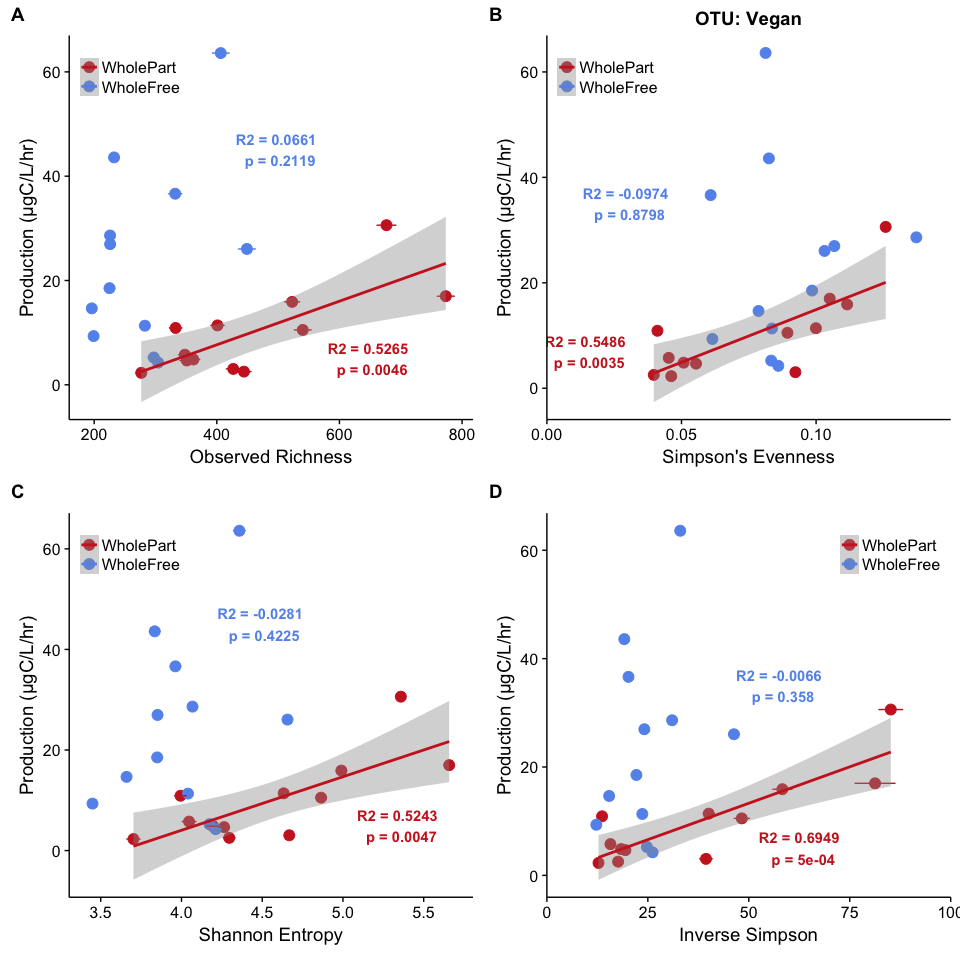
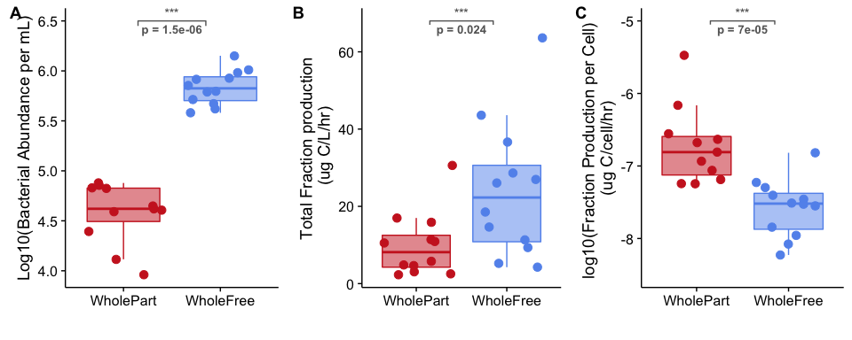
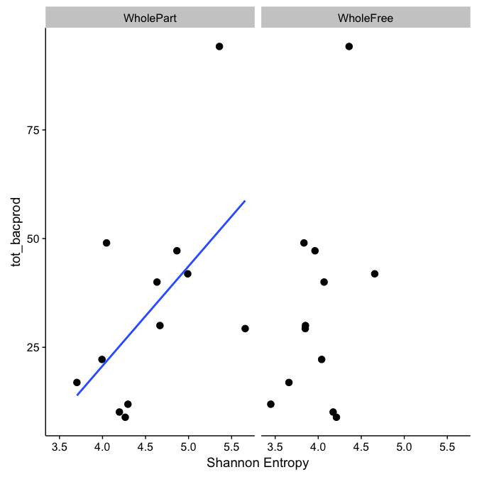
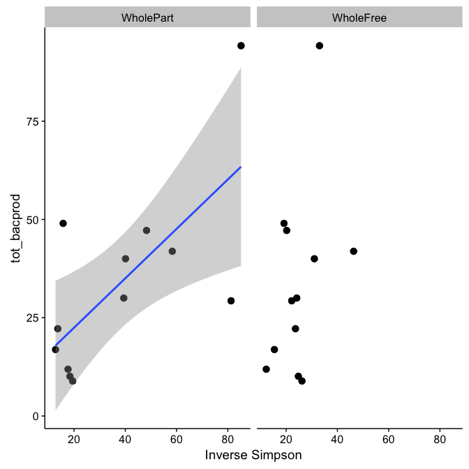
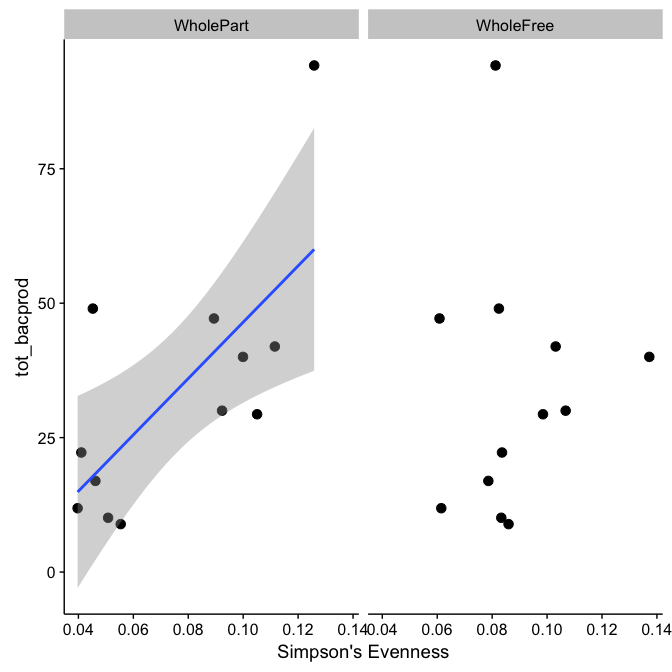
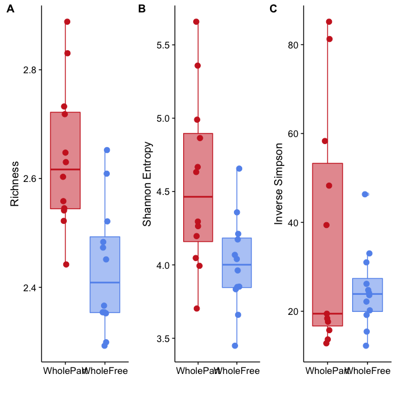

# Rarefied Diversity Analysis
Marian L. Schmidt  
February 14, 2017  
<style>
pre code, pre, code {
  white-space: pre !important;
  overflow-x: scroll !important;
  word-break: keep-all !important;
  word-wrap: initial !important;
}
</style>


# Rarefied Alpha Diversity Analysis
## Remove samples with too few reads

```
## phyloseq-class experiment-level object
## otu_table()   OTU Table:         [ 52980 taxa and 163 samples ]
## sample_data() Sample Data:       [ 163 samples by 70 sample variables ]
## tax_table()   Taxonomy Table:    [ 52980 taxa by 8 taxonomic ranks ]
## phy_tree()    Phylogenetic Tree: [ 52980 tips and 52978 internal nodes ]
```

```
## phyloseq-class experiment-level object
## otu_table()   OTU Table:         [ 52980 taxa and 163 samples ]
## sample_data() Sample Data:       [ 163 samples by 70 sample variables ]
## tax_table()   Taxonomy Table:    [ 52980 taxa by 8 taxonomic ranks ]
```

```
## phyloseq-class experiment-level object
## otu_table()   OTU Table:         [ 52980 taxa and 161 samples ]
## sample_data() Sample Data:       [ 161 samples by 70 sample variables ]
## tax_table()   Taxonomy Table:    [ 52980 taxa by 8 taxonomic ranks ]
```


## Metadata Frames for Subsets


#### Rarefy Read Depth Analysis ran on February 14th, 2016


# Fraction Diversity-Production Analysis 

```
## [1] 2895
```


## Subset Diversity Data 


# Diversity vs Fraction Production 

```
## 
## Call:
## lm(formula = frac_bacprod ~ mean, data = filter(ML_otu_rich_stats, 
##     fraction == "WholeFree"))
## 
## Residuals:
##     Min      1Q  Median      3Q     Max 
## -21.741 -12.261  -1.552   8.540  29.066 
## 
## Coefficients:
##             Estimate Std. Error t value Pr(>|t|)
## (Intercept)  0.51721   18.32443   0.028    0.978
## mean         0.08370    0.06275   1.334    0.212
## 
## Residual standard error: 16.94 on 10 degrees of freedom
## Multiple R-squared:  0.151,	Adjusted R-squared:  0.06612 
## F-statistic: 1.779 on 1 and 10 DF,  p-value: 0.2119
```

```
## 
## Call:
## lm(formula = frac_bacprod ~ mean, data = filter(ML_otu_rich_stats, 
##     fraction == "WholePart"))
## 
## Residuals:
##     Min      1Q  Median      3Q     Max 
## -6.9920 -3.6940 -0.5982  3.2391 11.3706 
## 
## Coefficients:
##             Estimate Std. Error t value Pr(>|t|)   
## (Intercept) -9.04480    5.47348  -1.652  0.12944   
## mean         0.04179    0.01149   3.638  0.00455 **
## ---
## Signif. codes:  0 '***' 0.001 '**' 0.01 '*' 0.05 '.' 0.1 ' ' 1
## 
## Residual standard error: 5.673 on 10 degrees of freedom
## Multiple R-squared:  0.5696,	Adjusted R-squared:  0.5265 
## F-statistic: 13.23 on 1 and 10 DF,  p-value: 0.004553
```

```
## 
## Call:
## lm(formula = frac_bacprod ~ mean, data = filter(ML_otu_shannon_stats, 
##     fraction == "WholeFree"))
## 
## Residuals:
##     Min      1Q  Median      3Q     Max 
## -22.642  -8.587  -3.915   7.135  34.659 
## 
## Coefficients:
##             Estimate Std. Error t value Pr(>|t|)
## (Intercept)   -31.96      67.18  -0.476    0.645
## mean           13.97      16.71   0.836    0.422
## 
## Residual standard error: 17.78 on 10 degrees of freedom
## Multiple R-squared:  0.06538,	Adjusted R-squared:  -0.02808 
## F-statistic: 0.6995 on 1 and 10 DF,  p-value: 0.4225
```

```
## 
## Call:
## lm(formula = frac_bacprod ~ mean, data = filter(ML_otu_shannon_stats, 
##     fraction == "WholePart"))
## 
## Residuals:
##     Min      1Q  Median      3Q     Max 
## -8.0980 -3.2043 -0.3301  1.3486 12.1080 
## 
## Coefficients:
##             Estimate Std. Error t value Pr(>|t|)   
## (Intercept)  -38.540     13.486  -2.858  0.01702 * 
## mean          10.644      2.938   3.623  0.00467 **
## ---
## Signif. codes:  0 '***' 0.001 '**' 0.01 '*' 0.05 '.' 0.1 ' ' 1
## 
## Residual standard error: 5.686 on 10 degrees of freedom
## Multiple R-squared:  0.5676,	Adjusted R-squared:  0.5243 
## F-statistic: 13.13 on 1 and 10 DF,  p-value: 0.004667
```

```
## 
## Call:
## lm(formula = frac_bacprod ~ mean, data = filter(ML_otu_invsimps_stats, 
##     fraction == "WholeFree"))
## 
## Residuals:
##     Min      1Q  Median      3Q     Max 
## -20.569 -10.734  -4.013   6.290  34.864 
## 
## Coefficients:
##             Estimate Std. Error t value Pr(>|t|)
## (Intercept)   9.8575    15.6009   0.632    0.542
## mean          0.5718     0.5935   0.963    0.358
## 
## Residual standard error: 17.59 on 10 degrees of freedom
## Multiple R-squared:  0.08494,	Adjusted R-squared:  -0.006562 
## F-statistic: 0.9283 on 1 and 10 DF,  p-value: 0.358
```

```
## 
## Call:
## lm(formula = frac_bacprod ~ mean, data = filter(ML_otu_invsimps_stats, 
##     fraction == "WholePart"))
## 
## Residuals:
##     Min      1Q  Median      3Q     Max 
## -7.4169 -2.1453 -0.2015  0.9740  7.8468 
## 
## Coefficients:
##             Estimate Std. Error t value Pr(>|t|)    
## (Intercept) -0.12549    2.37217  -0.053 0.958852    
## mean         0.26871    0.05264   5.105 0.000461 ***
## ---
## Signif. codes:  0 '***' 0.001 '**' 0.01 '*' 0.05 '.' 0.1 ' ' 1
## 
## Residual standard error: 4.554 on 10 degrees of freedom
## Multiple R-squared:  0.7227,	Adjusted R-squared:  0.6949 
## F-statistic: 26.06 on 1 and 10 DF,  p-value: 0.0004608
```

```
## 
## Call:
## lm(formula = frac_bacprod ~ mean, data = filter(ML_otu_simpseven_stats, 
##     fraction == "WholeFree"))
## 
## Residuals:
##     Min      1Q  Median      3Q     Max 
## -19.709 -12.801  -2.287   5.341  39.838 
## 
## Coefficients:
##             Estimate Std. Error t value Pr(>|t|)
## (Intercept)    20.41      24.17   0.845    0.418
## mean           41.29     266.14   0.155    0.880
## 
## Residual standard error: 18.37 on 10 degrees of freedom
## Multiple R-squared:  0.002401,	Adjusted R-squared:  -0.09736 
## F-statistic: 0.02406 on 1 and 10 DF,  p-value: 0.8798
```

```
## 
## Call:
## lm(formula = frac_bacprod ~ mean, data = filter(ML_otu_simpseven_stats, 
##     fraction == "WholePart"))
## 
## Residuals:
##      Min       1Q   Median       3Q      Max 
## -10.3301  -1.9616  -0.8216   1.2507  10.5267 
## 
## Coefficients:
##             Estimate Std. Error t value Pr(>|t|)   
## (Intercept)   -5.080      4.277  -1.188  0.26236   
## mean         199.911     52.742   3.790  0.00354 **
## ---
## Signif. codes:  0 '***' 0.001 '**' 0.01 '*' 0.05 '.' 0.1 ' ' 1
## 
## Residual standard error: 5.54 on 10 degrees of freedom
## Multiple R-squared:  0.5896,	Adjusted R-squared:  0.5486 
## F-statistic: 14.37 on 1 and 10 DF,  p-value: 0.003541
```




# Cell Count and Production Rates 

```
## 
## 	Wilcoxon rank sum test
## 
## data:  log10(as.numeric(fraction_bac_abund)) by fraction
## W = 0, p-value = 1.479e-06
## alternative hypothesis: true location shift is not equal to 0
```

```
## # A tibble: 2 × 2
##    fraction `mean(as.numeric(fraction_bac_abund))`
##      <fctr>                                  <dbl>
## 1 WholePart                               41168.88
## 2 WholeFree                              734522.25
```

```
## 
## 	Wilcoxon rank sum test
## 
## data:  frac_bacprod by fraction
## W = 33, p-value = 0.02418
## alternative hypothesis: true location shift is not equal to 0
```

```
## # A tibble: 2 × 2
##    fraction `mean(frac_bacprod)`
##      <fctr>                <dbl>
## 1 WholePart              9.95449
## 2 WholeFree             24.07018
```

```
## 
## 	Wilcoxon rank sum test
## 
## data:  log10(fracprod_per_cell) by fraction
## W = 125, p-value = 6.656e-05
## alternative hypothesis: true location shift is not equal to 0
```

```
## # A tibble: 2 × 2
##    fraction `mean(fracprod_per_cell)`
##      <fctr>                     <dbl>
## 1 WholePart              4.818158e-07
## 2 WholeFree              3.869446e-08
```




# Diversity vs Total Production 

```
## 
## Call:
## lm(formula = tot_bacprod ~ mean, data = filter(ML_otu_rich_stats, 
##     fraction == "WholeFree"))
## 
## Residuals:
##     Min      1Q  Median      3Q     Max 
## -28.114 -12.944   0.594   8.159  41.427 
## 
## Coefficients:
##             Estimate Std. Error t value Pr(>|t|)  
## (Intercept) -9.95411   23.04539  -0.432    0.675  
## mean         0.15434    0.07892   1.956    0.079 .
## ---
## Signif. codes:  0 '***' 0.001 '**' 0.01 '*' 0.05 '.' 0.1 ' ' 1
## 
## Residual standard error: 21.31 on 10 degrees of freedom
## Multiple R-squared:  0.2766,	Adjusted R-squared:  0.2043 
## F-statistic: 3.824 on 1 and 10 DF,  p-value: 0.07901
```

```
## 
## Call:
## lm(formula = tot_bacprod ~ mean, data = filter(ML_otu_rich_stats, 
##     fraction == "WholePart"))
## 
## Residuals:
##     Min      1Q  Median      3Q     Max 
## -31.914 -15.358  -0.829   7.469  41.379 
## 
## Coefficients:
##             Estimate Std. Error t value Pr(>|t|)  
## (Intercept) -6.13872   20.29427  -0.302    0.768  
## mean         0.08714    0.04259   2.046    0.068 .
## ---
## Signif. codes:  0 '***' 0.001 '**' 0.01 '*' 0.05 '.' 0.1 ' ' 1
## 
## Residual standard error: 21.03 on 10 degrees of freedom
## Multiple R-squared:  0.2951,	Adjusted R-squared:  0.2246 
## F-statistic: 4.186 on 1 and 10 DF,  p-value: 0.06797
```


```
## 
## Call:
## lm(formula = tot_bacprod ~ mean, data = filter(ML_otu_shannon_stats, 
##     fraction == "WholeFree"))
## 
## Residuals:
##     Min      1Q  Median      3Q     Max 
## -30.573 -11.102  -2.162   7.367  50.363 
## 
## Coefficients:
##             Estimate Std. Error t value Pr(>|t|)
## (Intercept)   -85.67      86.81  -0.987    0.347
## mean           29.72      21.59   1.376    0.199
## 
## Residual standard error: 22.97 on 10 degrees of freedom
## Multiple R-squared:  0.1593,	Adjusted R-squared:  0.07521 
## F-statistic: 1.895 on 1 and 10 DF,  p-value: 0.1987
```

```
## 
## Call:
## lm(formula = tot_bacprod ~ mean, data = filter(ML_otu_shannon_stats, 
##     fraction == "WholePart"))
## 
## Residuals:
##     Min      1Q  Median      3Q     Max 
## -29.412 -15.260   0.078   5.226  42.319 
## 
## Coefficients:
##             Estimate Std. Error t value Pr(>|t|)  
## (Intercept)   -71.03      49.21  -1.443   0.1795  
## mean           22.94      10.72   2.140   0.0581 .
## ---
## Signif. codes:  0 '***' 0.001 '**' 0.01 '*' 0.05 '.' 0.1 ' ' 1
## 
## Residual standard error: 20.75 on 10 degrees of freedom
## Multiple R-squared:  0.3141,	Adjusted R-squared:  0.2455 
## F-statistic: 4.578 on 1 and 10 DF,  p-value: 0.05806
```



```
## 
## Call:
## lm(formula = tot_bacprod ~ mean, data = filter(ML_otu_invsimps_stats, 
##     fraction == "WholeFree"))
## 
## Residuals:
##     Min      1Q  Median      3Q     Max 
## -26.050 -11.343  -4.267   4.427  51.512 
## 
## Coefficients:
##             Estimate Std. Error t value Pr(>|t|)
## (Intercept)   5.4207    20.1418   0.269    0.793
## mean          1.1289     0.7662   1.473    0.171
## 
## Residual standard error: 22.71 on 10 degrees of freedom
## Multiple R-squared:  0.1783,	Adjusted R-squared:  0.09618 
## F-statistic: 2.171 on 1 and 10 DF,  p-value: 0.1714
```

```
## 
## Call:
## lm(formula = tot_bacprod ~ mean, data = filter(ML_otu_invsimps_stats, 
##     fraction == "WholePart"))
## 
## Residuals:
##     Min      1Q  Median      3Q     Max 
## -31.643  -9.674  -2.796   5.421  30.770 
## 
## Coefficients:
##             Estimate Std. Error t value Pr(>|t|)  
## (Intercept)   9.8929     9.4884   1.043   0.3217  
## mean          0.6288     0.2105   2.986   0.0137 *
## ---
## Signif. codes:  0 '***' 0.001 '**' 0.01 '*' 0.05 '.' 0.1 ' ' 1
## 
## Residual standard error: 18.21 on 10 degrees of freedom
## Multiple R-squared:  0.4714,	Adjusted R-squared:  0.4185 
## F-statistic: 8.918 on 1 and 10 DF,  p-value: 0.01366
```



```
## 
## Call:
## lm(formula = tot_bacprod ~ mean, data = filter(ML_otu_simpseven_stats, 
##     fraction == "WholeFree"))
## 
## Residuals:
##     Min      1Q  Median      3Q     Max 
## -24.340 -16.571  -5.009   9.425  61.363 
## 
## Coefficients:
##             Estimate Std. Error t value Pr(>|t|)
## (Intercept)    25.85      32.87   0.786    0.450
## mean           86.07     362.02   0.238    0.817
## 
## Residual standard error: 24.98 on 10 degrees of freedom
## Multiple R-squared:  0.00562,	Adjusted R-squared:  -0.09382 
## F-statistic: 0.05652 on 1 and 10 DF,  p-value: 0.8169
```

```
## 
## Call:
## lm(formula = tot_bacprod ~ mean, data = filter(ML_otu_simpseven_stats, 
##     fraction == "WholePart"))
## 
## Residuals:
##     Min      1Q  Median      3Q     Max 
## -19.776 -11.062  -4.714   6.358  34.205 
## 
## Coefficients:
##             Estimate Std. Error t value Pr(>|t|)  
## (Intercept)    -5.91      13.92  -0.425   0.6801  
## mean          523.76     171.64   3.051   0.0122 *
## ---
## Signif. codes:  0 '***' 0.001 '**' 0.01 '*' 0.05 '.' 0.1 ' ' 1
## 
## Residual standard error: 18.03 on 10 degrees of freedom
## Multiple R-squared:  0.4822,	Adjusted R-squared:  0.4304 
## F-statistic: 9.311 on 1 and 10 DF,  p-value: 0.01222
```




```
## 
## 	Wilcoxon rank sum test
## 
## data:  mean by fraction
## W = 126, p-value = 0.001115
## alternative hypothesis: true location shift is not equal to 0
```

```
## # A tibble: 2 × 3
##    fraction `mean(mean)` `median(mean)`
##      <fctr>        <dbl>          <dbl>
## 1 WholePart     454.6417        413.935
## 2 WholeFree     281.4133        257.595
```

```
## 
## 	Wilcoxon rank sum test
## 
## data:  mean by fraction
## W = 115, p-value = 0.01209
## alternative hypothesis: true location shift is not equal to 0
```

```
## # A tibble: 2 × 3
##    fraction `mean(mean)` `median(mean)`
##      <fctr>        <dbl>          <dbl>
## 1 WholePart     4.555905       4.464302
## 2 WholeFree     4.009610       4.001229
```

```
## 
## 	Wilcoxon rank sum test
## 
## data:  mean by fraction
## W = 70, p-value = 0.8328
## alternative hypothesis: true location shift is not equal to 0
```

```
## # A tibble: 2 × 3
##    fraction `mean(mean)` `median(mean)`
##      <fctr>        <dbl>          <dbl>
## 1 WholePart     37.27907       19.45268
## 2 WholeFree     24.85521       23.88347
```




```
## 
## Call:
## lm(formula = log10(fracprod_per_cell) ~ mean, data = filter(ML_otu_rich_stats, 
##     fraction == "WholeFree"))
## 
## Residuals:
##     Min      1Q  Median      3Q     Max 
## -0.7056 -0.1326  0.0992  0.2334  0.4650 
## 
## Coefficients:
##              Estimate Std. Error t value Pr(>|t|)    
## (Intercept) -8.231139   0.392770 -20.957 1.36e-09 ***
## mean         0.002332   0.001345   1.734    0.114    
## ---
## Signif. codes:  0 '***' 0.001 '**' 0.01 '*' 0.05 '.' 0.1 ' ' 1
## 
## Residual standard error: 0.3632 on 10 degrees of freedom
## Multiple R-squared:  0.2311,	Adjusted R-squared:  0.1543 
## F-statistic: 3.006 on 1 and 10 DF,  p-value: 0.1136
```

```
## 
## Call:
## lm(formula = log10(fracprod_per_cell) ~ mean, data = filter(filter(ML_otu_rich_stats, 
##     fraction == "WholePart" & fracprod_per_cell != Inf)))
## 
## Residuals:
##     Min      1Q  Median      3Q     Max 
## -0.4778 -0.2188 -0.0434  0.1136  0.6824 
## 
## Coefficients:
##               Estimate Std. Error t value Pr(>|t|)    
## (Intercept) -7.9295357  0.3569740 -22.213 3.59e-09 ***
## mean         0.0026197  0.0007395   3.543  0.00629 ** 
## ---
## Signif. codes:  0 '***' 0.001 '**' 0.01 '*' 0.05 '.' 0.1 ' ' 1
## 
## Residual standard error: 0.3628 on 9 degrees of freedom
## Multiple R-squared:  0.5824,	Adjusted R-squared:  0.536 
## F-statistic: 12.55 on 1 and 9 DF,  p-value: 0.006288
```

```
## 
## Call:
## lm(formula = log10(fracprod_per_cell) ~ mean, data = filter(ML_otu_invsimps_stats, 
##     fraction == "WholeFree"))
## 
## Residuals:
##      Min       1Q   Median       3Q      Max 
## -0.67727 -0.13613  0.01755  0.18500  0.59968 
## 
## Coefficients:
##             Estimate Std. Error t value Pr(>|t|)    
## (Intercept) -8.05281    0.33073 -24.349 3.11e-10 ***
## mean         0.01923    0.01258   1.528    0.157    
## ---
## Signif. codes:  0 '***' 0.001 '**' 0.01 '*' 0.05 '.' 0.1 ' ' 1
## 
## Residual standard error: 0.3729 on 10 degrees of freedom
## Multiple R-squared:  0.1894,	Adjusted R-squared:  0.1083 
## F-statistic: 2.336 on 1 and 10 DF,  p-value: 0.1574
```

```
## 
## Call:
## lm(formula = log10(fracprod_per_cell) ~ mean, data = filter(ML_otu_invsimps_stats, 
##     fraction == "WholePart" & fracprod_per_cell != Inf))
## 
## Residuals:
##      Min       1Q   Median       3Q      Max 
## -0.29800 -0.18081 -0.11663  0.08102  0.56016 
## 
## Coefficients:
##              Estimate Std. Error t value Pr(>|t|)    
## (Intercept) -7.340126   0.157481 -46.610 4.82e-12 ***
## mean         0.016480   0.003462   4.761  0.00103 ** 
## ---
## Signif. codes:  0 '***' 0.001 '**' 0.01 '*' 0.05 '.' 0.1 ' ' 1
## 
## Residual standard error: 0.2993 on 9 degrees of freedom
## Multiple R-squared:  0.7158,	Adjusted R-squared:  0.6842 
## F-statistic: 22.66 on 1 and 9 DF,  p-value: 0.001029
```


# Prefiltered Fraction Diversity-Production Analysis 


# Does DNA extraction concentration influcence diversity?


