# Rarefied Diversity Analysis
Marian L. Schmidt  
February 14, 2017  
<style>
pre code, pre, code {
  white-space: pre !important;
  overflow-x: scroll !important;
  word-break: keep-all !important;
  word-wrap: initial !important;
}
</style>


```r
library(ggplot2)
library(devtools)
library(phyloseq)
library(tidyr)
library(dplyr)
library(cowplot)
library(picante) # Will also include ape and vegan 
library(car) # For residual analysis
library(sandwich) # for vcovHC function in post-hoc test
library(MASS) # For studres in plot_residuals function
library(boot) # For cross validation
source("Muskegon_functions.R")
source("set_colors.R")
```


# Rarefied Alpha Diversity Analysis
## Remove samples with too few reads

```r
# Loads a phyloseq object named otu_merged_musk_pruned)
load("../data/otu_merged_musk_pruned.RData")
# The name of the phyloseq object is: 
otu_merged_musk_pruned 
```

```
## phyloseq-class experiment-level object
## otu_table()   OTU Table:         [ 52980 taxa and 163 samples ]
## sample_data() Sample Data:       [ 163 samples by 70 sample variables ]
## tax_table()   Taxonomy Table:    [ 52980 taxa by 8 taxonomic ranks ]
## phy_tree()    Phylogenetic Tree: [ 52980 tips and 52978 internal nodes ]
```

```r
# Productivity measurements are reliable only up to 1 decimal
df1 <- sample_data(otu_merged_musk_pruned) %>% 
  dplyr::mutate(tot_bacprod = round(tot_bacprod, digits = 1),
                SD_tot_bacprod = round(SD_tot_bacprod, digits = 1),
                frac_bacprod = round(frac_bacprod, digits = 1),
                SD_frac_bacprod = round(SD_frac_bacprod, digits = 1))
```

```
## Warning in class(x) <- c("tbl_df", "tbl", "data.frame"): Setting class(x) to multiple strings ("tbl_df", "tbl", ...); result will no longer be an S4 object
```

```r
row.names(df1) = df1$norep_filter_name


# Remove tree because it's too computationally intensive
otu_merged_musk_pruned <- merge_phyloseq(tax_table(otu_merged_musk_pruned), 
                                         sample_data(df1), 
                                         otu_table(otu_merged_musk_pruned))
otu_merged_musk_pruned
```

```
## phyloseq-class experiment-level object
## otu_table()   OTU Table:         [ 52980 taxa and 163 samples ]
## sample_data() Sample Data:       [ 163 samples by 70 sample variables ]
## tax_table()   Taxonomy Table:    [ 52980 taxa by 8 taxonomic ranks ]
```

```r
# Remove MOTHJ715 and MBRHP715
otu_merged_musk_pruned_noMOTHJ715_MBRHP715 <- subset_samples(otu_merged_musk_pruned, 
                                                             norep_filter_name != "MOTHJ715" & 
                                                               norep_filter_name != "MBRHP715")
otu_merged_musk_pruned_noMOTHJ715_MBRHP715
```

```
## phyloseq-class experiment-level object
## otu_table()   OTU Table:         [ 52980 taxa and 161 samples ]
## sample_data() Sample Data:       [ 161 samples by 70 sample variables ]
## tax_table()   Taxonomy Table:    [ 52980 taxa by 8 taxonomic ranks ]
```


```r
# Check the sequencing depth of each sample by 
sums_otu <- data.frame(rowSums(otu_table(otu_merged_musk_pruned_noMOTHJ715_MBRHP715))) 
colnames(sums_otu) <- "Sample_TotalSeqs"
sums_otu$names <- row.names(sums_otu)
sums_otu <- arrange(sums_otu, Sample_TotalSeqs) 
sums_otu <- make_metadata_norep(sums_otu)

## Add total sequences to metadata frame 
metdf <- sample_data(otu_merged_musk_pruned_noMOTHJ715_MBRHP715)
sums_otu$norep_filter_name <- sums_otu$names
sums_otu2 <- dplyr::select(sums_otu, norep_filter_name, Sample_TotalSeqs)
metdf_num2 <- left_join(metdf, sums_otu2, by = "norep_filter_name") %>%
  dplyr::select(-one_of("D0", "D0_chao", "D1", "D2", "D0_SD", "D1_sd", "D0_chao_sd"))
```

```
## Warning in class(x) <- c("tbl_df", "tbl", "data.frame"): Setting class(x) to multiple strings ("tbl_df", "tbl", ...); result will no longer be an S4 object
```

```r
row.names(metdf_num2) <- metdf_num2$norep_filter_name
# Rename the sample data 
sample_data(otu_merged_musk_pruned_noMOTHJ715_MBRHP715) <- metdf_num2
```

## Metadata Frames for Subsets

```r
### PREPARE DATA FRAMES FOR PHENOFLOW ALPHA DIVERSITY ANALYSIS
free_meta_data <- filter(metdf_num2, fraction %in% c("Free", "WholeFree") & norep_filter_name != "MOTHJ715" & limnion == "Top")
part_meta_data <- filter(metdf_num2, fraction %in% c("Particle", "WholePart") & norep_filter_name != "MOTHJ715" & limnion == "Top")
nosed_meta_data <- filter(metdf_num2, fraction != "Sediment" & limnion == "Top")

# Only "True Free Living and Particle" From 20um prefiltered samples 
free_only <- filter(free_meta_data, fraction == "Free")
part_only <- filter(part_meta_data, fraction == "Particle")

## 2015 specific samples that have NOT been prefiltered (whole water)
wholefree_only <- filter(free_meta_data, fraction == "WholeFree")
wholepart_only <- filter(part_meta_data, fraction == "WholePart")
```


#### Rarefy Read Depth Analysis ran on February 14th, 2016


# Fraction Diversity-Production Analysis 

```r
# Load values
nsamp <- nsamples(otu_merged_musk_pruned_noMOTHJ715_MBRHP715)
min_lib <- min(sample_sums(otu_merged_musk_pruned_noMOTHJ715_MBRHP715)) - 1
min_lib
```

```
## [1] 2895
```

```r
# Read in the files 
otu_richness <- read.table("../data/metadata/otu_richness100_rarefy2895",  header = TRUE)
otu_evenness <- read.table("../data/metadata/otu_evenness100_rarefy2895", header = TRUE)
otu_shannon <- read.table("../data/metadata/otu_shannon100_rarefy2895", header = TRUE)

# Create a new dataframe to hold the means and standard deviations of richness estimates
norep_filter_name <- row.names(otu_richness)
mean <- apply(otu_richness, 1, mean)
sd <- apply(otu_richness, 1, sd)
measure <- rep("Richness", nsamp)
otu_rich_stats <- data.frame(norep_filter_name, mean, sd, measure)

# Create a new dataframe to hold the means and standard deviations of evenness estimates
norep_filter_name <- row.names(otu_evenness)
mean <- apply(otu_evenness, 1, mean)
sd <- apply(otu_evenness, 1, sd)
measure <- rep("Inverse_Simpson", nsamp)
otu_even_stats <- data.frame(norep_filter_name, mean, sd, measure)

# Create a new dataframe to hold the means and standard deviations of shannon entropy estimates
norep_filter_name <- row.names(otu_shannon)
mean <- apply(otu_shannon, 1, mean)
sd <- apply(otu_shannon, 1, sd)
measure <- rep("Shannon_Entropy", nsamp)
otu_shan_stats <- data.frame(norep_filter_name, mean, sd, measure)

# Create a new dataframe to hold the means and standard deviations of simpsons evenness estimates
norep_filter_name <- row.names(otu_evenness)
mean <- apply(otu_evenness, 1, mean)
sd <- apply(otu_evenness, 1, sd)
measure <- rep("Inverse_Simpson", nsamp)
otu_simpseven_stats <- data.frame(norep_filter_name, mean, sd, measure)

# Calculate Simpson's Evenness into new df called "simps_evenness"
otu_simps_evenness <- inner_join(otu_rich_stats, otu_even_stats, by = "norep_filter_name") %>%
  mutate(mean = mean.y/mean.x,
         sd = sd(mean),
         measure = "Simpsons_Evenness") %>%
  dplyr::select(norep_filter_name, mean, sd, measure)

# Combine alpha diversity into one dataframe 
otu_alpha <- rbind(otu_rich_stats, otu_even_stats, otu_simps_evenness, otu_shan_stats)
s <- data.frame(sample_data(otu_merged_musk_pruned_noMOTHJ715_MBRHP715))
otu_alphadiv <- merge(otu_alpha, s, by = "norep_filter_name") %>%
  filter(project == "Muskegon_Lake" & limnion == "Top" & fraction != "Sediment") %>%
  mutate(fraction = factor(fraction, levels = c("WholePart", "Particle", "WholeFree", "Free")),
         lakesite = factor(lakesite,  levels = c("MOT", "MDP", "MBR", "MIN")),
         measure = factor(measure, levels = c("Richness", "Simpsons_Evenness", "Shannon_Entropy", "Inverse_Simpson"))) %>%
  # Calculate the per cell production rates 
  mutate(fraction_bac_abund = as.numeric(fraction_bac_abund),
         fracprod_per_cell = frac_bacprod/(1000*fraction_bac_abund),
         fracprod_per_cell_noinf = ifelse(fracprod_per_cell == Inf, NA, fracprod_per_cell))
```


## Subset Diversity Data 

```r
######################################################### RICHNESS
# Subset only richness data 
ML_otu_rich_stats <- filter(otu_alphadiv, measure == "Richness" & 
                              project == "Muskegon_Lake" & 
                              fraction %in% c("WholePart", "WholeFree") & year == "2015")

######################################################### SHANNON ENTROPY
# Subset only Shannon_Entropy data 
ML_otu_shannon_stats <- filter(otu_alphadiv, 
                               measure == "Shannon_Entropy" & 
                                 project == "Muskegon_Lake" & 
                                 fraction %in% c("WholePart", "WholeFree") & 
                                 year == "2015")

######################################################### INVERSE SIMPSON
# Subset only Inverse_Simpson data 
ML_otu_invsimps_stats <- filter(otu_alphadiv, 
                                measure == "Inverse_Simpson" & 
                                  project == "Muskegon_Lake" & 
                                  fraction %in% c("WholePart", "WholeFree") & 
                                  year == "2015")

######################################################### SIMPSON'S EVENNESS
# Subset only Simpsons_Evenness data 
ML_otu_simpseven_stats <- filter(otu_alphadiv, 
                                 measure == "Simpsons_Evenness" & 
                                   project == "Muskegon_Lake" & 
                                   fraction %in% c("WholePart", "WholeFree") & 
                                   year == "2015")
```


# Cell Count and Production Rates 

```r
######################################################### Fraction ABUNDANCe 
frac_abund_wilcox <- wilcox.test(log10(as.numeric(fraction_bac_abund)) ~ fraction, 
             data = filter(otu_alphadiv, fraction %in% c("WholePart", "WholeFree") & measure == "Richness"))
frac_abund_wilcox
```

```
## 
## 	Wilcoxon rank sum test
## 
## data:  log10(as.numeric(fraction_bac_abund)) by fraction
## W = 0, p-value = 1.479e-06
## alternative hypothesis: true location shift is not equal to 0
```

```r
filter(otu_alphadiv, fraction %in% c("WholePart", "WholeFree") & measure == "Richness") %>%
  group_by(fraction) %>%
  summarize(mean(as.numeric(fraction_bac_abund)))
```

```
## # A tibble: 2 × 2
##    fraction `mean(as.numeric(fraction_bac_abund))`
##      <fctr>                                  <dbl>
## 1 WholePart                               41168.88
## 2 WholeFree                              734522.25
```

```r
# Make a data frame to draw significance line in boxplot (visually calculated)
dat1 <- data.frame(a = c(1.15,1.15,1.85,1.85), b = c(6.45,6.5,6.5,6.45)) # WholePart vs WholeFree

poster_a <- ggplot(filter(otu_alphadiv, fraction %in% c("WholePart", "WholeFree") & 
                            measure == "Richness" & norep_filter_name != "MOTEJ515"), 
       aes(y = log10(as.numeric(fraction_bac_abund)), x = fraction)) +
  scale_color_manual(values = fraction_colors) + 
  scale_fill_manual(values = fraction_colors) +
  geom_jitter(size = 3, aes(color = fraction, fill = fraction), width = 0.2) + 
  geom_boxplot(alpha = 0.5, outlier.shape = NA, aes(color = fraction, fill = fraction)) +
  ylab("Log10(Bacterial Cells/mL)") +
  scale_x_discrete(breaks=c("WholePart", "WholeFree"),
                      labels=c("Particle-\nAssociated", "Free-\nLiving")) + 
  #####  WHOLE PARTICLE VS WHOLE FREE CELL ABUNDANCES
  geom_path(data = dat1, aes(x = a, y = b), linetype = 1, color = "gray40") +
  annotate("text", x=1.5, y=6.5, fontface = "bold",  size = 3.5, color = "gray40",
           label= paste("***\np =", round(frac_abund_wilcox$p.value, digits = 6))) +
  theme(legend.position = "none",
        axis.title.x = element_blank())


######################################################### TOTAL PRODUCTION 
totprod_wilcox <- wilcox.test(frac_bacprod ~ fraction, 
             data = filter(otu_alphadiv, fraction %in% c("WholePart", "WholeFree") & measure == "Richness"))
totprod_wilcox
```

```
## 
## 	Wilcoxon rank sum test
## 
## data:  frac_bacprod by fraction
## W = 33, p-value = 0.02418
## alternative hypothesis: true location shift is not equal to 0
```

```r
filter(otu_alphadiv, fraction %in% c("WholePart", "WholeFree") & measure == "Richness") %>%
  group_by(fraction) %>%
  summarize(mean(frac_bacprod))
```

```
## # A tibble: 2 × 2
##    fraction `mean(frac_bacprod)`
##      <fctr>                <dbl>
## 1 WholePart             9.958333
## 2 WholeFree            24.058333
```

```r
# Make a data frame to draw significance line in boxplot (visually calculated)
dat2 <- data.frame(a = c(1.15,1.15,1.85,1.85), b = c(67,68,68,67)) # WholePart vs WholeFree


poster_b <- ggplot(filter(otu_alphadiv, 
                          fraction %in% c("WholePart", "WholeFree") & measure == "Richness"), 
       aes(y = frac_bacprod, x = fraction)) + 
  scale_color_manual(values = fraction_colors) + 
  scale_fill_manual(values = fraction_colors) +
  geom_jitter(size = 3, aes(color = fraction, fill = fraction), width = 0.2) + 
  geom_boxplot(alpha = 0.5, outlier.shape = NA, aes(color = fraction, fill = fraction)) +
  ylab("Heterotrophic Production (μgC/L/hr)") +
  scale_x_discrete(breaks=c("WholePart", "WholeFree"),
                    labels=c("Particle-\nAssociated", "Free-\nLiving")) + 
  #####  WHOLE PARTICLE VS WHOLE FREE TOTAL PRODUCTION 
  geom_path(data = dat2, aes(x = a, y = b), linetype = 1, color = "gray40") +
  annotate("text", x=1.5, y=68, fontface = "bold",  size = 3.5, color = "gray40",
           label= paste("***\np =", round(totprod_wilcox$p.value, digits = 3))) +
  theme(legend.position = "none",
        axis.title.x = element_blank())


######################################################### TOTAL PRODUCTION 
percellprod_wilcox <- wilcox.test(log10(fracprod_per_cell) ~ fraction, 
             data = filter(otu_alphadiv, 
                          fraction %in% c("WholePart", "WholeFree") & 
                            measure == "Richness" &
                            norep_filter_name != "MOTEJ515"))
percellprod_wilcox
```

```
## 
## 	Wilcoxon rank sum test
## 
## data:  log10(fracprod_per_cell) by fraction
## W = 125, p-value = 6.656e-05
## alternative hypothesis: true location shift is not equal to 0
```

```r
filter(otu_alphadiv, fraction %in% c("WholePart", "WholeFree") & measure == "Richness" &
       norep_filter_name != "MOTEJ515" & norep_filter_name != "MOTEP515") %>%
  group_by(fraction) %>%
  summarize(mean(fracprod_per_cell))
```

```
## # A tibble: 2 × 2
##    fraction `mean(fracprod_per_cell)`
##      <fctr>                     <dbl>
## 1 WholePart              4.816116e-07
## 2 WholeFree              3.866798e-08
```

```r
# Make a data frame to draw significance line in boxplot (visually calculated)
dat3 <- data.frame(a = c(1.15,1.15,1.85,1.85), b = c(-5.05,-5,-5,-5.05)) # WholePart vs WholeFree


poster_c <- ggplot(filter(otu_alphadiv, 
                          fraction %in% c("WholePart", "WholeFree") & 
                            measure == "Richness" &
                            norep_filter_name != "MOTEJ515" & norep_filter_name != "MOTEP515"), 
       aes(y = log10(fracprod_per_cell), x = fraction)) +
  scale_color_manual(values = fraction_colors) + 
  scale_fill_manual(values = fraction_colors) +
  geom_jitter(size = 3, aes(color = fraction, fill = fraction), width = 0.2) + 
  geom_boxplot(alpha = 0.5, outlier.shape = NA, aes(color = fraction, fill = fraction)) +
  ylim(c(-8.5, -5)) + 
  ylab("log10(Production/cell) (μgC/cell/hr)") +
  scale_x_discrete(breaks=c("WholePart", "WholeFree"),
                    labels=c("Particle-\nAssociated", "Free-\nLiving")) + 
  #####  WHOLE PARTICLE VS WHOLE FREE PER CELL PRODUCTION 
  geom_path(data = dat3, aes(x = a, y = b), linetype = 1, color = "gray40") +
  annotate("text", x=1.5, y=-5, fontface = "bold",  size = 3.5, color = "gray40",
           label= paste("***\np =", round(percellprod_wilcox$p.value, digits = 5))) +
  theme(legend.position = "none",
        axis.title.x = element_blank())

plot_grid(poster_a, poster_b, poster_c,
          labels = c("A", "B", "C"),
          ncol = 3)
```


# Diversity Comparison

```r
######################################################### RICHNESS 
rich_wilcox <- wilcox.test(mean ~ fraction, 
             data = filter(otu_alphadiv, fraction %in% c("WholePart", "WholeFree") & measure == "Richness"))

filter(otu_alphadiv, fraction %in% c("WholePart", "WholeFree") & measure == "Richness") %>%
  group_by(fraction) %>%
  summarize(mean(mean),  median(mean))
```

```
## # A tibble: 2 × 3
##    fraction `mean(mean)` `median(mean)`
##      <fctr>        <dbl>          <dbl>
## 1 WholePart     454.6417        413.935
## 2 WholeFree     281.4133        257.595
```

```r
# Make a data frame to draw significance line in boxplot (visually calculated)
nums1 <- data.frame(a = c(1.15,1.15,1.85,1.85), b = c(790,800,800,790)) # WholePart vs WholeFree

poster_rich1 <-  ggplot(filter(otu_alphadiv, 
                          fraction %in% c("WholePart", "WholeFree") & measure == "Richness"), 
       aes(y = mean, x = fraction)) +
  ylab("Observed Richness") + 
  #geom_errorbar(aes(ymin = mean - sd, ymax = mean + sd, color = fraction), alpha = 0.7) + # X-axis errorbars
  geom_jitter(size = 3, aes(color = fraction, fill = fraction), width = 0.2) + 
  geom_boxplot(alpha = 0.5, outlier.shape = NA, aes(color = fraction, fill = fraction)) +
  scale_fill_manual(values = fraction_colors, 
                    breaks=c("WholeFree", "WholePart"), 
                    labels=c("Free-Living", "Particle-Associated")) +
  scale_color_manual(values = fraction_colors,
                 breaks=c("WholeFree", "WholePart"), 
                 labels=c("Free-Living", "Particle-Associated")) + 
  geom_path(data = nums1, aes(x = a, y = b), linetype = 1, color = "gray40") +
  theme(legend.position = "none") +
  scale_y_continuous(limits = c(180, 810), breaks = c(200, 400, 600, 800)) 
     
     
poster_rich <- poster_rich1 + 
  annotate("text", x=1.5, y=800, fontface = "bold",  size = 3.5, color = "gray40",
           label= paste("***\np =", round(rich_wilcox$p.value, digits = 3))) +
  theme(legend.position = c(0.7, 0.75), 
        axis.title.x = element_blank(),
        legend.title = element_blank(),
        legend.spacing.y = unit(-0.5, "cm"),
        legend.spacing.x = unit(-0.3, "cm"),
        legend.box = "horizontal") +
  scale_fill_manual(values = fraction_colors, 
                    breaks=c("WholeFree", "WholePart"), 
                    labels=c("Free", "Particle")) +
  scale_color_manual(values = fraction_colors,
                 breaks=c("WholeFree", "WholePart"), 
                 labels=c("Free", "Particle")) +
  geom_jitter(size = 3, aes(color = fraction, fill = fraction, shape = lakesite), width = 0.2) + 
  scale_shape_discrete(guide = guide_legend(reverse=TRUE))


######################################################### SHANNON ENTROPY  
shannon_wilcox <- wilcox.test(mean ~ fraction, 
             data = filter(otu_alphadiv, fraction %in% c("WholePart", "WholeFree") & measure == "Shannon_Entropy"))

filter(otu_alphadiv, fraction %in% c("WholePart", "WholeFree") & measure == "Shannon_Entropy") %>%
  group_by(fraction) %>%
  summarize(mean(mean),  median(mean))
```

```
## # A tibble: 2 × 3
##    fraction `mean(mean)` `median(mean)`
##      <fctr>        <dbl>          <dbl>
## 1 WholePart     4.555905       4.464302
## 2 WholeFree     4.009610       4.001229
```

```r
# Make a data frame to draw significance line in boxplot (visually calculated)
nums2 <- data.frame(a = c(1.15,1.15,1.85,1.85), b = c(5.75,5.8,5.8,5.75)) # WholePart vs WholeFree

poster_shannon1 <- ggplot(filter(otu_alphadiv, 
                          fraction %in% c("WholePart", "WholeFree") & measure == "Shannon_Entropy"), 
       aes(y = mean, x = fraction)) +  
  ylab("Shannon Entropy") +   
  #geom_errorbar(aes(ymin = mean - sd, ymax = mean + sd), alpha = 0.7) + # X-axis errorbars
  geom_jitter(size = 3, aes(color = fraction, fill = fraction), width = 0.2) + 
  geom_boxplot(alpha = 0.5, outlier.shape = NA, aes(color = fraction, fill = fraction)) +
  scale_fill_manual(values = fraction_colors, 
                    breaks=c("WholeFree", "WholePart"), 
                    labels=c("Free-Living", "Particle-Associated")) +
  scale_color_manual(values = fraction_colors,
                 breaks=c("WholeFree", "WholePart"), 
                 labels=c("Free-Living", "Particle-Associated")) + 
  geom_path(data = nums2, aes(x = a, y = b), linetype = 1, color = "gray40") +
  theme(legend.position = "none") +
  scale_y_continuous(limits = c(3.4, 5.85), breaks = c(3.5, 4, 4.5, 5, 5.5))  

  
  
poster_shannon <- poster_shannon1 + 
  annotate("text", x=1.5, y=5.8, fontface = "bold",  size = 3.5, color = "gray40",
           label= paste("***\np =", round(shannon_wilcox$p.value, digits = 3))) +
  theme(legend.position = "none", axis.title.x = element_blank())


#########################################################  INVERSE SIMPSON 
simpson_wilcox <- wilcox.test(mean ~ fraction, 
             data = filter(otu_alphadiv, 
                          fraction %in% c("WholePart", "WholeFree") & 
                            measure == "Inverse_Simpson" &
                            norep_filter_name != "MOTEJ515" & norep_filter_name != "MOTEP515"))
simpson_wilcox
```

```
## 
## 	Wilcoxon rank sum test
## 
## data:  mean by fraction
## W = 70, p-value = 0.8328
## alternative hypothesis: true location shift is not equal to 0
```

```r
filter(otu_alphadiv, fraction %in% c("WholePart", "WholeFree") & measure == "Inverse_Simpson" &
       norep_filter_name != "MOTEJ515" & norep_filter_name != "MOTEP515") %>%
  group_by(fraction) %>%
  summarize(mean(mean), median(mean))
```

```
## # A tibble: 2 × 3
##    fraction `mean(mean)` `median(mean)`
##      <fctr>        <dbl>          <dbl>
## 1 WholePart     37.27907       19.45268
## 2 WholeFree     24.85521       23.88347
```

```r
nums3 <- data.frame(a = c(1.15,1.15,1.85,1.85), b = c(88,89, 89, 88)) # WholePart vs WholeFree


poster_invsimps1 <-   ggplot(filter(otu_alphadiv, 
                          fraction %in% c("WholePart", "WholeFree") & 
                            measure == "Inverse_Simpson" &
                            norep_filter_name != "MOTEJ515" & norep_filter_name != "MOTEP515"), 
       aes(y = mean, x = fraction)) +
  ylab("Inverse Simpson") +   
  #geom_errorbar(aes(ymin = mean - sd, ymax = mean + sd), alpha = 0.7) + # X-axis errorbars
  geom_jitter(size = 3, aes(color = fraction, fill = fraction), width = 0.2) + 
  geom_boxplot(alpha = 0.5, outlier.shape = NA, aes(color = fraction, fill = fraction)) +
  scale_fill_manual(values = fraction_colors, 
                    breaks=c("WholeFree", "WholePart"), 
                    labels=c("Free-Living", "Particle-Associated")) +
  scale_color_manual(values = fraction_colors,
                 breaks=c("WholeFree", "WholePart"), 
                 labels=c("Free-Living", "Particle-Associated")) + 
  geom_path(data = nums3, aes(x = a, y = b), linetype = "dotted", color = "gray40") +
  theme(legend.position = "none") +
  scale_y_continuous(limits = c(0,95), breaks = c(0, 20, 40, 60, 80), expand = c(0,0))  


poster_invsimps <- poster_invsimps1 +
  annotate("text", x=1.5, y=89, fontface = "bold",  size = 3.5, color = "gray40",
           label= paste("NS\np =", round(simpson_wilcox$p.value, digits = 2))) +
  theme(legend.position = "none", axis.title.x = element_blank())

#########################################################  SIMPSON'S EVENNESS
simpseven_wilcox <- wilcox.test(mean ~ fraction, 
             data = filter(otu_alphadiv, 
                          fraction %in% c("WholePart", "WholeFree") & 
                            measure == "Simpsons_Evenness" &
                            norep_filter_name != "MOTEJ515" & norep_filter_name != "MOTEP515"))
simpseven_wilcox
```

```
## 
## 	Wilcoxon rank sum test
## 
## data:  mean by fraction
## W = 48, p-value = 0.2875
## alternative hypothesis: true location shift is not equal to 0
```

```r
filter(otu_alphadiv, fraction %in% c("WholePart", "WholeFree") & measure == "Simpsons_Evenness" &
       norep_filter_name != "MOTEJ515" & norep_filter_name != "MOTEP515") %>%
  group_by(fraction) %>%
  summarize(mean(mean), median(mean))
```

```
## # A tibble: 2 × 3
##    fraction `mean(mean)` `median(mean)`
##      <fctr>        <dbl>          <dbl>
## 1 WholePart   0.07295660     0.05540021
## 2 WholeFree   0.08859526     0.08346213
```

```r
nums3 <- data.frame(a = c(1.15,1.15,1.85,1.85), b = c(0.145, 0.15, 0.15, 0.145)) # WholePart vs WholeFree


poster_simpseven1 <-   ggplot(filter(otu_alphadiv, 
                          fraction %in% c("WholePart", "WholeFree") & 
                            measure == "Simpsons_Evenness" &
                            norep_filter_name != "MOTEJ515" & norep_filter_name != "MOTEP515"), 
       aes(y = mean, x = fraction)) +
  ylab("Simpson's Evenness") +   
  #geom_errorbar(aes(ymin = mean - sd, ymax = mean + sd), alpha = 0.7) + # X-axis errorbars
  geom_jitter(size = 3, aes(color = fraction, fill = fraction), width = 0.2) + 
  geom_boxplot(alpha = 0.5, outlier.shape = NA, aes(color = fraction, fill = fraction)) +
  scale_fill_manual(values = fraction_colors, 
                    breaks=c("WholeFree", "WholePart"), 
                    labels=c("Free-Living", "Particle-Associated")) +
  scale_color_manual(values = fraction_colors,
                 breaks=c("WholeFree", "WholePart"), 
                 labels=c("Free-Living", "Particle-Associated")) + 
  geom_path(data = nums3, aes(x = a, y = b), linetype = "dotted", color = "gray40") +
  theme(legend.position = "none") +
  scale_y_continuous(limits = c(0.03,0.151), breaks = c(0.05, 0.1, 0.15))  

  
poster_simpseven <- poster_simpseven1 +
  annotate("text", x=1.5, y=0.15, fontface = "bold",  size = 3.5, color = "gray40",
           label= paste("NS\np =", round(simpseven_wilcox$p.value, digits = 2))) +
  theme(legend.position = "none", axis.title.x = element_blank())

plot_grid(poster_rich, poster_shannon, poster_invsimps, poster_simpseven,
          labels = c("A", "B", "C", "D"),
          ncol = 4)
```


# Diversity vs Fraction Production 

```r
######################################################### RICHNESS
# Free-Living Richness vs fractional production 
freeprod_ML_otu_rich <- lm(frac_bacprod ~ mean, data = filter(ML_otu_rich_stats, fraction == "WholeFree"))
summary(freeprod_ML_otu_rich) 
```

```
## 
## Call:
## lm(formula = frac_bacprod ~ mean, data = filter(ML_otu_rich_stats, 
##     fraction == "WholeFree"))
## 
## Residuals:
##     Min      1Q  Median      3Q     Max 
## -21.680 -12.277  -1.541   8.520  29.088 
## 
## Coefficients:
##             Estimate Std. Error t value Pr(>|t|)
## (Intercept)  0.53767   18.32782   0.029    0.977
## mean         0.08358    0.06277   1.332    0.213
## 
## Residual standard error: 16.95 on 10 degrees of freedom
## Multiple R-squared:  0.1506,	Adjusted R-squared:  0.06568 
## F-statistic: 1.773 on 1 and 10 DF,  p-value: 0.2125
```

```r
# Particle-Associated Richness vs fractional production 
partprod_MLotu_rich <- lm(frac_bacprod ~ mean, data = filter(ML_otu_rich_stats, fraction == "WholePart"))
summary(partprod_MLotu_rich) 
```

```
## 
## Call:
## lm(formula = frac_bacprod ~ mean, data = filter(ML_otu_rich_stats, 
##     fraction == "WholePart"))
## 
## Residuals:
##     Min      1Q  Median      3Q     Max 
## -7.0263 -3.7207 -0.5858  3.2397 11.3728 
## 
## Coefficients:
##             Estimate Std. Error t value Pr(>|t|)   
## (Intercept) -9.01778    5.47953  -1.646  0.13084   
## mean         0.04174    0.01150   3.629  0.00462 **
## ---
## Signif. codes:  0 '***' 0.001 '**' 0.01 '*' 0.05 '.' 0.1 ' ' 1
## 
## Residual standard error: 5.679 on 10 degrees of freedom
## Multiple R-squared:  0.5684,	Adjusted R-squared:  0.5253 
## F-statistic: 13.17 on 1 and 10 DF,  p-value: 0.004617
```

```r
# Both fractions together
summary(lm(frac_bacprod ~ mean, data = ML_otu_rich_stats))
```

```
## 
## Call:
## lm(formula = frac_bacprod ~ mean, data = ML_otu_rich_stats)
## 
## Residuals:
##     Min      1Q  Median      3Q     Max 
## -14.757 -11.705  -5.573   9.159  46.467 
## 
## Coefficients:
##              Estimate Std. Error t value Pr(>|t|)  
## (Intercept) 15.810455   8.714369   1.814   0.0833 .
## mean         0.003255   0.022053   0.148   0.8840  
## ---
## Signif. codes:  0 '***' 0.001 '**' 0.01 '*' 0.05 '.' 0.1 ' ' 1
## 
## Residual standard error: 15.54 on 22 degrees of freedom
## Multiple R-squared:  0.0009892,	Adjusted R-squared:  -0.04442 
## F-statistic: 0.02178 on 1 and 22 DF,  p-value: 0.884
```

```r
# Plot 
otu_rich_vegan <-  ggplot(ML_otu_rich_stats, aes(x=mean, y=frac_bacprod, color = fraction)) + 
  geom_point(size = 3.5) + 
  geom_errorbarh(aes(xmin = mean - sd, xmax = mean + sd), alpha = 0.7) + # X-axis errorbars
  # Y-axis errorbars
  geom_errorbar(aes(ymin = frac_bacprod - SD_frac_bacprod, ymax = frac_bacprod + SD_frac_bacprod),  alpha = 0.5) + 
  scale_color_manual(values = c("firebrick3","cornflowerblue"), 
                     limits = c("WholePart", "WholeFree"),
                     breaks=c("WholePart", "WholeFree"),
                     labels=c("Particle", "Free")) + 
  ylab("Secondary Production (μgC/L/hr)") + xlab("Observed Richness") +
  geom_smooth(data=subset(ML_otu_rich_stats, fraction == "WholePart"), method='lm') + 
  scale_x_continuous(limits = c(180, 810), breaks = c(200, 400, 600, 800)) + 
  theme(legend.position=c(0.15,0.9),        
        legend.title=element_blank()) +
  annotate("text", x = 250, y=55, color = "cornflowerblue", fontface = "bold",
           label = paste("R2 =", round(summary(freeprod_ML_otu_rich)$adj.r.squared, digits = 2), "\n", 
                         "p =", round(unname(summary(freeprod_ML_otu_rich)$coefficients[,4][2]), digits = 2))) + 
  annotate("text", x = 650, y=3, color = "firebrick3", fontface = "bold",
           label = paste("R2 =", round(summary(partprod_MLotu_rich)$adj.r.squared, digits = 2), "\n", 
                         "p =", round(unname(summary(partprod_MLotu_rich)$coefficients[,4][2]), digits = 4)));


######################################################### SHANNON ENTROPY
# Free-Living Shannon vs fractional production 
freeprod_ML_otu_shannon <- lm(frac_bacprod ~ mean, data = filter(ML_otu_shannon_stats, fraction == "WholeFree"))
summary(freeprod_ML_otu_shannon)
```

```
## 
## Call:
## lm(formula = frac_bacprod ~ mean, data = filter(ML_otu_shannon_stats, 
##     fraction == "WholeFree"))
## 
## Residuals:
##     Min      1Q  Median      3Q     Max 
## -22.579  -8.609  -3.901   7.158  34.673 
## 
## Coefficients:
##             Estimate Std. Error t value Pr(>|t|)
## (Intercept)   -31.90      67.19  -0.475    0.645
## mean           13.95      16.71   0.835    0.423
## 
## Residual standard error: 17.78 on 10 degrees of freedom
## Multiple R-squared:  0.06522,	Adjusted R-squared:  -0.02826 
## F-statistic: 0.6977 on 1 and 10 DF,  p-value: 0.4231
```

```r
# Particle-Associated Shannon vs fractional production 
partprod_MLotu_shannon <- lm(frac_bacprod ~ mean, data = filter(ML_otu_shannon_stats, fraction == "WholePart"))
summary(partprod_MLotu_shannon)
```

```
## 
## Call:
## lm(formula = frac_bacprod ~ mean, data = filter(ML_otu_shannon_stats, 
##     fraction == "WholePart"))
## 
## Residuals:
##     Min      1Q  Median      3Q     Max 
## -8.1443 -3.2240 -0.3064  1.3478 12.1092 
## 
## Coefficients:
##             Estimate Std. Error t value Pr(>|t|)   
## (Intercept)  -38.477     13.500  -2.850  0.01725 * 
## mean          10.631      2.941   3.615  0.00473 **
## ---
## Signif. codes:  0 '***' 0.001 '**' 0.01 '*' 0.05 '.' 0.1 ' ' 1
## 
## Residual standard error: 5.693 on 10 degrees of freedom
## Multiple R-squared:  0.5664,	Adjusted R-squared:  0.5231 
## F-statistic: 13.07 on 1 and 10 DF,  p-value: 0.004732
```

```r
# Both fractions together
summary(lm(frac_bacprod ~ mean, data = ML_otu_shannon_stats))
```

```
## 
## Call:
## lm(formula = frac_bacprod ~ mean, data = ML_otu_shannon_stats)
## 
## Residuals:
##     Min      1Q  Median      3Q     Max 
## -14.551 -11.737  -5.533   8.998  46.485 
## 
## Coefficients:
##             Estimate Std. Error t value Pr(>|t|)
## (Intercept)   10.966     25.955   0.423    0.677
## mean           1.411      6.015   0.235    0.817
## 
## Residual standard error: 15.53 on 22 degrees of freedom
## Multiple R-squared:  0.002494,	Adjusted R-squared:  -0.04285 
## F-statistic: 0.05501 on 1 and 22 DF,  p-value: 0.8167
```

```r
# Plot 
otu_shannon_vegan <- ggplot(ML_otu_shannon_stats, aes(x=mean, y=frac_bacprod, color = fraction)) + 
  geom_point(size = 3.5) + 
  geom_errorbarh(aes(xmin = mean - sd, xmax = mean + sd), alpha = 0.7) + # X-axis errorbars
  # Y-axis errorbars
  geom_errorbar(aes(ymin = frac_bacprod - SD_frac_bacprod, ymax = frac_bacprod + SD_frac_bacprod),  alpha = 0.5) + 
  scale_color_manual(values = c("firebrick3","cornflowerblue"), 
                     limits = c("WholePart", "WholeFree"),
                     breaks=c("WholeFree", "WholePart"),
                     labels=c("Free-Living", "Particle-Associated")) + 
  ylab("Secondary Production (μgC/L/hr)") + xlab("Shannon Entropy") +
  scale_x_continuous(limits = c(3.4, 5.85), breaks = c(3.5, 4, 4.5, 5, 5.5)) + 
  geom_smooth(data=subset(ML_otu_shannon_stats, fraction == "WholePart"), method='lm') + 
  theme(legend.position=c(0.15,0.9),        
        legend.title=element_blank()) +
  annotate("text", x = 3.75, y=55, color = "cornflowerblue", fontface = "bold",
           label = paste("R2 =", round(summary(freeprod_ML_otu_shannon)$adj.r.squared, digits = 2), "\n", 
                         "p =", round(unname(summary(freeprod_ML_otu_shannon)$coefficients[,4][2]), digits = 2))) + 
  annotate("text", x = 5.35, y=3, color = "firebrick3", fontface = "bold",
           label = paste("R2 =", round(summary(partprod_MLotu_shannon)$adj.r.squared, digits = 2), "\n", 
                         "p =", round(unname(summary(partprod_MLotu_shannon)$coefficients[,4][2]), digits = 4))); 


######################################################### INVERSE SIMPSON
# Free-Living Inverse Simpson vs fractional production 
freeprod_ML_otu_invsimps <- lm(frac_bacprod ~ mean, data = filter(ML_otu_invsimps_stats, fraction == "WholeFree"))
summary(freeprod_ML_otu_invsimps)
```

```
## 
## Call:
## lm(formula = frac_bacprod ~ mean, data = filter(ML_otu_invsimps_stats, 
##     fraction == "WholeFree"))
## 
## Residuals:
##     Min      1Q  Median      3Q     Max 
## -20.509 -10.752  -3.999   6.315  34.879 
## 
## Coefficients:
##             Estimate Std. Error t value Pr(>|t|)
## (Intercept)   9.8660    15.6021   0.632    0.541
## mean          0.5710     0.5935   0.962    0.359
## 
## Residual standard error: 17.59 on 10 degrees of freedom
## Multiple R-squared:  0.08471,	Adjusted R-squared:  -0.006819 
## F-statistic: 0.9255 on 1 and 10 DF,  p-value: 0.3587
```

```r
# Particle-Associated Inverse Simpson vs fractional production 
partprod_MLotu_invsimps <- lm(frac_bacprod ~ mean, data = filter(ML_otu_invsimps_stats, fraction == "WholePart"))
summary(partprod_MLotu_invsimps)
```

```
## 
## Call:
## lm(formula = frac_bacprod ~ mean, data = filter(ML_otu_invsimps_stats, 
##     fraction == "WholePart"))
## 
## Residuals:
##     Min      1Q  Median      3Q     Max 
## -7.4641 -2.1798 -0.1669  0.9857  7.8508 
## 
## Coefficients:
##             Estimate Std. Error t value Pr(>|t|)    
## (Intercept) -0.11137    2.37660  -0.047 0.963548    
## mean         0.26844    0.05274   5.090 0.000471 ***
## ---
## Signif. codes:  0 '***' 0.001 '**' 0.01 '*' 0.05 '.' 0.1 ' ' 1
## 
## Residual standard error: 4.562 on 10 degrees of freedom
## Multiple R-squared:  0.7215,	Adjusted R-squared:  0.6937 
## F-statistic: 25.91 on 1 and 10 DF,  p-value: 0.0004708
```

```r
# Both fractions together
summary(lm(frac_bacprod ~ mean, data = ML_otu_invsimps_stats))
```

```
## 
## Call:
## lm(formula = frac_bacprod ~ mean, data = ML_otu_invsimps_stats)
## 
## Residuals:
##     Min      1Q  Median      3Q     Max 
## -15.277 -10.223  -5.040   5.606  46.308 
## 
## Coefficients:
##             Estimate Std. Error t value Pr(>|t|)  
## (Intercept)  12.1929     5.8162   2.096   0.0478 *
## mean          0.1544     0.1577   0.979   0.3380  
## ---
## Signif. codes:  0 '***' 0.001 '**' 0.01 '*' 0.05 '.' 0.1 ' ' 1
## 
## Residual standard error: 15.22 on 22 degrees of freedom
## Multiple R-squared:  0.04178,	Adjusted R-squared:  -0.001773 
## F-statistic: 0.9593 on 1 and 22 DF,  p-value: 0.338
```

```r
# Plot Simpson's Evenness
otu_invsimps_vegan <- ggplot(ML_otu_invsimps_stats, aes(x=mean, y=frac_bacprod, color = fraction)) + 
  geom_point(size = 3.5) +  
  geom_errorbarh(aes(xmin = mean - sd, xmax = mean + sd), alpha = 0.7) + # X-axis errorbars
  # Y-axis errorbars
  geom_errorbar(aes(ymin = frac_bacprod - SD_frac_bacprod, ymax = frac_bacprod + SD_frac_bacprod),  alpha = 0.5) + 
  scale_color_manual(values = c("firebrick3","cornflowerblue"), 
                     limits = c("WholePart", "WholeFree"),
                     breaks=c("WholeFree", "WholePart"),
                     labels=c("Free-Living", "Particle-Associated")) + 
  scale_x_continuous(limits = c(0,95), breaks = c(0, 20, 40, 60, 80), expand = c(0,0)) + 
  ylab("Secondary Production (μgC/L/hr)") + xlab("Inverse Simpson") +
  geom_smooth(data=subset(ML_otu_invsimps_stats, fraction == "WholePart"), method='lm') + 
  theme(legend.position=c(0.85,0.9),        
        legend.title=element_blank()) +
  annotate("text", x = 15, y=55, color = "cornflowerblue", fontface = "bold",
           label = paste("R2 =", round(summary(freeprod_ML_otu_invsimps)$adj.r.squared, digits = 2), "\n", 
                         "p =", round(unname(summary(freeprod_ML_otu_invsimps)$coefficients[,4][2]), digits = 2))) + 
  annotate("text", x = 63, y=3, color = "firebrick3", fontface = "bold",
           label = paste("R2 =", round(summary(partprod_MLotu_invsimps)$adj.r.squared, digits = 2), "\n", 
                         "p =", round(unname(summary(partprod_MLotu_invsimps)$coefficients[,4][2]), digits = 4))); 


######################################################### SIMPSON'S EVENNESS
# Free-Living Simpson's Evenness vs fractional production 
freeprod_ML_otu_simpseven <- lm(frac_bacprod ~ mean, data = filter(ML_otu_simpseven_stats, fraction == "WholeFree"))
summary(freeprod_ML_otu_simpseven)
```

```
## 
## Call:
## lm(formula = frac_bacprod ~ mean, data = filter(ML_otu_simpseven_stats, 
##     fraction == "WholeFree"))
## 
## Residuals:
##     Min      1Q  Median      3Q     Max 
## -19.650 -12.823  -2.314   5.320  39.846 
## 
## Coefficients:
##             Estimate Std. Error t value Pr(>|t|)
## (Intercept)    20.39      24.17   0.844    0.418
## mean           41.35     266.13   0.155    0.880
## 
## Residual standard error: 18.36 on 10 degrees of freedom
## Multiple R-squared:  0.002409,	Adjusted R-squared:  -0.09735 
## F-statistic: 0.02414 on 1 and 10 DF,  p-value: 0.8796
```

```r
# Particle-Associated Simpson's Evenness vs fractional production 
partprod_MLotu_simpseven <- lm(frac_bacprod ~ mean, data = filter(ML_otu_simpseven_stats, fraction == "WholePart"))
summary(partprod_MLotu_simpseven)
```

```
## 
## Call:
## lm(formula = frac_bacprod ~ mean, data = filter(ML_otu_simpseven_stats, 
##     fraction == "WholePart"))
## 
## Residuals:
##      Min       1Q   Median       3Q      Max 
## -10.3734  -1.9697  -0.8378   1.2650  10.5305 
## 
## Coefficients:
##             Estimate Std. Error t value Pr(>|t|)   
## (Intercept)   -5.057      4.282  -1.181   0.2650   
## mean         199.656     52.810   3.781   0.0036 **
## ---
## Signif. codes:  0 '***' 0.001 '**' 0.01 '*' 0.05 '.' 0.1 ' ' 1
## 
## Residual standard error: 5.547 on 10 degrees of freedom
## Multiple R-squared:  0.5884,	Adjusted R-squared:  0.5472 
## F-statistic: 14.29 on 1 and 10 DF,  p-value: 0.003598
```

```r
# Both fractions together
summary(lm(frac_bacprod ~ mean, data = ML_otu_simpseven_stats))
```

```
## 
## Call:
## lm(formula = frac_bacprod ~ mean, data = ML_otu_simpseven_stats)
## 
## Residuals:
##     Min      1Q  Median      3Q     Max 
## -16.188  -7.251  -4.197   2.929  46.731 
## 
## Coefficients:
##             Estimate Std. Error t value Pr(>|t|)  
## (Intercept)  -0.1406     9.5644  -0.015   0.9884  
## mean        209.3885   111.1051   1.885   0.0728 .
## ---
## Signif. codes:  0 '***' 0.001 '**' 0.01 '*' 0.05 '.' 0.1 ' ' 1
## 
## Residual standard error: 14.43 on 22 degrees of freedom
## Multiple R-squared:  0.139,	Adjusted R-squared:  0.09986 
## F-statistic: 3.552 on 1 and 22 DF,  p-value: 0.07276
```

```r
# Plot 
otu_simpseven_vegan <- ggplot(ML_otu_simpseven_stats, aes(x=mean, y=frac_bacprod, color = fraction)) + 
  geom_point(size = 3.5) +  
  geom_errorbarh(aes(xmin = mean - sd, xmax = mean + sd), alpha = 0.7) + # X-axis errorbars
  # Y-axis errorbars
  geom_errorbar(aes(ymin = frac_bacprod - SD_frac_bacprod, ymax = frac_bacprod + SD_frac_bacprod),  alpha = 0.5) + 
  scale_color_manual(values = c("firebrick3","cornflowerblue"), 
                     limits = c("WholePart", "WholeFree"),
                     breaks=c("WholeFree", "WholePart"),
                     labels=c("Free-Living", "Particle-Associated")) + 
  scale_x_continuous(limits = c(0.03,0.151), breaks = c(0.05, 0.1, 0.15))  +
  ylab("Secondary Production (μgC/L/hr)") + xlab("Simpson's Evenness") +
  geom_smooth(data=subset(ML_otu_simpseven_stats, fraction == "WholePart"), method='lm') + 
  theme(legend.position=c(0.15,0.9),        
        legend.title=element_blank()) +
  annotate("text", x = 0.05, y=55, color = "cornflowerblue", fontface = "bold",
           label = paste("R2 =", round(summary(freeprod_ML_otu_simpseven)$adj.r.squared, digits = 2), "\n", 
                         "p =", round(unname(summary(freeprod_ML_otu_simpseven)$coefficients[,4][2]), digits = 2))) + 
  annotate("text", x = 0.125, y=3, color = "firebrick3", fontface = "bold",
           label = paste("R2 =", round(summary(partprod_MLotu_simpseven)$adj.r.squared, digits = 2), "\n", 
                         "p =", round(unname(summary(partprod_MLotu_simpseven)$coefficients[,4][2]), digits = 4))); 

#otu_vegan <- plot_grid(otu_rich_vegan, otu_simpseven_vegan, otu_shannon_vegan, otu_invsimps_vegan,
#                       labels = c("A", "B", "C", "D"), 
#                       align = "h", nrow = 2, ncol = 2)
#otu_vegan
```


## Residual Analysis 

```r
##########################################################################
#############################   RESIDUALS   ##############################
##########################################################################

######################################################### RICHNESS
# Residual analysis of the RICHNESS Models
plot_residuals(lm_model = partprod_MLotu_rich, 
               lm_observed_y = filter(ML_otu_rich_stats, fraction == "WholePart")$frac_bacprod,
               main_title = "Particle-Associated Richness")
```

```
## [1] "WARNING:You have 1 high-leverage point(s)!"
```


```r
######################################################### SHANNON ENTROPY
# Residual analysis of the SHANNON ENTROPY Models
plot_residuals(lm_model = partprod_MLotu_shannon, 
               lm_observed_y = filter(ML_otu_shannon_stats, fraction == "WholePart")$frac_bacprod,
               main_title = "Particle-Associated Shannon")
```

```
## [1] "WARNING:You have 1 high-leverage point(s)!"
```


```r
######################################################### INVERSE SIMPSON
# Residual analysis of the INVERSE SIMPSON Models
plot_residuals(lm_model = partprod_MLotu_invsimps, 
               lm_observed_y = filter(ML_otu_invsimps_stats, fraction == "WholePart")$frac_bacprod,
               main_title = "Particle-Associated Inverse Simpson")
```

```
## [1] "There are no high leverage points in this model."
```


```r
######################################################### SIMPSONS EVENNESS
# Residual analysis of the INVERSE SIMPSON Models
plot_residuals(lm_model = partprod_MLotu_simpseven, 
               lm_observed_y = filter(ML_otu_simpseven_stats, fraction == "WholePart")$frac_bacprod,
               main_title = "Particle-Associated Simpson's Evenness")
```

```
## [1] "WARNING:You have 1 high-leverage point(s)!"
```


## Correlations 


```r
##########################################################################
###########################   CORRELATIONS   #############################
##########################################################################
# RICHNESS vs SHANNON
cor(filter(ML_otu_rich_stats, fraction == "WholePart")$mean,
    filter(ML_otu_shannon_stats, fraction == "WholePart")$mean) # YES
```

```
## [1] 0.961703
```

```r
# SHANNON VS INVERSE SIMPSON
cor(filter(ML_otu_shannon_stats, fraction == "WholePart")$mean,
    filter(ML_otu_invsimps_stats, fraction == "WholePart")$mean) # YES
```

```
## [1] 0.9682435
```

```r
# INVERSE SIMPSON VS SIMPSONS EVENNESS
cor(filter(ML_otu_invsimps_stats, fraction == "WholePart")$mean,
    filter(ML_otu_simpseven_stats, fraction == "WholePart")$mean) # YES
```

```
## [1] 0.9284642
```

```r
# SIMPSONS EVENNESS VS RICHNESS
cor(filter(ML_otu_simpseven_stats, fraction == "WholePart")$mean,
    filter(ML_otu_rich_stats, fraction == "WholePart")$mean) # YES
```

```
## [1] 0.7683792
```


## Post-hoc analysis 

```r
# Are the fractions different from each other in predicting fraction production?
prod_fracprod_values <- subset(otu_alphadiv, limnion == "Top" & year == "2015" & 
                          fraction == "WholePart" &
                          measure == "Richness") %>%
  dplyr::select(norep_filter_name, frac_bacprod) 

# Create a matrix with the 4 different diversity values 
prod_alpha <- subset(otu_alphadiv, limnion == "Top" & year == "2015" & 
                          fraction %in% c("WholePart", "WholeFree")) %>%
  dplyr::select(norep_filter_name, measure, mean) %>%
  spread(measure, mean)
row.names(prod_alpha) <- prod_alpha$norep_filter_name
prod_alpha$norep_filter_name = NULL
prod_alpha <- as.matrix(prod_alpha)

# Scale to a mean = 0 and  SD = 1
scale_prod_alphadiv <- scale(prod_alpha)

# Sanity Check
colMeans(scale_prod_alphadiv)  # faster version of apply(scaled.dat, 2, mean)
```

```
##          Richness Simpsons_Evenness   Shannon_Entropy   Inverse_Simpson 
##     -1.827242e-16      1.590163e-16     -3.921921e-16      4.365721e-17
```

```r
apply(scale_prod_alphadiv, 2, sd)
```

```
##          Richness Simpsons_Evenness   Shannon_Entropy   Inverse_Simpson 
##                 1                 1                 1                 1
```

```r
# Melt the data frame to be in long format
gather_prod_alpha <- as.data.frame(scale_prod_alphadiv) %>%   # Make scaled values a dataframe
  tibble::rownames_to_column(var = "norep_filter_name") %>%   # Add the rownames to keep samplenames
  gather(measure, mean, 2:5)                                  # Gather 4 columns and put values into 2
  
# Put it all together into one dataframe with 4 columns: sample_name, measure, mean, frac_bacprod 
prod_alpha_fracprod <- inner_join(gather_prod_alpha, prod_fracprod_values, by = "norep_filter_name") %>%
  mutate(measure = as.factor(measure))
```

```
## Warning in inner_join_impl(x, y, by$x, by$y, suffix$x, suffix$y): joining character vector and factor, coercing into character vector
```

```r
# Double check values from above models
lm_by_divmeasure <- lm(frac_bacprod ~ mean/measure, data = prod_alpha_fracprod)
summary(lm_by_divmeasure)
```

```
## 
## Call:
## lm(formula = frac_bacprod ~ mean/measure, data = prod_alpha_fracprod)
## 
## Residuals:
##     Min      1Q  Median      3Q     Max 
## -9.1328 -3.3521 -0.2908  2.0351 14.2938 
## 
## Coefficients:
##                               Estimate Std. Error t value Pr(>|t|)    
## (Intercept)                     8.4117     0.8613   9.766 1.76e-12 ***
## mean                            5.3755     1.2577   4.274 0.000104 ***
## mean:measureRichness           -0.1873     1.8927  -0.099 0.921621    
## mean:measureShannon_Entropy    -0.1670     1.8678  -0.089 0.929160    
## mean:measureSimpsons_Evenness  -0.5105     1.8967  -0.269 0.789095    
## ---
## Signif. codes:  0 '***' 0.001 '**' 0.01 '*' 0.05 '.' 0.1 ' ' 1
## 
## Residual standard error: 5.526 on 43 degrees of freedom
## Multiple R-squared:  0.5608,	Adjusted R-squared:  0.5199 
## F-statistic: 13.73 on 4 and 43 DF,  p-value: 2.714e-07
```

```r
# Run a post-hoc test
library(multcomp)
post_hoc_measure <- glht(lm_by_divmeasure, linfct = mcp(measure = "Tukey", interaction_average=TRUE),
                vcov=vcovHC(lm_by_divmeasure, type = "HC0"))
summary(post_hoc_measure)
```

```
## 
## 	 Simultaneous Tests for General Linear Hypotheses
## 
## Multiple Comparisons of Means: Tukey Contrasts
## 
## 
## Fit: lm(formula = frac_bacprod ~ mean/measure, data = prod_alpha_fracprod)
## 
## Linear Hypotheses:
##                                          Estimate Std. Error t value Pr(>|t|)
## Richness - Inverse_Simpson == 0           -0.1873     2.3131  -0.081    1.000
## Shannon_Entropy - Inverse_Simpson == 0    -0.1670     2.1513  -0.078    1.000
## Simpsons_Evenness - Inverse_Simpson == 0  -0.5105     2.3226  -0.220    0.996
## Shannon_Entropy - Richness == 0            0.0203     2.5793   0.008    1.000
## Simpsons_Evenness - Richness == 0         -0.3232     2.8005  -0.115    0.999
## Simpsons_Evenness - Shannon_Entropy == 0  -0.3435     2.6346  -0.130    0.999
## (Adjusted p values reported -- single-step method)
```

```r
detach("package:multcomp", unload=TRUE) # This package masks the dplyr select function = :(
```

## Cross Validation: MSE
#### Here we are using leave one out cross validation as we only have 12 samples in our models 

```r
######################################################### RICHNESS
# glm will be used instead of lm b/c it can be used together with cv.glm for cross validation as part of the boot library.
glm_rich_PA <- glm(frac_bacprod ~ mean, data = filter(ML_otu_rich_stats, fraction == "WholePart"))

# glm function just runs a linear regression without any extras within the function 
coef(glm_rich_PA)
```

```
## (Intercept)        mean 
## -9.01777931  0.04173861
```

```r
coef(partprod_MLotu_rich)
```

```
## (Intercept)        mean 
## -9.01777931  0.04173861
```

```r
# Perform Leave One Out Cross Validation (LOOCV)
cv_err_rich_PA <- cv.glm(data = filter(ML_otu_rich_stats, fraction == "WholePart"), glmfit = glm_rich_PA)
# Cross validation results: 1st value = standard estmate of MSE; 2nd value = bais corrected MSE
# These values are important for comparing *between* models
cv_err_rich_PA$delta
```

```
## [1] 50.18692 49.00011
```

```r
# 4-fold cross validation
cv4_err_rich_PA <- cv.glm(data = filter(ML_otu_rich_stats, fraction == "WholePart"), glmfit = glm_rich_PA, K = 4)
cv4_err_rich_PA$delta
```

```
## [1] 34.91373 33.38654
```

```r
######################################################### SHANNON ENTROPY
glm_shannon_PA <- glm(frac_bacprod ~ mean, data = filter(ML_otu_shannon_stats, fraction == "WholePart"))
coef(glm_shannon_PA)
```

```
## (Intercept)        mean 
##   -38.47705    10.63134
```

```r
coef(partprod_MLotu_shannon)
```

```
## (Intercept)        mean 
##   -38.47705    10.63134
```

```r
# Perform Leave One Out Cross Validation (LOOCV)
cv_err_shannon_PA <- cv.glm(data = filter(ML_otu_shannon_stats, fraction == "WholePart"), glmfit = glm_shannon_PA)
# 4-fold cross validation
cv4_err_shannon_PA <- cv.glm(data = filter(ML_otu_shannon_stats, fraction == "WholePart"), glmfit = glm_shannon_PA, K = 4)

######################################################### INVERSE SIMPSON
# Perform Leave One Out Cross Validation (LOOCV)
glm_invsimps_PA <- glm(frac_bacprod ~ mean, data = filter(ML_otu_invsimps_stats, fraction == "WholePart"))

# glm function just runs a linear regression without any extras within the function 
coef(glm_invsimps_PA)
```

```
## (Intercept)        mean 
##  -0.1113659   0.2684354
```

```r
coef(partprod_MLotu_invsimps)
```

```
## (Intercept)        mean 
##  -0.1113659   0.2684354
```

```r
# glm will be used instead of lm b/c it can be used together with cv.glm for cross validation as part of the boot library.
cv_err_invsimps_PA <- cv.glm(data = filter(ML_otu_invsimps_stats, fraction == "WholePart"), glmfit = glm_invsimps_PA)
# 4-fold cross validation
cv4_err_invsimps_PA <- cv.glm(data = filter(ML_otu_invsimps_stats, fraction == "WholePart"), glmfit = glm_invsimps_PA, K = 4)

######################################################### SIMPSON'S EVENNESS
# Perform Leave One Out Cross Validation (LOOCV)
glm_simpseven_PA <- glm(frac_bacprod ~ mean, data = filter(ML_otu_simpseven_stats, fraction == "WholePart"))

# glm function just runs a linear regression without any extras within the function 
coef(glm_simpseven_PA)
```

```
## (Intercept)        mean 
##   -5.056751  199.656458
```

```r
coef(partprod_MLotu_simpseven)
```

```
## (Intercept)        mean 
##   -5.056751  199.656458
```

```r
# glm will be used instead of lm b/c it can be used together with cv.glm for cross validation as part of the boot library.
cv_err_simpseven_PA <- cv.glm(data = filter(ML_otu_simpseven_stats, fraction == "WholePart"), glmfit = glm_simpseven_PA)
# 4-fold cross validation
cv4_err_simpseven_PA <- cv.glm(data = filter(ML_otu_simpseven_stats, fraction == "WholePart"), glmfit = glm_simpseven_PA, K = 4)


# Extract 2nd MSE value that is bias corrected
LOOCV_MSE1 <- c(cv_err_rich_PA$delta[1], cv_err_shannon_PA$delta[1], cv_err_invsimps_PA$delta[1], cv_err_simpseven_PA$delta[1])
k4Fold_CV <- c(cv4_err_rich_PA$delta[2], cv4_err_shannon_PA$delta[2], cv4_err_invsimps_PA$delta[2], cv4_err_simpseven_PA$delta[2])
LOOCV_MSE2_bias <- c(cv_err_rich_PA$delta[2], cv_err_shannon_PA$delta[2], cv_err_invsimps_PA$delta[2], cv_err_simpseven_PA$delta[2])
cv_divs <- c("Richness", "Shannon", "InvSimps", "SimpsEven")

cv_MSE_df <- data.frame(LOOCV_MSE1, k4Fold_CV, LOOCV_MSE2_bias, cv_divs) %>%
  gather("CV_type", "MSE",1:3)

# Plot it
ggplot(cv_MSE_df, aes(x = cv_divs, y = MSE)) +
  facet_grid(.~CV_type) + 
  geom_bar(stat = "identity", color = "black", fill = "#FEB41C") + 
  ylab("Mean Squared Error") + 
  scale_x_discrete(limits=c("Richness", "Shannon", "InvSimps", "SimpsEven")) +
  scale_y_continuous(expand = c(0,0), limits = c(0,60)) +
  theme(axis.title.x = element_blank(),
        axis.text.x = element_text(angle = 30, hjust = 1, vjust = 1))
```

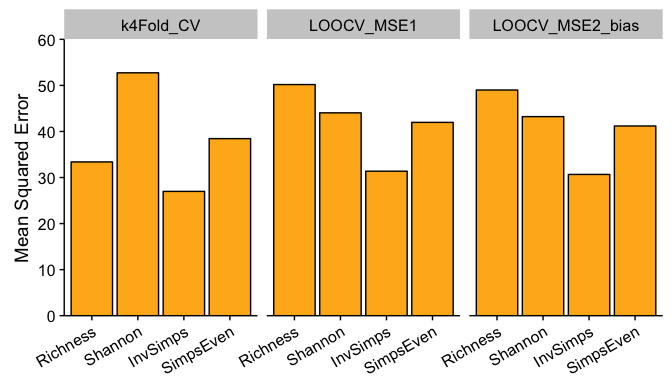

So, from the analysis above, the model with the best predictive power and lowest error rate is the Inverse Simpson model. 

## Multicollinearity

```r
# Are the model richness and inverse simpson models different?
anova(glm_rich_PA, glm_invsimps_PA)
```

```
## Analysis of Deviance Table
## 
## Model 1: frac_bacprod ~ mean
## Model 2: frac_bacprod ~ mean
##   Resid. Df Resid. Dev Df Deviance
## 1        10     322.56            
## 2        10     208.15  0   114.41
```

```r
rich_invsimps <- data.frame(Richness = filter(ML_otu_rich_stats, fraction == "WholePart")$mean, 
                            Shannon = filter(ML_otu_shannon_stats, fraction == "WholePart")$mean,
                            InvSimps = filter(ML_otu_invsimps_stats, fraction == "WholePart")$mean,
                            SimpsEven = filter(ML_otu_simpseven_stats, fraction == "WholePart")$mean)


lm_rich_Shannon <- lm(Richness ~ Shannon, data = rich_invsimps)

plot1 <- ggplot(rich_invsimps, aes(y = Richness, x = Shannon)) +
  geom_point() + xlab("Shannon") +
  geom_smooth(method = "lm") +
  scale_y_continuous(limits = c(200, 800)) +
  scale_x_continuous(limits = c(3.5, 6.0)) +
  annotate("text", y = 275, x=5, color = "black", fontface = "bold",
         label = paste("R2 =", round(summary(lm_rich_Shannon)$adj.r.squared, digits = 2), "\n", 
                       "p =", round(unname(summary(lm_rich_Shannon)$coefficients[,4][2]), digits = 8)));

lm_rich_invsimps <- lm(Richness ~ InvSimps, data = rich_invsimps)

plot2 <- ggplot(rich_invsimps, aes(y = Richness, x = InvSimps)) +
  geom_point() + xlab("Inverse Simpson") +
  geom_smooth(method = "lm") +
  scale_y_continuous(limits = c(200, 800)) +
  annotate("text", y= 275, x=60, color = "black", fontface = "bold",
         label = paste("R2 =", round(summary(lm_rich_invsimps)$adj.r.squared, digits = 2), "\n", 
                       "p =", round(unname(summary(lm_rich_invsimps)$coefficients[,4][2]), digits = 7)));


lm_rich_simpseven <- lm(Richness ~ SimpsEven, data = rich_invsimps)

plot3 <- ggplot(rich_invsimps, aes(y = Richness, x = SimpsEven)) +
  geom_point() + xlab("Simpson's Evenness") +
  geom_smooth(method = "lm") +
  scale_y_continuous(limits = c(200, 800)) +
  annotate("text", y = 275, x=0.1, color = "black", fontface = "bold",
         label = paste("R2 =", round(summary(lm_rich_simpseven)$adj.r.squared, digits = 2), "\n", 
                       "p =", round(unname(summary(lm_rich_simpseven)$coefficients[,4][2]), digits = 4)));


plot_grid(plot1, plot2, plot3, align = "h",
          nrow = 1, ncol = 3,
          labels = c("A", "B", "C"))
```

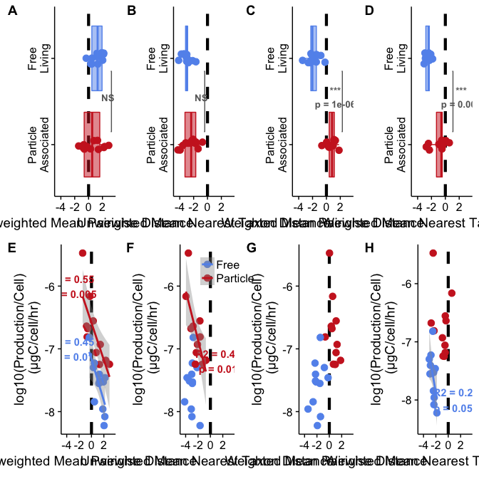

```r
# Take scaled values and specifically look at the difference between richness and inverse simpson
PA_rich_invsimps_scaled <- dplyr::filter(prod_alpha_fracprod, measure %in% c("Richness", "Inverse_Simpson"))

anova(lm(frac_bacprod ~ mean*measure, data = PA_rich_invsimps_scaled), 
      lm(frac_bacprod ~ mean+measure, data = PA_rich_invsimps_scaled))
```

```
## Analysis of Variance Table
## 
## Model 1: frac_bacprod ~ mean * measure
## Model 2: frac_bacprod ~ mean + measure
##   Res.Df    RSS Df Sum of Sq      F Pr(>F)
## 1     20 530.71                           
## 2     21 534.44 -1   -3.7312 0.1406 0.7116
```

```r
summary(lm(frac_bacprod ~ mean*measure, data = PA_rich_invsimps_scaled))
```

```
## 
## Call:
## lm(formula = frac_bacprod ~ mean * measure, data = PA_rich_invsimps_scaled)
## 
## Residuals:
##     Min      1Q  Median      3Q     Max 
## -7.4641 -2.5167 -0.3221  2.0382 11.3728 
## 
## Coefficients:
##                      Estimate Std. Error t value Pr(>|t|)    
## (Intercept)            8.2595     1.5341   5.384 2.86e-05 ***
## mean                   5.4047     1.1989   4.508 0.000215 ***
## measureRichness       -1.9163     2.3197  -0.826 0.418484    
## mean:measureRichness   0.7298     1.9462   0.375 0.711623    
## ---
## Signif. codes:  0 '***' 0.001 '**' 0.01 '*' 0.05 '.' 0.1 ' ' 1
## 
## Residual standard error: 5.151 on 20 degrees of freedom
## Multiple R-squared:  0.645,	Adjusted R-squared:  0.5917 
## F-statistic: 12.11 on 3 and 20 DF,  p-value: 9.682e-05
```

From the Summary output above, we can conclude that:  

- **3rd line**: The intercept for measureRichness is not significantly different from the intercept of measureInverse_Simpson (p = 0.418).  
- **4th Line**: The slopes between Richness and Inverse_Simpson are insignificant (p = 0.71) and therefore, the models between richness and inverse_simpson do not differ from each other. 


# Per cell Fraction Production vs Diversity

```r
#########################################################  RICHNESS 
# Free-Living Richness vs fractional production per cell 
freeprod_percell_ML_otu_rich <- lm(log10(fracprod_per_cell) ~ mean, data = filter(ML_otu_rich_stats, fraction == "WholeFree"))
summary(freeprod_percell_ML_otu_rich)
```

```
## 
## Call:
## lm(formula = log10(fracprod_per_cell) ~ mean, data = filter(ML_otu_rich_stats, 
##     fraction == "WholeFree"))
## 
## Residuals:
##      Min       1Q   Median       3Q      Max 
## -0.70057 -0.13347  0.09905  0.23320  0.46523 
## 
## Coefficients:
##              Estimate Std. Error t value Pr(>|t|)    
## (Intercept) -8.231303   0.392315 -20.981 1.34e-09 ***
## mean         0.002332   0.001344   1.736    0.113    
## ---
## Signif. codes:  0 '***' 0.001 '**' 0.01 '*' 0.05 '.' 0.1 ' ' 1
## 
## Residual standard error: 0.3627 on 10 degrees of freedom
## Multiple R-squared:  0.2315,	Adjusted R-squared:  0.1547 
## F-statistic: 3.013 on 1 and 10 DF,  p-value: 0.1133
```

```r
# Particle-Associated Richness vs fractional production per cell 
partprod_percell_MLotu_rich <- lm(log10(fracprod_per_cell) ~ mean, data = filter(filter(ML_otu_rich_stats, fraction == "WholePart" & fracprod_per_cell != Inf)))
summary(partprod_percell_MLotu_rich)
```

```
## 
## Call:
## lm(formula = log10(fracprod_per_cell) ~ mean, data = filter(filter(ML_otu_rich_stats, 
##     fraction == "WholePart" & fracprod_per_cell != Inf)))
## 
## Residuals:
##     Min      1Q  Median      3Q     Max 
## -0.4830 -0.2164 -0.0414  0.1123  0.6833 
## 
## Coefficients:
##              Estimate Std. Error t value Pr(>|t|)    
## (Intercept) -7.927563   0.357240 -22.191 3.62e-09 ***
## mean         0.002615   0.000740   3.534  0.00637 ** 
## ---
## Signif. codes:  0 '***' 0.001 '**' 0.01 '*' 0.05 '.' 0.1 ' ' 1
## 
## Residual standard error: 0.3631 on 9 degrees of freedom
## Multiple R-squared:  0.5812,	Adjusted R-squared:  0.5347 
## F-statistic: 12.49 on 1 and 9 DF,  p-value: 0.006373
```

```r
# Plot 
rich_vs_fracprod_percell <- ggplot(filter(ML_otu_rich_stats, fracprod_per_cell != Inf),
       aes(x=mean, y=log10(fracprod_per_cell), color = fraction)) + 
  geom_point(size = 3.5) + geom_errorbarh(aes(xmin = mean - sd, xmax = mean + sd)) + 
  scale_x_continuous(limits = c(180, 810), breaks = c(200, 400, 600, 800)) + 
  scale_color_manual(values = c("firebrick3","cornflowerblue"), limits = c("WholePart", "WholeFree")) +
  ylab("log10(Production/Cell)\n (μgC/cell/hr)") + 
  xlab("Observed Richness") +
  geom_smooth(data=subset(ML_otu_rich_stats, fraction == "WholePart"), method='lm') + 
  theme(legend.position=c(0.2,0.9),        
        legend.title=element_blank()) +
  annotate("text", x = 500, y=-8, color = "cornflowerblue", fontface = "bold",
           label = paste("R2 =", round(summary(freeprod_percell_ML_otu_rich)$adj.r.squared, digits = 2), "\n", 
                         "p =", round(unname(summary(freeprod_percell_ML_otu_rich)$coefficients[,4][2]), digits = 2))) + 
  annotate("text", x = 650, y=-7, color = "firebrick3", fontface = "bold",
           label = paste("R2 =", round(summary(partprod_percell_MLotu_rich)$adj.r.squared, digits = 2), "\n", 
                         "p =", round(unname(summary(partprod_percell_MLotu_rich)$coefficients[,4][2]), digits = 3)));


#########################################################  SHANNON
# Free-Living Shannon vs fractional production per cell 
freeprod_percell_ML_otu_shannon <- lm(log10(fracprod_per_cell) ~ mean, data = filter(ML_otu_shannon_stats, fraction == "WholeFree"))
summary(freeprod_percell_ML_otu_shannon)
```

```
## 
## Call:
## lm(formula = log10(fracprod_per_cell) ~ mean, data = filter(ML_otu_shannon_stats, 
##     fraction == "WholeFree"))
## 
## Residuals:
##      Min       1Q   Median       3Q      Max 
## -0.73416 -0.12345  0.06239  0.16406  0.60638 
## 
## Coefficients:
##             Estimate Std. Error t value Pr(>|t|)    
## (Intercept)  -9.3048     1.4644  -6.354 8.31e-05 ***
## mean          0.4314     0.3642   1.185    0.264    
## ---
## Signif. codes:  0 '***' 0.001 '**' 0.01 '*' 0.05 '.' 0.1 ' ' 1
## 
## Residual standard error: 0.3875 on 10 degrees of freedom
## Multiple R-squared:  0.1231,	Adjusted R-squared:  0.03537 
## F-statistic: 1.403 on 1 and 10 DF,  p-value: 0.2635
```

```r
# Particle-Associated Shannon vs fractional production per cell 
partprod_percell_MLotu_shannon <- lm(log10(fracprod_per_cell) ~ mean, 
                                     data = filter(filter(ML_otu_shannon_stats, fraction == "WholePart" & fracprod_per_cell != Inf)))
summary(partprod_percell_MLotu_shannon)
```

```
## 
## Call:
## lm(formula = log10(fracprod_per_cell) ~ mean, data = filter(filter(ML_otu_shannon_stats, 
##     fraction == "WholePart" & fracprod_per_cell != Inf)))
## 
## Residuals:
##      Min       1Q   Median       3Q      Max 
## -0.35429 -0.25650  0.00058  0.03731  0.71258 
## 
## Coefficients:
##             Estimate Std. Error t value Pr(>|t|)    
## (Intercept)  -9.7528     0.8578 -11.369 1.22e-06 ***
## mean          0.6654     0.1871   3.558  0.00614 ** 
## ---
## Signif. codes:  0 '***' 0.001 '**' 0.01 '*' 0.05 '.' 0.1 ' ' 1
## 
## Residual standard error: 0.3617 on 9 degrees of freedom
## Multiple R-squared:  0.5844,	Adjusted R-squared:  0.5382 
## F-statistic: 12.66 on 1 and 9 DF,  p-value: 0.006143
```

```r
# Plot 
shannon_vs_fracprod_percell <- ggplot(filter(ML_otu_shannon_stats, fracprod_per_cell != Inf),
       aes(x=mean, y=log10(fracprod_per_cell), color = fraction)) + 
  geom_point(size = 3.5) + geom_errorbarh(aes(xmin = mean - sd, xmax = mean + sd)) + 
  scale_color_manual(values = c("firebrick3","cornflowerblue"), limits = c("WholePart", "WholeFree")) +
  ylab("log10(Production/Cell)\n (μgC/cell/hr)") + 
  xlab("Shannon Entropy") +
  scale_x_continuous(limits = c(3.4, 5.85), breaks = c(3.5, 4, 4.5, 5, 5.5)) + 
  geom_smooth(data=subset(ML_otu_shannon_stats, fraction == "WholePart"), method='lm') + 
  theme(legend.position=c(0.2,0.9),        
        legend.title=element_blank()) +
  annotate("text", x = 4.75, y=-8, color = "cornflowerblue", fontface = "bold",
           label = paste("R2 =", round(summary(freeprod_percell_ML_otu_shannon)$adj.r.squared, digits = 2), "\n", 
                         "p =", round(unname(summary(freeprod_percell_ML_otu_shannon)$coefficients[,4][2]), digits = 2))) + 
  annotate("text", x = 5.5, y=-7, color = "firebrick3", fontface = "bold",
           label = paste("R2 =", round(summary(partprod_percell_MLotu_shannon)$adj.r.squared, digits = 2), "\n", 
                         "p =", round(unname(summary(partprod_percell_MLotu_shannon)$coefficients[,4][2]), digits = 3)));


#########################################################  INVERSE SIMPSON 
# Free-Living Inverse Simpson vs fractional production per cell 
freeprod_percell_ML_otu_invsimps <- lm(log10(fracprod_per_cell) ~ mean, 
                                       data = filter(ML_otu_invsimps_stats, fraction == "WholeFree"))
summary(freeprod_percell_ML_otu_invsimps)
```

```
## 
## Call:
## lm(formula = log10(fracprod_per_cell) ~ mean, data = filter(ML_otu_invsimps_stats, 
##     fraction == "WholeFree"))
## 
## Residuals:
##      Min       1Q   Median       3Q      Max 
## -0.67225 -0.13709  0.01778  0.18505  0.59981 
## 
## Coefficients:
##             Estimate Std. Error t value Pr(>|t|)    
## (Intercept) -8.05317    0.33033 -24.379 3.07e-10 ***
## mean         0.01924    0.01257   1.531    0.157    
## ---
## Signif. codes:  0 '***' 0.001 '**' 0.01 '*' 0.05 '.' 0.1 ' ' 1
## 
## Residual standard error: 0.3724 on 10 degrees of freedom
## Multiple R-squared:  0.1898,	Adjusted R-squared:  0.1088 
## F-statistic: 2.343 on 1 and 10 DF,  p-value: 0.1568
```

```r
# Particle-Associated Inverse Simpson vs fractional production per cell 
partprod_percell_MLotu_invsimps <- lm(log10(fracprod_per_cell)  ~ mean, 
                              data = filter(ML_otu_invsimps_stats, fraction == "WholePart" & fracprod_per_cell != Inf))
summary(partprod_percell_MLotu_invsimps)
```

```
## 
## Call:
## lm(formula = log10(fracprod_per_cell) ~ mean, data = filter(ML_otu_invsimps_stats, 
##     fraction == "WholePart" & fracprod_per_cell != Inf))
## 
## Residuals:
##      Min       1Q   Median       3Q      Max 
## -0.29755 -0.18187 -0.11572  0.07987  0.55970 
## 
## Coefficients:
##              Estimate Std. Error t value Pr(>|t|)    
## (Intercept) -7.339445   0.157582 -46.576 4.85e-12 ***
## mean         0.016461   0.003464   4.752  0.00104 ** 
## ---
## Signif. codes:  0 '***' 0.001 '**' 0.01 '*' 0.05 '.' 0.1 ' ' 1
## 
## Residual standard error: 0.2995 on 9 degrees of freedom
## Multiple R-squared:  0.715,	Adjusted R-squared:  0.6834 
## F-statistic: 22.58 on 1 and 9 DF,  p-value: 0.001041
```

```r
# Plot Simpson's Evenness
invsimps_vs_fracprod_percell <- ggplot(filter(ML_otu_invsimps_stats, fracprod_per_cell != Inf),
       aes(x=mean, y=log10(fracprod_per_cell) , color = fraction)) + 
  geom_point(size = 3.5) + geom_errorbarh(aes(xmin = mean - sd, xmax = mean + sd)) + 
  scale_color_manual(values = c("firebrick3","cornflowerblue"), limits = c("WholePart", "WholeFree")) +
  scale_x_continuous(limits = c(0,95), breaks = c(0, 20, 40, 60, 80), expand = c(0,0)) + 
  ylab("log10(Production/Cell)\n (μgC/cell/hr)") + 
  xlab("Inverse Simpson") +
  geom_smooth(data=subset(ML_otu_invsimps_stats, fraction == "WholePart"), method='lm') + 
  theme(legend.position=c(0.2,0.9),        
        legend.title=element_blank()) +
  annotate("text", x = 50, y=-8, color = "cornflowerblue", fontface = "bold",
           label = paste("R2 =", round(summary(freeprod_percell_ML_otu_invsimps)$adj.r.squared, digits = 2), "\n", 
                         "p =", round(unname(summary(freeprod_percell_ML_otu_invsimps)$coefficients[,4][2]), digits = 2))) + 
  annotate("text", x = 75, y=-7, color = "firebrick3", fontface = "bold",
           label = paste("R2 =", round(summary(partprod_percell_MLotu_invsimps)$adj.r.squared, digits = 2), "\n", 
                         "p =", round(unname(summary(partprod_percell_MLotu_invsimps)$coefficients[,4][2]), digits = 3))); 


#########################################################  SIMPSON'S EVENNESS
# Free-Living Inverse Simpson vs fractional production per cell 
freeprod_percell_ML_otu_simpseven <- lm(log10(fracprod_per_cell) ~ mean, 
                                       data = filter(ML_otu_simpseven_stats, fraction == "WholeFree"))
summary(freeprod_percell_ML_otu_simpseven)
```

```
## 
## Call:
## lm(formula = log10(fracprod_per_cell) ~ mean, data = filter(ML_otu_simpseven_stats, 
##     fraction == "WholeFree"))
## 
## Residuals:
##      Min       1Q   Median       3Q      Max 
## -0.63959 -0.25702  0.02033  0.16632  0.77756 
## 
## Coefficients:
##             Estimate Std. Error t value Pr(>|t|)    
## (Intercept)  -7.8239     0.5385 -14.529 4.75e-08 ***
## mean          2.8088     5.9300   0.474    0.646    
## ---
## Signif. codes:  0 '***' 0.001 '**' 0.01 '*' 0.05 '.' 0.1 ' ' 1
## 
## Residual standard error: 0.4092 on 10 degrees of freedom
## Multiple R-squared:  0.02194,	Adjusted R-squared:  -0.07586 
## F-statistic: 0.2244 on 1 and 10 DF,  p-value: 0.6459
```

```r
# Particle-Associated Inverse Simpson vs fractional production per cell 
partprod_percell_MLotu_simpseven <- lm(log10(fracprod_per_cell)  ~ mean, 
                              data = filter(ML_otu_simpseven_stats, fraction == "WholePart" & fracprod_per_cell != Inf))
summary(partprod_percell_MLotu_simpseven)
```

```
## 
## Call:
## lm(formula = log10(fracprod_per_cell) ~ mean, data = filter(ML_otu_simpseven_stats, 
##     fraction == "WholePart" & fracprod_per_cell != Inf))
## 
## Residuals:
##      Min       1Q   Median       3Q      Max 
## -0.45012 -0.20162 -0.09284  0.11463  0.58351 
## 
## Coefficients:
##             Estimate Std. Error t value Pr(>|t|)    
## (Intercept)  -7.6694     0.2718 -28.222 4.28e-10 ***
## mean         12.9334     3.4333   3.767  0.00444 ** 
## ---
## Signif. codes:  0 '***' 0.001 '**' 0.01 '*' 0.05 '.' 0.1 ' ' 1
## 
## Residual standard error: 0.3495 on 9 degrees of freedom
## Multiple R-squared:  0.6119,	Adjusted R-squared:  0.5688 
## F-statistic: 14.19 on 1 and 9 DF,  p-value: 0.004437
```

```r
# Plot Simpson's Evenness
simpseven_vs_fracprod_percell <- ggplot(filter(ML_otu_simpseven_stats, fracprod_per_cell != Inf),
       aes(x=mean, y=log10(fracprod_per_cell) , color = fraction)) + 
  geom_point(size = 3.5) + geom_errorbarh(aes(xmin = mean - sd, xmax = mean + sd)) + 
  scale_color_manual(values = c("firebrick3","cornflowerblue"), 
                     limits = c("WholePart", "WholeFree"),
                     breaks=c("WholePart", "WholeFree"),
                     labels=c("Particle-Associated", "Free-Living")) + 
  scale_x_continuous(limits = c(0.03,0.151), breaks = c(0.05, 0.1, 0.15))  +
  ylab("log10(Production/Cell)\n (μgC/cell/hr)") + 
  xlab("Simpson's Evenness") +
  geom_smooth(data=subset(ML_otu_simpseven_stats, fraction == "WholePart"), method='lm') + 
  theme(legend.position=c(0.2,0.9),        
        legend.title=element_blank()) +
  annotate("text", x = 0.11, y=-8, color = "cornflowerblue", fontface = "bold",
           label = paste("R2 =", round(summary(freeprod_percell_ML_otu_simpseven)$adj.r.squared, digits = 2), "\n", 
                         "p =", round(unname(summary(freeprod_percell_ML_otu_simpseven)$coefficients[,4][2]), digits = 2))) + 
  annotate("text", x =0.13, y=-7, color = "firebrick3", fontface = "bold",
           label = paste("R2 =", round(summary(partprod_percell_MLotu_simpseven)$adj.r.squared, digits = 2), "\n", 
                         "p =", round(unname(summary(partprod_percell_MLotu_simpseven)$coefficients[,4][2]), digits = 3))); 


plot_grid(rich_vs_fracprod_percell + theme(legend.position= "none"), 
          shannon_vs_fracprod_percell + theme(legend.position= "none"),  
          invsimps_vs_fracprod_percell + theme(legend.position= "none"),
          simpseven_vs_fracprod_percell + theme(legend.position= c(0.35,0.9)),
          labels = c("A", "B", "C", "D"), 
          ncol = 4)
```


## Post-hoc analysis 

```r
# Are the fractions different from each other in predicting fraction production?
prod_fracprodpercell_values <- subset(otu_alphadiv, limnion == "Top" & year == "2015" & 
                          fraction == "WholePart" &
                          measure == "Richness") %>%
  dplyr::select(norep_filter_name, fracprod_per_cell_noinf) 

# Melt the data frame to be in long format
gather_prod_alpha <- as.data.frame(scale_prod_alphadiv) %>%   # Make scaled values a dataframe
  tibble::rownames_to_column(var = "norep_filter_name") %>%   # Add the rownames to keep samplenames
  gather(measure, mean, 2:5)                                  # Gather 4 columns and put values into 2
  
# Put it all together into one dataframe with 4 columns: sample_name, measure, mean, frac_bacprod 
prod_alpha_fracprod_percell <- inner_join(gather_prod_alpha, prod_fracprodpercell_values, by = "norep_filter_name") %>%
  mutate(measure = as.factor(measure)) %>%
  dplyr::filter(!is.na(fracprod_per_cell_noinf))
```

```
## Warning in inner_join_impl(x, y, by$x, by$y, suffix$x, suffix$y): joining character vector and factor, coercing into character vector
```

```r
# Double check values from above models
lm_percell_by_divmeasure <- lm(log10(fracprod_per_cell_noinf) ~ mean/measure, data = prod_alpha_fracprod_percell)
summary(lm_percell_by_divmeasure)
```

```
## 
## Call:
## lm(formula = log10(fracprod_per_cell_noinf) ~ mean/measure, data = prod_alpha_fracprod_percell)
## 
## Residuals:
##      Min       1Q   Median       3Q      Max 
## -0.59782 -0.21451 -0.07629  0.11273  0.85211 
## 
## Coefficients:
##                                Estimate Std. Error  t value Pr(>|t|)    
## (Intercept)                   -6.815885   0.058063 -117.388  < 2e-16 ***
## mean                           0.329669   0.081366    4.052 0.000235 ***
## mean:measureRichness          -0.011579   0.122503   -0.095 0.925180    
## mean:measureShannon_Entropy   -0.001707   0.121526   -0.014 0.988867    
## mean:measureSimpsons_Evenness -0.028143   0.123928   -0.227 0.821537    
## ---
## Signif. codes:  0 '***' 0.001 '**' 0.01 '*' 0.05 '.' 0.1 ' ' 1
## 
## Residual standard error: 0.3562 on 39 degrees of freedom
## Multiple R-squared:  0.5635,	Adjusted R-squared:  0.5187 
## F-statistic: 12.58 on 4 and 39 DF,  p-value: 1.146e-06
```

```r
# Run a post-hoc test
library(multcomp)
post_hoc_measure <- glht(lm_percell_by_divmeasure, linfct = mcp(measure = "Tukey", interaction_average=TRUE),
                vcov=vcovHC(lm_percell_by_divmeasure, type = "HC0"))
summary(post_hoc_measure)
```

```
## 
## 	 Simultaneous Tests for General Linear Hypotheses
## 
## Multiple Comparisons of Means: Tukey Contrasts
## 
## 
## Fit: lm(formula = log10(fracprod_per_cell_noinf) ~ mean/measure, data = prod_alpha_fracprod_percell)
## 
## Linear Hypotheses:
##                                           Estimate Std. Error t value Pr(>|t|)
## Richness - Inverse_Simpson == 0          -0.011579   0.131984  -0.088    1.000
## Shannon_Entropy - Inverse_Simpson == 0   -0.001707   0.125838  -0.014    1.000
## Simpsons_Evenness - Inverse_Simpson == 0 -0.028143   0.149061  -0.189    0.998
## Shannon_Entropy - Richness == 0           0.009872   0.147365   0.067    1.000
## Simpsons_Evenness - Richness == 0        -0.016564   0.172518  -0.096    1.000
## Simpsons_Evenness - Shannon_Entropy == 0 -0.026437   0.165521  -0.160    0.998
## (Adjusted p values reported -- single-step method)
```

```r
detach("package:multcomp", unload=TRUE) # This package masks the dplyr select function = :(
```


# Figure 2

```r
fig2_plot1 <- poster_rich1 + xlab("\n Fraction \n") + ylab("Observed Richness") + 
                theme(axis.text.y = element_blank(), 
                      legend.title = element_blank()) +
                coord_flip() +
                annotate("text", x=1.5, y=700, fontface = "bold",  size = 4, color = "gray40",
                          label= paste("***\np =", round(rich_wilcox$p.value, digits = 3)))

fig2_plot2 <- poster_invsimps1 + xlab("\n Fraction \n") + ylab("Inverse Simpson") + 
                theme(legend.position = c(0.78, 0.90), 
                      axis.text.y = element_blank(), 
                      legend.title = element_blank()) +
                coord_flip() +
                annotate("text", x=1.5, y=78, fontface = "bold",  size = 4, color = "gray40",
                          label= paste("NS\np =", round(simpson_wilcox$p.value, digits = 2)))


# Shared legends: https://cran.r-project.org/web/packages/cowplot/vignettes/shared_legends.html
legend_fig2 <- get_legend(fig2_plot2 + theme(legend.position="top"))


# Top figure
rich_even_boxplots_nolegend <- plot_grid(fig2_plot1 + 
                                           theme(legend.position = "none", plot.margin = unit(c(0,2,0,0), "pt")), #top, right, bottom, and left
                                fig2_plot2 + theme(legend.position = "none", plot.margin = unit(c(0,2,0,0), "pt")),
                                labels = c("A", "B"), ncol = 2, nrow = 1)
                      
rich_even_boxplots_yeslegend <- plot_grid(legend_fig2,                   # Draw the legend first 
                                         rich_even_boxplots_nolegend,   # Draw the plots second
                                         ncol = 1, rel_heights = c(0.1, 1))

# Bottom 4 Figures 
rich_even_BEFs <- plot_grid(otu_rich_vegan +  ylab("Heterotrophic Production \n(μgC/L/hr)") + 
                theme(legend.position = "none", plot.margin = unit(c(0,2,0,0), "pt")), 
          otu_invsimps_vegan + ylab("Heterotrophic Production \n(μgC/L/hr)") +
                theme(legend.position = "none", plot.margin = unit(c(0,2,0,0), "pt")), 
          rich_vs_fracprod_percell + theme(legend.position= "none", plot.margin = unit(c(0,2,0,0), "pt")), 
          invsimps_vs_fracprod_percell + theme(legend.position= "none", plot.margin = unit(c(0,2,0,0), "pt")), 
          labels = c("C", "D", "E", "F"),
          ncol = 2, nrow = 2)


final_fig2 <- plot_grid(rich_even_boxplots_yeslegend, 
                        rich_even_BEFs, ncol = 1,
                        rel_heights = c(0.35, 1))

final_fig2
```


```r
plot_grid(poster_shannon1 + xlab("\n Fraction  \n") + ylab("Shannon Entropy") + 
                theme(legend.position = c(0.78, 0.90), axis.text.y = element_blank()) +
                coord_flip() +
                annotate("text", x=1.5, y=5.45, fontface = "bold",  size = 4, color = "gray40",
                          label= paste("**\np =", round(shannon_wilcox$p.value, digits = 3))),  
          poster_simpseven1 + xlab("\n Fraction \n") + ylab("Simpson's Evenness") + 
                theme(legend.position = "none", axis.text.y = element_blank()) +
                coord_flip() +
                annotate("text", x=1.5, y=0.135, fontface = "bold",  size = 4, color = "gray40",
                          label= paste("NS\np =", round(simpseven_wilcox$p.value, digits = 2))), 
          otu_shannon_vegan + ylab("Heterotrophic Production \n(μgC/L/hr)") + 
                theme(legend.position = c(0.7, 0.75)), 
          otu_simpseven_vegan + ylab("Heterotrophic Production \n(μgC/L/hr)") + 
                theme(legend.position = "none"), 
          shannon_vs_fracprod_percell + theme(legend.position= "none"), 
          simpseven_vs_fracprod_percell + theme(legend.position= "none"), 
          labels = c("A", "B", "C", "D", "E", "F"),
          ncol = 2, nrow = 3)
```


# Fraction Production Altogether

```r
#########################################################  RICHNESS 
# Free-Living Richness vs fractional production per cell 
total_prodpercell_rich <- lm(log10(fracprod_per_cell) ~ mean, data = filter(filter(ML_otu_rich_stats, fracprod_per_cell != Inf)))
summary(total_prodpercell_rich)
```

```
## 
## Call:
## lm(formula = log10(fracprod_per_cell) ~ mean, data = filter(filter(ML_otu_rich_stats, 
##     fracprod_per_cell != Inf)))
## 
## Residuals:
##      Min       1Q   Median       3Q      Max 
## -0.84389 -0.22579  0.05731  0.22144  0.72776 
## 
## Coefficients:
##               Estimate Std. Error t value Pr(>|t|)    
## (Intercept) -8.4022210  0.2145944 -39.154  < 2e-16 ***
## mean         0.0033643  0.0005434   6.191 3.84e-06 ***
## ---
## Signif. codes:  0 '***' 0.001 '**' 0.01 '*' 0.05 '.' 0.1 ' ' 1
## 
## Residual standard error: 0.3826 on 21 degrees of freedom
## Multiple R-squared:  0.646,	Adjusted R-squared:  0.6292 
## F-statistic: 38.33 on 1 and 21 DF,  p-value: 3.844e-06
```

```r
anova(partprod_percell_MLotu_rich, total_prodpercell_rich)
```

```
## Error in anova.lmlist(object, ...): models were not all fitted to the same size of dataset
```

```r
# Plot 
combined_richness <- ggplot(filter(ML_otu_rich_stats, fracprod_per_cell != Inf), aes(x=mean, y=log10(fracprod_per_cell))) + 
  geom_point(size = 3.5) + geom_errorbarh(aes(xmin = mean - sd, xmax = mean + sd)) + 
  ylab("log10(Production/Cell)\n (μgC/cell/hr)") + 
  xlab("Observed Richness") +
  geom_smooth(data= ML_otu_rich_stats, method='lm', color = "black") + 
  theme(legend.position=c(0.2,0.9),        
        legend.title=element_blank()) +
  annotate("text", x = 500, y=-8, color = "black", fontface = "bold",
           label = paste("R2 =", round(summary(total_prodpercell_rich)$adj.r.squared, digits = 2), "\n", 
                         "p =", round(unname(summary(total_prodpercell_rich)$coefficients[,4][2]), digits = 6)))


#########################################################  SHANNON
total_prodpercell_shannon <- lm(log10(fracprod_per_cell) ~ mean, data = filter(filter(ML_otu_shannon_stats,fracprod_per_cell != Inf)))
summary(total_prodpercell_shannon)
```

```
## 
## Call:
## lm(formula = log10(fracprod_per_cell) ~ mean, data = filter(filter(ML_otu_shannon_stats, 
##     fracprod_per_cell != Inf)))
## 
## Residuals:
##      Min       1Q   Median       3Q      Max 
## -1.00531 -0.15315 -0.02546  0.23787  0.84866 
## 
## Coefficients:
##             Estimate Std. Error t value Pr(>|t|)    
## (Intercept) -10.8260     0.7229 -14.975 1.11e-12 ***
## mean          0.8570     0.1681   5.098 4.76e-05 ***
## ---
## Signif. codes:  0 '***' 0.001 '**' 0.01 '*' 0.05 '.' 0.1 ' ' 1
## 
## Residual standard error: 0.4299 on 21 degrees of freedom
## Multiple R-squared:  0.5531,	Adjusted R-squared:  0.5318 
## F-statistic: 25.99 on 1 and 21 DF,  p-value: 4.756e-05
```

```r
# Plot 
combined_shannon <- ggplot(filter(ML_otu_shannon_stats, fracprod_per_cell != Inf),
       aes(x=mean, y=log10(fracprod_per_cell))) + 
  geom_point(size = 3.5) + geom_errorbarh(aes(xmin = mean - sd, xmax = mean + sd)) + 
  ylab("log10(Production/Cell)\n (μgC/cell/hr)") + 
  xlab("Shannon Entropy") +
  geom_smooth(data= ML_otu_shannon_stats, method='lm', color = "black") + 
  theme(legend.position=c(0.2,0.9),        
        legend.title=element_blank()) +
  annotate("text", x = 4.75, y=-8, color = "black", fontface = "bold",
           label = paste("R2 =", round(summary(total_prodpercell_shannon)$adj.r.squared, digits = 2), "\n", 
                         "p =", round(unname(summary(total_prodpercell_shannon)$coefficients[,4][2]), digits = 6)));


#########################################################  INVERSE SIMPSON 
total_prodpercell_simpson <- lm(log10(fracprod_per_cell)  ~ mean, data = filter(ML_otu_invsimps_stats, fracprod_per_cell != Inf))
summary(total_prodpercell_simpson)
```

```
## 
## Call:
## lm(formula = log10(fracprod_per_cell) ~ mean, data = filter(ML_otu_invsimps_stats, 
##     fracprod_per_cell != Inf))
## 
## Residuals:
##      Min       1Q   Median       3Q      Max 
## -0.95272 -0.26613 -0.04815  0.30875  0.98582 
## 
## Coefficients:
##              Estimate Std. Error t value Pr(>|t|)    
## (Intercept) -7.837153   0.173640 -45.135  < 2e-16 ***
## mean         0.021699   0.004725   4.592 0.000158 ***
## ---
## Signif. codes:  0 '***' 0.001 '**' 0.01 '*' 0.05 '.' 0.1 ' ' 1
## 
## Residual standard error: 0.4543 on 21 degrees of freedom
## Multiple R-squared:  0.501,	Adjusted R-squared:  0.4773 
## F-statistic: 21.09 on 1 and 21 DF,  p-value: 0.0001579
```

```r
# Plot Simpson's Evenness
combined_invsimps <- ggplot(filter(ML_otu_invsimps_stats, fracprod_per_cell != Inf),
       aes(x=mean, y=log10(fracprod_per_cell))) + 
  geom_point(size = 3.5) + geom_errorbarh(aes(xmin = mean - sd, xmax = mean + sd)) + 
  scale_color_manual(values = c("firebrick3","cornflowerblue"), limits = c("WholePart", "WholeFree")) +
  scale_x_continuous(limits = c(0,100), expand = c(0,0)) + 
  ylab("log10(Production/Cell)\n (μgC/cell/hr)") + 
  xlab("Inverse Simpson") +
  geom_smooth(data = ML_otu_invsimps_stats, method='lm', color = "black") + 
  theme(legend.position=c(0.2,0.9),        
        legend.title=element_blank()) +
  annotate("text", x = 50, y=-8, color = "black", fontface = "bold",
           label = paste("R2 =", round(summary(total_prodpercell_simpson)$adj.r.squared, digits = 2), "\n", 
                         "p =", round(unname(summary(total_prodpercell_simpson)$coefficients[,4][2]), digits = 5))) 


#########################################################  SIMPSON'S EVENNESS
total_prodpercell_simpseven <- lm(log10(fracprod_per_cell) ~ mean, 
                                       data = filter(ML_otu_simpseven_stats, fracprod_per_cell != Inf))
summary(total_prodpercell_simpseven)
```

```
## 
## Call:
## lm(formula = log10(fracprod_per_cell) ~ mean, data = filter(ML_otu_simpseven_stats, 
##     fracprod_per_cell != Inf))
## 
## Residuals:
##     Min      1Q  Median      3Q     Max 
## -1.0740 -0.4307  0.0746  0.3555  1.5017 
## 
## Coefficients:
##             Estimate Std. Error t value Pr(>|t|)    
## (Intercept)  -7.5183     0.4197 -17.914 3.35e-14 ***
## mean          4.3077     4.9126   0.877     0.39    
## ---
## Signif. codes:  0 '***' 0.001 '**' 0.01 '*' 0.05 '.' 0.1 ' ' 1
## 
## Residual standard error: 0.6316 on 21 degrees of freedom
## Multiple R-squared:  0.03532,	Adjusted R-squared:  -0.01062 
## F-statistic: 0.7689 on 1 and 21 DF,  p-value: 0.3905
```

```r
# Plot Simpson's Evenness
combined_simpseven <- ggplot(filter(ML_otu_simpseven_stats, fracprod_per_cell != Inf),
       aes(x=mean, y=log10(fracprod_per_cell))) + 
  geom_point(size = 3.5) + geom_errorbarh(aes(xmin = mean - sd, xmax = mean + sd)) + 
  scale_x_continuous(limits = c(0.03,0.151), breaks = c(0.05, 0.1, 0.15))  +
  ylab("log10(Production/Cell)\n (μgC/cell/hr)") + 
  xlab("Simpson's Evenness") +
  geom_smooth(data = ML_otu_simpseven_stats, method='lm', color = "black") + 
  theme(legend.position=c(0.2,0.9),        
        legend.title=element_blank()) +
  annotate("text", x = 0.11, y=-8, color = "black", fontface = "bold",
           label = paste("R2 =", round(summary(total_prodpercell_simpseven)$adj.r.squared, digits = 2), "\n", 
                         "p =", round(unname(summary(total_prodpercell_simpseven)$coefficients[,4][2]), digits = 2)))


plot_grid(rich_vs_fracprod_percell + ylab("log10(Production/Cell)\n (μgC/cell/hr)") + theme(legend.position = "none"), 
          shannon_vs_fracprod_percell + ylab("log10(Production/Cell)\n (μgC/cell/hr)")+ theme(legend.position = "none"), 
          invsimps_vs_fracprod_percell + ylab("log10(Production/Cell)\n (μgC/cell/hr)")+ theme(legend.position = "none"), 
          simpseven_vs_fracprod_percell + ylab("log10(Production/Cell)\n (μgC/cell/hr)") +
                    theme(legend.position = c(0.35,0.9)), 
          combined_richness, combined_shannon, combined_invsimps,combined_simpseven, 
          labels = c("A", "B", "C", "D","E", "F", "G", "H"), 
          ncol = 4, nrow = 2)
```


```r
plot_grid(combined_richness, combined_shannon, combined_invsimps,combined_simpseven, 
          labels = c("A", "B", "C", "D"), 
          ncol = 4, nrow = 1)
```


# Exponential Shannon

```r
#########################################################  EXPONENTIALSHANNON
# Free-Living EXPONENTIAL Shannon vs fractional production per cell 
freeprod_expshannon <- lm(frac_bacprod ~ exp(mean), data = filter(ML_otu_shannon_stats, fraction == "WholeFree"))
summary(freeprod_expshannon)
```

```
## 
## Call:
## lm(formula = frac_bacprod ~ exp(mean), data = filter(ML_otu_shannon_stats, 
##     fraction == "WholeFree"))
## 
## Residuals:
##     Min      1Q  Median      3Q     Max 
## -21.768 -10.068  -4.334   7.307  35.303 
## 
## Coefficients:
##             Estimate Std. Error t value Pr(>|t|)
## (Intercept)   11.966     16.671   0.718    0.489
## exp(mean)      0.209      0.274   0.763    0.463
## 
## Residual standard error: 17.87 on 10 degrees of freedom
## Multiple R-squared:  0.05499,	Adjusted R-squared:  -0.03951 
## F-statistic: 0.5819 on 1 and 10 DF,  p-value: 0.4632
```

```r
# Particle-Associated EXPONENTIAL Shannon vs fractional production per cell 
partprod_expshannon <- lm(frac_bacprod ~ exp(mean),
                                        data = filter(filter(ML_otu_shannon_stats, fraction == "WholePart" & fracprod_per_cell != Inf)))
summary(partprod_expshannon)
```

```
## 
## Call:
## lm(formula = frac_bacprod ~ exp(mean), data = filter(filter(ML_otu_shannon_stats, 
##     fraction == "WholePart" & fracprod_per_cell != Inf)))
## 
## Residuals:
##     Min      1Q  Median      3Q     Max 
## -7.6157 -2.7356 -0.9406  1.9685 12.3078 
## 
## Coefficients:
##             Estimate Std. Error t value Pr(>|t|)   
## (Intercept)  0.17313    3.30093   0.052  0.95932   
## exp(mean)    0.08531    0.02450   3.482  0.00692 **
## ---
## Signif. codes:  0 '***' 0.001 '**' 0.01 '*' 0.05 '.' 0.1 ' ' 1
## 
## Residual standard error: 5.94 on 9 degrees of freedom
## Multiple R-squared:  0.5739,	Adjusted R-squared:  0.5266 
## F-statistic: 12.12 on 1 and 9 DF,  p-value: 0.006921
```

```r
# Plot 
expshannon_fracprod <- ggplot(filter(ML_otu_shannon_stats, fracprod_per_cell != Inf),
       aes(x= exp(mean), y=frac_bacprod, color = fraction)) + 
  geom_point(size = 3.5) + #geom_errorbarh(aes(xmin = mean - sd, xmax = mean + sd)) + 
  scale_color_manual(values = c("firebrick3","cornflowerblue"), limits = c("WholePart", "WholeFree")) +
  ylab("Fraction Production (μgC/L/hr)") + 
  xlab("Exponential Shannon") +
  #scale_x_continuous(limits = c(3.4, 5.85), breaks = c(3.5, 4, 4.5, 5, 5.5)) + 
  geom_smooth(data=subset(ML_otu_shannon_stats, fraction == "WholePart"), method='lm') + 
  theme(legend.position=c(0.2,0.9),        
        legend.title=element_blank()) +
  annotate("text", x = 150, y=35, color = "cornflowerblue", fontface = "bold",
           label = paste("R2 =", round(summary(freeprod_expshannon)$adj.r.squared, digits = 2), "\n", 
                         "p =", round(unname(summary(freeprod_expshannon)$coefficients[,4][2]), digits = 2))) + 
  annotate("text", x = 200, y=7, color = "firebrick3", fontface = "bold",
           label = paste("R2 =", round(summary(partprod_expshannon)$adj.r.squared, digits = 2), "\n", 
                         "p =", round(unname(summary(partprod_expshannon)$coefficients[,4][2]), digits = 3)));


#########################################################  EXPONENTIALSHANNON
# Free-Living EXPONENTIAL Shannon vs fractional production per cell 
freeprod_percell_ML_otu_expshannon <- lm(log10(fracprod_per_cell) ~ exp(mean), data = filter(ML_otu_shannon_stats, fraction == "WholeFree"))
summary(freeprod_percell_ML_otu_expshannon)
```

```
## 
## Call:
## lm(formula = log10(fracprod_per_cell) ~ exp(mean), data = filter(ML_otu_shannon_stats, 
##     fraction == "WholeFree"))
## 
## Residuals:
##      Min       1Q   Median       3Q      Max 
## -0.71303 -0.15379  0.07661  0.16857  0.61752 
## 
## Coefficients:
##              Estimate Std. Error t value Pr(>|t|)    
## (Intercept) -7.972668   0.362560 -21.990 8.47e-10 ***
## exp(mean)    0.006872   0.005959   1.153    0.276    
## ---
## Signif. codes:  0 '***' 0.001 '**' 0.01 '*' 0.05 '.' 0.1 ' ' 1
## 
## Residual standard error: 0.3887 on 10 degrees of freedom
## Multiple R-squared:  0.1174,	Adjusted R-squared:  0.02914 
## F-statistic:  1.33 on 1 and 10 DF,  p-value: 0.2756
```

```r
# Particle-Associated EXPONENTIAL Shannon vs fractional production per cell 
partprod_percell_MLotu_expshannon <- lm(log10(fracprod_per_cell) ~ exp(mean), 
                                     data = filter(filter(ML_otu_shannon_stats, fraction == "WholePart" & fracprod_per_cell != Inf)))
summary(partprod_percell_MLotu_expshannon)
```

```
## 
## Call:
## lm(formula = log10(fracprod_per_cell) ~ exp(mean), data = filter(filter(ML_otu_shannon_stats, 
##     fraction == "WholePart" & fracprod_per_cell != Inf)))
## 
## Residuals:
##     Min      1Q  Median      3Q     Max 
## -0.3733 -0.2017 -0.1270  0.0861  0.7157 
## 
## Coefficients:
##              Estimate Std. Error t value Pr(>|t|)    
## (Intercept) -7.336642   0.196165 -37.400 3.46e-11 ***
## exp(mean)    0.005397   0.001456   3.707  0.00487 ** 
## ---
## Signif. codes:  0 '***' 0.001 '**' 0.01 '*' 0.05 '.' 0.1 ' ' 1
## 
## Residual standard error: 0.353 on 9 degrees of freedom
## Multiple R-squared:  0.6042,	Adjusted R-squared:  0.5603 
## F-statistic: 13.74 on 1 and 9 DF,  p-value: 0.004868
```

```r
# Plot 
expshannon_fracprod_percell <- ggplot(filter(ML_otu_shannon_stats, fracprod_per_cell != Inf),
       aes(x= exp(mean), y=log10(fracprod_per_cell), color = fraction)) + 
  geom_point(size = 3.5) + #geom_errorbarh(aes(xmin = mean - sd, xmax = mean + sd)) + 
  scale_color_manual(values = c("firebrick3","cornflowerblue"), limits = c("WholePart", "WholeFree")) +
  ylab("log10(Fraction Production/Cell)\n (μgC/cell/hr)") + 
  xlab("Exponential Shannon") +
  #scale_x_continuous(limits = c(3.4, 5.85), breaks = c(3.5, 4, 4.5, 5, 5.5)) + 
  geom_smooth(data=subset(ML_otu_shannon_stats, fraction == "WholePart"), method='lm') + 
  theme(legend.position=c(0.2,0.9),        
        legend.title=element_blank()) +
  annotate("text", x = 150, y=-8, color = "cornflowerblue", fontface = "bold",
           label = paste("R2 =", round(summary(freeprod_percell_ML_otu_expshannon)$adj.r.squared, digits = 2), "\n", 
                         "p =", round(unname(summary(freeprod_percell_ML_otu_expshannon)$coefficients[,4][2]), digits = 2))) + 
  annotate("text", x = 200, y=-7, color = "firebrick3", fontface = "bold",
           label = paste("R2 =", round(summary(partprod_percell_MLotu_expshannon)$adj.r.squared, digits = 2), "\n", 
                         "p =", round(unname(summary(partprod_percell_MLotu_expshannon)$coefficients[,4][2]), digits = 3)));


#########################################################  EXPONENTIALSHANNON
combined_expshannon_percell <- lm(log10(fracprod_per_cell) ~ exp(mean), data = filter(filter(ML_otu_shannon_stats, fracprod_per_cell != Inf)))
summary(combined_expshannon_percell)
```

```
## 
## Call:
## lm(formula = log10(fracprod_per_cell) ~ exp(mean), data = filter(filter(ML_otu_shannon_stats, 
##     fracprod_per_cell != Inf)))
## 
## Residuals:
##      Min       1Q   Median       3Q      Max 
## -0.92439 -0.21873  0.01255  0.28770  0.84382 
## 
## Coefficients:
##              Estimate Std. Error t value Pr(>|t|)    
## (Intercept) -7.813435   0.157891 -49.486  < 2e-16 ***
## exp(mean)    0.007645   0.001533   4.988 6.17e-05 ***
## ---
## Signif. codes:  0 '***' 0.001 '**' 0.01 '*' 0.05 '.' 0.1 ' ' 1
## 
## Residual standard error: 0.4351 on 21 degrees of freedom
## Multiple R-squared:  0.5423,	Adjusted R-squared:  0.5205 
## F-statistic: 24.88 on 1 and 21 DF,  p-value: 6.169e-05
```

```r
# Plot 
expshannon_combined <- ggplot(filter(ML_otu_shannon_stats, fracprod_per_cell != Inf),
       aes(x= exp(mean), y=log10(fracprod_per_cell))) + 
  geom_point(size = 3.5) + 
  ylab("log10(Fraction Production/Cell)\n (μgC/cell/hr)") + 
  xlab("Exponential Shannon") +
  #scale_x_continuous(limits = c(3.4, 5.85), breaks = c(3.5, 4, 4.5, 5, 5.5)) + 
  geom_smooth(data= ML_otu_shannon_stats, method='lm', color = "black") + 
  theme(legend.position=c(0.2,0.9),        
        legend.title=element_blank()) +
  annotate("text", x = 150, y=-8, color = "black", fontface = "bold",
           label = paste("R2 =", round(summary(combined_expshannon_percell)$adj.r.squared, digits = 2), "\n", 
                         "p =", round(unname(summary(combined_expshannon_percell)$coefficients[,4][2]), digits = 5))) 

plot_grid(expshannon_fracprod, expshannon_fracprod_percell, expshannon_combined,
          labels = c("A", "B", "C"), ncol = 3)
```


# Phylogenetic Community Structure 

# Faiths PD

```r
# Create the metadata frame 
nosed_meta_data <- nosed_meta_data %>%
  mutate(fraction_bac_abund = as.numeric(fraction_bac_abund),
         fracprod_per_cell = frac_bacprod/(1000*fraction_bac_abund),
         fracprod_per_cell_noinf = ifelse(fracprod_per_cell == Inf, NA, fracprod_per_cell))


## Calculate Faith's PD and species richness for sample 
#faiths_pd_RAREFIED <- pd(relabund_otu_RAREFIED, tree_RAREFIED_rm10, include.root = FALSE)
#faiths_pd_RAREFIED$norep_filter_name <- row.names(faiths_pd_RAREFIED)
  
#write.csv(faiths_pd_RAREFIED, file = "PrunedTree/mpd_mntd/faithsPD_rarefy_rm10.csv", row.names = FALSE)
faiths_pd_RAREFIED_rm10 <- read.csv("PrunedTree/mpd_mntd/faithsPD_rarefy_rm10.csv", header = TRUE)

# Join Faith's PD with the rest of the metadata 
meta_data_PD <- left_join(faiths_pd_RAREFIED_rm10, nosed_meta_data, by = "norep_filter_name")
```

```
## Warning in left_join_impl(x, y, by$x, by$y, suffix$x, suffix$y): joining character vector and factor, coercing into character vector
```

```r
### Is there a correlation between species richness and faith's PD?
lm_PD_vs_SR <- lm(PD ~ SR, data = meta_data_PD)
ggplot(meta_data_PD, aes(y = PD, x = SR)) + 
  geom_point(size = 3) + ylab("Faith's Phylogenetic Diversity") + 
  xlab("Species richness") +
  geom_smooth(method = "lm") +
    annotate("text", x = 300, y=15, color = "black", fontface = "bold",
           label = paste("R2 =", round(summary(lm_PD_vs_SR)$adj.r.squared, digits = 2), "\n", 
                         "p =", round(unname(summary(lm_PD_vs_SR)$coefficients[,4][2]), digits = 35))) 
```


# Independent Swap

```r
### UNWEIGHTED
unweighted_sesMPD_indepswap <- read.csv("PrunedTree/mpd_mntd/unweighted_sesMPD_indepswap.csv", header = TRUE) %>%
  dplyr::rename(norep_filter_name = X) %>%
  left_join(nosed_meta_data, by = "norep_filter_name") %>%
  # Create discrete pvalues and reorder factors for fraction and lakesite
  mutate(pval = ifelse(mpd.obs.p > 0.9499, "high_pval",
                       ifelse(mpd.obs.p < 0.0511, "low_pval",
                              "insignificant")),
         fraction = factor(fraction, levels = c("WholePart", "Particle", "WholeFree", "Free")),
         lakesite = factor(lakesite, levels =c("MOT", "MDP", "MBR", "MIN")))
```

```
## Warning in left_join_impl(x, y, by$x, by$y, suffix$x, suffix$y): joining character vector and factor, coercing into character vector
```

```r
### WEIGHTED
WEIGHTED_sesMPD_indepswap <- read.csv("PrunedTree/mpd_mntd/weighted_sesMPD_indepswap.csv", header = TRUE) %>%
  dplyr::rename(norep_filter_name = X) %>%
  left_join(nosed_meta_data, by = "norep_filter_name") %>%
  # Create discrete pvalues and reorder factors for fraction and lakesite
  mutate(pval = ifelse(mpd.obs.p > 0.9499, "high_pval",
                       ifelse(mpd.obs.p < 0.0511, "low_pval",
                              "insignificant")),
         fraction = factor(fraction, levels = c("WholePart", "Particle", "WholeFree", "Free")),
         lakesite = factor(lakesite, levels =c("MOT", "MDP", "MBR", "MIN")))
```

```
## Warning in left_join_impl(x, y, by$x, by$y, suffix$x, suffix$y): joining character vector and factor, coercing into character vector
```

```r
p1 <- ggplot(unweighted_sesMPD_indepswap, 
             aes(x = lakesite, y = mpd.obs.z, color = pval, fill = fraction)) + 
  geom_point(size = 3, position = position_jitterdodge()) + 
  ggtitle("Unweighted MPD") +
  ylab("Mean Pairwise Distance \n (ses.mpd)") +
  geom_boxplot(alpha = 0.5, color = "black") +
  scale_color_manual(values = pd_colors) + 
  scale_fill_manual(values = fraction_colors) +
  facet_grid(.~fraction, scale = "free_x") +
  theme(axis.text.x = element_text(angle = 30, hjust = 1, vjust = 1))

p2 <- ggplot(WEIGHTED_sesMPD_indepswap, 
             aes(x = lakesite, y = mpd.obs.z, color = pval, fill = fraction)) + 
  geom_point(size = 3, position = position_jitterdodge()) + 
  ggtitle("Weighted MPD") +
  ylab("Mean Pairwise Distance \n (ses.mpd)") +
  geom_boxplot(alpha = 0.5, color = "black") +
  scale_color_manual(values = pd_colors) + 
  scale_fill_manual(values = fraction_colors) +
  facet_grid(.~fraction, scale = "free_x") +
  theme(axis.text.x = element_text(angle = 30, hjust = 1, vjust = 1))

# Put all of it together into one plot
plot_grid(p1, p2,
          labels = c("A", "B"), 
          ncol = 2, nrow = 1)
```

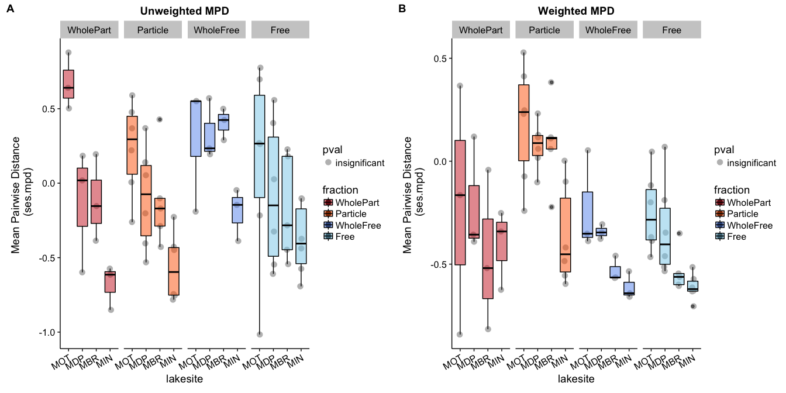


```r
unweight_MPD_wilcox <- wilcox.test(mpd.obs.z ~ fraction, 
             data = filter(unweighted_sesMPD_indepswap, fraction %in% c("WholePart", "WholeFree")))
unweight_MPD_wilcox
```

```
## 
## 	Wilcoxon rank sum test
## 
## data:  mpd.obs.z by fraction
## W = 49, p-value = 0.1978
## alternative hypothesis: true location shift is not equal to 0
```

```r
# Make a data frame to draw significance line in boxplot (visually calculated)
mpd_nums1 <- data.frame(a = c(1.15,1.15,1.85,1.85), b = c(0.9,1,1,0.9)) # WholePart vs WholeFree

indepswap_unweight_mpd <- ggplot(filter(unweighted_sesMPD_indepswap, fraction %in% c("WholePart", "WholeFree")), 
       aes(y = mpd.obs.z, x = fraction)) +
  geom_hline(yintercept = 0, linetype = "dashed", size = 1.5) +
  scale_fill_manual(values = fraction_colors, 
                    breaks=c("WholeFree", "WholePart"), 
                    labels=c("Free-Living", "Particle-Associated")) +
  scale_color_manual(values = fraction_colors,
                 breaks=c("WholeFree", "WholePart"), 
                 labels=c("Free-Living", "Particle-Associated")) + 
  scale_x_discrete(breaks=c("WholeFree", "WholePart"), 
                 labels=c("Free\nLiving", "Particle\nAssociated")) + 
  geom_point(size = 3, position = position_jitterdodge(), aes(color = fraction, fill = fraction)) + 
  geom_boxplot(alpha = 0.5, outlier.shape = NA, aes(color = fraction, fill = fraction)) +
  ylab("Unweighted Mean Pairwise Dist") +
  geom_path(data = mpd_nums1, aes(x = a, y = b), linetype = 1, color = "gray40") +
  scale_y_continuous(limits = c(-1.15,1.15)) + 
  theme(legend.position = "none", 
        axis.title.x = element_blank())


weight_MPD_wilcox <- wilcox.test(mpd.obs.z ~ fraction, 
             data = filter(WEIGHTED_sesMPD_indepswap, fraction %in% c("WholePart", "WholeFree")))
weight_MPD_wilcox
```

```
## 
## 	Wilcoxon rank sum test
## 
## data:  mpd.obs.z by fraction
## W = 88, p-value = 0.3777
## alternative hypothesis: true location shift is not equal to 0
```

```r
filter(WEIGHTED_sesMPD_indepswap, fraction %in% c("WholePart", "WholeFree")) %>%
  group_by(fraction) %>%
  summarize(mean(mpd.obs.z),  median(mpd.obs.z), sd(mpd.obs.z))
```

```
## # A tibble: 2 × 4
##    fraction `mean(mpd.obs.z)` `median(mpd.obs.z)` `sd(mpd.obs.z)`
##      <fctr>             <dbl>               <dbl>           <dbl>
## 1 WholePart        -0.3220245          -0.3490176       0.3603412
## 2 WholeFree        -0.4286019          -0.4238257       0.1934867
```

```r
# Make a data frame to draw significance line in boxplot (visually calculated)
mpd_nums2 <- data.frame(a = c(1.15,1.15,1.85,1.85), b = c(0.9,1,1,0.9)) # WholePart vs WholeFree

indepswap_weight_mpd <- ggplot(filter(WEIGHTED_sesMPD_indepswap, fraction %in% c("WholePart", "WholeFree")), 
       aes(y = mpd.obs.z, x = fraction)) +
  geom_hline(yintercept = 0, slope = 0, linetype = "dashed", size = 1.5) +
  scale_fill_manual(values = fraction_colors, 
                    breaks=c("WholeFree", "WholePart"), 
                    labels=c("Free-Living", "Particle-Associated")) +
  scale_color_manual(values = fraction_colors,
                 breaks=c("WholeFree", "WholePart"), 
                 labels=c("Free-Living", "Particle-Associated")) + 
  scale_x_discrete(breaks=c("WholeFree", "WholePart"), 
                 labels=c("Free\nLiving", "Particle\nAssociated")) + 
  geom_point(size = 3, position = position_jitterdodge(), aes(color = fraction, fill = fraction)) + 
  geom_boxplot(alpha = 0.5, outlier.shape = NA, aes(color = fraction, fill = fraction)) +
  ylab("Weighted Mean Pairwise Dist") +
  geom_path(data = mpd_nums2, aes(x = a, y = b), linetype = 1, color = "gray40") +
  scale_y_continuous(limits = c(-1.15,1.15)) + 
  theme(legend.position = "none", 
        axis.title.x = element_blank())
```

```
## Warning: Ignoring unknown parameters: slope
```

```r
plot_grid(indepswap_unweight_mpd + 
            annotate("text", x=1.55, y=max(mpd_nums1$b), fontface = "bold",  size = 3.5, color = "gray40",
                       label= paste("NS\np =", round(unweight_MPD_wilcox$p.value, digits = 2))), 
          indepswap_weight_mpd +
            annotate("text", x=1.55, y=max(mpd_nums2$b), fontface = "bold",  size = 3.5, color = "gray40",
                       label= paste("NS\np =", round(weight_MPD_wilcox$p.value, digits = 2))),
          labels = c("A", "B"), ncol = 2)
```

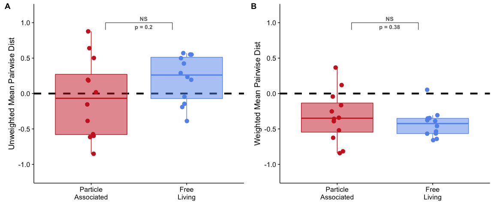


## Indepswap vs richness/invsimps


```r
### Richness DF
combined_rich_unweightedMPD_indepswap <- ML_otu_rich_stats %>%
  dplyr::select(norep_filter_name, mean, sd, measure) %>%
  dplyr::left_join(unweighted_sesMPD_indepswap, by = "norep_filter_name") 
```

```
## Warning in left_join_impl(x, y, by$x, by$y, suffix$x, suffix$y): joining character vector and factor, coercing into character vector
```

```r
summary(lm(mean ~ mpd.obs.z, data = dplyr::filter(combined_rich_unweightedMPD_indepswap, fraction == "WholePart")))
```

```
## 
## Call:
## lm(formula = mean ~ mpd.obs.z, data = dplyr::filter(combined_rich_unweightedMPD_indepswap, 
##     fraction == "WholePart"))
## 
## Residuals:
##      Min       1Q   Median       3Q      Max 
## -138.760  -57.829   -9.699   41.438  258.360 
## 
## Coefficients:
##             Estimate Std. Error t value Pr(>|t|)    
## (Intercept)   442.81      32.43  13.653 8.61e-08 ***
## mpd.obs.z    -186.90      60.34  -3.097   0.0113 *  
## ---
## Signif. codes:  0 '***' 0.001 '**' 0.01 '*' 0.05 '.' 0.1 ' ' 1
## 
## Residual standard error: 111.6 on 10 degrees of freedom
## Multiple R-squared:  0.4896,	Adjusted R-squared:  0.4386 
## F-statistic: 9.593 on 1 and 10 DF,  p-value: 0.0113
```

```r
summary(lm(mean ~ mpd.obs.z, data = dplyr::filter(combined_rich_unweightedMPD_indepswap, fraction == "WholeFree")))
```

```
## 
## Call:
## lm(formula = mean ~ mpd.obs.z, data = dplyr::filter(combined_rich_unweightedMPD_indepswap, 
##     fraction == "WholeFree"))
## 
## Residuals:
##      Min       1Q   Median       3Q      Max 
## -132.119  -51.464    2.329   55.796  126.145 
## 
## Coefficients:
##             Estimate Std. Error t value Pr(>|t|)    
## (Intercept)   306.08      26.08  11.736  3.6e-07 ***
## mpd.obs.z    -116.42      68.32  -1.704    0.119    
## ---
## Signif. codes:  0 '***' 0.001 '**' 0.01 '*' 0.05 '.' 0.1 ' ' 1
## 
## Residual standard error: 75.16 on 10 degrees of freedom
## Multiple R-squared:  0.2251,	Adjusted R-squared:  0.1476 
## F-statistic: 2.904 on 1 and 10 DF,  p-value: 0.1192
```

```r
lmALL_unweightMPD_vs_rich_indepswap <- lm(mean ~ mpd.obs.z, data = dplyr::filter(combined_rich_unweightedMPD_indepswap,
                                                  fraction %in% c("WholePart", "WholeFree")))
summary(lmALL_unweightMPD_vs_rich_indepswap)
```

```
## 
## Call:
## lm(formula = mean ~ mpd.obs.z, data = dplyr::filter(combined_rich_unweightedMPD_indepswap, 
##     fraction %in% c("WholePart", "WholeFree")))
## 
## Residuals:
##     Min      1Q  Median      3Q     Max 
## -227.44  -82.48   10.30   46.63  308.76 
## 
## Coefficients:
##             Estimate Std. Error t value Pr(>|t|)    
## (Intercept)   383.60      23.05  16.644 5.96e-14 ***
## mpd.obs.z    -209.68      49.44  -4.241 0.000335 ***
## ---
## Signif. codes:  0 '***' 0.001 '**' 0.01 '*' 0.05 '.' 0.1 ' ' 1
## 
## Residual standard error: 111.5 on 22 degrees of freedom
## Multiple R-squared:  0.4498,	Adjusted R-squared:  0.4248 
## F-statistic: 17.99 on 1 and 22 DF,  p-value: 0.0003349
```

```r
# Test for the interaction between fraction and phylo div
lm_divs_test_interaction <- lm(mean ~ mpd.obs.z * fraction, data = combined_rich_unweightedMPD_indepswap)
Anova(lm_divs_test_interaction, type = "II")
```

```
## Anova Table (Type II tests)
## 
## Response: mean
##                    Sum Sq Df F value   Pr(>F)   
## mpd.obs.z          131379  1 14.5197 0.001095 **
## fraction            87945  1  9.7195 0.005424 **
## mpd.obs.z:fraction   4440  1  0.4907 0.491674   
## Residuals          180967 20                    
## ---
## Signif. codes:  0 '***' 0.001 '**' 0.01 '*' 0.05 '.' 0.1 ' ' 1
```

```r
# Not significant
lm_divs_test <- lm(mean ~ mpd.obs.z + fraction, data = combined_rich_unweightedMPD_indepswap)
anova(lm_divs_test, lm_divs_test_interaction)
```

```
## Analysis of Variance Table
## 
## Model 1: mean ~ mpd.obs.z + fraction
## Model 2: mean ~ mpd.obs.z * fraction
##   Res.Df    RSS Df Sum of Sq      F Pr(>F)
## 1     21 185407                           
## 2     20 180967  1    4440.2 0.4907 0.4917
```

```r
divs_p1_indepswap <- ggplot(combined_rich_unweightedMPD_indepswap, aes(y = mean, x = mpd.obs.z)) + 
  geom_vline(xintercept = 0, linetype = "dashed", size = 1.5) + 
  geom_point(size = 3) + 
  scale_x_continuous(limits = c(-1.15,1.15)) + 
  geom_smooth(method = "lm", color = "black") +
  xlab("Unweighted MPD") + ylab("Observed Richness") +
  theme(legend.position = c(0.85, 0.9),
        legend.title = element_blank()) +
  annotate("text", x = -0.8, y=200, 
         color = "black", fontface = "bold",
         label = paste("R2 =", round(summary(lmALL_unweightMPD_vs_rich_indepswap)$adj.r.squared, 
                                     digits = 2), "\n", 
                       "p =", round(unname(summary(lmALL_unweightMPD_vs_rich_indepswap)$coefficients[,4][2]), 
                                    digits = 4))) 

# Plot both of the models 
divs_p2_indepswap <- ggplot(combined_rich_unweightedMPD_indepswap, aes(y = mean, x = mpd.obs.z, color = fraction)) + 
  geom_vline(xintercept = 0, linetype = "dashed", size = 1.5) +
  geom_point(size = 3) + 
  scale_x_continuous(limits = c(-1.15,1.15)) + 
  scale_color_manual(values = fraction_colors) + 
  geom_smooth(method = "lm", data = dplyr::filter(combined_rich_unweightedMPD_indepswap, fraction == "WholePart")) +
  xlab("Unweighted MPD") + ylab("Observed Richness") +
  theme(legend.position = c(0.85, 0.9),
        legend.title = element_blank()) +
  annotate("text", -0.8, y=355,  
         color = "firebrick3", fontface = "bold",
         label = paste("R2 =", round(summary(lm_part_divs_rich_vs_unweight)$adj.r.squared, 
                                     digits = 2), "\n", 
                       "p =", round(unname(summary(lm_part_divs_rich_vs_unweight)$coefficients[,4][2]), 
                                    digits = 3))) +
  annotate("text", -0.8, y=200,
         color = "cornflowerblue", fontface = "bold",
         label = paste("R2 =", round(summary(lm_free_divs_rich_vs_unweight)$adj.r.squared, 
                                     digits = 2), "\n", 
                       "p =", round(unname(summary(lm_free_divs_rich_vs_unweight)$coefficients[,4][2]), 
                                    digits = 3))) +
    annotate("text", 0.75, y=600,
         color = "black", fontface = "bold",
         label = paste("Combined:\nR2 =", round(summary(lmALL_unweightMPD_vs_rich_indepswap)$adj.r.squared, 
                                     digits = 2), "\n", 
                       "p =", round(unname(summary(lmALL_unweightMPD_vs_rich_indepswap)$coefficients[,4][2]), 
                                    digits = 4)))
  


### INVERSE SIMPS
combined_invsimps_weightedMPD_indepswap <- ML_otu_invsimps_stats %>%
  dplyr::select(norep_filter_name, mean, sd, measure) %>%
  dplyr::left_join(WEIGHTED_sesMPD_indepswap, by = "norep_filter_name") 
```

```
## Warning in left_join_impl(x, y, by$x, by$y, suffix$x, suffix$y): joining character vector and factor, coercing into character vector
```

```r
summary(lm(mean ~ mpd.obs.z, data = dplyr::filter(combined_invsimps_weightedMPD_indepswap, fraction == "WholePart")))
```

```
## 
## Call:
## lm(formula = mean ~ mpd.obs.z, data = dplyr::filter(combined_invsimps_weightedMPD_indepswap, 
##     fraction == "WholePart"))
## 
## Residuals:
##    Min     1Q Median     3Q    Max 
## -22.59 -18.13 -10.29  19.96  45.62 
## 
## Coefficients:
##             Estimate Std. Error t value Pr(>|t|)    
## (Intercept)   46.813      9.906   4.726 0.000809 ***
## mpd.obs.z     28.882     20.990   1.376 0.198854    
## ---
## Signif. codes:  0 '***' 0.001 '**' 0.01 '*' 0.05 '.' 0.1 ' ' 1
## 
## Residual standard error: 25.09 on 10 degrees of freedom
## Multiple R-squared:  0.1592,	Adjusted R-squared:  0.07511 
## F-statistic: 1.893 on 1 and 10 DF,  p-value: 0.1989
```

```r
summary(lm(mean ~ mpd.obs.z, data = dplyr::filter(combined_invsimps_weightedMPD_indepswap, fraction == "WholeFree")))
```

```
## 
## Call:
## lm(formula = mean ~ mpd.obs.z, data = dplyr::filter(combined_invsimps_weightedMPD_indepswap, 
##     fraction == "WholeFree"))
## 
## Residuals:
##     Min      1Q  Median      3Q     Max 
## -12.366  -4.654  -1.018   2.253  21.658 
## 
## Coefficients:
##             Estimate Std. Error t value Pr(>|t|)   
## (Intercept)   25.626      6.814   3.761  0.00372 **
## mpd.obs.z      1.799     14.594   0.123  0.90436   
## ---
## Signif. codes:  0 '***' 0.001 '**' 0.01 '*' 0.05 '.' 0.1 ' ' 1
## 
## Residual standard error: 9.365 on 10 degrees of freedom
## Multiple R-squared:  0.001517,	Adjusted R-squared:  -0.09833 
## F-statistic: 0.01519 on 1 and 10 DF,  p-value: 0.9044
```

```r
summary(lm(mean ~ mpd.obs.z, data = combined_invsimps_weightedMPD_indepswap))
```

```
## 
## Call:
## lm(formula = mean ~ mpd.obs.z, data = combined_invsimps_weightedMPD_indepswap)
## 
## Residuals:
##     Min      1Q  Median      3Q     Max 
## -17.251 -13.401  -5.750   0.725  50.734 
## 
## Coefficients:
##             Estimate Std. Error t value Pr(>|t|)    
## (Intercept)   41.035      6.484   6.329 2.28e-06 ***
## mpd.obs.z     26.247     13.812   1.900   0.0706 .  
## ---
## Signif. codes:  0 '***' 0.001 '**' 0.01 '*' 0.05 '.' 0.1 ' ' 1
## 
## Residual standard error: 19.08 on 22 degrees of freedom
## Multiple R-squared:  0.141,	Adjusted R-squared:  0.102 
## F-statistic: 3.611 on 1 and 22 DF,  p-value: 0.07058
```

```r
# All points together
evendivs_p1_indepswap <- ggplot(combined_invsimps_weightedMPD_indepswap, aes(y = mean, x = mpd.obs.z)) + 
  geom_vline(xintercept = 0, linetype = "dashed", size = 1.5) + 
  geom_point(size = 3) +  
  scale_x_continuous(limits = c(-1.15,1.15)) + 
  geom_smooth(color = "black") +
  xlab("Weighted MPD") + ylab("Inverse Simpson") +
  theme(legend.position = c(0.85, 0.85),
        legend.title = element_blank())

# Models separately
evendivs_p2_indepswap <- ggplot(combined_invsimps_weightedMPD_indepswap, aes(y = mean, x = mpd.obs.z, color = fraction)) + 
  geom_vline(xintercept = 0, linetype = "dashed", size = 1.5) +
  geom_point(size = 3) + 
  scale_x_continuous(limits = c(-1.15,1.15)) + 
  scale_color_manual(values = fraction_colors) + 
  #geom_smooth(method = "lm") +
  xlab("Weighted MPD") + ylab("Inverse Simpson") +
  theme(legend.position = c(0.85, 0.85),
        legend.title = element_blank()) +
  annotate("text", x = 0.5, y=70, 
     color = "cornflowerblue", fontface = "bold",
     label = paste("R2 =", round(summary(lm(mean ~ mpd.obs.z, 
                                            data = dplyr::filter(combined_invsimps_weightedMPD_indepswap, fraction == "WholeFree")))$adj.r.squared, 
                                 digits = 2), "\n", 
                   "p =", round(unname(summary(lm(mean ~ mpd.obs.z, 
                                                  data = dplyr::filter(combined_invsimps_weightedMPD_indepswap, fraction == "WholeFree")))$coefficients[,4][2]), 
                                digits = 4))) +
    annotate("text", x = 0.5, y=48, 
     color = "firebrick3", fontface = "bold",
     label = paste("R2 =", round(summary(lm(mean ~ mpd.obs.z, 
                                            data = dplyr::filter(combined_invsimps_weightedMPD_indepswap, fraction == "WholePart")))$adj.r.squared, 
                                 digits = 2), "\n", 
                   "p =", round(unname(summary(lm(mean ~ mpd.obs.z, 
                                                  data = dplyr::filter(combined_invsimps_weightedMPD_indepswap, fraction == "WholePart")))$coefficients[,4][2]), 
                                digits = 3))) 


plot_grid(divs_p1_indepswap, divs_p2_indepswap, evendivs_p1_indepswap, evendivs_p2_indepswap,
          labels = c("A", "B", "C", "D"))
```


# Fig 3: Indepswap

```r
# Shared legends: https://cran.r-project.org/web/packages/cowplot/vignettes/shared_legends.html
indepswap_legend_fig3 <- get_legend(indepswap_unweight_mpd + theme(legend.position="top", legend.title = element_blank()))


indepswap_MPD_boxplots_nolegend <- plot_grid(
          # Plot 1: Unweighted MPD 
          indepswap_unweight_mpd + xlab("Fraction \n") + coord_flip() + 
            annotate("text", x=1.55, y=(max(mpd_nums1$b)+0.1), fontface = "bold",  size = 3.5, color = "gray40",
                       label= paste("NS")) +
            theme(axis.text.y = element_blank(), 
                  plot.margin = unit(c(5,2,0,5), "pt")),  #top, right, bottom, and left
          # Plot 2: Weighted MPD 
           indepswap_weight_mpd + xlab("Fraction \n") + coord_flip() + 
            annotate("text", x=1.55, y=(max(mpd_nums2$b)+0.1), fontface = "bold",  size = 3.5, color = "gray40",
                       label= paste("NS")) + 
            theme(axis.text.y = element_blank(), 
                  plot.margin = unit(c(5,2,0,5), "pt")),
          ncol = 2, nrow = 1, labels = c("A", "B"))


indepwap_MPD_boxplots_yeslegend <- plot_grid(indepswap_legend_fig3,             # Draw the legend first 
                                    indepswap_MPD_boxplots_nolegend,   # Draw the plots second
                                    ncol = 1, rel_heights = c(0.1, 1))

# PLOT
indepswap_div_vs_div_plots <- 
  plot_grid(divs_p2_indepswap + theme(legend.position = "none", plot.margin = unit(c(0,2,0,0), "pt")) +
            xlab("Standardized Effect Size\n Unweighted Mean Pairwise Dist"), # Richness vs UNweighted MPD
          evendivs_p2_indepswap + theme(legend.position = "none", plot.margin = unit(c(0,2,0,0), "pt")) +
             xlab("Standardized Effect Size\n Weighted Mean Pairwise Dist"), # Inverse Simpson vs Weighted MPD 
          nrow = 1, ncol = 2,
          labels = c("C", "D"))


indepswap_final_fig3 <- plot_grid(indepswap_MPD_boxplots_nolegend, 
                        indepswap_div_vs_div_plots, ncol = 1,
                        rel_heights = c(1.2, 2))

indepswap_final_fig3
```

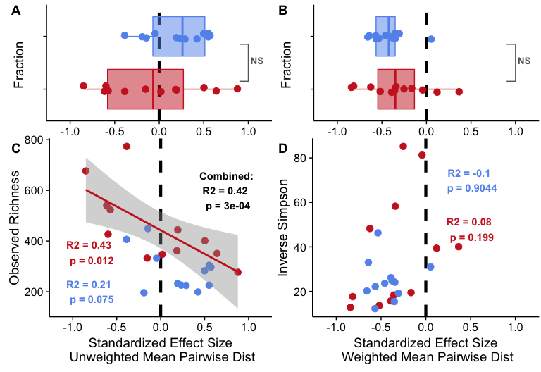

```r
#### REMOVE X AXIS FOR TOP FIGURE 
MPD_boxplots_nolegend_noX_indepswap <- plot_grid(
          # Plot 1: Unweighted MPD INDEPSWAP
          indepswap_unweight_mpd + xlab("Fraction \n") + coord_flip() + 
            annotate("text", x=1.55, y=(max(mpd_nums1$b)+0.1), fontface = "bold",  size = 3.5, color = "gray40",
                       label= paste("NS")) +
            theme(axis.text.y = element_blank(), 
                  plot.margin = unit(c(5,2,10,3), "pt"),  #top, right, bottom, and left
                  axis.title.x=element_blank(), axis.line.x = element_blank(), 
                  axis.text.x=element_blank(), axis.ticks.x=element_blank()), 
          # Plot 2: Weighted MPD INDEPSWAP
           indepswap_weight_mpd + xlab("Fraction \n") + coord_flip() + 
            annotate("text", x=1.55, y=(max(mpd_nums2$b)+0.1), fontface = "bold",  size = 3.5, color = "gray40",
                       label= paste("NS")) + 
            theme(axis.text.y = element_blank(), 
                  plot.margin = unit(c(5,7,10,10), "pt"),  #top, right, bottom, and left
                  axis.title.x=element_blank(), axis.line.x = element_blank(), 
                  axis.text.x=element_blank(), axis.ticks.x=element_blank()), 
          ncol = 2, nrow = 1, labels = c("A", "B"))


MPD_boxplots_yeslegend_noX_indepswap <- plot_grid(legend_fig3,             # Draw the legend first 
                                    MPD_boxplots_nolegend_noX_indepswap,   # Draw the plots second
                                    ncol = 1, rel_heights = c(0.1, 1))


final_fig3_noX_indepswap <- plot_grid(MPD_boxplots_yeslegend_noX_indepswap, 
                        indepswap_div_vs_div_plots, ncol = 1,
                        rel_heights = c(1.2, 2))

final_fig3_noX_indepswap
```

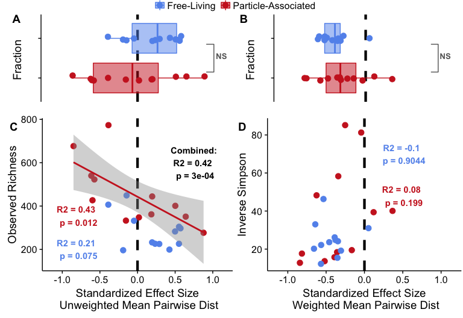


## Indepswap vs Productivity


```r
##########  MPD ANALYSIS 
lmFL_unweightedMPD_indepswap <- lm(frac_bacprod ~ mpd.obs.z, 
                                      data = filter(unweighted_sesMPD_indepswap, fraction == "WholeFree"))
lmPA_unweightedMPD_indepswap <- lm(frac_bacprod ~ mpd.obs.z, 
                                      data = filter(unweighted_sesMPD_indepswap, fraction == "WholePart"))

lmALL_unweightedMPD_indepswap <- lm(frac_bacprod ~ mpd.obs.z, 
                                      data = filter(unweighted_sesMPD_indepswap, fraction %in% c("WholePart", "WholeFree")))
summary(lmALL_unweightedMPD_indepswap)
```

```
## 
## Call:
## lm(formula = frac_bacprod ~ mpd.obs.z, data = filter(unweighted_sesMPD_indepswap, 
##     fraction %in% c("WholePart", "WholeFree")))
## 
## Residuals:
##     Min      1Q  Median      3Q     Max 
## -20.877  -7.986  -4.865   4.795  41.868 
## 
## Coefficients:
##             Estimate Std. Error t value Pr(>|t|)    
## (Intercept)   17.767      3.051   5.823 7.38e-06 ***
## mpd.obs.z    -10.211      6.545  -1.560    0.133    
## ---
## Signif. codes:  0 '***' 0.001 '**' 0.01 '*' 0.05 '.' 0.1 ' ' 1
## 
## Residual standard error: 14.76 on 22 degrees of freedom
## Multiple R-squared:  0.09961,	Adjusted R-squared:  0.05868 
## F-statistic: 2.434 on 1 and 22 DF,  p-value: 0.133
```

```r
unweightedMPD_vs_fracprod_indepswap <-  
  ggplot(filter(unweighted_sesMPD_indepswap, fraction %in% c("WholePart", "WholeFree")), 
       aes(x = mpd.obs.z, y = frac_bacprod, color = fraction)) + 
  geom_vline(xintercept = 0, linetype = "dashed", size = 1.5) +
  geom_point(size = 3) +
  xlab("Standardized Effect Size \nUnweighted Mean Pairwise Dist") + 
  ylab("Heterotrophic Production \n(μgC/L/hr)") +
  scale_color_manual(values = c("firebrick3", "cornflowerblue")) +
  geom_smooth(method = "lm") +
  scale_x_continuous(limits = c(-1.5,1.5)) + 
  theme(legend.position = "none", legend.title = element_blank()) +
  annotate("text", x = -0.85, y=-2, 
           color = "firebrick3", fontface = "bold",
           label = paste("R2 =", round(summary(lmPA_unweightedMPD_indepswap)$adj.r.squared, digits = 2), "\n", 
                         "p =", round(unname(summary(lmPA_unweightedMPD_indepswap)$coefficients[,4][2]), digits = 3))) +
  annotate("text", x = -0.85, y=50, 
         color = "cornflowerblue", fontface = "bold",
         label = paste("R2 =", round(summary(lmFL_unweightedMPD_indepswap)$adj.r.squared, digits = 2), "\n", 
                       "p =", round(unname(summary(lmFL_unweightedMPD_indepswap)$coefficients[,4][2]), digits = 3))) +
  annotate("text", x = 0.85, y=50, 
         color = "black", fontface = "bold",
         label = paste("Combined:\n", " R2 =", round(summary(lmALL_unweightedMPD_indepswap)$adj.r.squared, digits = 2), "\n", 
                       "p =", round(unname(summary(lmALL_unweightedMPD_indepswap)$coefficients[,4][2]), digits = 4)))


### PER CELL
##########  MPD ANALYSIS 
lmFL_unweightedMPD_indepswap_PERCELL <- lm(log10(fracprod_per_cell_noinf) ~ mpd.obs.z, 
                                      data = filter(unweighted_sesMPD_indepswap, fraction == "WholeFree"))
lmPA_unweightedMPD_indepswap_PERCELL <- lm(log10(fracprod_per_cell_noinf) ~ mpd.obs.z, 
                                      data = filter(unweighted_sesMPD_indepswap, fraction == "WholePart"))
lmALL_unweightedMPD_indepswap_PERCELL <- lm(log10(fracprod_per_cell_noinf) ~ mpd.obs.z, 
                                            data = dplyr::filter(unweighted_sesMPD_indepswap, fraction %in% c("WholePart", "WholeFree")))

unweightedMPD_vs_fracprod_indepswap_PERCELL <- 
  ggplot(filter(unweighted_sesMPD_indepswap, fraction %in% c("WholePart", "WholeFree")), 
       aes(x = mpd.obs.z, y = log10(fracprod_per_cell_noinf), color = fraction)) + 
  geom_vline(xintercept = 0, linetype = "dashed", size = 1.5) +
  geom_point(size = 3) +
  scale_x_continuous(limits = c(-1.5,1.5)) + 
  scale_y_continuous(limits = c(-8.25, -5.4), breaks = c(-8, -7,  -6)) +
  xlab("Standardized Effect Size \nUnweighted Mean Pairwise Dist") + 
  ylab("log10(Production/Cell)\n (μgC/cell/hr)") + 
  scale_color_manual(values = c("firebrick3", "cornflowerblue")) +
  geom_smooth(method = "lm") +
  theme(legend.position = "none", legend.title = element_blank()) +
  annotate("text", x = -0.85, y=-7.1, 
           color = "firebrick3", fontface = "bold",
           label = paste("R2 =", round(summary(lmPA_unweightedMPD_indepswap_PERCELL)$adj.r.squared, digits = 2), "\n", 
                         "p =", round(unname(summary(lmPA_unweightedMPD_indepswap_PERCELL)$coefficients[,4][2]), digits = 3))) +
  annotate("text", x = -0.85, y=-7.75, 
         color = "cornflowerblue", fontface = "bold",
         label = paste("R2 =", round(summary(percell_lmFL_unweightedMPD_taxalab)$adj.r.squared, digits = 2), "\n", 
                       "p =", round(unname(summary(percell_lmFL_unweightedMPD_taxalab)$coefficients[,4][2]), digits = 3))) +
    annotate("text", x = 0.85, y= -6, 
         color = "black", fontface = "bold",
         label = paste("Combined:\n", " R2 =", round(summary(lmALL_unweightedMPD_indepswap_PERCELL)$adj.r.squared, digits = 2), "\n", 
                       "p =", round(unname(summary(lmALL_unweightedMPD_indepswap_PERCELL)$coefficients[,4][2]), digits = 4)))


####### WEIGHTED MPD ANALYSIS
lmFL_weightedMPD_indepswap <- lm(frac_bacprod ~ mpd.obs.z, 
                                      data = filter(WEIGHTED_sesMPD_indepswap, fraction == "WholeFree"))
lmPA_weightedMPD_indepswap <- lm(frac_bacprod ~ mpd.obs.z, 
                                      data = filter(WEIGHTED_sesMPD_indepswap, fraction == "WholePart"))

weightedMPD_vs_fracprod_indepswap <- ggplot(filter(WEIGHTED_sesMPD_indepswap, fraction %in% c("WholePart", "WholeFree")), 
       aes(x = mpd.obs.z, y = frac_bacprod, color = fraction)) + 
  geom_vline(xintercept = 0, linetype = "dashed", size = 1.5) +
  geom_point(size = 3) +
  xlab("Standardized Effect Size \nWeighted Mean Pairwise Dist") + 
  ylab("Heterotrophic Production \n(μgC/L/hr)") +
  scale_color_manual(values = c("firebrick3", "cornflowerblue")) +
  theme(legend.position = "none", legend.title = element_blank()) +
  scale_x_continuous(limits = c(-1.15,1.15)) + 
  annotate("text", x = 0.75, y=25, 
           color = "firebrick3", fontface = "bold",
           label = paste("R2 =", round(summary(lmPA_weightedMPD_indepswap)$adj.r.squared, digits = 4), "\n", 
                         "p =", round(unname(summary(lmPA_weightedMPD_indepswap)$coefficients[,4][2]), digits = 4))) +
  annotate("text", x = 0.75, y=45, 
         color = "cornflowerblue", fontface = "bold",
         label = paste("R2 =", round(summary(lmFL_weightedMPD_indepswap)$adj.r.squared, digits = 4), "\n", 
                       "p =", round(unname(summary(lmFL_weightedMPD_indepswap)$coefficients[,4][2]), digits = 4))) 


### PER CELL
##########  MPD ANALYSIS 
lmFL_weightedMPD_indepswap_PERCELL <- lm(log10(fracprod_per_cell_noinf) ~ mpd.obs.z, 
                                      data = filter(WEIGHTED_sesMPD_indepswap, fraction == "WholeFree"))
lmPA_weightedMPD_indepswap_PERCELL <- lm(log10(fracprod_per_cell_noinf) ~ mpd.obs.z, 
                                      data = filter(WEIGHTED_sesMPD_indepswap, fraction == "WholePart"))
lmALL_weightedMPD_indepswap_PERCELL <- lm(log10(fracprod_per_cell_noinf) ~ mpd.obs.z, 
                                            data = dplyr::filter(WEIGHTED_sesMPD_indepswap, fraction %in% c("WholePart", "WholeFree")))


summary(lm(log10(fracprod_per_cell_noinf) ~ mpd.obs.z * fraction, 
                                            data = dplyr::filter(WEIGHTED_sesMPD_indepswap, fraction %in% c("WholePart", "WholeFree"))))
```

```
## 
## Call:
## lm(formula = log10(fracprod_per_cell_noinf) ~ mpd.obs.z * fraction, 
##     data = dplyr::filter(WEIGHTED_sesMPD_indepswap, fraction %in% 
##         c("WholePart", "WholeFree")))
## 
## Residuals:
##      Min       1Q   Median       3Q      Max 
## -0.64112 -0.27776  0.02912  0.21094  1.14024 
## 
## Coefficients:
##                             Estimate Std. Error t value Pr(>|t|)    
## (Intercept)                  -6.4044     0.2239 -28.609  < 2e-16 ***
## mpd.obs.z                     0.8357     0.4660   1.793  0.08886 .  
## fractionWholeFree            -1.4297     0.3935  -3.633  0.00177 ** 
## mpd.obs.z:fractionWholeFree  -1.4400     0.8352  -1.724  0.10093    
## ---
## Signif. codes:  0 '***' 0.001 '**' 0.01 '*' 0.05 '.' 0.1 ' ' 1
## 
## Residual standard error: 0.4448 on 19 degrees of freedom
##   (1 observation deleted due to missingness)
## Multiple R-squared:  0.5672,	Adjusted R-squared:  0.4988 
## F-statistic: 8.299 on 3 and 19 DF,  p-value: 0.000988
```

```r
weightedMPD_vs_fracprod_indepswap_PERCELL <- 
  ggplot(filter(WEIGHTED_sesMPD_indepswap, fraction %in% c("WholePart", "WholeFree")), 
       aes(x = mpd.obs.z, y = log10(fracprod_per_cell_noinf), color = fraction)) + 
  geom_vline(xintercept = 0, linetype = "dashed", size = 1.5) +
  geom_point(size = 3) +
  scale_x_continuous(limits = c(-1.5,1.5)) + 
  scale_y_continuous(limits = c(-8.25, -5.4), breaks = c(-8, -7,  -6)) +
  xlab("Standardized Effect Size \nWeighted Mean Pairwise Dist") + 
  ylab("log10(Production/Cell)\n (μgC/cell/hr)") + 
  scale_color_manual(values = c("firebrick3", "cornflowerblue")) +
  geom_smooth(method = "lm") +
  theme(legend.position = "none", legend.title = element_blank()) +
  annotate("text", x = 0.75, y=-7.1, 
           color = "firebrick3", fontface = "bold",
           label = paste("R2 =", round(summary(lmPA_weightedMPD_indepswap_PERCELL)$adj.r.squared, digits = 2), "\n", 
                         "p =", round(unname(summary(lmPA_weightedMPD_indepswap_PERCELL)$coefficients[,4][2]), digits = 3))) +
  annotate("text", x = 0.75, y=-7.75, 
         color = "cornflowerblue", fontface = "bold",
         label = paste("R2 =", round(summary(lmFL_weightedMPD_indepswap_PERCELL)$adj.r.squared, digits = 2), "\n", 
                       "p =", round(unname(summary(lmFL_weightedMPD_indepswap_PERCELL)$coefficients[,4][2]), digits = 3))) +
    annotate("text", x = 1, y=-5.85, 
         color = "black", fontface = "bold",
         label = paste("Combined:\n", " R2 =", round(summary(lmALL_weightedMPD_indepswap_PERCELL)$adj.r.squared, digits = 2), "\n", 
                       "p =", round(unname(summary(lmALL_weightedMPD_indepswap_PERCELL)$coefficients[,4][2]), digits = 4)))


# Plot it altogether 
plot_grid(unweightedMPD_vs_fracprod_indepswap, weightedMPD_vs_fracprod_indepswap, 
          unweightedMPD_vs_fracprod_indepswap_PERCELL, weightedMPD_vs_fracprod_indepswap_PERCELL,
          labels = c("A", "B", "C", "D"), ncol = 2, nrow = 2)
```

```
## Warning in grid.Call(L_stringMetric, as.graphicsAnnot(x$label)): conversion failure on '(μgC/L/hr)' in 'mbcsToSbcs': dot substituted for <ce>
```

```
## Warning in grid.Call(L_stringMetric, as.graphicsAnnot(x$label)): conversion failure on '(μgC/L/hr)' in 'mbcsToSbcs': dot substituted for <bc>
```

```
## Warning in grid.Call(L_stringMetric, as.graphicsAnnot(x$label)): conversion failure on '(μgC/L/hr)' in 'mbcsToSbcs': dot substituted for <ce>
```

```
## Warning in grid.Call(L_stringMetric, as.graphicsAnnot(x$label)): conversion failure on '(μgC/L/hr)' in 'mbcsToSbcs': dot substituted for <bc>
```

```
## Warning: Removed 1 rows containing non-finite values (stat_smooth).
```

```
## Warning: Removed 1 rows containing missing values (geom_point).
```

```
## Warning in grid.Call(L_stringMetric, as.graphicsAnnot(x$label)): conversion failure on ' (μgC/cell/hr)' in 'mbcsToSbcs': dot substituted for <ce>
```

```
## Warning in grid.Call(L_stringMetric, as.graphicsAnnot(x$label)): conversion failure on ' (μgC/cell/hr)' in 'mbcsToSbcs': dot substituted for <bc>
```

```
## Warning: Removed 1 rows containing non-finite values (stat_smooth).
```

```
## Warning: Removed 1 rows containing missing values (geom_point).
```

```
## Warning in grid.Call(L_stringMetric, as.graphicsAnnot(x$label)): conversion failure on ' (μgC/cell/hr)' in 'mbcsToSbcs': dot substituted for <ce>
```

```
## Warning in grid.Call(L_stringMetric, as.graphicsAnnot(x$label)): conversion failure on ' (μgC/cell/hr)' in 'mbcsToSbcs': dot substituted for <bc>
```

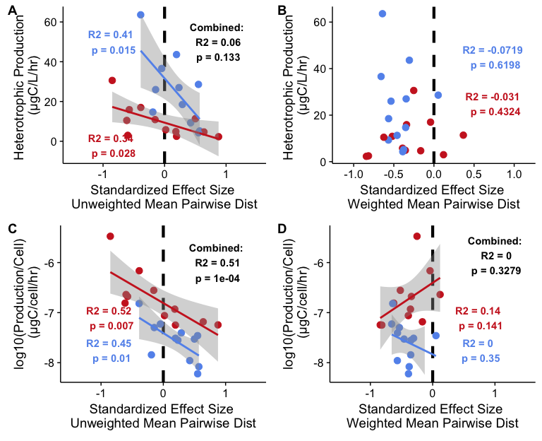


# Alternate: Fig 3

```r
# Put all of the plots together 

plot_grid(
          # Plot 1: Distribution of unweighted MPD INDEPSWAP
          indepswap_unweight_mpd + xlab("Fraction") + coord_flip() + 
            annotate("text", x=1.55, y=(max(mpd_nums1$b)+0.1), fontface = "bold",  size = 3.5, color = "gray40", label= paste("NS")) +
            scale_y_continuous(limits = c(-1.15,1.15)) + 
            theme(legend.position = "top", legend.title = element_blank(),
                  axis.text.y = element_blank(), 
                  plot.margin = unit(c(3,2,10,9), "pt"),  #top, right, bottom, and left
                  axis.title.x=element_blank(), axis.text.x=element_blank()),
          
          # Plot 2: Unweighted MPD INDEPSWAP
          divs_p2_indepswap + theme(legend.position = "none", plot.margin = unit(c(0,2,0,0), "pt")) +
          ylab("Observed Richness") +
          scale_x_continuous(limits = c(-1.15,1.15)) +
          theme(axis.title.x=element_blank(), axis.text.x=element_blank(),
                plot.margin = unit(c(3,2,10,3), "pt")),  #top, right, bottom, and left),
        
          # Plot 3: Bulk Prod 
          unweightedMPD_vs_fracprod_indepswap + scale_x_continuous(limits = c(-1.15,1.15)) +
          theme(axis.title.x=element_blank(), axis.text.x=element_blank(),
                plot.margin = unit(c(3,2,10,3), "pt")),  #top, right, bottom, and left),
          
          # Plot 4:  Percell prod
          unweightedMPD_vs_fracprod_indepswap_PERCELL + scale_x_continuous(limits = c(-1.15,1.15)) +
          xlab("Standardized Effect Size\n Unweighted Mean Pairwise Dist") +
          theme(plot.margin = unit(c(3,2,10,3), "pt")),  #top, right, bottom, and left),
          
          # Add labels, rows, and relative heights 
          labels = c("A", "B", "C", "D"),
          ncol = 1, nrow = 4,
          align = "v",
          rel_heights = c(1.2, 2, 2, 2.3))
```

```
## Warning in grid.Call(L_stringMetric, as.graphicsAnnot(x$label)): conversion failure on '(μgC/L/hr)' in 'mbcsToSbcs': dot substituted for <ce>
```

```
## Warning in grid.Call(L_stringMetric, as.graphicsAnnot(x$label)): conversion failure on '(μgC/L/hr)' in 'mbcsToSbcs': dot substituted for <bc>
```

```
## Warning: Removed 1 rows containing non-finite values (stat_smooth).
```

```
## Warning: Removed 1 rows containing missing values (geom_point).
```

```
## Warning in grid.Call(L_stringMetric, as.graphicsAnnot(x$label)): conversion failure on ' (μgC/cell/hr)' in 'mbcsToSbcs': dot substituted for <ce>
```

```
## Warning in grid.Call(L_stringMetric, as.graphicsAnnot(x$label)): conversion failure on ' (μgC/cell/hr)' in 'mbcsToSbcs': dot substituted for <bc>
```

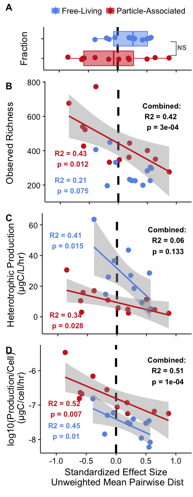


# Multiple regression: IndepSwap


```r
prod_data <- unweighted_sesMPD_indepswap %>%
  dplyr::filter(year == "2015" & fraction %in% c("WholePart", "WholeFree")) %>%
  dplyr::select(norep_filter_name,frac_bacprod, SD_frac_bacprod, fracprod_per_cell_noinf) 

unweight_phylo_df <- unweighted_sesMPD_indepswap %>%
  dplyr::filter(year == "2015" & fraction %in% c("WholePart", "WholeFree")) %>%
  dplyr::select(norep_filter_name,frac_bacprod, SD_frac_bacprod, fracprod_per_cell_noinf, mpd.obs.z) %>%
  mutate(measure = "Unweighted_MPD") %>%
  dplyr::rename(mean = mpd.obs.z)

weight_phylo_df <- WEIGHTED_sesMPD_indepswap %>%
  dplyr::filter(year == "2015" & fraction %in% c("WholePart", "WholeFree")) %>%
  dplyr::select(norep_filter_name,frac_bacprod, SD_frac_bacprod, fracprod_per_cell_noinf, mpd.obs.z) %>%
  mutate(measure = "Weighted_MPD") %>%
  dplyr::rename(mean = mpd.obs.z)


rich_df <- ML_otu_rich_stats %>%
  dplyr::select(norep_filter_name, frac_bacprod, SD_frac_bacprod, fracprod_per_cell_noinf, mean, measure) 

shannon_df <- ML_otu_shannon_stats %>%
  dplyr::select(norep_filter_name, frac_bacprod, SD_frac_bacprod, fracprod_per_cell_noinf, mean, measure) 

invsimps_df <- ML_otu_invsimps_stats %>%
  dplyr::select(norep_filter_name, frac_bacprod, SD_frac_bacprod, fracprod_per_cell_noinf, mean, measure) 

simpseven_df <- ML_otu_simpseven_stats %>%
  dplyr::select(norep_filter_name, frac_bacprod, SD_frac_bacprod, fracprod_per_cell_noinf, mean, measure)  


all_div_measures <- rbind(unweight_phylo_df, weight_phylo_df, rich_df, shannon_df, invsimps_df, simpseven_df)


all_divs <- all_div_measures %>%
  dplyr::select(norep_filter_name, mean, measure) %>%
  tidyr::spread(measure, mean) %>%
  tibble::remove_rownames() %>%
  tibble::column_to_rownames(var = "norep_filter_name") 


# Scale to a mean = 0 and  SD = 1
scale_all_divs <- scale(all_divs)

# Sanity Check
colMeans(scale_all_divs)  # faster version of apply(scaled.dat, 2, mean)
```

```
##   Inverse_Simpson          Richness   Shannon_Entropy Simpsons_Evenness    Unweighted_MPD      Weighted_MPD 
##      4.365721e-17     -1.827242e-16     -3.921921e-16      1.590163e-16      2.949030e-17      8.792880e-17
```

```r
apply(scale_all_divs, 2, sd)
```

```
##   Inverse_Simpson          Richness   Shannon_Entropy Simpsons_Evenness    Unweighted_MPD      Weighted_MPD 
##                 1                 1                 1                 1                 1                 1
```

```r
# Melt the data frame to be in long format
gather_scale_all_divs <- as.data.frame(scale_all_divs) %>%   # Make scaled values a dataframe
  tibble::rownames_to_column(var = "norep_filter_name") %>%   # Add the rownames to keep samplenames
  gather(measure, mean, 2:7)                                  # Gather 7 columns and put values into 2
  
# Put it all together into one dataframe with 4 columns: sample_name, measure, mean, frac_bacprod 
scale_all_divs_together <- inner_join(gather_scale_all_divs, prod_data, by = "norep_filter_name") %>%
  mutate(measure = as.factor(measure))


# Double check values from above models
lm_by_all_divs <- lm(frac_bacprod ~ mean/measure, data = scale_all_divs_together)
summary(lm_by_all_divs)
```

```
## 
## Call:
## lm(formula = frac_bacprod ~ mean/measure, data = scale_all_divs_together)
## 
## Residuals:
##     Min      1Q  Median      3Q     Max 
## -20.877 -10.832  -5.157   5.606  46.731 
## 
## Coefficients:
##                               Estimate Std. Error t value Pr(>|t|)    
## (Intercept)                     17.008      1.241  13.703   <2e-16 ***
## mean                             3.109      3.106   1.001   0.3185    
## mean:measureRichness            -2.631      4.392  -0.599   0.5502    
## mean:measureShannon_Entropy     -2.349      4.392  -0.535   0.5936    
## mean:measureSimpsons_Evenness    2.562      4.392   0.583   0.5607    
## mean:measureUnweighted_MPD      -7.910      4.392  -1.801   0.0739 .  
## mean:measureWeighted_MPD        -4.135      4.392  -0.941   0.3481    
## ---
## Signif. codes:  0 '***' 0.001 '**' 0.01 '*' 0.05 '.' 0.1 ' ' 1
## 
## Residual standard error: 14.89 on 137 degrees of freedom
## Multiple R-squared:  0.04807,	Adjusted R-squared:  0.006381 
## F-statistic: 1.153 on 6 and 137 DF,  p-value: 0.3352
```

```r
# Run a post-hoc test
library(multcomp)
post_hoc_measure <- glht(lm_by_all_divs, linfct = mcp(measure = "Tukey", interaction_average=TRUE),
                vcov=vcovHC(lm_by_all_divs, type = "HC0"))
summary(post_hoc_measure)
```

```
## 
## 	 Simultaneous Tests for General Linear Hypotheses
## 
## Multiple Comparisons of Means: Tukey Contrasts
## 
## 
## Fit: lm(formula = frac_bacprod ~ mean/measure, data = scale_all_divs_together)
## 
## Linear Hypotheses:
##                                          Estimate Std. Error t value Pr(>|t|)   
## Richness - Inverse_Simpson == 0           -2.6307     2.6584  -0.990   0.9167   
## Shannon_Entropy - Inverse_Simpson == 0    -2.3494     2.6039  -0.902   0.9425   
## Simpsons_Evenness - Inverse_Simpson == 0   2.5617     2.1637   1.184   0.8372   
## Unweighted_MPD - Inverse_Simpson == 0     -7.9096     3.2232  -2.454   0.1391   
## Weighted_MPD - Inverse_Simpson == 0       -4.1351     3.4064  -1.214   0.8224   
## Shannon_Entropy - Richness == 0            0.2813     2.8087   0.100   1.0000   
## Simpsons_Evenness - Richness == 0          5.1925     2.4062   2.158   0.2549   
## Unweighted_MPD - Richness == 0            -5.2789     3.3908  -1.557   0.6170   
## Weighted_MPD - Richness == 0              -1.5044     3.5654  -0.422   0.9982   
## Simpsons_Evenness - Shannon_Entropy == 0   4.9112     2.3459   2.094   0.2866   
## Unweighted_MPD - Shannon_Entropy == 0     -5.5602     3.3482  -1.661   0.5484   
## Weighted_MPD - Shannon_Entropy == 0       -1.7857     3.5250  -0.507   0.9956   
## Unweighted_MPD - Simpsons_Evenness == 0  -10.4714     3.0186  -3.469   0.0084 **
## Weighted_MPD - Simpsons_Evenness == 0     -6.6968     3.2135  -2.084   0.2917   
## Weighted_MPD - Unweighted_MPD == 0         3.7745     4.0043   0.943   0.9313   
## ---
## Signif. codes:  0 '***' 0.001 '**' 0.01 '*' 0.05 '.' 0.1 ' ' 1
## (Adjusted p values reported -- single-step method)
```

```r
detach("package:multcomp", unload=TRUE) # This package masks the dplyr select function = :(


summary(lm(frac_bacprod ~ mean * measure, data = scale_all_divs_together))
```

```
## 
## Call:
## lm(formula = frac_bacprod ~ mean * measure, data = scale_all_divs_together)
## 
## Residuals:
##     Min      1Q  Median      3Q     Max 
## -20.877 -10.832  -5.157   5.606  46.731 
## 
## Coefficients:
##                                 Estimate Std. Error t value Pr(>|t|)    
## (Intercept)                    1.701e+01  3.097e+00   5.491 1.97e-07 ***
## mean                           3.109e+00  3.164e+00   0.983   0.3276    
## measureRichness                9.269e-15  4.380e+00   0.000   1.0000    
## measureShannon_Entropy         8.828e-15  4.380e+00   0.000   1.0000    
## measureSimpsons_Evenness       7.137e-15  4.380e+00   0.000   1.0000    
## measureUnweighted_MPD          8.604e-15  4.380e+00   0.000   1.0000    
## measureWeighted_MPD            9.519e-15  4.380e+00   0.000   1.0000    
## mean:measureRichness          -2.631e+00  4.475e+00  -0.588   0.5576    
## mean:measureShannon_Entropy   -2.349e+00  4.475e+00  -0.525   0.6004    
## mean:measureSimpsons_Evenness  2.562e+00  4.475e+00   0.573   0.5679    
## mean:measureUnweighted_MPD    -7.910e+00  4.475e+00  -1.768   0.0794 .  
## mean:measureWeighted_MPD      -4.135e+00  4.475e+00  -0.924   0.3571    
## ---
## Signif. codes:  0 '***' 0.001 '**' 0.01 '*' 0.05 '.' 0.1 ' ' 1
## 
## Residual standard error: 15.17 on 132 degrees of freedom
## Multiple R-squared:  0.04807,	Adjusted R-squared:  -0.03126 
## F-statistic: 0.606 on 11 and 132 DF,  p-value: 0.8211
```

```r
wide_all_divs <- as.data.frame(all_divs) %>%   # Make scaled values a dataframe
  tibble::rownames_to_column(var = "norep_filter_name") %>% 
  inner_join(prod_data, by = "norep_filter_name") %>%
  mutate(fraction = substr(norep_filter_name, 5,5),
         fraction = ifelse(fraction == "J","WholePart","WholeFree")) # 6th letter = filter fraction (e.g. particle, whole, free)

long_all_divs <- all_div_measures %>%
    mutate(fraction = substr(norep_filter_name, 5,5),
         fraction = ifelse(fraction == "J","WholePart","WholeFree")) # 6th letter = filter fraction (e.g. particle, whole, free)


# Forward selection for particle fraction
summary(lm(frac_bacprod ~ Richness + Inverse_Simpson  + Simpsons_Evenness , 
           data = dplyr::filter(wide_all_divs, fraction == "WholePart") %>%
                  dplyr::select(Richness,Inverse_Simpson, Simpsons_Evenness, frac_bacprod)))
```

```
## 
## Call:
## lm(formula = frac_bacprod ~ Richness + Inverse_Simpson + Simpsons_Evenness, 
##     data = dplyr::filter(wide_all_divs, fraction == "WholePart") %>% 
##         dplyr::select(Richness, Inverse_Simpson, Simpsons_Evenness, 
##             frac_bacprod))
## 
## Residuals:
##     Min      1Q  Median      3Q     Max 
## -5.4820 -1.6437  0.7573  1.9855  5.2822 
## 
## Coefficients:
##                     Estimate Std. Error t value Pr(>|t|)  
## (Intercept)         34.40823   16.22938   2.120   0.0668 .
## Richness            -0.08957    0.04244  -2.110   0.0678 .
## Inverse_Simpson      1.15403    0.41747   2.764   0.0245 *
## Simpsons_Evenness -359.27528  183.37467  -1.959   0.0858 .
## ---
## Signif. codes:  0 '***' 0.001 '**' 0.01 '*' 0.05 '.' 0.1 ' ' 1
## 
## Residual standard error: 4.063 on 8 degrees of freedom
## Multiple R-squared:  0.8233,	Adjusted R-squared:  0.757 
## F-statistic: 12.42 on 3 and 8 DF,  p-value: 0.002224
```

```r
summary(lm(frac_bacprod ~ mean * measure, 
           data = dplyr::filter(long_all_divs, fraction == "WholePart")))
```

```
## 
## Call:
## lm(formula = frac_bacprod ~ mean * measure, data = dplyr::filter(long_all_divs, 
##     fraction == "WholePart"))
## 
## Residuals:
##      Min       1Q   Median       3Q      Max 
## -11.9415  -3.5621  -0.3909   1.8849  20.2389 
## 
## Coefficients:
##                                Estimate Std. Error t value Pr(>|t|)    
## (Intercept)                    -0.11137    3.23499  -0.034 0.972652    
## mean                            0.26844    0.07178   3.739 0.000414 ***
## measureRichness                -8.90641    6.80913  -1.308 0.195859    
## measureShannon_Entropy        -38.36568   15.07896  -2.544 0.013541 *  
## measureSimpsons_Evenness       -4.94538    5.78365  -0.855 0.395917    
## measureUnweighted_MPD           9.47999    3.70463   2.559 0.013039 *  
## measureWeighted_MPD            11.91463    4.05944   2.935 0.004721 ** 
## mean:measureRichness           -0.22670    0.07288  -3.111 0.002856 ** 
## mean:measureShannon_Entropy    10.36291    3.20946   3.229 0.002017 ** 
## mean:measureSimpsons_Evenness 199.38802   59.12566   3.372 0.001310 ** 
## mean:measureUnweighted_MPD     -9.58125    3.35961  -2.852 0.005952 ** 
## mean:measureWeighted_MPD        5.46073    5.19681   1.051 0.297571    
## ---
## Signif. codes:  0 '***' 0.001 '**' 0.01 '*' 0.05 '.' 0.1 ' ' 1
## 
## Residual standard error: 6.21 on 60 degrees of freedom
## Multiple R-squared:  0.484,	Adjusted R-squared:  0.3894 
## F-statistic: 5.117 on 11 and 60 DF,  p-value: 1.345e-05
```

```r
summary(lm(frac_bacprod ~ mean * measure, 
           data = dplyr::filter(long_all_divs, fraction == "WholePart" & 
                                  measure %in% c("Richness","Inverse_Simpson", "Simpsons_Evenness", "frac_bacprod"))))
```

```
## 
## Call:
## lm(formula = frac_bacprod ~ mean * measure, data = dplyr::filter(long_all_divs, 
##     fraction == "WholePart" & measure %in% c("Richness", "Inverse_Simpson", 
##         "Simpsons_Evenness", "frac_bacprod")))
## 
## Residuals:
##      Min       1Q   Median       3Q      Max 
## -10.3734  -2.2995  -0.3909   1.7203  11.3728 
## 
## Coefficients:
##                                Estimate Std. Error t value Pr(>|t|)    
## (Intercept)                    -0.11137    2.75379  -0.040 0.968009    
## mean                            0.26844    0.06111   4.393 0.000128 ***
## measureRichness                -8.90641    5.79628  -1.537 0.134879    
## measureSimpsons_Evenness       -4.94538    4.92333  -1.004 0.323182    
## mean:measureRichness           -0.22670    0.06204  -3.654 0.000978 ***
## mean:measureSimpsons_Evenness 199.38802   50.33078   3.962 0.000424 ***
## ---
## Signif. codes:  0 '***' 0.001 '**' 0.01 '*' 0.05 '.' 0.1 ' ' 1
## 
## Residual standard error: 5.286 on 30 degrees of freedom
## Multiple R-squared:  0.6261,	Adjusted R-squared:  0.5638 
## F-statistic: 10.05 on 5 and 30 DF,  p-value: 1.006e-05
```


## Forward/backward selection 

```r
divs_df <- dplyr::filter(wide_all_divs, fraction == "WholePart") %>%
  column_to_rownames(var = "norep_filter_name") %>%
  dplyr::select(-c(fraction))
```

```
## Error in function_list[[i]](value): could not find function "column_to_rownames"
```

```r
summary(lm(frac_bacprod ~ Inverse_Simpson , data = divs_df))
```

```
## Error in is.data.frame(data): object 'divs_df' not found
```

```r
summary(lm(frac_bacprod ~ Inverse_Simpson + Unweighted_MPD, data = divs_df))
```

```
## Error in is.data.frame(data): object 'divs_df' not found
```


# Ridge & Lasso

```r
PA_wide_all_divs <- dplyr::filter(wide_all_divs, fraction == "WholePart") %>%
  dplyr::select(-fraction) %>%
  tibble::column_to_rownames(var = "norep_filter_name")

PA_wide_all_divs_noprod <- PA_wide_all_divs %>%
  dplyr::select(Inverse_Simpson, Richness, Shannon_Entropy, Unweighted_MPD, Weighted_MPD, frac_bacprod)

library(glmnet)


set.seed(777)

# Set model parameters
x = model.matrix(frac_bacprod ~ ., PA_wide_all_divs_noprod)[,-1]
y = PA_wide_all_divs$frac_bacprod
grid = 10^seq(10,-2,length = 100)

# Pull out test and training sets for cross validation
train <- sample(1:nrow(x), nrow(x)/2)
test <- -train
y_test <- y[test]


# Run RIDGE regression with alpha = 0
ridge_divs_train <- glmnet(x[train,], y[train], alpha = 0, lambda = grid, thresh = 1e-12,standardize = TRUE)
par(mfrow = c(1,2))
plot(ridge_divs_train)

# Cross validation
cv_ridge_divs <- cv.glmnet(x[train,], y[train], alpha = 0)
```

```
## Warning: Option grouped=FALSE enforced in cv.glmnet, since < 3 observations per fold
```

```r
plot(cv_ridge_divs)
```

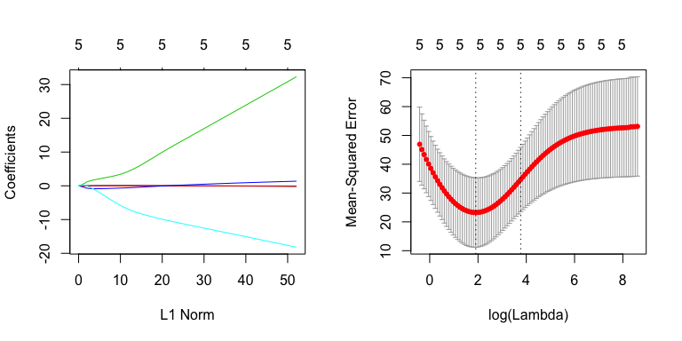

```r
best_ridge_lambda <- cv_ridge_divs$lambda.min
ridge_divs_pred <- predict(ridge_divs_train, s = best_ridge_lambda, newx = x[test,])
mean((ridge_divs_pred - y_test)^2) # Test MSE
```

```
## [1] 56.09131
```

```r
# Run lasso regression with alpha = 1
lasso_divs_train <- glmnet(x[train,], y[train], alpha = 1, lambda = grid, standardize = TRUE)
par(mfrow = c(1,2))
plot(lasso_divs_train)

# Cross validation
cv_lasso_divs <- cv.glmnet(x[train,], y[train], alpha = 1)
```

```
## Warning: Option grouped=FALSE enforced in cv.glmnet, since < 3 observations per fold
```

```r
plot(cv_lasso_divs)
```

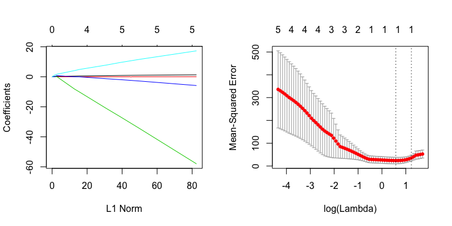

```r
best_lasso_lambda <- cv_lasso_divs$lambda.min
lasso_divs_pred <- predict(lasso_divs_train, s = best_lasso_lambda, newx = x[test,])
mean((lasso_divs_pred - y_test)^2)
```

```
## [1] 54.25604
```

```r
## Run lasso on the entire dataset 
lasso_divs <- glmnet(x, y, alpha = 1, lambda = grid, standardize = TRUE)
par(mfrow = c(1,1))
plot(lasso_divs)
```

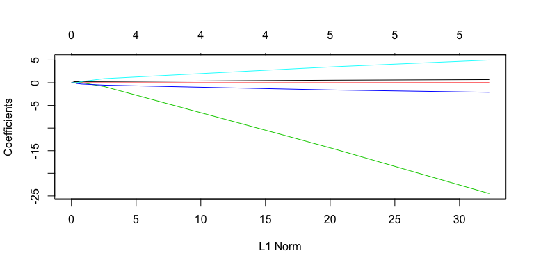

```r
legend("bottomright")
```

```
## Error in as.graphicsAnnot(legend): argument "legend" is missing, with no default
```

```r
# What are the lasso coefficients?
predict(lasso_divs, type = "coefficients", s = best_lasso_lambda)
```

```
## 6 x 1 sparse Matrix of class "dgCMatrix"
##                         1
## (Intercept)     3.1257879
## Inverse_Simpson 0.1821402
## Richness        .        
## Shannon_Entropy .        
## Unweighted_MPD  .        
## Weighted_MPD    .
```


The test MSE for ridge regression is 56.0913095 while the test MSE for lasso is 54.2560411.  Therefore, it's best if we use lasso!


Additionally, the lasso model uses Inverse Simpson as the **best and only** predictor of production!


## Congruency between fractions 

```r
rich_df <- ML_otu_rich_stats %>%
  dplyr::select(norep_filter_name, mean, sd, measure, fraction) %>%
  mutate(norep_water_name = paste(substr(norep_filter_name, 1,4), substr(norep_filter_name, 6,9), sep = "")) %>%
  spread(fraction, mean) 

rich_part_df <- dplyr::select(rich_df, norep_water_name, WholePart) %>%
  distinct() %>%  filter(!is.na(WholePart))

rich_free_df <- dplyr::select(rich_df, norep_water_name, WholeFree) %>%
  distinct() %>%  filter(!is.na(WholeFree))

combined_rich_df <- left_join(rich_free_df, rich_part_df, by = "norep_water_name") %>%
  rename(names = norep_water_name) %>%
  make_metadata_norep() %>%
  dplyr::select(-c(year, fraction, month, season, nuc_acid_type, project))


summary(lm(WholePart ~ WholeFree, data = combined_rich_df))
```

```
## 
## Call:
## lm(formula = WholePart ~ WholeFree, data = combined_rich_df)
## 
## Residuals:
##     Min      1Q  Median      3Q     Max 
## -122.70 -106.94  -29.13   45.48  355.39 
## 
## Coefficients:
##             Estimate Std. Error t value Pr(>|t|)
## (Intercept) 271.8734   157.9006   1.722    0.116
## WholeFree     0.6495     0.5407   1.201    0.257
## 
## Residual standard error: 146 on 10 degrees of freedom
## Multiple R-squared:  0.1261,	Adjusted R-squared:  0.03868 
## F-statistic: 1.443 on 1 and 10 DF,  p-value: 0.2574
```

```r
ggplot(combined_rich_df, aes(x=WholePart, y=WholeFree)) + 
  geom_point(size = 3.5) +
  geom_abline(intercept = 0, slope = 1)
```


# Total Productivity 


```r
colnames(combined_rich_unweightedMPD)
```

```
##  [1] "norep_filter_name"        "mean"                     "sd"                       "measure"                  "ntaxa"                    "mpd.obs"                  "mpd.rand.mean"            "mpd.rand.sd"              "mpd.obs.rank"            
## [10] "mpd.obs.z"                "mpd.obs.p"                "runs"                     "lakesite"                 "limnion"                  "fraction"                 "year"                     "project"                  "season"                  
## [19] "norep_water_name"         "Date"                     "Sample_depth_m"           "Temp_C"                   "SpCond_uSpercm"           "TDS_mgperL"               "pH"                       "ORP_mV"                   "Chl_Lab_ugperL"          
## [28] "BGA_cellspermL"           "Cl_mgperL"                "SO4_mgperL"               "NO3_mgperL"               "NH3_mgperL"               "TKN_mgperL"               "SRP_ugperL"               "TP_ugperL"                "Alk_mgperL"              
## [37] "DO_mgperL"                "DO_percent"               "Turb_NTU"                 "station"                  "total_bac_abund"          "SE_total_bac_abund"       "attached_bac"             "SE_attached_bac"          "perc_attached_abund"     
## [46] "SE_perc_attached_abund"   "tot_bacprod"              "SD_tot_bacprod"           "frac_bacprod"             "SD_frac_bacprod"          "perc_attached_bacprod"    "SD_perc_attached_bacprod" "Sample"                   "raw_counts"              
## [55] "HNA_counts"               "LNA_counts"               "volume_uL"                "dilution"                 "counts.sd"                "HNA.sd"                   "LNA.sd"                   "volume.sd"                "Platform"                
## [64] "Sample_16S"               "cells_per_uL"             "HNA_per_uL"               "HNA_percent"              "LNA_per_uL"               "LNA_percent"              "Nuc_acid_ratio"           "D2_sd"                    "dnaconcrep1"             
## [73] "dnaconcrep2"              "fraction_bac_abund"       "Sample_TotalSeqs"         "fracprod_per_cell"        "fracprod_per_cell_noinf"  "pval"
```

```r
summary(lm(tot_bacprod ~ mean * mpd.obs.z, data = combined_rich_unweightedMPD))
```

```
## 
## Call:
## lm(formula = tot_bacprod ~ mean * mpd.obs.z, data = combined_rich_unweightedMPD)
## 
## Residuals:
##     Min      1Q  Median      3Q     Max 
## -22.451 -11.914  -3.436  12.512  48.674 
## 
## Coefficients:
##                 Estimate Std. Error t value Pr(>|t|)  
## (Intercept)    39.726447  17.264136   2.301   0.0323 *
## mean            0.002532   0.035915   0.071   0.9445  
## mpd.obs.z       1.758659  12.143545   0.145   0.8863  
## mean:mpd.obs.z -0.038317   0.030491  -1.257   0.2234  
## ---
## Signif. codes:  0 '***' 0.001 '**' 0.01 '*' 0.05 '.' 0.1 ' ' 1
## 
## Residual standard error: 18.84 on 20 degrees of freedom
## Multiple R-squared:  0.4346,	Adjusted R-squared:  0.3498 
## F-statistic: 5.125 on 3 and 20 DF,  p-value: 0.008597
```

```r
summary(lm(tot_bacprod ~ mean , data = combined_rich_unweightedMPD))
```

```
## 
## Call:
## lm(formula = tot_bacprod ~ mean, data = combined_rich_unweightedMPD)
## 
## Residuals:
##     Min      1Q  Median      3Q     Max 
## -30.687 -12.631  -3.510   8.323  58.218 
## 
## Coefficients:
##             Estimate Std. Error t value Pr(>|t|)  
## (Intercept)  9.39167   12.20599   0.769   0.4498  
## mean         0.06542    0.03089   2.118   0.0457 *
## ---
## Signif. codes:  0 '***' 0.001 '**' 0.01 '*' 0.05 '.' 0.1 ' ' 1
## 
## Residual standard error: 21.77 on 22 degrees of freedom
## Multiple R-squared:  0.1693,	Adjusted R-squared:  0.1316 
## F-statistic: 4.485 on 1 and 22 DF,  p-value: 0.04573
```

```r
totprod_fraction_rich <- ggplot(combined_rich_unweightedMPD, aes(y = tot_bacprod, x = mean, color = fraction)) +
  geom_point(size = 3) +
  geom_smooth(method = "lm") + theme(legend.position = c(0.85, 0.85)) +
  scale_color_manual(values = fraction_colors)

totprod_TOGET_rich <- ggplot(combined_rich_unweightedMPD, aes(y = tot_bacprod, x = mean)) +
  geom_point(size = 3) +
  geom_smooth(method = "lm") 

plot_grid(totprod_TOGET_rich, totprod_fraction_rich, labels = c("A", "B"), ncol = 2)
```

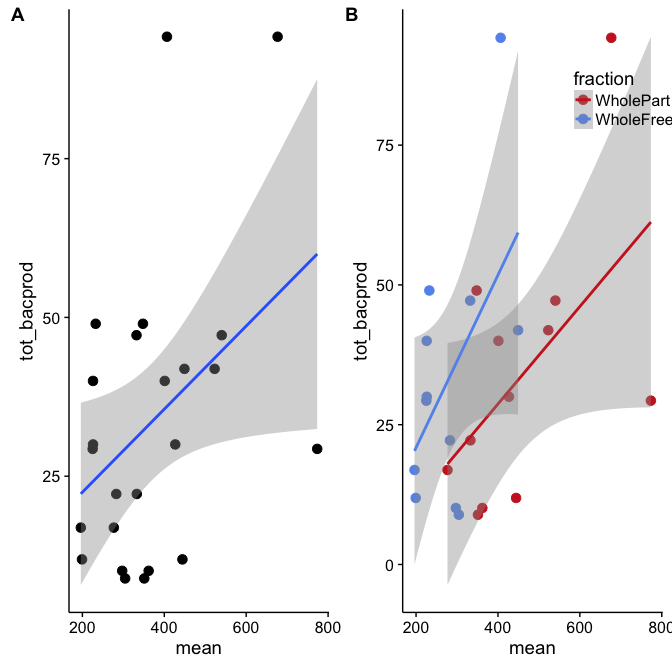

```r
summary(lm(tot_bacprod ~ mpd.obs.z , data = combined_rich_unweightedMPD))
```

```
## 
## Call:
## lm(formula = tot_bacprod ~ mpd.obs.z, data = combined_rich_unweightedMPD)
## 
## Residuals:
##     Min      1Q  Median      3Q     Max 
## -24.754 -12.412  -3.220   9.423  45.032 
## 
## Coefficients:
##             Estimate Std. Error t value Pr(>|t|)    
## (Intercept)   44.904      4.879   9.203 5.35e-09 ***
## mpd.obs.z    -12.347      3.292  -3.750  0.00111 ** 
## ---
## Signif. codes:  0 '***' 0.001 '**' 0.01 '*' 0.05 '.' 0.1 ' ' 1
## 
## Residual standard error: 18.66 on 22 degrees of freedom
## Multiple R-squared:   0.39,	Adjusted R-squared:  0.3622 
## F-statistic: 14.06 on 1 and 22 DF,  p-value: 0.001107
```

```r
summary(lm(tot_bacprod ~ mpd.obs.z , data = dplyr::filter(combined_rich_unweightedMPD, fraction == "WholePart")))
```

```
## 
## Call:
## lm(formula = tot_bacprod ~ mpd.obs.z, data = dplyr::filter(combined_rich_unweightedMPD, 
##     fraction == "WholePart"))
## 
## Residuals:
##     Min      1Q  Median      3Q     Max 
## -18.894 -14.307  -5.489  10.635  38.431 
## 
## Coefficients:
##             Estimate Std. Error t value Pr(>|t|)    
## (Intercept)   40.186      6.058   6.633 5.83e-05 ***
## mpd.obs.z    -10.915      4.069  -2.682    0.023 *  
## ---
## Signif. codes:  0 '***' 0.001 '**' 0.01 '*' 0.05 '.' 0.1 ' ' 1
## 
## Residual standard error: 19.11 on 10 degrees of freedom
## Multiple R-squared:  0.4184,	Adjusted R-squared:  0.3603 
## F-statistic: 7.195 on 1 and 10 DF,  p-value: 0.023
```

```r
summary(lm(tot_bacprod ~ mpd.obs.z , data = dplyr::filter(combined_rich_unweightedMPD, fraction == "WholeFree")))
```

```
## 
## Call:
## lm(formula = tot_bacprod ~ mpd.obs.z, data = dplyr::filter(combined_rich_unweightedMPD, 
##     fraction == "WholeFree"))
## 
## Residuals:
##     Min      1Q  Median      3Q     Max 
## -31.908  -8.763  -3.789   6.117  28.913 
## 
## Coefficients:
##             Estimate Std. Error t value Pr(>|t|)    
## (Intercept)   58.343      9.393   6.212 9.99e-05 ***
## mpd.obs.z    -20.108      6.366  -3.158   0.0102 *  
## ---
## Signif. codes:  0 '***' 0.001 '**' 0.01 '*' 0.05 '.' 0.1 ' ' 1
## 
## Residual standard error: 17.73 on 10 degrees of freedom
## Multiple R-squared:  0.4994,	Adjusted R-squared:  0.4493 
## F-statistic: 9.976 on 1 and 10 DF,  p-value: 0.01019
```

```r
totprod_fraction_unweightMPD <- ggplot(combined_rich_unweightedMPD, aes(y = tot_bacprod, x = mpd.obs.z, color = fraction)) +
  geom_point(size = 3) +
  geom_smooth(method = "lm") + theme(legend.position = c(0.85, 0.85)) +
  scale_color_manual(values = fraction_colors)

totprod_TOGET_unweightMPD <- ggplot(combined_rich_unweightedMPD, aes(y = tot_bacprod, x = mpd.obs.z)) +
  geom_point(size = 3) +
  geom_smooth(method = "lm") 

plot_grid(totprod_TOGET_unweightMPD, totprod_fraction_unweightMPD, labels = c("A", "B"), ncol = 2)
```


# Beta Diversity Analysis


```r
scale_otu_merged_musk_pruned <- scale_reads(otu_merged_musk_pruned_noMOTHJ715_MBRHP715, round = "matround")
scale_otu_merged_musk_pruned # ALL Samples phyloseq object
```

```
## phyloseq-class experiment-level object
## otu_table()   OTU Table:         [ 8814 taxa and 161 samples ]
## sample_data() Sample Data:       [ 161 samples by 64 sample variables ]
## tax_table()   Taxonomy Table:    [ 8814 taxa by 8 taxonomic ranks ]
```

```r
# Check the sequencing depth of each sample 
scaled_sums_otu <- data.frame(rowSums(otu_table(scale_otu_merged_musk_pruned)))
colnames(scaled_sums_otu) <- "Sample_TotalSeqs"
scaled_sums_otu$names <- row.names(scaled_sums_otu)
scaled_sums_otu <- arrange(scaled_sums_otu, Sample_TotalSeqs) %>%
  make_metadata_norep()

##  Plot based on all samples 
plot_sample_sums(dataframe = scaled_sums_otu, x_total_seqs = "Sample_TotalSeqs", fill_variable = "project")
```


```r
##  Plot based on depth of samples 
plot_sample_sums(dataframe = scaled_sums_otu, x_total_seqs = "Sample_TotalSeqs", fill_variable = "limnion")
```


```r
##  Plot based on depth of samples WITHOUT SEDIMENT!
plot_sample_sums(dataframe = filter(scaled_sums_otu, limnion != "Benthic"), 
                 x_total_seqs = "Sample_TotalSeqs", fill_variable = "limnion")
```


```r
### Subset out samples that we only have productivity data for
productivity_scale_int <- subset_samples(scale_otu_merged_musk_pruned, limnion == "Top" & year == "2015" & 
                                           fraction %in% c("WholePart", "WholeFree"))

productivity_scale <- prune_taxa(taxa_sums(productivity_scale_int) > 0, productivity_scale_int) 
```


```r
productivity_bray <- phyloseq::distance(productivity_scale, method = "bray")

# make a data frame from the sample_data
sampledf <- data.frame(sample_data(productivity_scale))

# Adonis test
adonis(productivity_bray ~ frac_bacprod, data = sampledf)
```

```
## 
## Call:
## adonis(formula = productivity_bray ~ frac_bacprod, data = sampledf) 
## 
## Permutation: free
## Number of permutations: 999
## 
## Terms added sequentially (first to last)
## 
##              Df SumsOfSqs MeanSqs F.Model      R2 Pr(>F)    
## frac_bacprod  1    0.7430 0.74295  4.1869 0.15988  0.001 ***
## Residuals    22    3.9039 0.17745         0.84012           
## Total        23    4.6468                 1.00000           
## ---
## Signif. codes:  0 '***' 0.001 '**' 0.01 '*' 0.05 '.' 0.1 ' ' 1
```


```r
scaled_productivity_otu_df <- as.matrix(otu_table(productivity_scale))

bray_productivity_otu <- vegdist(scaled_productivity_otu_df, method = "bray", binary = FALSE, upper = TRUE)

# Melt the bray curtis distance to a dataframe
bray <- reshape2::melt(as.matrix(bray_productivity_otu), varnames = c("samp1", "samp2"))
bray <- subset(bray, value > 0) # Remove the samples compared to themselves


bray$lakesite1 <- substr(bray$samp1,2,3) # Create a new column called lakenames1 with first 3 letters of string
bray$lakesite2 <- substr(bray$samp2,2,3) # Create a new column called lakenames2 with first 3 letters of string
bray$limnion1 <- substr(bray$samp1, 4, 4) # Create a column called limnon1 with hypo or epi
bray$limnion2 <- substr(bray$samp2, 4, 4) # Create a column called limnon2 with hypo or epi
bray$filter1 <- substr(bray$samp1, 5, 5)  # Create a column called filter1 with PA or FL
bray$filter2 <- substr(bray$samp2, 5, 5) # Create a column called filter2 with PA or FL
bray$month1 <- substr(bray$samp1, 6, 6)  # Create a column called month1 with may, july, or september
bray$month2 <- substr(bray$samp2, 6, 6) # Create a column called month2 with may, july, or september
bray$year1 <- substr(bray$samp1, 7, 9) # Create a column called year1 with 2014 or 2015
bray$year2 <- substr(bray$samp2, 7, 9) # Create a column called year2 with 2014 or 2015


  # Depth in water column
bray$limnion1 <- ifelse(bray$limnion1 == "E", "Top", NA)
bray$limnion2 <- ifelse(bray$limnion2 == "E", "Top", NA)
  
# fraction Fraction
bray$filter1 <- ifelse(bray$filter1 == "F", "Free", 
                             ifelse(bray$filter1 == "P", "Particle",
                                    ifelse(bray$filter1 == "J","WholePart",
                                           ifelse(bray$filter1 == "K","WholeFree", NA))))
bray$filter2 <- ifelse(bray$filter2 == "F", "Free", 
                             ifelse(bray$filter2 == "P", "Particle",
                                    ifelse(bray$filter2 == "J","WholePart",
                                           ifelse(bray$filter2 == "K","WholeFree", NA))))


# Stop calculations if sample1 is equal to sample2
stopifnot(nrow(dplyr::filter(bray, samp1 == samp2)) == 0)


##  Add productivity data to bray dataframe
prod_data <- sample_data(productivity_scale) %>%
  dplyr::select(norep_filter_name, frac_bacprod) %>%
  mutate(frac_bacprod = round(frac_bacprod, digits = 1),
         samp1 = norep_filter_name) %>%
  dplyr::select(-norep_filter_name)
```

```
## Warning in class(x) <- c("tbl_df", "tbl", "data.frame"): Setting class(x) to multiple strings ("tbl_df", "tbl", ...); result will no longer be an S4 object
```

```r
# Add fraction production for sample1
bray_frac1 <- right_join(bray, prod_data, by = "samp1") %>%
  rename(frac_prod1 = frac_bacprod)
```

```
## Warning in right_join_impl(x, y, by$x, by$y, suffix$x, suffix$y): joining factor and character vector, coercing into character vector
```

```r
# Add fraction production for sample2
bray_final <- right_join(bray_frac1, rename(prod_data, samp2 = samp1), by = "samp2") %>%
  rename(frac_prod2 = frac_bacprod) %>%
  mutate(delta_frac_bacprod = abs(frac_prod1 - frac_prod2),
         filter_match = ifelse(filter1 == filter2, filter1, "diff_filter"))
```

```
## Warning in right_join_impl(x, y, by$x, by$y, suffix$x, suffix$y): joining factor and character vector, coercing into character vector
```

```r
ggplot(bray_final, aes(x = value, y = delta_frac_bacprod, color = filter_match)) +
  geom_point() +
  facet_grid(.~filter_match) + 
  xlab("Bray-Curtis Dissimilarity") + ylab("Difference Fraction Productvity") +
  geom_smooth() +
  theme(legend.position = c(0.9, 0.85),legend.title = element_blank())
```


```r
#### Difference between filter comparisons?
bray_kruskal <- kruskal.test(value ~ as.factor(filter_match), data = bray_final)
bray_kruskal
```

```
## 
## 	Kruskal-Wallis rank sum test
## 
## data:  value by as.factor(filter_match)
## Kruskal-Wallis chi-squared = 208.69, df = 2, p-value < 2.2e-16
```

```r
library(pgirmess)
```

```
## Error in library(pgirmess): there is no package called 'pgirmess'
```

```r
library(multcompView)
```

```
## Error in library(multcompView): there is no package called 'multcompView'
```

```r
bray_kruskal_MC <- kruskalmc(bray_final$value ~ bray_final$filter_match)  ## Defaults to P < 0.05
```

```
## Error in eval(expr, envir, enclos): could not find function "kruskalmc"
```

```r
#print(bray_prod_KW_MC)
### Time to figure out letters to represent significance in a plot
bray_test <- bray_kruskal_MC$dif.com$difference # select logical vector
```

```
## Error in eval(expr, envir, enclos): object 'bray_kruskal_MC' not found
```

```r
names(bray_test) <- row.names(bray_kruskal_MC$dif.com) # add comparison names
```

```
## Error in row.names(bray_kruskal_MC$dif.com): object 'bray_kruskal_MC' not found
```

```r
# create a list with "homogenous groups" coded by letter
bray_letters <- multcompLetters(bray_test, compare="<", threshold=0.05, 
                                 Letters=c(letters, LETTERS, "."), reversed = FALSE)
```

```
## Error in eval(expr, envir, enclos): could not find function "multcompLetters"
```

```r
###  Extract the values from the multcompLetters object
bray_sigs_dataframe <-  data.frame(as.vector(names(bray_letters$Letters)), as.vector(bray_letters$Letters))
```

```
## Error in as.vector(names(bray_letters$Letters)): object 'bray_letters' not found
```

```r
colnames(bray_sigs_dataframe) <- c("filter_match", "siglabel")
```

```
## Error in colnames(bray_sigs_dataframe) <- c("filter_match", "siglabel"): object 'bray_sigs_dataframe' not found
```

```r
bray_try <- left_join(bray_final, bray_sigs_dataframe, by = "filter_match")
```

```
## Error in is.data.frame(y): object 'bray_sigs_dataframe' not found
```

```r
bray_sigs <- bray_try %>%
  dplyr::select(filter_match, siglabel) %>%
  distinct()
```

```
## Error in eval(expr, envir, enclos): object 'bray_try' not found
```

```r
bray_box <- ggplot(bray_try, aes(y = value, x = filter_match, color = filter_match, fill = filter_match)) +
  geom_boxplot(alpha = 0.3) + geom_jitter(size = 3) + 
  scale_y_continuous(limits = c(0.1, 0.95), breaks = c(0.1, 0.3, 0.5, 0.7, 0.9)) +
  geom_text(data = bray_sigs, aes(label = siglabel, x = filter_match, y = 0.95), size =5, color = "black") +
  ylab("Bray-Curtis Dissimilarity") + xlab("Filter Comparison") +
  ggtitle("Bray-Curtis") + 
  theme(legend.position = "none")
```

```
## Error in ggplot(bray_try, aes(y = value, x = filter_match, color = filter_match, : object 'bray_try' not found
```


```r
soren_productivity_otu <- vegdist(data.frame(otu_table(productivity_scale)), method = "bray", binary = TRUE)

# Melt the soren curtis distance to a dataframe
soren <- reshape2::melt(as.matrix(soren_productivity_otu), varnames = c("samp1", "samp2"))
soren <- subset(soren, value > 0) # Remove the samples compared to themselves


soren$lakesite1 <- substr(soren$samp1,2,3) # Create a new column called lakenames1 with first 3 letters of string
soren$lakesite2 <- substr(soren$samp2,2,3) # Create a new column called lakenames2 with first 3 letters of string
soren$limnion1 <- substr(soren$samp1, 4, 4) # Create a column called limnon1 with hypo or epi
soren$limnion2 <- substr(soren$samp2, 4, 4) # Create a column called limnon2 with hypo or epi
soren$filter1 <- substr(soren$samp1, 5, 5)  # Create a column called filter1 with PA or FL
soren$filter2 <- substr(soren$samp2, 5, 5) # Create a column called filter2 with PA or FL
soren$month1 <- substr(soren$samp1, 6, 6)  # Create a column called month1 with may, july, or september
soren$month2 <- substr(soren$samp2, 6, 6) # Create a column called month2 with may, july, or september
soren$year1 <- substr(soren$samp1, 7, 9) # Create a column called year1 with 2014 or 2015
soren$year2 <- substr(soren$samp2, 7, 9) # Create a column called year2 with 2014 or 2015


  # Depth in water column
soren$limnion1 <- ifelse(soren$limnion1 == "E", "Top", NA)
soren$limnion2 <- ifelse(soren$limnion2 == "E", "Top", NA)
  
# fraction Fraction
soren$filter1 <- ifelse(soren$filter1 == "F", "Free", 
                             ifelse(soren$filter1 == "P", "Particle",
                                    ifelse(soren$filter1 == "J","WholePart",
                                           ifelse(soren$filter1 == "K","WholeFree", NA))))
soren$filter2 <- ifelse(soren$filter2 == "F", "Free", 
                             ifelse(soren$filter2 == "P", "Particle",
                                    ifelse(soren$filter2 == "J","WholePart",
                                           ifelse(soren$filter2 == "K","WholeFree", NA))))


# Stop calculations if sample1 is equal to sample2
stopifnot(nrow(dplyr::filter(soren, samp1 == samp2)) == 0)


##  Add productivity data to soren dataframe
prod_data <- sample_data(productivity_scale) %>%
  dplyr::select(norep_filter_name, frac_bacprod) %>%
  mutate(frac_bacprod = round(frac_bacprod, digits = 1),
         samp1 = norep_filter_name) %>%
  dplyr::select(-norep_filter_name)
```

```
## Warning in class(x) <- c("tbl_df", "tbl", "data.frame"): Setting class(x) to multiple strings ("tbl_df", "tbl", ...); result will no longer be an S4 object
```

```r
# Add fraction production for sample1
soren_frac1 <- right_join(soren, prod_data, by = "samp1") %>%
  rename(frac_prod1 = frac_bacprod)
```

```
## Warning in right_join_impl(x, y, by$x, by$y, suffix$x, suffix$y): joining factor and character vector, coercing into character vector
```

```r
# Add fraction production for sample2
soren_final <- right_join(soren_frac1, rename(prod_data, samp2 = samp1), by = "samp2") %>%
  rename(frac_prod2 = frac_bacprod) %>%
  mutate(delta_frac_bacprod = abs(frac_prod1 - frac_prod2),
         filter_match = ifelse(filter1 == filter2, filter1, "diff_filter"))
```

```
## Warning in right_join_impl(x, y, by$x, by$y, suffix$x, suffix$y): joining factor and character vector, coercing into character vector
```

```r
ggplot(soren_final, aes(x = value, y = delta_frac_bacprod, color = filter_match)) +
  geom_point() +
  facet_grid(.~filter_match) + 
  xlab("Sørensen Dissimilarity") + ylab("Difference Fraction Productvity") +
  geom_smooth() +
  theme(legend.position = c(0.9, 0.85),legend.title = element_blank())
```


```r
###  Is there a difference in Sorensen Values between the different filter comparisons?
soren_kruskal <- kruskal.test(value ~ as.factor(filter_match), data = soren_final)
soren_kruskal
```

```
## 
## 	Kruskal-Wallis rank sum test
## 
## data:  value by as.factor(filter_match)
## Kruskal-Wallis chi-squared = 99.955, df = 2, p-value < 2.2e-16
```

```r
soren_kruskal_MC <- kruskalmc(soren_final$value ~ soren_final$filter_match)  ## Defaults to P < 0.05
```

```
## Error in eval(expr, envir, enclos): could not find function "kruskalmc"
```

```r
#print(soren_prod_KW_MC)
### Time to figure out letters to represent significance in a plot
soren_test <- soren_kruskal_MC$dif.com$difference # select logical vector
```

```
## Error in eval(expr, envir, enclos): object 'soren_kruskal_MC' not found
```

```r
names(soren_test) <- row.names(soren_kruskal_MC$dif.com) # add comparison names
```

```
## Error in row.names(soren_kruskal_MC$dif.com): object 'soren_kruskal_MC' not found
```

```r
# create a list with "homogenous groups" coded by letter
soren_letters <- multcompLetters(soren_test, compare="<", threshold=0.05, 
                                 Letters=c(letters, LETTERS, "."), reversed = FALSE)
```

```
## Error in eval(expr, envir, enclos): could not find function "multcompLetters"
```

```r
###  Extract the values from the multcompLetters object
soren_sigs_dataframe <-  data.frame(as.vector(names(soren_letters$Letters)), as.vector(soren_letters$Letters))
```

```
## Error in as.vector(names(soren_letters$Letters)): object 'soren_letters' not found
```

```r
colnames(soren_sigs_dataframe) <- c("filter_match", "siglabel")
```

```
## Error in colnames(soren_sigs_dataframe) <- c("filter_match", "siglabel"): object 'soren_sigs_dataframe' not found
```

```r
soren_try <- left_join(soren_final, soren_sigs_dataframe, by = "filter_match")
```

```
## Error in is.data.frame(y): object 'soren_sigs_dataframe' not found
```

```r
soren_sigs <- soren_try %>%
  dplyr::select(filter_match, siglabel) %>%
  distinct()
```

```
## Error in eval(expr, envir, enclos): object 'soren_try' not found
```

```r
soren_box <- ggplot(soren_try, aes(y = value, x = filter_match, color = filter_match, fill = filter_match)) +
  geom_boxplot(alpha = 0.3) + geom_jitter(size = 3) + 
  scale_y_continuous(limits = c(0.1, 0.95), breaks = c(0.1, 0.3, 0.5, 0.7, 0.9)) +
  geom_text(data = soren_sigs, aes(label = siglabel, x = filter_match, y = 0.85), size =5, color = "black") +
  ylab("Sørensen Dissimilarity") + xlab("Filter Comparison") +
  ggtitle("Sørensen") + 
  theme(legend.position = "none"); 
```

```
## Error in ggplot(soren_try, aes(y = value, x = filter_match, color = filter_match, : object 'soren_try' not found
```

```r
soren_box <- ggplot(soren_try, aes(y = value, x = filter_match, color = filter_match, fill = filter_match)) +
  geom_boxplot(alpha = 0.3) + geom_jitter(size = 3) + 
  scale_y_continuous(limits = c(0.1, 0.95), breaks = c(0.1, 0.3, 0.5, 0.7, 0.9)) +
  geom_text(data = soren_sigs, aes(label = siglabel, x = filter_match, y = 0.85), size =5, color = "black") +
  ylab("Sørensen Dissimilarity") + xlab("Filter Comparison") +
  ggtitle("Sørensen") + 
  theme(legend.position = "none")
```

```
## Error in ggplot(soren_try, aes(y = value, x = filter_match, color = filter_match, : object 'soren_try' not found
```


```r
plot_grid(soren_box, bray_box, labels = c("A", "B"), ncol = 2)
```

```
## Error in plot_grid(soren_box, bray_box, labels = c("A", "B"), ncol = 2): object 'soren_box' not found
```
