# Rarefied Diversity Analysis
Marian L. Schmidt  
February 14, 2017  
<style>
pre code, pre, code {
  white-space: pre !important;
  overflow-x: scroll !important;
  word-break: keep-all !important;
  word-wrap: initial !important;
}
</style>


```r
library(ggplot2)
library(devtools)
library(phyloseq)
library(tidyr)
library(dplyr)
library(cowplot)
library(picante) # Will also include ape and vegan 
library(car) # For residual analysis
library(sandwich) # for vcovHC function in post-hoc test
source("Muskegon_functions.R")
source("set_colors.R")
```


# Rarefied Alpha Diversity Analysis
## Remove samples with too few reads

```r
# Loads a phyloseq object named otu_merged_musk_pruned)
load("../data/otu_merged_musk_pruned.RData")
# The name of the phyloseq object is: 
otu_merged_musk_pruned 
```

```
## phyloseq-class experiment-level object
## otu_table()   OTU Table:         [ 52980 taxa and 163 samples ]
## sample_data() Sample Data:       [ 163 samples by 70 sample variables ]
## tax_table()   Taxonomy Table:    [ 52980 taxa by 8 taxonomic ranks ]
## phy_tree()    Phylogenetic Tree: [ 52980 tips and 52978 internal nodes ]
```

```r
# Productivity measurements are reliable only up to 1 decimal
df1 <- sample_data(otu_merged_musk_pruned) %>% 
  dplyr::mutate(tot_bacprod = round(tot_bacprod, digits = 1),
                SD_tot_bacprod = round(SD_tot_bacprod, digits = 1),
                frac_bacprod = round(frac_bacprod, digits = 1),
                SD_frac_bacprod = round(SD_frac_bacprod, digits = 1))
```

```
## Warning in class(x) <- c("tbl_df", "tbl", "data.frame"): Setting class(x) to multiple strings ("tbl_df", "tbl", ...); result will no longer be an S4 object
```

```r
row.names(df1) = df1$norep_filter_name


# Remove tree because it's too computationally intensive
otu_merged_musk_pruned <- merge_phyloseq(tax_table(otu_merged_musk_pruned), 
                                         sample_data(df1), 
                                         otu_table(otu_merged_musk_pruned))
otu_merged_musk_pruned
```

```
## phyloseq-class experiment-level object
## otu_table()   OTU Table:         [ 52980 taxa and 163 samples ]
## sample_data() Sample Data:       [ 163 samples by 70 sample variables ]
## tax_table()   Taxonomy Table:    [ 52980 taxa by 8 taxonomic ranks ]
```

```r
# Remove MOTHJ715 and MBRHP715
otu_merged_musk_pruned_noMOTHJ715_MBRHP715 <- subset_samples(otu_merged_musk_pruned, 
                                                             norep_filter_name != "MOTHJ715" & 
                                                               norep_filter_name != "MBRHP715")
otu_merged_musk_pruned_noMOTHJ715_MBRHP715
```

```
## phyloseq-class experiment-level object
## otu_table()   OTU Table:         [ 52980 taxa and 161 samples ]
## sample_data() Sample Data:       [ 161 samples by 70 sample variables ]
## tax_table()   Taxonomy Table:    [ 52980 taxa by 8 taxonomic ranks ]
```


```r
# Check the sequencing depth of each sample by 
sums_otu <- data.frame(rowSums(otu_table(otu_merged_musk_pruned_noMOTHJ715_MBRHP715))) 
colnames(sums_otu) <- "Sample_TotalSeqs"
sums_otu$names <- row.names(sums_otu)
sums_otu <- arrange(sums_otu, Sample_TotalSeqs) 
sums_otu <- make_metadata_norep(sums_otu)

## Add total sequences to metadata frame 
metdf <- sample_data(otu_merged_musk_pruned_noMOTHJ715_MBRHP715)
sums_otu$norep_filter_name <- sums_otu$names
sums_otu2 <- dplyr::select(sums_otu, norep_filter_name, Sample_TotalSeqs)
metdf_num2 <- left_join(metdf, sums_otu2, by = "norep_filter_name") %>%
  dplyr::select(-one_of("D0", "D0_chao", "D1", "D2", "D0_SD", "D1_sd", "D0_chao_sd"))
```

```
## Warning in class(x) <- c("tbl_df", "tbl", "data.frame"): Setting class(x) to multiple strings ("tbl_df", "tbl", ...); result will no longer be an S4 object
```

```r
row.names(metdf_num2) <- metdf_num2$norep_filter_name
# Rename the sample data 
sample_data(otu_merged_musk_pruned_noMOTHJ715_MBRHP715) <- metdf_num2
```

## Metadata Frames for Subsets

```r
### PREPARE DATA FRAMES FOR PHENOFLOW ALPHA DIVERSITY ANALYSIS
free_meta_data <- filter(metdf_num2, fraction %in% c("Free", "WholeFree") & norep_filter_name != "MOTHJ715" & limnion == "Top")
part_meta_data <- filter(metdf_num2, fraction %in% c("Particle", "WholePart") & norep_filter_name != "MOTHJ715" & limnion == "Top")
nosed_meta_data <- filter(metdf_num2, fraction != "Sediment" & limnion == "Top")

# Only "True Free Living and Particle" From 20um prefiltered samples 
free_only <- filter(free_meta_data, fraction == "Free")
part_only <- filter(part_meta_data, fraction == "Particle")

## 2015 specific samples that have NOT been prefiltered (whole water)
wholefree_only <- filter(free_meta_data, fraction == "WholeFree")
wholepart_only <- filter(part_meta_data, fraction == "WholePart")
```


#### Rarefy Read Depth Analysis ran on February 14th, 2016


# Fraction Diversity-Production Analysis 

```r
# Load values
nsamp <- nsamples(otu_merged_musk_pruned_noMOTHJ715_MBRHP715)
min_lib <- min(sample_sums(otu_merged_musk_pruned_noMOTHJ715_MBRHP715)) - 1
min_lib
```

```
## [1] 2895
```

```r
# Read in the files 
otu_richness <- read.table("../data/metadata/otu_richness100_rarefy2895",  header = TRUE)
otu_evenness <- read.table("../data/metadata/otu_evenness100_rarefy2895", header = TRUE)
otu_shannon <- read.table("../data/metadata/otu_shannon100_rarefy2895", header = TRUE)

# Create a new dataframe to hold the means and standard deviations of richness estimates
norep_filter_name <- row.names(otu_richness)
mean <- apply(otu_richness, 1, mean)
sd <- apply(otu_richness, 1, sd)
measure <- rep("Richness", nsamp)
otu_rich_stats <- data.frame(norep_filter_name, mean, sd, measure)

# Create a new dataframe to hold the means and standard deviations of evenness estimates
norep_filter_name <- row.names(otu_evenness)
mean <- apply(otu_evenness, 1, mean)
sd <- apply(otu_evenness, 1, sd)
measure <- rep("Inverse_Simpson", nsamp)
otu_even_stats <- data.frame(norep_filter_name, mean, sd, measure)

# Create a new dataframe to hold the means and standard deviations of shannon entropy estimates
norep_filter_name <- row.names(otu_shannon)
mean <- apply(otu_shannon, 1, mean)
sd <- apply(otu_shannon, 1, sd)
measure <- rep("Shannon_Entropy", nsamp)
otu_shan_stats <- data.frame(norep_filter_name, mean, sd, measure)

# Create a new dataframe to hold the means and standard deviations of simpsons evenness estimates
norep_filter_name <- row.names(otu_evenness)
mean <- apply(otu_evenness, 1, mean)
sd <- apply(otu_evenness, 1, sd)
measure <- rep("Inverse_Simpson", nsamp)
otu_simpseven_stats <- data.frame(norep_filter_name, mean, sd, measure)

# Calculate Simpson's Evenness into new df called "simps_evenness"
otu_simps_evenness <- inner_join(otu_rich_stats, otu_even_stats, by = "norep_filter_name") %>%
  mutate(mean = mean.y/mean.x,
         sd = sd(mean),
         measure = "Simpsons_Evenness") %>%
  dplyr::select(norep_filter_name, mean, sd, measure)

# Combine alpha diversity into one dataframe 
otu_alpha <- rbind(otu_rich_stats, otu_even_stats, otu_simps_evenness, otu_shan_stats)
s <- data.frame(sample_data(otu_merged_musk_pruned_noMOTHJ715_MBRHP715))
otu_alphadiv <- merge(otu_alpha, s, by = "norep_filter_name") %>%
  filter(project == "Muskegon_Lake" & limnion == "Top" & fraction != "Sediment") %>%
  mutate(fraction = factor(fraction, levels = c("WholePart", "Particle", "WholeFree", "Free")),
         lakesite = factor(lakesite,  levels = c("MOT", "MDP", "MBR", "MIN")),
         measure = factor(measure, levels = c("Richness", "Simpsons_Evenness", "Shannon_Entropy", "Inverse_Simpson"))) %>%
  # Calculate the per cell production rates 
  mutate(fraction_bac_abund = as.numeric(fraction_bac_abund),
         fracprod_per_cell = frac_bacprod/(1000*fraction_bac_abund),
         fracprod_per_cell_noinf = ifelse(fracprod_per_cell == Inf, NA, fracprod_per_cell))
```


## Subset Diversity Data 

```r
######################################################### RICHNESS
# Subset only richness data 
ML_otu_rich_stats <- filter(otu_alphadiv, measure == "Richness" & 
                              project == "Muskegon_Lake" & 
                              fraction %in% c("WholePart", "WholeFree") & year == "2015")

######################################################### SHANNON ENTROPY
# Subset only Shannon_Entropy data 
ML_otu_shannon_stats <- filter(otu_alphadiv, 
                               measure == "Shannon_Entropy" & 
                                 project == "Muskegon_Lake" & 
                                 fraction %in% c("WholePart", "WholeFree") & 
                                 year == "2015")

######################################################### INVERSE SIMPSON
# Subset only Inverse_Simpson data 
ML_otu_invsimps_stats <- filter(otu_alphadiv, 
                                measure == "Inverse_Simpson" & 
                                  project == "Muskegon_Lake" & 
                                  fraction %in% c("WholePart", "WholeFree") & 
                                  year == "2015")

######################################################### SIMPSON'S EVENNESS
# Subset only Simpsons_Evenness data 
ML_otu_simpseven_stats <- filter(otu_alphadiv, 
                                 measure == "Simpsons_Evenness" & 
                                   project == "Muskegon_Lake" & 
                                   fraction %in% c("WholePart", "WholeFree") & 
                                   year == "2015")
```


# Cell Count and Production Rates 

```r
######################################################### Fraction ABUNDANCe 
frac_abund_wilcox <- wilcox.test(log10(as.numeric(fraction_bac_abund)) ~ fraction, 
             data = filter(otu_alphadiv, fraction %in% c("WholePart", "WholeFree") & measure == "Richness"))
frac_abund_wilcox
```

```
## 
## 	Wilcoxon rank sum test
## 
## data:  log10(as.numeric(fraction_bac_abund)) by fraction
## W = 0, p-value = 1.479e-06
## alternative hypothesis: true location shift is not equal to 0
```

```r
filter(otu_alphadiv, fraction %in% c("WholePart", "WholeFree") & measure == "Richness") %>%
  group_by(fraction) %>%
  summarize(mean(as.numeric(fraction_bac_abund)))
```

```
## # A tibble: 2 × 2
##    fraction `mean(as.numeric(fraction_bac_abund))`
##      <fctr>                                  <dbl>
## 1 WholePart                               41168.88
## 2 WholeFree                              734522.25
```

```r
# Make a data frame to draw significance line in boxplot (visually calculated)
dat1 <- data.frame(a = c(1.15,1.15,1.85,1.85), b = c(6.45,6.5,6.5,6.45)) # WholePart vs WholeFree

poster_a <- ggplot(filter(otu_alphadiv, fraction %in% c("WholePart", "WholeFree") & 
                            measure == "Richness" & norep_filter_name != "MOTEJ515"), 
       aes(y = log10(as.numeric(fraction_bac_abund)), x = fraction)) +
  scale_color_manual(values = fraction_colors) + 
  scale_fill_manual(values = fraction_colors) +
  geom_jitter(size = 3, aes(color = fraction, fill = fraction), width = 0.2) + 
  geom_boxplot(alpha = 0.5, outlier.shape = NA, aes(color = fraction, fill = fraction)) +
  ylab("Log10(Bacterial Cells/mL)") +
  scale_x_discrete(breaks=c("WholePart", "WholeFree"),
                      labels=c("Particle-\nAssociated", "Free-\nLiving")) + 
  #####  WHOLE PARTICLE VS WHOLE FREE CELL ABUNDANCES
  geom_path(data = dat1, aes(x = a, y = b), linetype = 1, color = "gray40") +
  annotate("text", x=1.5, y=6.5, fontface = "bold",  size = 3.5, color = "gray40",
           label= paste("***\np =", round(frac_abund_wilcox$p.value, digits = 6))) +
  theme(legend.position = "none",
        axis.title.x = element_blank())


######################################################### TOTAL PRODUCTION 
totprod_wilcox <- wilcox.test(frac_bacprod ~ fraction, 
             data = filter(otu_alphadiv, fraction %in% c("WholePart", "WholeFree") & measure == "Richness"))
totprod_wilcox
```

```
## 
## 	Wilcoxon rank sum test
## 
## data:  frac_bacprod by fraction
## W = 33, p-value = 0.02418
## alternative hypothesis: true location shift is not equal to 0
```

```r
filter(otu_alphadiv, fraction %in% c("WholePart", "WholeFree") & measure == "Richness") %>%
  group_by(fraction) %>%
  summarize(mean(frac_bacprod))
```

```
## # A tibble: 2 × 2
##    fraction `mean(frac_bacprod)`
##      <fctr>                <dbl>
## 1 WholePart             9.958333
## 2 WholeFree            24.058333
```

```r
# Make a data frame to draw significance line in boxplot (visually calculated)
dat2 <- data.frame(a = c(1.15,1.15,1.85,1.85), b = c(67,68,68,67)) # WholePart vs WholeFree


poster_b <- ggplot(filter(otu_alphadiv, 
                          fraction %in% c("WholePart", "WholeFree") & measure == "Richness"), 
       aes(y = frac_bacprod, x = fraction)) + 
  scale_color_manual(values = fraction_colors) + 
  scale_fill_manual(values = fraction_colors) +
  geom_jitter(size = 3, aes(color = fraction, fill = fraction), width = 0.2) + 
  geom_boxplot(alpha = 0.5, outlier.shape = NA, aes(color = fraction, fill = fraction)) +
  ylab("Secondary Production (μgC/L/hr)") +
  scale_x_discrete(breaks=c("WholePart", "WholeFree"),
                    labels=c("Particle-\nAssociated", "Free-\nLiving")) + 
  #####  WHOLE PARTICLE VS WHOLE FREE TOTAL PRODUCTION 
  geom_path(data = dat2, aes(x = a, y = b), linetype = 1, color = "gray40") +
  annotate("text", x=1.5, y=68, fontface = "bold",  size = 3.5, color = "gray40",
           label= paste("***\np =", round(totprod_wilcox$p.value, digits = 3))) +
  theme(legend.position = "none",
        axis.title.x = element_blank())


######################################################### TOTAL PRODUCTION 
percellprod_wilcox <- wilcox.test(log10(fracprod_per_cell) ~ fraction, 
             data = filter(otu_alphadiv, 
                          fraction %in% c("WholePart", "WholeFree") & 
                            measure == "Richness" &
                            norep_filter_name != "MOTEJ515"))
percellprod_wilcox
```

```
## 
## 	Wilcoxon rank sum test
## 
## data:  log10(fracprod_per_cell) by fraction
## W = 125, p-value = 6.656e-05
## alternative hypothesis: true location shift is not equal to 0
```

```r
filter(otu_alphadiv, fraction %in% c("WholePart", "WholeFree") & measure == "Richness" &
       norep_filter_name != "MOTEJ515" & norep_filter_name != "MOTEP515") %>%
  group_by(fraction) %>%
  summarize(mean(fracprod_per_cell))
```

```
## # A tibble: 2 × 2
##    fraction `mean(fracprod_per_cell)`
##      <fctr>                     <dbl>
## 1 WholePart              4.816116e-07
## 2 WholeFree              3.866798e-08
```

```r
# Make a data frame to draw significance line in boxplot (visually calculated)
dat3 <- data.frame(a = c(1.15,1.15,1.85,1.85), b = c(-5.05,-5,-5,-5.05)) # WholePart vs WholeFree


poster_c <- ggplot(filter(otu_alphadiv, 
                          fraction %in% c("WholePart", "WholeFree") & 
                            measure == "Richness" &
                            norep_filter_name != "MOTEJ515" & norep_filter_name != "MOTEP515"), 
       aes(y = log10(fracprod_per_cell), x = fraction)) +
  scale_color_manual(values = fraction_colors) + 
  scale_fill_manual(values = fraction_colors) +
  geom_jitter(size = 3, aes(color = fraction, fill = fraction), width = 0.2) + 
  geom_boxplot(alpha = 0.5, outlier.shape = NA, aes(color = fraction, fill = fraction)) +
  ylim(c(-8.5, -5)) + 
  ylab("log10(Production/cell) (μgC/cell/hr)") +
  scale_x_discrete(breaks=c("WholePart", "WholeFree"),
                    labels=c("Particle-\nAssociated", "Free-\nLiving")) + 
  #####  WHOLE PARTICLE VS WHOLE FREE PER CELL PRODUCTION 
  geom_path(data = dat3, aes(x = a, y = b), linetype = 1, color = "gray40") +
  annotate("text", x=1.5, y=-5, fontface = "bold",  size = 3.5, color = "gray40",
           label= paste("***\np =", round(percellprod_wilcox$p.value, digits = 5))) +
  theme(legend.position = "none",
        axis.title.x = element_blank())

plot_grid(poster_a, poster_b, poster_c,
          labels = c("A", "B", "C"),
          ncol = 3)
```

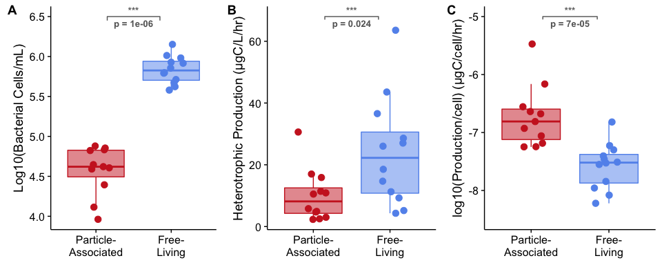


# Diversity Comparison

```r
######################################################### RICHNESS 
rich_wilcox <- wilcox.test(mean ~ fraction, 
             data = filter(otu_alphadiv, fraction %in% c("WholePart", "WholeFree") & measure == "Richness"))

filter(otu_alphadiv, fraction %in% c("WholePart", "WholeFree") & measure == "Richness") %>%
  group_by(fraction) %>%
  summarize(mean(mean),  median(mean))
```

```
## # A tibble: 2 × 3
##    fraction `mean(mean)` `median(mean)`
##      <fctr>        <dbl>          <dbl>
## 1 WholePart     454.6417        413.935
## 2 WholeFree     281.4133        257.595
```

```r
# Make a data frame to draw significance line in boxplot (visually calculated)
nums1 <- data.frame(a = c(1.15,1.15,1.85,1.85), b = c(790,800,800,790)) # WholePart vs WholeFree

poster_rich1 <-  ggplot(filter(otu_alphadiv, 
                          fraction %in% c("WholePart", "WholeFree") & measure == "Richness"), 
       aes(y = mean, x = fraction)) +
  ylab("Observed Richness") + 
  #geom_errorbar(aes(ymin = mean - sd, ymax = mean + sd, color = fraction), alpha = 0.7) + # X-axis errorbars
  geom_jitter(size = 3, aes(color = fraction, fill = fraction), width = 0.2) + 
  geom_boxplot(alpha = 0.5, outlier.shape = NA, aes(color = fraction, fill = fraction)) +
  scale_fill_manual(values = fraction_colors, 
                    breaks=c("WholeFree", "WholePart"), 
                    labels=c("Free-Living", "Particle-Associated")) +
  scale_color_manual(values = fraction_colors,
                 breaks=c("WholeFree", "WholePart"), 
                 labels=c("Free-Living", "Particle-Associated")) + 
  geom_path(data = nums1, aes(x = a, y = b), linetype = 1, color = "gray40") +
  theme(legend.position = "none") +
  scale_y_continuous(limits = c(180, 810), breaks = c(200, 400, 600, 800)) 
     
     
poster_rich <- poster_rich1 + 
  annotate("text", x=1.5, y=800, fontface = "bold",  size = 3.5, color = "gray40",
           label= paste("***\np =", round(rich_wilcox$p.value, digits = 3))) +
  theme(legend.position = c(0.7, 0.75), 
        axis.title.x = element_blank(),
        legend.title = element_blank(),
        legend.spacing.y = unit(-0.5, "cm"),
        legend.spacing.x = unit(-0.3, "cm"),
        legend.box = "horizontal") +
  scale_fill_manual(values = fraction_colors, 
                    breaks=c("WholeFree", "WholePart"), 
                    labels=c("Free", "Particle")) +
  scale_color_manual(values = fraction_colors,
                 breaks=c("WholeFree", "WholePart"), 
                 labels=c("Free", "Particle")) +
  geom_jitter(size = 3, aes(color = fraction, fill = fraction, shape = lakesite), width = 0.2) + 
  scale_shape_discrete(guide = guide_legend(reverse=TRUE))


######################################################### SHANNON ENTROPY  
shannon_wilcox <- wilcox.test(mean ~ fraction, 
             data = filter(otu_alphadiv, fraction %in% c("WholePart", "WholeFree") & measure == "Shannon_Entropy"))

filter(otu_alphadiv, fraction %in% c("WholePart", "WholeFree") & measure == "Shannon_Entropy") %>%
  group_by(fraction) %>%
  summarize(mean(mean),  median(mean))
```

```
## # A tibble: 2 × 3
##    fraction `mean(mean)` `median(mean)`
##      <fctr>        <dbl>          <dbl>
## 1 WholePart     4.555905       4.464302
## 2 WholeFree     4.009610       4.001229
```

```r
# Make a data frame to draw significance line in boxplot (visually calculated)
nums2 <- data.frame(a = c(1.15,1.15,1.85,1.85), b = c(5.75,5.8,5.8,5.75)) # WholePart vs WholeFree

poster_shannon1 <- ggplot(filter(otu_alphadiv, 
                          fraction %in% c("WholePart", "WholeFree") & measure == "Shannon_Entropy"), 
       aes(y = mean, x = fraction)) +  
  ylab("Shannon Entropy") +   
  #geom_errorbar(aes(ymin = mean - sd, ymax = mean + sd), alpha = 0.7) + # X-axis errorbars
  geom_jitter(size = 3, aes(color = fraction, fill = fraction), width = 0.2) + 
  geom_boxplot(alpha = 0.5, outlier.shape = NA, aes(color = fraction, fill = fraction)) +
  scale_fill_manual(values = fraction_colors, 
                    breaks=c("WholeFree", "WholePart"), 
                    labels=c("Free-Living", "Particle-Associated")) +
  scale_color_manual(values = fraction_colors,
                 breaks=c("WholeFree", "WholePart"), 
                 labels=c("Free-Living", "Particle-Associated")) + 
  geom_path(data = nums2, aes(x = a, y = b), linetype = 1, color = "gray40") +
  theme(legend.position = "none") +
  scale_y_continuous(limits = c(3.4, 5.85), breaks = c(3.5, 4, 4.5, 5, 5.5))  

  
  
poster_shannon <- poster_shannon1 + 
  annotate("text", x=1.5, y=5.8, fontface = "bold",  size = 3.5, color = "gray40",
           label= paste("***\np =", round(shannon_wilcox$p.value, digits = 3))) +
  theme(legend.position = "none", axis.title.x = element_blank())


#########################################################  INVERSE SIMPSON 
simpson_wilcox <- wilcox.test(mean ~ fraction, 
             data = filter(otu_alphadiv, 
                          fraction %in% c("WholePart", "WholeFree") & 
                            measure == "Inverse_Simpson" &
                            norep_filter_name != "MOTEJ515" & norep_filter_name != "MOTEP515"))
simpson_wilcox
```

```
## 
## 	Wilcoxon rank sum test
## 
## data:  mean by fraction
## W = 70, p-value = 0.8328
## alternative hypothesis: true location shift is not equal to 0
```

```r
filter(otu_alphadiv, fraction %in% c("WholePart", "WholeFree") & measure == "Inverse_Simpson" &
       norep_filter_name != "MOTEJ515" & norep_filter_name != "MOTEP515") %>%
  group_by(fraction) %>%
  summarize(mean(mean), median(mean))
```

```
## # A tibble: 2 × 3
##    fraction `mean(mean)` `median(mean)`
##      <fctr>        <dbl>          <dbl>
## 1 WholePart     37.27907       19.45268
## 2 WholeFree     24.85521       23.88347
```

```r
nums3 <- data.frame(a = c(1.15,1.15,1.85,1.85), b = c(88,89, 89, 88)) # WholePart vs WholeFree


poster_invsimps1 <-   ggplot(filter(otu_alphadiv, 
                          fraction %in% c("WholePart", "WholeFree") & 
                            measure == "Inverse_Simpson" &
                            norep_filter_name != "MOTEJ515" & norep_filter_name != "MOTEP515"), 
       aes(y = mean, x = fraction)) +
  ylab("Inverse Simpson") +   
  #geom_errorbar(aes(ymin = mean - sd, ymax = mean + sd), alpha = 0.7) + # X-axis errorbars
  geom_jitter(size = 3, aes(color = fraction, fill = fraction), width = 0.2) + 
  geom_boxplot(alpha = 0.5, outlier.shape = NA, aes(color = fraction, fill = fraction)) +
  scale_fill_manual(values = fraction_colors, 
                    breaks=c("WholeFree", "WholePart"), 
                    labels=c("Free-Living", "Particle-Associated")) +
  scale_color_manual(values = fraction_colors,
                 breaks=c("WholeFree", "WholePart"), 
                 labels=c("Free-Living", "Particle-Associated")) + 
  geom_path(data = nums3, aes(x = a, y = b), linetype = "dotted", color = "gray40") +
  theme(legend.position = "none") +
  scale_y_continuous(limits = c(0,95), breaks = c(0, 20, 40, 60, 80), expand = c(0,0))  


poster_invsimps <- poster_invsimps1 +
  annotate("text", x=1.5, y=89, fontface = "bold",  size = 3.5, color = "gray40",
           label= paste("NS\np =", round(simpson_wilcox$p.value, digits = 2))) +
  theme(legend.position = "none", axis.title.x = element_blank())

#########################################################  SIMPSON'S EVENNESS
simpseven_wilcox <- wilcox.test(mean ~ fraction, 
             data = filter(otu_alphadiv, 
                          fraction %in% c("WholePart", "WholeFree") & 
                            measure == "Simpsons_Evenness" &
                            norep_filter_name != "MOTEJ515" & norep_filter_name != "MOTEP515"))
simpseven_wilcox
```

```
## 
## 	Wilcoxon rank sum test
## 
## data:  mean by fraction
## W = 48, p-value = 0.2875
## alternative hypothesis: true location shift is not equal to 0
```

```r
filter(otu_alphadiv, fraction %in% c("WholePart", "WholeFree") & measure == "Simpsons_Evenness" &
       norep_filter_name != "MOTEJ515" & norep_filter_name != "MOTEP515") %>%
  group_by(fraction) %>%
  summarize(mean(mean), median(mean))
```

```
## # A tibble: 2 × 3
##    fraction `mean(mean)` `median(mean)`
##      <fctr>        <dbl>          <dbl>
## 1 WholePart   0.07295660     0.05540021
## 2 WholeFree   0.08859526     0.08346213
```

```r
nums3 <- data.frame(a = c(1.15,1.15,1.85,1.85), b = c(0.145, 0.15, 0.15, 0.145)) # WholePart vs WholeFree


poster_simpseven1 <-   ggplot(filter(otu_alphadiv, 
                          fraction %in% c("WholePart", "WholeFree") & 
                            measure == "Simpsons_Evenness" &
                            norep_filter_name != "MOTEJ515" & norep_filter_name != "MOTEP515"), 
       aes(y = mean, x = fraction)) +
  ylab("Simpson's Evenness") +   
  #geom_errorbar(aes(ymin = mean - sd, ymax = mean + sd), alpha = 0.7) + # X-axis errorbars
  geom_jitter(size = 3, aes(color = fraction, fill = fraction), width = 0.2) + 
  geom_boxplot(alpha = 0.5, outlier.shape = NA, aes(color = fraction, fill = fraction)) +
  scale_fill_manual(values = fraction_colors, 
                    breaks=c("WholeFree", "WholePart"), 
                    labels=c("Free-Living", "Particle-Associated")) +
  scale_color_manual(values = fraction_colors,
                 breaks=c("WholeFree", "WholePart"), 
                 labels=c("Free-Living", "Particle-Associated")) + 
  geom_path(data = nums3, aes(x = a, y = b), linetype = "dotted", color = "gray40") +
  theme(legend.position = "none") +
  scale_y_continuous(limits = c(0.03,0.151), breaks = c(0.05, 0.1, 0.15))  

  
poster_simpseven <- poster_simpseven1 +
  annotate("text", x=1.5, y=0.15, fontface = "bold",  size = 3.5, color = "gray40",
           label= paste("NS\np =", round(simpseven_wilcox$p.value, digits = 2))) +
  theme(legend.position = "none", axis.title.x = element_blank())

plot_grid(poster_rich, poster_shannon, poster_invsimps, poster_simpseven,
          labels = c("A", "B", "C", "D"),
          ncol = 4)
```

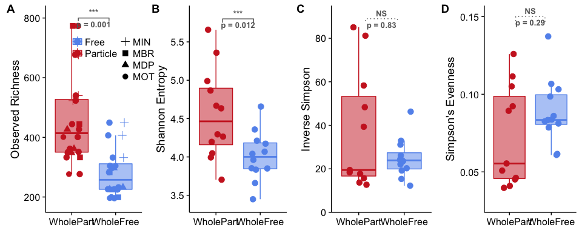


# Diversity vs Fraction Production 

```r
######################################################### RICHNESS
# Free-Living Richness vs fractional production 
freeprod_ML_otu_rich <- lm(frac_bacprod ~ mean, data = filter(ML_otu_rich_stats, fraction == "WholeFree"))
summary(freeprod_ML_otu_rich) 
```

```
## 
## Call:
## lm(formula = frac_bacprod ~ mean, data = filter(ML_otu_rich_stats, 
##     fraction == "WholeFree"))
## 
## Residuals:
##     Min      1Q  Median      3Q     Max 
## -21.680 -12.277  -1.541   8.520  29.088 
## 
## Coefficients:
##             Estimate Std. Error t value Pr(>|t|)
## (Intercept)  0.53767   18.32782   0.029    0.977
## mean         0.08358    0.06277   1.332    0.213
## 
## Residual standard error: 16.95 on 10 degrees of freedom
## Multiple R-squared:  0.1506,	Adjusted R-squared:  0.06568 
## F-statistic: 1.773 on 1 and 10 DF,  p-value: 0.2125
```

```r
# Particle-Associated Richness vs fractional production 
partprod_MLotu_rich <- lm(frac_bacprod ~ mean, data = filter(ML_otu_rich_stats, fraction == "WholePart"))
summary(partprod_MLotu_rich) 
```

```
## 
## Call:
## lm(formula = frac_bacprod ~ mean, data = filter(ML_otu_rich_stats, 
##     fraction == "WholePart"))
## 
## Residuals:
##     Min      1Q  Median      3Q     Max 
## -7.0263 -3.7207 -0.5858  3.2397 11.3728 
## 
## Coefficients:
##             Estimate Std. Error t value Pr(>|t|)   
## (Intercept) -9.01778    5.47953  -1.646  0.13084   
## mean         0.04174    0.01150   3.629  0.00462 **
## ---
## Signif. codes:  0 '***' 0.001 '**' 0.01 '*' 0.05 '.' 0.1 ' ' 1
## 
## Residual standard error: 5.679 on 10 degrees of freedom
## Multiple R-squared:  0.5684,	Adjusted R-squared:  0.5253 
## F-statistic: 13.17 on 1 and 10 DF,  p-value: 0.004617
```

```r
# Both fractions together
summary(lm(frac_bacprod ~ mean, data = ML_otu_rich_stats))
```

```
## 
## Call:
## lm(formula = frac_bacprod ~ mean, data = ML_otu_rich_stats)
## 
## Residuals:
##     Min      1Q  Median      3Q     Max 
## -14.757 -11.705  -5.573   9.159  46.467 
## 
## Coefficients:
##              Estimate Std. Error t value Pr(>|t|)  
## (Intercept) 15.810455   8.714369   1.814   0.0833 .
## mean         0.003255   0.022053   0.148   0.8840  
## ---
## Signif. codes:  0 '***' 0.001 '**' 0.01 '*' 0.05 '.' 0.1 ' ' 1
## 
## Residual standard error: 15.54 on 22 degrees of freedom
## Multiple R-squared:  0.0009892,	Adjusted R-squared:  -0.04442 
## F-statistic: 0.02178 on 1 and 22 DF,  p-value: 0.884
```

```r
# Plot 
otu_rich_vegan <-  ggplot(ML_otu_rich_stats, aes(x=mean, y=frac_bacprod, color = fraction)) + 
  geom_point(size = 3.5) + 
  geom_errorbarh(aes(xmin = mean - sd, xmax = mean + sd), alpha = 0.7) + # X-axis errorbars
  # Y-axis errorbars
  geom_errorbar(aes(ymin = frac_bacprod - SD_frac_bacprod, ymax = frac_bacprod + SD_frac_bacprod),  alpha = 0.5) + 
  scale_color_manual(values = c("firebrick3","cornflowerblue"), 
                     limits = c("WholePart", "WholeFree"),
                     breaks=c("WholePart", "WholeFree"),
                     labels=c("Particle", "Free")) + 
  ylab("Secondary Production (μgC/L/hr)") + xlab("Observed Richness") +
  geom_smooth(data=subset(ML_otu_rich_stats, fraction == "WholePart"), method='lm') + 
  scale_x_continuous(limits = c(180, 810), breaks = c(200, 400, 600, 800)) + 
  theme(legend.position=c(0.15,0.9),        
        legend.title=element_blank()) +
  annotate("text", x = 250, y=55, color = "cornflowerblue", fontface = "bold",
           label = paste("R2 =", round(summary(freeprod_ML_otu_rich)$adj.r.squared, digits = 2), "\n", 
                         "p =", round(unname(summary(freeprod_ML_otu_rich)$coefficients[,4][2]), digits = 2))) + 
  annotate("text", x = 650, y=3, color = "firebrick3", fontface = "bold",
           label = paste("R2 =", round(summary(partprod_MLotu_rich)$adj.r.squared, digits = 2), "\n", 
                         "p =", round(unname(summary(partprod_MLotu_rich)$coefficients[,4][2]), digits = 4)));


######################################################### SHANNON ENTROPY
# Free-Living Shannon vs fractional production 
freeprod_ML_otu_shannon <- lm(frac_bacprod ~ mean, data = filter(ML_otu_shannon_stats, fraction == "WholeFree"))
summary(freeprod_ML_otu_shannon)
```

```
## 
## Call:
## lm(formula = frac_bacprod ~ mean, data = filter(ML_otu_shannon_stats, 
##     fraction == "WholeFree"))
## 
## Residuals:
##     Min      1Q  Median      3Q     Max 
## -22.579  -8.609  -3.901   7.158  34.673 
## 
## Coefficients:
##             Estimate Std. Error t value Pr(>|t|)
## (Intercept)   -31.90      67.19  -0.475    0.645
## mean           13.95      16.71   0.835    0.423
## 
## Residual standard error: 17.78 on 10 degrees of freedom
## Multiple R-squared:  0.06522,	Adjusted R-squared:  -0.02826 
## F-statistic: 0.6977 on 1 and 10 DF,  p-value: 0.4231
```

```r
# Particle-Associated Shannon vs fractional production 
partprod_MLotu_shannon <- lm(frac_bacprod ~ mean, data = filter(ML_otu_shannon_stats, fraction == "WholePart"))
summary(partprod_MLotu_shannon)
```

```
## 
## Call:
## lm(formula = frac_bacprod ~ mean, data = filter(ML_otu_shannon_stats, 
##     fraction == "WholePart"))
## 
## Residuals:
##     Min      1Q  Median      3Q     Max 
## -8.1443 -3.2240 -0.3064  1.3478 12.1092 
## 
## Coefficients:
##             Estimate Std. Error t value Pr(>|t|)   
## (Intercept)  -38.477     13.500  -2.850  0.01725 * 
## mean          10.631      2.941   3.615  0.00473 **
## ---
## Signif. codes:  0 '***' 0.001 '**' 0.01 '*' 0.05 '.' 0.1 ' ' 1
## 
## Residual standard error: 5.693 on 10 degrees of freedom
## Multiple R-squared:  0.5664,	Adjusted R-squared:  0.5231 
## F-statistic: 13.07 on 1 and 10 DF,  p-value: 0.004732
```

```r
# Both fractions together
summary(lm(frac_bacprod ~ mean, data = ML_otu_shannon_stats))
```

```
## 
## Call:
## lm(formula = frac_bacprod ~ mean, data = ML_otu_shannon_stats)
## 
## Residuals:
##     Min      1Q  Median      3Q     Max 
## -14.551 -11.737  -5.533   8.998  46.485 
## 
## Coefficients:
##             Estimate Std. Error t value Pr(>|t|)
## (Intercept)   10.966     25.955   0.423    0.677
## mean           1.411      6.015   0.235    0.817
## 
## Residual standard error: 15.53 on 22 degrees of freedom
## Multiple R-squared:  0.002494,	Adjusted R-squared:  -0.04285 
## F-statistic: 0.05501 on 1 and 22 DF,  p-value: 0.8167
```

```r
# Plot 
otu_shannon_vegan <- ggplot(ML_otu_shannon_stats, aes(x=mean, y=frac_bacprod, color = fraction)) + 
  geom_point(size = 3.5) + 
  geom_errorbarh(aes(xmin = mean - sd, xmax = mean + sd), alpha = 0.7) + # X-axis errorbars
  # Y-axis errorbars
  geom_errorbar(aes(ymin = frac_bacprod - SD_frac_bacprod, ymax = frac_bacprod + SD_frac_bacprod),  alpha = 0.5) + 
  scale_color_manual(values = c("firebrick3","cornflowerblue"), 
                     limits = c("WholePart", "WholeFree"),
                     breaks=c("WholeFree", "WholePart"),
                     labels=c("Free-Living", "Particle-Associated")) + 
  ylab("Secondary Production (μgC/L/hr)") + xlab("Shannon Entropy") +
  scale_x_continuous(limits = c(3.4, 5.85), breaks = c(3.5, 4, 4.5, 5, 5.5)) + 
  geom_smooth(data=subset(ML_otu_shannon_stats, fraction == "WholePart"), method='lm') + 
  theme(legend.position=c(0.15,0.9),        
        legend.title=element_blank()) +
  annotate("text", x = 3.75, y=55, color = "cornflowerblue", fontface = "bold",
           label = paste("R2 =", round(summary(freeprod_ML_otu_shannon)$adj.r.squared, digits = 2), "\n", 
                         "p =", round(unname(summary(freeprod_ML_otu_shannon)$coefficients[,4][2]), digits = 2))) + 
  annotate("text", x = 5.35, y=3, color = "firebrick3", fontface = "bold",
           label = paste("R2 =", round(summary(partprod_MLotu_shannon)$adj.r.squared, digits = 2), "\n", 
                         "p =", round(unname(summary(partprod_MLotu_shannon)$coefficients[,4][2]), digits = 4))); 


######################################################### INVERSE SIMPSON
# Free-Living Inverse Simpson vs fractional production 
freeprod_ML_otu_invsimps <- lm(frac_bacprod ~ mean, data = filter(ML_otu_invsimps_stats, fraction == "WholeFree"))
summary(freeprod_ML_otu_invsimps)
```

```
## 
## Call:
## lm(formula = frac_bacprod ~ mean, data = filter(ML_otu_invsimps_stats, 
##     fraction == "WholeFree"))
## 
## Residuals:
##     Min      1Q  Median      3Q     Max 
## -20.509 -10.752  -3.999   6.315  34.879 
## 
## Coefficients:
##             Estimate Std. Error t value Pr(>|t|)
## (Intercept)   9.8660    15.6021   0.632    0.541
## mean          0.5710     0.5935   0.962    0.359
## 
## Residual standard error: 17.59 on 10 degrees of freedom
## Multiple R-squared:  0.08471,	Adjusted R-squared:  -0.006819 
## F-statistic: 0.9255 on 1 and 10 DF,  p-value: 0.3587
```

```r
# Particle-Associated Inverse Simpson vs fractional production 
partprod_MLotu_invsimps <- lm(frac_bacprod ~ mean, data = filter(ML_otu_invsimps_stats, fraction == "WholePart"))
summary(partprod_MLotu_invsimps)
```

```
## 
## Call:
## lm(formula = frac_bacprod ~ mean, data = filter(ML_otu_invsimps_stats, 
##     fraction == "WholePart"))
## 
## Residuals:
##     Min      1Q  Median      3Q     Max 
## -7.4641 -2.1798 -0.1669  0.9857  7.8508 
## 
## Coefficients:
##             Estimate Std. Error t value Pr(>|t|)    
## (Intercept) -0.11137    2.37660  -0.047 0.963548    
## mean         0.26844    0.05274   5.090 0.000471 ***
## ---
## Signif. codes:  0 '***' 0.001 '**' 0.01 '*' 0.05 '.' 0.1 ' ' 1
## 
## Residual standard error: 4.562 on 10 degrees of freedom
## Multiple R-squared:  0.7215,	Adjusted R-squared:  0.6937 
## F-statistic: 25.91 on 1 and 10 DF,  p-value: 0.0004708
```

```r
# Both fractions together
summary(lm(frac_bacprod ~ mean, data = ML_otu_invsimps_stats))
```

```
## 
## Call:
## lm(formula = frac_bacprod ~ mean, data = ML_otu_invsimps_stats)
## 
## Residuals:
##     Min      1Q  Median      3Q     Max 
## -15.277 -10.223  -5.040   5.606  46.308 
## 
## Coefficients:
##             Estimate Std. Error t value Pr(>|t|)  
## (Intercept)  12.1929     5.8162   2.096   0.0478 *
## mean          0.1544     0.1577   0.979   0.3380  
## ---
## Signif. codes:  0 '***' 0.001 '**' 0.01 '*' 0.05 '.' 0.1 ' ' 1
## 
## Residual standard error: 15.22 on 22 degrees of freedom
## Multiple R-squared:  0.04178,	Adjusted R-squared:  -0.001773 
## F-statistic: 0.9593 on 1 and 22 DF,  p-value: 0.338
```

```r
# Plot Simpson's Evenness
otu_invsimps_vegan <- ggplot(ML_otu_invsimps_stats, aes(x=mean, y=frac_bacprod, color = fraction)) + 
  geom_point(size = 3.5) +  
  geom_errorbarh(aes(xmin = mean - sd, xmax = mean + sd), alpha = 0.7) + # X-axis errorbars
  # Y-axis errorbars
  geom_errorbar(aes(ymin = frac_bacprod - SD_frac_bacprod, ymax = frac_bacprod + SD_frac_bacprod),  alpha = 0.5) + 
  scale_color_manual(values = c("firebrick3","cornflowerblue"), 
                     limits = c("WholePart", "WholeFree"),
                     breaks=c("WholeFree", "WholePart"),
                     labels=c("Free-Living", "Particle-Associated")) + 
  scale_x_continuous(limits = c(0,95), breaks = c(0, 20, 40, 60, 80), expand = c(0,0)) + 
  ylab("Secondary Production (μgC/L/hr)") + xlab("Inverse Simpson") +
  geom_smooth(data=subset(ML_otu_invsimps_stats, fraction == "WholePart"), method='lm') + 
  theme(legend.position=c(0.85,0.9),        
        legend.title=element_blank()) +
  annotate("text", x = 15, y=55, color = "cornflowerblue", fontface = "bold",
           label = paste("R2 =", round(summary(freeprod_ML_otu_invsimps)$adj.r.squared, digits = 2), "\n", 
                         "p =", round(unname(summary(freeprod_ML_otu_invsimps)$coefficients[,4][2]), digits = 2))) + 
  annotate("text", x = 63, y=3, color = "firebrick3", fontface = "bold",
           label = paste("R2 =", round(summary(partprod_MLotu_invsimps)$adj.r.squared, digits = 2), "\n", 
                         "p =", round(unname(summary(partprod_MLotu_invsimps)$coefficients[,4][2]), digits = 4))); 


######################################################### SIMPSON'S EVENNESS
# Free-Living Simpson's Evenness vs fractional production 
freeprod_ML_otu_simpseven <- lm(frac_bacprod ~ mean, data = filter(ML_otu_simpseven_stats, fraction == "WholeFree"))
summary(freeprod_ML_otu_simpseven)
```

```
## 
## Call:
## lm(formula = frac_bacprod ~ mean, data = filter(ML_otu_simpseven_stats, 
##     fraction == "WholeFree"))
## 
## Residuals:
##     Min      1Q  Median      3Q     Max 
## -19.650 -12.823  -2.314   5.320  39.846 
## 
## Coefficients:
##             Estimate Std. Error t value Pr(>|t|)
## (Intercept)    20.39      24.17   0.844    0.418
## mean           41.35     266.13   0.155    0.880
## 
## Residual standard error: 18.36 on 10 degrees of freedom
## Multiple R-squared:  0.002409,	Adjusted R-squared:  -0.09735 
## F-statistic: 0.02414 on 1 and 10 DF,  p-value: 0.8796
```

```r
# Particle-Associated Simpson's Evenness vs fractional production 
partprod_MLotu_simpseven <- lm(frac_bacprod ~ mean, data = filter(ML_otu_simpseven_stats, fraction == "WholePart"))
summary(partprod_MLotu_simpseven)
```

```
## 
## Call:
## lm(formula = frac_bacprod ~ mean, data = filter(ML_otu_simpseven_stats, 
##     fraction == "WholePart"))
## 
## Residuals:
##      Min       1Q   Median       3Q      Max 
## -10.3734  -1.9697  -0.8378   1.2650  10.5305 
## 
## Coefficients:
##             Estimate Std. Error t value Pr(>|t|)   
## (Intercept)   -5.057      4.282  -1.181   0.2650   
## mean         199.656     52.810   3.781   0.0036 **
## ---
## Signif. codes:  0 '***' 0.001 '**' 0.01 '*' 0.05 '.' 0.1 ' ' 1
## 
## Residual standard error: 5.547 on 10 degrees of freedom
## Multiple R-squared:  0.5884,	Adjusted R-squared:  0.5472 
## F-statistic: 14.29 on 1 and 10 DF,  p-value: 0.003598
```

```r
# Both fractions together
summary(lm(frac_bacprod ~ mean, data = ML_otu_simpseven_stats))
```

```
## 
## Call:
## lm(formula = frac_bacprod ~ mean, data = ML_otu_simpseven_stats)
## 
## Residuals:
##     Min      1Q  Median      3Q     Max 
## -16.188  -7.251  -4.197   2.929  46.731 
## 
## Coefficients:
##             Estimate Std. Error t value Pr(>|t|)  
## (Intercept)  -0.1406     9.5644  -0.015   0.9884  
## mean        209.3885   111.1051   1.885   0.0728 .
## ---
## Signif. codes:  0 '***' 0.001 '**' 0.01 '*' 0.05 '.' 0.1 ' ' 1
## 
## Residual standard error: 14.43 on 22 degrees of freedom
## Multiple R-squared:  0.139,	Adjusted R-squared:  0.09986 
## F-statistic: 3.552 on 1 and 22 DF,  p-value: 0.07276
```

```r
# Plot 
otu_simpseven_vegan <- ggplot(ML_otu_simpseven_stats, aes(x=mean, y=frac_bacprod, color = fraction)) + 
  geom_point(size = 3.5) +  
  geom_errorbarh(aes(xmin = mean - sd, xmax = mean + sd), alpha = 0.7) + # X-axis errorbars
  # Y-axis errorbars
  geom_errorbar(aes(ymin = frac_bacprod - SD_frac_bacprod, ymax = frac_bacprod + SD_frac_bacprod),  alpha = 0.5) + 
  scale_color_manual(values = c("firebrick3","cornflowerblue"), 
                     limits = c("WholePart", "WholeFree"),
                     breaks=c("WholeFree", "WholePart"),
                     labels=c("Free-Living", "Particle-Associated")) + 
  scale_x_continuous(limits = c(0.03,0.151), breaks = c(0.05, 0.1, 0.15))  +
  ylab("Secondary Production (μgC/L/hr)") + xlab("Simpson's Evenness") +
  geom_smooth(data=subset(ML_otu_simpseven_stats, fraction == "WholePart"), method='lm') + 
  theme(legend.position=c(0.15,0.9),        
        legend.title=element_blank()) +
  annotate("text", x = 0.05, y=55, color = "cornflowerblue", fontface = "bold",
           label = paste("R2 =", round(summary(freeprod_ML_otu_simpseven)$adj.r.squared, digits = 2), "\n", 
                         "p =", round(unname(summary(freeprod_ML_otu_simpseven)$coefficients[,4][2]), digits = 2))) + 
  annotate("text", x = 0.125, y=3, color = "firebrick3", fontface = "bold",
           label = paste("R2 =", round(summary(partprod_MLotu_simpseven)$adj.r.squared, digits = 2), "\n", 
                         "p =", round(unname(summary(partprod_MLotu_simpseven)$coefficients[,4][2]), digits = 4))); 

#otu_vegan <- plot_grid(otu_rich_vegan, otu_simpseven_vegan, otu_shannon_vegan, otu_invsimps_vegan,
#                       labels = c("A", "B", "C", "D"), 
#                       align = "h", nrow = 2, ncol = 2)
#otu_vegan
```


## Residual Analysis 

```r
##########################################################################
#############################   RESIDUALS   ##############################
##########################################################################

######################################################### RICHNESS
# Residual analysis of the RICHNESS Models
plot_residuals(lm_model = partprod_MLotu_rich, 
               lm_observed_y = filter(ML_otu_rich_stats, fraction == "WholePart")$frac_bacprod,
               main_title = "Particle-Associated Richness")
```

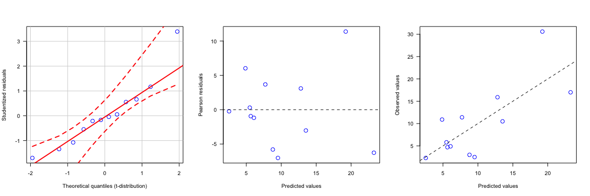

```r
######################################################### SHANNON ENTROPY
# Residual analysis of the SHANNON ENTROPY Models
plot_residuals(lm_model = partprod_MLotu_shannon, 
               lm_observed_y = filter(ML_otu_shannon_stats, fraction == "WholePart")$frac_bacprod,
               main_title = "Particle-Associated Shannon")
```

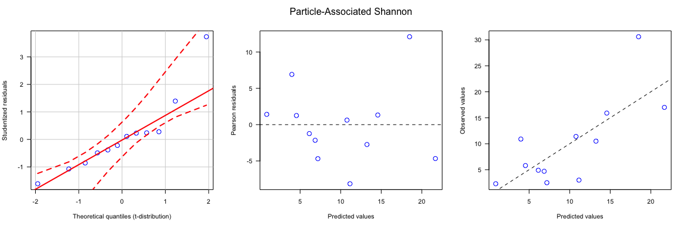

```r
######################################################### INVERSE SIMPSON
# Residual analysis of the INVERSE SIMPSON Models
plot_residuals(lm_model = partprod_MLotu_invsimps, 
               lm_observed_y = filter(ML_otu_invsimps_stats, fraction == "WholePart")$frac_bacprod,
               main_title = "Particle-Associated Inverse Simpson")
```

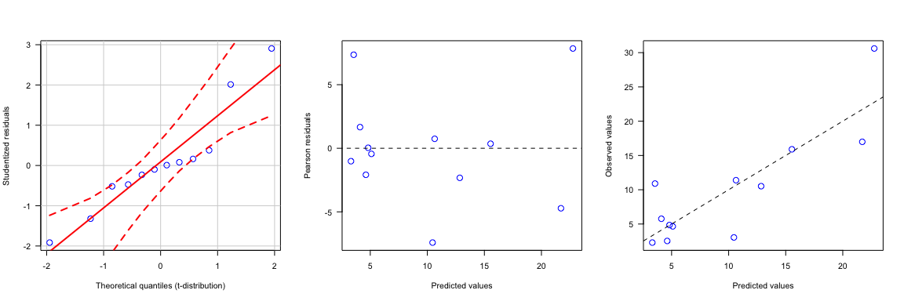

```r
######################################################### SIMPSONS EVENNESS
# Residual analysis of the INVERSE SIMPSON Models
plot_residuals(lm_model = partprod_MLotu_simpseven, 
               lm_observed_y = filter(ML_otu_simpseven_stats, fraction == "WholePart")$frac_bacprod,
               main_title = "Particle-Associated Simpson's Evenness")
```


## Correlations 


```r
##########################################################################
###########################   CORRELATIONS   #############################
##########################################################################
# RICHNESS vs SHANNON
cor(filter(ML_otu_rich_stats, fraction == "WholePart")$mean,
    filter(ML_otu_shannon_stats, fraction == "WholePart")$mean) # YES
```

```
## [1] 0.961703
```

```r
# SHANNON VS INVERSE SIMPSON
cor(filter(ML_otu_shannon_stats, fraction == "WholePart")$mean,
    filter(ML_otu_invsimps_stats, fraction == "WholePart")$mean) # YES
```

```
## [1] 0.9682435
```

```r
# INVERSE SIMPSON VS SIMPSONS EVENNESS
cor(filter(ML_otu_invsimps_stats, fraction == "WholePart")$mean,
    filter(ML_otu_simpseven_stats, fraction == "WholePart")$mean) # YES
```

```
## [1] 0.9284642
```

```r
# SIMPSONS EVENNESS VS RICHNESS
cor(filter(ML_otu_simpseven_stats, fraction == "WholePart")$mean,
    filter(ML_otu_rich_stats, fraction == "WholePart")$mean) # YES
```

```
## [1] 0.7683792
```


## Post-hoc analysis 

```r
# Are the fractions different from each other in predicting fraction production?
prod_fracprod_values <- subset(otu_alphadiv, limnion == "Top" & year == "2015" & 
                          fraction == "WholePart" &
                          measure == "Richness") %>%
  dplyr::select(norep_filter_name, frac_bacprod) 

# Create a matrix with the 4 different diversity values 
prod_alpha <- subset(otu_alphadiv, limnion == "Top" & year == "2015" & 
                          fraction %in% c("WholePart", "WholeFree")) %>%
  dplyr::select(norep_filter_name, measure, mean) %>%
  spread(measure, mean)
row.names(prod_alpha) <- prod_alpha$norep_filter_name
prod_alpha$norep_filter_name = NULL
prod_alpha <- as.matrix(prod_alpha)

# Scale to a mean = 0 and  SD = 1
scale_prod_alphadiv <- scale(prod_alpha)

# Sanity Check
colMeans(scale_prod_alphadiv)  # faster version of apply(scaled.dat, 2, mean)
```

```
##          Richness Simpsons_Evenness   Shannon_Entropy   Inverse_Simpson 
##     -1.827242e-16      1.590163e-16     -3.921921e-16      4.365721e-17
```

```r
apply(scale_prod_alphadiv, 2, sd)
```

```
##          Richness Simpsons_Evenness   Shannon_Entropy   Inverse_Simpson 
##                 1                 1                 1                 1
```

```r
# Melt the data frame to be in long format
gather_prod_alpha <- as.data.frame(scale_prod_alphadiv) %>%   # Make scaled values a dataframe
  tibble::rownames_to_column(var = "norep_filter_name") %>%   # Add the rownames to keep samplenames
  gather(measure, mean, 2:5)                                  # Gather 4 columns and put values into 2
  
# Put it all together into one dataframe with 4 columns: sample_name, measure, mean, frac_bacprod 
prod_alpha_fracprod <- inner_join(gather_prod_alpha, prod_fracprod_values, by = "norep_filter_name") %>%
  mutate(measure = as.factor(measure))
```

```
## Warning in inner_join_impl(x, y, by$x, by$y, suffix$x, suffix$y): joining character vector and factor, coercing into character vector
```

```r
# Double check values from above models
lm_by_divmeasure <- lm(frac_bacprod ~ mean/measure, data = prod_alpha_fracprod)
summary(lm_by_divmeasure)
```

```
## 
## Call:
## lm(formula = frac_bacprod ~ mean/measure, data = prod_alpha_fracprod)
## 
## Residuals:
##     Min      1Q  Median      3Q     Max 
## -9.1328 -3.3521 -0.2908  2.0351 14.2938 
## 
## Coefficients:
##                               Estimate Std. Error t value Pr(>|t|)    
## (Intercept)                     8.4117     0.8613   9.766 1.76e-12 ***
## mean                            5.3755     1.2577   4.274 0.000104 ***
## mean:measureRichness           -0.1873     1.8927  -0.099 0.921621    
## mean:measureShannon_Entropy    -0.1670     1.8678  -0.089 0.929160    
## mean:measureSimpsons_Evenness  -0.5105     1.8967  -0.269 0.789095    
## ---
## Signif. codes:  0 '***' 0.001 '**' 0.01 '*' 0.05 '.' 0.1 ' ' 1
## 
## Residual standard error: 5.526 on 43 degrees of freedom
## Multiple R-squared:  0.5608,	Adjusted R-squared:  0.5199 
## F-statistic: 13.73 on 4 and 43 DF,  p-value: 2.714e-07
```

```r
# Run a post-hoc test
library(multcomp)
post_hoc_measure <- glht(lm_by_divmeasure, linfct = mcp(measure = "Tukey", interaction_average=TRUE),
                vcov=vcovHC(lm_by_divmeasure, type = "HC0"))
summary(post_hoc_measure)
```

```
## 
## 	 Simultaneous Tests for General Linear Hypotheses
## 
## Multiple Comparisons of Means: Tukey Contrasts
## 
## 
## Fit: lm(formula = frac_bacprod ~ mean/measure, data = prod_alpha_fracprod)
## 
## Linear Hypotheses:
##                                          Estimate Std. Error t value Pr(>|t|)
## Richness - Inverse_Simpson == 0           -0.1873     2.3131  -0.081    1.000
## Shannon_Entropy - Inverse_Simpson == 0    -0.1670     2.1513  -0.078    1.000
## Simpsons_Evenness - Inverse_Simpson == 0  -0.5105     2.3226  -0.220    0.996
## Shannon_Entropy - Richness == 0            0.0203     2.5793   0.008    1.000
## Simpsons_Evenness - Richness == 0         -0.3232     2.8005  -0.115    0.999
## Simpsons_Evenness - Shannon_Entropy == 0  -0.3435     2.6346  -0.130    0.999
## (Adjusted p values reported -- single-step method)
```

```r
detach("package:multcomp", unload=TRUE) # This package masks the dplyr select function = :(
```


# Per cell Fraction Production vs Diversity

```r
#########################################################  RICHNESS 
# Free-Living Richness vs fractional production per cell 
freeprod_percell_ML_otu_rich <- lm(log10(fracprod_per_cell) ~ mean, data = filter(ML_otu_rich_stats, fraction == "WholeFree"))
summary(freeprod_percell_ML_otu_rich)
```

```
## 
## Call:
## lm(formula = log10(fracprod_per_cell) ~ mean, data = filter(ML_otu_rich_stats, 
##     fraction == "WholeFree"))
## 
## Residuals:
##      Min       1Q   Median       3Q      Max 
## -0.70057 -0.13347  0.09905  0.23320  0.46523 
## 
## Coefficients:
##              Estimate Std. Error t value Pr(>|t|)    
## (Intercept) -8.231303   0.392315 -20.981 1.34e-09 ***
## mean         0.002332   0.001344   1.736    0.113    
## ---
## Signif. codes:  0 '***' 0.001 '**' 0.01 '*' 0.05 '.' 0.1 ' ' 1
## 
## Residual standard error: 0.3627 on 10 degrees of freedom
## Multiple R-squared:  0.2315,	Adjusted R-squared:  0.1547 
## F-statistic: 3.013 on 1 and 10 DF,  p-value: 0.1133
```

```r
# Particle-Associated Richness vs fractional production per cell 
partprod_percell_MLotu_rich <- lm(log10(fracprod_per_cell) ~ mean, data = filter(filter(ML_otu_rich_stats, fraction == "WholePart" & fracprod_per_cell != Inf)))
summary(partprod_percell_MLotu_rich)
```

```
## 
## Call:
## lm(formula = log10(fracprod_per_cell) ~ mean, data = filter(filter(ML_otu_rich_stats, 
##     fraction == "WholePart" & fracprod_per_cell != Inf)))
## 
## Residuals:
##     Min      1Q  Median      3Q     Max 
## -0.4830 -0.2164 -0.0414  0.1123  0.6833 
## 
## Coefficients:
##              Estimate Std. Error t value Pr(>|t|)    
## (Intercept) -7.927563   0.357240 -22.191 3.62e-09 ***
## mean         0.002615   0.000740   3.534  0.00637 ** 
## ---
## Signif. codes:  0 '***' 0.001 '**' 0.01 '*' 0.05 '.' 0.1 ' ' 1
## 
## Residual standard error: 0.3631 on 9 degrees of freedom
## Multiple R-squared:  0.5812,	Adjusted R-squared:  0.5347 
## F-statistic: 12.49 on 1 and 9 DF,  p-value: 0.006373
```

```r
# Plot 
rich_vs_fracprod_percell <- ggplot(filter(ML_otu_rich_stats, fracprod_per_cell != Inf),
       aes(x=mean, y=log10(fracprod_per_cell), color = fraction)) + 
  geom_point(size = 3.5) + geom_errorbarh(aes(xmin = mean - sd, xmax = mean + sd)) + 
  scale_x_continuous(limits = c(180, 810), breaks = c(200, 400, 600, 800)) + 
  scale_color_manual(values = c("firebrick3","cornflowerblue"), limits = c("WholePart", "WholeFree")) +
  ylab("log10(Production/Cell)\n (μgC/cell/hr)") + 
  xlab("Observed Richness") +
  geom_smooth(data=subset(ML_otu_rich_stats, fraction == "WholePart"), method='lm') + 
  theme(legend.position=c(0.2,0.9),        
        legend.title=element_blank()) +
  annotate("text", x = 500, y=-8, color = "cornflowerblue", fontface = "bold",
           label = paste("R2 =", round(summary(freeprod_percell_ML_otu_rich)$adj.r.squared, digits = 2), "\n", 
                         "p =", round(unname(summary(freeprod_percell_ML_otu_rich)$coefficients[,4][2]), digits = 2))) + 
  annotate("text", x = 650, y=-7, color = "firebrick3", fontface = "bold",
           label = paste("R2 =", round(summary(partprod_percell_MLotu_rich)$adj.r.squared, digits = 2), "\n", 
                         "p =", round(unname(summary(partprod_percell_MLotu_rich)$coefficients[,4][2]), digits = 3)));


#########################################################  SHANNON
# Free-Living Shannon vs fractional production per cell 
freeprod_percell_ML_otu_shannon <- lm(log10(fracprod_per_cell) ~ mean, data = filter(ML_otu_shannon_stats, fraction == "WholeFree"))
summary(freeprod_percell_ML_otu_shannon)
```

```
## 
## Call:
## lm(formula = log10(fracprod_per_cell) ~ mean, data = filter(ML_otu_shannon_stats, 
##     fraction == "WholeFree"))
## 
## Residuals:
##      Min       1Q   Median       3Q      Max 
## -0.73416 -0.12345  0.06239  0.16406  0.60638 
## 
## Coefficients:
##             Estimate Std. Error t value Pr(>|t|)    
## (Intercept)  -9.3048     1.4644  -6.354 8.31e-05 ***
## mean          0.4314     0.3642   1.185    0.264    
## ---
## Signif. codes:  0 '***' 0.001 '**' 0.01 '*' 0.05 '.' 0.1 ' ' 1
## 
## Residual standard error: 0.3875 on 10 degrees of freedom
## Multiple R-squared:  0.1231,	Adjusted R-squared:  0.03537 
## F-statistic: 1.403 on 1 and 10 DF,  p-value: 0.2635
```

```r
# Particle-Associated Shannon vs fractional production per cell 
partprod_percell_MLotu_shannon <- lm(log10(fracprod_per_cell) ~ mean, 
                                     data = filter(filter(ML_otu_shannon_stats, fraction == "WholePart" & fracprod_per_cell != Inf)))
summary(partprod_percell_MLotu_shannon)
```

```
## 
## Call:
## lm(formula = log10(fracprod_per_cell) ~ mean, data = filter(filter(ML_otu_shannon_stats, 
##     fraction == "WholePart" & fracprod_per_cell != Inf)))
## 
## Residuals:
##      Min       1Q   Median       3Q      Max 
## -0.35429 -0.25650  0.00058  0.03731  0.71258 
## 
## Coefficients:
##             Estimate Std. Error t value Pr(>|t|)    
## (Intercept)  -9.7528     0.8578 -11.369 1.22e-06 ***
## mean          0.6654     0.1871   3.558  0.00614 ** 
## ---
## Signif. codes:  0 '***' 0.001 '**' 0.01 '*' 0.05 '.' 0.1 ' ' 1
## 
## Residual standard error: 0.3617 on 9 degrees of freedom
## Multiple R-squared:  0.5844,	Adjusted R-squared:  0.5382 
## F-statistic: 12.66 on 1 and 9 DF,  p-value: 0.006143
```

```r
# Plot 
shannon_vs_fracprod_percell <- ggplot(filter(ML_otu_shannon_stats, fracprod_per_cell != Inf),
       aes(x=mean, y=log10(fracprod_per_cell), color = fraction)) + 
  geom_point(size = 3.5) + geom_errorbarh(aes(xmin = mean - sd, xmax = mean + sd)) + 
  scale_color_manual(values = c("firebrick3","cornflowerblue"), limits = c("WholePart", "WholeFree")) +
  ylab("log10(Production/Cell)\n (μgC/cell/hr)") + 
  xlab("Shannon Entropy") +
  scale_x_continuous(limits = c(3.4, 5.85), breaks = c(3.5, 4, 4.5, 5, 5.5)) + 
  geom_smooth(data=subset(ML_otu_shannon_stats, fraction == "WholePart"), method='lm') + 
  theme(legend.position=c(0.2,0.9),        
        legend.title=element_blank()) +
  annotate("text", x = 4.75, y=-8, color = "cornflowerblue", fontface = "bold",
           label = paste("R2 =", round(summary(freeprod_percell_ML_otu_shannon)$adj.r.squared, digits = 2), "\n", 
                         "p =", round(unname(summary(freeprod_percell_ML_otu_shannon)$coefficients[,4][2]), digits = 2))) + 
  annotate("text", x = 5.5, y=-7, color = "firebrick3", fontface = "bold",
           label = paste("R2 =", round(summary(partprod_percell_MLotu_shannon)$adj.r.squared, digits = 2), "\n", 
                         "p =", round(unname(summary(partprod_percell_MLotu_shannon)$coefficients[,4][2]), digits = 3)));


#########################################################  INVERSE SIMPSON 
# Free-Living Inverse Simpson vs fractional production per cell 
freeprod_percell_ML_otu_invsimps <- lm(log10(fracprod_per_cell) ~ mean, 
                                       data = filter(ML_otu_invsimps_stats, fraction == "WholeFree"))
summary(freeprod_percell_ML_otu_invsimps)
```

```
## 
## Call:
## lm(formula = log10(fracprod_per_cell) ~ mean, data = filter(ML_otu_invsimps_stats, 
##     fraction == "WholeFree"))
## 
## Residuals:
##      Min       1Q   Median       3Q      Max 
## -0.67225 -0.13709  0.01778  0.18505  0.59981 
## 
## Coefficients:
##             Estimate Std. Error t value Pr(>|t|)    
## (Intercept) -8.05317    0.33033 -24.379 3.07e-10 ***
## mean         0.01924    0.01257   1.531    0.157    
## ---
## Signif. codes:  0 '***' 0.001 '**' 0.01 '*' 0.05 '.' 0.1 ' ' 1
## 
## Residual standard error: 0.3724 on 10 degrees of freedom
## Multiple R-squared:  0.1898,	Adjusted R-squared:  0.1088 
## F-statistic: 2.343 on 1 and 10 DF,  p-value: 0.1568
```

```r
# Particle-Associated Inverse Simpson vs fractional production per cell 
partprod_percell_MLotu_invsimps <- lm(log10(fracprod_per_cell)  ~ mean, 
                              data = filter(ML_otu_invsimps_stats, fraction == "WholePart" & fracprod_per_cell != Inf))
summary(partprod_percell_MLotu_invsimps)
```

```
## 
## Call:
## lm(formula = log10(fracprod_per_cell) ~ mean, data = filter(ML_otu_invsimps_stats, 
##     fraction == "WholePart" & fracprod_per_cell != Inf))
## 
## Residuals:
##      Min       1Q   Median       3Q      Max 
## -0.29755 -0.18187 -0.11572  0.07987  0.55970 
## 
## Coefficients:
##              Estimate Std. Error t value Pr(>|t|)    
## (Intercept) -7.339445   0.157582 -46.576 4.85e-12 ***
## mean         0.016461   0.003464   4.752  0.00104 ** 
## ---
## Signif. codes:  0 '***' 0.001 '**' 0.01 '*' 0.05 '.' 0.1 ' ' 1
## 
## Residual standard error: 0.2995 on 9 degrees of freedom
## Multiple R-squared:  0.715,	Adjusted R-squared:  0.6834 
## F-statistic: 22.58 on 1 and 9 DF,  p-value: 0.001041
```

```r
# Plot Simpson's Evenness
invsimps_vs_fracprod_percell <- ggplot(filter(ML_otu_invsimps_stats, fracprod_per_cell != Inf),
       aes(x=mean, y=log10(fracprod_per_cell) , color = fraction)) + 
  geom_point(size = 3.5) + geom_errorbarh(aes(xmin = mean - sd, xmax = mean + sd)) + 
  scale_color_manual(values = c("firebrick3","cornflowerblue"), limits = c("WholePart", "WholeFree")) +
  scale_x_continuous(limits = c(0,95), breaks = c(0, 20, 40, 60, 80), expand = c(0,0)) + 
  ylab("log10(Production/Cell)\n (μgC/cell/hr)") + 
  xlab("Inverse Simpson") +
  geom_smooth(data=subset(ML_otu_invsimps_stats, fraction == "WholePart"), method='lm') + 
  theme(legend.position=c(0.2,0.9),        
        legend.title=element_blank()) +
  annotate("text", x = 50, y=-8, color = "cornflowerblue", fontface = "bold",
           label = paste("R2 =", round(summary(freeprod_percell_ML_otu_invsimps)$adj.r.squared, digits = 2), "\n", 
                         "p =", round(unname(summary(freeprod_percell_ML_otu_invsimps)$coefficients[,4][2]), digits = 2))) + 
  annotate("text", x = 75, y=-7, color = "firebrick3", fontface = "bold",
           label = paste("R2 =", round(summary(partprod_percell_MLotu_invsimps)$adj.r.squared, digits = 2), "\n", 
                         "p =", round(unname(summary(partprod_percell_MLotu_invsimps)$coefficients[,4][2]), digits = 3))); 


#########################################################  SIMPSON'S EVENNESS
# Free-Living Inverse Simpson vs fractional production per cell 
freeprod_percell_ML_otu_simpseven <- lm(log10(fracprod_per_cell) ~ mean, 
                                       data = filter(ML_otu_simpseven_stats, fraction == "WholeFree"))
summary(freeprod_percell_ML_otu_simpseven)
```

```
## 
## Call:
## lm(formula = log10(fracprod_per_cell) ~ mean, data = filter(ML_otu_simpseven_stats, 
##     fraction == "WholeFree"))
## 
## Residuals:
##      Min       1Q   Median       3Q      Max 
## -0.63959 -0.25702  0.02033  0.16632  0.77756 
## 
## Coefficients:
##             Estimate Std. Error t value Pr(>|t|)    
## (Intercept)  -7.8239     0.5385 -14.529 4.75e-08 ***
## mean          2.8088     5.9300   0.474    0.646    
## ---
## Signif. codes:  0 '***' 0.001 '**' 0.01 '*' 0.05 '.' 0.1 ' ' 1
## 
## Residual standard error: 0.4092 on 10 degrees of freedom
## Multiple R-squared:  0.02194,	Adjusted R-squared:  -0.07586 
## F-statistic: 0.2244 on 1 and 10 DF,  p-value: 0.6459
```

```r
# Particle-Associated Inverse Simpson vs fractional production per cell 
partprod_percell_MLotu_simpseven <- lm(log10(fracprod_per_cell)  ~ mean, 
                              data = filter(ML_otu_simpseven_stats, fraction == "WholePart" & fracprod_per_cell != Inf))
summary(partprod_percell_MLotu_simpseven)
```

```
## 
## Call:
## lm(formula = log10(fracprod_per_cell) ~ mean, data = filter(ML_otu_simpseven_stats, 
##     fraction == "WholePart" & fracprod_per_cell != Inf))
## 
## Residuals:
##      Min       1Q   Median       3Q      Max 
## -0.45012 -0.20162 -0.09284  0.11463  0.58351 
## 
## Coefficients:
##             Estimate Std. Error t value Pr(>|t|)    
## (Intercept)  -7.6694     0.2718 -28.222 4.28e-10 ***
## mean         12.9334     3.4333   3.767  0.00444 ** 
## ---
## Signif. codes:  0 '***' 0.001 '**' 0.01 '*' 0.05 '.' 0.1 ' ' 1
## 
## Residual standard error: 0.3495 on 9 degrees of freedom
## Multiple R-squared:  0.6119,	Adjusted R-squared:  0.5688 
## F-statistic: 14.19 on 1 and 9 DF,  p-value: 0.004437
```

```r
# Plot Simpson's Evenness
simpseven_vs_fracprod_percell <- ggplot(filter(ML_otu_simpseven_stats, fracprod_per_cell != Inf),
       aes(x=mean, y=log10(fracprod_per_cell) , color = fraction)) + 
  geom_point(size = 3.5) + geom_errorbarh(aes(xmin = mean - sd, xmax = mean + sd)) + 
  scale_color_manual(values = c("firebrick3","cornflowerblue"), 
                     limits = c("WholePart", "WholeFree"),
                     breaks=c("WholePart", "WholeFree"),
                     labels=c("Particle-Associated", "Free-Living")) + 
  scale_x_continuous(limits = c(0.03,0.151), breaks = c(0.05, 0.1, 0.15))  +
  ylab("log10(Production/Cell)\n (μgC/cell/hr)") + 
  xlab("Simpson's Evenness") +
  geom_smooth(data=subset(ML_otu_simpseven_stats, fraction == "WholePart"), method='lm') + 
  theme(legend.position=c(0.2,0.9),        
        legend.title=element_blank()) +
  annotate("text", x = 0.11, y=-8, color = "cornflowerblue", fontface = "bold",
           label = paste("R2 =", round(summary(freeprod_percell_ML_otu_simpseven)$adj.r.squared, digits = 2), "\n", 
                         "p =", round(unname(summary(freeprod_percell_ML_otu_simpseven)$coefficients[,4][2]), digits = 2))) + 
  annotate("text", x =0.13, y=-7, color = "firebrick3", fontface = "bold",
           label = paste("R2 =", round(summary(partprod_percell_MLotu_simpseven)$adj.r.squared, digits = 2), "\n", 
                         "p =", round(unname(summary(partprod_percell_MLotu_simpseven)$coefficients[,4][2]), digits = 3))); 


plot_grid(rich_vs_fracprod_percell + theme(legend.position= "none"), 
          shannon_vs_fracprod_percell + theme(legend.position= "none"),  
          invsimps_vs_fracprod_percell + theme(legend.position= "none"),
          simpseven_vs_fracprod_percell + theme(legend.position= c(0.35,0.9)),
          labels = c("A", "B", "C", "D"), 
          ncol = 4)
```

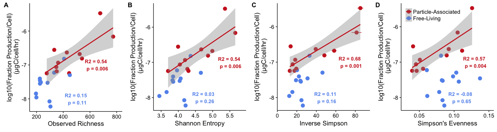


## Post-hoc analysis 

```r
# Are the fractions different from each other in predicting fraction production?
prod_fracprodpercell_values <- subset(otu_alphadiv, limnion == "Top" & year == "2015" & 
                          fraction == "WholePart" &
                          measure == "Richness") %>%
  dplyr::select(norep_filter_name, fracprod_per_cell_noinf) 

# Melt the data frame to be in long format
gather_prod_alpha <- as.data.frame(scale_prod_alphadiv) %>%   # Make scaled values a dataframe
  tibble::rownames_to_column(var = "norep_filter_name") %>%   # Add the rownames to keep samplenames
  gather(measure, mean, 2:5)                                  # Gather 4 columns and put values into 2
  
# Put it all together into one dataframe with 4 columns: sample_name, measure, mean, frac_bacprod 
prod_alpha_fracprod_percell <- inner_join(gather_prod_alpha, prod_fracprodpercell_values, by = "norep_filter_name") %>%
  mutate(measure = as.factor(measure)) %>%
  dplyr::filter(!is.na(fracprod_per_cell_noinf))
```

```
## Warning in inner_join_impl(x, y, by$x, by$y, suffix$x, suffix$y): joining character vector and factor, coercing into character vector
```

```r
# Double check values from above models
lm_percell_by_divmeasure <- lm(log10(fracprod_per_cell_noinf) ~ mean/measure, data = prod_alpha_fracprod_percell)
summary(lm_percell_by_divmeasure)
```

```
## 
## Call:
## lm(formula = log10(fracprod_per_cell_noinf) ~ mean/measure, data = prod_alpha_fracprod_percell)
## 
## Residuals:
##      Min       1Q   Median       3Q      Max 
## -0.59782 -0.21451 -0.07629  0.11273  0.85211 
## 
## Coefficients:
##                                Estimate Std. Error  t value Pr(>|t|)    
## (Intercept)                   -6.815885   0.058063 -117.388  < 2e-16 ***
## mean                           0.329669   0.081366    4.052 0.000235 ***
## mean:measureRichness          -0.011579   0.122503   -0.095 0.925180    
## mean:measureShannon_Entropy   -0.001707   0.121526   -0.014 0.988867    
## mean:measureSimpsons_Evenness -0.028143   0.123928   -0.227 0.821537    
## ---
## Signif. codes:  0 '***' 0.001 '**' 0.01 '*' 0.05 '.' 0.1 ' ' 1
## 
## Residual standard error: 0.3562 on 39 degrees of freedom
## Multiple R-squared:  0.5635,	Adjusted R-squared:  0.5187 
## F-statistic: 12.58 on 4 and 39 DF,  p-value: 1.146e-06
```

```r
# Run a post-hoc test
library(multcomp)
post_hoc_measure <- glht(lm_percell_by_divmeasure, linfct = mcp(measure = "Tukey", interaction_average=TRUE),
                vcov=vcovHC(lm_percell_by_divmeasure, type = "HC0"))
summary(post_hoc_measure)
```

```
## 
## 	 Simultaneous Tests for General Linear Hypotheses
## 
## Multiple Comparisons of Means: Tukey Contrasts
## 
## 
## Fit: lm(formula = log10(fracprod_per_cell_noinf) ~ mean/measure, data = prod_alpha_fracprod_percell)
## 
## Linear Hypotheses:
##                                           Estimate Std. Error t value Pr(>|t|)
## Richness - Inverse_Simpson == 0          -0.011579   0.131984  -0.088    1.000
## Shannon_Entropy - Inverse_Simpson == 0   -0.001707   0.125838  -0.014    1.000
## Simpsons_Evenness - Inverse_Simpson == 0 -0.028143   0.149061  -0.189    0.998
## Shannon_Entropy - Richness == 0           0.009872   0.147365   0.067    1.000
## Simpsons_Evenness - Richness == 0        -0.016564   0.172518  -0.096    1.000
## Simpsons_Evenness - Shannon_Entropy == 0 -0.026437   0.165521  -0.160    0.998
## (Adjusted p values reported -- single-step method)
```

```r
detach("package:multcomp", unload=TRUE) # This package masks the dplyr select function = :(
```


# Figure 2

```r
plot_grid(poster_rich1 + xlab("\n Fraction \n") + ylab("Observed Richness") + 
                theme(legend.position = "none", axis.text.y = element_blank()) +coord_flip() +
                annotate("text", x=1.5, y=700, fontface = "bold",  size = 4, color = "gray40",
                          label= paste("***\np =", round(rich_wilcox$p.value, digits = 3))), 
          poster_invsimps1 + xlab("\n Fraction \n") + ylab("Inverse Simpson") + 
                theme(legend.position = c(0.78, 0.90), 
                      axis.text.y = element_blank(), 
                      legend.title = element_blank()) +
                coord_flip() +
                annotate("text", x=1.5, y=78, fontface = "bold",  size = 4, color = "gray40",
                          label= paste("NS\np =", round(simpson_wilcox$p.value, digits = 2))), 
          otu_rich_vegan +  ylab("Heterotrophic Production \n(μgC/L/hr)") + 
                theme(legend.position = "none"), 
          otu_invsimps_vegan + ylab("Heterotrophic Production \n(μgC/L/hr)") +
                theme(legend.position = c(0.7, 0.80)), 
          rich_vs_fracprod_percell + theme(legend.position= "none"), 
          invsimps_vs_fracprod_percell + theme(legend.position= "none"), 
          labels = c("A", "B", "C", "D", "E", "F"),
          ncol = 2, nrow = 3)
```

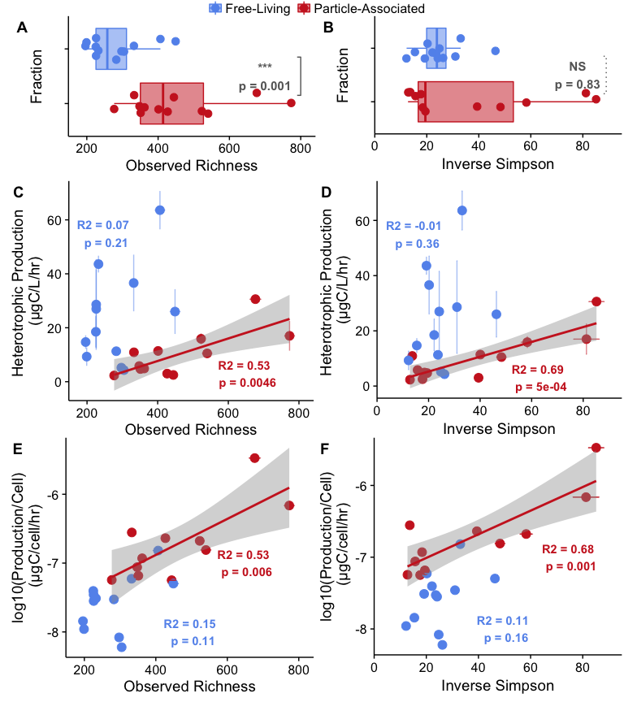


```r
plot_grid(poster_shannon1 + xlab("\n Fraction  \n") + ylab("Shannon Entropy") + 
                theme(legend.position = c(0.78, 0.90), axis.text.y = element_blank()) +
                coord_flip() +
                annotate("text", x=1.5, y=5.45, fontface = "bold",  size = 4, color = "gray40",
                          label= paste("**\np =", round(shannon_wilcox$p.value, digits = 3))),  
          poster_simpseven1 + xlab("\n Fraction \n") + ylab("Simpson's Evenness") + 
                theme(legend.position = "none", axis.text.y = element_blank()) +
                coord_flip() +
                annotate("text", x=1.5, y=0.135, fontface = "bold",  size = 4, color = "gray40",
                          label= paste("NS\np =", round(simpseven_wilcox$p.value, digits = 2))), 
          otu_shannon_vegan + ylab("Heterotrophic Production \n(μgC/L/hr)") + 
                theme(legend.position = c(0.7, 0.75)), 
          otu_simpseven_vegan + ylab("Heterotrophic Production \n(μgC/L/hr)") + 
                theme(legend.position = "none"), 
          shannon_vs_fracprod_percell + theme(legend.position= "none"), 
          simpseven_vs_fracprod_percell + theme(legend.position= "none"), 
          labels = c("A", "B", "C", "D", "E", "F"),
          ncol = 2, nrow = 3)
```

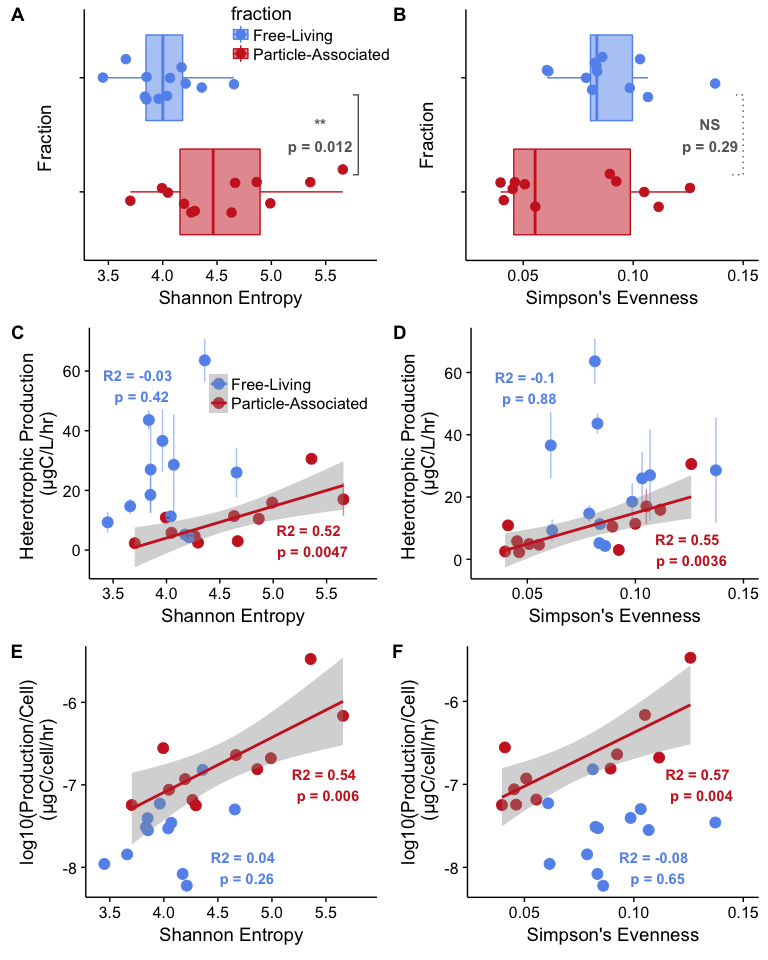


# Fraction Production Altogether

```r
#########################################################  RICHNESS 
# Free-Living Richness vs fractional production per cell 
total_prodpercell_rich <- lm(log10(fracprod_per_cell) ~ mean, data = filter(filter(ML_otu_rich_stats, fracprod_per_cell != Inf)))
summary(total_prodpercell_rich)
```

```
## 
## Call:
## lm(formula = log10(fracprod_per_cell) ~ mean, data = filter(filter(ML_otu_rich_stats, 
##     fracprod_per_cell != Inf)))
## 
## Residuals:
##      Min       1Q   Median       3Q      Max 
## -0.84389 -0.22579  0.05731  0.22144  0.72776 
## 
## Coefficients:
##               Estimate Std. Error t value Pr(>|t|)    
## (Intercept) -8.4022210  0.2145944 -39.154  < 2e-16 ***
## mean         0.0033643  0.0005434   6.191 3.84e-06 ***
## ---
## Signif. codes:  0 '***' 0.001 '**' 0.01 '*' 0.05 '.' 0.1 ' ' 1
## 
## Residual standard error: 0.3826 on 21 degrees of freedom
## Multiple R-squared:  0.646,	Adjusted R-squared:  0.6292 
## F-statistic: 38.33 on 1 and 21 DF,  p-value: 3.844e-06
```

```r
anova(partprod_percell_MLotu_rich, total_prodpercell_rich)
```

```
## Error in anova.lmlist(object, ...): models were not all fitted to the same size of dataset
```

```r
# Plot 
combined_richness <- ggplot(filter(ML_otu_rich_stats, fracprod_per_cell != Inf), aes(x=mean, y=log10(fracprod_per_cell))) + 
  geom_point(size = 3.5) + geom_errorbarh(aes(xmin = mean - sd, xmax = mean + sd)) + 
  ylab("log10(Production/Cell)\n (μgC/cell/hr)") + 
  xlab("Observed Richness") +
  geom_smooth(data= ML_otu_rich_stats, method='lm', color = "black") + 
  theme(legend.position=c(0.2,0.9),        
        legend.title=element_blank()) +
  annotate("text", x = 500, y=-8, color = "black", fontface = "bold",
           label = paste("R2 =", round(summary(total_prodpercell_rich)$adj.r.squared, digits = 2), "\n", 
                         "p =", round(unname(summary(total_prodpercell_rich)$coefficients[,4][2]), digits = 6)))


#########################################################  SHANNON
total_prodpercell_shannon <- lm(log10(fracprod_per_cell) ~ mean, data = filter(filter(ML_otu_shannon_stats,fracprod_per_cell != Inf)))
summary(total_prodpercell_shannon)
```

```
## 
## Call:
## lm(formula = log10(fracprod_per_cell) ~ mean, data = filter(filter(ML_otu_shannon_stats, 
##     fracprod_per_cell != Inf)))
## 
## Residuals:
##      Min       1Q   Median       3Q      Max 
## -1.00531 -0.15315 -0.02546  0.23787  0.84866 
## 
## Coefficients:
##             Estimate Std. Error t value Pr(>|t|)    
## (Intercept) -10.8260     0.7229 -14.975 1.11e-12 ***
## mean          0.8570     0.1681   5.098 4.76e-05 ***
## ---
## Signif. codes:  0 '***' 0.001 '**' 0.01 '*' 0.05 '.' 0.1 ' ' 1
## 
## Residual standard error: 0.4299 on 21 degrees of freedom
## Multiple R-squared:  0.5531,	Adjusted R-squared:  0.5318 
## F-statistic: 25.99 on 1 and 21 DF,  p-value: 4.756e-05
```

```r
# Plot 
combined_shannon <- ggplot(filter(ML_otu_shannon_stats, fracprod_per_cell != Inf),
       aes(x=mean, y=log10(fracprod_per_cell))) + 
  geom_point(size = 3.5) + geom_errorbarh(aes(xmin = mean - sd, xmax = mean + sd)) + 
  ylab("log10(Production/Cell)\n (μgC/cell/hr)") + 
  xlab("Shannon Entropy") +
  geom_smooth(data= ML_otu_shannon_stats, method='lm', color = "black") + 
  theme(legend.position=c(0.2,0.9),        
        legend.title=element_blank()) +
  annotate("text", x = 4.75, y=-8, color = "black", fontface = "bold",
           label = paste("R2 =", round(summary(total_prodpercell_shannon)$adj.r.squared, digits = 2), "\n", 
                         "p =", round(unname(summary(total_prodpercell_shannon)$coefficients[,4][2]), digits = 6)));


#########################################################  INVERSE SIMPSON 
total_prodpercell_simpson <- lm(log10(fracprod_per_cell)  ~ mean, data = filter(ML_otu_invsimps_stats, fracprod_per_cell != Inf))
summary(total_prodpercell_simpson)
```

```
## 
## Call:
## lm(formula = log10(fracprod_per_cell) ~ mean, data = filter(ML_otu_invsimps_stats, 
##     fracprod_per_cell != Inf))
## 
## Residuals:
##      Min       1Q   Median       3Q      Max 
## -0.95272 -0.26613 -0.04815  0.30875  0.98582 
## 
## Coefficients:
##              Estimate Std. Error t value Pr(>|t|)    
## (Intercept) -7.837153   0.173640 -45.135  < 2e-16 ***
## mean         0.021699   0.004725   4.592 0.000158 ***
## ---
## Signif. codes:  0 '***' 0.001 '**' 0.01 '*' 0.05 '.' 0.1 ' ' 1
## 
## Residual standard error: 0.4543 on 21 degrees of freedom
## Multiple R-squared:  0.501,	Adjusted R-squared:  0.4773 
## F-statistic: 21.09 on 1 and 21 DF,  p-value: 0.0001579
```

```r
# Plot Simpson's Evenness
combined_invsimps <- ggplot(filter(ML_otu_invsimps_stats, fracprod_per_cell != Inf),
       aes(x=mean, y=log10(fracprod_per_cell))) + 
  geom_point(size = 3.5) + geom_errorbarh(aes(xmin = mean - sd, xmax = mean + sd)) + 
  scale_color_manual(values = c("firebrick3","cornflowerblue"), limits = c("WholePart", "WholeFree")) +
  scale_x_continuous(limits = c(0,100), expand = c(0,0)) + 
  ylab("log10(Production/Cell)\n (μgC/cell/hr)") + 
  xlab("Inverse Simpson") +
  geom_smooth(data = ML_otu_invsimps_stats, method='lm', color = "black") + 
  theme(legend.position=c(0.2,0.9),        
        legend.title=element_blank()) +
  annotate("text", x = 50, y=-8, color = "black", fontface = "bold",
           label = paste("R2 =", round(summary(total_prodpercell_simpson)$adj.r.squared, digits = 2), "\n", 
                         "p =", round(unname(summary(total_prodpercell_simpson)$coefficients[,4][2]), digits = 5))) 


#########################################################  SIMPSON'S EVENNESS
total_prodpercell_simpseven <- lm(log10(fracprod_per_cell) ~ mean, 
                                       data = filter(ML_otu_simpseven_stats, fracprod_per_cell != Inf))
summary(total_prodpercell_simpseven)
```

```
## 
## Call:
## lm(formula = log10(fracprod_per_cell) ~ mean, data = filter(ML_otu_simpseven_stats, 
##     fracprod_per_cell != Inf))
## 
## Residuals:
##     Min      1Q  Median      3Q     Max 
## -1.0740 -0.4307  0.0746  0.3555  1.5017 
## 
## Coefficients:
##             Estimate Std. Error t value Pr(>|t|)    
## (Intercept)  -7.5183     0.4197 -17.914 3.35e-14 ***
## mean          4.3077     4.9126   0.877     0.39    
## ---
## Signif. codes:  0 '***' 0.001 '**' 0.01 '*' 0.05 '.' 0.1 ' ' 1
## 
## Residual standard error: 0.6316 on 21 degrees of freedom
## Multiple R-squared:  0.03532,	Adjusted R-squared:  -0.01062 
## F-statistic: 0.7689 on 1 and 21 DF,  p-value: 0.3905
```

```r
# Plot Simpson's Evenness
combined_simpseven <- ggplot(filter(ML_otu_simpseven_stats, fracprod_per_cell != Inf),
       aes(x=mean, y=log10(fracprod_per_cell))) + 
  geom_point(size = 3.5) + geom_errorbarh(aes(xmin = mean - sd, xmax = mean + sd)) + 
  scale_x_continuous(limits = c(0.03,0.151), breaks = c(0.05, 0.1, 0.15))  +
  ylab("log10(Production/Cell)\n (μgC/cell/hr)") + 
  xlab("Simpson's Evenness") +
  geom_smooth(data = ML_otu_simpseven_stats, method='lm', color = "black") + 
  theme(legend.position=c(0.2,0.9),        
        legend.title=element_blank()) +
  annotate("text", x = 0.11, y=-8, color = "black", fontface = "bold",
           label = paste("R2 =", round(summary(total_prodpercell_simpseven)$adj.r.squared, digits = 2), "\n", 
                         "p =", round(unname(summary(total_prodpercell_simpseven)$coefficients[,4][2]), digits = 2)))


plot_grid(rich_vs_fracprod_percell + ylab("log10(Production/Cell)\n (μgC/cell/hr)") + theme(legend.position = "none"), 
          shannon_vs_fracprod_percell + ylab("log10(Production/Cell)\n (μgC/cell/hr)")+ theme(legend.position = "none"), 
          invsimps_vs_fracprod_percell + ylab("log10(Production/Cell)\n (μgC/cell/hr)")+ theme(legend.position = "none"), 
          simpseven_vs_fracprod_percell + ylab("log10(Production/Cell)\n (μgC/cell/hr)") +
                    theme(legend.position = c(0.35,0.9)), 
          combined_richness, combined_shannon, combined_invsimps,combined_simpseven, 
          labels = c("A", "B", "C", "D","E", "F", "G", "H"), 
          ncol = 4, nrow = 2)
```

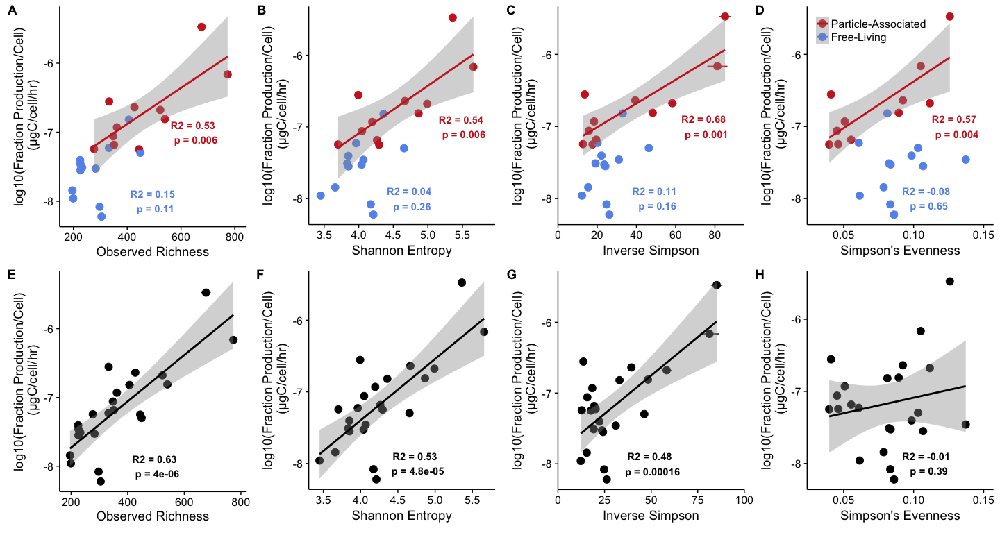


```r
plot_grid(combined_richness, combined_shannon, combined_invsimps,combined_simpseven, 
          labels = c("A", "B", "C", "D"), 
          ncol = 4, nrow = 1)
```

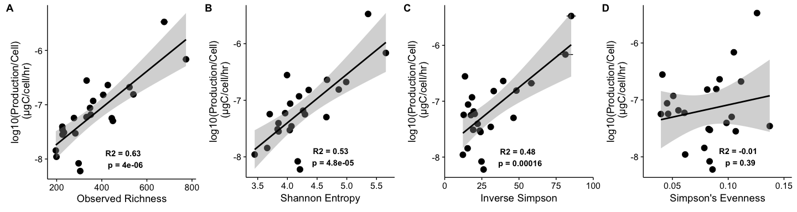


# Exponential Shannon

```r
#########################################################  EXPONENTIALSHANNON
# Free-Living EXPONENTIAL Shannon vs fractional production per cell 
freeprod_expshannon <- lm(frac_bacprod ~ exp(mean), data = filter(ML_otu_shannon_stats, fraction == "WholeFree"))
summary(freeprod_expshannon)
```

```
## 
## Call:
## lm(formula = frac_bacprod ~ exp(mean), data = filter(ML_otu_shannon_stats, 
##     fraction == "WholeFree"))
## 
## Residuals:
##     Min      1Q  Median      3Q     Max 
## -21.768 -10.068  -4.334   7.307  35.303 
## 
## Coefficients:
##             Estimate Std. Error t value Pr(>|t|)
## (Intercept)   11.966     16.671   0.718    0.489
## exp(mean)      0.209      0.274   0.763    0.463
## 
## Residual standard error: 17.87 on 10 degrees of freedom
## Multiple R-squared:  0.05499,	Adjusted R-squared:  -0.03951 
## F-statistic: 0.5819 on 1 and 10 DF,  p-value: 0.4632
```

```r
# Particle-Associated EXPONENTIAL Shannon vs fractional production per cell 
partprod_expshannon <- lm(frac_bacprod ~ exp(mean),
                                        data = filter(filter(ML_otu_shannon_stats, fraction == "WholePart" & fracprod_per_cell != Inf)))
summary(partprod_expshannon)
```

```
## 
## Call:
## lm(formula = frac_bacprod ~ exp(mean), data = filter(filter(ML_otu_shannon_stats, 
##     fraction == "WholePart" & fracprod_per_cell != Inf)))
## 
## Residuals:
##     Min      1Q  Median      3Q     Max 
## -7.6157 -2.7356 -0.9406  1.9685 12.3078 
## 
## Coefficients:
##             Estimate Std. Error t value Pr(>|t|)   
## (Intercept)  0.17313    3.30093   0.052  0.95932   
## exp(mean)    0.08531    0.02450   3.482  0.00692 **
## ---
## Signif. codes:  0 '***' 0.001 '**' 0.01 '*' 0.05 '.' 0.1 ' ' 1
## 
## Residual standard error: 5.94 on 9 degrees of freedom
## Multiple R-squared:  0.5739,	Adjusted R-squared:  0.5266 
## F-statistic: 12.12 on 1 and 9 DF,  p-value: 0.006921
```

```r
# Plot 
expshannon_fracprod <- ggplot(filter(ML_otu_shannon_stats, fracprod_per_cell != Inf),
       aes(x= exp(mean), y=frac_bacprod, color = fraction)) + 
  geom_point(size = 3.5) + #geom_errorbarh(aes(xmin = mean - sd, xmax = mean + sd)) + 
  scale_color_manual(values = c("firebrick3","cornflowerblue"), limits = c("WholePart", "WholeFree")) +
  ylab("Fraction Production (μgC/L/hr)") + 
  xlab("Exponential Shannon") +
  #scale_x_continuous(limits = c(3.4, 5.85), breaks = c(3.5, 4, 4.5, 5, 5.5)) + 
  geom_smooth(data=subset(ML_otu_shannon_stats, fraction == "WholePart"), method='lm') + 
  theme(legend.position=c(0.2,0.9),        
        legend.title=element_blank()) +
  annotate("text", x = 150, y=35, color = "cornflowerblue", fontface = "bold",
           label = paste("R2 =", round(summary(freeprod_expshannon)$adj.r.squared, digits = 2), "\n", 
                         "p =", round(unname(summary(freeprod_expshannon)$coefficients[,4][2]), digits = 2))) + 
  annotate("text", x = 200, y=7, color = "firebrick3", fontface = "bold",
           label = paste("R2 =", round(summary(partprod_expshannon)$adj.r.squared, digits = 2), "\n", 
                         "p =", round(unname(summary(partprod_expshannon)$coefficients[,4][2]), digits = 3)));


#########################################################  EXPONENTIALSHANNON
# Free-Living EXPONENTIAL Shannon vs fractional production per cell 
freeprod_percell_ML_otu_expshannon <- lm(log10(fracprod_per_cell) ~ exp(mean), data = filter(ML_otu_shannon_stats, fraction == "WholeFree"))
summary(freeprod_percell_ML_otu_expshannon)
```

```
## 
## Call:
## lm(formula = log10(fracprod_per_cell) ~ exp(mean), data = filter(ML_otu_shannon_stats, 
##     fraction == "WholeFree"))
## 
## Residuals:
##      Min       1Q   Median       3Q      Max 
## -0.71303 -0.15379  0.07661  0.16857  0.61752 
## 
## Coefficients:
##              Estimate Std. Error t value Pr(>|t|)    
## (Intercept) -7.972668   0.362560 -21.990 8.47e-10 ***
## exp(mean)    0.006872   0.005959   1.153    0.276    
## ---
## Signif. codes:  0 '***' 0.001 '**' 0.01 '*' 0.05 '.' 0.1 ' ' 1
## 
## Residual standard error: 0.3887 on 10 degrees of freedom
## Multiple R-squared:  0.1174,	Adjusted R-squared:  0.02914 
## F-statistic:  1.33 on 1 and 10 DF,  p-value: 0.2756
```

```r
# Particle-Associated EXPONENTIAL Shannon vs fractional production per cell 
partprod_percell_MLotu_expshannon <- lm(log10(fracprod_per_cell) ~ exp(mean), 
                                     data = filter(filter(ML_otu_shannon_stats, fraction == "WholePart" & fracprod_per_cell != Inf)))
summary(partprod_percell_MLotu_expshannon)
```

```
## 
## Call:
## lm(formula = log10(fracprod_per_cell) ~ exp(mean), data = filter(filter(ML_otu_shannon_stats, 
##     fraction == "WholePart" & fracprod_per_cell != Inf)))
## 
## Residuals:
##     Min      1Q  Median      3Q     Max 
## -0.3733 -0.2017 -0.1270  0.0861  0.7157 
## 
## Coefficients:
##              Estimate Std. Error t value Pr(>|t|)    
## (Intercept) -7.336642   0.196165 -37.400 3.46e-11 ***
## exp(mean)    0.005397   0.001456   3.707  0.00487 ** 
## ---
## Signif. codes:  0 '***' 0.001 '**' 0.01 '*' 0.05 '.' 0.1 ' ' 1
## 
## Residual standard error: 0.353 on 9 degrees of freedom
## Multiple R-squared:  0.6042,	Adjusted R-squared:  0.5603 
## F-statistic: 13.74 on 1 and 9 DF,  p-value: 0.004868
```

```r
# Plot 
expshannon_fracprod_percell <- ggplot(filter(ML_otu_shannon_stats, fracprod_per_cell != Inf),
       aes(x= exp(mean), y=log10(fracprod_per_cell), color = fraction)) + 
  geom_point(size = 3.5) + #geom_errorbarh(aes(xmin = mean - sd, xmax = mean + sd)) + 
  scale_color_manual(values = c("firebrick3","cornflowerblue"), limits = c("WholePart", "WholeFree")) +
  ylab("log10(Fraction Production/Cell)\n (μgC/cell/hr)") + 
  xlab("Exponential Shannon") +
  #scale_x_continuous(limits = c(3.4, 5.85), breaks = c(3.5, 4, 4.5, 5, 5.5)) + 
  geom_smooth(data=subset(ML_otu_shannon_stats, fraction == "WholePart"), method='lm') + 
  theme(legend.position=c(0.2,0.9),        
        legend.title=element_blank()) +
  annotate("text", x = 150, y=-8, color = "cornflowerblue", fontface = "bold",
           label = paste("R2 =", round(summary(freeprod_percell_ML_otu_expshannon)$adj.r.squared, digits = 2), "\n", 
                         "p =", round(unname(summary(freeprod_percell_ML_otu_expshannon)$coefficients[,4][2]), digits = 2))) + 
  annotate("text", x = 200, y=-7, color = "firebrick3", fontface = "bold",
           label = paste("R2 =", round(summary(partprod_percell_MLotu_expshannon)$adj.r.squared, digits = 2), "\n", 
                         "p =", round(unname(summary(partprod_percell_MLotu_expshannon)$coefficients[,4][2]), digits = 3)));


#########################################################  EXPONENTIALSHANNON
combined_expshannon_percell <- lm(log10(fracprod_per_cell) ~ exp(mean), data = filter(filter(ML_otu_shannon_stats, fracprod_per_cell != Inf)))
summary(combined_expshannon_percell)
```

```
## 
## Call:
## lm(formula = log10(fracprod_per_cell) ~ exp(mean), data = filter(filter(ML_otu_shannon_stats, 
##     fracprod_per_cell != Inf)))
## 
## Residuals:
##      Min       1Q   Median       3Q      Max 
## -0.92439 -0.21873  0.01255  0.28770  0.84382 
## 
## Coefficients:
##              Estimate Std. Error t value Pr(>|t|)    
## (Intercept) -7.813435   0.157891 -49.486  < 2e-16 ***
## exp(mean)    0.007645   0.001533   4.988 6.17e-05 ***
## ---
## Signif. codes:  0 '***' 0.001 '**' 0.01 '*' 0.05 '.' 0.1 ' ' 1
## 
## Residual standard error: 0.4351 on 21 degrees of freedom
## Multiple R-squared:  0.5423,	Adjusted R-squared:  0.5205 
## F-statistic: 24.88 on 1 and 21 DF,  p-value: 6.169e-05
```

```r
# Plot 
expshannon_combined <- ggplot(filter(ML_otu_shannon_stats, fracprod_per_cell != Inf),
       aes(x= exp(mean), y=log10(fracprod_per_cell))) + 
  geom_point(size = 3.5) + 
  ylab("log10(Fraction Production/Cell)\n (μgC/cell/hr)") + 
  xlab("Exponential Shannon") +
  #scale_x_continuous(limits = c(3.4, 5.85), breaks = c(3.5, 4, 4.5, 5, 5.5)) + 
  geom_smooth(data= ML_otu_shannon_stats, method='lm', color = "black") + 
  theme(legend.position=c(0.2,0.9),        
        legend.title=element_blank()) +
  annotate("text", x = 150, y=-8, color = "black", fontface = "bold",
           label = paste("R2 =", round(summary(combined_expshannon_percell)$adj.r.squared, digits = 2), "\n", 
                         "p =", round(unname(summary(combined_expshannon_percell)$coefficients[,4][2]), digits = 5))) 

plot_grid(expshannon_fracprod, expshannon_fracprod_percell, expshannon_combined,
          labels = c("A", "B", "C"), ncol = 3)
```

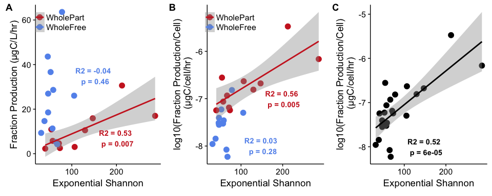


# Phylogenetic Community Structure 

# Faiths PD

```r
# Create the metadata frame 
nosed_meta_data <- nosed_meta_data %>%
  mutate(fraction_bac_abund = as.numeric(fraction_bac_abund),
         fracprod_per_cell = frac_bacprod/(1000*fraction_bac_abund),
         fracprod_per_cell_noinf = ifelse(fracprod_per_cell == Inf, NA, fracprod_per_cell))


## Calculate Faith's PD and species richness for sample 
#faiths_pd_RAREFIED <- pd(relabund_otu_RAREFIED, tree_RAREFIED_rm10, include.root = FALSE)
#faiths_pd_RAREFIED$norep_filter_name <- row.names(faiths_pd_RAREFIED)
  
#write.csv(faiths_pd_RAREFIED, file = "PrunedTree/mpd_mntd/faithsPD_rarefy_rm10.csv", row.names = FALSE)
faiths_pd_RAREFIED_rm10 <- read.csv("PrunedTree/mpd_mntd/faithsPD_rarefy_rm10.csv", header = TRUE)

# Join Faith's PD with the rest of the metadata 
meta_data_PD <- left_join(faiths_pd_RAREFIED_rm10, nosed_meta_data, by = "norep_filter_name")
```

```
## Warning in left_join_impl(x, y, by$x, by$y, suffix$x, suffix$y): joining character vector and factor, coercing into character vector
```

```r
### Is there a correlation between species richness and faith's PD?
lm_PD_vs_SR <- lm(PD ~ SR, data = meta_data_PD)
ggplot(meta_data_PD, aes(y = PD, x = SR)) + 
  geom_point(size = 3) + ylab("Faith's Phylogenetic Diversity") + 
  xlab("Species richness") +
  geom_smooth(method = "lm") +
    annotate("text", x = 300, y=15, color = "black", fontface = "bold",
           label = paste("R2 =", round(summary(lm_PD_vs_SR)$adj.r.squared, digits = 2), "\n", 
                         "p =", round(unname(summary(lm_PD_vs_SR)$coefficients[,4][2]), digits = 35))) 
```

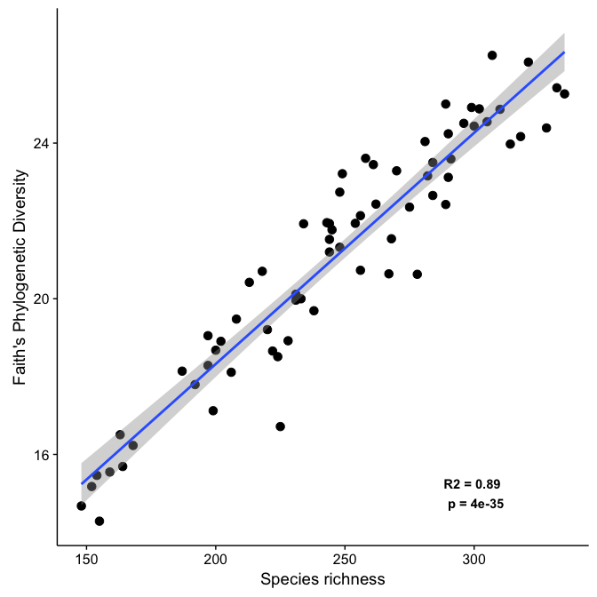


##Taxa.Labels

```r
### UNWEIGHTED
unweighted_sesMPD_taxalab <- read.csv("PrunedTree/mpd_mntd/unweighted_sesMPD_taxalab.csv", header = TRUE) %>%
  dplyr::rename(norep_filter_name = X) %>%
  left_join(nosed_meta_data, by = "norep_filter_name") %>%
  # Create discrete pvalues and reorder factors for fraction and lakesite
  mutate(pval = ifelse(mpd.obs.p > 0.9499, "high_pval",
                       ifelse(mpd.obs.p < 0.0511, "low_pval",
                              "insignificant")),
         fraction = factor(fraction, levels = c("WholePart", "Particle", "WholeFree", "Free")),
         lakesite = factor(lakesite, levels =c("MOT", "MDP", "MBR", "MIN")))
```

```
## Warning in left_join_impl(x, y, by$x, by$y, suffix$x, suffix$y): joining character vector and factor, coercing into character vector
```

```r
### WEIGHTED
WEIGHTED_sesMPD_taxalab <- read.csv("PrunedTree/mpd_mntd/weighted_sesMPD_taxalab.csv", header = TRUE) %>%
  dplyr::rename(norep_filter_name = X) %>%
  left_join(nosed_meta_data, by = "norep_filter_name") %>%
  # Create discrete pvalues and reorder factors for fraction and lakesite
  mutate(pval = ifelse(mpd.obs.p > 0.9499, "high_pval",
                       ifelse(mpd.obs.p < 0.0511, "low_pval",
                              "insignificant")),
         fraction = factor(fraction, levels = c("WholePart", "Particle", "WholeFree", "Free")),
         lakesite = factor(lakesite, levels =c("MOT", "MDP", "MBR", "MIN")))
```

```
## Warning in left_join_impl(x, y, by$x, by$y, suffix$x, suffix$y): joining character vector and factor, coercing into character vector
```

```r
p1 <- ggplot(unweighted_sesMPD_taxalab, 
             aes(x = lakesite, y = mpd.obs.z, color = pval, fill = fraction)) + 
  geom_point(size = 3, position = position_jitterdodge()) + 
  ggtitle("Unweighted MPD") +
  ylab("Mean Pairwise Distance \n (ses.mpd)") +
  geom_boxplot(alpha = 0.5, color = "black") +
  scale_color_manual(values = pd_colors) + 
  scale_fill_manual(values = fraction_colors) +
  facet_grid(.~fraction, scale = "free_x") +
  theme(axis.text.x = element_text(angle = 30, hjust = 1, vjust = 1))

p2 <- ggplot(WEIGHTED_sesMPD_taxalab, 
             aes(x = lakesite, y = mpd.obs.z, color = pval, fill = fraction)) + 
  geom_point(size = 3, position = position_jitterdodge()) + 
  ggtitle("Weighted MPD") +
  ylab("Mean Pairwise Distance \n (ses.mpd)") +
  geom_boxplot(alpha = 0.5, color = "black") +
  scale_color_manual(values = pd_colors) + 
  scale_fill_manual(values = fraction_colors) +
  facet_grid(.~fraction, scale = "free_x") +
  theme(axis.text.x = element_text(angle = 30, hjust = 1, vjust = 1))


### UNWEIGHTED
unweighted_sesMNTD_taxalab <- read.csv("PrunedTree/mpd_mntd/unweighted_sesMNTD_taxalab.csv", header = TRUE) %>%
  dplyr::rename(norep_filter_name = X) %>%
  left_join(nosed_meta_data, by = "norep_filter_name") %>%
  # Create discrete pvalues and reorder factors for fraction and lakesite
  mutate(pval = ifelse(mntd.obs.p > 0.9499, "high_pval",
                       ifelse(mntd.obs.p < 0.0511, "low_pval",
                              "insignificant")),
         fraction = factor(fraction, levels = c("WholePart", "Particle", "WholeFree", "Free")),
         lakesite = factor(lakesite, levels =c("MOT", "MDP", "MBR", "MIN")))
```

```
## Warning in left_join_impl(x, y, by$x, by$y, suffix$x, suffix$y): joining character vector and factor, coercing into character vector
```

```r
### WEIGHTED
WEIGHTED_sesMNTD_taxalab <- read.csv("PrunedTree/mpd_mntd/weighted_sesMNTD_taxalab.csv", header = TRUE) %>%
  dplyr::rename(norep_filter_name = X) %>%
  left_join(nosed_meta_data, by = "norep_filter_name") %>%
  # Create discrete pvalues and reorder factors for fraction and lakesite
  mutate(pval = ifelse(mntd.obs.p > 0.9499, "high_pval",
                       ifelse(mntd.obs.p < 0.0511, "low_pval",
                              "insignificant")),
         fraction = factor(fraction, levels = c("WholePart", "Particle", "WholeFree", "Free")),
         lakesite = factor(lakesite, levels =c("MOT", "MDP", "MBR", "MIN")))
```

```
## Warning in left_join_impl(x, y, by$x, by$y, suffix$x, suffix$y): joining character vector and factor, coercing into character vector
```

```r
p3 <- ggplot(unweighted_sesMNTD_taxalab, 
             aes(x = lakesite, y = mntd.obs.z, color = pval, fill = fraction)) + 
  geom_point(size = 3, position = position_jitterdodge()) + 
  ggtitle("Unweighted MNTD") +
  ylab("Mean Nearest Taxon Distance \n (ses.mntd)") +
  geom_boxplot(alpha = 0.5, color = "black") +
  scale_color_manual(values = pd_colors) + 
  scale_fill_manual(values = fraction_colors) +
  facet_grid(.~fraction, scale = "free_x") +
  theme(axis.text.x = element_text(angle = 30, hjust = 1, vjust = 1))

p4 <- ggplot(WEIGHTED_sesMNTD_taxalab, 
             aes(x = lakesite, y = mntd.obs.z, color = pval, fill = fraction)) + 
  geom_point(size = 3, position = position_jitterdodge()) + 
  ggtitle("Weighted MNTD") +
  ylab("Mean Nearest Taxon Distance \n (ses.mntd)") +
  geom_boxplot(alpha = 0.5, color = "black") +
  scale_color_manual(values = pd_colors) + 
  scale_fill_manual(values = fraction_colors) +
  facet_grid(.~fraction, scale = "free_x") +
  theme(axis.text.x = element_text(angle = 30, hjust = 1, vjust = 1))

# Put all of it together into one plot
plot_grid(p1, p2, p3, p4,
          labels = c("A", "B", "C", "D"), 
          ncol = 2, nrow = 2)
```

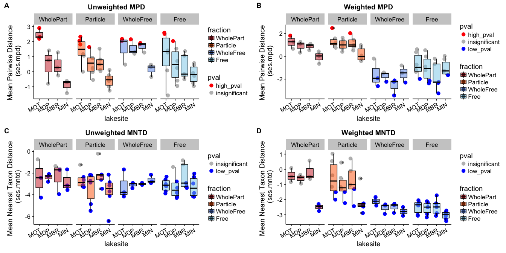


```r
##########  MPD ANALYSIS 
lmFL_unweightedMPD_taxalab <- lm(frac_bacprod ~ mpd.obs.z, 
                                      data = filter(unweighted_sesMPD_taxalab, fraction == "WholeFree"))
lmPA_unweightedMPD_taxalab <- lm(frac_bacprod ~ mpd.obs.z, 
                                      data = filter(unweighted_sesMPD_taxalab, fraction == "WholePart"))

unweightedMPD_vs_fracprod_taxlab <- ggplot(filter(unweighted_sesMPD_taxalab, fraction %in% c("WholePart", "WholeFree")), 
       aes(x = mpd.obs.z, y = frac_bacprod, color = fraction)) + 
  geom_point(size = 3) +
  xlab("Unweighted Mean Pairwise Distance \n (ses.mpd)") + 
  ylab("Heterotrophic Production \n(μgC/L/hr)") +
  ggtitle("Unweighted MPD: Taxa Labels") + 
  scale_color_manual(values = c("firebrick3", "cornflowerblue")) +
  geom_smooth(method = "lm") +
  theme(legend.position = c(0.2, 0.87), legend.title = element_blank()) +
    annotate("text", x = -0, y=-2, 
           color = "firebrick3", fontface = "bold",
           label = paste("R2 =", round(summary(lmPA_unweightedMPD_taxalab)$adj.r.squared, digits = 4), "\n", 
                         "p =", round(unname(summary(lmPA_unweightedMPD_taxalab)$coefficients[,4][2]), digits = 4))) +
  annotate("text", x = 2, y=60, 
         color = "cornflowerblue", fontface = "bold",
         label = paste("R2 =", round(summary(lmFL_unweightedMPD_taxalab)$adj.r.squared, digits = 4), "\n", 
                       "p =", round(unname(summary(lmFL_unweightedMPD_taxalab)$coefficients[,4][2]), digits = 4))) 


####### WEIGHTED MPD ANALYSIS
lmFL_weightedMPD_taxalab <- lm(frac_bacprod ~ mpd.obs.z, 
                                      data = filter(WEIGHTED_sesMPD_taxalab, fraction == "WholeFree"))
lmPA_weightedMPD_taxalab <- lm(frac_bacprod ~ mpd.obs.z, 
                                      data = filter(WEIGHTED_sesMPD_taxalab, fraction == "WholePart"))

weightedMPD_vs_fracprod_taxlab <- ggplot(filter(WEIGHTED_sesMPD_taxalab, fraction %in% c("WholePart", "WholeFree")), 
       aes(x = mpd.obs.z, y = frac_bacprod, color = fraction)) + 
  geom_point(size = 3) +
  xlab("Weighted Mean Pairwise Distance  \n (ses.mpd)") + 
  ylab("Heterotrophic Production \n(μgC/L/hr)") +
  ggtitle("Weighted MPD: Taxa Labels") + 
  scale_color_manual(values = c("firebrick3", "cornflowerblue")) +
  #geom_smooth(method = "lm", data = filter(WEIGHTED_sesMPD_taxalab, fraction == "WholePart")) +
  theme(legend.position = c(0.2, 0.87), legend.title = element_blank()) +
    annotate("text", x = 1, y=25, 
           color = "firebrick3", fontface = "bold",
           label = paste("R2 =", round(summary(lmPA_weightedMPD_taxalab)$adj.r.squared, digits = 4), "\n", 
                         "p =", round(unname(summary(lmPA_weightedMPD_taxalab)$coefficients[,4][2]), digits = 4))) +
  annotate("text", x = 0, y=45, 
         color = "cornflowerblue", fontface = "bold",
         label = paste("R2 =", round(summary(lmFL_weightedMPD_taxalab)$adj.r.squared, digits = 4), "\n", 
                       "p =", round(unname(summary(lmFL_weightedMPD_taxalab)$coefficients[,4][2]), digits = 4))) 


####### UNWEIGHTED MNTD ANALYSIS
lmFL_unweightedMNTD_taxalab <- lm(frac_bacprod ~ mntd.obs.z, 
                                      data = filter(unweighted_sesMNTD_taxalab, fraction == "WholeFree"))
lmPA_unweightedMNTD_taxalab <- lm(frac_bacprod ~ mntd.obs.z, 
                                      data = filter(unweighted_sesMNTD_taxalab, fraction == "WholePart"))

unweightedMNTD_vs_fracprod_taxlab <- ggplot(filter(unweighted_sesMNTD_taxalab, fraction %in% c("WholePart", "WholeFree")), 
       aes(x = mntd.obs.z, y = frac_bacprod, color = fraction)) + 
  geom_point(size = 3) +
  xlab("Unweighted Mean Nearest Taxon Distance  \n (ses.mntd)") + 
  ylab("Heterotrophic Production \n(μgC/L/hr)") +
  ggtitle("Unweighted MNTD: Taxa Labels") + 
  scale_color_manual(values = c("firebrick3", "cornflowerblue")) +
  geom_smooth(method = "lm", data = filter(unweighted_sesMNTD_taxalab, fraction == "WholePart")) +
  theme(legend.position = c(0.87, 0.87), legend.title = element_blank()) +
    annotate("text", x = -3.6, y=-2, 
           color = "firebrick3", fontface = "bold",
           label = paste("R2 =", round(summary(lmPA_unweightedMNTD_taxalab)$adj.r.squared, digits = 4), "\n", 
                         "p =", round(unname(summary(lmPA_unweightedMNTD_taxalab)$coefficients[,4][2]), digits = 4))) +
  annotate("text", x = -1.7, y=60, 
         color = "cornflowerblue", fontface = "bold",
         label = paste("R2 =", round(summary(lmFL_unweightedMNTD_taxalab)$adj.r.squared, digits = 4), "\n", 
                       "p =", round(unname(summary(lmFL_unweightedMNTD_taxalab)$coefficients[,4][2]), digits = 4))) 


####### WEIGHTED MPD ANALYSIS
lmFL_weightedMNTD_taxalab <- lm(frac_bacprod ~ mntd.obs.z, 
                                      data = filter(WEIGHTED_sesMNTD_taxalab, fraction == "WholeFree"))
lmPA_weightedMNTD_taxalab <- lm(frac_bacprod ~ mntd.obs.z, 
                                      data = filter(WEIGHTED_sesMNTD_taxalab, fraction == "WholePart"))

weightedMNTD_vs_fracprod_taxlab <- ggplot(filter(WEIGHTED_sesMNTD_taxalab, fraction %in% c("WholePart", "WholeFree")), 
       aes(x = mntd.obs.z, y = frac_bacprod, color = fraction)) + 
  geom_point(size = 3) +
  xlab("Weighted Mean Nearest Taxon Distance  \n (ses.mntd)") + 
  ylab("Heterotrophic Production \n(μgC/L/hr)") +
  ggtitle("Weighted MNTD: Taxa Labels") + 
  scale_color_manual(values = c("firebrick3", "cornflowerblue")) +
  #geom_smooth(method = "lm", data = filter(WEIGHTED_sesMNTD_taxalab, fraction == "WholePart")) +
  theme(legend.position = c(0.87, 0.87), legend.title = element_blank()) +
    annotate("text", x = -1.25, y=25, 
           color = "firebrick3", fontface = "bold",
           label = paste("R2 =", round(summary(lmPA_weightedMNTD_taxalab)$adj.r.squared, digits = 4), "\n", 
                         "p =", round(unname(summary(lmPA_weightedMNTD_taxalab)$coefficients[,4][2]), digits = 4))) +
  annotate("text", x = -1.25, y=45, 
         color = "cornflowerblue", fontface = "bold",
         label = paste("R2 =", round(summary(lmFL_weightedMNTD_taxalab)$adj.r.squared, digits = 4), "\n", 
                       "p =", round(unname(summary(lmFL_weightedMNTD_taxalab)$coefficients[,4][2]), digits = 4))) 

# Plot it altogether 
plot_grid(unweightedMPD_vs_fracprod_taxlab, unweightedMNTD_vs_fracprod_taxlab, 
          weightedMPD_vs_fracprod_taxlab, weightedMNTD_vs_fracprod_taxlab,
          labels = c("A", "B", "C", "D"), 
          ncol = 2, nrow = 2)
```

```
## Warning in grid.Call(L_stringMetric, as.graphicsAnnot(x$label)): conversion failure on '(μgC/L/hr)' in 'mbcsToSbcs': dot substituted for <ce>
```

```
## Warning in grid.Call(L_stringMetric, as.graphicsAnnot(x$label)): conversion failure on '(μgC/L/hr)' in 'mbcsToSbcs': dot substituted for <bc>
```

```
## Warning in grid.Call(L_stringMetric, as.graphicsAnnot(x$label)): conversion failure on '(μgC/L/hr)' in 'mbcsToSbcs': dot substituted for <ce>
```

```
## Warning in grid.Call(L_stringMetric, as.graphicsAnnot(x$label)): conversion failure on '(μgC/L/hr)' in 'mbcsToSbcs': dot substituted for <bc>
```

```
## Warning in grid.Call(L_stringMetric, as.graphicsAnnot(x$label)): conversion failure on '(μgC/L/hr)' in 'mbcsToSbcs': dot substituted for <ce>
```

```
## Warning in grid.Call(L_stringMetric, as.graphicsAnnot(x$label)): conversion failure on '(μgC/L/hr)' in 'mbcsToSbcs': dot substituted for <bc>
```

```
## Warning in grid.Call(L_stringMetric, as.graphicsAnnot(x$label)): conversion failure on '(μgC/L/hr)' in 'mbcsToSbcs': dot substituted for <ce>
```

```
## Warning in grid.Call(L_stringMetric, as.graphicsAnnot(x$label)): conversion failure on '(μgC/L/hr)' in 'mbcsToSbcs': dot substituted for <bc>
```

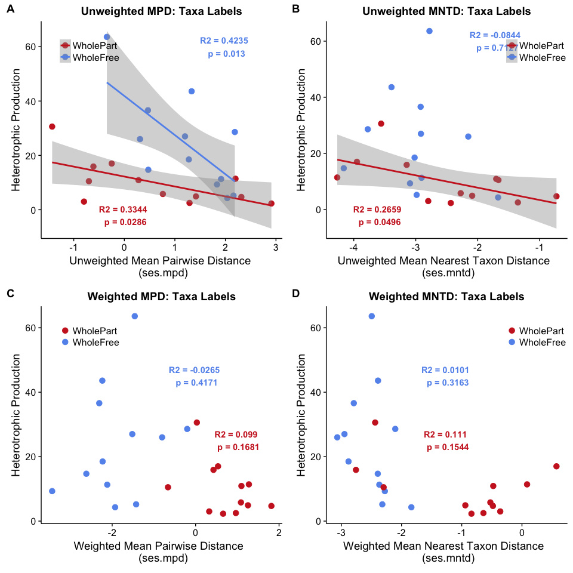


```r
unweight_MPD_wilcox <- wilcox.test(mpd.obs.z ~ fraction, 
             data = filter(unweighted_sesMPD_taxalab, fraction %in% c("WholePart", "WholeFree")))
unweight_MPD_wilcox
```

```
## 
## 	Wilcoxon rank sum test
## 
## data:  mpd.obs.z by fraction
## W = 55, p-value = 0.3474
## alternative hypothesis: true location shift is not equal to 0
```

```r
# Make a data frame to draw significance line in boxplot (visually calculated)
mpd_nums1 <- data.frame(a = c(1.15,1.15,1.85,1.85), b = c(3.2,3.3,3.3,3.2)) # WholePart vs WholeFree

taxlab_unweight_mpd <- ggplot(filter(unweighted_sesMPD_taxalab, fraction %in% c("WholePart", "WholeFree")), 
       aes(y = mpd.obs.z, x = fraction)) +
  geom_hline(yintercept = 0, linetype = "dashed", size = 1.5) +
  scale_fill_manual(values = fraction_colors, 
                    breaks=c("WholeFree", "WholePart"), 
                    labels=c("Free-Living", "Particle-Associated")) +
  scale_color_manual(values = fraction_colors,
                 breaks=c("WholeFree", "WholePart"), 
                 labels=c("Free-Living", "Particle-Associated")) + 
  scale_x_discrete(breaks=c("WholeFree", "WholePart"), 
                 labels=c("Free\nLiving", "Particle\nAssociated")) + 
  geom_point(size = 3, position = position_jitterdodge(), aes(color = fraction, fill = fraction)) + 
  geom_boxplot(alpha = 0.5, outlier.shape = NA, aes(color = fraction, fill = fraction)) +
  ylab("Unweighted Mean Pairwise Dist") +
  xlab("") +
  geom_path(data = mpd_nums1, aes(x = a, y = b), linetype = 1, color = "gray40") +
  scale_y_continuous(limits = c(-1.5, 3.5), breaks = c(-1, 0, 1, 2, 3, 4)) +
  theme(legend.position = "none")


weight_MPD_wilcox <- wilcox.test(mpd.obs.z ~ fraction, 
             data = filter(WEIGHTED_sesMPD_taxalab, fraction %in% c("WholePart", "WholeFree")))
weight_MPD_wilcox
```

```
## 
## 	Wilcoxon rank sum test
## 
## data:  mpd.obs.z by fraction
## W = 143, p-value = 1.479e-06
## alternative hypothesis: true location shift is not equal to 0
```

```r
filter(WEIGHTED_sesMPD_taxalab, fraction %in% c("WholePart", "WholeFree")) %>%
  group_by(fraction) %>%
  summarize(mean(mpd.obs.z),  median(mpd.obs.z), sd(mpd.obs.z))
```

```
## # A tibble: 2 × 4
##    fraction `mean(mpd.obs.z)` `median(mpd.obs.z)` `sd(mpd.obs.z)`
##      <fctr>             <dbl>               <dbl>           <dbl>
## 1 WholePart         0.7346088           0.8119896       0.6603078
## 2 WholeFree        -1.8572351          -2.0238057       0.8503843
```

```r
# Make a data frame to draw significance line in boxplot (visually calculated)
mpd_nums2 <- data.frame(a = c(1.15,1.15,1.85,1.85), b = c(2.2,2.3,2.3,2.2)) # WholePart vs WholeFree

taxlab_weight_mpd <- ggplot(filter(WEIGHTED_sesMPD_taxalab, fraction %in% c("WholePart", "WholeFree")), 
       aes(y = mpd.obs.z, x = fraction)) +
  geom_hline(yintercept = 0, slope = 0, linetype = "dashed", size = 1.5) +
  scale_fill_manual(values = fraction_colors, 
                    breaks=c("WholeFree", "WholePart"), 
                    labels=c("Free-Living", "Particle-Associated")) +
  scale_color_manual(values = fraction_colors,
                 breaks=c("WholeFree", "WholePart"), 
                 labels=c("Free-Living", "Particle-Associated")) + 
  scale_x_discrete(breaks=c("WholeFree", "WholePart"), 
                 labels=c("Free\nLiving", "Particle\nAssociated")) + 
  geom_point(size = 3, position = position_jitterdodge(), aes(color = fraction, fill = fraction)) + 
  geom_boxplot(alpha = 0.5, outlier.shape = NA, aes(color = fraction, fill = fraction)) +
  xlab("") + 
  ylab("Weighted Mean Pairwise Dist") +
  geom_path(data = mpd_nums2, aes(x = a, y = b), linetype = 1, color = "gray40") +
  scale_y_continuous(limits = c(-3.5, 2.5), breaks = c(-3, -2, -1, 0, 1, 2, 3, 4)) +
  theme(legend.position = "none")
```

```
## Warning: Ignoring unknown parameters: slope
```

```r
########################################## MNTD
###### UNWEIGHTED MNTD 
unweight_MNTD_wilcox <- wilcox.test(mntd.obs.z ~ fraction, 
             data = filter(unweighted_sesMNTD_taxalab, fraction %in% c("WholePart", "WholeFree")))
unweight_MNTD_wilcox
```

```
## 
## 	Wilcoxon rank sum test
## 
## data:  mntd.obs.z by fraction
## W = 93, p-value = 0.2415
## alternative hypothesis: true location shift is not equal to 0
```

```r
# Make a data frame to draw significance line in boxplot (visually calculated)
mntd_nums1 <- data.frame(a = c(1.15,1.15,1.85,1.85), b = c(-0.5,-0.4,-0.4,-0.5)) # WholePart vs WholeFree

taxlab_unweight_mntd <- ggplot(filter(unweighted_sesMNTD_taxalab, fraction %in% c("WholePart", "WholeFree")), 
       aes(y = mntd.obs.z, x = fraction)) +  
  geom_hline(yintercept = 0, slope = 0, linetype = "dashed", size = 1.5) +
  scale_fill_manual(values = fraction_colors, 
                    breaks=c("WholeFree", "WholePart"), 
                    labels=c("Free-Living", "Particle-Associated")) +
  scale_color_manual(values = fraction_colors,
                 breaks=c("WholeFree", "WholePart"), 
                 labels=c("Free-Living", "Particle-Associated")) + 
  scale_x_discrete(breaks=c("WholeFree", "WholePart"), 
                 labels=c("Free\nLiving", "Particle\nAssociated")) + 
  geom_point(size = 3, position = position_jitterdodge(), aes(color = fraction, fill = fraction)) + 
  geom_boxplot(alpha = 0.5, outlier.shape = NA, aes(color = fraction, fill = fraction)) +
  xlab("") + 
  ylab("Unweighted Mean Nearest Taxon Dist") +
  geom_path(data = mntd_nums1, aes(x = a, y = b), linetype = 1, color = "gray40") +
  scale_y_continuous(limits = c(-4, 0), breaks = c(-4, -3, -2, -1, 0)) +
  theme(legend.position = "none")
```

```
## Warning: Ignoring unknown parameters: slope
```

```r
##### WEIGHTED MNTD
weight_MNTD_wilcox <- wilcox.test(mntd.obs.z ~ fraction, 
             data = filter(WEIGHTED_sesMNTD_taxalab, fraction %in% c("WholePart", "WholeFree")))
weight_MNTD_wilcox
```

```
## 
## 	Wilcoxon rank sum test
## 
## data:  mntd.obs.z by fraction
## W = 126, p-value = 0.001115
## alternative hypothesis: true location shift is not equal to 0
```

```r
filter(WEIGHTED_sesMNTD_taxalab, fraction %in% c("WholePart", "WholeFree")) %>%
  group_by(fraction) %>%
  summarize(mean(mntd.obs.z),  median(mntd.obs.z))
```

```
## # A tibble: 2 × 3
##    fraction `mean(mntd.obs.z)` `median(mntd.obs.z)`
##      <fctr>              <dbl>                <dbl>
## 1 WholePart         -0.9248482           -0.5823574
## 2 WholeFree         -2.4894664           -2.3925979
```

```r
# Make a data frame to draw significance line in boxplot (visually calculated)
mntd_nums2 <- data.frame(a = c(1.15,1.15,1.85,1.85), b = c(1,1.1,1.1,1)) # WholePart vs WholeFree

taxlab_weight_mntd <- ggplot(filter(WEIGHTED_sesMNTD_taxalab, fraction %in% c("WholePart", "WholeFree")), 
       aes(y = mntd.obs.z, x = fraction)) +
  geom_hline(yintercept = 0, slope = 0, linetype = "dashed", size = 1.5) +
  scale_fill_manual(values = fraction_colors, 
                    breaks=c("WholeFree", "WholePart"), 
                    labels=c("Free-Living", "Particle-Associated")) +
  scale_color_manual(values = fraction_colors,
                 breaks=c("WholeFree", "WholePart"), 
                 labels=c("Free-Living", "Particle-Associated")) + 
  scale_x_discrete(breaks=c("WholeFree", "WholePart"), 
                 labels=c("Free\nLiving", "Particle\nAssociated")) + 
  geom_point(size = 3, position = position_jitterdodge(), aes(color = fraction, fill = fraction)) + 
  geom_boxplot(alpha = 0.5, outlier.shape = NA, aes(color = fraction, fill = fraction)) +
  xlab("") + 
  ylab("Weighted Mean Nearest Taxon Dist") +
  geom_path(data = mntd_nums2, aes(x = a, y = b), linetype = 1, color = "gray40") +
  scale_y_continuous(limits = c(-3.25, 1.25), breaks = c(-3, -2, -1, 0, 1)) +
  theme(legend.position = "none")
```

```
## Warning: Ignoring unknown parameters: slope
```

```r
plot_grid(taxlab_unweight_mpd + ylim(-4.5, 3.5) +
            annotate("text", x=1.55, y=max(mpd_nums1$b), fontface = "bold",  size = 3.5, color = "gray40",
                       label= paste("NS\np =", round(unweight_MPD_wilcox$p.value, digits = 2))), 
          taxlab_unweight_mntd + ylim(-4.5, 3.5) +
            annotate("text", x=1.55, y=max(mntd_nums1$b), fontface = "bold",  size = 3.5, color = "gray40",
                       label= paste("NS\np =", round(unweight_MNTD_wilcox$p.value, digits = 2))), 
          taxlab_weight_mpd + ylim(-4.5, 3.5) +
            annotate("text", x=1.55, y=max(mpd_nums2$b), fontface = "bold",  size = 3.5, color = "gray40",
                       label= paste("***\np =", round(weight_MPD_wilcox$p.value, digits = 6))),
          taxlab_weight_mntd + ylim(-4.5, 3.5) +
            annotate("text", x=1.55, y=max(mntd_nums2$b), fontface = "bold",  size = 3.5, color = "gray40",
                       label= paste("***\np =", round(weight_MNTD_wilcox$p.value, digits = 3))),
          labels = c("A", "B", "C", "D"),
          ncol = 4)
```

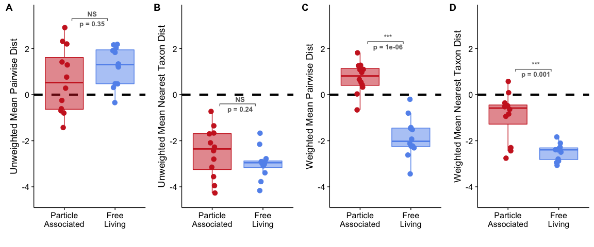


# Bulk Productivity
  
  
- Linear Models with **BULK** Productivity:  
      - Both PA and FL together:  
              - Unweighted MPD:  **NS**  
              - Weighted MPD: **NS** (R2 = 0.1061, p = 0.066)  
              - Unweighted MNTD:  **NS** (p = 0.089)  
              - Weighted MNTD: **Significant** (p = 0.01129, R2 = 0.2242)


```r
##########  MPD ANALYSIS 
# Free-Living Model
prod_lmFL_unweightedMPD_taxalab <- lm(frac_bacprod~ mpd.obs.z, 
                                      data = filter(unweighted_sesMPD_taxalab, fraction == "WholeFree"))
summary(prod_lmFL_unweightedMPD_taxalab)
```

```
## 
## Call:
## lm(formula = frac_bacprod ~ mpd.obs.z, data = filter(unweighted_sesMPD_taxalab, 
##     fraction == "WholeFree"))
## 
## Residuals:
##     Min      1Q  Median      3Q     Max 
## -20.349  -6.690  -3.998   5.997  20.900 
## 
## Coefficients:
##             Estimate Std. Error t value Pr(>|t|)    
## (Intercept)   41.880      7.053   5.938 0.000143 ***
## mpd.obs.z    -14.406      4.780  -3.014 0.013038 *  
## ---
## Signif. codes:  0 '***' 0.001 '**' 0.01 '*' 0.05 '.' 0.1 ' ' 1
## 
## Residual standard error: 13.31 on 10 degrees of freedom
## Multiple R-squared:  0.4759,	Adjusted R-squared:  0.4235 
## F-statistic: 9.082 on 1 and 10 DF,  p-value: 0.01304
```

```r
# Particle-associated model
prod_lmPA_unweightedMPD_taxalab <- lm(frac_bacprod~ mpd.obs.z, 
                                      data = filter(unweighted_sesMPD_taxalab, fraction == "WholePart"))
summary(prod_lmPA_unweightedMPD_taxalab)
```

```
## 
## Call:
## lm(formula = frac_bacprod ~ mpd.obs.z, data = filter(unweighted_sesMPD_taxalab, 
##     fraction == "WholePart"))
## 
## Residuals:
##      Min       1Q   Median       3Q      Max 
## -12.1297  -3.7843   0.2251   2.0581  13.1658 
## 
## Coefficients:
##             Estimate Std. Error t value Pr(>|t|)    
## (Intercept)   12.211      2.132   5.727 0.000191 ***
## mpd.obs.z     -3.659      1.432  -2.554 0.028643 *  
## ---
## Signif. codes:  0 '***' 0.001 '**' 0.01 '*' 0.05 '.' 0.1 ' ' 1
## 
## Residual standard error: 6.725 on 10 degrees of freedom
## Multiple R-squared:  0.3949,	Adjusted R-squared:  0.3344 
## F-statistic: 6.525 on 1 and 10 DF,  p-value: 0.02864
```

```r
# BOTH FRACRTIONS TOGETHER
prod_lmTOGET_unweightedMPD_taxalab <- lm(frac_bacprod~ mpd.obs.z, 
                                      data = filter(unweighted_sesMPD_taxalab, fraction %in% c("WholePart", "WholeFree")))
summary(prod_lmTOGET_unweightedMPD_taxalab)
```

```
## 
## Call:
## lm(formula = frac_bacprod ~ mpd.obs.z, data = filter(unweighted_sesMPD_taxalab, 
##     fraction %in% c("WholePart", "WholeFree")))
## 
## Residuals:
##     Min      1Q  Median      3Q     Max 
## -21.512  -8.136  -4.701   4.089  41.057 
## 
## Coefficients:
##             Estimate Std. Error t value Pr(>|t|)    
## (Intercept)   21.040      3.827   5.497  1.6e-05 ***
## mpd.obs.z     -4.352      2.583  -1.685    0.106    
## ---
## Signif. codes:  0 '***' 0.001 '**' 0.01 '*' 0.05 '.' 0.1 ' ' 1
## 
## Residual standard error: 14.64 on 22 degrees of freedom
## Multiple R-squared:  0.1143,	Adjusted R-squared:  0.07407 
## F-statistic:  2.84 on 1 and 22 DF,  p-value: 0.1061
```

```r
plot_unweightedMPD_prod <-   ggplot(filter(unweighted_sesMPD_taxalab, fraction %in% c("WholePart", "WholeFree")), 
       aes(x = mpd.obs.z, y =frac_bacprod, color = fraction)) + 
  geom_vline(xintercept = 0, linetype = "dashed", size = 1.5) + xlim(-4.5, 3.5) +
  geom_point(size = 3) +
  xlab("Unweighted Mean Pairwise Dist") + 
  ylab("Heterotrophic Production \n (μgC/L/hr)") + 
  scale_color_manual(values = c("firebrick3", "cornflowerblue")) +
  geom_smooth(method = "lm") +
  theme(legend.position = "none", legend.title = element_blank()) +
  annotate("text", x = -3, y=20, 
           color = "firebrick3", fontface = "bold",
           label = paste("R2 =", round(summary(prod_lmPA_unweightedMPD_taxalab)$adj.r.squared, digits = 2), "\n", 
                         "p =", round(unname(summary(prod_lmPA_unweightedMPD_taxalab)$coefficients[,4][2]), digits = 3))) +
  annotate("text", x = -3, y=60, 
         color = "cornflowerblue", fontface = "bold",
         label = paste("R2 =", round(summary(prod_lmFL_unweightedMPD_taxalab)$adj.r.squared, digits = 2), "\n", 
                       "p =", round(unname(summary(prod_lmFL_unweightedMPD_taxalab)$coefficients[,4][2]), digits = 3))) + 
  annotate("text", x = -3, y=-1, color = "black", fontface = "bold", label = paste("Combined = NS"))


############ WEIGHTED MPD
##########  MPD ANALYSIS 
# Free-Living Model
prod_lmFL_weightedMPD_taxalab <- lm(frac_bacprod~ mpd.obs.z, 
                                      data = filter(WEIGHTED_sesMPD_taxalab, fraction == "WholeFree"))
summary(prod_lmFL_weightedMPD_taxalab)
```

```
## 
## Call:
## lm(formula = frac_bacprod ~ mpd.obs.z, data = filter(WEIGHTED_sesMPD_taxalab, 
##     fraction == "WholeFree"))
## 
## Residuals:
##     Min      1Q  Median      3Q     Max 
## -21.159  -7.589  -3.981   4.588  37.417 
## 
## Coefficients:
##             Estimate Std. Error t value Pr(>|t|)  
## (Intercept)   33.958     12.771   2.659   0.0239 *
## mpd.obs.z      5.330      6.298   0.846   0.4171  
## ---
## Signif. codes:  0 '***' 0.001 '**' 0.01 '*' 0.05 '.' 0.1 ' ' 1
## 
## Residual standard error: 17.76 on 10 degrees of freedom
## Multiple R-squared:  0.06685,	Adjusted R-squared:  -0.02647 
## F-statistic: 0.7164 on 1 and 10 DF,  p-value: 0.4171
```

```r
# Particle-associated model
prod_lmPA_weightedMPD_taxalab <- lm(frac_bacprod~ mpd.obs.z, 
                                      data = filter(WEIGHTED_sesMPD_taxalab, fraction == "WholePart"))
summary(prod_lmPA_weightedMPD_taxalab)
```

```
## 
## Call:
## lm(formula = frac_bacprod ~ mpd.obs.z, data = filter(WEIGHTED_sesMPD_taxalab, 
##     fraction == "WholePart"))
## 
## Residuals:
##     Min      1Q  Median      3Q     Max 
## -9.1294 -6.3948 -0.9037  4.3160 16.8990 
## 
## Coefficients:
##             Estimate Std. Error t value Pr(>|t|)   
## (Intercept)   13.859      3.463   4.002  0.00251 **
## mpd.obs.z     -5.310      3.573  -1.486  0.16806   
## ---
## Signif. codes:  0 '***' 0.001 '**' 0.01 '*' 0.05 '.' 0.1 ' ' 1
## 
## Residual standard error: 7.824 on 10 degrees of freedom
## Multiple R-squared:  0.1809,	Adjusted R-squared:  0.09901 
## F-statistic: 2.209 on 1 and 10 DF,  p-value: 0.1681
```

```r
###  COMBINE BOTH PARTICLE AND FREE INTO ONE MODEL
prod_lmTOGET_weightedMPD_taxalab <- lm(frac_bacprod~ mpd.obs.z, 
                                      data = filter(WEIGHTED_sesMPD_taxalab, fraction %in% c("WholePart", "WholeFree")))
summary(prod_lmTOGET_weightedMPD_taxalab)
```

```
## 
## Call:
## lm(formula = frac_bacprod ~ mpd.obs.z, data = filter(WEIGHTED_sesMPD_taxalab, 
##     fraction %in% c("WholePart", "WholeFree")))
## 
## Residuals:
##     Min      1Q  Median      3Q     Max 
## -18.681 -10.080  -4.055   6.775  43.169 
## 
## Coefficients:
##             Estimate Std. Error t value Pr(>|t|)    
## (Intercept)   14.868      3.138   4.739 9.94e-05 ***
## mpd.obs.z     -3.814      1.974  -1.932   0.0664 .  
## ---
## Signif. codes:  0 '***' 0.001 '**' 0.01 '*' 0.05 '.' 0.1 ' ' 1
## 
## Residual standard error: 14.38 on 22 degrees of freedom
## Multiple R-squared:  0.145,	Adjusted R-squared:  0.1061 
## F-statistic: 3.731 on 1 and 22 DF,  p-value: 0.06638
```

```r
# Residual analysis of the UNWEIGHTED MPD Models: PARTICLE-ASSOCIATED
ALL_weight_sesMPD_df <- dplyr::filter(WEIGHTED_sesMPD_taxalab, 
                                      fraction %in% c("WholePart", "WholeFree") & !is.na(fracprod_per_cell_noinf))

plot_residuals(lm_model = prod_lmALL_weightedMPD_taxalab, 
               lm_observed_y = (ALL_weight_sesMPD_df$fracprod_per_cell_noinf),
               main_title = "Both Fractions Weighted MPD")
```

```
## Error in qqPlot(lm_model, col = "blue", reps = 10000, ylab = "Studentized residuals", : object 'prod_lmALL_weightedMPD_taxalab' not found
```

```r
plot_weightedMPD_prod_TOGETHER <- ggplot(filter(WEIGHTED_sesMPD_taxalab, fraction %in% c("WholePart", "WholeFree")), 
       aes(x = mpd.obs.z, y =frac_bacprod)) + 
  geom_vline(xintercept = 0, linetype = "dashed", size = 1.5) + xlim(-4.5, 3.5) +
  geom_point(size = 3,  aes(color = fraction)) +
  xlab("Weighted Mean Pairwise Dist") + 
  ylab("Heterotrophic Production \n (μgC/L/hr)") + 
  scale_color_manual(values = c("firebrick3", "cornflowerblue")) +
  geom_smooth(method = "lm", color = "black", linetype = "dashed") +
  theme(legend.position = "none") +
  annotate("text", x = -3, y=54, 
           color = "black", fontface = "bold",
           label = paste("R2 =", round(summary(prod_lmTOGET_weightedMPD_taxalab)$adj.r.squared, digits = 3), "\n", 
                         "p =", round(unname(summary(prod_lmTOGET_weightedMPD_taxalab)$coefficients[,4][2]), digits = 3))) +
  annotate("text", x = -3, y=-1, color = "#CCBB51", fontface = "bold", label = paste("Separate = NS"))


plot_weightedMPD_prod <- ggplot(filter(WEIGHTED_sesMPD_taxalab, fraction %in% c("WholePart", "WholeFree")), 
       aes(x = mpd.obs.z, y =frac_bacprod, color = fraction)) + 
  geom_vline(xintercept = 0, linetype = "dashed", size = 1.5) + xlim(-4.5, 3.5) +
  geom_point(size = 3) +
  xlab("Weighted Mean Pairwise Dist") + 
  ylab("Heterotrophic Production \n (μgC/L/hr)") + 
  scale_color_manual(values = c("firebrick3", "cornflowerblue")) +
  #geom_smooth(method = "lm") +
  theme(legend.position = "none", legend.title = element_blank()) #+
  #annotate("text", x = -2, y=-6.5, 
  #         color = "firebrick3", fontface = "bold",
  #         label = paste("R2 =", round(summary(prod_lmPA_weightedMPD_taxalab)$adj.r.squared, digits = 4), "\n", 
  #                       "p =", round(unname(summary(prod_lmPA_weightedMPD_taxalab)$coefficients[,4][2]), digits = 4))) +
  #annotate("text", x = 0, y=-8.2, 
  #       color = "cornflowerblue", fontface = "bold",
  #       label = paste("R2 =", round(summary(prod_lmFL_weightedMPD_taxalab)$adj.r.squared, digits = 4), "\n", 
  #                     "p =", round(unname(summary(prod_lmFL_weightedMPD_taxalab)$coefficients[,4][2]), digits = 4))) 


####### UNWEIGHTED MNTD ANALYSIS
# Free-living
prod_lmFL_unweightedMNTD_taxalab <- lm(frac_bacprod~ mntd.obs.z, 
                                      data = filter(unweighted_sesMNTD_taxalab, fraction == "WholeFree"))
summary(prod_lmFL_unweightedMNTD_taxalab)
```

```
## 
## Call:
## lm(formula = frac_bacprod ~ mntd.obs.z, data = filter(unweighted_sesMNTD_taxalab, 
##     fraction == "WholeFree"))
## 
## Residuals:
##     Min      1Q  Median      3Q     Max 
## -18.872 -13.636  -1.840   6.629  40.189 
## 
## Coefficients:
##             Estimate Std. Error t value Pr(>|t|)
## (Intercept)   14.507     25.752   0.563    0.586
## mntd.obs.z    -3.204      8.456  -0.379    0.713
## 
## Residual standard error: 18.26 on 10 degrees of freedom
## Multiple R-squared:  0.01416,	Adjusted R-squared:  -0.08443 
## F-statistic: 0.1436 on 1 and 10 DF,  p-value: 0.7127
```

```r
# Particle-associated
prod_lmPA_unweightedMNTD_taxalab <- lm(frac_bacprod~ mntd.obs.z, 
                                      data = filter(unweighted_sesMNTD_taxalab, fraction == "WholePart"))
summary(prod_lmPA_unweightedMNTD_taxalab)
```

```
## 
## Call:
## lm(formula = frac_bacprod ~ mntd.obs.z, data = filter(unweighted_sesMNTD_taxalab, 
##     fraction == "WholePart"))
## 
## Residuals:
##     Min      1Q  Median      3Q     Max 
## -8.2843 -4.0341 -0.8818  3.3650 15.9739 
## 
## Coefficients:
##             Estimate Std. Error t value Pr(>|t|)  
## (Intercept)   -1.022      5.324  -0.192   0.8516  
## mntd.obs.z    -4.397      1.969  -2.233   0.0496 *
## ---
## Signif. codes:  0 '***' 0.001 '**' 0.01 '*' 0.05 '.' 0.1 ' ' 1
## 
## Residual standard error: 7.063 on 10 degrees of freedom
## Multiple R-squared:  0.3327,	Adjusted R-squared:  0.2659 
## F-statistic: 4.985 on 1 and 10 DF,  p-value: 0.04962
```

```r
# TOGETHER
prod_lmTOGET_unweightedMNTD_taxalab <- lm(frac_bacprod~ mntd.obs.z, 
                                      data = filter(unweighted_sesMNTD_taxalab, fraction %in% c("WholePart", "WholeFree")))
summary(prod_lmTOGET_unweightedMNTD_taxalab)
```

```
## 
## Call:
## lm(formula = frac_bacprod ~ mntd.obs.z, data = filter(unweighted_sesMNTD_taxalab, 
##     fraction %in% c("WholePart", "WholeFree")))
## 
## Residuals:
##     Min      1Q  Median      3Q     Max 
## -14.681  -8.792  -4.899   6.265  46.355 
## 
## Coefficients:
##             Estimate Std. Error t value Pr(>|t|)  
## (Intercept)   0.7407     9.6265   0.077   0.9394  
## mntd.obs.z   -5.9391     3.3432  -1.776   0.0895 .
## ---
## Signif. codes:  0 '***' 0.001 '**' 0.01 '*' 0.05 '.' 0.1 ' ' 1
## 
## Residual standard error: 14.54 on 22 degrees of freedom
## Multiple R-squared:  0.1255,	Adjusted R-squared:  0.0857 
## F-statistic: 3.156 on 1 and 22 DF,  p-value: 0.08949
```

```r
plot_unweightedMNTD_prod <- ggplot(filter(unweighted_sesMNTD_taxalab, fraction %in% c("WholePart", "WholeFree")), 
       aes(x = mntd.obs.z, y = frac_bacprod, color = fraction)) + 
  geom_vline(xintercept = 0, linetype = "dashed", size = 1.5) + xlim(-4.5, 3.5) +
  geom_point(size = 3) +
  xlab("Unweighted Mean Nearest Taxon Dist") + 
  ylab("Heterotrophic Production \n (μgC/L/hr)") + 
  scale_color_manual(values = fraction_colors,
                 breaks=c("WholeFree", "WholePart"), 
                 labels=c("Free", "Particle")) + 
  geom_smooth(method = "lm", data = filter(unweighted_sesMNTD_taxalab, fraction == "WholePart")) +
  theme(legend.position = c(0.87, 0.87), 
        legend.title = element_blank()) +
  annotate("text", x = 1.5, y=10,
           color = "firebrick3", fontface = "bold",
           label = paste("R2 =", round(summary(prod_lmPA_unweightedMNTD_taxalab)$adj.r.squared, digits = 2), "\n", 
                         "p =", round(unname(summary(prod_lmPA_unweightedMNTD_taxalab)$coefficients[,4][2]), digits = 4))) #+
  #annotate("text", x = -2.4, y=-7.8, 
  #       color = "cornflowerblue", fontface = "bold",
  #       label = paste("R2 =", round(summary(prod_lmFL_unweightedMNTD_taxalab)$adj.r.squared, digits = 4), "\n", 
  #                     "p =", round(unname(summary(prod_lmFL_unweightedMNTD_taxalab)$coefficients[,4][2]), digits = 4))) 


####### WEIGHTED MPD ANALYSIS
# Free-living
prod_lmFL_weightedMNTD_taxalab <- lm(frac_bacprod~ mntd.obs.z, 
                                      data = filter(WEIGHTED_sesMNTD_taxalab, fraction == "WholeFree"))
summary(prod_lmFL_weightedMNTD_taxalab)
```

```
## 
## Call:
## lm(formula = frac_bacprod ~ mntd.obs.z, data = filter(WEIGHTED_sesMNTD_taxalab, 
##     fraction == "WholeFree"))
## 
## Residuals:
##     Min      1Q  Median      3Q     Max 
## -16.274 -11.065  -7.372   8.552  39.459 
## 
## Coefficients:
##             Estimate Std. Error t value Pr(>|t|)
## (Intercept)   -13.70      36.15  -0.379    0.713
## mntd.obs.z    -15.17      14.38  -1.055    0.316
## 
## Residual standard error: 17.44 on 10 degrees of freedom
## Multiple R-squared:  0.1001,	Adjusted R-squared:  0.01013 
## F-statistic: 1.113 on 1 and 10 DF,  p-value: 0.3163
```

```r
# Particle-associated
prod_lmPA_weightedMNTD_taxalab <- lm(frac_bacprod~ mntd.obs.z, 
                                      data = filter(WEIGHTED_sesMNTD_taxalab, fraction == "WholePart"))
summary(prod_lmPA_weightedMNTD_taxalab)
```

```
## 
## Call:
## lm(formula = frac_bacprod ~ mntd.obs.z, data = filter(WEIGHTED_sesMNTD_taxalab, 
##     fraction == "WholePart"))
## 
## Residuals:
##    Min     1Q Median     3Q    Max 
## -7.358 -5.019 -3.237  3.121 15.358 
## 
## Coefficients:
##             Estimate Std. Error t value Pr(>|t|)  
## (Intercept)    6.729      3.070   2.192   0.0532 .
## mntd.obs.z    -3.492      2.266  -1.541   0.1544  
## ---
## Signif. codes:  0 '***' 0.001 '**' 0.01 '*' 0.05 '.' 0.1 ' ' 1
## 
## Residual standard error: 7.772 on 10 degrees of freedom
## Multiple R-squared:  0.1918,	Adjusted R-squared:  0.111 
## F-statistic: 2.373 on 1 and 10 DF,  p-value: 0.1544
```

```r
###  COMBINE BOTH PARTICLE AND FREE INTO ONE MODEL
prod_lmTOGET_weightedMNTD_taxalab <- lm(frac_bacprod~ mntd.obs.z, 
                                      data = filter(WEIGHTED_sesMNTD_taxalab, fraction %in% c("WholePart", "WholeFree")))
summary(prod_lmTOGET_weightedMNTD_taxalab)  # p = 0.01129, R2 = 0.2242
```

```
## 
## Call:
## lm(formula = frac_bacprod ~ mntd.obs.z, data = filter(WEIGHTED_sesMNTD_taxalab, 
##     fraction %in% c("WholePart", "WholeFree")))
## 
## Residuals:
##     Min      1Q  Median      3Q     Max 
## -16.099  -8.506  -4.144   7.333  41.069 
## 
## Coefficients:
##             Estimate Std. Error t value Pr(>|t|)  
## (Intercept)    5.040      5.120   0.984   0.3357  
## mntd.obs.z    -7.011      2.536  -2.765   0.0113 *
## ---
## Signif. codes:  0 '***' 0.001 '**' 0.01 '*' 0.05 '.' 0.1 ' ' 1
## 
## Residual standard error: 13.4 on 22 degrees of freedom
## Multiple R-squared:  0.2579,	Adjusted R-squared:  0.2242 
## F-statistic: 7.646 on 1 and 22 DF,  p-value: 0.01129
```

```r
# Residual analysis of the UNWEIGHTED MPD Models: PARTICLE-ASSOCIATED
ALL_weight_sesMNTD_df <- dplyr::filter(WEIGHTED_sesMNTD_taxalab, 
                                      fraction %in% c("WholePart", "WholeFree") & !is.na(fracprod_per_cell_noinf))


plot_weightedMNTD_prod <- ggplot(filter(WEIGHTED_sesMNTD_taxalab, fraction %in% c("WholePart", "WholeFree")), 
       aes(x = mntd.obs.z, y = frac_bacprod)) + 
  geom_vline(xintercept = 0, linetype = "dashed", size = 1.5) + xlim(-4.5, 3.5) +
  geom_point(size = 3, aes( color = fraction)) +
  xlab("Weighted Mean Nearest Taxon Dist") + 
  ylab("Heterotrophic Production \n (μgC/L/hr)") + 
  geom_smooth(method = "lm") + 
  scale_color_manual(values = c("firebrick3", "cornflowerblue")) +
  #geom_smooth(method = "lm", data = filter(WEIGHTED_sesMNTD_taxalab, fraction == "WholeFree")) +
  theme(legend.position = "none", legend.title = element_blank()) 
  #annotate("text", x = -2.5, y=-5.9,
  #         color = "firebrick3", fontface = "bold",
  #         label = paste("R2 =", round(summary(prod_lmPA_weightedMNTD_taxalab)$adj.r.squared, digits = 4), "\n", 
  #                       "p =", round(unname(summary(prod_lmPA_weightedMNTD_taxalab)$coefficients[,4][2]), digits = 4))) +
  #annotate("text", x = 1.5, y=50, 
  #       color = "cornflowerblue", fontface = "bold",
  #       label = paste("R2 =", round(summary(prod_lmFL_weightedMNTD_taxalab)$adj.r.squared, digits = 2), "\n", 
  #                     "p =", round(unname(summary(prod_lmFL_weightedMNTD_taxalab)$coefficients[,4][2]), digits = 4))) 


plot_grid(plot_unweightedMPD_prod, plot_unweightedMNTD_prod,
          plot_weightedMPD_prod, plot_weightedMNTD_prod,
  labels = c("A", "B", "C", "D"),
  nrow= 1, ncol = 4
)
```

```
## Warning in grid.Call(L_stringMetric, as.graphicsAnnot(x$label)): conversion failure on ' (μgC/L/hr)' in 'mbcsToSbcs': dot substituted for <ce>
```

```
## Warning in grid.Call(L_stringMetric, as.graphicsAnnot(x$label)): conversion failure on ' (μgC/L/hr)' in 'mbcsToSbcs': dot substituted for <bc>
```

```
## Warning in grid.Call(L_stringMetric, as.graphicsAnnot(x$label)): conversion failure on ' (μgC/L/hr)' in 'mbcsToSbcs': dot substituted for <ce>
```

```
## Warning in grid.Call(L_stringMetric, as.graphicsAnnot(x$label)): conversion failure on ' (μgC/L/hr)' in 'mbcsToSbcs': dot substituted for <bc>
```

```
## Warning in grid.Call(L_stringMetric, as.graphicsAnnot(x$label)): conversion failure on ' (μgC/L/hr)' in 'mbcsToSbcs': dot substituted for <ce>
```

```
## Warning in grid.Call(L_stringMetric, as.graphicsAnnot(x$label)): conversion failure on ' (μgC/L/hr)' in 'mbcsToSbcs': dot substituted for <bc>
```

```
## Warning in grid.Call(L_stringMetric, as.graphicsAnnot(x$label)): conversion failure on ' (μgC/L/hr)' in 'mbcsToSbcs': dot substituted for <ce>
```

```
## Warning in grid.Call(L_stringMetric, as.graphicsAnnot(x$label)): conversion failure on ' (μgC/L/hr)' in 'mbcsToSbcs': dot substituted for <bc>
```

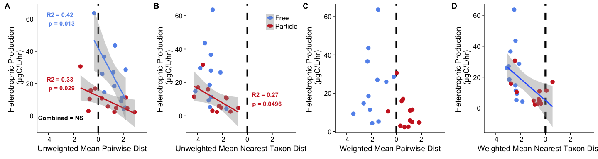


### Per-Cell Productivity

- Linear Models with **per cell** Productivity:  
      - Both PA and FL together:  
              - Unweighted MPD:  **Significant** (R2 = 0.5245, p = 5.631e-05)  
              - Weighted MPD: **Significant** (R2 = 0.2976, p = 0.004181)  
              - Unweighted MNTD:  **NS**  
              - Weighted MNTD: **NS**


```r
##########  MPD ANALYSIS 
# Free-Living Model
percell_lmFL_unweightedMPD_taxalab <- lm(log10(fracprod_per_cell_noinf) ~ mpd.obs.z, 
                                      data = filter(unweighted_sesMPD_taxalab, fraction == "WholeFree"))
summary(percell_lmFL_unweightedMPD_taxalab)
```

```
## 
## Call:
## lm(formula = log10(fracprod_per_cell_noinf) ~ mpd.obs.z, data = filter(unweighted_sesMPD_taxalab, 
##     fraction == "WholeFree"))
## 
## Residuals:
##      Min       1Q   Median       3Q      Max 
## -0.52158 -0.18889  0.05203  0.19575  0.43082 
## 
## Coefficients:
##             Estimate Std. Error t value Pr(>|t|)    
## (Intercept)  -7.1641     0.1551  -46.19 5.45e-13 ***
## mpd.obs.z    -0.3321     0.1051   -3.16   0.0102 *  
## ---
## Signif. codes:  0 '***' 0.001 '**' 0.01 '*' 0.05 '.' 0.1 ' ' 1
## 
## Residual standard error: 0.2927 on 10 degrees of freedom
## Multiple R-squared:  0.4996,	Adjusted R-squared:  0.4495 
## F-statistic: 9.983 on 1 and 10 DF,  p-value: 0.01017
```

```r
# Particle-associated model
percell_lmPA_unweightedMPD_taxalab <- lm(log10(fracprod_per_cell_noinf) ~ mpd.obs.z, 
                                      data = filter(unweighted_sesMPD_taxalab, fraction == "WholePart"))
summary(percell_lmPA_unweightedMPD_taxalab)
```

```
## 
## Call:
## lm(formula = log10(fracprod_per_cell_noinf) ~ mpd.obs.z, data = filter(unweighted_sesMPD_taxalab, 
##     fraction == "WholePart"))
## 
## Residuals:
##      Min       1Q   Median       3Q      Max 
## -0.43060 -0.27621  0.07526  0.15800  0.69006 
## 
## Coefficients:
##             Estimate Std. Error t value Pr(>|t|)    
## (Intercept) -6.58642    0.11425 -57.647 7.16e-13 ***
## mpd.obs.z   -0.29551    0.08124  -3.638  0.00542 ** 
## ---
## Signif. codes:  0 '***' 0.001 '**' 0.01 '*' 0.05 '.' 0.1 ' ' 1
## 
## Residual standard error: 0.357 on 9 degrees of freedom
##   (1 observation deleted due to missingness)
## Multiple R-squared:  0.5952,	Adjusted R-squared:  0.5502 
## F-statistic: 13.23 on 1 and 9 DF,  p-value: 0.005421
```

```r
anova(percell_lmFL_unweightedMPD_taxalab, percell_lmPA_unweightedMPD_taxalab)
```

```
## Error in anova.lmlist(object, ...): models were not all fitted to the same size of dataset
```

```r
# BOTH FRACTIONS TOGETHER 
percell_lmTOGET_unweightedMPD_taxalab <- lm(log10(fracprod_per_cell_noinf) ~ mpd.obs.z, 
                                      data = filter(unweighted_sesMPD_taxalab, fraction %in% c("WholeFree","WholePart")))
summary(percell_lmTOGET_unweightedMPD_taxalab)
```

```
## 
## Call:
## lm(formula = log10(fracprod_per_cell_noinf) ~ mpd.obs.z, data = filter(unweighted_sesMPD_taxalab, 
##     fraction %in% c("WholeFree", "WholePart")))
## 
## Residuals:
##      Min       1Q   Median       3Q      Max 
## -0.83100 -0.25664 -0.09356  0.30489  0.78689 
## 
## Coefficients:
##             Estimate Std. Error t value Pr(>|t|)    
## (Intercept) -6.82500    0.11332 -60.226  < 2e-16 ***
## mpd.obs.z   -0.39479    0.07854  -5.026 5.63e-05 ***
## ---
## Signif. codes:  0 '***' 0.001 '**' 0.01 '*' 0.05 '.' 0.1 ' ' 1
## 
## Residual standard error: 0.4333 on 21 degrees of freedom
##   (1 observation deleted due to missingness)
## Multiple R-squared:  0.5461,	Adjusted R-squared:  0.5245 
## F-statistic: 25.27 on 1 and 21 DF,  p-value: 5.631e-05
```

```r
plot_unweightedMPD_percell <- ggplot(filter(unweighted_sesMPD_taxalab, fraction %in% c("WholePart", "WholeFree")), 
       aes(x = mpd.obs.z, y =log10(fracprod_per_cell_noinf), color = fraction)) + 
  geom_vline(xintercept = 0, linetype = "dashed", size = 1.5) + xlim(-4.5, 3.5) +
  geom_point(size = 3) +
  xlab("Unweighted Mean Pairwise Dist") + 
  ylab("log10(Production/Cell)\n (μgC/cell/hr)") + 
  scale_color_manual(values = c("firebrick3", "cornflowerblue")) +
  geom_smooth(method = "lm") +
  theme(legend.position = "none", legend.title = element_blank()) +
  annotate("text", x = -3, y=-6, 
           color = "firebrick3", fontface = "bold",
           label = paste("R2 =", round(summary(percell_lmPA_unweightedMPD_taxalab)$adj.r.squared, digits = 2), "\n", 
                         "p =", round(unname(summary(percell_lmPA_unweightedMPD_taxalab)$coefficients[,4][2]), digits = 3))) +
  annotate("text", x = -3, y=-7, 
         color = "cornflowerblue", fontface = "bold",
         label = paste("R2 =", round(summary(percell_lmFL_unweightedMPD_taxalab)$adj.r.squared, digits = 2), "\n", 
                       "p =", round(unname(summary(percell_lmFL_unweightedMPD_taxalab)$coefficients[,4][2]), digits = 3))) +
    annotate("text", x = -2.8, y=-8, 
         color = "black", fontface = "bold",
         label = paste("Combined: R2 =", round(summary(percell_lmTOGET_unweightedMPD_taxalab)$adj.r.squared, digits = 2), "\n", 
                       "Combined: p =", round(unname(summary(percell_lmTOGET_unweightedMPD_taxalab)$coefficients[,4][2]), digits = 4)))


############ WEIGHTED MPD
##########  MPD ANALYSIS 
# Free-Living Model
percell_lmFL_weightedMPD_taxalab <- lm(log10(fracprod_per_cell_noinf) ~ mpd.obs.z, 
                                      data = filter(WEIGHTED_sesMPD_taxalab, fraction == "WholeFree"))
summary(percell_lmFL_weightedMPD_taxalab)
```

```
## 
## Call:
## lm(formula = log10(fracprod_per_cell_noinf) ~ mpd.obs.z, data = filter(WEIGHTED_sesMPD_taxalab, 
##     fraction == "WholeFree"))
## 
## Residuals:
##      Min       1Q   Median       3Q      Max 
## -0.63632 -0.15126  0.03025  0.14738  0.69793 
## 
## Coefficients:
##             Estimate Std. Error t value Pr(>|t|)    
## (Intercept)  -7.3003     0.2820 -25.889  1.7e-10 ***
## mpd.obs.z     0.1479     0.1391   1.064    0.312    
## ---
## Signif. codes:  0 '***' 0.001 '**' 0.01 '*' 0.05 '.' 0.1 ' ' 1
## 
## Residual standard error: 0.3922 on 10 degrees of freedom
## Multiple R-squared:  0.1017,	Adjusted R-squared:  0.01185 
## F-statistic: 1.132 on 1 and 10 DF,  p-value: 0.3124
```

```r
# Particle-associated model
percell_lmPA_weightedMPD_taxalab <- lm(log10(fracprod_per_cell_noinf) ~ mpd.obs.z, 
                                      data = filter(WEIGHTED_sesMPD_taxalab, fraction == "WholePart"))
summary(percell_lmPA_weightedMPD_taxalab)
```

```
## 
## Call:
## lm(formula = log10(fracprod_per_cell_noinf) ~ mpd.obs.z, data = filter(WEIGHTED_sesMPD_taxalab, 
##     fraction == "WholePart"))
## 
## Residuals:
##      Min       1Q   Median       3Q      Max 
## -0.58497 -0.30162 -0.04586  0.16599  1.00761 
## 
## Coefficients:
##             Estimate Std. Error t value Pr(>|t|)    
## (Intercept)  -6.4710     0.2195 -29.475 2.91e-10 ***
## mpd.obs.z    -0.3718     0.2345  -1.585    0.147    
## ---
## Signif. codes:  0 '***' 0.001 '**' 0.01 '*' 0.05 '.' 0.1 ' ' 1
## 
## Residual standard error: 0.4961 on 9 degrees of freedom
##   (1 observation deleted due to missingness)
## Multiple R-squared:  0.2183,	Adjusted R-squared:  0.1314 
## F-statistic: 2.513 on 1 and 9 DF,  p-value: 0.1474
```

```r
###  COMBINE BOTH PARTICLE AND FREE INTO ONE MODEL
percell_lmTOGET_weightedMPD_taxalab <- lm(log10(fracprod_per_cell_noinf) ~ mpd.obs.z, 
                                      data = filter(WEIGHTED_sesMPD_taxalab, fraction %in% c("WholePart", "WholeFree")))
summary(percell_lmTOGET_weightedMPD_taxalab)
```

```
## 
## Call:
## lm(formula = log10(fracprod_per_cell_noinf) ~ mpd.obs.z, data = filter(WEIGHTED_sesMPD_taxalab, 
##     fraction %in% c("WholePart", "WholeFree")))
## 
## Residuals:
##      Min       1Q   Median       3Q      Max 
## -0.74355 -0.34699 -0.09008  0.26660  1.53312 
## 
## Coefficients:
##             Estimate Std. Error t value Pr(>|t|)    
## (Intercept) -7.01476    0.11983 -58.541  < 2e-16 ***
## mpd.obs.z    0.24036    0.07482   3.212  0.00418 ** 
## ---
## Signif. codes:  0 '***' 0.001 '**' 0.01 '*' 0.05 '.' 0.1 ' ' 1
## 
## Residual standard error: 0.5266 on 21 degrees of freedom
##   (1 observation deleted due to missingness)
## Multiple R-squared:  0.3295,	Adjusted R-squared:  0.2976 
## F-statistic: 10.32 on 1 and 21 DF,  p-value: 0.004181
```

```r
# Residual analysis of the UNWEIGHTED MPD Models: PARTICLE-ASSOCIATED
ALL_weight_sesMPD_df <- dplyr::filter(WEIGHTED_sesMPD_taxalab, 
                                      fraction %in% c("WholePart", "WholeFree") & !is.na(fracprod_per_cell_noinf))

plot_residuals(lm_model = percell_lmTOGET_weightedMPD_taxalab, 
               lm_observed_y = log10(ALL_weight_sesMPD_df$fracprod_per_cell_noinf),
               main_title = "Both Fractions Weighted MPD")
```


```r
plot_weightedMPD_percell_TOGETHER <- ggplot(filter(WEIGHTED_sesMPD_taxalab, fraction %in% c("WholePart", "WholeFree")), 
       aes(x = mpd.obs.z, y =log10(fracprod_per_cell_noinf))) + 
  geom_vline(xintercept = 0, linetype = "dashed", size = 1.5) + xlim(-4.5, 3.5) +
  geom_point(size = 3,  aes(color = fraction)) +
  xlab("Weighted Mean Pairwise Dist") + 
  ylab("log10(Production/Cell)\n (μgC/cell/hr)") + 
  scale_color_manual(values = c("firebrick3", "cornflowerblue")) +
  geom_smooth(method = "lm", color = "black") +
  theme(legend.position = "none") +
  annotate("text", x = -3, y=-6, 
           color = "black", fontface = "bold",
           label = paste("R2 =", round(summary(percell_lmTOGET_weightedMPD_taxalab)$adj.r.squared, digits = 3), "\n", 
                         "p =", round(unname(summary(percell_lmTOGET_weightedMPD_taxalab)$coefficients[,4][2]), digits = 3)))+
  annotate("text", x = -3, y=-6.5, color = "#CCBB51", fontface = "bold", label = paste("Separate = NS"))


plot_weightedMPD_percell <- ggplot(filter(WEIGHTED_sesMPD_taxalab, fraction %in% c("WholePart", "WholeFree")), 
       aes(x = mpd.obs.z, y =log10(fracprod_per_cell_noinf), color = fraction)) + 
  geom_vline(xintercept = 0, linetype = "dashed", size = 1.5) + xlim(-4.5, 3.5) +
  geom_point(size = 3) +
  xlab("Weighted Mean Pairwise Dist") + 
  ylab("log10(Production/Cell)\n (μgC/cell/hr)") + 
  scale_color_manual(values = c("firebrick3", "cornflowerblue")) +
  #geom_smooth(method = "lm") +
  theme(legend.position = "none", legend.title = element_blank()) #+
  #annotate("text", x = -2, y=-6.5, 
  #         color = "firebrick3", fontface = "bold",
  #         label = paste("R2 =", round(summary(percell_lmPA_weightedMPD_taxalab)$adj.r.squared, digits = 4), "\n", 
  #                       "p =", round(unname(summary(percell_lmPA_weightedMPD_taxalab)$coefficients[,4][2]), digits = 4))) +
  #annotate("text", x = 0, y=-8.2, 
  #       color = "cornflowerblue", fontface = "bold",
  #       label = paste("R2 =", round(summary(percell_lmFL_weightedMPD_taxalab)$adj.r.squared, digits = 4), "\n", 
  #                     "p =", round(unname(summary(percell_lmFL_weightedMPD_taxalab)$coefficients[,4][2]), digits = 4))) 


####### UNWEIGHTED MNTD ANALYSIS
# Free-living
percell_lmFL_unweightedMNTD_taxalab <- lm(log10(fracprod_per_cell_noinf) ~ mntd.obs.z, 
                                      data = filter(unweighted_sesMNTD_taxalab, fraction == "WholeFree"))
summary(percell_lmFL_unweightedMNTD_taxalab)
```

```
## 
## Call:
## lm(formula = log10(fracprod_per_cell_noinf) ~ mntd.obs.z, data = filter(unweighted_sesMNTD_taxalab, 
##     fraction == "WholeFree"))
## 
## Residuals:
##      Min       1Q   Median       3Q      Max 
## -0.59039 -0.33655  0.04817  0.20512  0.76561 
## 
## Coefficients:
##             Estimate Std. Error t value Pr(>|t|)    
## (Intercept)  -7.7038     0.5822 -13.233 1.16e-07 ***
## mntd.obs.z   -0.0432     0.1912  -0.226    0.826    
## ---
## Signif. codes:  0 '***' 0.001 '**' 0.01 '*' 0.05 '.' 0.1 ' ' 1
## 
## Residual standard error: 0.4127 on 10 degrees of freedom
## Multiple R-squared:  0.00508,	Adjusted R-squared:  -0.09441 
## F-statistic: 0.05106 on 1 and 10 DF,  p-value: 0.8258
```

```r
# Particle-associated
percell_lmPA_unweightedMNTD_taxalab <- lm(log10(fracprod_per_cell_noinf) ~ mntd.obs.z, 
                                      data = filter(unweighted_sesMNTD_taxalab, fraction == "WholePart"))
summary(percell_lmPA_unweightedMNTD_taxalab)
```

```
## 
## Call:
## lm(formula = log10(fracprod_per_cell_noinf) ~ mntd.obs.z, data = filter(unweighted_sesMNTD_taxalab, 
##     fraction == "WholePart"))
## 
## Residuals:
##      Min       1Q   Median       3Q      Max 
## -0.55782 -0.20263 -0.09501  0.17955  0.76800 
## 
## Coefficients:
##             Estimate Std. Error t value Pr(>|t|)    
## (Intercept)  -7.6496     0.3176 -24.089 1.75e-09 ***
## mntd.obs.z   -0.3954     0.1263  -3.129   0.0121 *  
## ---
## Signif. codes:  0 '***' 0.001 '**' 0.01 '*' 0.05 '.' 0.1 ' ' 1
## 
## Residual standard error: 0.3883 on 9 degrees of freedom
##   (1 observation deleted due to missingness)
## Multiple R-squared:  0.5211,	Adjusted R-squared:  0.4679 
## F-statistic: 9.793 on 1 and 9 DF,  p-value: 0.01213
```

```r
# BOTH FRACTIONS TOGETHER
percell_lmTOGET_unweightedMNTD_taxalab <- lm(log10(fracprod_per_cell_noinf) ~ mntd.obs.z, 
                                      data = filter(unweighted_sesMNTD_taxalab, fraction %in% c("WholePart", "WholeFree")))
summary(percell_lmTOGET_unweightedMNTD_taxalab)
```

```
## 
## Call:
## lm(formula = log10(fracprod_per_cell_noinf) ~ mntd.obs.z, data = filter(unweighted_sesMNTD_taxalab, 
##     fraction %in% c("WholePart", "WholeFree")))
## 
## Residuals:
##      Min       1Q   Median       3Q      Max 
## -1.00487 -0.37368 -0.06439  0.37655  1.65170 
## 
## Coefficients:
##             Estimate Std. Error t value Pr(>|t|)    
## (Intercept) -7.29766    0.44300 -16.473 1.74e-13 ***
## mntd.obs.z  -0.04818    0.15801  -0.305    0.763    
## ---
## Signif. codes:  0 '***' 0.001 '**' 0.01 '*' 0.05 '.' 0.1 ' ' 1
## 
## Residual standard error: 0.6417 on 21 degrees of freedom
##   (1 observation deleted due to missingness)
## Multiple R-squared:  0.004408,	Adjusted R-squared:  -0.043 
## F-statistic: 0.09298 on 1 and 21 DF,  p-value: 0.7634
```

```r
plot_unweightedMNTD_percell <- ggplot(filter(unweighted_sesMNTD_taxalab, fraction %in% c("WholePart", "WholeFree")), 
       aes(x = mntd.obs.z, y = log10(fracprod_per_cell_noinf), color = fraction)) + 
  geom_vline(xintercept = 0, linetype = "dashed", size = 1.5) + xlim(-4.5, 3.5) +
  geom_point(size = 3) +
  xlab("Unweighted Mean Nearest Taxon Dist") + 
  ylab("log10(Production/Cell)\n (μgC/cell/hr)") + 
  scale_color_manual(values = fraction_colors,
                 breaks=c("WholeFree", "WholePart"), 
                 labels=c("Free", "Particle")) + 
  geom_smooth(method = "lm", data = filter(unweighted_sesMNTD_taxalab, fraction == "WholePart")) +
  theme(legend.position = c(0.87, 0.87), 
        legend.title = element_blank()) +
  annotate("text", x = 1.5, y=-7.2,
           color = "firebrick3", fontface = "bold",
           label = paste("R2 =", round(summary(percell_lmPA_unweightedMNTD_taxalab)$adj.r.squared, digits = 2), "\n", 
                         "p =", round(unname(summary(percell_lmPA_unweightedMNTD_taxalab)$coefficients[,4][2]), digits = 3))) #+
  #annotate("text", x = -2.4, y=-7.8, 
  #       color = "cornflowerblue", fontface = "bold",
  #       label = paste("R2 =", round(summary(percell_lmFL_unweightedMNTD_taxalab)$adj.r.squared, digits = 4), "\n", 
  #                     "p =", round(unname(summary(percell_lmFL_unweightedMNTD_taxalab)$coefficients[,4][2]), digits = 4))) 


####### WEIGHTED MPD ANALYSIS
# Free-living
percell_lmFL_weightedMNTD_taxalab <- lm(log10(fracprod_per_cell_noinf) ~ mntd.obs.z, 
                                      data = filter(WEIGHTED_sesMNTD_taxalab, fraction == "WholeFree"))
summary(percell_lmFL_weightedMNTD_taxalab)
```

```
## 
## Call:
## lm(formula = log10(fracprod_per_cell_noinf) ~ mntd.obs.z, data = filter(WEIGHTED_sesMNTD_taxalab, 
##     fraction == "WholeFree"))
## 
## Residuals:
##      Min       1Q   Median       3Q      Max 
## -0.39941 -0.24672 -0.07443  0.13326  0.75351 
## 
## Coefficients:
##             Estimate Std. Error t value Pr(>|t|)    
## (Intercept)  -9.1091     0.7040  -12.94 1.43e-07 ***
## mntd.obs.z   -0.6162     0.2800   -2.20   0.0524 .  
## ---
## Signif. codes:  0 '***' 0.001 '**' 0.01 '*' 0.05 '.' 0.1 ' ' 1
## 
## Residual standard error: 0.3396 on 10 degrees of freedom
## Multiple R-squared:  0.3262,	Adjusted R-squared:  0.2589 
## F-statistic: 4.842 on 1 and 10 DF,  p-value: 0.0524
```

```r
# Particle-associated
percell_lmPA_weightedMNTD_taxalab <- lm(log10(fracprod_per_cell_noinf) ~ mntd.obs.z, 
                                      data = filter(WEIGHTED_sesMNTD_taxalab, fraction == "WholePart"))
summary(percell_lmPA_weightedMNTD_taxalab)
```

```
## 
## Call:
## lm(formula = log10(fracprod_per_cell_noinf) ~ mntd.obs.z, data = filter(WEIGHTED_sesMNTD_taxalab, 
##     fraction == "WholePart"))
## 
## Residuals:
##     Min      1Q  Median      3Q     Max 
## -0.4951 -0.3268 -0.1941  0.2094  1.0611 
## 
## Coefficients:
##             Estimate Std. Error t value Pr(>|t|)    
## (Intercept)  -6.8618     0.2349 -29.207 3.15e-10 ***
## mntd.obs.z   -0.1338     0.1661  -0.806    0.441    
## ---
## Signif. codes:  0 '***' 0.001 '**' 0.01 '*' 0.05 '.' 0.1 ' ' 1
## 
## Residual standard error: 0.5419 on 9 degrees of freedom
##   (1 observation deleted due to missingness)
## Multiple R-squared:  0.06729,	Adjusted R-squared:  -0.03634 
## F-statistic: 0.6493 on 1 and 9 DF,  p-value: 0.4411
```

```r
###  COMBINE BOTH PARTICLE AND FREE INTO ONE MODEL
percell_lmTOGET_weightedMNTD_taxalab <- lm(log10(fracprod_per_cell_noinf) ~ mntd.obs.z, 
                                      data = filter(WEIGHTED_sesMNTD_taxalab, fraction %in% c("WholePart", "WholeFree")))
summary(percell_lmTOGET_weightedMNTD_taxalab)  # NOT SIGNIFICANT 
```

```
## 
## Call:
## lm(formula = log10(fracprod_per_cell_noinf) ~ mntd.obs.z, data = filter(WEIGHTED_sesMNTD_taxalab, 
##     fraction %in% c("WholePart", "WholeFree")))
## 
## Residuals:
##     Min      1Q  Median      3Q     Max 
## -1.0430 -0.2670 -0.1390  0.3029  1.8233 
## 
## Coefficients:
##             Estimate Std. Error t value Pr(>|t|)    
## (Intercept)  -6.8167     0.2525 -27.002   <2e-16 ***
## mntd.obs.z    0.1973     0.1224   1.612    0.122    
## ---
## Signif. codes:  0 '***' 0.001 '**' 0.01 '*' 0.05 '.' 0.1 ' ' 1
## 
## Residual standard error: 0.6066 on 21 degrees of freedom
##   (1 observation deleted due to missingness)
## Multiple R-squared:  0.1101,	Adjusted R-squared:  0.06773 
## F-statistic: 2.598 on 1 and 21 DF,  p-value: 0.1219
```

```r
# Residual analysis of the UNWEIGHTED MPD Models: PARTICLE-ASSOCIATED
ALL_weight_sesMNTD_df <- dplyr::filter(WEIGHTED_sesMNTD_taxalab, 
                                      fraction %in% c("WholePart", "WholeFree") & !is.na(fracprod_per_cell_noinf))


plot_weightedMNTD_percell <- ggplot(filter(WEIGHTED_sesMNTD_taxalab, fraction %in% c("WholePart", "WholeFree")), 
       aes(x = mntd.obs.z, y = log10(fracprod_per_cell_noinf), color = fraction)) + 
  geom_vline(xintercept = 0, linetype = "dashed", size = 1.5) + xlim(-4.5, 3.5) +
  geom_point(size = 3) +
  xlab("Weighted Mean Nearest Taxon Dist") + 
  ylab("log10(Production/Cell)\n (μgC/cell/hr)") + 
  scale_color_manual(values = c("firebrick3", "cornflowerblue")) +
  geom_smooth(method = "lm", data = filter(WEIGHTED_sesMNTD_taxalab, fraction == "WholeFree")) +
  theme(legend.position = "none", legend.title = element_blank()) +
  #annotate("text", x = -2.5, y=-5.9,
  #         color = "firebrick3", fontface = "bold",
  #         label = paste("R2 =", round(summary(percell_lmPA_weightedMNTD_taxalab)$adj.r.squared, digits = 4), "\n", 
  #                       "p =", round(unname(summary(percell_lmPA_weightedMNTD_taxalab)$coefficients[,4][2]), digits = 4))) +
  annotate("text", x = 1.5, y=-8, 
         color = "cornflowerblue", fontface = "bold",
         label = paste("R2 =", round(summary(percell_lmFL_weightedMNTD_taxalab)$adj.r.squared, digits = 2), "\n", 
                       "p =", round(unname(summary(percell_lmFL_weightedMNTD_taxalab)$coefficients[,4][2]), digits = 4))) 


plot_grid(plot_unweightedMPD_percell, plot_unweightedMNTD_percell,
          plot_weightedMPD_percell, plot_weightedMNTD_percell,
  labels = c("A", "B", "C", "D"),
  nrow= 1, ncol = 4
)
```

```
## Warning: Removed 1 rows containing non-finite values (stat_smooth).
```

```
## Warning: Removed 1 rows containing missing values (geom_point).
```

```
## Warning in grid.Call(L_stringMetric, as.graphicsAnnot(x$label)): conversion failure on ' (μgC/cell/hr)' in 'mbcsToSbcs': dot substituted for <ce>
```

```
## Warning in grid.Call(L_stringMetric, as.graphicsAnnot(x$label)): conversion failure on ' (μgC/cell/hr)' in 'mbcsToSbcs': dot substituted for <bc>
```

```
## Warning: Removed 1 rows containing non-finite values (stat_smooth).
```

```
## Warning: Removed 1 rows containing missing values (geom_point).
```

```
## Warning in grid.Call(L_stringMetric, as.graphicsAnnot(x$label)): conversion failure on ' (μgC/cell/hr)' in 'mbcsToSbcs': dot substituted for <ce>
```

```
## Warning in grid.Call(L_stringMetric, as.graphicsAnnot(x$label)): conversion failure on ' (μgC/cell/hr)' in 'mbcsToSbcs': dot substituted for <bc>
```

```
## Warning: Removed 1 rows containing missing values (geom_point).
```

```
## Warning in grid.Call(L_stringMetric, as.graphicsAnnot(x$label)): conversion failure on ' (μgC/cell/hr)' in 'mbcsToSbcs': dot substituted for <ce>
```

```
## Warning in grid.Call(L_stringMetric, as.graphicsAnnot(x$label)): conversion failure on ' (μgC/cell/hr)' in 'mbcsToSbcs': dot substituted for <bc>
```

```
## Warning: Removed 1 rows containing missing values (geom_point).
```

```
## Warning in grid.Call(L_stringMetric, as.graphicsAnnot(x$label)): conversion failure on ' (μgC/cell/hr)' in 'mbcsToSbcs': dot substituted for <ce>
```

```
## Warning in grid.Call(L_stringMetric, as.graphicsAnnot(x$label)): conversion failure on ' (μgC/cell/hr)' in 'mbcsToSbcs': dot substituted for <bc>
```

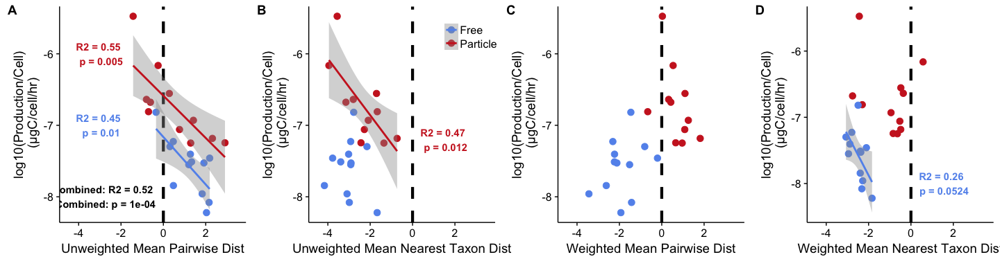


## Differences in slopes and interaction terms?

### Unweighted MPD slopes

```r
# UNWEIGHTED MPD 
# Are the slopes of the fraction linear models different from each other in predicting fraction production?
unweightMPD_fraction_dat <- filter(unweighted_sesMPD_taxalab, 
                       fraction %in% c("WholePart", "WholeFree")) %>%
  dplyr::select(norep_filter_name, mpd.obs.z, fraction, frac_bacprod, fracprod_per_cell_noinf) 


# Double check values from above models
lm_unweightMPD_by_fraction <- lm(frac_bacprod ~ mpd.obs.z/fraction, data = unweightMPD_fraction_dat)
summary(lm_unweightMPD_by_fraction)
```

```
## 
## Call:
## lm(formula = frac_bacprod ~ mpd.obs.z/fraction, data = unweightMPD_fraction_dat)
## 
## Residuals:
##     Min      1Q  Median      3Q     Max 
## -21.686  -8.221  -4.439   4.790  42.880 
## 
## Coefficients:
##                             Estimate Std. Error t value Pr(>|t|)    
## (Intercept)                   20.034      3.997   5.012 5.83e-05 ***
## mpd.obs.z                     -5.832      3.058  -1.907   0.0703 .  
## mpd.obs.z:fractionWholeFree    3.843      4.211   0.913   0.3718    
## ---
## Signif. codes:  0 '***' 0.001 '**' 0.01 '*' 0.05 '.' 0.1 ' ' 1
## 
## Residual standard error: 14.69 on 21 degrees of freedom
## Multiple R-squared:  0.1481,	Adjusted R-squared:  0.06698 
## F-statistic: 1.826 on 2 and 21 DF,  p-value: 0.1858
```

```r
# Separate Linear Models with subsetted data
summary(lm(frac_bacprod ~ mpd.obs.z, data = dplyr::filter(unweightMPD_fraction_dat,fraction == "WholePart")))
```

```
## 
## Call:
## lm(formula = frac_bacprod ~ mpd.obs.z, data = dplyr::filter(unweightMPD_fraction_dat, 
##     fraction == "WholePart"))
## 
## Residuals:
##      Min       1Q   Median       3Q      Max 
## -12.1297  -3.7843   0.2251   2.0581  13.1658 
## 
## Coefficients:
##             Estimate Std. Error t value Pr(>|t|)    
## (Intercept)   12.211      2.132   5.727 0.000191 ***
## mpd.obs.z     -3.659      1.432  -2.554 0.028643 *  
## ---
## Signif. codes:  0 '***' 0.001 '**' 0.01 '*' 0.05 '.' 0.1 ' ' 1
## 
## Residual standard error: 6.725 on 10 degrees of freedom
## Multiple R-squared:  0.3949,	Adjusted R-squared:  0.3344 
## F-statistic: 6.525 on 1 and 10 DF,  p-value: 0.02864
```

```r
summary(lm(frac_bacprod ~ mpd.obs.z, data = dplyr::filter(unweightMPD_fraction_dat,fraction == "WholeFree")))
```

```
## 
## Call:
## lm(formula = frac_bacprod ~ mpd.obs.z, data = dplyr::filter(unweightMPD_fraction_dat, 
##     fraction == "WholeFree"))
## 
## Residuals:
##     Min      1Q  Median      3Q     Max 
## -20.349  -6.690  -3.998   5.997  20.900 
## 
## Coefficients:
##             Estimate Std. Error t value Pr(>|t|)    
## (Intercept)   41.880      7.053   5.938 0.000143 ***
## mpd.obs.z    -14.406      4.780  -3.014 0.013038 *  
## ---
## Signif. codes:  0 '***' 0.001 '**' 0.01 '*' 0.05 '.' 0.1 ' ' 1
## 
## Residual standard error: 13.31 on 10 degrees of freedom
## Multiple R-squared:  0.4759,	Adjusted R-squared:  0.4235 
## F-statistic: 9.082 on 1 and 10 DF,  p-value: 0.01304
```

```r
# Help from:  http://r-eco-evo.blogspot.com/2011/08/comparing-two-regression-slopes-by.html
mod1_bulk <- aov(frac_bacprod ~ mpd.obs.z*fraction, data = unweightMPD_fraction_dat)
summary(mod1_bulk) # With interaction term 
```

```
##                    Df Sum Sq Mean Sq F value   Pr(>F)    
## mpd.obs.z           1  608.3   608.3   5.470 0.029834 *  
## fraction            1 1826.2  1826.2  16.422 0.000622 ***
## mpd.obs.z:fraction  1  662.5   662.5   5.958 0.024080 *  
## Residuals          20 2224.1   111.2                     
## ---
## Signif. codes:  0 '***' 0.001 '**' 0.01 '*' 0.05 '.' 0.1 ' ' 1
```

```r
mod2_bulk <- aov(frac_bacprod ~ mpd.obs.z+fraction, data = unweightMPD_fraction_dat)
summary(mod2_bulk) # Without interaction term 
```

```
##             Df Sum Sq Mean Sq F value  Pr(>F)   
## mpd.obs.z    1  608.3   608.3   4.426 0.04763 * 
## fraction     1 1826.2  1826.2  13.286 0.00151 **
## Residuals   21 2886.6   137.5                   
## ---
## Signif. codes:  0 '***' 0.001 '**' 0.01 '*' 0.05 '.' 0.1 ' ' 1
```

```r
anova(mod1_bulk, mod2_bulk) # Does the interaction term have a significant effect?
```

```
## Analysis of Variance Table
## 
## Model 1: frac_bacprod ~ mpd.obs.z * fraction
## Model 2: frac_bacprod ~ mpd.obs.z + fraction
##   Res.Df    RSS Df Sum of Sq      F  Pr(>F)  
## 1     20 2224.1                              
## 2     21 2886.6 -1   -662.52 5.9577 0.02408 *
## ---
## Signif. codes:  0 '***' 0.001 '**' 0.01 '*' 0.05 '.' 0.1 ' ' 1
```

```r
## PER CELL
lm_unweightMPD_by_fraction_percell <- lm(log10(fracprod_per_cell_noinf) ~ mpd.obs.z/fraction, data = unweightMPD_fraction_dat)
summary(lm_unweightMPD_by_fraction_percell)
```

```
## 
## Call:
## lm(formula = log10(fracprod_per_cell_noinf) ~ mpd.obs.z/fraction, 
##     data = unweightMPD_fraction_dat)
## 
## Residuals:
##     Min      1Q  Median      3Q     Max 
## -0.8308 -0.1966 -0.1015  0.2131  0.8971 
## 
## Coefficients:
##                             Estimate Std. Error t value Pr(>|t|)    
## (Intercept)                 -6.74086    0.10386 -64.902   <2e-16 ***
## mpd.obs.z                   -0.25868    0.08497  -3.045   0.0064 ** 
## mpd.obs.z:fractionWholeFree -0.31403    0.11525  -2.725   0.0131 *  
## ---
## Signif. codes:  0 '***' 0.001 '**' 0.01 '*' 0.05 '.' 0.1 ' ' 1
## 
## Residual standard error: 0.3791 on 20 degrees of freedom
##   (1 observation deleted due to missingness)
## Multiple R-squared:  0.669,	Adjusted R-squared:  0.6359 
## F-statistic: 20.21 on 2 and 20 DF,  p-value: 1.58e-05
```

```r
summary(lm(log10(fracprod_per_cell_noinf) ~ mpd.obs.z, 
           data = dplyr::filter(unweightMPD_fraction_dat,fraction == "WholePart")))
```

```
## 
## Call:
## lm(formula = log10(fracprod_per_cell_noinf) ~ mpd.obs.z, data = dplyr::filter(unweightMPD_fraction_dat, 
##     fraction == "WholePart"))
## 
## Residuals:
##      Min       1Q   Median       3Q      Max 
## -0.43060 -0.27621  0.07526  0.15800  0.69006 
## 
## Coefficients:
##             Estimate Std. Error t value Pr(>|t|)    
## (Intercept) -6.58642    0.11425 -57.647 7.16e-13 ***
## mpd.obs.z   -0.29551    0.08124  -3.638  0.00542 ** 
## ---
## Signif. codes:  0 '***' 0.001 '**' 0.01 '*' 0.05 '.' 0.1 ' ' 1
## 
## Residual standard error: 0.357 on 9 degrees of freedom
##   (1 observation deleted due to missingness)
## Multiple R-squared:  0.5952,	Adjusted R-squared:  0.5502 
## F-statistic: 13.23 on 1 and 9 DF,  p-value: 0.005421
```

```r
summary(lm(log10(fracprod_per_cell_noinf) ~ mpd.obs.z, 
           data = dplyr::filter(unweightMPD_fraction_dat,fraction == "WholeFree")))
```

```
## 
## Call:
## lm(formula = log10(fracprod_per_cell_noinf) ~ mpd.obs.z, data = dplyr::filter(unweightMPD_fraction_dat, 
##     fraction == "WholeFree"))
## 
## Residuals:
##      Min       1Q   Median       3Q      Max 
## -0.52158 -0.18889  0.05203  0.19575  0.43082 
## 
## Coefficients:
##             Estimate Std. Error t value Pr(>|t|)    
## (Intercept)  -7.1641     0.1551  -46.19 5.45e-13 ***
## mpd.obs.z    -0.3321     0.1051   -3.16   0.0102 *  
## ---
## Signif. codes:  0 '***' 0.001 '**' 0.01 '*' 0.05 '.' 0.1 ' ' 1
## 
## Residual standard error: 0.2927 on 10 degrees of freedom
## Multiple R-squared:  0.4996,	Adjusted R-squared:  0.4495 
## F-statistic: 9.983 on 1 and 10 DF,  p-value: 0.01017
```

```r
mod1_percell <- aov(fracprod_per_cell_noinf ~ mpd.obs.z*fraction, data = unweightMPD_fraction_dat)
summary(mod1_percell) # With interaction term 
```

```
##                    Df    Sum Sq   Mean Sq F value Pr(>F)  
## mpd.obs.z           1 2.898e-12 2.898e-12   8.173  0.010 *
## fraction            1 2.760e-13 2.756e-13   0.777  0.389  
## mpd.obs.z:fraction  1 6.280e-13 6.285e-13   1.772  0.199  
## Residuals          19 6.738e-12 3.546e-13                 
## ---
## Signif. codes:  0 '***' 0.001 '**' 0.01 '*' 0.05 '.' 0.1 ' ' 1
## 1 observation deleted due to missingness
```

```r
mod2_percell <- aov(fracprod_per_cell_noinf ~ mpd.obs.z+fraction, data = unweightMPD_fraction_dat)
summary(mod2_percell) # Without interaction term 
```

```
##             Df    Sum Sq   Mean Sq F value Pr(>F)  
## mpd.obs.z    1 2.898e-12 2.898e-12   7.869 0.0109 *
## fraction     1 2.760e-13 2.756e-13   0.748 0.3972  
## Residuals   20 7.366e-12 3.683e-13                 
## ---
## Signif. codes:  0 '***' 0.001 '**' 0.01 '*' 0.05 '.' 0.1 ' ' 1
## 1 observation deleted due to missingness
```

```r
anova(mod1_percell, mod2_percell) # Does the interaction term have a significant effect?
```

```
## Analysis of Variance Table
## 
## Model 1: fracprod_per_cell_noinf ~ mpd.obs.z * fraction
## Model 2: fracprod_per_cell_noinf ~ mpd.obs.z + fraction
##   Res.Df        RSS Df   Sum of Sq      F Pr(>F)
## 1     19 6.7380e-12                             
## 2     20 7.3664e-12 -1 -6.2845e-13 1.7721 0.1989
```

```r
# Run a post-hoc test
library(multcomp)
#BULK MEASURE
post_hoc_measure_byfraction <- glht(lm_unweightMPD_by_fraction, 
                                    linfct = mcp(fraction = "Tukey", interaction_average=TRUE),
                vcov=vcovHC(lm_unweightMPD_by_fraction, type = "HC0"))
summary(post_hoc_measure_byfraction)
```

```
## 
## 	 Simultaneous Tests for General Linear Hypotheses
## 
## Multiple Comparisons of Means: Tukey Contrasts
## 
## 
## Fit: lm(formula = frac_bacprod ~ mpd.obs.z/fraction, data = unweightMPD_fraction_dat)
## 
## Linear Hypotheses:
##                            Estimate Std. Error t value Pr(>|t|)
## WholeFree - WholePart == 0    3.843      2.979    1.29    0.211
## (Adjusted p values reported -- single-step method)
```

```r
# PER CELL
post_hoc_measure_byfraction_percell <- glht(lm_unweightMPD_by_fraction_percell, 
                                    linfct = mcp(fraction = "Tukey", interaction_average=TRUE),
                vcov=vcovHC(lm_unweightMPD_by_fraction_percell, type = "HC0"))
summary(post_hoc_measure_byfraction_percell)
```

```
## 
## 	 Simultaneous Tests for General Linear Hypotheses
## 
## Multiple Comparisons of Means: Tukey Contrasts
## 
## 
## Fit: lm(formula = log10(fracprod_per_cell_noinf) ~ mpd.obs.z/fraction, 
##     data = unweightMPD_fraction_dat)
## 
## Linear Hypotheses:
##                            Estimate Std. Error t value Pr(>|t|)   
## WholeFree - WholePart == 0 -0.31403    0.08305  -3.781  0.00117 **
## ---
## Signif. codes:  0 '***' 0.001 '**' 0.01 '*' 0.05 '.' 0.1 ' ' 1
## (Adjusted p values reported -- single-step method)
```

```r
detach("package:multcomp", unload=TRUE) # This package masks the dplyr select function = :(
```


### Weighted MPD slopes

```r
####  WEIGHTED MPD
weightMPD_fraction_dat <- filter(WEIGHTED_sesMPD_taxalab, 
                       fraction %in% c("WholePart", "WholeFree")) %>%
  dplyr::select(norep_filter_name, mpd.obs.z, fraction, frac_bacprod, fracprod_per_cell_noinf) 


# Double check values from above models
lm_WEIGHTED_MPD_by_fraction <- lm(frac_bacprod ~ mpd.obs.z/fraction, data = weightMPD_fraction_dat)
summary(lm_WEIGHTED_MPD_by_fraction)
```

```
## 
## Call:
## lm(formula = frac_bacprod ~ mpd.obs.z/fraction, data = weightMPD_fraction_dat)
## 
## Residuals:
##     Min      1Q  Median      3Q     Max 
## -17.499 -10.736  -0.878   5.638  42.391 
## 
## Coefficients:
##                             Estimate Std. Error t value Pr(>|t|)   
## (Intercept)                   19.381      5.414   3.580  0.00177 **
## mpd.obs.z                     -9.629      6.020  -1.600  0.12464   
## mpd.obs.z:fractionWholeFree    8.376      8.192   1.022  0.31820   
## ---
## Signif. codes:  0 '***' 0.001 '**' 0.01 '*' 0.05 '.' 0.1 ' ' 1
## 
## Residual standard error: 14.37 on 21 degrees of freedom
## Multiple R-squared:  0.1856,	Adjusted R-squared:  0.108 
## F-statistic: 2.392 on 2 and 21 DF,  p-value: 0.1159
```

```r
summary(lm(frac_bacprod ~ mpd.obs.z, data = dplyr::filter(weightMPD_fraction_dat,fraction == "WholePart")))
```

```
## 
## Call:
## lm(formula = frac_bacprod ~ mpd.obs.z, data = dplyr::filter(weightMPD_fraction_dat, 
##     fraction == "WholePart"))
## 
## Residuals:
##     Min      1Q  Median      3Q     Max 
## -9.1294 -6.3948 -0.9037  4.3160 16.8990 
## 
## Coefficients:
##             Estimate Std. Error t value Pr(>|t|)   
## (Intercept)   13.859      3.463   4.002  0.00251 **
## mpd.obs.z     -5.310      3.573  -1.486  0.16806   
## ---
## Signif. codes:  0 '***' 0.001 '**' 0.01 '*' 0.05 '.' 0.1 ' ' 1
## 
## Residual standard error: 7.824 on 10 degrees of freedom
## Multiple R-squared:  0.1809,	Adjusted R-squared:  0.09901 
## F-statistic: 2.209 on 1 and 10 DF,  p-value: 0.1681
```

```r
summary(lm(frac_bacprod ~ mpd.obs.z, data = dplyr::filter(weightMPD_fraction_dat,fraction == "WholeFree")))
```

```
## 
## Call:
## lm(formula = frac_bacprod ~ mpd.obs.z, data = dplyr::filter(weightMPD_fraction_dat, 
##     fraction == "WholeFree"))
## 
## Residuals:
##     Min      1Q  Median      3Q     Max 
## -21.159  -7.589  -3.981   4.588  37.417 
## 
## Coefficients:
##             Estimate Std. Error t value Pr(>|t|)  
## (Intercept)   33.958     12.771   2.659   0.0239 *
## mpd.obs.z      5.330      6.298   0.846   0.4171  
## ---
## Signif. codes:  0 '***' 0.001 '**' 0.01 '*' 0.05 '.' 0.1 ' ' 1
## 
## Residual standard error: 17.76 on 10 degrees of freedom
## Multiple R-squared:  0.06685,	Adjusted R-squared:  -0.02647 
## F-statistic: 0.7164 on 1 and 10 DF,  p-value: 0.4171
```

```r
# Help from:  http://r-eco-evo.blogspot.com/2011/08/comparing-two-regression-slopes-by.html
mod1_bulk <- aov(frac_bacprod ~ mpd.obs.z*fraction, data = weightMPD_fraction_dat)
summary(mod1_bulk) # With interaction term 
```

```
##                    Df Sum Sq Mean Sq F value Pr(>F)  
## mpd.obs.z           1    772   771.6   4.097 0.0565 .
## fraction            1    444   443.7   2.356 0.1405  
## mpd.obs.z:fraction  1    339   338.7   1.798 0.1949  
## Residuals          20   3767   188.4                 
## ---
## Signif. codes:  0 '***' 0.001 '**' 0.01 '*' 0.05 '.' 0.1 ' ' 1
```

```r
mod2_bulk <- aov(frac_bacprod ~ mpd.obs.z+fraction, data = weightMPD_fraction_dat)
summary(mod2_bulk) # Without interaction term 
```

```
##             Df Sum Sq Mean Sq F value Pr(>F)  
## mpd.obs.z    1    772   771.6   3.947 0.0602 .
## fraction     1    444   443.7   2.269 0.1468  
## Residuals   21   4106   195.5                 
## ---
## Signif. codes:  0 '***' 0.001 '**' 0.01 '*' 0.05 '.' 0.1 ' ' 1
```

```r
anova(mod1_bulk, mod2_bulk) # Does the interaction term have a significant effect?
```

```
## Analysis of Variance Table
## 
## Model 1: frac_bacprod ~ mpd.obs.z * fraction
## Model 2: frac_bacprod ~ mpd.obs.z + fraction
##   Res.Df    RSS Df Sum of Sq      F Pr(>F)
## 1     20 3767.1                           
## 2     21 4105.8 -1   -338.74 1.7984 0.1949
```

```r
## PER CELL
lm_WEIGHTED_MPD_by_fraction_percell <- lm(log10(fracprod_per_cell_noinf) ~ mpd.obs.z/fraction, data = weightMPD_fraction_dat)
summary(lm_WEIGHTED_MPD_by_fraction_percell)
```

```
## 
## Call:
## lm(formula = log10(fracprod_per_cell_noinf) ~ mpd.obs.z/fraction, 
##     data = weightMPD_fraction_dat)
## 
## Residuals:
##      Min       1Q   Median       3Q      Max 
## -0.78244 -0.25063  0.01181  0.20624  1.23016 
## 
## Coefficients:
##                             Estimate Std. Error t value Pr(>|t|)    
## (Intercept)                  -6.6989     0.1830 -36.597   <2e-16 ***
## mpd.obs.z                    -0.1936     0.2120  -0.913   0.3720    
## mpd.obs.z:fractionWholeFree   0.6132     0.2832   2.165   0.0427 *  
## ---
## Signif. codes:  0 '***' 0.001 '**' 0.01 '*' 0.05 '.' 0.1 ' ' 1
## 
## Residual standard error: 0.4857 on 20 degrees of freedom
##   (1 observation deleted due to missingness)
## Multiple R-squared:  0.4568,	Adjusted R-squared:  0.4025 
## F-statistic: 8.409 on 2 and 20 DF,  p-value: 0.002238
```

```r
summary(lm(log10(fracprod_per_cell_noinf) ~ mpd.obs.z, 
           data = dplyr::filter(weightMPD_fraction_dat,fraction == "WholePart")))
```

```
## 
## Call:
## lm(formula = log10(fracprod_per_cell_noinf) ~ mpd.obs.z, data = dplyr::filter(weightMPD_fraction_dat, 
##     fraction == "WholePart"))
## 
## Residuals:
##      Min       1Q   Median       3Q      Max 
## -0.58497 -0.30162 -0.04586  0.16599  1.00761 
## 
## Coefficients:
##             Estimate Std. Error t value Pr(>|t|)    
## (Intercept)  -6.4710     0.2195 -29.475 2.91e-10 ***
## mpd.obs.z    -0.3718     0.2345  -1.585    0.147    
## ---
## Signif. codes:  0 '***' 0.001 '**' 0.01 '*' 0.05 '.' 0.1 ' ' 1
## 
## Residual standard error: 0.4961 on 9 degrees of freedom
##   (1 observation deleted due to missingness)
## Multiple R-squared:  0.2183,	Adjusted R-squared:  0.1314 
## F-statistic: 2.513 on 1 and 9 DF,  p-value: 0.1474
```

```r
summary(lm(log10(fracprod_per_cell_noinf) ~ mpd.obs.z, 
           data = dplyr::filter(weightMPD_fraction_dat,fraction == "WholeFree")))
```

```
## 
## Call:
## lm(formula = log10(fracprod_per_cell_noinf) ~ mpd.obs.z, data = dplyr::filter(weightMPD_fraction_dat, 
##     fraction == "WholeFree"))
## 
## Residuals:
##      Min       1Q   Median       3Q      Max 
## -0.63632 -0.15126  0.03025  0.14738  0.69793 
## 
## Coefficients:
##             Estimate Std. Error t value Pr(>|t|)    
## (Intercept)  -7.3003     0.2820 -25.889  1.7e-10 ***
## mpd.obs.z     0.1479     0.1391   1.064    0.312    
## ---
## Signif. codes:  0 '***' 0.001 '**' 0.01 '*' 0.05 '.' 0.1 ' ' 1
## 
## Residual standard error: 0.3922 on 10 degrees of freedom
## Multiple R-squared:  0.1017,	Adjusted R-squared:  0.01185 
## F-statistic: 1.132 on 1 and 10 DF,  p-value: 0.3124
```

```r
mod1_percell <- aov(fracprod_per_cell_noinf ~ mpd.obs.z*fraction, data = weightMPD_fraction_dat)
summary(mod1_percell) # With interaction term 
```

```
##                    Df    Sum Sq   Mean Sq F value Pr(>F)
## mpd.obs.z           1 3.590e-13 3.592e-13   0.833  0.373
## fraction            1 1.172e-12 1.172e-12   2.720  0.116
## mpd.obs.z:fraction  1 8.190e-13 8.192e-13   1.901  0.184
## Residuals          19 8.190e-12 4.310e-13               
## 1 observation deleted due to missingness
```

```r
mod2_percell <- aov(fracprod_per_cell_noinf ~ mpd.obs.z+fraction, data = weightMPD_fraction_dat)
summary(mod2_percell) # Without interaction term 
```

```
##             Df    Sum Sq   Mean Sq F value Pr(>F)
## mpd.obs.z    1 3.590e-13 3.592e-13   0.797  0.382
## fraction     1 1.172e-12 1.172e-12   2.603  0.122
## Residuals   20 9.009e-12 4.504e-13               
## 1 observation deleted due to missingness
```

```r
anova(mod1_percell, mod2_percell) # Does the interaction term have a significant effect?
```

```
## Analysis of Variance Table
## 
## Model 1: fracprod_per_cell_noinf ~ mpd.obs.z * fraction
## Model 2: fracprod_per_cell_noinf ~ mpd.obs.z + fraction
##   Res.Df        RSS Df  Sum of Sq      F Pr(>F)
## 1     19 8.1896e-12                            
## 2     20 9.0088e-12 -1 -8.192e-13 1.9006  0.184
```

```r
# Run a post-hoc test
library(multcomp)
#BULK MEASURE
post_hoc_WEIGHTEDMPD_byfraction <- glht(lm_WEIGHTED_MPD_by_fraction, 
                                    linfct = mcp(fraction = "Tukey", interaction_average=TRUE),
                vcov=vcovHC(lm_WEIGHTED_MPD_by_fraction, type = "HC0"))
summary(post_hoc_WEIGHTEDMPD_byfraction)
```

```
## 
## 	 Simultaneous Tests for General Linear Hypotheses
## 
## Multiple Comparisons of Means: Tukey Contrasts
## 
## 
## Fit: lm(formula = frac_bacprod ~ mpd.obs.z/fraction, data = weightMPD_fraction_dat)
## 
## Linear Hypotheses:
##                            Estimate Std. Error t value Pr(>|t|)
## WholeFree - WholePart == 0    8.376      6.586   1.272    0.217
## (Adjusted p values reported -- single-step method)
```

```r
# PER CELL
post_hoc_WEIGHTEDMPD_byfraction_percell <- glht(lm_WEIGHTED_MPD_by_fraction_percell, 
                                    linfct = mcp(fraction = "Tukey", interaction_average=TRUE),
                vcov=vcovHC(lm_WEIGHTED_MPD_by_fraction_percell, type = "HC0"))
summary(post_hoc_WEIGHTEDMPD_byfraction_percell)
```

```
## 
## 	 Simultaneous Tests for General Linear Hypotheses
## 
## Multiple Comparisons of Means: Tukey Contrasts
## 
## 
## Fit: lm(formula = log10(fracprod_per_cell_noinf) ~ mpd.obs.z/fraction, 
##     data = weightMPD_fraction_dat)
## 
## Linear Hypotheses:
##                            Estimate Std. Error t value Pr(>|t|)  
## WholeFree - WholePart == 0   0.6132     0.2597   2.361   0.0285 *
## ---
## Signif. codes:  0 '***' 0.001 '**' 0.01 '*' 0.05 '.' 0.1 ' ' 1
## (Adjusted p values reported -- single-step method)
```

```r
detach("package:multcomp", unload=TRUE) # This package masks the dplyr select function = :(
```


# Figure 3

```r
plot_grid(taxlab_unweight_mpd + ylim(-4.5, 3.5) + xlab("") + coord_flip() + 
            annotate("text", x=1.55, y=(max(mpd_nums1$b)-0.5), fontface = "bold",  size = 3.5, color = "gray40",
                       label= paste("NS")) +
            theme(axis.text.y = element_text(angle=90, hjust=0.5)), 
          taxlab_unweight_mntd + ylim(-4.5, 3.5) + xlab("") + coord_flip() + 
            annotate("text", x=1.55, y=(max(mntd_nums1$b)-0.5), fontface = "bold",  size = 3.5, color = "gray40",
                       label= paste("NS")) + 
            theme(axis.text.y = element_text(angle=90, hjust=0.5)), 
          taxlab_weight_mpd + ylim(-4.5, 3.5) + xlab("") + coord_flip() + 
            annotate("text", x=1.55, y=(max(mpd_nums2$b)-1), fontface = "bold",  size = 3.5, color = "gray40",
                       label= paste("***\np =", round(weight_MPD_wilcox$p.value, digits = 6))) + 
            theme(axis.text.y = element_text(angle=90, hjust=0.5)), 
          taxlab_weight_mntd + ylim(-4.5, 3.5) + xlab("") + coord_flip() + 
            annotate("text", x=1.55, y=(max(mntd_nums2$b)+1.2), fontface = "bold",  size = 3.5, color = "gray40",
                       label= paste("***\np =", round(weight_MNTD_wilcox$p.value, digits = 3))) + 
            theme(axis.text.y = element_text(angle=90, hjust=0.5)), 
          plot_unweightedMPD_percell + xlim(-4.5, 3.5), 
          plot_unweightedMNTD_percell + xlim(-4.5, 3.5), 
          plot_weightedMPD_percell + xlim(-4.5, 3.5), 
          plot_weightedMNTD_percell + xlim(-4.5, 3.5), 
          labels = c("A", "B", "C", "D", "E", "F", "G", "H"),
          ncol = 4, nrow = 2)
```

```
## Warning: Removed 1 rows containing non-finite values (stat_smooth).
```

```
## Warning: Removed 1 rows containing missing values (geom_point).
```

```
## Warning in grid.Call(L_stringMetric, as.graphicsAnnot(x$label)): conversion failure on ' (μgC/cell/hr)' in 'mbcsToSbcs': dot substituted for <ce>
```

```
## Warning in grid.Call(L_stringMetric, as.graphicsAnnot(x$label)): conversion failure on ' (μgC/cell/hr)' in 'mbcsToSbcs': dot substituted for <bc>
```

```
## Warning: Removed 1 rows containing non-finite values (stat_smooth).
```

```
## Warning: Removed 1 rows containing missing values (geom_point).
```

```
## Warning in grid.Call(L_stringMetric, as.graphicsAnnot(x$label)): conversion failure on ' (μgC/cell/hr)' in 'mbcsToSbcs': dot substituted for <ce>
```

```
## Warning in grid.Call(L_stringMetric, as.graphicsAnnot(x$label)): conversion failure on ' (μgC/cell/hr)' in 'mbcsToSbcs': dot substituted for <bc>
```

```
## Warning: Removed 1 rows containing missing values (geom_point).
```

```
## Warning in grid.Call(L_stringMetric, as.graphicsAnnot(x$label)): conversion failure on ' (μgC/cell/hr)' in 'mbcsToSbcs': dot substituted for <ce>
```

```
## Warning in grid.Call(L_stringMetric, as.graphicsAnnot(x$label)): conversion failure on ' (μgC/cell/hr)' in 'mbcsToSbcs': dot substituted for <bc>
```

```
## Warning: Removed 1 rows containing missing values (geom_point).
```

```
## Warning in grid.Call(L_stringMetric, as.graphicsAnnot(x$label)): conversion failure on ' (μgC/cell/hr)' in 'mbcsToSbcs': dot substituted for <ce>
```

```
## Warning in grid.Call(L_stringMetric, as.graphicsAnnot(x$label)): conversion failure on ' (μgC/cell/hr)' in 'mbcsToSbcs': dot substituted for <bc>
```

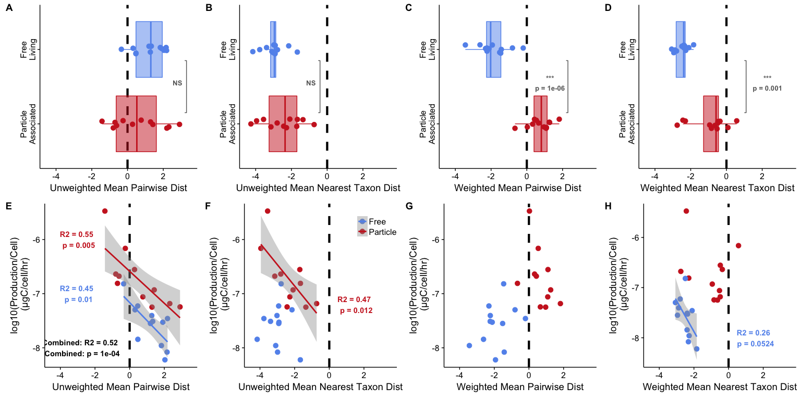

```r
###  COMBINE TOGETHER FRACTIONS FOR FIGURE G
plot_grid(taxlab_unweight_mpd + ylim(-4.5, 3.5) + xlab("") + coord_flip() + 
            annotate("text", x=1.55, y=(max(mpd_nums1$b)-0.5), fontface = "bold",  size = 3.5, color = "gray40",
                       label= paste("NS")) +
            theme(axis.text.y = element_text(angle=90, hjust=0.5)), 
          taxlab_unweight_mntd + ylim(-4.5, 3.5) + xlab("") + coord_flip() + 
            annotate("text", x=1.55, y=(max(mntd_nums1$b)-0.5), fontface = "bold",  size = 3.5, color = "gray40",
                       label= paste("NS")) + 
            theme(axis.text.y = element_text(angle=90, hjust=0.5)), 
          taxlab_weight_mpd + ylim(-4.5, 3.5) + xlab("") + coord_flip() + 
            annotate("text", x=1.55, y=(max(mpd_nums2$b)-1), fontface = "bold",  size = 3.5, color = "gray40",
                       label= paste("***\np =", round(weight_MPD_wilcox$p.value, digits = 6))) + 
            theme(axis.text.y = element_text(angle=90, hjust=0.5)), 
          taxlab_weight_mntd + ylim(-4.5, 3.5) + xlab("") + coord_flip() + 
            annotate("text", x=1.55, y=(max(mntd_nums2$b)+1.2), fontface = "bold",  size = 3.5, color = "gray40",
                       label= paste("***\np =", round(weight_MNTD_wilcox$p.value, digits = 3))) + 
            theme(axis.text.y = element_text(angle=90, hjust=0.5)), 
          plot_unweightedMPD_percell + xlim(-4.5, 3.5), 
          plot_unweightedMNTD_percell + xlim(-4.5, 3.5), 
          plot_weightedMPD_percell_TOGETHER + xlim(-4.5, 3.5), 
          plot_weightedMNTD_percell + xlim(-4.5, 3.5), 
          labels = c("A", "B", "C", "D", "E", "F", "G", "H"),
          ncol = 4, nrow = 3)
```

```
## Warning: Removed 1 rows containing non-finite values (stat_smooth).
```

```
## Warning: Removed 1 rows containing missing values (geom_point).
```

```
## Warning in grid.Call(L_stringMetric, as.graphicsAnnot(x$label)): conversion failure on ' (μgC/cell/hr)' in 'mbcsToSbcs': dot substituted for <ce>
```

```
## Warning in grid.Call(L_stringMetric, as.graphicsAnnot(x$label)): conversion failure on ' (μgC/cell/hr)' in 'mbcsToSbcs': dot substituted for <bc>
```

```
## Warning: Removed 1 rows containing non-finite values (stat_smooth).
```

```
## Warning: Removed 1 rows containing missing values (geom_point).
```

```
## Warning in grid.Call(L_stringMetric, as.graphicsAnnot(x$label)): conversion failure on ' (μgC/cell/hr)' in 'mbcsToSbcs': dot substituted for <ce>
```

```
## Warning in grid.Call(L_stringMetric, as.graphicsAnnot(x$label)): conversion failure on ' (μgC/cell/hr)' in 'mbcsToSbcs': dot substituted for <bc>
```

```
## Warning: Removed 1 rows containing non-finite values (stat_smooth).
```

```
## Warning: Removed 1 rows containing missing values (geom_point).
```

```
## Warning in grid.Call(L_stringMetric, as.graphicsAnnot(x$label)): conversion failure on ' (μgC/cell/hr)' in 'mbcsToSbcs': dot substituted for <ce>
```

```
## Warning in grid.Call(L_stringMetric, as.graphicsAnnot(x$label)): conversion failure on ' (μgC/cell/hr)' in 'mbcsToSbcs': dot substituted for <bc>
```

```
## Warning: Removed 1 rows containing missing values (geom_point).
```

```
## Warning in grid.Call(L_stringMetric, as.graphicsAnnot(x$label)): conversion failure on ' (μgC/cell/hr)' in 'mbcsToSbcs': dot substituted for <ce>
```

```
## Warning in grid.Call(L_stringMetric, as.graphicsAnnot(x$label)): conversion failure on ' (μgC/cell/hr)' in 'mbcsToSbcs': dot substituted for <bc>
```

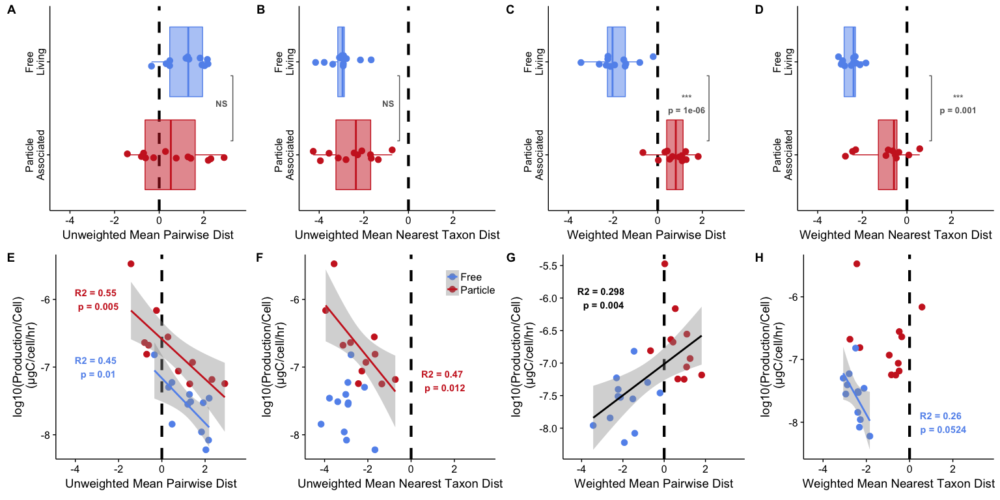


```r
plot_grid(taxlab_unweight_mpd + ylim(-4.5, 3.5) + xlab("") + coord_flip() + 
            annotate("text", x=1.55, y=(max(mpd_nums1$b)-0.5), fontface = "bold",  size = 3.5, color = "gray40",
                       label= paste("NS")) +
            theme(axis.text.y = element_text(angle=90, hjust=0.5)), 
          taxlab_unweight_mntd + ylim(-4.5, 3.5) + xlab("") + coord_flip() + 
            annotate("text", x=1.55, y=(max(mntd_nums1$b)-0.5), fontface = "bold",  size = 3.5, color = "gray40",
                       label= paste("NS")) + 
            theme(axis.text.y = element_text(angle=90, hjust=0.5)), 
          taxlab_weight_mpd + ylim(-4.5, 3.5) + xlab("") + coord_flip() + 
            annotate("text", x=1.55, y=(max(mpd_nums2$b)-1), fontface = "bold",  size = 3.5, color = "gray40",
                       label= paste("***\np =", round(weight_MPD_wilcox$p.value, digits = 6))) + 
            theme(axis.text.y = element_text(angle=90, hjust=0.5)), 
          taxlab_weight_mntd + ylim(-4.5, 3.5) + xlab("") + coord_flip() + 
            annotate("text", x=1.55, y=(max(mntd_nums2$b)+1.2), fontface = "bold",  size = 3.5, color = "gray40",
                       label= paste("***\np =", round(weight_MNTD_wilcox$p.value, digits = 3))) + 
            theme(axis.text.y = element_text(angle=90, hjust=0.5)), 
          plot_unweightedMPD_prod, 
          plot_unweightedMNTD_prod,
          plot_weightedMPD_prod, 
          plot_weightedMNTD_prod,
          plot_unweightedMPD_percell + xlim(-4.5, 3.5), 
          plot_unweightedMNTD_percell + xlim(-4.5, 3.5), 
          plot_weightedMPD_percell_TOGETHER + xlim(-4.5, 3.5), 
          plot_weightedMNTD_percell + xlim(-4.5, 3.5), 
          labels = c("A", "B", "C", "D", "E", "F", "G", "H", "I", "J", "K", "L"),
          ncol = 4, nrow = 3)
```

```
## Warning in grid.Call(L_stringMetric, as.graphicsAnnot(x$label)): conversion failure on ' (μgC/L/hr)' in 'mbcsToSbcs': dot substituted for <ce>
```

```
## Warning in grid.Call(L_stringMetric, as.graphicsAnnot(x$label)): conversion failure on ' (μgC/L/hr)' in 'mbcsToSbcs': dot substituted for <bc>
```

```
## Warning in grid.Call(L_stringMetric, as.graphicsAnnot(x$label)): conversion failure on ' (μgC/L/hr)' in 'mbcsToSbcs': dot substituted for <ce>
```

```
## Warning in grid.Call(L_stringMetric, as.graphicsAnnot(x$label)): conversion failure on ' (μgC/L/hr)' in 'mbcsToSbcs': dot substituted for <bc>
```

```
## Warning in grid.Call(L_stringMetric, as.graphicsAnnot(x$label)): conversion failure on ' (μgC/L/hr)' in 'mbcsToSbcs': dot substituted for <ce>
```

```
## Warning in grid.Call(L_stringMetric, as.graphicsAnnot(x$label)): conversion failure on ' (μgC/L/hr)' in 'mbcsToSbcs': dot substituted for <bc>
```

```
## Warning in grid.Call(L_stringMetric, as.graphicsAnnot(x$label)): conversion failure on ' (μgC/L/hr)' in 'mbcsToSbcs': dot substituted for <ce>
```

```
## Warning in grid.Call(L_stringMetric, as.graphicsAnnot(x$label)): conversion failure on ' (μgC/L/hr)' in 'mbcsToSbcs': dot substituted for <bc>
```

```
## Warning: Removed 1 rows containing non-finite values (stat_smooth).
```

```
## Warning: Removed 1 rows containing missing values (geom_point).
```

```
## Warning in grid.Call(L_stringMetric, as.graphicsAnnot(x$label)): conversion failure on ' (μgC/cell/hr)' in 'mbcsToSbcs': dot substituted for <ce>
```

```
## Warning in grid.Call(L_stringMetric, as.graphicsAnnot(x$label)): conversion failure on ' (μgC/cell/hr)' in 'mbcsToSbcs': dot substituted for <bc>
```

```
## Warning: Removed 1 rows containing non-finite values (stat_smooth).
```

```
## Warning: Removed 1 rows containing missing values (geom_point).
```

```
## Warning in grid.Call(L_stringMetric, as.graphicsAnnot(x$label)): conversion failure on ' (μgC/cell/hr)' in 'mbcsToSbcs': dot substituted for <ce>
```

```
## Warning in grid.Call(L_stringMetric, as.graphicsAnnot(x$label)): conversion failure on ' (μgC/cell/hr)' in 'mbcsToSbcs': dot substituted for <bc>
```

```
## Warning: Removed 1 rows containing non-finite values (stat_smooth).
```

```
## Warning: Removed 1 rows containing missing values (geom_point).
```

```
## Warning in grid.Call(L_stringMetric, as.graphicsAnnot(x$label)): conversion failure on ' (μgC/cell/hr)' in 'mbcsToSbcs': dot substituted for <ce>
```

```
## Warning in grid.Call(L_stringMetric, as.graphicsAnnot(x$label)): conversion failure on ' (μgC/cell/hr)' in 'mbcsToSbcs': dot substituted for <bc>
```

```
## Warning: Removed 1 rows containing missing values (geom_point).
```

```
## Warning in grid.Call(L_stringMetric, as.graphicsAnnot(x$label)): conversion failure on ' (μgC/cell/hr)' in 'mbcsToSbcs': dot substituted for <ce>
```

```
## Warning in grid.Call(L_stringMetric, as.graphicsAnnot(x$label)): conversion failure on ' (μgC/cell/hr)' in 'mbcsToSbcs': dot substituted for <bc>
```

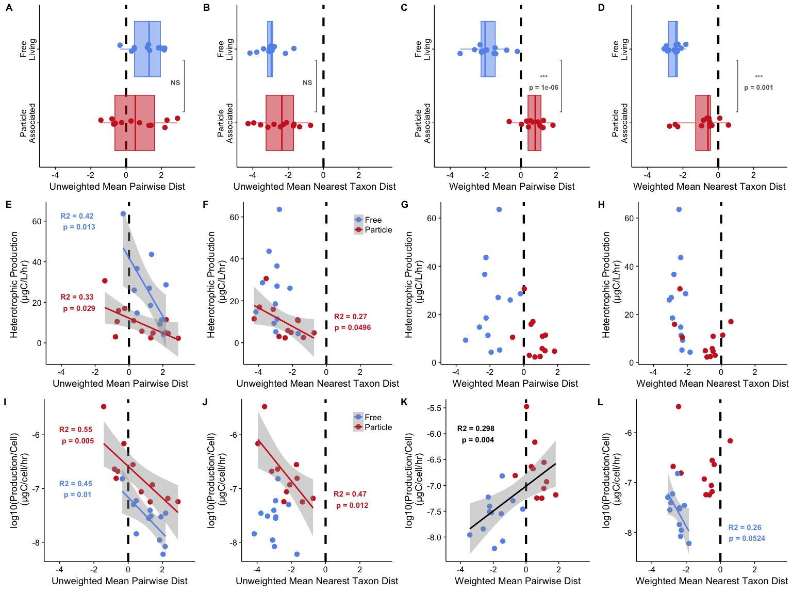


```r
plot_grid(taxlab_unweight_mpd + ylim(-4.5, 3.5) + xlab("") + coord_flip() + 
            annotate("text", x=1.55, y=(max(mpd_nums1$b)-0.5), fontface = "bold",  size = 3.5, color = "gray40",
                       label= paste("NS")) +
            theme(axis.text.y = element_text(angle=90, hjust=0.5)), 
          taxlab_weight_mpd + ylim(-4.5, 3.5) + xlab("") + coord_flip() + 
            annotate("text", x=1.55, y=(max(mpd_nums2$b)-1), fontface = "bold",  size = 3.5, color = "gray40",
                       label= paste("***\np =", round(weight_MPD_wilcox$p.value, digits = 6)))  + 
            theme(axis.text.y = element_text(angle=90, hjust=0.5)), 
          plot_unweightedMPD_prod, 
          plot_weightedMPD_prod_TOGETHER, 
          plot_unweightedMPD_percell + xlim(-4.5, 3.5),  
          plot_weightedMPD_percell_TOGETHER + xlim(-4.5, 3.5),
          labels = c("A", "B", "C", "D", "E", "F"),
          ncol = 2, nrow = 3)
```

```
## Warning in grid.Call(L_stringMetric, as.graphicsAnnot(x$label)): conversion failure on ' (μgC/L/hr)' in 'mbcsToSbcs': dot substituted for <ce>
```

```
## Warning in grid.Call(L_stringMetric, as.graphicsAnnot(x$label)): conversion failure on ' (μgC/L/hr)' in 'mbcsToSbcs': dot substituted for <bc>
```

```
## Warning in grid.Call(L_stringMetric, as.graphicsAnnot(x$label)): conversion failure on ' (μgC/L/hr)' in 'mbcsToSbcs': dot substituted for <ce>
```

```
## Warning in grid.Call(L_stringMetric, as.graphicsAnnot(x$label)): conversion failure on ' (μgC/L/hr)' in 'mbcsToSbcs': dot substituted for <bc>
```

```
## Warning: Removed 1 rows containing non-finite values (stat_smooth).
```

```
## Warning: Removed 1 rows containing missing values (geom_point).
```

```
## Warning in grid.Call(L_stringMetric, as.graphicsAnnot(x$label)): conversion failure on ' (μgC/cell/hr)' in 'mbcsToSbcs': dot substituted for <ce>
```

```
## Warning in grid.Call(L_stringMetric, as.graphicsAnnot(x$label)): conversion failure on ' (μgC/cell/hr)' in 'mbcsToSbcs': dot substituted for <bc>
```

```
## Warning: Removed 1 rows containing non-finite values (stat_smooth).
```

```
## Warning: Removed 1 rows containing missing values (geom_point).
```

```
## Warning in grid.Call(L_stringMetric, as.graphicsAnnot(x$label)): conversion failure on ' (μgC/cell/hr)' in 'mbcsToSbcs': dot substituted for <ce>
```

```
## Warning in grid.Call(L_stringMetric, as.graphicsAnnot(x$label)): conversion failure on ' (μgC/cell/hr)' in 'mbcsToSbcs': dot substituted for <bc>
```

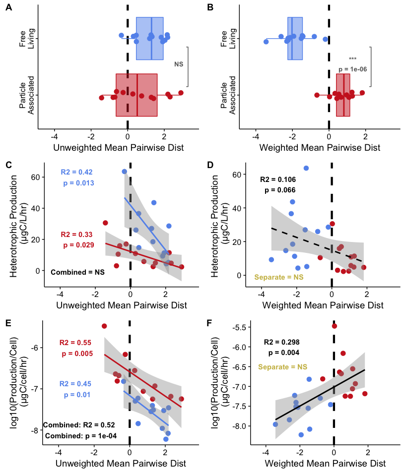


# Phylogenetic Diversity vs Richness/Evenness


```r
### Richness DF
combined_rich_unweightedMPD <- ML_otu_rich_stats %>%
  dplyr::select(norep_filter_name, mean, sd, measure) %>%
  dplyr::left_join(unweighted_sesMPD_taxalab, by = "norep_filter_name") 
```

```
## Warning in left_join_impl(x, y, by$x, by$y, suffix$x, suffix$y): joining character vector and factor, coercing into character vector
```

```r
summary(lm(mean ~ mpd.obs.z, data = dplyr::filter(combined_rich_unweightedMPD, fraction == "WholePart")))
```

```
## 
## Call:
## lm(formula = mean ~ mpd.obs.z, data = dplyr::filter(combined_rich_unweightedMPD, 
##     fraction == "WholePart"))
## 
## Residuals:
##     Min      1Q  Median      3Q     Max 
## -146.30  -49.68  -10.46   44.76  255.56 
## 
## Coefficients:
##             Estimate Std. Error t value Pr(>|t|)    
## (Intercept)   499.64      35.60  14.033 6.62e-08 ***
## mpd.obs.z     -73.09      23.92  -3.056   0.0121 *  
## ---
## Signif. codes:  0 '***' 0.001 '**' 0.01 '*' 0.05 '.' 0.1 ' ' 1
## 
## Residual standard error: 112.3 on 10 degrees of freedom
## Multiple R-squared:  0.483,	Adjusted R-squared:  0.4313 
## F-statistic: 9.341 on 1 and 10 DF,  p-value: 0.01212
```

```r
summary(lm(mean ~ mpd.obs.z, data = dplyr::filter(combined_rich_unweightedMPD, fraction == "WholeFree")))
```

```
## 
## Call:
## lm(formula = mean ~ mpd.obs.z, data = dplyr::filter(combined_rich_unweightedMPD, 
##     fraction == "WholeFree"))
## 
## Residuals:
##      Min       1Q   Median       3Q      Max 
## -124.586  -52.262    2.255   48.438  120.001 
## 
## Coefficients:
##             Estimate Std. Error t value Pr(>|t|)    
## (Intercept)   345.22      38.31   9.012 4.09e-06 ***
## mpd.obs.z     -51.58      25.96  -1.987    0.075 .  
## ---
## Signif. codes:  0 '***' 0.001 '**' 0.01 '*' 0.05 '.' 0.1 ' ' 1
## 
## Residual standard error: 72.3 on 10 degrees of freedom
## Multiple R-squared:  0.283,	Adjusted R-squared:  0.2113 
## F-statistic: 3.947 on 1 and 10 DF,  p-value: 0.07504
```

```r
summary(lm(mean ~ mpd.obs.z, data = combined_rich_unweightedMPD))
```

```
## 
## Call:
## lm(formula = mean ~ mpd.obs.z, data = combined_rich_unweightedMPD)
## 
## Residuals:
##     Min      1Q  Median      3Q     Max 
## -209.26  -85.08   12.01   46.34  308.12 
## 
## Coefficients:
##             Estimate Std. Error t value Pr(>|t|)    
## (Intercept)   444.67      29.34  15.155 3.99e-13 ***
## mpd.obs.z     -82.74      19.80  -4.179  0.00039 ***
## ---
## Signif. codes:  0 '***' 0.001 '**' 0.01 '*' 0.05 '.' 0.1 ' ' 1
## 
## Residual standard error: 112.2 on 22 degrees of freedom
## Multiple R-squared:  0.4425,	Adjusted R-squared:  0.4172 
## F-statistic: 17.46 on 1 and 22 DF,  p-value: 0.0003896
```

```r
divs_p1 <- ggplot(combined_rich_unweightedMPD, aes(y = mean, x = mpd.obs.z)) + 
  geom_vline(xintercept = 0, linetype = "dashed", size = 1.5) + xlim(-4.5, 3.5) +
  geom_point(size = 3, aes(color = fraction)) + 
  scale_color_manual(values = fraction_colors) + 
  geom_smooth(method = "lm", color = "black") +
  xlab("Unweighted MPD") + ylab("Observed Richness") +
  theme(legend.position = c(0.85, 0.9),
        legend.title = element_blank()) +
  annotate("text", x = -3, y=200, 
         color = "black", fontface = "bold",
         label = paste("R2 =", round(summary(lm(mean ~ mpd.obs.z, data = combined_rich_unweightedMPD))$adj.r.squared, 
                                     digits = 2), "\n", 
                       "p =", round(unname(summary(lm(mean ~ mpd.obs.z, data = combined_rich_unweightedMPD))$coefficients[,4][2]), 
                                    digits = 4))) 

# Plot both of the models 
divs_p2 <- ggplot(combined_rich_unweightedMPD, aes(y = mean, x = mpd.obs.z, color = fraction)) + 
  geom_vline(xintercept = 0, linetype = "dashed", size = 1.5) + xlim(-4.5, 3.5) +
  geom_point(size = 3) + 
  scale_color_manual(values = fraction_colors) + 
  geom_smooth(method = "lm", data = dplyr::filter(combined_rich_unweightedMPD, fraction == "WholePart")) +
  xlab("Unweighted MPD") + ylab("Observed Richness") +
  theme(legend.position = c(0.85, 0.9),
        legend.title = element_blank()) +
  annotate("text", x = -3, y=400, 
         color = "firebrick3", fontface = "bold",
         label = paste("R2 =", round(summary(lm(mean ~ mpd.obs.z, 
                                                data = dplyr::filter(combined_rich_unweightedMPD, fraction == "WholePart")))$adj.r.squared, 
                                     digits = 2), "\n", 
                       "p =", round(unname(summary(lm(mean ~ mpd.obs.z, 
                                                      data = dplyr::filter(combined_rich_unweightedMPD, fraction == "WholePart")))$coefficients[,4][2]), 
                                    digits = 3))) +
  annotate("text", x = -3, y=200, 
         color = "cornflowerblue", fontface = "bold",
         label = paste("R2 =", round(summary(lm(mean ~ mpd.obs.z, 
                                                data = dplyr::filter(combined_rich_unweightedMPD, fraction == "WholeFree")))$adj.r.squared, 
                                     digits = 2), "\n", 
                       "p =", round(unname(summary(lm(mean ~ mpd.obs.z, 
                                                      data = dplyr::filter(combined_rich_unweightedMPD, fraction == "WholeFree")))$coefficients[,4][2]), 
                                    digits = 3))) 


# Try it with SES MNTD
combined_rich_unweightedMNTD <- ML_otu_rich_stats %>%
  dplyr::select(norep_filter_name, mean, sd, measure) %>%
  dplyr::left_join(unweighted_sesMNTD_taxalab, by = "norep_filter_name") 
```

```
## Warning in left_join_impl(x, y, by$x, by$y, suffix$x, suffix$y): joining character vector and factor, coercing into character vector
```

```r
summary(lm(mean ~ mntd.obs.z, data = dplyr::filter(combined_rich_unweightedMNTD, fraction == "WholePart")))  # NS
```

```
## 
## Call:
## lm(formula = mean ~ mntd.obs.z, data = dplyr::filter(combined_rich_unweightedMNTD, 
##     fraction == "WholePart"))
## 
## Residuals:
##     Min      1Q  Median      3Q     Max 
## -181.93  -70.75  -14.30   90.82  213.47 
## 
## Coefficients:
##             Estimate Std. Error t value Pr(>|t|)  
## (Intercept)   273.47     100.06   2.733   0.0211 *
## mntd.obs.z    -72.55      37.01  -1.960   0.0784 .
## ---
## Signif. codes:  0 '***' 0.001 '**' 0.01 '*' 0.05 '.' 0.1 ' ' 1
## 
## Residual standard error: 132.7 on 10 degrees of freedom
## Multiple R-squared:  0.2775,	Adjusted R-squared:  0.2053 
## F-statistic: 3.841 on 1 and 10 DF,  p-value: 0.07844
```

```r
summary(lm(mean ~ mntd.obs.z, data = dplyr::filter(combined_rich_unweightedMNTD, fraction == "WholeFree"))) # 
```

```
## 
## Call:
## lm(formula = mean ~ mntd.obs.z, data = dplyr::filter(combined_rich_unweightedMNTD, 
##     fraction == "WholeFree"))
## 
## Residuals:
##     Min      1Q  Median      3Q     Max 
## -80.928 -55.126   1.412  23.634 109.041 
## 
## Coefficients:
##             Estimate Std. Error t value Pr(>|t|)    
## (Intercept)   517.93      93.08   5.564 0.000239 ***
## mntd.obs.z     79.35      30.57   2.596 0.026679 *  
## ---
## Signif. codes:  0 '***' 0.001 '**' 0.01 '*' 0.05 '.' 0.1 ' ' 1
## 
## Residual standard error: 65.99 on 10 degrees of freedom
## Multiple R-squared:  0.4026,	Adjusted R-squared:  0.3428 
## F-statistic: 6.739 on 1 and 10 DF,  p-value: 0.02668
```

```r
summary(lm(mean ~ mntd.obs.z, data = combined_rich_unweightedMNTD))
```

```
## 
## Call:
## lm(formula = mean ~ mntd.obs.z, data = combined_rich_unweightedMNTD)
## 
## Residuals:
##     Min      1Q  Median      3Q     Max 
## -176.40 -102.13  -25.31   64.10  401.54 
## 
## Coefficients:
##             Estimate Std. Error t value Pr(>|t|)   
## (Intercept)  359.272     99.447   3.613  0.00154 **
## mntd.obs.z    -3.196     34.537  -0.093  0.92710   
## ---
## Signif. codes:  0 '***' 0.001 '**' 0.01 '*' 0.05 '.' 0.1 ' ' 1
## 
## Residual standard error: 150.2 on 22 degrees of freedom
## Multiple R-squared:  0.0003892,	Adjusted R-squared:  -0.04505 
## F-statistic: 0.008566 on 1 and 22 DF,  p-value: 0.9271
```

```r
ggplot(combined_rich_unweightedMNTD, aes(y = mean, x = mntd.obs.z)) + 
  geom_vline(xintercept = 0, linetype = "dashed", size = 1.5) + xlim(-4.5, 3.5) +
  geom_point(size = 3, aes(color = fraction)) + 
  scale_color_manual(values = fraction_colors) + 
  geom_smooth(method = "lm", data = dplyr::filter(combined_rich_unweightedMNTD, fraction == "WholeFree"), color = "cornflowerblue") +
  xlab("Unweighted MNTD") + ylab("Observed Richness") +
  theme(legend.position = c(0.85, 0.85),
        legend.title = element_blank()) +
  annotate("text", x = 2, y=200, 
       color = "cornflowerblue", fontface = "bold",
       label = paste("R2 =", round(summary(lm(mean ~ mntd.obs.z, 
                                              data = dplyr::filter(combined_rich_unweightedMNTD, fraction == "WholeFree")))$adj.r.squared, 
                                   digits = 2), "\n", 
                     "p =", round(unname(summary(lm(mean ~ mntd.obs.z, 
                                                    data = dplyr::filter(combined_rich_unweightedMNTD, fraction == "WholeFree")))$coefficients[,4][2]), 
                                  digits = 3))) 
```


```r
### INVERSE SIMPS
combined_invsimps_weightedMPD <- ML_otu_invsimps_stats %>%
  dplyr::select(norep_filter_name, mean, sd, measure) %>%
  dplyr::left_join(WEIGHTED_sesMPD_taxalab, by = "norep_filter_name") 
```

```
## Warning in left_join_impl(x, y, by$x, by$y, suffix$x, suffix$y): joining character vector and factor, coercing into character vector
```

```r
summary(lm(mean ~ mpd.obs.z, data = dplyr::filter(combined_invsimps_weightedMPD, fraction == "WholePart")))
```

```
## 
## Call:
## lm(formula = mean ~ mpd.obs.z, data = dplyr::filter(combined_invsimps_weightedMPD, 
##     fraction == "WholePart"))
## 
## Residuals:
##     Min      1Q  Median      3Q     Max 
## -26.487 -14.735  -7.326  14.049  39.165 
## 
## Coefficients:
##             Estimate Std. Error t value Pr(>|t|)    
## (Intercept)   54.592      9.788   5.577 0.000235 ***
## mpd.obs.z    -23.249     10.099  -2.302 0.044098 *  
## ---
## Signif. codes:  0 '***' 0.001 '**' 0.01 '*' 0.05 '.' 0.1 ' ' 1
## 
## Residual standard error: 22.12 on 10 degrees of freedom
## Multiple R-squared:  0.3464,	Adjusted R-squared:  0.281 
## F-statistic:   5.3 on 1 and 10 DF,  p-value: 0.0441
```

```r
summary(lm(mean ~ mpd.obs.z, data = dplyr::filter(combined_invsimps_weightedMPD, fraction == "WholeFree")))
```

```
## 
## Call:
## lm(formula = mean ~ mpd.obs.z, data = dplyr::filter(combined_invsimps_weightedMPD, 
##     fraction == "WholeFree"))
## 
## Residuals:
##     Min      1Q  Median      3Q     Max 
## -8.0877 -3.0675 -0.1259  1.2521 12.4002 
## 
## Coefficients:
##             Estimate Std. Error t value Pr(>|t|)    
## (Intercept)   40.827      3.872  10.543 9.77e-07 ***
## mpd.obs.z      8.600      1.910   4.504  0.00114 ** 
## ---
## Signif. codes:  0 '***' 0.001 '**' 0.01 '*' 0.05 '.' 0.1 ' ' 1
## 
## Residual standard error: 5.386 on 10 degrees of freedom
## Multiple R-squared:  0.6698,	Adjusted R-squared:  0.6367 
## F-statistic: 20.28 on 1 and 10 DF,  p-value: 0.001137
```

```r
summary(lm(mean ~ mpd.obs.z, data = combined_invsimps_weightedMPD))
```

```
## 
## Call:
## lm(formula = mean ~ mpd.obs.z, data = combined_invsimps_weightedMPD)
## 
## Residuals:
##     Min      1Q  Median      3Q     Max 
## -22.327 -12.446  -4.046   4.739  52.266 
## 
## Coefficients:
##             Estimate Std. Error t value Pr(>|t|)    
## (Intercept)   32.810      4.383   7.486 1.75e-07 ***
## mpd.obs.z      2.898      2.758   1.051    0.305    
## ---
## Signif. codes:  0 '***' 0.001 '**' 0.01 '*' 0.05 '.' 0.1 ' ' 1
## 
## Residual standard error: 20.09 on 22 degrees of freedom
## Multiple R-squared:  0.04778,	Adjusted R-squared:  0.004495 
## F-statistic: 1.104 on 1 and 22 DF,  p-value: 0.3048
```

```r
# All points together
evendivs_p1 <- ggplot(combined_invsimps_weightedMPD, aes(y = mean, x = mpd.obs.z)) + 
  geom_vline(xintercept = 0, linetype = "dashed", size = 1.5) + xlim(-4.5, 3.5) +
  geom_point(size = 3, aes( color = fraction)) + 
  scale_color_manual(values = fraction_colors) + 
  geom_smooth(color = "black") +
  xlab("Weighted MPD") + ylab("Inverse Simpson") +
  theme(legend.position = c(0.85, 0.85),
        legend.title = element_blank())

# Models separately
evendivs_p2 <- ggplot(combined_invsimps_weightedMPD, aes(y = mean, x = mpd.obs.z, color = fraction)) + 
  geom_vline(xintercept = 0, linetype = "dashed", size = 1.5) + xlim(-4.5, 3.5) +
  geom_point(size = 3) + 
  scale_color_manual(values = fraction_colors) + 
  geom_smooth(method = "lm") +
  xlab("Weighted MPD") + ylab("Inverse Simpson") +
  theme(legend.position = c(0.85, 0.85),
        legend.title = element_blank()) +
  annotate("text", x = -3, y=70, 
     color = "cornflowerblue", fontface = "bold",
     label = paste("R2 =", round(summary(lm(mean ~ mpd.obs.z, 
                                            data = dplyr::filter(combined_invsimps_weightedMPD, fraction == "WholeFree")))$adj.r.squared, 
                                 digits = 2), "\n", 
                   "p =", round(unname(summary(lm(mean ~ mpd.obs.z, 
                                                  data = dplyr::filter(combined_invsimps_weightedMPD, fraction == "WholeFree")))$coefficients[,4][2]), 
                                digits = 4))) +
    annotate("text", x = 2.6, y=48, 
     color = "firebrick3", fontface = "bold",
     label = paste("R2 =", round(summary(lm(mean ~ mpd.obs.z, 
                                            data = dplyr::filter(combined_invsimps_weightedMPD, fraction == "WholePart")))$adj.r.squared, 
                                 digits = 2), "\n", 
                   "p =", round(unname(summary(lm(mean ~ mpd.obs.z, 
                                                  data = dplyr::filter(combined_invsimps_weightedMPD, fraction == "WholePart")))$coefficients[,4][2]), 
                                digits = 3))) 

####  WEIGHTED MNTD: NEAREST TAXON
combined_invsimps_weightedMNTD <- ML_otu_invsimps_stats %>%
  dplyr::select(norep_filter_name, mean, sd, measure) %>%
  dplyr::left_join(WEIGHTED_sesMNTD_taxalab, by = "norep_filter_name") 
```

```
## Warning in left_join_impl(x, y, by$x, by$y, suffix$x, suffix$y): joining character vector and factor, coercing into character vector
```

```r
summary(lm(mean ~ mntd.obs.z, data = dplyr::filter(combined_invsimps_weightedMNTD, fraction == "WholePart"))) # NS
```

```
## 
## Call:
## lm(formula = mean ~ mntd.obs.z, data = dplyr::filter(combined_invsimps_weightedMNTD, 
##     fraction == "WholePart"))
## 
## Residuals:
##     Min      1Q  Median      3Q     Max 
## -24.067 -18.830  -7.237   7.596  55.300 
## 
## Coefficients:
##             Estimate Std. Error t value Pr(>|t|)  
## (Intercept)   30.384     10.291   2.953   0.0145 *
## mntd.obs.z    -7.708      7.596  -1.015   0.3341  
## ---
## Signif. codes:  0 '***' 0.001 '**' 0.01 '*' 0.05 '.' 0.1 ' ' 1
## 
## Residual standard error: 26.05 on 10 degrees of freedom
## Multiple R-squared:  0.09336,	Adjusted R-squared:  0.002701 
## F-statistic:  1.03 on 1 and 10 DF,  p-value: 0.3341
```

```r
summary(lm(mean ~ mntd.obs.z, data = dplyr::filter(combined_invsimps_weightedMNTD, fraction == "WholeFree"))) # NS
```

```
## 
## Call:
## lm(formula = mean ~ mntd.obs.z, data = dplyr::filter(combined_invsimps_weightedMNTD, 
##     fraction == "WholeFree"))
## 
## Residuals:
##     Min      1Q  Median      3Q     Max 
## -11.067  -5.867  -2.202   6.588  17.253 
## 
## Coefficients:
##             Estimate Std. Error t value Pr(>|t|)
## (Intercept)    6.700     18.541   0.361    0.725
## mntd.obs.z    -7.293      7.375  -0.989    0.346
## 
## Residual standard error: 8.945 on 10 degrees of freedom
## Multiple R-squared:  0.08907,	Adjusted R-squared:  -0.002026 
## F-statistic: 0.9778 on 1 and 10 DF,  p-value: 0.3461
```

```r
summary(lm(mean ~ mntd.obs.z, data = combined_invsimps_weightedMNTD)) # NS
```

```
## 
## Call:
## lm(formula = mean ~ mntd.obs.z, data = combined_invsimps_weightedMNTD)
## 
## Residuals:
##     Min      1Q  Median      3Q     Max 
## -18.943 -13.512  -6.706   7.473  54.435 
## 
## Coefficients:
##             Estimate Std. Error t value Pr(>|t|)    
## (Intercept)  32.2506     7.8630   4.102 0.000471 ***
## mntd.obs.z    0.6248     3.8939   0.160 0.873980    
## ---
## Signif. codes:  0 '***' 0.001 '**' 0.01 '*' 0.05 '.' 0.1 ' ' 1
## 
## Residual standard error: 20.57 on 22 degrees of freedom
## Multiple R-squared:  0.001169,	Adjusted R-squared:  -0.04423 
## F-statistic: 0.02575 on 1 and 22 DF,  p-value: 0.874
```

```r
### SIMPS EVENESS
combined_simpseven_weightedMPD <- ML_otu_simpseven_stats %>%
  dplyr::select(norep_filter_name, mean, sd, measure) %>%
  dplyr::left_join(WEIGHTED_sesMPD_taxalab, by = "norep_filter_name") 
```

```
## Warning in left_join_impl(x, y, by$x, by$y, suffix$x, suffix$y): joining character vector and factor, coercing into character vector
```

```r
# Very similar to inverse simpson and MPD 
summary(lm(mean ~ mpd.obs.z, data = dplyr::filter(combined_simpseven_weightedMPD, fraction == "WholePart"))) # R2 = 0.25, pval = 0.058
```

```
## 
## Call:
## lm(formula = mean ~ mpd.obs.z, data = dplyr::filter(combined_simpseven_weightedMPD, 
##     fraction == "WholePart"))
## 
## Residuals:
##       Min        1Q    Median        3Q       Max 
## -0.031052 -0.023671 -0.002144  0.025433  0.039327 
## 
## Coefficients:
##             Estimate Std. Error t value Pr(>|t|)    
## (Intercept)  0.09498    0.01217   7.807 1.46e-05 ***
## mpd.obs.z   -0.02692    0.01255  -2.144   0.0576 .  
## ---
## Signif. codes:  0 '***' 0.001 '**' 0.01 '*' 0.05 '.' 0.1 ' ' 1
## 
## Residual standard error: 0.02749 on 10 degrees of freedom
## Multiple R-squared:  0.315,	Adjusted R-squared:  0.2465 
## F-statistic: 4.599 on 1 and 10 DF,  p-value: 0.0576
```

```r
summary(lm(mean ~ mpd.obs.z, data = dplyr::filter(combined_simpseven_weightedMPD, fraction == "WholeFree"))) # R2 = 0.64, pval = 0.001
```

```
## 
## Call:
## lm(formula = mean ~ mpd.obs.z, data = dplyr::filter(combined_simpseven_weightedMPD, 
##     fraction == "WholeFree"))
## 
## Residuals:
##        Min         1Q     Median         3Q        Max 
## -0.0186732 -0.0084896  0.0008693  0.0068502  0.0173858 
## 
## Coefficients:
##             Estimate Std. Error t value Pr(>|t|)    
## (Intercept) 0.125949   0.008935  14.096 6.34e-08 ***
## mpd.obs.z   0.020113   0.004406   4.565  0.00103 ** 
## ---
## Signif. codes:  0 '***' 0.001 '**' 0.01 '*' 0.05 '.' 0.1 ' ' 1
## 
## Residual standard error: 0.01243 on 10 degrees of freedom
## Multiple R-squared:  0.6757,	Adjusted R-squared:  0.6433 
## F-statistic: 20.84 on 1 and 10 DF,  p-value: 0.001035
```

```r
summary(lm(mean ~ mpd.obs.z, data = combined_simpseven_weightedMPD)) # NS
```

```
## 
## Call:
## lm(formula = mean ~ mpd.obs.z, data = combined_simpseven_weightedMPD)
## 
## Residuals:
##       Min        1Q    Median        3Q       Max 
## -0.037089 -0.025492 -0.002485  0.020732  0.056532 
## 
## Coefficients:
##              Estimate Std. Error t value Pr(>|t|)    
## (Intercept)  0.080024   0.005935  13.484 4.11e-12 ***
## mpd.obs.z   -0.003343   0.003734  -0.895     0.38    
## ---
## Signif. codes:  0 '***' 0.001 '**' 0.01 '*' 0.05 '.' 0.1 ' ' 1
## 
## Residual standard error: 0.0272 on 22 degrees of freedom
## Multiple R-squared:  0.03514,	Adjusted R-squared:  -0.008716 
## F-statistic: 0.8013 on 1 and 22 DF,  p-value: 0.3804
```


```r
# PLOT
plot_grid(divs_p1, divs_p2, # Richness vs UNweighted MPD
          evendivs_p1, evendivs_p2, # Inverse Simpson vs Weighted MPD 
          nrow = 2, ncol = 2,
          labels = c("A", "B", "C", "D"))
```


## Residual Analysis 

```r
##########################################################################
#############################   RESIDUALS   ##############################
##########################################################################

######################################################### UNWEIGHTED MPD Models
# Residual analysis of the UNWEIGHTED MPD Models: FREE-LIVING
FL_unweight_sesMPD_df <- dplyr::filter(unweighted_sesMPD_taxalab, fraction == "WholeFree")

plot_residuals(lm_model = percell_lmFL_unweightedMPD_taxalab, 
               lm_observed_y = log10(FL_unweight_sesMPD_df$fracprod_per_cell_noinf),
               main_title = "Free-Living Unweighted MPD")
```

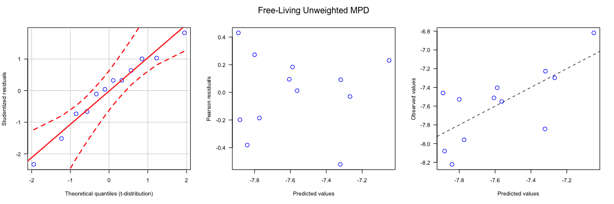

```r
# Residual analysis of the UNWEIGHTED MPD Models: PARTICLE-ASSOCIATED
PA_unweight_sesMPD_df <- dplyr::filter(unweighted_sesMPD_taxalab, fraction == "WholePart" & !is.na(fracprod_per_cell_noinf))

plot_residuals(lm_model = percell_lmPA_unweightedMPD_taxalab, 
               lm_observed_y = log10(PA_unweight_sesMPD_df$fracprod_per_cell_noinf),
               main_title = "Particle-Associated Unweighted MPD")
```

```
## Warning in rlm.default(x, y, weights, method = method, wt.method = wt.method, : 'rlm' failed to converge in 20 steps
```

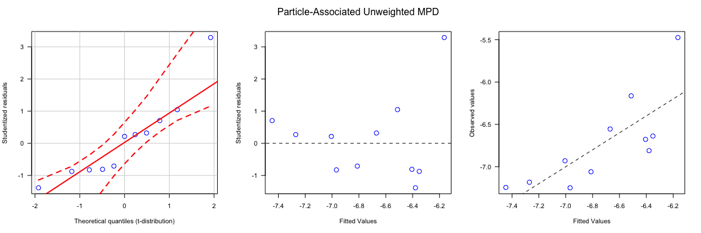

```r
######################################################### UNWEIGHTED MNTD
# Residual analysis of the UNWEIGHTED MNTD Models: PARTICLE-ASSOCIATED
PA_unweight_sesMNTD_df <- filter(unweighted_sesMNTD_taxalab, fraction == "WholePart" & !is.na(fracprod_per_cell_noinf))

plot_residuals(lm_model = percell_lmPA_unweightedMNTD_taxalab, 
               lm_observed_y = log10(PA_unweight_sesMNTD_df$fracprod_per_cell_noinf),
               main_title = "Particle-Associated Unweighted MNTD")
```


```r
######################################################### WEIGHTED MNTD 
# Residual analysis of the WEIGHTED MNTD Models: FREE-LIVING
FL_unweight_sesMNTD_df <- filter(WEIGHTED_sesMNTD_taxalab, fraction == "WholeFree" & !is.na(fracprod_per_cell_noinf))

plot_residuals(lm_model = percell_lmFL_weightedMNTD_taxalab, 
               lm_observed_y = log10(FL_unweight_sesMNTD_df$fracprod_per_cell_noinf),
               main_title = "Free-Living Weighted MNTD")
```

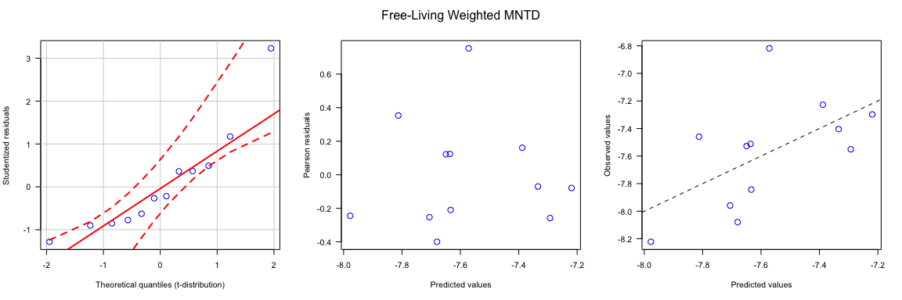


```r
# Plot it altogether 
plot_grid(unweightedMPD_vs_fracprod_taxlab + ggtitle("") +
            xlab("Unweighted Mean Pairwise Distance") +
            theme(legend.position = "none"), 
          unweightedMNTD_vs_fracprod_taxlab + ggtitle("") +
            xlab("Unweighted Mean Nearest Taxon Distance") +
            theme(legend.position = "none"), 
          taxlab_weight_mpd +  xlab("\n Fraction \n") +
            theme(axis.text.y = element_blank()) + 
            ylab("Weighted Mean Pairwise Distance") +
            annotate("text", x=1.55, y=1.6, fontface = "bold",  size = 3.5, color = "gray40",
                       label= paste("***\np =", round(weight_MPD_wilcox$p.value, digits = 6))) + 
            coord_flip(),
          taxlab_weight_mntd + xlab("\n Fraction \n") +
            theme(axis.text.y = element_blank()) + 
            ylab("Weighted Mean Nearest Taxon Distance") +
            annotate("text", x=1.5, y=0.5, fontface = "bold",  size = 3.5, color = "gray40",
                       label= paste("***\np =", round(weight_MNTD_wilcox$p.value, digits = 3))) + 
            coord_flip(), 
          labels = c("A", "B", "C", "D"), 
          ncol = 2, nrow = 2)
```

```
## Warning in grid.Call(L_stringMetric, as.graphicsAnnot(x$label)): conversion failure on '(μgC/L/hr)' in 'mbcsToSbcs': dot substituted for <ce>
```

```
## Warning in grid.Call(L_stringMetric, as.graphicsAnnot(x$label)): conversion failure on '(μgC/L/hr)' in 'mbcsToSbcs': dot substituted for <bc>
```

```
## Warning in grid.Call(L_stringMetric, as.graphicsAnnot(x$label)): conversion failure on '(μgC/L/hr)' in 'mbcsToSbcs': dot substituted for <ce>
```

```
## Warning in grid.Call(L_stringMetric, as.graphicsAnnot(x$label)): conversion failure on '(μgC/L/hr)' in 'mbcsToSbcs': dot substituted for <bc>
```

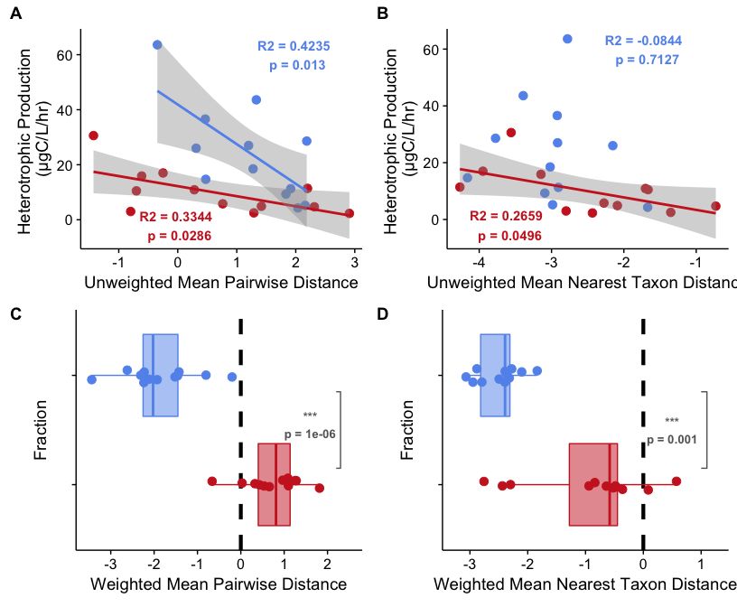

## Congruency between fractions 

```r
rich_df <- ML_otu_rich_stats %>%
  dplyr::select(norep_filter_name, mean, sd, measure, fraction) %>%
  mutate(norep_water_name = paste(substr(norep_filter_name, 1,4), substr(norep_filter_name, 6,9), sep = "")) %>%
  spread(fraction, mean) 

rich_part_df <- dplyr::select(rich_df, norep_water_name, WholePart) %>%
  distinct() %>%  filter(!is.na(WholePart))

rich_free_df <- dplyr::select(rich_df, norep_water_name, WholeFree) %>%
  distinct() %>%  filter(!is.na(WholeFree))

combined_rich_df <- left_join(rich_free_df, rich_part_df, by = "norep_water_name") %>%
  rename(names = norep_water_name) %>%
  make_metadata_norep() %>%
  dplyr::select(-c(year, fraction, month, season, nuc_acid_type, project))


summary(lm(WholePart ~ WholeFree, data = combined_rich_df))
```

```
## 
## Call:
## lm(formula = WholePart ~ WholeFree, data = combined_rich_df)
## 
## Residuals:
##     Min      1Q  Median      3Q     Max 
## -122.70 -106.94  -29.13   45.48  355.39 
## 
## Coefficients:
##             Estimate Std. Error t value Pr(>|t|)
## (Intercept) 271.8734   157.9006   1.722    0.116
## WholeFree     0.6495     0.5407   1.201    0.257
## 
## Residual standard error: 146 on 10 degrees of freedom
## Multiple R-squared:  0.1261,	Adjusted R-squared:  0.03868 
## F-statistic: 1.443 on 1 and 10 DF,  p-value: 0.2574
```

```r
ggplot(combined_rich_df, aes(x=WholePart, y=WholeFree)) + 
  geom_point(size = 3.5) +
  geom_abline(intercept = 0, slope = 1)
```

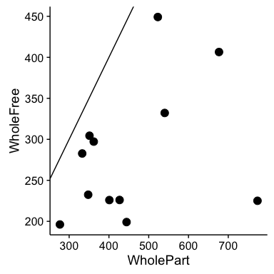


<!-- # Total Production  --> 


# Beta Diversity Analysis


```r
scale_otu_merged_musk_pruned <- scale_reads(otu_merged_musk_pruned_noMOTHJ715_MBRHP715, round = "matround")
scale_otu_merged_musk_pruned # ALL Samples phyloseq object
```

```
## phyloseq-class experiment-level object
## otu_table()   OTU Table:         [ 8814 taxa and 161 samples ]
## sample_data() Sample Data:       [ 161 samples by 64 sample variables ]
## tax_table()   Taxonomy Table:    [ 8814 taxa by 8 taxonomic ranks ]
```

```r
# Check the sequencing depth of each sample 
scaled_sums_otu <- data.frame(rowSums(otu_table(scale_otu_merged_musk_pruned)))
colnames(scaled_sums_otu) <- "Sample_TotalSeqs"
scaled_sums_otu$names <- row.names(scaled_sums_otu)
scaled_sums_otu <- arrange(scaled_sums_otu, Sample_TotalSeqs) %>%
  make_metadata_norep()

##  Plot based on all samples 
plot_sample_sums(dataframe = scaled_sums_otu, x_total_seqs = "Sample_TotalSeqs", fill_variable = "project")
```

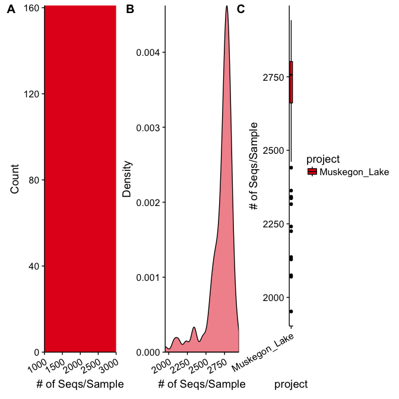

```r
##  Plot based on depth of samples 
plot_sample_sums(dataframe = scaled_sums_otu, x_total_seqs = "Sample_TotalSeqs", fill_variable = "limnion")
```

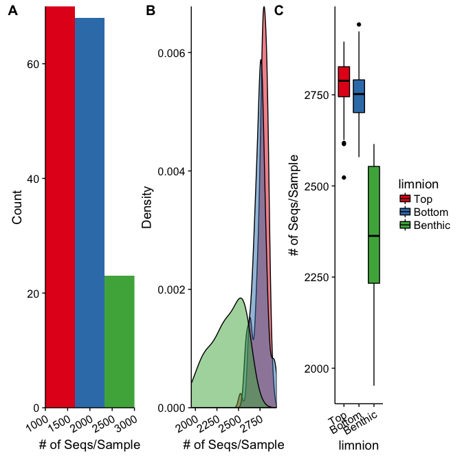

```r
##  Plot based on depth of samples WITHOUT SEDIMENT!
plot_sample_sums(dataframe = filter(scaled_sums_otu, limnion != "Benthic"), 
                 x_total_seqs = "Sample_TotalSeqs", fill_variable = "limnion")
```

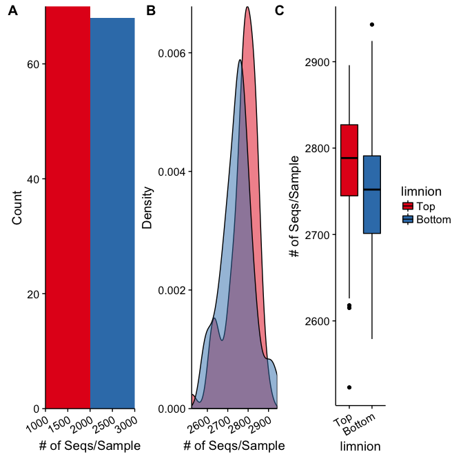

```r
### Subset out samples that we only have productivity data for
productivity_scale_int <- subset_samples(scale_otu_merged_musk_pruned, limnion == "Top" & year == "2015" & 
                                           fraction %in% c("WholePart", "WholeFree"))

productivity_scale <- prune_taxa(taxa_sums(productivity_scale_int) > 0, productivity_scale_int) 
```


```r
productivity_bray <- phyloseq::distance(productivity_scale, method = "bray")

# make a data frame from the sample_data
sampledf <- data.frame(sample_data(productivity_scale))

# Adonis test
adonis(productivity_bray ~ frac_bacprod, data = sampledf)
```

```
## 
## Call:
## adonis(formula = productivity_bray ~ frac_bacprod, data = sampledf) 
## 
## Permutation: free
## Number of permutations: 999
## 
## Terms added sequentially (first to last)
## 
##              Df SumsOfSqs MeanSqs F.Model      R2 Pr(>F)    
## frac_bacprod  1    0.7430 0.74295  4.1869 0.15988  0.001 ***
## Residuals    22    3.9039 0.17745         0.84012           
## Total        23    4.6468                 1.00000           
## ---
## Signif. codes:  0 '***' 0.001 '**' 0.01 '*' 0.05 '.' 0.1 ' ' 1
```


```r
scaled_productivity_otu_df <- as.matrix(otu_table(productivity_scale))

bray_productivity_otu <- vegdist(scaled_productivity_otu_df, method = "bray", binary = FALSE, upper = TRUE)

# Melt the bray curtis distance to a dataframe
bray <- reshape2::melt(as.matrix(bray_productivity_otu), varnames = c("samp1", "samp2"))
bray <- subset(bray, value > 0) # Remove the samples compared to themselves


bray$lakesite1 <- substr(bray$samp1,2,3) # Create a new column called lakenames1 with first 3 letters of string
bray$lakesite2 <- substr(bray$samp2,2,3) # Create a new column called lakenames2 with first 3 letters of string
bray$limnion1 <- substr(bray$samp1, 4, 4) # Create a column called limnon1 with hypo or epi
bray$limnion2 <- substr(bray$samp2, 4, 4) # Create a column called limnon2 with hypo or epi
bray$filter1 <- substr(bray$samp1, 5, 5)  # Create a column called filter1 with PA or FL
bray$filter2 <- substr(bray$samp2, 5, 5) # Create a column called filter2 with PA or FL
bray$month1 <- substr(bray$samp1, 6, 6)  # Create a column called month1 with may, july, or september
bray$month2 <- substr(bray$samp2, 6, 6) # Create a column called month2 with may, july, or september
bray$year1 <- substr(bray$samp1, 7, 9) # Create a column called year1 with 2014 or 2015
bray$year2 <- substr(bray$samp2, 7, 9) # Create a column called year2 with 2014 or 2015


  # Depth in water column
bray$limnion1 <- ifelse(bray$limnion1 == "E", "Top", NA)
bray$limnion2 <- ifelse(bray$limnion2 == "E", "Top", NA)
  
# fraction Fraction
bray$filter1 <- ifelse(bray$filter1 == "F", "Free", 
                             ifelse(bray$filter1 == "P", "Particle",
                                    ifelse(bray$filter1 == "J","WholePart",
                                           ifelse(bray$filter1 == "K","WholeFree", NA))))
bray$filter2 <- ifelse(bray$filter2 == "F", "Free", 
                             ifelse(bray$filter2 == "P", "Particle",
                                    ifelse(bray$filter2 == "J","WholePart",
                                           ifelse(bray$filter2 == "K","WholeFree", NA))))


# Stop calculations if sample1 is equal to sample2
stopifnot(nrow(dplyr::filter(bray, samp1 == samp2)) == 0)


##  Add productivity data to bray dataframe
prod_data <- sample_data(productivity_scale) %>%
  dplyr::select(norep_filter_name, frac_bacprod) %>%
  mutate(frac_bacprod = round(frac_bacprod, digits = 1),
         samp1 = norep_filter_name) %>%
  dplyr::select(-norep_filter_name)
```

```
## Warning in class(x) <- c("tbl_df", "tbl", "data.frame"): Setting class(x) to multiple strings ("tbl_df", "tbl", ...); result will no longer be an S4 object
```

```r
# Add fraction production for sample1
bray_frac1 <- right_join(bray, prod_data, by = "samp1") %>%
  rename(frac_prod1 = frac_bacprod)
```

```
## Warning in right_join_impl(x, y, by$x, by$y, suffix$x, suffix$y): joining factor and character vector, coercing into character vector
```

```r
# Add fraction production for sample2
bray_final <- right_join(bray_frac1, rename(prod_data, samp2 = samp1), by = "samp2") %>%
  rename(frac_prod2 = frac_bacprod) %>%
  mutate(delta_frac_bacprod = abs(frac_prod1 - frac_prod2),
         filter_match = ifelse(filter1 == filter2, filter1, "diff_filter"))
```

```
## Warning in right_join_impl(x, y, by$x, by$y, suffix$x, suffix$y): joining factor and character vector, coercing into character vector
```

```r
ggplot(bray_final, aes(x = value, y = delta_frac_bacprod, color = filter_match)) +
  geom_point() +
  facet_grid(.~filter_match) + 
  xlab("Bray-Curtis Dissimilarity") + ylab("Difference Fraction Productvity") +
  geom_smooth() +
  theme(legend.position = c(0.9, 0.85),legend.title = element_blank())
```

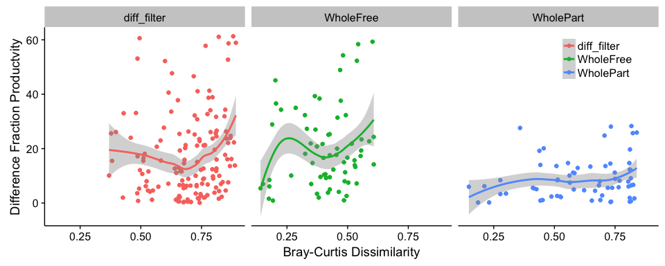

```r
#### Difference between filter comparisons?
bray_kruskal <- kruskal.test(value ~ as.factor(filter_match), data = bray_final)
bray_kruskal
```

```
## 
## 	Kruskal-Wallis rank sum test
## 
## data:  value by as.factor(filter_match)
## Kruskal-Wallis chi-squared = 208.69, df = 2, p-value < 2.2e-16
```

```r
library(pgirmess)
```

```
## Error in library(pgirmess): there is no package called 'pgirmess'
```

```r
library(multcompView)
```

```
## Error in library(multcompView): there is no package called 'multcompView'
```

```r
bray_kruskal_MC <- kruskalmc(bray_final$value ~ bray_final$filter_match)  ## Defaults to P < 0.05
```

```
## Error in eval(expr, envir, enclos): could not find function "kruskalmc"
```

```r
#print(bray_prod_KW_MC)
### Time to figure out letters to represent significance in a plot
bray_test <- bray_kruskal_MC$dif.com$difference # select logical vector
```

```
## Error in eval(expr, envir, enclos): object 'bray_kruskal_MC' not found
```

```r
names(bray_test) <- row.names(bray_kruskal_MC$dif.com) # add comparison names
```

```
## Error in row.names(bray_kruskal_MC$dif.com): object 'bray_kruskal_MC' not found
```

```r
# create a list with "homogenous groups" coded by letter
bray_letters <- multcompLetters(bray_test, compare="<", threshold=0.05, 
                                 Letters=c(letters, LETTERS, "."), reversed = FALSE)
```

```
## Error in eval(expr, envir, enclos): could not find function "multcompLetters"
```

```r
###  Extract the values from the multcompLetters object
bray_sigs_dataframe <-  data.frame(as.vector(names(bray_letters$Letters)), as.vector(bray_letters$Letters))
```

```
## Error in as.vector(names(bray_letters$Letters)): object 'bray_letters' not found
```

```r
colnames(bray_sigs_dataframe) <- c("filter_match", "siglabel")
```

```
## Error in colnames(bray_sigs_dataframe) <- c("filter_match", "siglabel"): object 'bray_sigs_dataframe' not found
```

```r
bray_try <- left_join(bray_final, bray_sigs_dataframe, by = "filter_match")
```

```
## Error in is.data.frame(y): object 'bray_sigs_dataframe' not found
```

```r
bray_sigs <- bray_try %>%
  dplyr::select(filter_match, siglabel) %>%
  distinct()
```

```
## Error in eval(expr, envir, enclos): object 'bray_try' not found
```

```r
bray_box <- ggplot(bray_try, aes(y = value, x = filter_match, color = filter_match, fill = filter_match)) +
  geom_boxplot(alpha = 0.3) + geom_jitter(size = 3) + 
  scale_y_continuous(limits = c(0.1, 0.95), breaks = c(0.1, 0.3, 0.5, 0.7, 0.9)) +
  geom_text(data = bray_sigs, aes(label = siglabel, x = filter_match, y = 0.95), size =5, color = "black") +
  ylab("Bray-Curtis Dissimilarity") + xlab("Filter Comparison") +
  ggtitle("Bray-Curtis") + 
  theme(legend.position = "none")
```

```
## Error in ggplot(bray_try, aes(y = value, x = filter_match, color = filter_match, : object 'bray_try' not found
```


```r
soren_productivity_otu <- vegdist(data.frame(otu_table(productivity_scale)), method = "bray", binary = TRUE)

# Melt the soren curtis distance to a dataframe
soren <- reshape2::melt(as.matrix(soren_productivity_otu), varnames = c("samp1", "samp2"))
soren <- subset(soren, value > 0) # Remove the samples compared to themselves


soren$lakesite1 <- substr(soren$samp1,2,3) # Create a new column called lakenames1 with first 3 letters of string
soren$lakesite2 <- substr(soren$samp2,2,3) # Create a new column called lakenames2 with first 3 letters of string
soren$limnion1 <- substr(soren$samp1, 4, 4) # Create a column called limnon1 with hypo or epi
soren$limnion2 <- substr(soren$samp2, 4, 4) # Create a column called limnon2 with hypo or epi
soren$filter1 <- substr(soren$samp1, 5, 5)  # Create a column called filter1 with PA or FL
soren$filter2 <- substr(soren$samp2, 5, 5) # Create a column called filter2 with PA or FL
soren$month1 <- substr(soren$samp1, 6, 6)  # Create a column called month1 with may, july, or september
soren$month2 <- substr(soren$samp2, 6, 6) # Create a column called month2 with may, july, or september
soren$year1 <- substr(soren$samp1, 7, 9) # Create a column called year1 with 2014 or 2015
soren$year2 <- substr(soren$samp2, 7, 9) # Create a column called year2 with 2014 or 2015


  # Depth in water column
soren$limnion1 <- ifelse(soren$limnion1 == "E", "Top", NA)
soren$limnion2 <- ifelse(soren$limnion2 == "E", "Top", NA)
  
# fraction Fraction
soren$filter1 <- ifelse(soren$filter1 == "F", "Free", 
                             ifelse(soren$filter1 == "P", "Particle",
                                    ifelse(soren$filter1 == "J","WholePart",
                                           ifelse(soren$filter1 == "K","WholeFree", NA))))
soren$filter2 <- ifelse(soren$filter2 == "F", "Free", 
                             ifelse(soren$filter2 == "P", "Particle",
                                    ifelse(soren$filter2 == "J","WholePart",
                                           ifelse(soren$filter2 == "K","WholeFree", NA))))


# Stop calculations if sample1 is equal to sample2
stopifnot(nrow(dplyr::filter(soren, samp1 == samp2)) == 0)


##  Add productivity data to soren dataframe
prod_data <- sample_data(productivity_scale) %>%
  dplyr::select(norep_filter_name, frac_bacprod) %>%
  mutate(frac_bacprod = round(frac_bacprod, digits = 1),
         samp1 = norep_filter_name) %>%
  dplyr::select(-norep_filter_name)
```

```
## Warning in class(x) <- c("tbl_df", "tbl", "data.frame"): Setting class(x) to multiple strings ("tbl_df", "tbl", ...); result will no longer be an S4 object
```

```r
# Add fraction production for sample1
soren_frac1 <- right_join(soren, prod_data, by = "samp1") %>%
  rename(frac_prod1 = frac_bacprod)
```

```
## Warning in right_join_impl(x, y, by$x, by$y, suffix$x, suffix$y): joining factor and character vector, coercing into character vector
```

```r
# Add fraction production for sample2
soren_final <- right_join(soren_frac1, rename(prod_data, samp2 = samp1), by = "samp2") %>%
  rename(frac_prod2 = frac_bacprod) %>%
  mutate(delta_frac_bacprod = abs(frac_prod1 - frac_prod2),
         filter_match = ifelse(filter1 == filter2, filter1, "diff_filter"))
```

```
## Warning in right_join_impl(x, y, by$x, by$y, suffix$x, suffix$y): joining factor and character vector, coercing into character vector
```

```r
ggplot(soren_final, aes(x = value, y = delta_frac_bacprod, color = filter_match)) +
  geom_point() +
  facet_grid(.~filter_match) + 
  xlab("Sørensen Dissimilarity") + ylab("Difference Fraction Productvity") +
  geom_smooth() +
  theme(legend.position = c(0.9, 0.85),legend.title = element_blank())
```

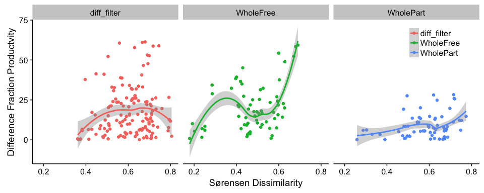

```r
###  Is there a difference in Sorensen Values between the different filter comparisons?
soren_kruskal <- kruskal.test(value ~ as.factor(filter_match), data = soren_final)
soren_kruskal
```

```
## 
## 	Kruskal-Wallis rank sum test
## 
## data:  value by as.factor(filter_match)
## Kruskal-Wallis chi-squared = 99.955, df = 2, p-value < 2.2e-16
```

```r
soren_kruskal_MC <- kruskalmc(soren_final$value ~ soren_final$filter_match)  ## Defaults to P < 0.05
```

```
## Error in eval(expr, envir, enclos): could not find function "kruskalmc"
```

```r
#print(soren_prod_KW_MC)
### Time to figure out letters to represent significance in a plot
soren_test <- soren_kruskal_MC$dif.com$difference # select logical vector
```

```
## Error in eval(expr, envir, enclos): object 'soren_kruskal_MC' not found
```

```r
names(soren_test) <- row.names(soren_kruskal_MC$dif.com) # add comparison names
```

```
## Error in row.names(soren_kruskal_MC$dif.com): object 'soren_kruskal_MC' not found
```

```r
# create a list with "homogenous groups" coded by letter
soren_letters <- multcompLetters(soren_test, compare="<", threshold=0.05, 
                                 Letters=c(letters, LETTERS, "."), reversed = FALSE)
```

```
## Error in eval(expr, envir, enclos): could not find function "multcompLetters"
```

```r
###  Extract the values from the multcompLetters object
soren_sigs_dataframe <-  data.frame(as.vector(names(soren_letters$Letters)), as.vector(soren_letters$Letters))
```

```
## Error in as.vector(names(soren_letters$Letters)): object 'soren_letters' not found
```

```r
colnames(soren_sigs_dataframe) <- c("filter_match", "siglabel")
```

```
## Error in colnames(soren_sigs_dataframe) <- c("filter_match", "siglabel"): object 'soren_sigs_dataframe' not found
```

```r
soren_try <- left_join(soren_final, soren_sigs_dataframe, by = "filter_match")
```

```
## Error in is.data.frame(y): object 'soren_sigs_dataframe' not found
```

```r
soren_sigs <- soren_try %>%
  dplyr::select(filter_match, siglabel) %>%
  distinct()
```

```
## Error in eval(expr, envir, enclos): object 'soren_try' not found
```

```r
soren_box <- ggplot(soren_try, aes(y = value, x = filter_match, color = filter_match, fill = filter_match)) +
  geom_boxplot(alpha = 0.3) + geom_jitter(size = 3) + 
  scale_y_continuous(limits = c(0.1, 0.95), breaks = c(0.1, 0.3, 0.5, 0.7, 0.9)) +
  geom_text(data = soren_sigs, aes(label = siglabel, x = filter_match, y = 0.85), size =5, color = "black") +
  ylab("Sørensen Dissimilarity") + xlab("Filter Comparison") +
  ggtitle("Sørensen") + 
  theme(legend.position = "none"); 
```

```
## Error in ggplot(soren_try, aes(y = value, x = filter_match, color = filter_match, : object 'soren_try' not found
```

```r
soren_box <- ggplot(soren_try, aes(y = value, x = filter_match, color = filter_match, fill = filter_match)) +
  geom_boxplot(alpha = 0.3) + geom_jitter(size = 3) + 
  scale_y_continuous(limits = c(0.1, 0.95), breaks = c(0.1, 0.3, 0.5, 0.7, 0.9)) +
  geom_text(data = soren_sigs, aes(label = siglabel, x = filter_match, y = 0.85), size =5, color = "black") +
  ylab("Sørensen Dissimilarity") + xlab("Filter Comparison") +
  ggtitle("Sørensen") + 
  theme(legend.position = "none")
```

```
## Error in ggplot(soren_try, aes(y = value, x = filter_match, color = filter_match, : object 'soren_try' not found
```


```r
plot_grid(soren_box, bray_box, labels = c("A", "B"), ncol = 2)
```

```
## Error in plot_grid(soren_box, bray_box, labels = c("A", "B"), ncol = 2): object 'soren_box' not found
```

<!-- # Prefiltered Fraction Diversity-Production Analysis --> 


<!-- # Does DNA extraction concentration influcence diversity? --> 


